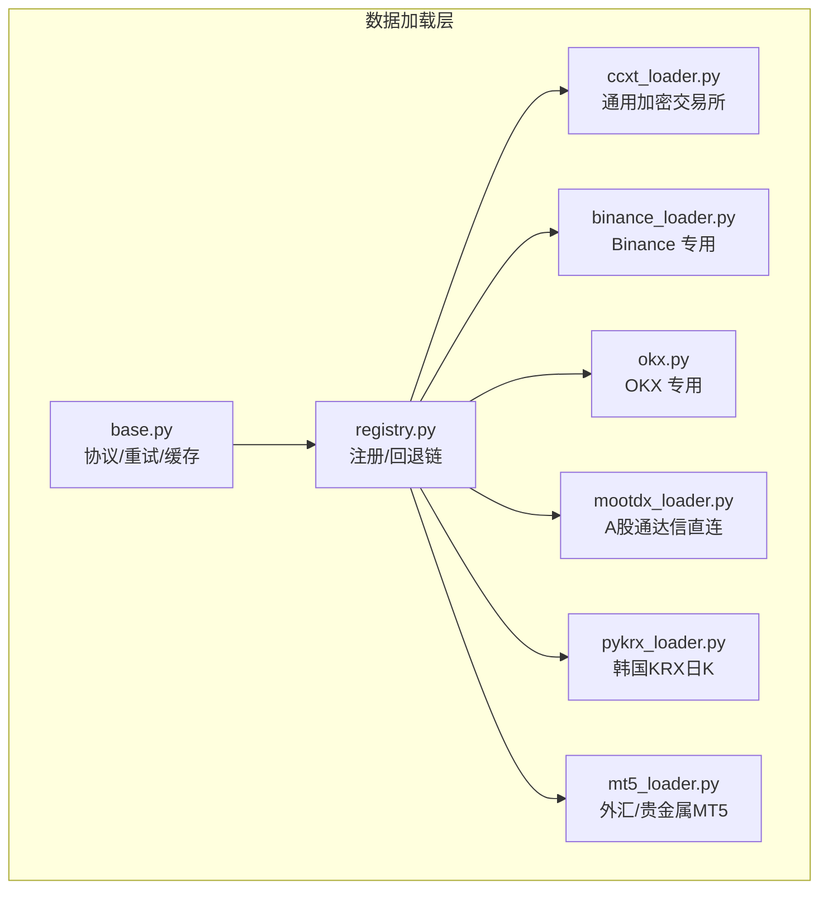
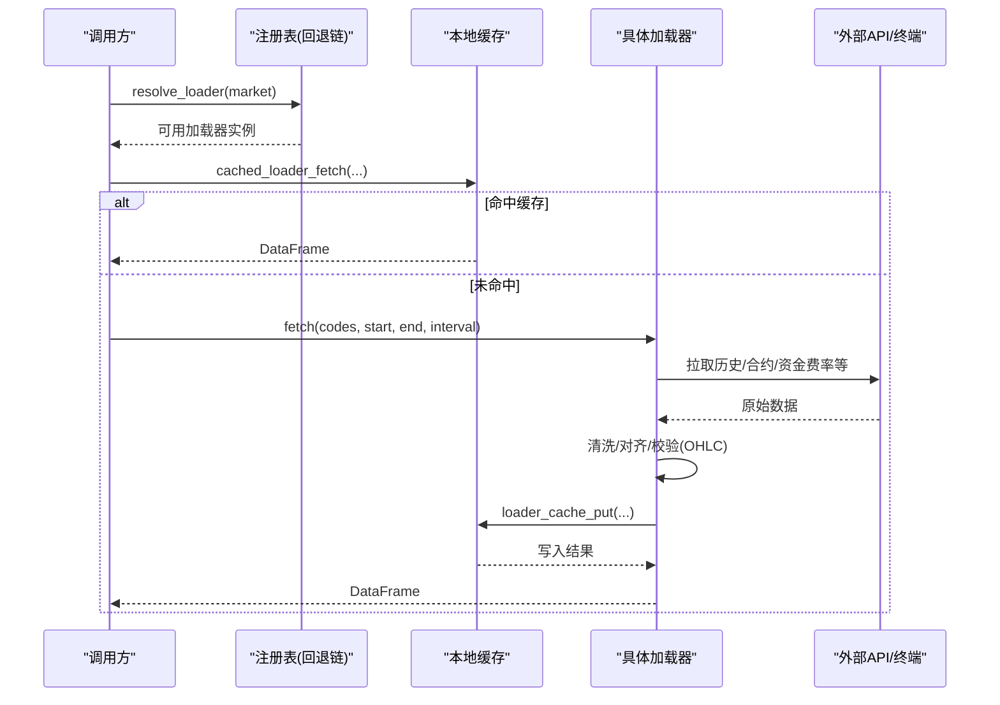
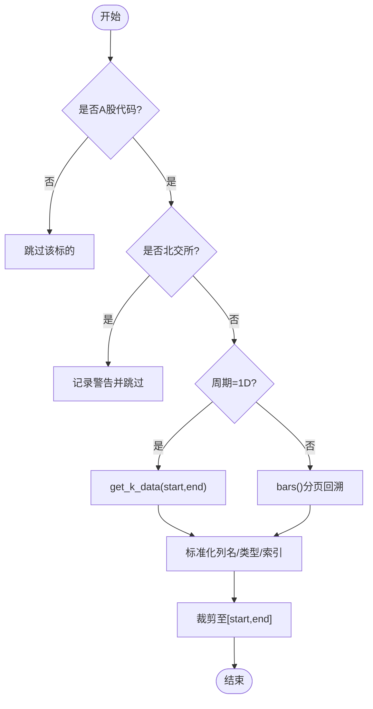
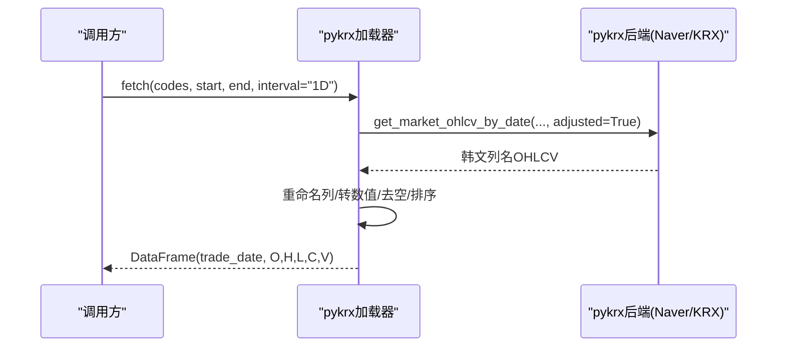
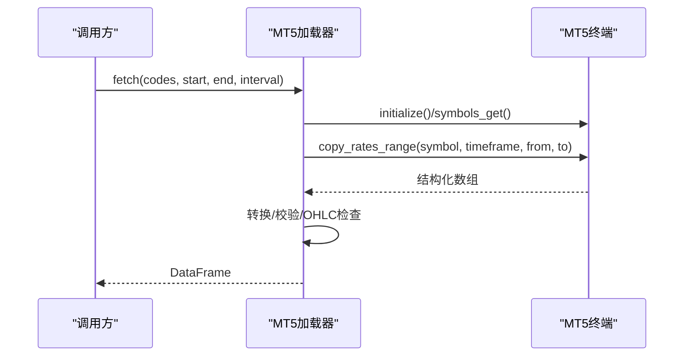
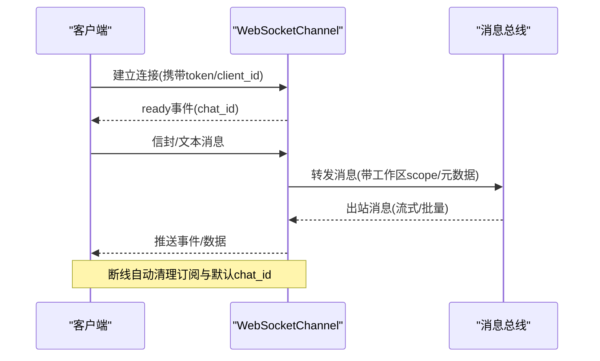
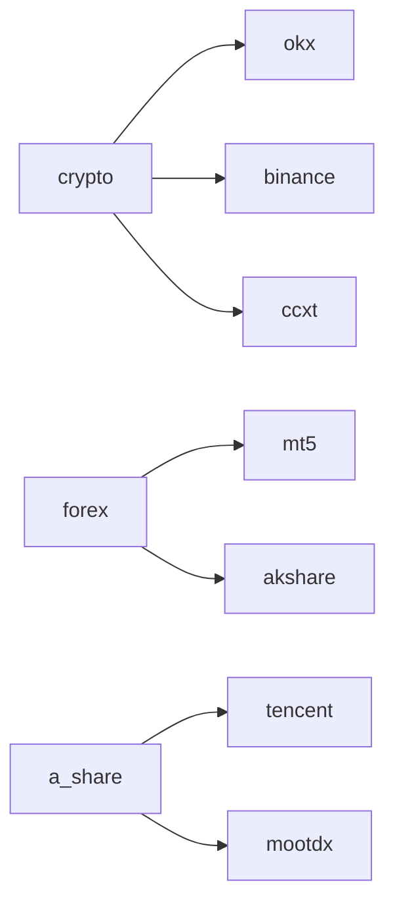

# 专业数据源

<cite>
**本文引用的文件**
- [base.py](file://agent/backtest/loaders/base.py)
- [registry.py](file://agent/backtest/loaders/registry.py)
- [ccxt_loader.py](file://agent/backtest/loaders/ccxt_loader.py)
- [binance_loader.py](file://agent/backtest/loaders/binance_loader.py)
- [okx.py](file://agent/backtest/loaders/okx.py)
- [mootdx_loader.py](file://agent/backtest/loaders/mootdx_loader.py)
- [pykrx_loader.py](file://agent/backtest/loaders/pykrx_loader.py)
- [mt5_loader.py](file://agent/backtest/loaders/mt5_loader.py)
- [websocket.py](file://agent/src/channels/websocket.py)
</cite>

## 目录
1. [简介](#简介)
2. [项目结构](#项目结构)
3. [核心组件](#核心组件)
4. [架构总览](#架构总览)
5. [详细组件分析](#详细组件分析)
6. [依赖关系分析](#依赖关系分析)
7. [性能考量](#性能考量)
8. [故障排除指南](#故障排除指南)
9. [结论](#结论)
10. [附录](#附录)

## 简介
本文件面向“专业数据源加载器”的构建与使用，覆盖加密货币交易所（Binance、OKX）、外汇与期货（MetaTrader 5）、韩国市场（Korea Exchange via pykrx），以及国内特色数据源（Mootdx）。文档重点包括：
- 各数据源的 API 集成方式、合约与资金费率等特殊能力
- 统一的数据契约、重试与预算控制、本地缓存机制
- 实时数据流处理（WebSocket）的连接管理、消息解析与状态同步
- 配置指南与故障排除（认证、速率限制、错误恢复）

## 项目结构
数据加载器位于 agent/backtest/loaders 下，采用“按市场/平台拆分 + 统一注册与回退链”的组织方式。核心基类与工具在 base.py，注册表与回退策略在 registry.py；具体平台实现以独立模块提供。



图表来源
- [base.py:1-657](file://agent/backtest/loaders/base.py#L1-L657)
- [registry.py:1-256](file://agent/backtest/loaders/registry.py#L1-L256)

章节来源
- [base.py:1-657](file://agent/backtest/loaders/base.py#L1-L657)
- [registry.py:1-256](file://agent/backtest/loaders/registry.py#L1-L256)

## 核心组件
- 统一数据契约：所有加载器返回 {symbol: DataFrame}，DataFrame 索引为 trade_date，包含 open/high/low/close/volume。
- 重试与预算：通过 check_budget 与 retry_with_budget 对网络波动进行有界重试，避免长时间挂起。
- 本地缓存：基于内容寻址的 parquet 缓存，仅对已结算区间生效，读写失败不阻塞主流程。
- OHLC 校验：validate_ohlc 保证高低价与开收价的逻辑一致，并支持允许非正价格的特殊市场。
- 注册与回退：registry 维护市场到数据源的优先级链，自动选择可用加载器。

章节来源
- [base.py:168-256](file://agent/backtest/loaders/base.py#L168-L256)
- [base.py:377-450](file://agent/backtest/loaders/base.py#L377-L450)
- [base.py:243-441](file://agent/backtest/loaders/base.py#L243-L441)
- [registry.py:139-158](file://agent/backtest/loaders/registry.py#L139-L158)

## 架构总览
下图展示从调用方到具体数据源的请求路径，包括回退链、缓存与重试。



图表来源
- [registry.py:614-649](file://agent/backtest/loaders/registry.py#L614-L649)
- [base.py:623-661](file://agent/backtest/loaders/base.py#L623-L661)
- [okx.py:131-208](file://agent/backtest/loaders/okx.py#L131-L208)
- [ccxt_loader.py:226-308](file://agent/backtest/loaders/ccxt_loader.py#L226-L308)

## 详细组件分析

### 加密货币：CCXT 通用加载器与 Binance/OKX 专用
- CCXT 加载器
  - 支持 100+ 交易所，默认 Binance；可通过环境变量切换。
  - 支持现货与 USD-M 永续合约：-PERP 符号会映射到 swap 类型，拉取交易价格与标记价格并对齐时间戳。
  - 资金费率：分页拉取历史资金费率，按固定结算小时对齐到 K 线。
  - 维护保证金档位：通过外部版本化 artifact 注入，不在历史路径中发起鉴权请求。
  - 超时与重试：每页请求受限于 CCXT_TIMEOUT_MS，整体拉取受 _CCXT_FETCH_BUDGET_S 约束，网络异常自动重试。
- Binance 专用
  - 直接构造 ccxt.binance 或 ccxt.binanceusdm，启用限速与代理。
- OKX 专用
  - 使用 V5 公开 REST：近期蜡烛 / 历史蜡烛双端点，深度范围优先 history-candles。
  - 代理与超时：支持 HTTP(S)_PROXY 系列环境变量；HTTP 429/5xx 与业务码非 0 时抛出可重试异常。
  - 确认与未确认 K 线：优先保留已确认行，若为空则退回未确认以保证当日部分数据可用。

```mermaid
classDiagram
class DataLoader_CCXT {
+fetch(codes,start,end,interval,fields,bracket_artifacts,require_brackets) dict
-_get_exchange(instrument_type)
-_fetch_perpetual(...)
-_fetch_funding_history(...)
-_fetch_one(...)
}
class DataLoader_BINANCE {
+name="binance"
+markets={"crypto"}
-_get_exchange(instrument_type)
}
class DataLoader_OKX {
+name="okx"
+markets={"crypto"}
+is_available() bool
+fetch(...)
-_paginate(...)
}
DataLoader_BINANCE --|> DataLoader_CCXT : "继承"
DataLoader_OKX ..> DataLoader_CCXT : "共享重试/预算/缓存"
```

图表来源
- [ccxt_loader.py:184-308](file://agent/backtest/loaders/ccxt_loader.py#L184-L308)
- [ccxt_loader.py:310-424](file://agent/backtest/loaders/ccxt_loader.py#L310-L424)
- [binance_loader.py:23-44](file://agent/backtest/loaders/binance_loader.py#L23-L44)
- [okx.py:101-208](file://agent/backtest/loaders/okx.py#L101-L208)
- [okx.py:267-372](file://agent/backtest/loaders/okx.py#L267-L372)

章节来源
- [ccxt_loader.py:32-57](file://agent/backtest/loaders/ccxt_loader.py#L32-L57)
- [ccxt_loader.py:226-308](file://agent/backtest/loaders/ccxt_loader.py#L226-L308)
- [ccxt_loader.py:310-424](file://agent/backtest/loaders/ccxt_loader.py#L310-L424)
- [binance_loader.py:23-44](file://agent/backtest/loaders/binance_loader.py#L23-L44)
- [okx.py:101-208](file://agent/backtest/loaders/okx.py#L101-L208)
- [okx.py:267-372](file://agent/backtest/loaders/okx.py#L267-L372)

### 国内 A 股：Mootdx（通达信直连）
- 通过 TCP 直连通达信服务器，不受 HTTP 爬取限频影响。
- 支持分钟/小时/日/周/月等多周期，日内周期通过分页回溯历史覆盖窗口。
- 北交所标的上游不支持，会记录警告并跳过。
- 成交量单位声明为“手”，便于下游统一换算。



图表来源
- [mootdx_loader.py:47-77](file://agent/backtest/loaders/mootdx_loader.py#L47-L77)
- [mootdx_loader.py:96-153](file://agent/backtest/loaders/mootdx_loader.py#L96-L153)
- [mootdx_loader.py:155-207](file://agent/backtest/loaders/mootdx_loader.py#L155-L207)
- [mootdx_loader.py:209-257](file://agent/backtest/loaders/mootdx_loader.py#L209-L257)

章节来源
- [mootdx_loader.py:1-258](file://agent/backtest/loaders/mootdx_loader.py#L1-L258)

### 韩国市场：pykrx（KOSPI/KOSDAQ 日K）
- 免费无鉴权，获取日级 OHLCV。
- 数据来源于 Naver 提供的复权序列（adjusted=True），适合回测。
- 严格限制只接受日级周期，避免误用导致数据粒度不一致。
- 通过 HostThrottle 控制请求间隔，尊重上游礼貌性要求。



图表来源
- [pykrx_loader.py:76-144](file://agent/backtest/loaders/pykrx_loader.py#L76-L144)
- [pykrx_loader.py:146-164](file://agent/backtest/loaders/pykrx_loader.py#L146-L164)
- [pykrx_loader.py:167-193](file://agent/backtest/loaders/pykrx_loader.py#L167-L193)

章节来源
- [pykrx_loader.py:1-194](file://agent/backtest/loaders/pykrx_loader.py#L1-L194)

### 外汇与期货：MetaTrader 5（本地终端）
- 从本地 MT5 终端读取外汇/贵金属历史，使用券商真实合约与交易时段。
- 自动解析 broker symbol（含后缀如 m/z），支持多种周期映射。
- 将 tick_volume 作为成交量代理，并进行 OHLC 校验。
- 需要 Windows 与 MetaTrader5 包，且终端需登录；不可用时回退到其他数据源。



图表来源
- [mt5_loader.py:70-108](file://agent/backtest/loaders/mt5_loader.py#L70-L108)
- [mt5_loader.py:121-167](file://agent/backtest/loaders/mt5_loader.py#L121-L167)
- [mt5_loader.py:170-250](file://agent/backtest/loaders/mt5_loader.py#L170-L250)

章节来源
- [mt5_loader.py:1-251](file://agent/backtest/loaders/mt5_loader.py#L1-L251)

### 实时数据流处理：WebSocket 通道
- WebSocket 服务器：支持本地/Unix Socket、可选 WSS、令牌鉴权与短时效 token 发放。
- 连接生命周期：握手授权、订阅 chat_id、发送 ready、消息路由、断线清理。
- 消息解析：支持新式信封（type 字段）与兼容旧式文本负载；媒体上传大小与 MIME 白名单校验。
- 状态同步：重连后回放活跃目标状态与运行中的轮次时钟，确保 UI 一致性。



图表来源
- [websocket.py:53-94](file://agent/src/channels/websocket.py#L53-L94)
- [websocket.py:264-350](file://agent/src/channels/websocket.py#L264-L350)
- [websocket.py:394-453](file://agent/src/channels/websocket.py#L394-L453)
- [websocket.py:447-528](file://agent/src/channels/websocket.py#L447-L528)
- [websocket.py:530-590](file://agent/src/channels/websocket.py#L530-L590)

章节来源
- [websocket.py:1-800](file://agent/src/channels/websocket.py#L1-L800)

## 依赖关系分析
- 市场到数据源的回退链由 registry 定义，例如 crypto 优先 okx -> binance -> ccxt -> yfinance -> local；forex 优先 mt5 -> akshare -> yfinance -> local。
- 某些数据源必须显式可用（local、qveris、tickerall），不会静默降级到网络源，以避免掩盖配置问题。
- 加载器通过 @register 装饰器自注册，按需导入，缺失依赖时安全跳过。



图表来源
- [registry.py:139-158](file://agent/backtest/loaders/registry.py#L139-L158)

章节来源
- [registry.py:1-256](file://agent/backtest/loaders/registry.py#L1-L256)

## 性能考量
- 请求预算与重试：所有外部拉取均受 _FETCH_BUDGET_S 限制，结合指数退避，避免长尾延迟。
- 分页上限：不同数据源设置最大页数或条数，防止极端查询拖垮服务。
- 本地缓存：仅对已结算区间生效，读写失败不影响主流程；DuckDB Parquet 存储提升 IO 效率。
- 代理与超时：CCXT/OKX 支持 HTTP(S)_PROXY；合理设置超时与探针超时提高可用性。
- 频率限制：pykrx 强制最小间隔；MT5 依赖终端“图表最大K线数”设置。

[本节为通用指导，无需特定文件引用]

## 故障排除指南
- 无法连接数据源
  - 检查 is_available 返回与日志；确认依赖包安装与环境变量（如 CCXT_EXCHANGE、代理）。
  - 对于 MT5，确认 Windows 环境、MetaTrader5 包与已登录终端。
- 速率限制/网络抖动
  - 观察 429/5xx 与 NetworkError；适当增大超时或降低并发；利用内置重试与预算。
- 数据不完整
  - 检查分页上限与时间窗；对于 CCXT 可能触发“历史不完整”异常；OKX 深度历史优先 history-candles。
- 本地缓存问题
  - 缓存仅对已结算区间有效；若 end_date 为未来或当天，不会命中缓存。
- 认证配置
  - MT5 通过 ~/.vibe-trading/mt5.json 配置；WebSocket 支持静态 token 或短时效 token 发放路径。

章节来源
- [base.py:377-450](file://agent/backtest/loaders/base.py#L377-L450)
- [okx.py:109-125](file://agent/backtest/loaders/okx.py#L109-L125)
- [ccxt_loader.py:426-501](file://agent/backtest/loaders/ccxt_loader.py#L426-L501)
- [mt5_loader.py:70-108](file://agent/backtest/loaders/mt5_loader.py#L70-L108)
- [websocket.py:417-453](file://agent/src/channels/websocket.py#L417-L453)

## 结论
本系统通过统一的加载器协议、健壮的重试与预算控制、内容地址化的本地缓存，以及按市场划分的回退链，实现了跨多市场的稳定历史数据获取。针对加密货币、A 股、韩国市场、外汇与期货分别提供了优化实现，并在 WebSocket 通道上提供可靠的实时消息分发与状态同步。通过合理的配置与排障策略，可在复杂网络与第三方 API 环境下保持高可用性与数据质量。

[本节为总结，无需特定文件引用]

## 附录
- 关键环境变量参考
  - CCXT_TIMEOUT_MS、CCXT_FETCH_BUDGET_S：CCXT 请求超时与预算
  - OKX_TIMEOUT_S、OKX_FETCH_BUDGET_S、OKX_PROBE_TIMEOUT_S：OKX 超时与预算
  - VIBE_TRADING_PYKRX_MIN_INTERVAL：pykrx 最小请求间隔
  - ALL_PROXY/HTTP_PROXY/HTTPS_PROXY：代理设置
- 常用配置位置
  - MT5 配置：~/.vibe-trading/mt5.json
  - WebSocket 配置：host/port/path/token/token_issue_path 等

[本节为补充信息，无需特定文件引用]