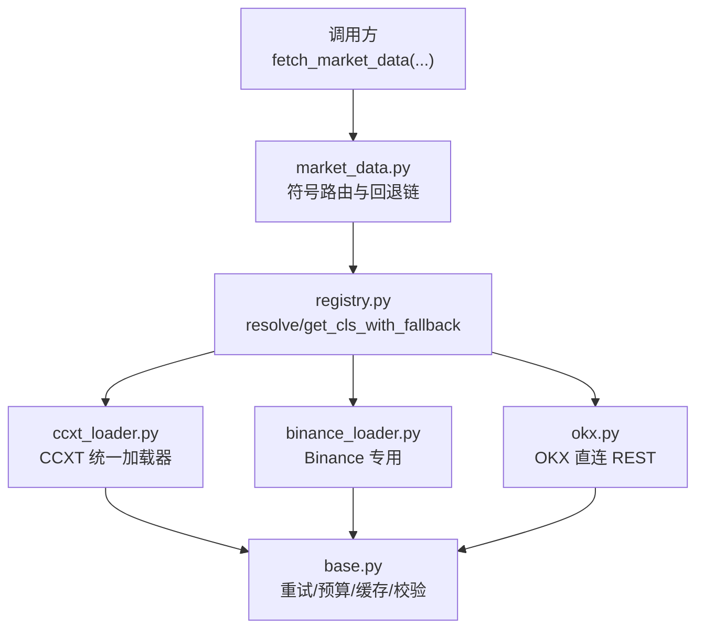
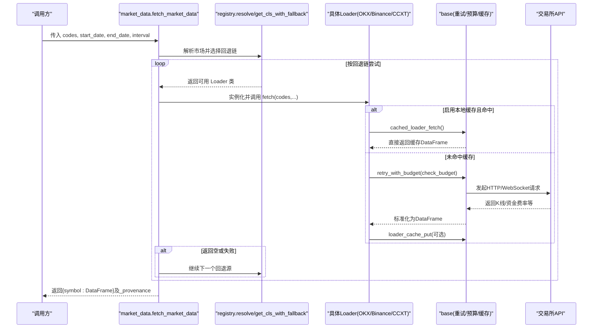
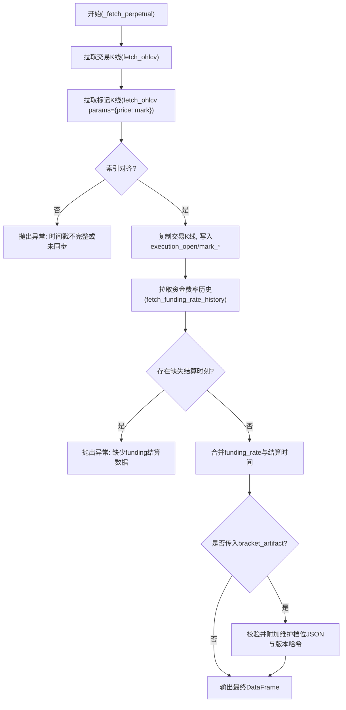
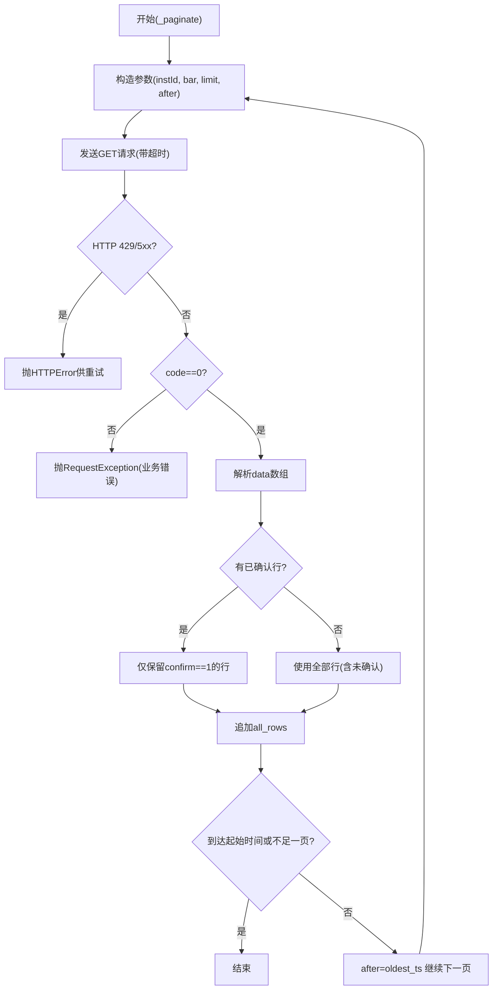
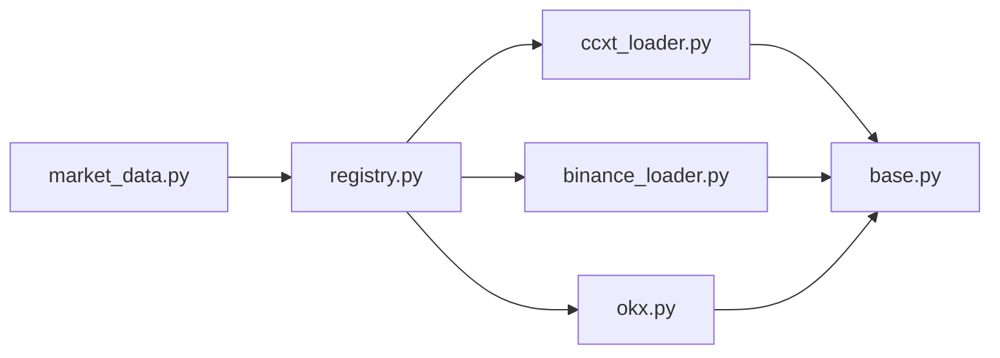

# 加密货币交易所数据源

<cite>
**本文引用的文件**
- [agent/backtest/loaders/ccxt_loader.py](file://agent/backtest/loaders/ccxt_loader.py)
- [agent/backtest/loaders/binance_loader.py](file://agent/backtest/loaders/binance_loader.py)
- [agent/backtest/loaders/okx.py](file://agent/backtest/loaders/okx.py)
- [agent/backtest/loaders/base.py](file://agent/backtest/loaders/base.py)
- [agent/backtest/loaders/registry.py](file://agent/backtest/loaders/registry.py)
- [agent/src/market_data.py](file://agent/src/market_data.py)
- [agent/tests/test_binance_fallback.py](file://agent/tests/test_binance_fallback.py)
- [agent/tests/test_okx_loader_bounded.py](file://agent/tests/test_okx_loader_bounded.py)
</cite>

## 目录
1. [简介](#简介)
2. [项目结构](#项目结构)
3. [核心组件](#核心组件)
4. [架构总览](#架构总览)
5. [详细组件分析](#详细组件分析)
6. [依赖关系分析](#依赖关系分析)
7. [性能考虑](#性能考虑)
8. [故障排除指南](#故障排除指南)
9. [结论](#结论)
10. [附录：常用场景与示例路径](#附录：常用场景与示例路径)

## 简介
本仓库实现了面向加密货币市场的统一数据加载层，覆盖现货、永续合约（含资金费率）等关键数据。通过 CCXT 统一接口对接 Binance、OKX 等多家交易所，提供历史 K 线、合约交易价格与标记价格对齐、资金结算历史等能力；同时内置重试、预算控制、代理、缓存与自动回退机制，确保在弱网或限流环境下稳定获取数据。文档重点说明：
- CCXT 统一接口的使用与扩展方式
- OKX 直连 REST 的历史与近期 K 线拉取策略
- 永续合约的“执行价 + 标记价 + 资金费率”三表对齐
- 认证配置、速率限制、错误恢复与本地缓存
- 实时数据流的接入点与注意事项（当前实现以 REST 为主，WebSocket 需自行扩展）

## 项目结构
围绕数据加载的核心位于 agent/backtest/loaders 目录，按“通用基础 + 具体交易所实现 + 注册与回退”组织：
- base.py：公共工具（重试、预算、校验、本地 Parquet 缓存、协议定义）
- registry.py：加载器注册表与市场级回退链
- ccxt_loader.py：基于 CCXT 的统一加密市场 OHLCV 加载器（支持 spot 与 USD-M 永续）
- binance_loader.py：Binance 专用实现（spot / USD-M swap），作为 crypto 回退链的一环
- okx.py：OKX V5 公开 REST 实现（近期与历史 K 线双端点）
- market_data.py：高层入口，负责符号路由、回退链选择、结果归一化与来源溯源

图表来源
- [agent/src/market_data.py:97-234](file://agent/src/market_data.py#L97-L234)
- [agent/backtest/loaders/registry.py:161-256](file://agent/backtest/loaders/registry.py#L161-L256)
- [agent/backtest/loaders/ccxt_loader.py:184-308](file://agent/backtest/loaders/ccxt_loader.py#L184-L308)
- [agent/backtest/loaders/binance_loader.py:23-45](file://agent/backtest/loaders/binance_loader.py#L23-L45)
- [agent/backtest/loaders/okx.py:101-208](file://agent/backtest/loaders/okx.py#L101-L208)
- [agent/backtest/loaders/base.py:377-450](file://agent/backtest/loaders/base.py#L377-L450)

章节来源
- [agent/src/market_data.py:97-234](file://agent/src/market_data.py#L97-L234)
- [agent/backtest/loaders/registry.py:161-256](file://agent/backtest/loaders/registry.py#L161-L256)

## 核心组件
- DataLoaderProtocol 与共享异常：定义统一的 fetch 接口与不可用时的异常类型，便于扩展新数据源。
- 重试与预算：retry_with_budget 与 check_budget 为所有网络请求提供“有限重试 + 墙钟预算”保障，避免无限挂起。
- 本地缓存：基于 Parquet + DuckDB 的可选本地缓存，命中后跳过网络请求，提升重复查询效率。
- 回退链：crypto 市场默认顺序为 OKX → Binance → CCXT → Yahoo → local，保证多源高可用。
- 符号路由：根据代码模式自动选择首选数据源（如 BTC-USDT 优先走 OKX）。

章节来源
- [agent/backtest/loaders/base.py:164-256](file://agent/backtest/loaders/base.py#L164-L256)
- [agent/backtest/loaders/base.py:377-450](file://agent/backtest/loaders/base.py#L377-L450)
- [agent/backtest/loaders/base.py:243-441](file://agent/backtest/loaders/base.py#L243-L441)
- [agent/backtest/loaders/registry.py:139-158](file://agent/backtest/loaders/registry.py#L139-L158)
- [agent/src/market_data.py:16-57](file://agent/src/market_data.py#L16-L57)

## 架构总览
下图展示了从高层 API 到各数据源的完整调用链路，包括回退与缓存：

图表来源
- [agent/src/market_data.py:97-234](file://agent/src/market_data.py#L97-L234)
- [agent/backtest/loaders/registry.py:161-256](file://agent/backtest/loaders/registry.py#L161-L256)
- [agent/backtest/loaders/base.py:377-450](file://agent/backtest/loaders/base.py#L377-L450)
- [agent/backtest/loaders/base.py:623-661](file://agent/backtest/loaders/base.py#L623-L661)

## 详细组件分析

### CCXT 统一加载器（ccxt_loader.py）
- 功能要点
  - 统一 symbol 解析：将 “BTC-USDT-PERP” 转为 CCXT 的 “BTC/USDT:USDT”，并识别 instrument_type=swap。
  - 分页拉取 OHLCV：每页 limit=1000，带超时与重试，支持 price=mark 参数获取标记价 K 线。
  - 永续合约三表对齐：trade K 线 + mark K 线 + funding_rate_history 对齐时间戳，填充 execution_open/mark_* 列与 funding_rate/funding_settlement_time。
  - 保证金档位（maintenance brackets）：不在线拉取（需要签名鉴权），仅接受外部提供的版本化 artifact 并做严格校验。
  - 预算与重试：每个 fetch 设置 _CCXT_TIMEOUT_MS 与 _CCXT_FETCH_BUDGET_S，防止长时间阻塞。
- 关键流程（永续合约）

图表来源
- [agent/backtest/loaders/ccxt_loader.py:310-372](file://agent/backtest/loaders/ccxt_loader.py#L310-L372)
- [agent/backtest/loaders/ccxt_loader.py:374-424](file://agent/backtest/loaders/ccxt_loader.py#L374-L424)
- [agent/backtest/loaders/ccxt_loader.py:426-501](file://agent/backtest/loaders/ccxt_loader.py#L426-L501)

章节来源
- [agent/backtest/loaders/ccxt_loader.py:60-70](file://agent/backtest/loaders/ccxt_loader.py#L60-L70)
- [agent/backtest/loaders/ccxt_loader.py:184-308](file://agent/backtest/loaders/ccxt_loader.py#L184-L308)
- [agent/backtest/loaders/ccxt_loader.py:310-501](file://agent/backtest/loaders/ccxt_loader.py#L310-L501)

### Binance 专用加载器（binance_loader.py）
- 定位：作为 crypto 回退链中的第二优先级，专用于 Binance 现货与 USD-M 永续。
- 行为：强制使用 ccxt.binance 或 ccxt.binanceusdm，忽略全局 CCXT_EXCHANGE 环境变量，确保一致性。
- 配置：开启 enableRateLimit，设置统一超时，支持代理。

章节来源
- [agent/backtest/loaders/binance_loader.py:1-45](file://agent/backtest/loaders/binance_loader.py#L1-L45)

### OKX 直连加载器（okx.py）
- 端点策略：近期 K 线使用 /market/candles，历史深度优先使用 /market/history-candles；当历史端点失败时回退到近期端点。
- 分页与预算：每页最多 300 条，按 after 游标回溯；整体受 _OKX_FETCH_BUDGET_S 约束。
- 可用性探测：is_available 会发起一次轻量探针请求验证连通性与业务码。
- 代理支持：读取标准代理环境变量注入 requests.Session。
- 数据清洗：保留已确认 K 线，若无可用的已确认则退回未确认行；统一时间戳为 UTC 并去重。

图表来源
- [agent/backtest/loaders/okx.py:267-372](file://agent/backtest/loaders/okx.py#L267-L372)

章节来源
- [agent/backtest/loaders/okx.py:101-208](file://agent/backtest/loaders/okx.py#L101-L208)
- [agent/backtest/loaders/okx.py:220-372](file://agent/backtest/loaders/okx.py#L220-L372)

### 回退链与符号路由（registry.py + market_data.py）
- 回退链：crypto 市场默认顺序为 okx → binance → ccxt → yfinance → local。
- 符号路由：BTC-USDT 优先匹配 okx；若失败则按回退链尝试 binance、ccxt 等。
- 测试覆盖：验证当指定源不可用时，能正确回退至下一源并成功返回数据。

章节来源
- [agent/backtest/loaders/registry.py:139-158](file://agent/backtest/loaders/registry.py#L139-L158)
- [agent/src/market_data.py:16-57](file://agent/src/market_data.py#L16-L57)
- [agent/tests/test_binance_fallback.py:11-42](file://agent/tests/test_binance_fallback.py#L11-L42)

### 本地缓存与校验（base.py）
- 缓存开关：通过配置项启用，仅对已结束的日期范围缓存，避免缓存进行中的最后一根 K 线。
- 存储格式：Parquet + JSON 元数据，使用 DuckDB 读写，原子替换临时文件。
- 键生成：基于 source/symbol/timeframe/start/end/fields 的内容寻址，版本升级后旧条目不再命中。
- OHLC 校验：可配置策略丢弃/警告/拒绝违反 OHLC 不变性的行，保证下游指标计算安全。

章节来源
- [agent/backtest/loaders/base.py:243-441](file://agent/backtest/loaders/base.py#L243-L441)
- [agent/backtest/loaders/base.py:187-256](file://agent/backtest/loaders/base.py#L187-L256)

## 依赖关系分析
- 模块耦合
  - market_data 依赖 registry 决定回退链，再调用具体 loader。
  - 所有 loader 依赖 base 的重试/预算/缓存工具。
  - ccxt_loader 依赖 ccxt 库；binance_loader 复用 ccxt_loader 逻辑但固定交易所；okx 独立实现 HTTP 客户端。
- 外部依赖
  - CCXT：统一交易所抽象，支持 100+ 交易所。
  - requests：OKX 直连 HTTP 客户端。
  - pandas：统一 DataFrame 结构。
  - duckdb：本地缓存读写。
- 潜在循环依赖
  - 无直接循环；loader 之间通过 registry 解耦。

图表来源
- [agent/src/market_data.py:97-234](file://agent/src/market_data.py#L97-L234)
- [agent/backtest/loaders/registry.py:161-256](file://agent/backtest/loaders/registry.py#L161-L256)
- [agent/backtest/loaders/ccxt_loader.py:184-308](file://agent/backtest/loaders/ccxt_loader.py#L184-L308)
- [agent/backtest/loaders/binance_loader.py:23-45](file://agent/backtest/loaders/binance_loader.py#L23-L45)
- [agent/backtest/loaders/okx.py:101-208](file://agent/backtest/loaders/okx.py#L101-L208)
- [agent/backtest/loaders/base.py:377-450](file://agent/backtest/loaders/base.py#L377-L450)

章节来源
- [agent/backtest/loaders/registry.py:161-256](file://agent/backtest/loaders/registry.py#L161-L256)
- [agent/src/market_data.py:97-234](file://agent/src/market_data.py#L97-L234)

## 性能考虑
- 分页与预算
  - CCXT：每页 1000 条，最大页数上限与 _CCXT_FETCH_BUDGET_S 共同限制总耗时。
  - OKX：每页 300 条，max_pages 随周期粒度调整；整体受 _OKX_FETCH_BUDGET_S 限制。
- 重试策略
  - 仅对声明的瞬态异常重试（如网络错误、网关错误），非瞬态错误立即失败，避免无效重试。
- 代理与超时
  - 支持 ALL_PROXY/HTTP_PROXY/HTTPS_PROXY 等环境变量；为每次请求设置合理超时，避免长尾。
- 本地缓存
  - 命中缓存可完全跳过网络 IO；建议对历史区间查询开启缓存以提升重复运行速度。
- 数据质量
  - 统一去除 NaN 与非法 OHLC 行，减少下游计算异常。

[本节为通用指导，不直接分析具体文件]

## 故障排除指南
- 常见问题
  - 数据为空：检查日期范围是否有效、符号是否被正确映射、回退链是否全部不可用。
  - 资金费率缺失：永续合约要求特定结算小时（0/8/16）存在结算记录，否则抛出异常。
  - 保证金档位缺失：若 require_brackets=True 但未提供 artifact，将直接失败。
  - 网络问题：429/5xx 会被重试；若持续失败，检查代理与网络连通性。
- 调试建议
  - 启用日志观察回退过程与失败原因。
  - 通过 is_available 快速判断数据源可用性。
  - 使用较小时间窗口与较粗粒度先验证连通性，再逐步扩大范围。
- 参考测试用例
  - OKX 重试与预算边界、代理注入、双端点回退。
  - Binance 回退链行为验证。

章节来源
- [agent/backtest/loaders/base.py:377-450](file://agent/backtest/loaders/base.py#L377-L450)
- [agent/backtest/loaders/ccxt_loader.py:310-372](file://agent/backtest/loaders/ccxt_loader.py#L310-L372)
- [agent/backtest/loaders/okx.py:109-125](file://agent/backtest/loaders/okx.py#L109-L125)
- [agent/tests/test_okx_loader_bounded.py:64-110](file://agent/tests/test_okx_loader_bounded.py#L64-L110)
- [agent/tests/test_binance_fallback.py:11-42](file://agent/tests/test_binance_fallback.py#L11-L42)

## 结论
该数据加载层以 CCXT 为核心，结合 OKX 直连实现，提供了稳定、可扩展、高性能的加密货币历史数据获取能力。通过回退链、重试与预算控制、本地缓存与严格的 OHLC 校验，能够在复杂网络与交易所限流环境下保持鲁棒性。对于实时数据流，当前实现以 REST 为主；如需 WebSocket 实时行情与订单簿深度，可在现有 loader 基础上扩展订阅与消息处理逻辑，复用重试与预算框架。

[本节为总结性内容，不直接分析具体文件]

## 附录：常用场景与示例路径
- 获取历史 K 线（现货）
  - 入口：market_data.fetch_market_data
  - 回退链：okx → binance → ccxt
  - 参考实现路径：
    - [agent/src/market_data.py:97-234](file://agent/src/market_data.py#L97-L234)
    - [agent/backtest/loaders/okx.py:131-208](file://agent/backtest/loaders/okx.py#L131-L208)
    - [agent/backtest/loaders/ccxt_loader.py:226-308](file://agent/backtest/loaders/ccxt_loader.py#L226-L308)
- 获取永续合约数据（执行价 + 标记价 + 资金费率）
  - 入口：ccxt_loader.DataLoader.fetch（instrument_type=swap）
  - 参考实现路径：
    - [agent/backtest/loaders/ccxt_loader.py:310-372](file://agent/backtest/loaders/ccxt_loader.py#L310-L372)
    - [agent/backtest/loaders/ccxt_loader.py:374-424](file://agent/backtest/loaders/ccxt_loader.py#L374-L424)
- 账户信息（鉴权）
  - 当前历史/回测路径不携带鉴权；如需账户信息，请在上层服务中集成对应交易所的鉴权 SDK，并通过自定义 loader 暴露 fetch 接口。
- 实时数据流（WebSocket）
  - 当前仓库以 REST 为主；如需 WebSocket，可在现有 loader 中新增订阅方法，复用 base 的重试与预算机制，并将事件转换为 DataFrame 或事件流供上层消费。
- 代理与超时配置
  - 环境变量：ALL_PROXY/HTTP_PROXY/HTTPS_PROXY；CCXT_TIMEOUT_MS、CCXT_FETCH_BUDGET_S、OKX_TIMEOUT_S、OKX_FETCH_BUDGET_S
  - 参考路径：
    - [agent/backtest/loaders/ccxt_loader.py:73-92](file://agent/backtest/loaders/ccxt_loader.py#L73-L92)
    - [agent/backtest/loaders/okx.py:72-98](file://agent/backtest/loaders/okx.py#L72-L98)
- 本地缓存
  - 通过配置启用后，相同参数的历史查询将命中本地 Parquet 缓存，显著降低网络开销。
  - 参考路径：
    - [agent/backtest/loaders/base.py:243-441](file://agent/backtest/loaders/base.py#L243-L441)