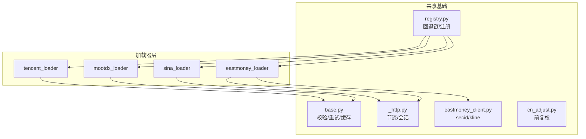
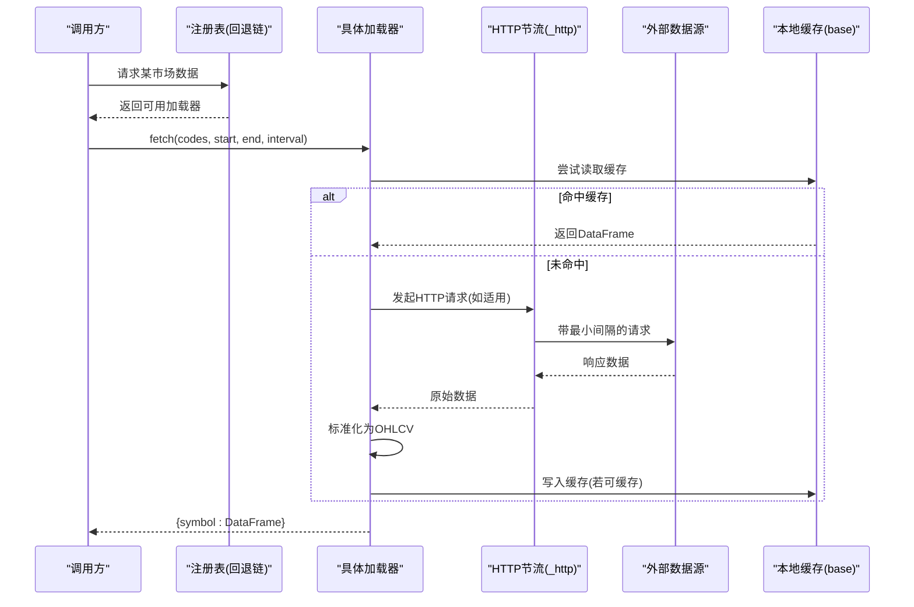
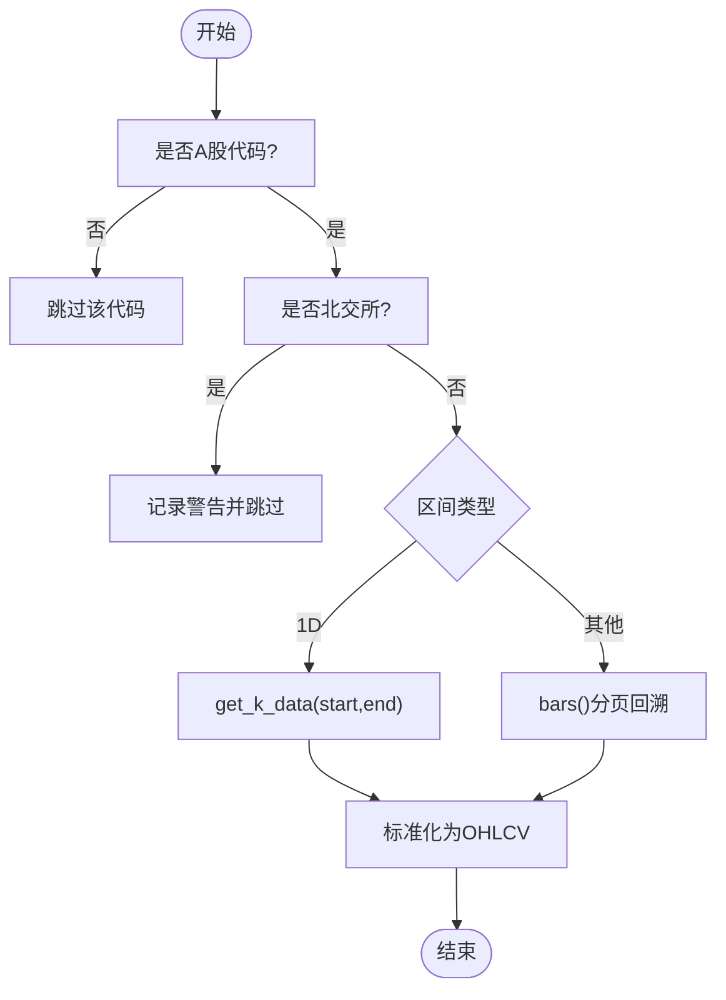
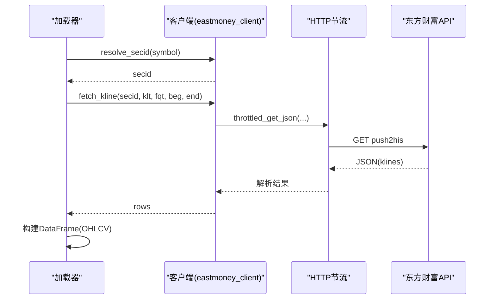
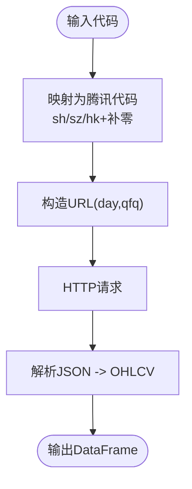
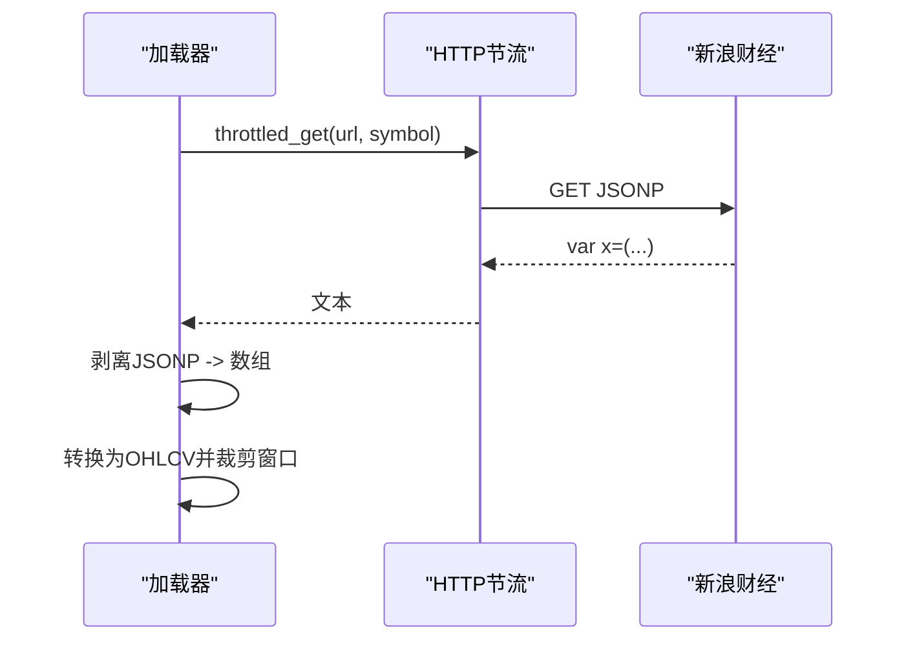
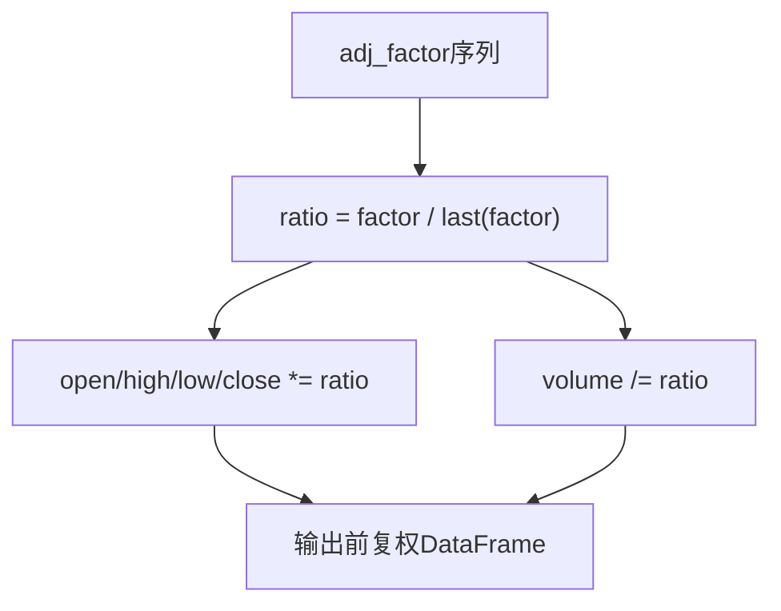
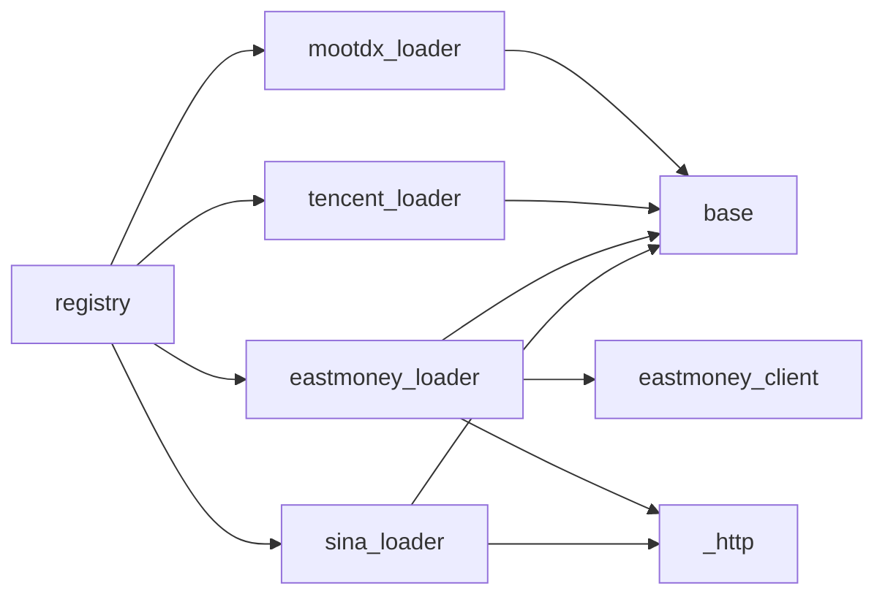

# 国内市场数据源

<cite>
**本文引用的文件**
- [mootdx_loader.py](file://agent/backtest/loaders/mootdx_loader.py)
- [eastmoney_loader.py](file://agent/backtest/loaders/eastmoney_loader.py)
- [eastmoney_client.py](file://agent/backtest/loaders/eastmoney_client.py)
- [tencent_loader.py](file://agent/backtest/loaders/tencent_loader.py)
- [sina_loader.py](file://agent/backtest/loaders/sina_loader.py)
- [cn_adjust.py](file://agent/backtest/loaders/cn_adjust.py)
- [_http.py](file://agent/backtest/loaders/_http.py)
- [base.py](file://agent/backtest/loaders/base.py)
- [registry.py](file://agent/backtest/loaders/registry.py)
- [a_mootdx_fetcher.py](file://agent/skills/ashare-mootdx/references/a_mootdx_fetcher.py)
- [test_mootdx_loader.py](file://agent/tests/test_mootdx_loader.py)
- [test_eastmoney_loader.py](file://agent/tests/test_eastmoney_loader.py)
- [test_tencent_loader.py](file://agent/tests/test_tencent_loader.py)
- [test_sina_loader.py](file://agent/tests/test_sina_loader.py)
</cite>

## 目录
1. [简介](#简介)
2. [项目结构](#项目结构)
3. [核心组件](#核心组件)
4. [架构总览](#架构总览)
5. [详细组件分析](#详细组件分析)
6. [依赖关系分析](#依赖关系分析)
7. [性能考量](#性能考量)
8. [故障排查指南](#故障排查指南)
9. [结论](#结论)
10. [附录](#附录)

## 简介
本文件面向中国A股市场的数据加载与处理，系统梳理了Mootdx（通达信TCP直连）、东方财富、腾讯财经、新浪财经等国内数据源的集成实现。重点说明A股特有的数据处理逻辑：复权因子计算、除权除息处理、涨跌停限制、交易时间规则；并解释实时行情获取与解析、盘后更新机制、财务与龙虎榜等特殊能力接入方式。最后提供配置指南与最佳实践，覆盖回测数据准备与实盘数据接入场景，并给出常见问题解决方案与性能优化建议。

## 项目结构
本项目将“数据加载器”按市场与来源拆分到独立模块，并通过统一注册表与共享HTTP/缓存基础设施进行编排。关键目录与职责如下：
- loaders：各数据源的具体实现（mootdx、eastmoney、tencent、sina等）
- base：通用校验、重试预算、本地缓存、协议定义
- _http：跨源共享的HTTP节流与会话复用
- registry：按市场的自动回退链与加载器发现
- skills/ashare-mootdx：Mootdx示例脚本（参考实现）
- tests：针对各加载器的单元测试

图表来源
- [registry.py:139-158](file://agent/backtest/loaders/registry.py#L139-L158)
- [eastmoney_loader.py:1-183](file://agent/backtest/loaders/eastmoney_loader.py#L1-L183)
- [eastmoney_client.py:1-325](file://agent/backtest/loaders/eastmoney_client.py#L1-L325)
- [mootdx_loader.py:1-258](file://agent/backtest/loaders/mootdx_loader.py#L1-L258)
- [tencent_loader.py:1-164](file://agent/backtest/loaders/tencent_loader.py#L1-L164)
- [sina_loader.py:1-201](file://agent/backtest/loaders/sina_loader.py#L1-L201)
- [base.py:168-256](file://agent/backtest/loaders/base.py#L168-L256)
- [_http.py:46-173](file://agent/backtest/loaders/_http.py#L46-L173)
- [cn_adjust.py:27-78](file://agent/backtest/loaders/cn_adjust.py#L27-L78)

章节来源
- [registry.py:139-158](file://agent/backtest/loaders/registry.py#L139-L158)
- [base.py:168-256](file://agent/backtest/loaders/base.py#L168-L256)

## 核心组件
- 统一数据加载协议与缓存：所有加载器遵循统一的接口约定，返回标准OHLCV DataFrame，并使用可选的本地Parquet缓存减少重复请求。
- 市场回退链：按市场类型（如A股、美股、港股）维护优先级顺序，优先选择稳定且不易被封禁的免费源，必要时回退至付费或备用源。
- HTTP节流与会话复用：对易限流的公共接口（如东方财富、新浪）实施进程级最小间隔控制与连接池复用，避免IP封禁。
- A股复权处理：为Tushare等未复权数据提供统一的前复权转换，保证跨事件收益率连续性。
- 符号路由与字段映射：不同数据源对代码后缀、字段名、成交量单位存在差异，加载器负责标准化输出。

章节来源
- [base.py:168-256](file://agent/backtest/loaders/base.py#L168-L256)
- [registry.py:139-158](file://agent/backtest/loaders/registry.py#L139-L158)
- [_http.py:46-173](file://agent/backtest/loaders/_http.py#L46-L173)
- [cn_adjust.py:27-78](file://agent/backtest/loaders/cn_adjust.py#L27-L78)

## 架构总览
下图展示从调用方到具体数据源的典型调用路径，包括自动回退、节流、缓存与数据标准化。

图表来源
- [registry.py:614-649](file://agent/backtest/loaders/registry.py#L614-L649)
- [base.py:623-661](file://agent/backtest/loaders/base.py#L623-L661)
- [_http.py:141-173](file://agent/backtest/loaders/_http.py#L141-L173)
- [eastmoney_loader.py:69-149](file://agent/backtest/loaders/eastmoney_loader.py#L69-L149)
- [sina_loader.py:137-200](file://agent/backtest/loaders/sina_loader.py#L137-L200)

## 详细组件分析

### Mootdx（通达信TCP直连）加载器
- 特点：通过mootdx库直连通达信服务器，无IP限速，适合A股历史K线批量拉取；不支持北交所（会跳过并告警）。
- 支持区间：日线、分钟级（1m/5m/15m/30m/1H）、周/月线；非日线采用分页回溯直到覆盖起始日期。
- 标准化：将vol/volume等列统一为volume，索引命名为trade_date，并裁剪到请求窗口。
- 可用性检测：仅在mootdx已安装时可用。

图表来源
- [mootdx_loader.py:47-64](file://agent/backtest/loaders/mootdx_loader.py#L47-L64)
- [mootdx_loader.py:155-207](file://agent/backtest/loaders/mootdx_loader.py#L155-L207)
- [mootdx_loader.py:209-258](file://agent/backtest/loaders/mootdx_loader.py#L209-L258)

章节来源
- [mootdx_loader.py:1-258](file://agent/backtest/loaders/mootdx_loader.py#L1-L258)
- [test_mootdx_loader.py:105-192](file://agent/tests/test_mootdx_loader.py#L105-L192)

### 东方财富加载器与客户端
- 特点：免费HTTP接口，但严格按IP限速；所有请求经共享节流器，避免封禁。
- 符号路由：A股使用“.SH/.SZ/.BJ”，港股“00700.HK”，美股通过搜索端点解析并缓存。
- K线字段：push2his返回klines字符串行，解析为OHLCV字典列表。
- 复权：默认请求前复权（fqt=1），便于直接用于收益计算。

图表来源
- [eastmoney_loader.py:69-149](file://agent/backtest/loaders/eastmoney_loader.py#L69-L149)
- [eastmoney_client.py:239-355](file://agent/backtest/loaders/eastmoney_client.py#L239-L355)
- [_http.py:141-173](file://agent/backtest/loaders/_http.py#L141-L173)

章节来源
- [eastmoney_loader.py:1-183](file://agent/backtest/loaders/eastmoney_loader.py#L1-L183)
- [eastmoney_client.py:1-325](file://agent/backtest/loaders/eastmoney_client.py#L1-L325)
- [test_eastmoney_loader.py:75-192](file://agent/tests/test_eastmoney_loader.py#L75-L192)

### 腾讯财经加载器
- 特点：免费HTTP接口，覆盖A股与港股；仅支持日线。
- 符号映射：A股“sh601595”、“sz000001”，港股“hk00700”（不足5位补零）。
- 数据格式：JSON数组，包含日期与OHLCV字段，标准化为统一DataFrame。

图表来源
- [tencent_loader.py:46-51](file://agent/backtest/loaders/tencent_loader.py#L46-L51)
- [tencent_loader.py:92-163](file://agent/backtest/loaders/tencent_loader.py#L92-L163)

章节来源
- [tencent_loader.py:1-164](file://agent/backtest/loaders/tencent_loader.py#L1-L164)
- [test_tencent_loader.py:56-120](file://agent/tests/test_tencent_loader.py#L56-L120)

### 新浪财经加载器（美股日线）
- 特点：通过JSONP接口获取美股日线；需剥离JSONP包裹并解析数组。
- 节流：使用共享节流器，避免触发服务端限流。
- 过滤：仅接受.US后缀；非美股直接跳过。

图表来源
- [sina_loader.py:44-72](file://agent/backtest/loaders/sina_loader.py#L44-L72)
- [sina_loader.py:183-200](file://agent/backtest/loaders/sina_loader.py#L183-L200)
- [_http.py:141-173](file://agent/backtest/loaders/_http.py#L141-L173)

章节来源
- [sina_loader.py:1-201](file://agent/backtest/loaders/sina_loader.py#L1-L201)
- [test_sina_loader.py:148-225](file://agent/tests/test_sina_loader.py#L148-L225)

### A股复权因子与前复权处理
- 背景：部分源（如Tushare）返回未复权价格，跨除权日会产生机械性跳空，导致收益率失真。
- 方案：基于adj_factor序列计算比例，对OHLC按比例缩放，并对volume反向缩放以保持金额关系不变。
- 应用：在需要连续收益率的回测中应启用此处理，确保因子与价格对齐。

图表来源
- [cn_adjust.py:27-78](file://agent/backtest/loaders/cn_adjust.py#L27-L78)

章节来源
- [cn_adjust.py:1-78](file://agent/backtest/loaders/cn_adjust.py#L1-L78)

### 实时行情与Level-1/Level-2
- 当前加载器主要聚焦历史K线与日线；实时行情可通过Mootdx示例脚本中的quotes方法获取基础实时报价（Level-1级别）。
- Level-2深度数据不在本仓库内直接实现；如需接入，可在现有加载器基础上扩展WebSocket或专用SDK通道，并沿用统一的标准化输出。

章节来源
- [a_mootdx_fetcher.py:48-65](file://agent/skills/ashare-mootdx/references/a_mootdx_fetcher.py#L48-L65)

### 盘后数据更新机制
- 缓存策略：仅对已结算的日期范围（end_date早于今日）写入本地Parquet缓存，避免对正在形成的当日数据进行固化。
- 增量更新：通过start/end参数控制窗口，结合分页与裁剪，实现高效增量拉取与合并。

章节来源
- [base.py:550-562](file://agent/backtest/loaders/base.py#L550-L562)
- [base.py:593-620](file://agent/backtest/loaders/base.py#L593-L620)

### 财务数据与龙虎榜
- 财务数据：可通过fundamentals_loader或相关工具接入（本仓库包含基础schema与加载器框架），用于财报指标提取。
- 龙虎榜：可通过tools或skills扩展抓取与分析，建议在统一的数据管道中进行清洗与标准化。

[本节为概念性说明，不直接分析具体文件]

## 依赖关系分析
- 市场回退链：A股优先使用tencent、mootdx、eastmoney等免费源，再回退至baostock、akshare、tushare与local。
- 共享基础设施：_http提供进程级节流与会话复用；base提供校验、重试预算与缓存；registry负责动态发现与回退。
- 耦合度：加载器与底层HTTP解耦，便于替换或扩展；eastmoney_loader与eastmoney_client强耦合以复用解析逻辑。

图表来源
- [registry.py:139-158](file://agent/backtest/loaders/registry.py#L139-L158)
- [eastmoney_loader.py:1-183](file://agent/backtest/loaders/eastmoney_loader.py#L1-L183)
- [eastmoney_client.py:1-325](file://agent/backtest/loaders/eastmoney_client.py#L1-L325)
- [_http.py:46-173](file://agent/backtest/loaders/_http.py#L46-L173)
- [base.py:168-256](file://agent/backtest/loaders/base.py#L168-L256)

章节来源
- [registry.py:139-158](file://agent/backtest/loaders/registry.py#L139-L158)

## 性能考量
- 节流与并发：通过_host_key隔离不同源的最小间隔，配合随机抖动避免并发同步；批量任务可调大环境变量以提升吞吐。
- 分页与上限：Mootdx非日线分页回溯设置最大页数，防止极端请求长时间占用资源。
- 缓存命中：启用本地缓存可减少重复网络请求，提升回测效率；注意仅对已结算日期生效。
- 数据类型与校验：统一数值类型与OHLC结构校验，降低下游计算异常风险。

章节来源
- [_http.py:46-173](file://agent/backtest/loaders/_http.py#L46-L173)
- [mootdx_loader.py:39-45](file://agent/backtest/loaders/mootdx_loader.py#L39-L45)
- [base.py:550-562](file://agent/backtest/loaders/base.py#L550-L562)
- [base.py:187-256](file://agent/backtest/loaders/base.py#L187-L256)

## 故障排查指南
- 无法访问Mootdx：确认已安装mootdx；若不可用，回退链会自动切换到其他A股源。
- 东方财富限流：检查环境变量VIBE_TRADING_EASTMONEY_MIN_INTERVAL，适当增大最小间隔；观察日志中的节流信息。
- 腾讯仅支持日线：传入非日线会被拒绝，请调整interval为日线。
- 新浪JSONP解析失败：确认响应包含数组；若为空或格式错误，将跳过该标的。
- 日期范围无效：确保start_date <= end_date，否则抛出异常。
- 缓存未命中：确认end_date为已结算日期；否则不会写入缓存。

章节来源
- [mootdx_loader.py:82-94](file://agent/backtest/loaders/mootdx_loader.py#L82-L94)
- [eastmoney_loader.py:65-67](file://agent/backtest/loaders/eastmoney_loader.py#L65-L67)
- [tencent_loader.py:86-91](file://agent/backtest/loaders/tencent_loader.py#L86-L91)
- [sina_loader.py:161-163](file://agent/backtest/loaders/sina_loader.py#L161-L163)
- [base.py:168-184](file://agent/backtest/loaders/base.py#L168-L184)
- [base.py:550-562](file://agent/backtest/loaders/base.py#L550-L562)

## 结论
本仓库提供了完善的中国A股及多市场数据加载体系，涵盖Mootdx、东方财富、腾讯、新浪等主流数据源，具备稳定的节流、缓存与回退机制。通过标准化的OHLCV输出与复权处理，满足回测与实盘的多样化需求。建议在生产环境中合理配置节流参数与缓存策略，并结合业务需求扩展实时与Level-2数据接入。

## 附录
- 配置与环境变量
  - VIBE_TRADING_DATA_CACHE：启用本地缓存
  - VIBE_TRADING_DATA_CACHE_ROOT：自定义缓存根目录
  - VIBE_TRADING_EASTMONEY_MIN_INTERVAL：东方财富最小请求间隔（秒）
  - VIBE_TRADING_SINA_MIN_INTERVAL：新浪最小请求间隔（秒）
- 最佳实践
  - 回测数据准备：优先使用免费源（tencent/mootdx/eastmoney），结合本地缓存加速多次运行
  - 实盘数据接入：关注限流与可用性，必要时引入付费源作为兜底
  - 数据质量：启用OHLC校验与前复权处理，确保收益率连续性
  - 监控与日志：关注节流与异常日志，及时调整参数

[本节为概念性说明，不直接分析具体文件]