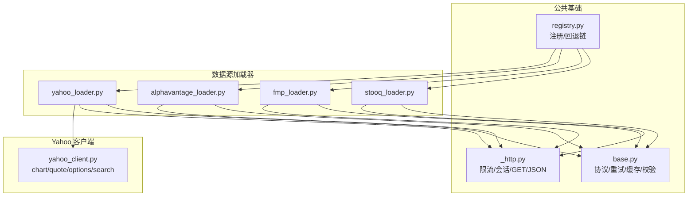
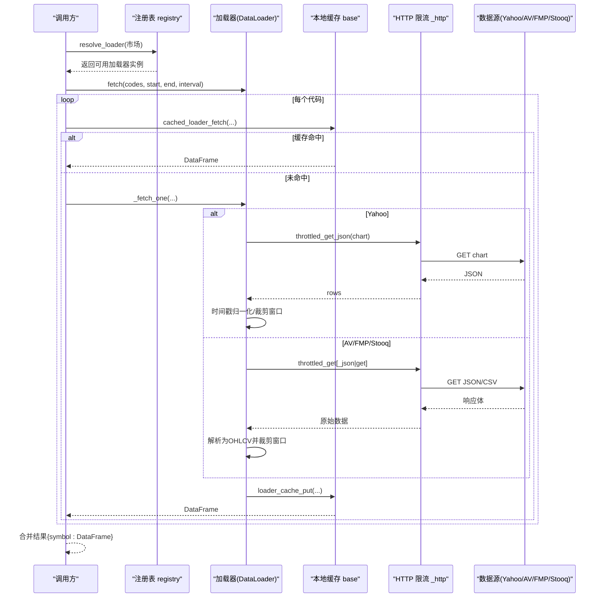
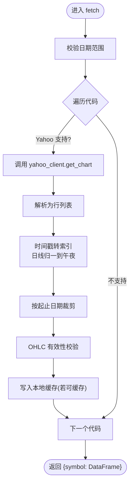
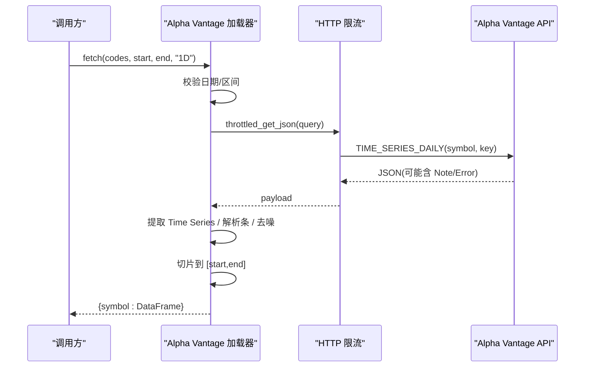
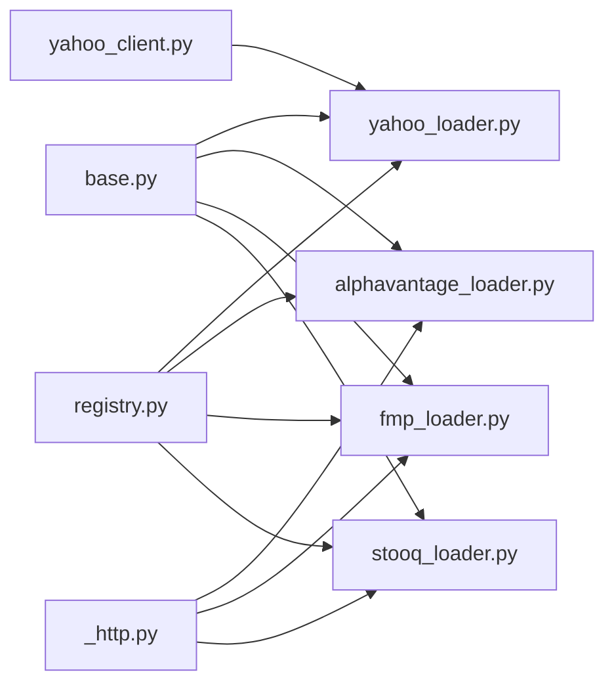

# 国际市场数据源

<cite>
**本文引用的文件**
- [base.py](file://agent/backtest/loaders/base.py)
- [registry.py](file://agent/backtest/loaders/registry.py)
- [_http.py](file://agent/backtest/loaders/_http.py)
- [yahoo_loader.py](file://agent/backtest/loaders/yahoo_loader.py)
- [yahoo_client.py](file://agent/backtest/loaders/yahoo_client.py)
- [alphavantage_loader.py](file://agent/backtest/loaders/alphavantage_loader.py)
- [fmp_loader.py](file://agent/backtest/loaders/fmp_loader.py)
- [stooq_loader.py](file://agent/backtest/loaders/stooq_loader.py)
- [test_yahoo_loader.py](file://agent/tests/test_yahoo_loader.py)
- [test_alphavantage_loader.py](file://agent/tests/test_alphavantage_loader.py)
</cite>

## 目录
1. [简介](#简介)
2. [项目结构](#项目结构)
3. [核心组件](#核心组件)
4. [架构总览](#架构总览)
5. [详细组件分析](#详细组件分析)
6. [依赖关系分析](#依赖关系分析)
7. [性能与速率限制](#性能与速率限制)
8. [故障排查指南](#故障排查指南)
9. [结论](#结论)
10. [附录：配置与使用示例](#附录配置与使用示例)

## 简介
本文件面向“国际股票市场数据加载器”，系统性说明 Yahoo Finance、Alpha Vantage、Financial Modeling Prep（FMP）、Stooq 等数据源的集成实现，覆盖美股、港股、印度、韩国、加拿大等市场。文档重点包括：
- 多市场支持与符号映射
- 时区处理与交易日历差异
- 数据质量校验、缺失值处理、异常检测
- 速率限制、错误恢复与缓存优化
- 历史数据下载、实时行情获取、基本面数据接入的常用场景

## 项目结构
数据加载子系统位于 agent/backtest/loaders 下，采用“按数据源分文件 + 公共基础能力”的组织方式：
- 公共基础：重试/预算、OHLC 校验、本地 Parquet 缓存、协议定义
- 数据源加载器：Yahoo、Alpha Vantage、FMP、Stooq 等
- HTTP 层：按主机桶限流、会话复用、JSON/CSV 请求封装
- 注册表：市场到加载器的回退链与自动选择

图表来源
- [base.py:1-657](file://agent/backtest/loaders/base.py#L1-L657)
- [_http.py:1-201](file://agent/backtest/loaders/_http.py#L1-L201)
- [registry.py:1-256](file://agent/backtest/loaders/registry.py#L1-L256)
- [yahoo_loader.py:1-275](file://agent/backtest/loaders/yahoo_loader.py#L1-L275)
- [yahoo_client.py:1-419](file://agent/backtest/loaders/yahoo_client.py#L1-L419)
- [alphavantage_loader.py:1-260](file://agent/backtest/loaders/alphavantage_loader.py#L1-L260)
- [fmp_loader.py:1-222](file://agent/backtest/loaders/fmp_loader.py#L1-L222)
- [stooq_loader.py:1-202](file://agent/backtest/loaders/stooq_loader.py#L1-L202)

章节来源
- [registry.py:1-256](file://agent/backtest/loaders/registry.py#L1-L256)
- [base.py:1-657](file://agent/backtest/loaders/base.py#L1-L657)

## 核心组件
- DataLoaderProtocol 与 markets/name/requires_auth：统一接口，声明支持的市场、名称与是否需要鉴权
- 日期与 OHLC 校验：validate_date_range、validate_ohlc，保障数据结构一致性与数值合理性
- 重试与预算：retry_with_budget、check_budget，基于单调时钟与指数退避的有限重试
- 本地缓存：loader_cache_* 系列函数，基于内容寻址的 Parquet 缓存，避免重复网络请求
- HTTP 限流：HostThrottle 与 throttled_get/throttled_get_json，按主机桶最小间隔与抖动控制并发
- 注册与回退：resolve_loader/get_loader_cls_with_fallback，按市场回退链自动选择可用加载器

章节来源
- [base.py:164-256](file://agent/backtest/loaders/base.py#L164-L256)
- [base.py:127-236](file://agent/backtest/loaders/base.py#L127-L236)
- [base.py:243-441](file://agent/backtest/loaders/base.py#L243-L441)
- [_http.py:46-138](file://agent/backtest/loaders/_http.py#L46-L138)
- [_http.py:141-201](file://agent/backtest/loaders/_http.py#L141-L201)
- [registry.py:131-196](file://agent/backtest/loaders/registry.py#L131-L196)

## 架构总览
下图展示从调用方到具体数据源的典型调用路径，包含缓存命中、HTTP 限流、解析与返回。

图表来源
- [registry.py:614-649](file://agent/backtest/loaders/registry.py#L614-L649)
- [base.py:623-661](file://agent/backtest/loaders/base.py#L623-L661)
- [yahoo_loader.py:195-275](file://agent/backtest/loaders/yahoo_loader.py#L195-L275)
- [yahoo_client.py:156-205](file://agent/backtest/loaders/yahoo_client.py#L156-L205)
- [alphavantage_loader.py:170-233](file://agent/backtest/loaders/alphavantage_loader.py#L170-L233)
- [fmp_loader.py:147-179](file://agent/backtest/loaders/fmp_loader.py#L147-L179)
- [stooq_loader.py:148-166](file://agent/backtest/loaders/stooq_loader.py#L148-L166)
- [_http.py:141-201](file://agent/backtest/loaders/_http.py#L141-L201)

## 详细组件分析

### Yahoo Finance 加载器
- 支持市场：美股、港股、印度、韩国、加拿大等（通过后缀识别）
- 数据范围：日/小时/分钟级；日线时间戳归一到午夜以对齐其他源
- 符号映射：剥离 .US、规范化 .HK 前导零、保留 .NS/.BO/.TO/.V
- 客户端：共享 Yahoo v8 chart 端点，自动处理 cookie+crumb 握手
- 缓存：使用通用缓存，仅对已结算区间写入
- 校验：OHLC 完整性检查、非交易日空值过滤

图表来源
- [yahoo_loader.py:44-106](file://agent/backtest/loaders/yahoo_loader.py#L44-L106)
- [yahoo_loader.py:139-184](file://agent/backtest/loaders/yahoo_loader.py#L139-L184)
- [yahoo_loader.py:195-275](file://agent/backtest/loaders/yahoo_loader.py#L195-L275)
- [yahoo_client.py:71-92](file://agent/backtest/loaders/yahoo_client.py#L71-L92)
- [yahoo_client.py:156-205](file://agent/backtest/loaders/yahoo_client.py#L156-L205)

章节来源
- [yahoo_loader.py:1-275](file://agent/backtest/loaders/yahoo_loader.py#L1-L275)
- [yahoo_client.py:1-419](file://agent/backtest/loaders/yahoo_client.py#L1-L419)
- [test_yahoo_loader.py:1-200](file://agent/tests/test_yahoo_loader.py#L1-L200)

### Alpha Vantage 加载器
- 支持市场：美股（日线）
- 鉴权：需要 ALPHAVANTAGE_API_KEY（占位符视为无效）
- 限流：按主机桶最小间隔，默认 1s
- 错误处理：Note/Information/Error Message 三种包络均被识别为瞬态失败，单个代码失败不中断批次
- 数据解析：将编号字段映射为标准 OHLCV，丢弃不完整条

图表来源
- [alphavantage_loader.py:59-73](file://agent/backtest/loaders/alphavantage_loader.py#L59-L73)
- [alphavantage_loader.py:76-94](file://agent/backtest/loaders/alphavantage_loader.py#L76-L94)
- [alphavantage_loader.py:170-233](file://agent/backtest/loaders/alphavantage_loader.py#L170-L233)
- [_http.py:176-201](file://agent/backtest/loaders/_http.py#L176-L201)

章节来源
- [alphavantage_loader.py:1-260](file://agent/backtest/loaders/alphavantage_loader.py#L1-L260)
- [test_alphavantage_loader.py:1-193](file://agent/tests/test_alphavantage_loader.py#L1-L193)

### Financial Modeling Prep (FMP) 加载器
- 支持市场：美股（日线）
- 鉴权：需要 FMP_API_KEY
- 限流：按主机桶最小间隔，默认 0.3s
- 数据解析：historical 数组转为升序 OHLCV，强制 float 类型
- 错误处理：未知符号或空窗口返回空结果，不中断批次

章节来源
- [fmp_loader.py:1-222](file://agent/backtest/loaders/fmp_loader.py#L1-L222)

### Stooq 加载器
- 支持市场：美股（EOD 日线）
- 鉴权：无需密钥
- 限流：按主机桶最小间隔，默认 0.6s
- 数据解析：CSV 读取，列重命名为标准 OHLCV，丢弃 N/D 或空响应
- 错误处理：未知符号或空窗口返回 None，不中断批次

章节来源
- [stooq_loader.py:1-202](file://agent/backtest/loaders/stooq_loader.py#L1-L202)

### 公共基础能力
- 重试与预算：retry_with_budget 提供带截止时间的有限重试，仅对声明的瞬态异常生效；check_budget 用于分页间快速失败
- OHLC 校验：validate_ohlc 强制 high>=low 且高低价包围开收价，支持允许负价格（如欧洲电力）但拒绝零价
- 本地缓存：基于内容哈希的 Parquet 缓存，仅对已结算区间写入，读写失败不影响主流程
- 协议与元数据：DataLoaderProtocol 要求 name/markets/requires_auth，volume_units 标注成交量单位

章节来源
- [base.py:164-256](file://agent/backtest/loaders/base.py#L164-L256)
- [base.py:127-236](file://agent/backtest/loaders/base.py#L127-L236)
- [base.py:243-441](file://agent/backtest/loaders/base.py#L243-L441)
- [base.py:851-887](file://agent/backtest/loaders/base.py#L851-L887)

## 依赖关系分析
- 加载器依赖 HTTP 限流模块进行受控访问
- Yahoo 加载器依赖 Yahoo 专用客户端，负责符号映射与 crumb 握手
- 所有加载器共享 base 中的缓存与校验工具
- 注册表维护市场到加载器的回退链，确保在部分不可用时仍能获取数据

图表来源
- [base.py:1-657](file://agent/backtest/loaders/base.py#L1-L657)
- [_http.py:1-201](file://agent/backtest/loaders/_http.py#L1-L201)
- [yahoo_loader.py:1-275](file://agent/backtest/loaders/yahoo_loader.py#L1-L275)
- [yahoo_client.py:1-419](file://agent/backtest/loaders/yahoo_client.py#L1-L419)
- [alphavantage_loader.py:1-260](file://agent/backtest/loaders/alphavantage_loader.py#L1-L260)
- [fmp_loader.py:1-222](file://agent/backtest/loaders/fmp_loader.py#L1-L222)
- [stooq_loader.py:1-202](file://agent/backtest/loaders/stooq_loader.py#L1-L202)
- [registry.py:1-256](file://agent/backtest/loaders/registry.py#L1-L256)

章节来源
- [registry.py:131-196](file://agent/backtest/loaders/registry.py#L131-L196)

## 性能与速率限制
- 每主机桶限流：HostThrottle 保证同一 host_key 的最小间隔，加入随机抖动避免同步风暴
- 会话复用：按 host_key 复用 requests.Session，减少 TCP/TLS 开销
- 环境变量调优：各源支持 *_MIN_INTERVAL 环境变量覆盖默认间隔
- 本地缓存：对已结算区间启用 Parquet 缓存，显著降低重复请求
- 批量容错：单代码失败不中断整体批次，提升吞吐与鲁棒性

章节来源
- [_http.py:46-138](file://agent/backtest/loaders/_http.py#L46-L138)
- [_http.py:141-201](file://agent/backtest/loaders/_http.py#L141-L201)
- [base.py:243-441](file://agent/backtest/loaders/base.py#L243-L441)

## 故障排查指南
- 无可用数据源：当某市场所有候选加载器不可用，会抛出 NoAvailableSourceError；检查网络与 API 令牌配置
- 鉴权缺失：Alpha Vantage/FMP 在未设置有效密钥时会跳过请求并记录警告
- 速率限制/配额：Alpha Vantage 的 Note/Information 包络会被识别为瞬态失败；适当增大 *_MIN_INTERVAL 或等待配额刷新
- 数据质量问题：validate_ohlc 会丢弃或标记违反 OHLC 不变性的 K 线；必要时调整 allow_nonpositive_prices
- 缓存问题：缓存读写失败为非致命，会自动回退到在线源；可通过关闭缓存或清理缓存目录定位问题

章节来源
- [registry.py:614-649](file://agent/backtest/loaders/registry.py#L614-L649)
- [alphavantage_loader.py:76-94](file://agent/backtest/loaders/alphavantage_loader.py#L76-L94)
- [base.py:164-256](file://agent/backtest/loaders/base.py#L164-L256)
- [base.py:243-441](file://agent/backtest/loaders/base.py#L243-L441)

## 结论
该数据加载子系统通过统一的协议、稳健的重试与缓存机制、以及按主机桶的限流策略，实现了跨多个国际市场的数据获取。Yahoo、Alpha Vantage、FMP、Stooq 等加载器分别覆盖不同市场与数据类型，配合注册表的回退链，能够在复杂环境下稳定工作。建议在生产环境中合理配置 *_MIN_INTERVAL、开启本地缓存，并结合 OHLC 校验保障数据质量。

## 附录：配置与使用示例
- 环境变量
  - Alpha Vantage：ALPHAVANTAGE_API_KEY（占位符将被忽略）
  - FMP：FMP_API_KEY
  - 各源最小间隔：VIBE_TRADING_ALPHAVANTAGE_MIN_INTERVAL、VIBE_TRADING_FMP_MIN_INTERVAL、VIBE_TRADING_STOOQ_MIN_INTERVAL、VIBE_TRADING_YAHOO_MIN_INTERVAL
  - 本地缓存开关：VIBE_TRADING_DATA_CACHE=1（可选），根目录：VIBE_TRADING_DATA_CACHE_ROOT
- 常见用法
  - 历史数据下载：调用对应加载器的 fetch(codes, start_date, end_date, interval="1D")，返回 {symbol: DataFrame}
  - 实时行情：Yahoo 客户端支持 quoteSummary/options/search，适合获取最新报价与期权链
  - 基本面数据：可通过 FMP/Alpha Vantage 的相应端点扩展（当前加载器聚焦 OHLCV）
- 多市场路由
  - 使用 resolve_loader(市场) 自动选择可用加载器，回退链见 FALLBACK_CHAINS
  - 明确指定 source 时，若不可用且属于 local/qveris/tickerall，不会静默降级到网络源

章节来源
- [registry.py:131-158](file://agent/backtest/loaders/registry.py#L131-L158)
- [registry.py:614-649](file://agent/backtest/loaders/registry.py#L614-L649)
- [alphavantage_loader.py:59-73](file://agent/backtest/loaders/alphavantage_loader.py#L59-L73)
- [fmp_loader.py:46-55](file://agent/backtest/loaders/fmp_loader.py#L46-L55)
- [stooq_loader.py:66-68](file://agent/backtest/loaders/stooq_loader.py#L66-L68)
- [yahoo_client.py:60-69](file://agent/backtest/loaders/yahoo_client.py#L60-L69)
- [base.py:243-283](file://agent/backtest/loaders/base.py#L243-L283)