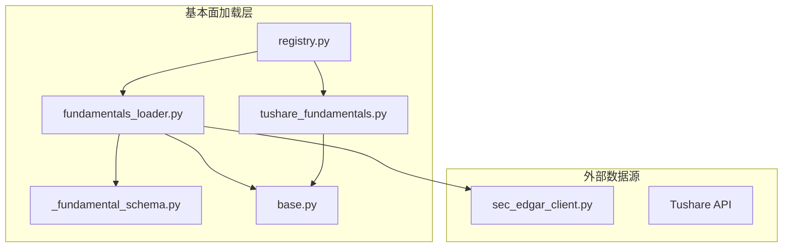
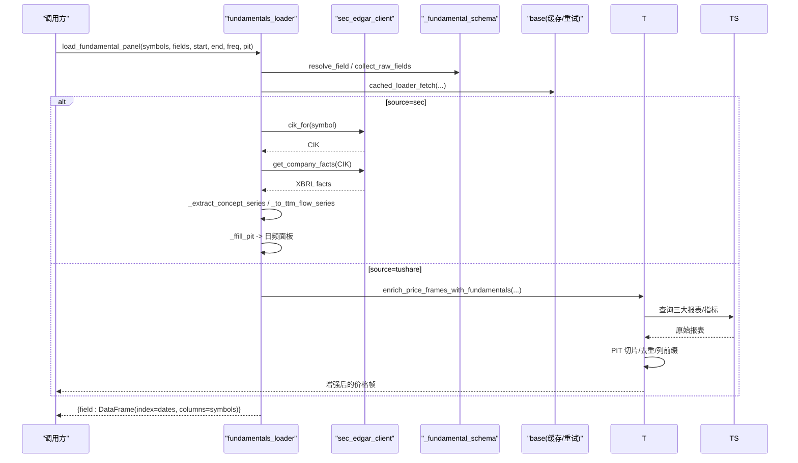
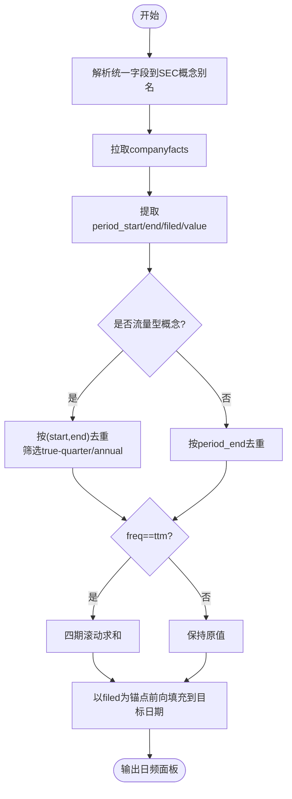
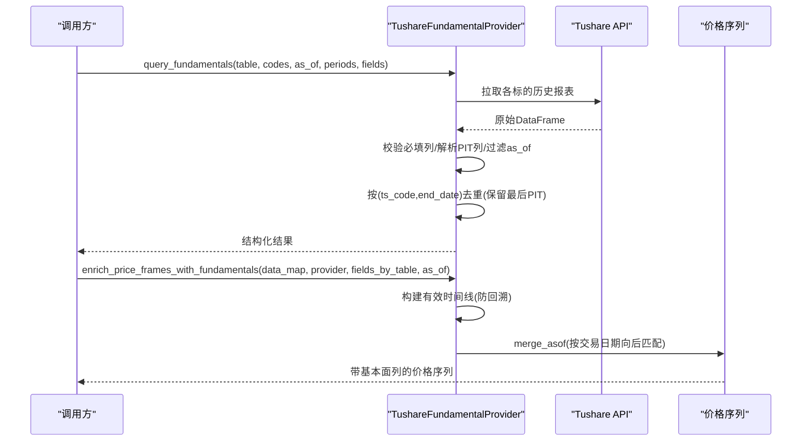
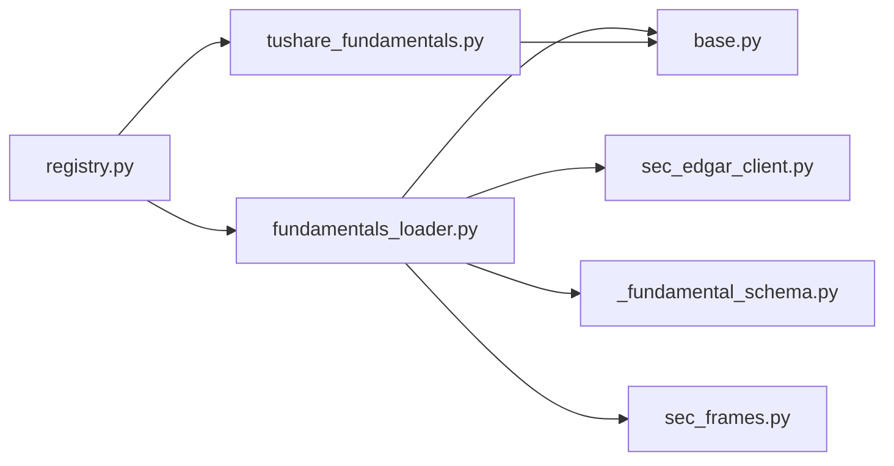

# 基本面数据源

<cite>
**本文引用的文件**
- [fundamentals_loader.py](file://agent/backtest/loaders/fundamentals_loader.py)
- [sec_edgar_client.py](file://agent/backtest/loaders/sec_edgar_client.py)
- [_fundamental_schema.py](file://agent/backtest/loaders/_fundamental_schema.py)
- [sec_frames.py](file://agent/backtest/loaders/sec_frames.py)
- [base.py](file://agent/backtest/loaders/base.py)
- [tushare_fundamentals.py](file://agent/backtest/loaders/tushare_fundamentals.py)
- [registry.py](file://agent/backtest/loaders/registry.py)
- [test_tushare_fundamentals_provider.py](file://agent/tests/test_tushare_fundamentals_provider.py)
- [test_fundamental_schema.py](file://agent/tests/test_fundamental_schema.py)
- [test_sec_edgar_client.py](file://agent/tests/test_sec_edgar_client.py)
</cite>

## 目录
1. [简介](#简介)
2. [项目结构](#项目结构)
3. [核心组件](#核心组件)
4. [架构总览](#架构总览)
5. [详细组件分析](#详细组件分析)
6. [依赖关系分析](#依赖关系分析)
7. [性能与可用性](#性能与可用性)
8. [故障排查指南](#故障排查指南)
9. [结论](#结论)
10. [附录：配置与使用示例](#附录配置与使用示例)

## 简介
本文件面向“基本面数据加载器”的完整实现，覆盖以下目标：
- 财务数据、公司基本信息、分析师预测等基本面数据的获取与处理。
- Tushare 中国 A 股基本面接口集成；SEC EDGAR 美国上市公司 XBRL 事实数据集成；可扩展接入其他专业基本面数据源。
- 财务报表（资产负债表、利润表、现金流量表）的标准化解析与清洗。
- 财务比率计算、估值指标生成、财务趋势分析等高级功能。
- 配置指南与使用示例，覆盖财务分析、价值投资、量化选股等场景。
- 数据质量控制与异常处理方法，确保点-in-time（PIT）安全与回测无偏。

## 项目结构
本项目在 backtest.loaders 下提供统一的基本面数据加载能力：
- SEC 分支：通过 sec_edgar_client 拉取 XBRL companyfacts，按 period_end/filed 构建 PIT 安全的日频面板，并支持 ttm/quarterly/annual 频率。
- Tushare 分支：封装 A 股三大报表及指标，提供 PIT 切片与价格序列增强。
- 统一字段与派生指标：_fundamental_schema 定义原始字段与派生公式，SEC 概念别名映射到统一字段名。
- 基础能力：base 提供缓存、重试、预算控制、OHLC 校验等通用工具。
- 注册与路由：registry 维护市场级 fallback 链与来源选择。

**图示来源**
- [fundamentals_loader.py:196-277](file://agent/backtest/loaders/fundamentals_loader.py#L196-L277)
- [sec_edgar_client.py:166-227](file://agent/backtest/loaders/sec_edgar_client.py#L166-L227)
- [_fundamental_schema.py:45-170](file://agent/backtest/loaders/_fundamental_schema.py#L45-L170)
- [tushare_fundamentals.py:118-187](file://agent/backtest/loaders/tushare_fundamentals.py#L118-L187)
- [registry.py:139-158](file://agent/backtest/loaders/registry.py#L139-L158)

**章节来源**
- [fundamentals_loader.py:1-501](file://agent/backtest/loaders/fundamentals_loader.py#L1-L501)
- [sec_edgar_client.py:1-235](file://agent/backtest/loaders/sec_edgar_client.py#L1-L235)
- [_fundamental_schema.py:1-227](file://agent/backtest/loaders/_fundamental_schema.py#L1-L227)
- [tushare_fundamentals.py:1-380](file://agent/backtest/loaders/tushare_fundamentals.py#L1-L380)
- [base.py:1-657](file://agent/backtest/loaders/base.py#L1-L657)
- [registry.py:1-256](file://agent/backtest/loaders/registry.py#L1-L256)

## 核心组件
- SEC 基本面面板加载器：将稀疏 XBRL 事实转换为 PIT 安全的日频面板，支持 ttm/quarterly/annual，自动合成缺失季度、TTM 滚动、前向填充。
- Tushare 基本面提供者：封装 A 股三大报表与指标，提供 PIT 切片、去重、列名规范化，以及将基本面快照附加到日线价格序列。
- 统一字段与派生指标：RAW_FIELDS 定义原始字段，DERIVED_FIELDS 定义比率与增长类指标，SEC_CONCEPT_MAP 将 US-GAAP 概念别名映射到统一字段。
- SEC 客户端：ticker->CIK 映射、提交索引与 XBRL 事实拉取，带速率限制与合规 UA。
- 基础工具：本地 parquet 缓存、重试与预算控制、日期范围校验、OHLC 质量检查。

**章节来源**
- [fundamentals_loader.py:196-277](file://agent/backtest/loaders/fundamentals_loader.py#L196-L277)
- [tushare_fundamentals.py:118-187](file://agent/backtest/loaders/tushare_fundamentals.py#L118-L187)
- [_fundamental_schema.py:28-189](file://agent/backtest/loaders/_fundamental_schema.py#L28-L189)
- [sec_edgar_client.py:166-227](file://agent/backtest/loaders/sec_edgar_client.py#L166-L227)
- [base.py:168-256](file://agent/backtest/loaders/base.py#L168-L256)
- [base.py:377-450](file://agent/backtest/loaders/base.py#L377-L450)
- [base.py:565-661](file://agent/backtest/loaders/base.py#L565-L661)

## 架构总览
下图展示从调用方到数据源的端到端流程，包括 SEC 与 Tushare 两条路径，以及统一的字段解析与派生计算。

**图示来源**
- [fundamentals_loader.py:196-277](file://agent/backtest/loaders/fundamentals_loader.py#L196-L277)
- [sec_edgar_client.py:166-227](file://agent/backtest/loaders/sec_edgar_client.py#L166-L227)
- [tushare_fundamentals.py:264-379](file://agent/backtest/loaders/tushare_fundamentals.py#L264-L379)
- [base.py:623-661](file://agent/backtest/loaders/base.py#L623-L661)

## 详细组件分析

### SEC 基本面面板加载器
- 职责：将 SEC XBRL companyfacts 中的稀疏事实转换为 PIT 安全的日频面板；支持 ttm/quarterly/annual；对流量型概念做四期滚动；对缺失 Q4 进行合成；使用前向填充对齐交易日。
- 关键流程：
  - 字段解析：通过 _fundamental_schema 的 SEC_CONCEPT_MAP 将统一字段映射为多个 US-GAAP 概念别名，优先新准则概念。
  - 周期识别：依据 sec_frames 的跨度窗口区分 instant/quarter/annual/ytd，避免将 ytd 误认为真实季度。
  - 去重与 PIT：按 period_end 去重时保留最早 filed（默认 PIT），或最新 filed（研究模式）。
  - TTM 滚动：对流量型概念做 4 期滚动求和，并更新 filed 锚点。
  - 日频对齐：以 filed 为锚点前向填充到目标日期索引。
- 错误与健壮性：单个 symbol 失败不影响整体面板；缺失概念会记录告警并返回 NaN。

**图示来源**
- [fundamentals_loader.py:48-132](file://agent/backtest/loaders/fundamentals_loader.py#L48-L132)
- [sec_frames.py:29-129](file://agent/backtest/loaders/sec_frames.py#L29-L129)
- [_fundamental_schema.py:99-170](file://agent/backtest/loaders/_fundamental_schema.py#L99-L170)

**章节来源**
- [fundamentals_loader.py:48-132](file://agent/backtest/loaders/fundamentals_loader.py#L48-L132)
- [fundamentals_loader.py:170-194](file://agent/backtest/loaders/fundamentals_loader.py#L170-L194)
- [fundamentals_loader.py:298-318](file://agent/backtest/loaders/fundamentals_loader.py#L298-L318)
- [sec_frames.py:42-129](file://agent/backtest/loaders/sec_frames.py#L42-L129)

### Tushare 基本面提供者
- 职责：封装 A 股三大报表与指标，提供 PIT 切片、去重、列名规范化，并将基本面快照附加到日线价格序列。
- 关键点：
  - 表元数据：balancesheet/cashflow/income/fina_indicator，声明必填列与 PIT 列（优先 f_ann_date，否则 ann_date）。
  - PIT 切片：仅包含 as_of 之前披露的数据；同期末期多条记录按有效 PIT 日期去重，保留最后一条（重述后覆盖）。
  - 价格序列增强：merge_asof 将基本面快照按交易日期向后匹配，列名前缀加表名，避免未来信息泄露。
  - 重述处理：扫描行按 PIT 升序，仅当 end_date >= 当前可见 end_date 才加入时间线，防止旧期重述导致回溯。

**图示来源**
- [tushare_fundamentals.py:144-187](file://agent/backtest/loaders/tushare_fundamentals.py#L144-L187)
- [tushare_fundamentals.py:264-379](file://agent/backtest/loaders/tushare_fundamentals.py#L264-L379)

**章节来源**
- [tushare_fundamentals.py:56-115](file://agent/backtest/loaders/tushare_fundamentals.py#L56-L115)
- [tushare_fundamentals.py:144-187](file://agent/backtest/loaders/tushare_fundamentals.py#L144-L187)
- [tushare_fundamentals.py:264-379](file://agent/backtest/loaders/tushare_fundamentals.py#L264-L379)

### SEC 客户端
- 职责：ticker->CIK 映射、提交索引与 XBRL 事实拉取；遵守 SEC 速率限制与 UA 要求；进程内缓存 ticker 表。
- 关键点：
  - 速率限制：最小间隔不低于 0.12s，可环境变量覆盖；UA 含联系邮箱。
  - 容错：跳过 malformed 行；未知 ticker 返回 None；HTTP 错误向上抛出供上层重试策略处理。
  - 符号后缀：支持 AAPL.US 与 BRK.B/BRK-B 等常见写法。

**章节来源**
- [sec_edgar_client.py:1-235](file://agent/backtest/loaders/sec_edgar_client.py#L1-L235)

### 统一字段与派生指标
- RAW_FIELDS：revenue、cogs、gross_profit、operating_income、net_income、total_assets、total_equity、total_debt、cash、shares_diluted、cfo、capex。
- DERIVED_FIELDS：roe、roa、gross_profitability、asset_growth、accruals、leverage。
- SEC_CONCEPT_MAP：将统一字段映射到多个 US-GAAP 概念别名，优先级保证兼容新旧准则。

**章节来源**
- [_fundamental_schema.py:28-189](file://agent/backtest/loaders/_fundamental_schema.py#L28-L189)

### 基础工具与缓存
- 日期范围校验、OHLC 结构校验、重试与预算控制、本地 parquet 缓存（DuckDB 读写）、键生成与版本化。
- 适用于所有 loader 的通用可靠性保障。

**章节来源**
- [base.py:168-256](file://agent/backtest/loaders/base.py#L168-L256)
- [base.py:377-450](file://agent/backtest/loaders/base.py#L377-L450)
- [base.py:565-661](file://agent/backtest/loaders/base.py#L565-L661)
- [base.py:538-597](file://agent/backtest/loaders/base.py#L538-L597)

## 依赖关系分析
- fundamentals_loader 依赖 sec_edgar_client、_fundamental_schema、sec_frames、base。
- tushare_fundamentals 依赖 base（缓存/重试）与 Tushare SDK。
- registry 管理市场级 fallback 链，决定具体使用哪个 loader。

**图示来源**
- [registry.py:139-158](file://agent/backtest/loaders/registry.py#L139-L158)
- [fundamentals_loader.py:196-277](file://agent/backtest/loaders/fundamentals_loader.py#L196-L277)
- [tushare_fundamentals.py:264-379](file://agent/backtest/loaders/tushare_fundamentals.py#L264-L379)

**章节来源**
- [registry.py:1-256](file://agent/backtest/loaders/registry.py#L1-L256)

## 性能与可用性
- 速率限制与合规：SEC 请求最小间隔不低于 0.12s，UA 携带联系信息，避免封禁。
- 缓存加速：启用 VIBE_TRADING_DATA_CACHE 后，按内容地址化 key 存储 parquet，减少重复网络请求。
- 重试与预算：retry_with_budget 提供指数退避与截止时间控制，避免长时间阻塞。
- 内存与 I/O：DuckDB 直接读写 parquet，避免中间对象膨胀；原子写入避免并发竞争。
- PIT 安全：SEC 侧以 filed 为锚点前向填充；Tushare 侧以 f_ann_date/ann_date 作为可见性边界，避免未来信息泄露。

[本节为通用指导，不直接分析具体文件]

## 故障排查指南
- SEC 无法解析 ticker：
  - 现象：cik_for 返回 None 或日志提示无 CIK。
  - 处理：确认 ticker 是否为美股且后缀正确（如 AAPL.US）；检查网络与 UA 设置。
  - 参考：[sec_edgar_client.py:166-195](file://agent/backtest/loaders/sec_edgar_client.py#L166-L195)
- SEC 概念缺失：
  - 现象：字段对应概念未命中，返回 NaN 并记录告警。
  - 处理：检查 _fundamental_schema 的 SEC_CONCEPT_MAP 是否覆盖该字段；必要时扩展别名。
  - 参考：[fundamentals_loader.py:506-520](file://agent/backtest/loaders/fundamentals_loader.py#L506-L520)
- Tushare 表不支持或缺列：
  - 现象：UnknownTableError 或 SchemaValidationError。
  - 处理：确认表名是否在 list_tables；检查 API 返回是否包含必填列。
  - 参考：[tushare_fundamentals.py:133-142](file://agent/backtest/loaders/tushare_fundamentals.py#L133-L142), [tushare_fundamentals.py:240-243](file://agent/backtest/loaders/tushare_fundamentals.py#L240-L243)
- 缓存读取失败：
  - 现象：本地 parquet 损坏或元数据不一致，读不到数据。
  - 处理：删除对应缓存文件；确保 VIBE_TRADING_DATA_CACHE 已启用且路径合法。
  - 参考：[base.py:477-513](file://agent/backtest/loaders/base.py#L477-L513)
- OHLC 数据异常：
  - 现象：high<low、非正价格等。
  - 处理：使用 validate_ohlc 进行丢弃/警告/报错策略。
  - 参考：[base.py:187-256](file://agent/backtest/loaders/base.py#L187-L256)

**章节来源**
- [sec_edgar_client.py:166-195](file://agent/backtest/loaders/sec_edgar_client.py#L166-L195)
- [fundamentals_loader.py:506-520](file://agent/backtest/loaders/fundamentals_loader.py#L506-L520)
- [tushare_fundamentals.py:133-142](file://agent/backtest/loaders/tushare_fundamentals.py#L133-L142)
- [tushare_fundamentals.py:240-243](file://agent/backtest/loaders/tushare_fundamentals.py#L240-L243)
- [base.py:477-513](file://agent/backtest/loaders/base.py#L477-L513)
- [base.py:187-256](file://agent/backtest/loaders/base.py#L187-L256)

## 结论
本方案通过 SEC XBRL 与 Tushare 双通道提供高质量基本面数据，并以统一字段与派生指标贯穿全链路。SEC 路径强调 PIT 安全与 TTMs 滚动，Tushare 路径强调 A 股报表的结构化与价格序列增强。配合缓存、重试与预算控制，满足回测与实盘的稳定性与性能需求。

[本节为总结，不直接分析具体文件]

## 附录：配置与使用示例

### 配置要点
- SEC 客户端
  - 环境变量：VIBE_TRADING_SEC_UA（自定义 UA）、VIBE_TRADING_SEC_MIN_INTERVAL（最小间隔，不低于 0.12s）。
  - 用途：合规访问 SEC 公开接口，避免 IP 封禁。
  - 参考：[sec_edgar_client.py:40-75](file://agent/backtest/loaders/sec_edgar_client.py#L40-L75)
- 本地缓存
  - 环境变量：VIBE_TRADING_DATA_CACHE（启用开关）、VIBE_TRADING_DATA_CACHE_ROOT（根目录）。
  - 作用：将基本面面板缓存为 parquet，提升重复查询效率。
  - 参考：[base.py:243-283](file://agent/backtest/loaders/base.py#L243-L283), [base.py:565-661](file://agent/backtest/loaders/base.py#L565-L661)
- Tushare Token
  - 环境变量：TUSHARE_TOKEN（由配置读取）。
  - 作用：初始化 Tushare pro_api。
  - 参考：[tushare_fundamentals.py:121-131](file://agent/backtest/loaders/tushare_fundamentals.py#L121-L131)

### 使用示例（描述性）
- 获取美股基本面面板（SEC）
  - 调用 load_fundamental_panel，指定 symbols、fields（来自统一字段）、start/end、freq（ttm/quarterly/annual）、pit=True。
  - 内部会解析字段到 SEC 概念别名，拉取 companyfacts，构造 PIT 安全的日频面板。
  - 参考：[fundamentals_loader.py:196-277](file://agent/backtest/loaders/fundamentals_loader.py#L196-L277)
- 增强 A 股价格序列（Tushare）
  - 调用 enrich_price_frames_with_fundamentals，传入价格帧、provider、fields_by_table、as_of。
  - 内部按 PIT 切片与去重，再 merge_asof 将基本面列附加到价格序列。
  - 参考：[tushare_fundamentals.py:264-379](file://agent/backtest/loaders/tushare_fundamentals.py#L264-L379)
- 财务比率与趋势
  - 使用 DERIVED_FIELDS 计算 roe、roa、accruals、leverage 等；资产增长采用年同比。
  - 参考：[_fundamental_schema.py:156-189](file://agent/backtest/loaders/_fundamental_schema.py#L156-L189)

### 测试与验证
- SEC 客户端行为：ticker->CIK 解析、大小写与后缀处理、UA 合规、错误传播。
  - 参考：[test_sec_edgar_client.py:30-189](file://agent/tests/test_sec_edgar_client.py#L30-L189)
- Tushare 提供者：PIT 切片、去重、列前缀、价格序列增强。
  - 参考：[test_tushare_fundamentals_provider.py:45-198](file://agent/tests/test_tushare_fundamentals_provider.py#L45-L198)
- 字段与派生公式：覆盖 RAW_FIELDS、SEC_CONCEPT_MAP、DERIVED_FIELDS 的正确性与数值一致性。
  - 参考：[test_fundamental_schema.py:18-115](file://agent/tests/test_fundamental_schema.py#L18-L115)

**章节来源**
- [sec_edgar_client.py:40-75](file://agent/backtest/loaders/sec_edgar_client.py#L40-L75)
- [base.py:243-283](file://agent/backtest/loaders/base.py#L243-L283)
- [base.py:565-661](file://agent/backtest/loaders/base.py#L565-L661)
- [tushare_fundamentals.py:121-131](file://agent/backtest/loaders/tushare_fundamentals.py#L121-L131)
- [fundamentals_loader.py:196-277](file://agent/backtest/loaders/fundamentals_loader.py#L196-L277)
- [tushare_fundamentals.py:264-379](file://agent/backtest/loaders/tushare_fundamentals.py#L264-L379)
- [_fundamental_schema.py:156-189](file://agent/backtest/loaders/_fundamental_schema.py#L156-L189)
- [test_sec_edgar_client.py:30-189](file://agent/tests/test_sec_edgar_client.py#L30-L189)
- [test_tushare_fundamentals_provider.py:45-198](file://agent/tests/test_tushare_fundamentals_provider.py#L45-L198)
- [test_fundamental_schema.py:18-115](file://agent/tests/test_fundamental_schema.py#L18-L115)