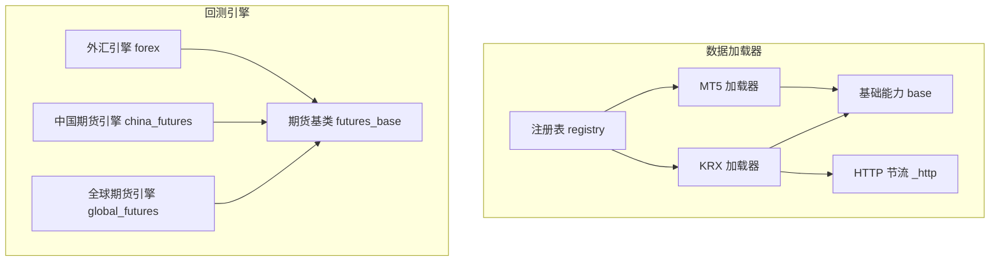
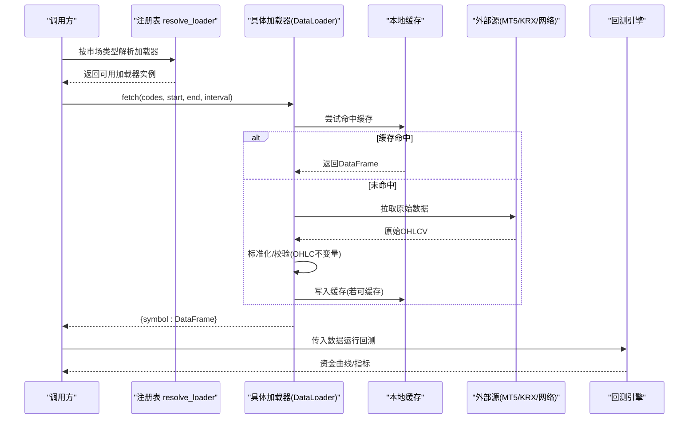
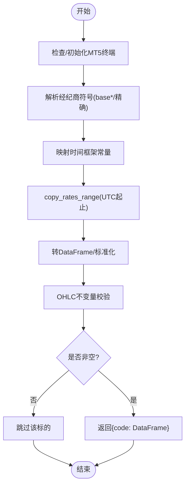
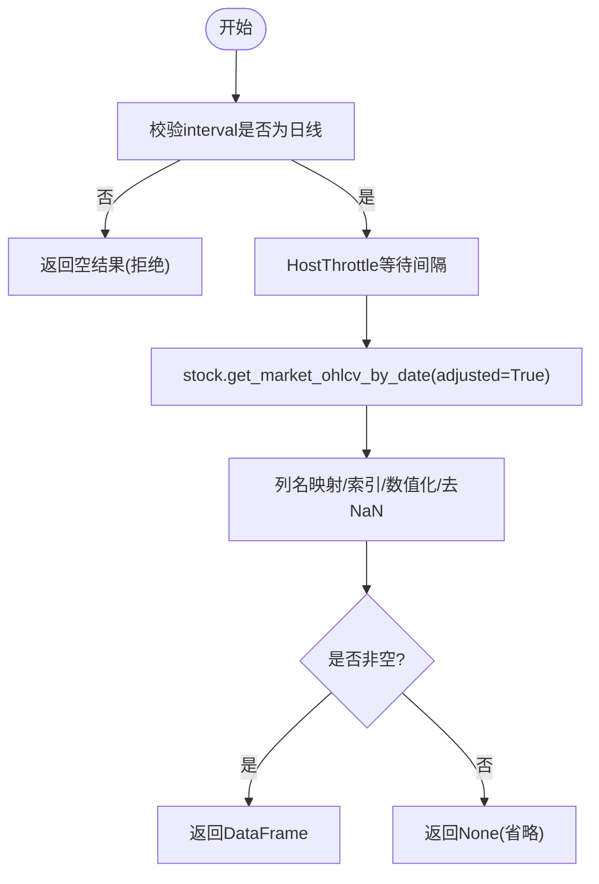
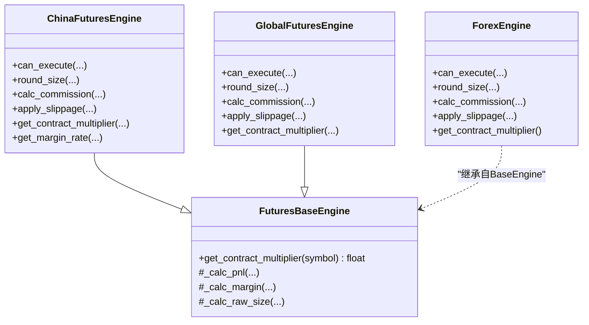
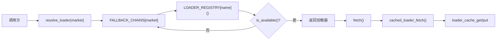

# 外汇与期货数据源

<cite>
**本文引用的文件**
- [mt5_loader.py](file://agent/backtest/loaders/mt5_loader.py)
- [pykrx_loader.py](file://agent/backtest/loaders/pykrx_loader.py)
- [base.py](file://agent/backtest/loaders/base.py)
- [registry.py](file://agent/backtest/loaders/registry.py)
- [_http.py](file://agent/backtest/loaders/_http.py)
- [forex.py](file://agent/backtest/engines/forex.py)
- [futures_base.py](file://agent/backtest/engines/futures_base.py)
- [china_futures.py](file://agent/backtest/engines/china_futures.py)
- [global_futures.py](file://agent/backtest/engines/global_futures.py)
- [_client.py](file://agent/src/trading/connectors/mt5/_client.py)
</cite>

## 目录
1. [简介](#简介)
2. [项目结构](#项目结构)
3. [核心组件](#核心组件)
4. [架构总览](#架构总览)
5. [详细组件分析](#详细组件分析)
6. [依赖关系分析](#依赖关系分析)
7. [性能考虑](#性能考虑)
8. [故障诊断指南](#故障诊断指南)
9. [结论](#结论)
10. [附录：配置与使用示例](#附录配置与使用示例)

## 简介
本文件面向外汇与期货市场的数据加载与回测引擎，聚焦以下目标：
- 本地 MetaTrader 5（MT5）终端的集成：外汇对、贵金属、指数的实时与历史数据获取。
- 韩国交易所（KRX）接入：股票、期权、期货等金融工具的数据处理路径与限制。
- 专业市场特殊逻辑：合约乘数、到期日、保证金、滑点与手续费建模。
- 本地终端连接管理、数据同步机制、异常处理策略。
- 配置指南与常见场景的使用示例。
- 性能调优与故障诊断方法。

## 项目结构
围绕“数据加载器 + 回测引擎”的两层设计：
- 数据加载器层：按市场提供统一接口 DataLoaderProtocol，负责从不同来源拉取 OHLCV 并标准化为 trade_date 索引的 DataFrame。
- 回测引擎层：针对不同市场规则（外汇、中国期货、全球期货）实现 PnL、保证金、滑点、手续费、涨跌停等。

图表来源
- [registry.py:139-158](file://agent/backtest/loaders/registry.py#L139-L158)
- [mt5_loader.py:170-251](file://agent/backtest/loaders/mt5_loader.py#L170-L251)
- [pykrx_loader.py:76-164](file://agent/backtest/loaders/pykrx_loader.py#L76-L164)
- [base.py:239-441](file://agent/backtest/loaders/base.py#L239-L441)
- [_http.py:46-173](file://agent/backtest/loaders/_http.py#L46-L173)
- [forex.py:56-137](file://agent/backtest/engines/forex.py#L56-L137)
- [futures_base.py:19-57](file://agent/backtest/engines/futures_base.py#L19-L57)
- [china_futures.py:131-255](file://agent/backtest/engines/china_futures.py#L131-L255)
- [global_futures.py:176-267](file://agent/backtest/engines/global_futures.py#L176-L267)

章节来源
- [registry.py:1-158](file://agent/backtest/loaders/registry.py#L1-L158)
- [base.py:1-120](file://agent/backtest/loaders/base.py#L1-L120)

## 核心组件
- 数据加载协议与缓存：统一 DataLoaderProtocol 接口；可选本地 Parquet 缓存，键由 source/symbol/timeframe/date 内容哈希生成，支持读写失败降级。
- 市场回退链：按市场类型维护优先顺序，如 forex 优先 mt5，其次 akshare/yfinance/local；kr_equity 优先 pykrx，其次 yahoo/yfinance/local。
- MT5 加载器：Windows 平台可选依赖，读取 ~/.vibe-trading/mt5.json，懒加载 MetaTrader5 SDK，进程级初始化状态缓存，符号后缀自动发现（Exness 风格）。
- KRX 加载器：免费无鉴权，仅日线，通过 pykrx 拉取 Naver 调整价格序列，内置 HostThrottle 控制请求间隔。
- 外汇引擎：标准手 100,000 单位，点差+滑点模型，隔夜利息 swap，24x5 交易。
- 期货基类：引入合约乘数影响 PnL、保证金与头寸规模计算。
- 中国期货引擎：产品代码映射到乘数、保证金率、涨跌停、手续费（固定或按名义），T+0 双向。
- 全球期货引擎：CME/ICE/Eurex 常用品种乘数、佣金、涨跌停（指数类），近似 24x5。

章节来源
- [base.py:239-441](file://agent/backtest/loaders/base.py#L239-L441)
- [registry.py:139-158](file://agent/backtest/loaders/registry.py#L139-L158)
- [mt5_loader.py:61-147](file://agent/backtest/loaders/mt5_loader.py#L61-L147)
- [pykrx_loader.py:66-164](file://agent/backtest/loaders/pykrx_loader.py#L66-L164)
- [forex.py:23-137](file://agent/backtest/engines/forex.py#L23-L137)
- [futures_base.py:19-57](file://agent/backtest/engines/futures_base.py#L19-L57)
- [china_futures.py:29-115](file://agent/backtest/engines/china_futures.py#L29-L115)
- [global_futures.py:23-92](file://agent/backtest/engines/global_futures.py#L23-L92)

## 架构总览
数据流从“调用方”进入“回退链解析”，选择可用加载器，执行 fetch，返回标准化 DataFrame；回测引擎根据市场规则进行下单模拟与风控。

图表来源
- [registry.py:614-649](file://agent/backtest/loaders/registry.py#L614-L649)
- [base.py:623-661](file://agent/backtest/loaders/base.py#L623-L661)
- [mt5_loader.py:186-251](file://agent/backtest/loaders/mt5_loader.py#L186-L251)
- [pykrx_loader.py:92-164](file://agent/backtest/loaders/pykrx_loader.py#L92-L164)

## 详细组件分析

### MT5 数据加载器（外汇/贵金属/指数）
- 终端连接管理
  - 进程级初始化状态缓存，避免重复 initialize。
  - 配置文件 ~/.vibe-trading/mt5.json 共享给交易连接器，支持 login/password/server/terminal_path/timeout。
  - 符号解析：先精确匹配，再基于 base* 模糊匹配，选择最短名称（Exness 风格 m/z 后缀）。
- 时间框架映射：支持 1m/5m/15m/30m/1H/4H/1D/1W/1M。
- 数据转换：将结构化数组转为 DataFrame，trade_date 索引，volume 用 tick_volume 代理，UTC 时区处理，区间包含性过滤，OHLC 不变量校验。
- 异常策略：单个标的失败不中断批次，记录警告并跳过。

图表来源
- [mt5_loader.py:79-147](file://agent/backtest/loaders/mt5_loader.py#L79-L147)
- [mt5_loader.py:150-251](file://agent/backtest/loaders/mt5_loader.py#L150-L251)

章节来源
- [mt5_loader.py:1-251](file://agent/backtest/loaders/mt5_loader.py#L1-L251)
- [_client.py:55-180](file://agent/src/trading/connectors/mt5/_client.py#L55-L180)

### KRX 数据加载器（韩国股票/期权/期货）
- 数据范围：仅日线（1d/d/day/daily），其他周期拒绝以避免误用日线数据。
- 数据源：pykrx 默认 adjusted=True（Naver 调整价），明确标注来源。
- 速率控制：HostThrottle 最小间隔默认 1s，可通过环境变量覆盖。
- 标准化：韩文列名映射为 open/high/low/close/volume，索引为 trade_date，数值化并去无效行。

图表来源
- [pykrx_loader.py:54-164](file://agent/backtest/loaders/pykrx_loader.py#L54-L164)
- [_http.py:46-107](file://agent/backtest/loaders/_http.py#L46-L107)

章节来源
- [pykrx_loader.py:1-194](file://agent/backtest/loaders/pykrx_loader.py#L1-L194)
- [_http.py:1-201](file://agent/backtest/loaders/_http.py#L1-L201)

### 外汇回测引擎
- 市场规则：24x5，点差替代显式佣金，杠杆可配，标准手=100,000 基础货币单位，每日收盘 swap。
- 滑点模型：按品种点值（JPY 对 0.01，其他 0.0001），半点差+额外滑点。
- 头寸四舍五入：按微手粒度（1000 单位）对齐。
- 合约乘数：外汇为 1.0（以货币单位计规模）。

章节来源
- [forex.py:1-137](file://agent/backtest/engines/forex.py#L1-L137)

### 期货基类与产品引擎
- 期货基类：在 BaseEngine 上叠加合约乘数，重写 PnL、保证金、头寸规模计算。
- 中国期货引擎：
  - 产品代码提取（IF/IC/IH/IM/T/TF/TS/TL/au/ag/cu/...）。
  - 乘数、保证金率、涨跌停、手续费（固定或按名义）映射。
  - T+0 双向交易，执行前涨跌停检查。
- 全球期货引擎：
  - 产品代码提取（ES/NQ/CL/GC/...），乘数、佣金、涨跌停（指数类）。
  - 近似 24x5，滚动/到期不建模（假设连续主力合约数据）。

图表来源
- [futures_base.py:19-57](file://agent/backtest/engines/futures_base.py#L19-L57)
- [china_futures.py:131-255](file://agent/backtest/engines/china_futures.py#L131-L255)
- [global_futures.py:176-267](file://agent/backtest/engines/global_futures.py#L176-L267)
- [forex.py:56-137](file://agent/backtest/engines/forex.py#L56-L137)

章节来源
- [futures_base.py:1-57](file://agent/backtest/engines/futures_base.py#L1-L57)
- [china_futures.py:1-255](file://agent/backtest/engines/china_futures.py#L1-L255)
- [global_futures.py:1-223](file://agent/backtest/engines/global_futures.py#L1-L223)

## 依赖关系分析
- 加载器注册与回退链：
  - 所有加载器通过 @register 装饰器注入全局 LOADER_REGISTRY。
  - 按市场类型定义 FALLBACK_CHAINS，resolve_loader 遍历并返回首个可用的加载器。
  - 某些源（local/qveris/tickerall）禁止静默回退到网络源，避免掩盖配置问题。
- 数据缓存：
  - 基于内容哈希的 parquet 缓存，读写失败均不影响主流程。
  - 仅当 end_date 已结算（非当日）才缓存，避免钉住未定型行情。
- HTTP 节流：
  - 按 host bucket 的最小间隔与抖动，防止被限流封禁。
  - 复用 requests.Session 提升吞吐。

图表来源
- [registry.py:139-196](file://agent/backtest/loaders/registry.py#L139-L196)
- [base.py:239-441](file://agent/backtest/loaders/base.py#L239-L441)

章节来源
- [registry.py:1-256](file://agent/backtest/loaders/registry.py#L1-L256)
- [base.py:239-441](file://agent/backtest/loaders/base.py#L239-L441)

## 性能考虑
- MT5 加载器
  - 进程级初始化缓存，减少 initialize 开销。
  - 符号解析 memo 化，避免重复 symbols_get。
  - 时间范围边界处理：end_date 包含全天，避免遗漏最后一根 bar。
- KRX 加载器
  - 强制日线，避免错误的时间粒度导致回测失真。
  - HostThrottle 默认 1s，批量任务可调大 VIBE_TRADING_PYKRX_MIN_INTERVAL。
- 通用
  - 本地缓存仅在 end_date 已结算时生效，降低重复网络请求。
  - 重试与预算：retry_with_budget 提供有界重试与超时保护，适合不稳定 API。
  - HTTP 会话复用与 User-Agent 伪装，降低被拒概率。

章节来源
- [mt5_loader.py:53-147](file://agent/backtest/loaders/mt5_loader.py#L53-L147)
- [pykrx_loader.py:54-74](file://agent/backtest/loaders/pykrx_loader.py#L54-L74)
- [base.py:398-450](file://agent/backtest/loaders/base.py#L398-L450)
- [_http.py:46-173](file://agent/backtest/loaders/_http.py#L46-L173)

## 故障诊断指南
- MT5 连接问题
  - 现象：initialize 失败或 last_error 非空。
  - 排查：确认 Windows 环境、MetaTrader5 包安装、终端已登录且服务器一致；检查 ~/.vibe-trading/mt5.json 中 login/password/server/terminal_path/timeout。
  - 参考：连接上下文管理器与身份校验。
- 符号找不到
  - 现象：symbols_get 为空或未匹配。
  - 排查：确认 base 符号与经纪商后缀（如 Exness 的 m/z），查看日志中的 symbol 解析过程。
- KRX 数据为空或拒绝
  - 现象：interval 非日线被拒绝；调整后数据为空。
  - 排查：确保 interval 为 1d/d/day/daily；检查 pykrx 可用性；增大最小间隔避免限流。
- 数据质量
  - 现象：OHLC 违反不变量（high < low 或非正价格）。
  - 排查：validate_ohlc 会丢弃或告警；检查上游数据源；必要时放宽 allow_nonpositive_prices（如电力负价场景）。
- 缓存相关
  - 现象：旧数据持续返回。
  - 排查：确认 end_date 已结算；检查缓存目录权限；清理损坏条目后重试。

章节来源
- [_client.py:238-273](file://agent/src/trading/connectors/mt5/_client.py#L238-L273)
- [mt5_loader.py:121-147](file://agent/backtest/loaders/mt5_loader.py#L121-L147)
- [pykrx_loader.py:118-164](file://agent/backtest/loaders/pykrx_loader.py#L118-L164)
- [base.py:187-256](file://agent/backtest/loaders/base.py#L187-L256)
- [base.py:550-620](file://agent/backtest/loaders/base.py#L550-L620)

## 结论
本方案通过统一的加载器协议与回退链，将 MT5 本地终端与 KRX 免费数据源无缝接入回测系统；结合外汇与期货引擎的市场规则建模，实现了从数据到策略评估的完整链路。通过缓存、节流、重试与严格的 OHLC 校验，系统在稳定性与性能之间取得平衡。对于生产使用，建议严格配置 MT5 终端与账户信息，合理设置 KRX 请求间隔，并根据市场特性调整滑点与保证金参数。

## 附录：配置与使用示例

### MT5 配置要点
- 配置文件位置：~/.vibe-trading/mt5.json
- 关键字段：login、password、server、terminal_path、profile、symbol_suffix、deviation_points、max_order_volume、max_order_notional_usd、timeout、readonly
- 行为说明：
  - profile 区分 demo/live-readonly/live；live 下单需通过指令门控与熔断。
  - symbol_suffix 用于适配经纪商后缀（如 Exness 的 m）。
  - 每次会话都会重新验证 trade_mode 与 login，防止误连真实账户。

章节来源
- [_client.py:55-180](file://agent/src/trading/connectors/mt5/_client.py#L55-L180)

### KRX 使用注意
- 仅支持日线；如需分钟线请走其他数据源。
- 数据为 Naver 调整价，适合回测但非 KRX 原始报价。
- 可通过环境变量调整最小请求间隔，避免限流。

章节来源
- [pykrx_loader.py:1-30](file://agent/backtest/loaders/pykrx_loader.py#L1-L30)
- [pykrx_loader.py:54-74](file://agent/backtest/loaders/pykrx_loader.py#L54-L74)

### 常见场景
- 外汇回测
  - 数据源：优先 MT5（本地终端），否则回退至 akshare/yfinance/local。
  - 引擎：ForexEngine，设置 leverage、spread_pips_override、lot_size、swap_enabled、slippage_pips。
- 中国期货回测
  - 数据源：tushare/akshare/local。
  - 引擎：ChinaFuturesEngine，设置 slippage、margin_rate_override、commission_override；产品代码映射到乘数与保证金率。
- 全球期货回测
  - 数据源：同中国期货。
  - 引擎：GlobalFuturesEngine，设置 slippage、commission_per_contract；产品代码映射到乘数与佣金。

章节来源
- [registry.py:139-158](file://agent/backtest/loaders/registry.py#L139-L158)
- [forex.py:56-137](file://agent/backtest/engines/forex.py#L56-L137)
- [china_futures.py:131-255](file://agent/backtest/engines/china_futures.py#L131-L255)
- [global_futures.py:176-267](file://agent/backtest/engines/global_futures.py#L176-L267)