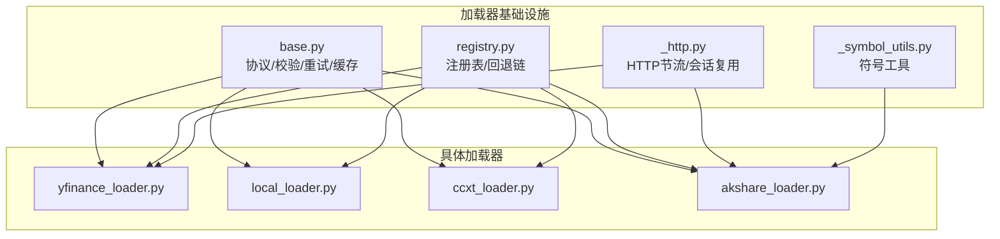
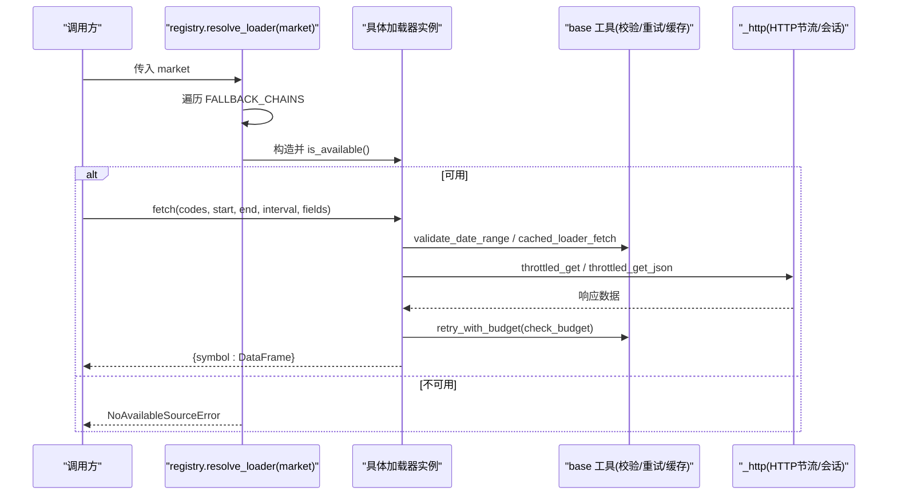
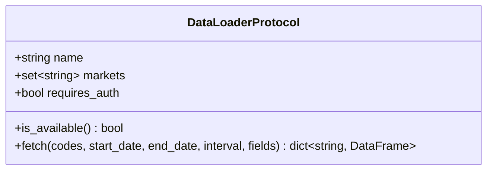
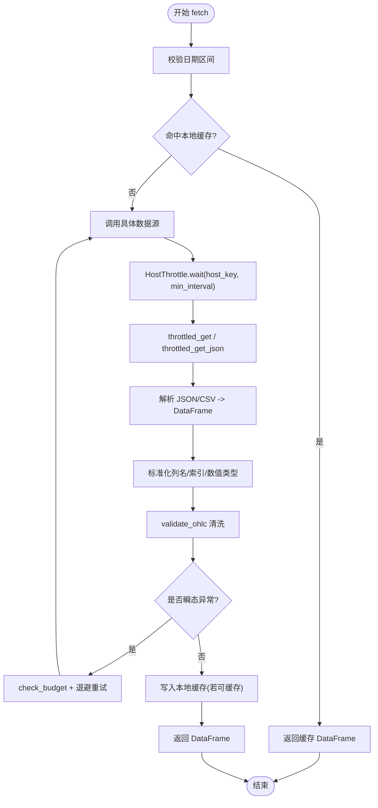
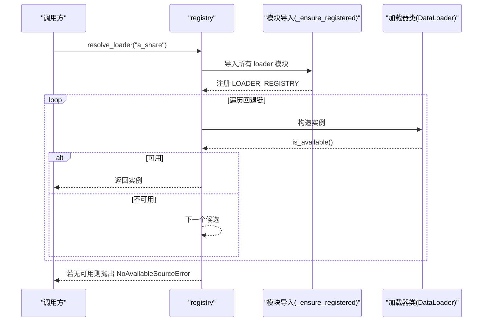
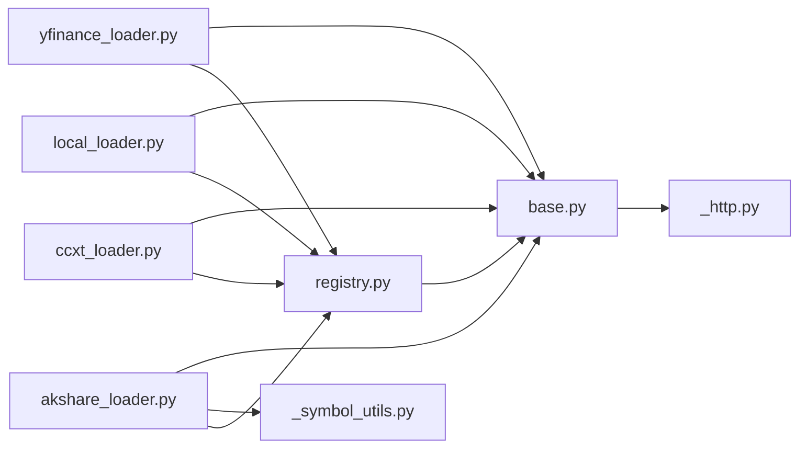

# 加载器架构设计

<cite>
**本文引用的文件**
- [base.py](file://agent/backtest/loaders/base.py)
- [registry.py](file://agent/backtest/loaders/registry.py)
- [_http.py](file://agent/backtest/loaders/_http.py)
- [_symbol_utils.py](file://agent/backtest/loaders/_symbol_utils.py)
- [yfinance_loader.py](file://agent/backtest/loaders/yfinance_loader.py)
- [local_loader.py](file://agent/backtest/loaders/local_loader.py)
- [ccxt_loader.py](file://agent/backtest/loaders/ccxt_loader.py)
- [akshare_loader.py](file://agent/backtest/loaders/akshare_loader.py)
</cite>

## 目录
1. [简介](#简介)
2. [项目结构](#项目结构)
3. [核心组件](#核心组件)
4. [架构总览](#架构总览)
5. [详细组件分析](#详细组件分析)
6. [依赖关系分析](#依赖关系分析)
7. [性能考量](#性能考量)
8. [故障排查指南](#故障排查指南)
9. [结论](#结论)
10. [附录：扩展新加载器的实践指南](#附录：扩展新加载器的实践指南)

## 简介
本技术文档围绕“数据加载器”的架构设计展开，重点解释以下方面：
- 基础接口与抽象类的设计理念、核心方法签名与约定
- 适配器模式在统一数据格式转换、错误处理策略、连接管理中的应用
- 注册表系统的工作原理（动态发现、生命周期管理、依赖注入）
- 符号工具函数的作用（股票代码标准化、市场识别、交易时间处理等）
- 架构扩展指南：如何基于基础接口开发新的数据加载器，并给出正确使用示例路径

该架构通过统一的 DataLoaderProtocol 定义加载器契约，借助 registry 实现按市场的自动选择与回退链，配合 HTTP 节流、重试预算、本地缓存等通用能力，使不同数据源以一致的方式被上层回测引擎消费。

## 项目结构
数据加载子系统位于 agent/backtest/loaders 目录下，关键文件职责如下：
- base.py：定义 DataLoaderProtocol 协议、校验工具、重试与预算、本地缓存等基础设施
- registry.py：全局注册表、模块懒加载、市场到数据源的优先级回退链
- _http.py：进程级 HostThrottle 节流、请求会话复用、JSON/CSV GET 封装
- _symbol_utils.py：ETF/LOF 前缀识别等符号类型检测工具
- 各具体 loader：如 yfinance_loader、local_loader、ccxt_loader、akshare_loader 等，均实现 DataLoaderProtocol 并通过 @register 装饰器注册

**图表来源**
- [base.py:851-887](file://agent/backtest/loaders/base.py#L851-L887)
- [registry.py:614-649](file://agent/backtest/loaders/registry.py#L614-L649)
- [_http.py:141-201](file://agent/backtest/loaders/_http.py#L141-L201)
- [_symbol_utils.py:12-21](file://agent/backtest/loaders/_symbol_utils.py#L12-L21)

**章节来源**
- [base.py:1-657](file://agent/backtest/loaders/base.py#L1-L657)
- [registry.py:1-256](file://agent/backtest/loaders/registry.py#L1-L256)
- [_http.py:1-201](file://agent/backtest/loaders/_http.py#L1-L201)
- [_symbol_utils.py:1-21](file://agent/backtest/loaders/_symbol_utils.py#L1-L21)

## 核心组件
- DataLoaderProtocol（协议）：定义 name、markets、requires_auth、is_available()、fetch(codes, start_date, end_date, interval, fields) 的统一契约，确保所有加载器对外暴露一致的调用方式
- 校验与清理：validate_date_range、validate_ohlc 保证日期区间合法与 OHLC 数据完整性
- 重试与预算：check_budget、retry_with_budget 提供带超时预算的指数退避重试，仅对声明的瞬态异常重试
- 本地缓存：loader_cache_* 系列函数提供内容寻址的 parquet 缓存读写，避免重复拉取
- 注册表：@register 装饰器将加载器类加入 LOADER_REGISTRY；resolve_loader/get_loader_cls_with_fallback 根据市场或显式 source 选择可用加载器，支持回退链
- HTTP 节流：HostThrottle + throttled_get/throttled_get_json 实现按 host 的最小间隔控制与 requests.Session 复用
- 符号工具：ETF/LOF 前缀识别、市场识别辅助函数

**章节来源**
- [base.py:164-256](file://agent/backtest/loaders/base.py#L164-L256)
- [base.py:377-450](file://agent/backtest/loaders/base.py#L377-L450)
- [base.py:243-441](file://agent/backtest/loaders/base.py#L243-L441)
- [registry.py:63-117](file://agent/backtest/loaders/registry.py#L63-L117)
- [registry.py:161-256](file://agent/backtest/loaders/registry.py#L161-L256)
- [_http.py:46-173](file://agent/backtest/loaders/_http.py#L46-L173)
- [_symbol_utils.py:12-21](file://agent/backtest/loaders/_symbol_utils.py#L12-L21)

## 架构总览
整体采用“协议 + 适配器 + 注册表 + 通用能力”的分层设计：
- 协议层：DataLoaderProtocol 定义统一接口
- 适配层：各具体加载器实现协议，完成特定数据源的适配（符号映射、字段归一化、错误分类）
- 调度层：registry 负责按市场选择加载器，并提供回退链
- 能力层：base 提供校验、重试、缓存；_http 提供节流与连接复用；_symbol_utils 提供符号工具

**图表来源**
- [registry.py:614-649](file://agent/backtest/loaders/registry.py#L614-L649)
- [base.py:377-450](file://agent/backtest/loaders/base.py#L377-L450)
- [_http.py:141-201](file://agent/backtest/loaders/_http.py#L141-L201)

## 详细组件分析

### 基础接口与抽象契约（DataLoaderProtocol）
- 设计理念：以 Protocol 形式定义最小必要接口，便于静态检查与运行时解耦
- 核心属性与方法：
  - name：加载器标识，用于注册与日志
  - markets：支持的市场集合，用于回退链匹配
  - requires_auth：是否需要认证
  - is_available()：可用性探测（依赖安装、网络、凭据等）
  - fetch(codes, start_date, end_date, interval, fields)：返回 {symbol: DataFrame}，DataFrame 需包含 trade_date 索引与 open/high/low/close/volume 列
- 可选约定：volume_units 声明 volume 单位（如 lots/shares），消费者从 _provenance 读取 per-symbol 单位

**图表来源**
- [base.py:851-887](file://agent/backtest/loaders/base.py#L851-L887)

**章节来源**
- [base.py:851-887](file://agent/backtest/loaders/base.py#L851-L887)

### 适配器模式：统一数据格式转换、错误处理、连接管理
- 统一数据格式：各加载器内部将原始数据转换为标准 OHLCV 列名与索引（trade_date），并在返回前进行 validate_ohlc 清洗
- 错误处理策略：
  - 使用 check_budget/retry_with_budget 对瞬态异常进行有界重试
  - HTTP 层通过 throttled_get_json 将非 2xx 或解析失败视为可重试异常
  - 单 symbol 失败记录日志并继续其他 symbol，提升批量鲁棒性
- 连接管理：
  - _http 中 HostThrottle 按 host bucket 控制最小请求间隔，避免触发 IP 封禁
  - 进程内 requests.Session 池复用，减少 TCP/TLS 握手开销

**图表来源**
- [base.py:377-450](file://agent/backtest/loaders/base.py#L377-L450)
- [base.py:565-661](file://agent/backtest/loaders/base.py#L565-L661)
- [_http.py:141-201](file://agent/backtest/loaders/_http.py#L141-L201)

**章节来源**
- [base.py:168-256](file://agent/backtest/loaders/base.py#L168-L256)
- [base.py:377-450](file://agent/backtest/loaders/base.py#L377-L450)
- [_http.py:46-173](file://agent/backtest/loaders/_http.py#L46-L173)

### 注册表系统：动态发现、生命周期管理、依赖注入
- 动态发现：通过 @register 装饰器在模块导入时向 LOADER_REGISTRY 登记加载器类
- 懒加载：_ensure_registered 按需 import 所有已知 loader 模块，避免启动时强依赖缺失导致的失败
- 生命周期：
  - resolve_loader：按市场回退链尝试构造加载器并调用 is_available()，首个可用即返回
  - get_loader_cls_with_fallback：按显式 source 获取类，必要时同市场回退；对 local/qveris/tickerall 等禁止静默降级为网络源
- 依赖注入：通过构造函数参数与环境变量注入配置（如代理、超时、预算），不改变外部接口

**图表来源**
- [registry.py:72-117](file://agent/backtest/loaders/registry.py#L72-L117)
- [registry.py:614-649](file://agent/backtest/loaders/registry.py#L614-L649)

**章节来源**
- [registry.py:63-117](file://agent/backtest/loaders/registry.py#L63-L117)
- [registry.py:161-256](file://agent/backtest/loaders/registry.py#L161-L256)

### 符号工具函数：标准化、市场识别、交易时间处理
- ETF/LOF 前缀识别：_is_etf_listed 判断交易所上市的 ETF/LOF 代码，用于路由到正确接口
- 市场识别：在各 loader 中结合后缀（.US/.HK/.SH/.SZ/.FX）与库内置映射识别市场
- 交易时间处理：
  - 统一将时间戳转为 UTC 再去除时区，保持索引一致性
  - 本地加载器支持 resample 到目标周期，并警告无法上采样场景
  - yfinance 将 inclusive end_date 转换为 exclusive 边界

**章节来源**
- [_symbol_utils.py:12-21](file://agent/backtest/loaders/_symbol_utils.py#L12-L21)
- [local_loader.py:134-189](file://agent/backtest/loaders/local_loader.py#L134-L189)
- [yfinance_loader.py:96-98](file://agent/backtest/loaders/yfinance_loader.py#L96-L98)

### 典型加载器实现要点
- yfinance_loader：符号映射、区间映射、多列扁平化、单 symbol 提取、标准化与验证
- local_loader：读取 CSV/Parquet/DuckDB，列名映射、日期解析、重采样、OHLC 校验
- ccxt_loader：加密货币统一接入，代理配置、超时与预算控制、维护保证金层级工件校验
- akshare_loader：免费无鉴权聚合源，按市场路由（A股/美股/港股/外汇/期货/基金/宏观），ETF 优先识别

**章节来源**
- [yfinance_loader.py:1-200](file://agent/backtest/loaders/yfinance_loader.py#L1-L200)
- [local_loader.py:1-200](file://agent/backtest/loaders/local_loader.py#L1-L200)
- [ccxt_loader.py:1-200](file://agent/backtest/loaders/ccxt_loader.py#L1-L200)
- [akshare_loader.py:1-200](file://agent/backtest/loaders/akshare_loader.py#L1-L200)

## 依赖关系分析
- 耦合度：
  - 加载器仅依赖 base 提供的工具与 registry 的注册机制，低耦合
  - _http 与 base 提供横切能力，被多个加载器复用
- 直接依赖：
  - registry 依赖 base.NoAvailableSourceError
  - 各 loader 依赖 base 的工具函数与 registry 的 @register
- 间接依赖：
  - 第三方库（yfinance、akshare、ccxt、requests、duckdb、pandas）仅在各自加载器或工具中引入，避免全局污染
- 循环依赖：未发现明显循环依赖；模块间通过工具函数与装饰器解耦

**图表来源**
- [registry.py:17-17](file://agent/backtest/loaders/registry.py#L17-L17)
- [yfinance_loader.py:14-20](file://agent/backtest/loaders/yfinance_loader.py#L14-L20)
- [local_loader.py:41-42](file://agent/backtest/loaders/local_loader.py#L41-L42)
- [ccxt_loader.py:20-28](file://agent/backtest/loaders/ccxt_loader.py#L20-L28)
- [akshare_loader.py:16-18](file://agent/backtest/loaders/akshare_loader.py#L16-L18)

**章节来源**
- [registry.py:1-256](file://agent/backtest/loaders/registry.py#L1-L256)
- [base.py:1-657](file://agent/backtest/loaders/base.py#L1-L657)

## 性能考量
- 本地缓存：基于内容地址的 parquet 缓存，避免重复拉取；仅对已结算区间缓存；读写失败不影响主流程
- 重试与预算：bounded retry 防止长时间挂起；指数退避降低瞬时压力
- HTTP 节流：按 host 最小间隔与随机抖动，避免并发同步；Session 复用减少握手成本
- 数据清洗：validate_ohlc 尽早剔除无效 K 线，减少下游计算开销
- 重采样：本地加载器按需 downsample，避免不必要的数据膨胀

[本节为通用指导，无需特定文件引用]

## 故障排查指南
- 无可用数据源：当所有回退链候选不可用时，会抛出 NoAvailableSourceError；检查网络、API Token、依赖安装
- 缓存问题：缓存读/写失败为非致命，会自动回退到在线源；可通过环境变量关闭缓存或调整缓存根路径
- 超时与重试：若频繁 TimeoutError，检查 CCXT_FETCH_BUDGET_S、CCXT_TIMEOUT_MS 等环境配置，或提高预算
- 速率限制：遇到 429/封禁，增大对应 host 的 min_interval（如 VIBE_TRADING_EASTMONEY_MIN_INTERVAL）
- 数据质量：validate_ohlc 丢弃非法 K 线；若结果过少，检查上游数据源与日期范围

**章节来源**
- [registry.py:646-649](file://agent/backtest/loaders/registry.py#L646-L649)
- [base.py:243-441](file://agent/backtest/loaders/base.py#L243-L441)
- [ccxt_loader.py:50-57](file://agent/backtest/loaders/ccxt_loader.py#L50-L57)
- [_http.py:127-139](file://agent/backtest/loaders/_http.py#L127-L139)

## 结论
该数据加载器架构通过清晰的协议定义、灵活的注册与回退机制、稳健的重试与缓存策略，以及进程级 HTTP 节流，实现了跨市场、跨数据源的一致化接入。各加载器专注于领域适配，通用能力下沉至 base 与 _http，提升了可维护性与可扩展性。

[本节为总结性内容，无需特定文件引用]

## 附录：扩展新加载器的实践指南
- 步骤概览
  1) 新建 loader 模块，实现 DataLoaderProtocol（name/markets/requires_auth/is_available/fetch）
  2) 使用 @register 装饰器注册
  3) 在 fetch 中调用 base 的 validate_date_range、cached_loader_fetch、retry_with_budget/check_budget
  4) 对 HTTP 调用使用 throttled_get/throttled_get_json，设置合适的 host_key 与 min_interval
  5) 将原始数据标准化为 OHLCV 列与 trade_date 索引，并调用 validate_ohlc 清洗
  6) 如需本地文件读取，参考 local_loader 的列映射与重采样逻辑
  7) 将新加载器加入 registry 的 _loader_modules 列表，以便 _ensure_registered 懒加载
  8) 根据需要更新 VALID_SOURCES 与 FALLBACK_CHAINS（若新增市场或希望纳入回退链）

- 正确使用示例（路径指引）
  - 协议与工具：参见 [base.py:851-887](file://agent/backtest/loaders/base.py#L851-L887)、[base.py:377-450](file://agent/backtest/loaders/base.py#L377-L450)、[base.py:565-661](file://agent/backtest/loaders/base.py#L565-L661)
  - 注册与回退：参见 [registry.py:63-117](file://agent/backtest/loaders/registry.py#L63-L117)、[registry.py:614-649](file://agent/backtest/loaders/registry.py#L614-L649)
  - HTTP 节流：参见 [_http.py:141-201](file://agent/backtest/loaders/_http.py#L141-L201)
  - 参考实现：
    - yfinance 适配：[yfinance_loader.py:1-200](file://agent/backtest/loaders/yfinance_loader.py#L1-L200)
    - 本地文件适配：[local_loader.py:1-200](file://agent/backtest/loaders/local_loader.py#L1-L200)
    - 加密货币统一接入：[ccxt_loader.py:1-200](file://agent/backtest/loaders/ccxt_loader.py#L1-L200)
    - 免费聚合源适配：[akshare_loader.py:1-200](file://agent/backtest/loaders/akshare_loader.py#L1-L200)

- 最佳实践
  - 明确声明 markets 与 volume_units，便于消费者正确处理单位
  - 对瞬态异常进行分类，仅重试声明的瞬态异常
  - 合理设置 min_interval 与预算，避免被封禁或长时间阻塞
  - 使用缓存键包含 timeframe 与 fields，确保缓存命中准确
  - 对本地文件加载，严格校验列名与日期格式，必要时重采样

[本节为扩展指南，未直接分析具体代码片段，故无“章节来源”标注]