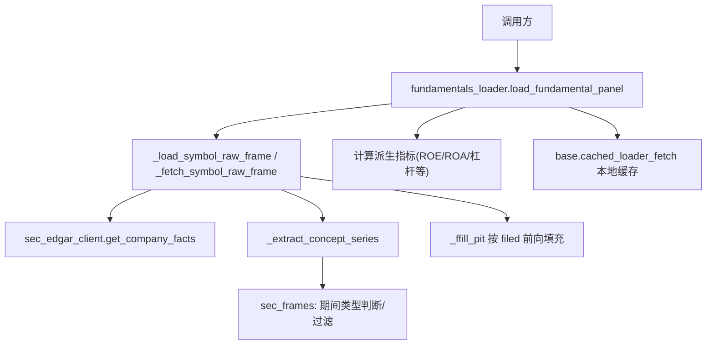
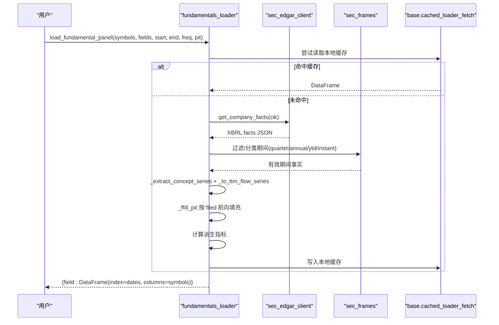
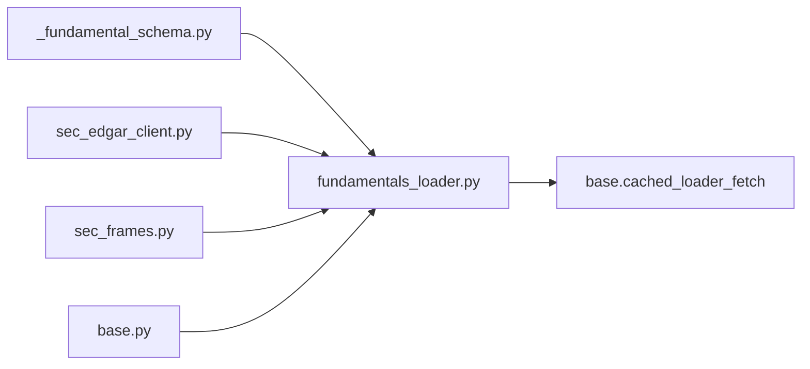

# 基本面数据加载器

<cite>
**本文引用的文件**
- [agent/backtest/loaders/_fundamental_schema.py](file://agent/backtest/loaders/_fundamental_schema.py)
- [agent/backtest/loaders/fundamentals_loader.py](file://agent/backtest/loaders/fundamentals_loader.py)
- [agent/backtest/loaders/sec_edgar_client.py](file://agent/backtest/loaders/sec_edgar_client.py)
- [agent/backtest/loaders/sec_frames.py](file://agent/backtest/loaders/sec_frames.py)
- [agent/backtest/loaders/base.py](file://agent/backtest/loaders/base.py)
- [agent/tests/test_fundamental_schema.py](file://agent/tests/test_fundamental_schema.py)
- [agent/tests/test_fundamentals_pit.py](file://agent/tests/test_fundamentals_pit.py)
</cite>

## 目录
1. [简介](#简介)
2. [项目结构](#项目结构)
3. [核心组件](#核心组件)
4. [架构总览](#架构总览)
5. [详细组件分析](#详细组件分析)
6. [依赖关系分析](#依赖关系分析)
7. [性能与可扩展性](#性能与可扩展性)
8. [数据质量与清洗](#数据质量与清洗)
9. [历史数据管理与版本控制](#历史数据管理与版本控制)
10. [使用示例：公司基本面研究与估值](#使用示例公司基本面研究与估值)
11. [故障排查指南](#故障排查指南)
12. [结论](#结论)

## 简介
本模块提供面向美国上市公司（SEC XBRL）的基本面数据加载能力，将稀疏的XBRL事实转换为点-in-time（PIT）安全、按日对齐的面板数据。支持资产负债表、利润表、现金流量表相关字段的标准化提取，并提供一系列派生指标（如ROE、ROA、杠杆率等）。同时内置缓存、重试、预算控制与数据校验机制，确保在大规模批量拉取时的稳定性与可重复性。

## 项目结构
- 数据源客户端：负责与SEC EDGAR REST API交互，完成ticker到CIK映射、提交索引与公司事实获取。
- 框架与周期选择：统一处理XBRL中“瞬时/季度/年度/YTD”等期间类型的识别与筛选。
- 字段模式与派生指标：定义原始字段、SEC概念别名映射以及派生指标的算法。
- 加载器主流程：串联上述组件，完成从请求到面板输出的全链路处理。
- 基础工具：通用重试、预算、本地缓存、日期校验等。

图表来源
- [agent/backtest/loaders/fundamentals_loader.py:196-277](file://agent/backtest/loaders/fundamentals_loader.py#L196-L277)
- [agent/backtest/loaders/sec_edgar_client.py:166-227](file://agent/backtest/loaders/sec_edgar_client.py#L166-L227)
- [agent/backtest/loaders/sec_frames.py:42-129](file://agent/backtest/loaders/sec_frames.py#L42-L129)
- [agent/backtest/loaders/base.py:623-661](file://agent/backtest/loaders/base.py#L623-L661)

章节来源
- [agent/backtest/loaders/fundamentals_loader.py:1-501](file://agent/backtest/loaders/fundamentals_loader.py#L1-L501)
- [agent/backtest/loaders/sec_edgar_client.py:1-235](file://agent/backtest/loaders/sec_edgar_client.py#L1-L235)
- [agent/backtest/loaders/sec_frames.py:1-129](file://agent/backtest/loaders/sec_frames.py#L1-L129)
- [agent/backtest/loaders/base.py:1-657](file://agent/backtest/loaders/base.py#L1-L657)

## 核心组件
- 字段模式与派生指标（_fundamental_schema.py）
  - 定义原始字段集合（收入、成本、毛利、营业利润、净利润、总资产、总权益、总债务、现金、稀释股数、经营现金流、资本支出）。
  - 维护SEC概念别名映射，优先匹配新准则概念，兼容旧准则。
  - 定义派生指标及其计算公式（ROE、ROA、毛利率/资产、资产增长率、应计项、杠杆率等），并内置安全除法避免除零。
- SEC客户端（sec_edgar_client.py）
  - ticker→CIK映射缓存；公司事实JSON获取；遵守SEC速率限制与UA策略。
- 期间框架选择（sec_frames.py）
  - 基于(start,end)跨度识别瞬时/季度/年度/YTD，避免YTD与真实季度混淆。
- 加载器主流程（fundamentals_loader.py）
  - 解析字段、收集原始字段、按符号拉取、构建面板、计算派生指标、按目标日期索引对齐。
  - 支持annual/quarterly/ttm频率；PIT模式保证值仅在filed日后可见。
- 基础工具（base.py）
  - 重试与预算控制、本地Parquet缓存、日期范围校验、OHLC验证（通用）。

章节来源
- [agent/backtest/loaders/_fundamental_schema.py:28-193](file://agent/backtest/loaders/_fundamental_schema.py#L28-L193)
- [agent/backtest/loaders/sec_edgar_client.py:45-227](file://agent/backtest/loaders/sec_edgar_client.py#L45-L227)
- [agent/backtest/loaders/sec_frames.py:29-129](file://agent/backtest/loaders/sec_frames.py#L29-L129)
- [agent/backtest/loaders/fundamentals_loader.py:196-501](file://agent/backtest/loaders/fundamentals_loader.py#L196-L501)
- [agent/backtest/loaders/base.py:31-119, 163-236, 243-441:168-256](file://agent/backtest/loaders/base.py#L168-L256)

## 架构总览

图表来源
- [agent/backtest/loaders/fundamentals_loader.py:196-277](file://agent/backtest/loaders/fundamentals_loader.py#L196-L277)
- [agent/backtest/loaders/sec_edgar_client.py:166-227](file://agent/backtest/loaders/sec_edgar_client.py#L166-L227)
- [agent/backtest/loaders/sec_frames.py:42-129](file://agent/backtest/loaders/sec_frames.py#L42-L129)
- [agent/backtest/loaders/base.py:623-661](file://agent/backtest/loaders/base.py#L623-L661)

## 详细组件分析

### 字段模式与派生指标（_fundamental_schema.py）
- 原始字段覆盖三大报表关键科目：
  - 利润表：revenue、cogs、gross_profit、operating_income、net_income
  - 资产负债表：total_assets、total_equity、total_debt、cash
  - 现金流量表：cfo、capex
  - 其他：shares_diluted
- SEC概念别名映射：
  - 优先匹配新准则概念（如RevenueFromContractWithCustomer...），兼容旧准则（Revenues等）。
  - 对负债、现金等存在行业差异的概念提供多候选，提高命中率。
- 派生指标与算法：
  - ROE = net_income / total_equity（安全除法）
  - ROA = net_income / total_assets
  - 毛利率/资产 = gross_profit / total_assets
  - 资产增长率 = total_assets / total_assets.shift(1) - 1（年频语义）
  - 应计项 = (net_income - cfo) / total_assets
  - 杠杆率 = total_debt / total_equity
- 字段解析与清单：
  - resolve_field(field) 返回(raw|derived, spec)
  - list_supported_fields() 列出所有可用字段

章节来源
- [agent/backtest/loaders/_fundamental_schema.py:28-193](file://agent/backtest/loaders/_fundamental_schema.py#L28-L193)
- [agent/backtest/loaders/_fundamental_schema.py:215-245](file://agent/backtest/loaders/_fundamental_schema.py#L215-L245)

### SEC客户端（sec_edgar_client.py）
- 功能：
  - ticker→CIK映射（进程级缓存，线程安全）
  - 获取公司facts JSON
  - 遵守SEC速率限制（最小间隔默认0.12s）与UA策略
- 关键点：
  - CIK规范化为10位数字
  - 支持市场后缀剥离（如.US）
  - 错误传播给上层进行区分处理

章节来源
- [agent/backtest/loaders/sec_edgar_client.py:45-227](file://agent/backtest/loaders/sec_edgar_client.py#L45-L227)

### 期间框架选择（sec_frames.py）
- 作用：
  - 根据(start,end)跨度识别瞬时/季度/年度/YTD
  - 提供frame_key((start,end))作为唯一标识，避免YTD与真实季度混淆
  - matches_cadence用于按频率筛选有效期间
- 阈值：
  - 季度跨度约60-120天
  - 年度跨度约330-380天

章节来源
- [agent/backtest/loaders/sec_frames.py:29-129](file://agent/backtest/loaders/sec_frames.py#L29-L129)

### 加载器主流程（fundamentals_loader.py）
- 入口函数：load_fundamental_panel
  - 参数：symbols、fields、start、end、freq（annual/quarterly/ttm）、pit（PIT开关）、source（auto/sec）、index（目标日期索引）
  - 输出：{field: DataFrame(index=dates, columns=symbols)}
- 核心步骤：
  - 解析字段并收集原始字段（含依赖）
  - 解析symbols到CIK
  - 逐symbol拉取facts，提取概念序列，构造稀疏面板
  - TTM流式指标采用四季度滚动求和，并以窗口内最新filed日期锚定
  - 非流式指标使用前向填充（按filed锚定）
  - 计算派生指标，补齐缺失列与行
- PIT安全：
  - 值仅在filed日之后可见；同一period_end的多份修订保留first（PIT）或last（研究模式）
- 容错：
  - 单个symbol失败不影响整体；无CIK时记录警告并返回空列

章节来源
- [agent/backtest/loaders/fundamentals_loader.py:48-132](file://agent/backtest/loaders/fundamentals_loader.py#L48-L132)
- [agent/backtest/loaders/fundamentals_loader.py:170-194](file://agent/backtest/loaders/fundamentals_loader.py#L170-L194)
- [agent/backtest/loaders/fundamentals_loader.py:196-277](file://agent/backtest/loaders/fundamentals_loader.py#L196-L277)
- [agent/backtest/loaders/fundamentals_loader.py:298-318](file://agent/backtest/loaders/fundamentals_loader.py#L298-L318)
- [agent/backtest/loaders/fundamentals_loader.py:415-525](file://agent/backtest/loaders/fundamentals_loader.py#L415-L525)

### 基础工具（base.py）
- 重试与预算：
  - retry_with_budget：针对瞬态异常的重试循环，带超时预算与退避
  - check_budget：在分页拉取间检查是否超预算
- 本地缓存：
  - cached_loader_fetch：先读后写，键由source/symbol/timeframe/start/end/fields生成
  - 存储为Parquet+元数据JSON，原子替换，损坏回退
- 日期校验：
  - validate_date_range：起止日期合法性检查

章节来源
- [agent/backtest/loaders/base.py:377-450](file://agent/backtest/loaders/base.py#L377-L450)
- [agent/backtest/loaders/base.py:243-441](file://agent/backtest/loaders/base.py#L243-L441)
- [agent/backtest/loaders/base.py:168-184](file://agent/backtest/loaders/base.py#L168-L184)

## 依赖关系分析

图表来源
- [agent/backtest/loaders/fundamentals_loader.py:196-277](file://agent/backtest/loaders/fundamentals_loader.py#L196-L277)
- [agent/backtest/loaders/sec_edgar_client.py:166-227](file://agent/backtest/loaders/sec_edgar_client.py#L166-L227)
- [agent/backtest/loaders/sec_frames.py:42-129](file://agent/backtest/loaders/sec_frames.py#L42-L129)
- [agent/backtest/loaders/base.py:623-661](file://agent/backtest/loaders/base.py#L623-L661)

章节来源
- [agent/backtest/loaders/fundamentals_loader.py:1-501](file://agent/backtest/loaders/fundamentals_loader.py#L1-L501)
- [agent/backtest/loaders/sec_edgar_client.py:1-235](file://agent/backtest/loaders/sec_edgar_client.py#L1-L235)
- [agent/backtest/loaders/sec_frames.py:1-129](file://agent/backtest/loaders/sec_frames.py#L1-L129)
- [agent/backtest/loaders/base.py:1-657](file://agent/backtest/loaders/base.py#L1-L657)

## 性能与可扩展性
- 速率限制与节流：
  - SEC客户端通过最小间隔与User-Agent合规访问，避免被限流封禁。
- 本地缓存：
  - 基于内容哈希的键，仅对已结算区间落盘；读写失败不阻塞主流程。
- 批处理友好：
  - 单symbol失败不影响整体；无CIK时返回空列并记录日志。
- 可扩展点：
  - 新增字段：在_RAW_FIELDS与SEC_CONCEPT_MAP中添加映射，必要时在DERIVED_FIELDS添加派生公式。
  - 新增数据源：实现DataLoaderProtocol并通过注册表接入（当前Phase 1聚焦SEC）。

章节来源
- [agent/backtest/loaders/sec_edgar_client.py:40-96](file://agent/backtest/loaders/sec_edgar_client.py#L40-L96)
- [agent/backtest/loaders/base.py:243-441](file://agent/backtest/loaders/base.py#L243-L441)
- [agent/backtest/loaders/fundamentals_loader.py:415-525](file://agent/backtest/loaders/fundamentals_loader.py#L415-L525)

## 数据质量与清洗
- 完整性检查：
  - 日期范围校验（validate_date_range）
  - 字段缺失告警：当SEC概念别名未命中时记录警告
- 合理性验证：
  - 安全除法避免除零（_safe_divide）
  - 期间类型过滤避免YTD混入季度/年度（sec_frames）
- 异常值检测：
  - 流式指标TTM采用四季度滚动求和，排除YTD与全年的重复计数
  - Q4合成：若10-K仅提供全年且缺少Q4，则用FY-(Q1+Q2+Q3)合成，保持PIT安全
- 前向填充规则：
  - 以filed日为锚点进行前向填充，确保值不会提前泄露（PIT）

章节来源
- [agent/backtest/loaders/_fundamental_schema.py:22-26](file://agent/backtest/loaders/_fundamental_schema.py#L22-L26)
- [agent/backtest/loaders/sec_frames.py:42-129](file://agent/backtest/loaders/sec_frames.py#L42-L129)
- [agent/backtest/loaders/fundamentals_loader.py:112-132](file://agent/backtest/loaders/fundamentals_loader.py#L112-L132)
- [agent/backtest/loaders/fundamentals_loader.py:170-194](file://agent/backtest/loaders/fundamentals_loader.py#L170-L194)
- [agent/backtest/loaders/fundamentals_loader.py:298-318](file://agent/backtest/loaders/fundamentals_loader.py#L298-L318)

## 历史数据管理与版本控制
- 本地缓存：
  - 键包含source/symbol/timeframe/start/end/fields，版本化（_LOADER_CACHE_VERSION）
  - 存储为Parquet+JSON元数据，原子写入，损坏自动回退
  - 仅对已结算区间缓存，防止未来未完成数据被固化
- 变更追踪与回滚：
  - 键中包含timeframe与fields，字段或时间窗变化会生成新键，旧条目不可达
  - 可通过清理缓存目录强制刷新；读取失败时自动回源拉取

章节来源
- [agent/backtest/loaders/base.py:243-441](file://agent/backtest/loaders/base.py#L243-L441)

## 使用示例：公司基本面研究与估值
- 典型流程：
  - 选择symbols与fields（如revenue、net_income、total_equity、total_debt、cfo、capex）
  - 设置freq（ttm常用于估值比率），开启pit=True保证回测无偏
  - 指定目标日期索引index，便于与价格面板对齐
  - 获取面板后计算估值指标（如盈利收益率、市净率等，需结合价格数据）
- 注意事项：
  - 对于美股以外市场，当前Phase 1仅支持SEC（US），非US symbol将抛出明确错误
  - 部分字段可能因公司披露差异而缺失，需关注日志告警

章节来源
- [agent/backtest/loaders/fundamentals_loader.py:196-277](file://agent/backtest/loaders/fundamentals_loader.py#L196-L277)
- [agent/backtest/loaders/sec_edgar_client.py:166-196](file://agent/backtest/loaders/sec_edgar_client.py#L166-L196)

## 故障排查指南
- 常见错误与定位：
  - “unsupported fundamental freq”：检查freq是否为annual/quarterly/ttm之一
  - “no SEC CIK resolved”：传入的symbols非美股或未在SEC表中，确认市场与后缀
  - “SEC concept miss for ... field ...”：该字段在当前公司无对应概念，考虑放宽字段或补充别名
  - 缓存读取失败：自动回源拉取，检查磁盘权限与DuckDB可用性
- 调试建议：
  - 启用日志观察warning信息，定位缺失字段或异常symbol
  - 使用测试用例中的mock方式快速验证逻辑（参考测试文件）

章节来源
- [agent/backtest/loaders/fundamentals_loader.py:227-231](file://agent/backtest/loaders/fundamentals_loader.py#L227-L231)
- [agent/backtest/loaders/fundamentals_loader.py:415-445](file://agent/backtest/loaders/fundamentals_loader.py#L415-L445)
- [agent/backtest/loaders/fundamentals_loader.py:498-521](file://agent/backtest/loaders/fundamentals_loader.py#L498-L521)
- [agent/backtest/loaders/base.py:477-513](file://agent/backtest/loaders/base.py#L477-L513)

## 结论
本加载器以SEC XBRL为基础，提供稳健、可复现、PIT安全的基本面数据管道，覆盖三大报表关键科目与常用派生指标，内置缓存、重试与期间选择逻辑，适合用于因子研究、基本面筛选与估值建模。后续可在更多市场与数据源上扩展，并持续完善字段别名与派生指标库。