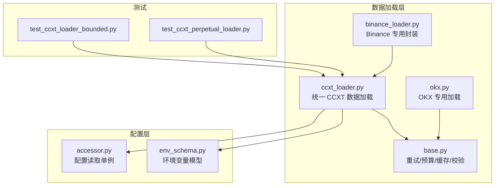
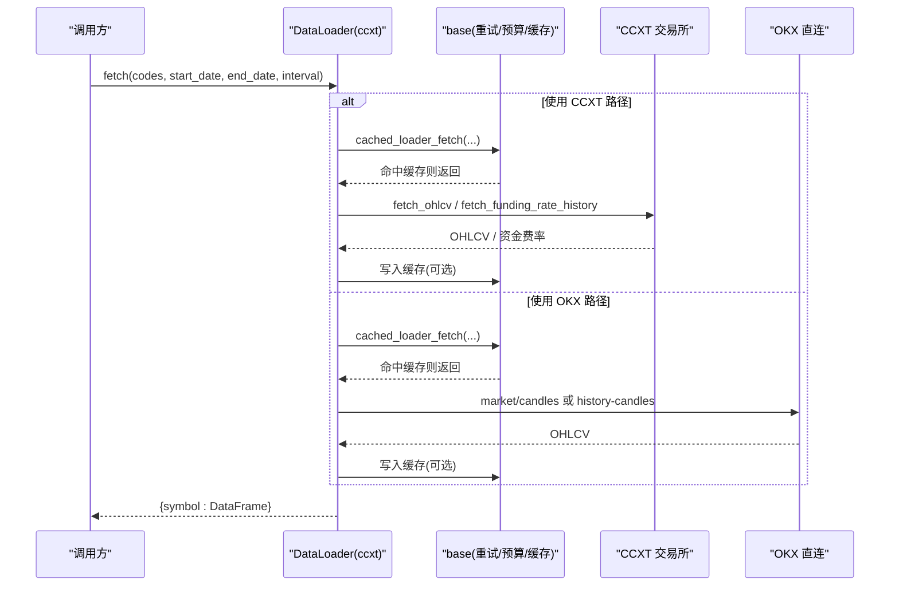
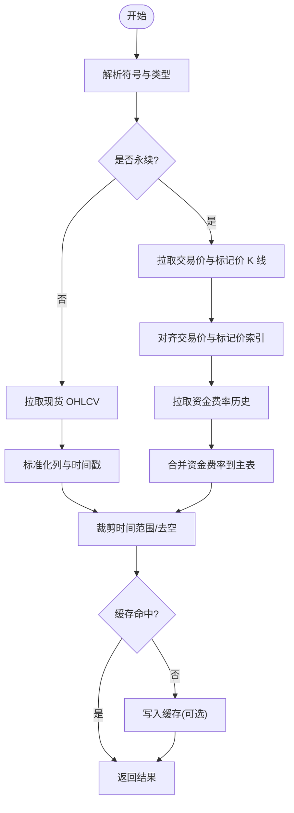
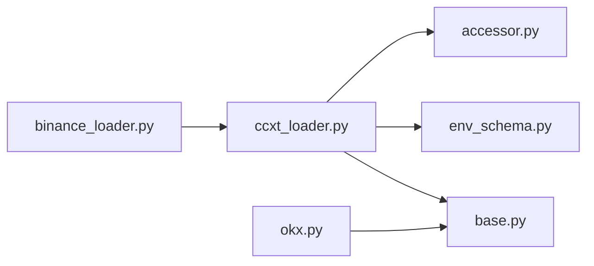

# CCXT 加密货币数据加载器

<cite>
**本文引用的文件**
- [ccxt_loader.py](file://agent/backtest/loaders/ccxt_loader.py)
- [binance_loader.py](file://agent/backtest/loaders/binance_loader.py)
- [okx.py](file://agent/backtest/loaders/okx.py)
- [base.py](file://agent/backtest/loaders/base.py)
- [env_schema.py](file://agent/src/config/env_schema.py)
- [accessor.py](file://agent/src/config/accessor.py)
- [test_ccxt_loader_bounded.py](file://agent/tests/test_ccxt_loader_bounded.py)
- [test_ccxt_perpetual_loader.py](file://agent/tests/test_ccxt_perpetual_loader.py)
</cite>

## 目录
1. [简介](#简介)
2. [项目结构](#项目结构)
3. [核心组件](#核心组件)
4. [架构总览](#架构总览)
5. [详细组件分析](#详细组件分析)
6. [依赖关系分析](#依赖关系分析)
7. [性能与可靠性](#性能与可靠性)
8. [故障排查指南](#故障排查指南)
9. [结论](#结论)
10. [附录：配置与使用示例](#附录配置与使用示例)

## 简介
本仓库提供了基于 CCXT 的统一加密货币数据加载能力，支持通过统一的接口从多个交易所（如 Binance、OKX、Coinbase 等）拉取 K 线（OHLCV）、永续合约资金费率、标记价格等历史数据。该实现面向回测与离线研究场景，默认无需 API Key 即可获取公开行情；对于需要认证的专用端点（如部分保证金层级查询），本实现采用“零凭据”策略，避免在回测路径中携带敏感信息。

主要特性
- 统一抽象：通过 DataLoader 协议统一不同数据源的 fetch 接口。
- 多交易所适配：CCXT 通用层 + OKX 专用层，自动选择或显式指定。
- 数据类型：现货 OHLCV、USD-M 永续合约（交易价 + 标记价 + 资金费率）。
- 标准化输出：时间戳、价格、成交量归一化，保证跨源一致性。
- 健壮性：超时、重试、预算限制、分页边界校验、缓存加速。

## 项目结构
围绕 CCXT 的数据加载相关代码集中在 backtest/loaders 目录下，并配合 base 层的通用工具、config 的环境变量模型以及 tests 的回归用例。

图表来源
- [ccxt_loader.py:184-308](file://agent/backtest/loaders/ccxt_loader.py#L184-L308)
- [binance_loader.py:23-44](file://agent/backtest/loaders/binance_loader.py#L23-L44)
- [okx.py:101-208](file://agent/backtest/loaders/okx.py#L101-L208)
- [base.py:377-450](file://agent/backtest/loaders/base.py#L377-L450)
- [env_schema.py:166-200](file://agent/src/config/env_schema.py#L166-L200)
- [accessor.py:52-76](file://agent/src/config/accessor.py#L52-L76)

章节来源
- [ccxt_loader.py:1-502](file://agent/backtest/loaders/ccxt_loader.py#L1-L502)
- [binance_loader.py:1-45](file://agent/backtest/loaders/binance_loader.py#L1-L45)
- [okx.py:1-373](file://agent/backtest/loaders/okx.py#L1-L373)
- [base.py:1-657](file://agent/backtest/loaders/base.py#L1-L657)
- [env_schema.py:166-200](file://agent/src/config/env_schema.py#L166-L200)
- [accessor.py:52-76](file://agent/src/config/accessor.py#L52-L76)

## 核心组件
- CCXT 数据加载器（DataLoader）
  - 负责创建交易所实例、解析符号、分页拉取 OHLCV、处理永续合约的交易价与标记价对齐、资金费率合并、维护保证金层级附件（可选）。
- Binance 专用加载器
  - 继承 CCXT 加载器，固定使用 Binance/Binance USD-M，忽略全局交易所配置。
- OKX 专用加载器
  - 直接调用 OKX V5 REST，具备可用性探测、代理、重试与历史深度优先策略。
- 基础工具（base）
  - 提供日期校验、OHLC 不变量校验、重试与预算控制、本地 Parquet 缓存、加载器协议定义。

章节来源
- [ccxt_loader.py:184-308](file://agent/backtest/loaders/ccxt_loader.py#L184-L308)
- [binance_loader.py:23-44](file://agent/backtest/loaders/binance_loader.py#L23-L44)
- [okx.py:101-208](file://agent/backtest/loaders/okx.py#L101-L208)
- [base.py:168-256](file://agent/backtest/loaders/base.py#L168-L256)
- [base.py:377-450](file://agent/backtest/loaders/base.py#L377-L450)
- [base.py:243-441](file://agent/backtest/loaders/base.py#L243-L441)

## 架构总览
下图展示了从调用方到数据源的完整流程，包括 CCXT 与 OKX 两条路径，以及公共的重试、预算与缓存机制。

图表来源
- [ccxt_loader.py:226-308](file://agent/backtest/loaders/ccxt_loader.py#L226-L308)
- [okx.py:131-208](file://agent/backtest/loaders/okx.py#L131-L208)
- [base.py:623-661](file://agent/backtest/loaders/base.py#L623-L661)

## 详细组件分析

### CCXT 数据加载器（DataLoader）
职责
- 创建交易所实例（支持 spot 与 USD-M swap），设置超时与代理。
- 解析符号（现货与永续），映射为 CCXT 标准格式。
- 分页拉取 OHLCV，进行时间范围裁剪与数值类型转换。
- 永续合约：拉取交易价与标记价 K 线并对齐，合并资金费率，附加维护保证金层级（可选）。
- 失败快速退出：通过预算与重试保护，避免长时间挂起。

关键流程
- 符号解析：将 “BTC-USDT-PERP” 转换为 “BTC/USDT:USDT”，并识别为 swap。
- 交易所实例：根据 instrument_type 选择 binance 或 binanceusdm，注入 enableRateLimit、timeout、proxies。
- 数据获取：
  - 现货：fetch_ohlcv 分页，构造 DataFrame，过滤空值，按时间窗口裁剪。
  - 永续：分别拉取交易价与标记价 K 线，校验索引一致；拉取资金费率历史，对齐到结算时刻；可选附加维护保证金层级。
- 缓存：通过 cached_loader_fetch 包装，命中则跳过网络请求。

图表来源
- [ccxt_loader.py:60-70](file://agent/backtest/loaders/ccxt_loader.py#L60-L70)
- [ccxt_loader.py:203-224](file://agent/backtest/loaders/ccxt_loader.py#L203-L224)
- [ccxt_loader.py:226-308](file://agent/backtest/loaders/ccxt_loader.py#L226-L308)
- [ccxt_loader.py:310-372](file://agent/backtest/loaders/ccxt_loader.py#L310-L372)
- [ccxt_loader.py:426-501](file://agent/backtest/loaders/ccxt_loader.py#L426-L501)

章节来源
- [ccxt_loader.py:60-70](file://agent/backtest/loaders/ccxt_loader.py#L60-L70)
- [ccxt_loader.py:203-224](file://agent/backtest/loaders/ccxt_loader.py#L203-L224)
- [ccxt_loader.py:226-308](file://agent/backtest/loaders/ccxt_loader.py#L226-L308)
- [ccxt_loader.py:310-372](file://agent/backtest/loaders/ccxt_loader.py#L310-L372)
- [ccxt_loader.py:374-424](file://agent/backtest/loaders/ccxt_loader.py#L374-L424)
- [ccxt_loader.py:426-501](file://agent/backtest/loaders/ccxt_loader.py#L426-L501)

### Binance 专用加载器
- 固定使用 ccxt.binance 或 ccxt.binanceusdm，忽略全局 CCXT_EXCHANGE。
- 复用 CCXT 加载器的 fetch 逻辑，仅替换交易所实例构建。

章节来源
- [binance_loader.py:23-44](file://agent/backtest/loaders/binance_loader.py#L23-L44)

### OKX 专用加载器
- 直接调用 OKX V5 公开 REST，支持近期与历史 K 线端点切换。
- 具备可用性探测、代理、重试与业务错误处理。
- 对分钟级与日级等不同粒度设置不同的最大页数，防止过度请求。

章节来源
- [okx.py:34-68](file://agent/backtest/loaders/okx.py#L34-L68)
- [okx.py:101-208](file://agent/backtest/loaders/okx.py#L101-L208)
- [okx.py:220-373](file://agent/backtest/loaders/okx.py#L220-L373)

### 基础工具（base）
- 重试与预算：retry_with_budget 与 check_budget 确保在网络抖动时有限重试并在预算耗尽时快速失败。
- 缓存：cached_loader_fetch 结合 Parquet 本地缓存，减少重复网络请求。
- 校验：validate_date_range、validate_ohlc 保障输入与数据结构正确性。

章节来源
- [base.py:168-256](file://agent/backtest/loaders/base.py#L168-L256)
- [base.py:377-450](file://agent/backtest/loaders/base.py#L377-L450)
- [base.py:243-441](file://agent/backtest/loaders/base.py#L243-L441)

## 依赖关系分析
- CCXT 加载器依赖 base 提供的重试、预算、缓存与校验能力。
- Binance 加载器继承 CCXT 加载器，仅覆盖交易所实例构建。
- OKX 加载器独立实现，但同样使用 base 的重试、预算与缓存。
- 配置通过 env_schema 集中管理，accessor 提供线程安全的单例读取。

图表来源
- [ccxt_loader.py:184-308](file://agent/backtest/loaders/ccxt_loader.py#L184-L308)
- [binance_loader.py:23-44](file://agent/backtest/loaders/binance_loader.py#L23-L44)
- [okx.py:101-208](file://agent/backtest/loaders/okx.py#L101-L208)
- [env_schema.py:166-200](file://agent/src/config/env_schema.py#L166-L200)
- [accessor.py:52-76](file://agent/src/config/accessor.py#L52-L76)

章节来源
- [ccxt_loader.py:184-308](file://agent/backtest/loaders/ccxt_loader.py#L184-L308)
- [binance_loader.py:23-44](file://agent/backtest/loaders/binance_loader.py#L23-L44)
- [okx.py:101-208](file://agent/backtest/loaders/okx.py#L101-L208)
- [base.py:377-450](file://agent/backtest/loaders/base.py#L377-L450)
- [env_schema.py:166-200](file://agent/src/config/env_schema.py#L166-L200)
- [accessor.py:52-76](file://agent/src/config/accessor.py#L52-L76)

## 性能与可靠性
- 超时与预算：每个 HTTP 调用设置超时，整体 fetch 有 wall-clock 预算，避免无限等待。
- 重试策略：针对网络类异常进行有限次重试，非网络错误不重试。
- 分页边界：当页面达到上限且仍未满足时间范围时，抛出“不完整历史”错误，便于上层感知。
- 缓存：启用后对已落库的历史数据进行本地 Parquet 缓存，显著降低重复请求。
- 代理：支持通过常见代理环境变量注入，提升跨网络环境稳定性。

章节来源
- [ccxt_loader.py:50-57](file://agent/backtest/loaders/ccxt_loader.py#L50-L57)
- [ccxt_loader.py:426-501](file://agent/backtest/loaders/ccxt_loader.py#L426-L501)
- [base.py:377-450](file://agent/backtest/loaders/base.py#L377-L450)
- [base.py:243-441](file://agent/backtest/loaders/base.py#L243-L441)
- [okx.py:67-98](file://agent/backtest/loaders/okx.py#L67-L98)

## 故障排查指南
常见问题与定位建议
- 网络连接问题
  - 现象：请求超时或连接失败。
  - 排查：检查代理环境变量是否正确；确认 CCXT_TIMEOUT_MS 与 CCXT_FETCH_BUDGET_S 合理；查看日志中的重试与预算提示。
  - 参考：[ccxt_loader.py:73-92](file://agent/backtest/loaders/ccxt_loader.py#L73-L92)、[base.py:377-450](file://agent/backtest/loaders/base.py#L377-L450)
- API 限流
  - 现象：HTTP 429 或交易所不可用。
  - 排查：重试会自动处理短暂限流；若频繁触发，考虑增大预算或降低并发；OKX 会主动将 429/5xx 视为可重试。
  - 参考：[okx.py:291-322](file://agent/backtest/loaders/okx.py#L291-L322)
- 数据不一致
  - 现象：K 线时间戳错位或缺失。
  - 排查：检查区间裁剪逻辑；永续合约需确保交易价与标记价索引一致；资金费率结算时间可能带毫秒抖动，已做秒级对齐。
  - 参考：[ccxt_loader.py:310-372](file://agent/backtest/loaders/ccxt_loader.py#L310-L372)、[ccxt_loader.py:426-501](file://agent/backtest/loaders/ccxt_loader.py#L426-L501)
- 历史数据不完整
  - 现象：返回的时间范围小于请求范围。
  - 排查：当页面达到上限仍不足时会抛错；检查时间窗口与时间粒度；必要时拆分请求或调整 limit。
  - 参考：[ccxt_loader.py:493-501](file://agent/backtest/loaders/ccxt_loader.py#L493-L501)
- 永续合约保证金层级缺失
  - 现象：缺少维护保证金列。
  - 排查：本实现不在运行时拉取保证金层级（需要认证）；如需该列，请传入经校验的 artifact 并开启严格模式。
  - 参考：[ccxt_loader.py:98-181](file://agent/backtest/loaders/ccxt_loader.py#L98-L181)、[ccxt_loader.py:310-372](file://agent/backtest/loaders/ccxt_loader.py#L310-L372)

章节来源
- [ccxt_loader.py:73-92](file://agent/backtest/loaders/ccxt_loader.py#L73-L92)
- [ccxt_loader.py:310-372](file://agent/backtest/loaders/ccxt_loader.py#L310-L372)
- [ccxt_loader.py:426-501](file://agent/backtest/loaders/ccxt_loader.py#L426-L501)
- [okx.py:291-322](file://agent/backtest/loaders/okx.py#L291-L322)
- [base.py:377-450](file://agent/backtest/loaders/base.py#L377-L450)

## 结论
本实现以 CCXT 为核心，结合 OKX 专用路径，提供了稳定、可配置、可缓存的加密货币历史数据加载能力。其设计强调“零凭据”与“快速失败”，并通过严格的边界校验与重试预算保障回测过程的鲁棒性。对于需要保证金层级等高级风控信息的场景，可通过外部 artifact 安全注入，避免在生产回测中暴露认证信息。

## 附录：配置与使用示例

### 支持的交易所与数据类型
- 交易所
  - CCXT 通用层：支持 CCXT 内置的 100+ 交易所（默认 Binance），可通过环境变量切换。
  - OKX 专用层：直接调用 OKX V5 REST，具备更强的可用性探测与历史深度策略。
- 数据类型
  - 现货：OHLCV（开、高、低、收、量）。
  - 永续合约：交易价 K 线 + 标记价 K 线 + 资金费率；可选维护保证金层级（artifact）。

章节来源
- [ccxt_loader.py:184-308](file://agent/backtest/loaders/ccxt_loader.py#L184-L308)
- [okx.py:101-208](file://agent/backtest/loaders/okx.py#L101-L208)

### 交易所 API 认证配置
- 公开行情（默认）：无需 API Key、Secret、Passphrase。
- 特殊端点（如保证金层级）：本实现不在运行时拉取，避免携带凭据；如需，通过外部 artifact 注入。
- 代理配置：支持通过 ALL_PROXY/HTTP_PROXY/HTTPS_PROXY 等环境变量注入。

章节来源
- [ccxt_loader.py:184-224](file://agent/backtest/loaders/ccxt_loader.py#L184-L224)
- [ccxt_loader.py:73-92](file://agent/backtest/loaders/ccxt_loader.py#L73-L92)

### 数据获取策略
- K 线数据
  - CCXT：分页拉取 OHLCV，按时间窗口裁剪，数值类型转换，去空行。
  - OKX：优先历史端点，支持近期与历史端点切换，分钟级与日级不同页数上限。
- 深度数据
  - 当前未提供订单簿深度拉取；如需，可在上层扩展。
- 成交记录
  - 当前未提供逐笔成交拉取；如需，可在上层扩展。

章节来源
- [ccxt_loader.py:426-501](file://agent/backtest/loaders/ccxt_loader.py#L426-L501)
- [okx.py:220-373](file://agent/backtest/loaders/okx.py#L220-L373)

### 数据格式标准化
- 时间戳：统一转为 trade_date 索引（UTC 或无时区），并进行秒级对齐（永续资金费率）。
- 价格单位：open/high/low/close 强制数值转换，非法值置 NaN 后丢弃。
- 成交量：统一为 volume 列，OKX 使用 vol 字段并填充缺失为零。
- 永续合约：增加 execution_open/mark_* 列与 funding_rate/funding_settlement_time。

章节来源
- [ccxt_loader.py:476-501](file://agent/backtest/loaders/ccxt_loader.py#L476-L501)
- [okx.py:341-373](file://agent/backtest/loaders/okx.py#L341-L373)
- [ccxt_loader.py:310-372](file://agent/backtest/loaders/ccxt_loader.py#L310-L372)

### 完整配置示例与使用模式
- 环境变量
  - CCXT_EXCHANGE：选择 CCXT 交易所（默认 binance）。
  - CCXT_TIMEOUT_MS：单次请求超时（毫秒）。
  - CCXT_FETCH_BUDGET_S：单次 fetch 的总预算（秒）。
  - VIBE_TRADING_DATA_CACHE：是否启用本地缓存。
  - VIBE_TRADING_DATA_CACHE_ROOT：缓存根目录。
- 使用模式
  - 多交易所数据聚合：通过 source="auto" 或显式 source="ccxt"/"binance"/"okx" 组合多个 loader 的结果。
  - 实时数据订阅：本实现面向历史数据；实时订阅需在更上层接入 WebSocket 通道。
  - 历史数据回测：使用 fetch(codes, start_date, end_date, interval) 获取标准化 DataFrame 列表。

章节来源
- [env_schema.py:166-200](file://agent/src/config/env_schema.py#L166-L200)
- [accessor.py:52-76](file://agent/src/config/accessor.py#L52-L76)
- [ccxt_loader.py:226-308](file://agent/backtest/loaders/ccxt_loader.py#L226-L308)
- [okx.py:131-208](file://agent/backtest/loaders/okx.py#L131-L208)

### 单元测试要点（用于验证行为）
- 网络异常重试与预算限制：确保不会挂起，且在预算耗尽时报错。
- 永续合约：交易价与标记价对齐、资金费率合并、保证金层级 artifact 校验。
- 符号解析：现货与永续符号的正确映射与非法符号拒绝。

章节来源
- [test_ccxt_loader_bounded.py:55-145](file://agent/tests/test_ccxt_loader_bounded.py#L55-L145)
- [test_ccxt_perpetual_loader.py:103-380](file://agent/tests/test_ccxt_perpetual_loader.py#L103-L380)