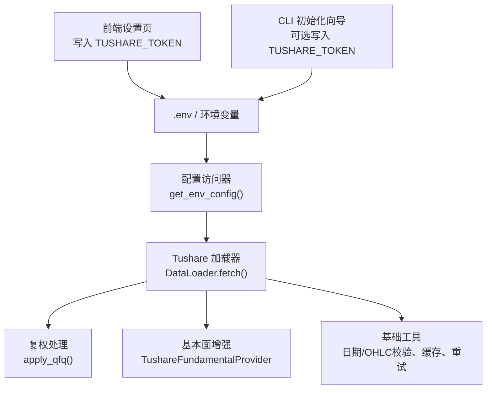
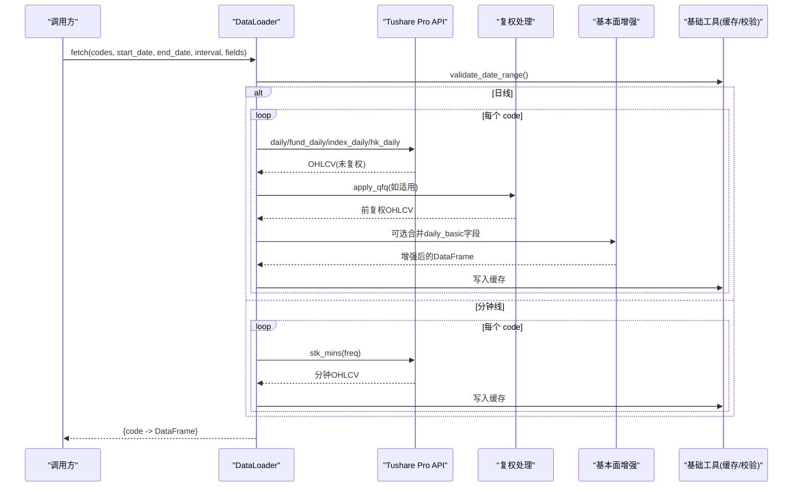
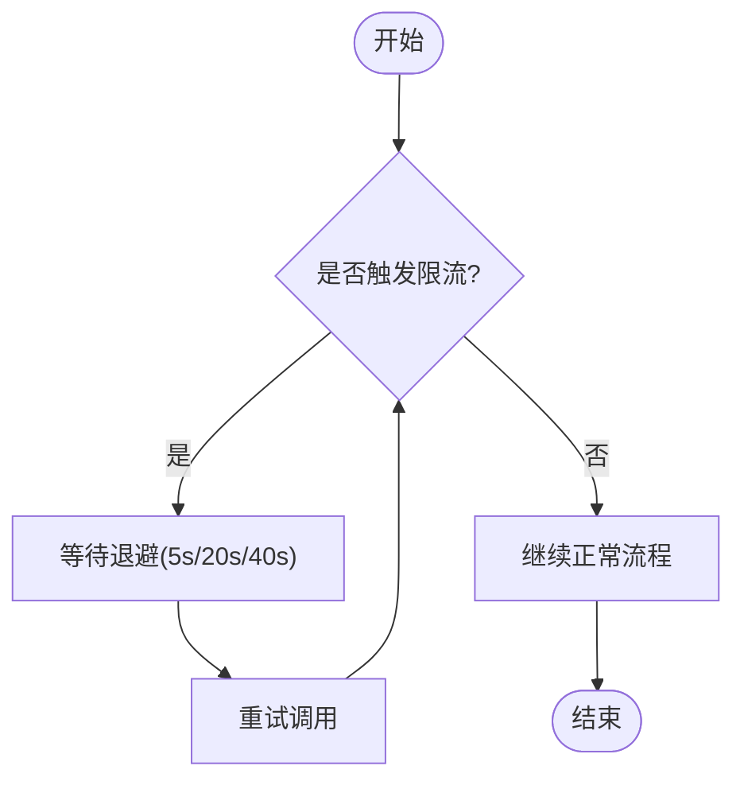
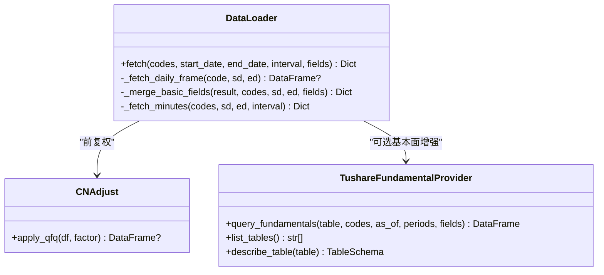
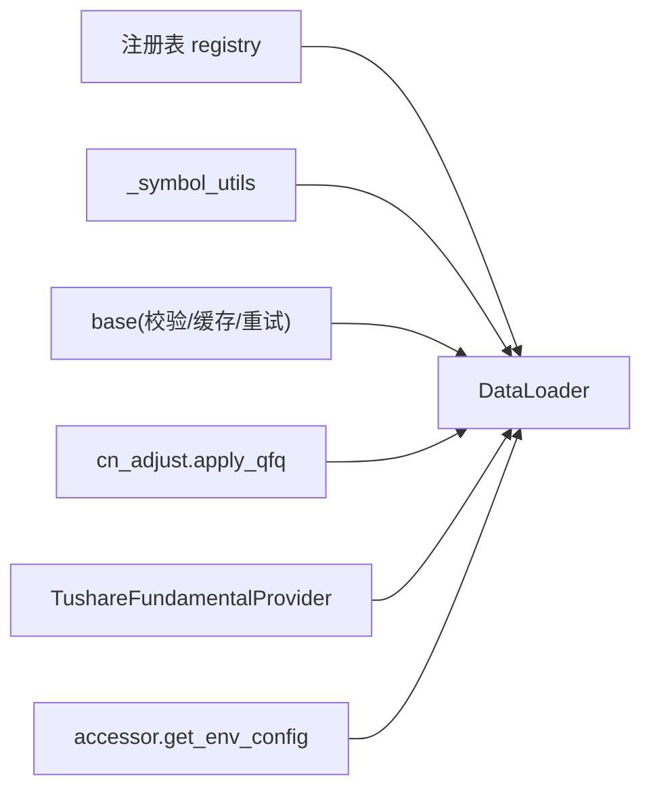

# Tushare 数据加载器

<cite>
**本文引用的文件**
- [tushare.py](file://agent/backtest/loaders/tushare.py)
- [tushare_fundamentals.py](file://agent/backtest/loaders/tushare_fundamentals.py)
- [cn_adjust.py](file://agent/backtest/loaders/cn_adjust.py)
- [base.py](file://agent/backtest/loaders/base.py)
- [Settings.tsx](file://frontend/src/pages/Settings.tsx)
- [_legacy.py](file://agent/cli/_legacy.py)
- [accessor.py](file://agent/src/config/accessor.py)
- [test_tushare_loader.py](file://agent/tests/test_tushare_loader.py)
- [SKILL.md](file://agent/src/skills/minute-analysis/SKILL.md)
</cite>

## 目录
1. [简介](#简介)
2. [项目结构](#项目结构)
3. [核心组件](#核心组件)
4. [架构总览](#架构总览)
5. [详细组件分析](#详细组件分析)
6. [依赖关系分析](#依赖关系分析)
7. [性能与并发](#性能与并发)
8. [故障排查指南](#故障排查指南)
9. [结论](#结论)
10. [附录：配置示例与最佳实践](#附录配置示例与最佳实践)

## 简介
本文件面向使用 Tushare Pro API 的 A 股、指数、基金及港股日线与分钟线数据获取场景，系统性说明认证配置、权限等级、频率限制、数据范围、批量下载策略、增量更新机制、重试与错误处理、数据格式标准化（含复权因子应用）、以及缓存与并发控制等关键主题。文档同时给出常见问题解决方案与最佳实践建议，帮助在回测与研究中稳定高效地获取高质量数据。

## 项目结构
Tushare 数据加载能力由以下模块协同实现：
- 行情与基本面加载器：负责调用 Tushare Pro 接口、路由不同标的类型、标准化 OHLCV 与财务字段、并应用前复权。
- 基础工具：日期校验、OHLC 校验、通用重试与预算控制、本地缓存封装。
- 复权处理：统一将未复权价格序列转换为前复权，保证收益计算一致性。
- 前端与 CLI：提供 TUSHARE_TOKEN 的配置入口与环境变量写入。
- 配置访问：线程安全的单例环境配置读取，供各加载器初始化时获取 Token。

图表来源
- [Settings.tsx:575-601](file://frontend/src/pages/Settings.tsx#L575-L601)
- [_legacy.py:6192-6201](file://agent/cli/_legacy.py#L6192-L6201)
- [accessor.py:52-76](file://agent/src/config/accessor.py#L52-L76)
- [tushare.py:116-141](file://agent/backtest/loaders/tushare.py#L116-L141)
- [cn_adjust.py:27-78](file://agent/backtest/loaders/cn_adjust.py#L27-L78)
- [tushare_fundamentals.py:118-187](file://agent/backtest/loaders/tushare_fundamentals.py#L118-L187)
- [base.py:168-184](file://agent/backtest/loaders/base.py#L168-L184)

章节来源
- [tushare.py:1-386](file://agent/backtest/loaders/tushare.py#L1-L386)
- [tushare_fundamentals.py:1-380](file://agent/backtest/loaders/tushare_fundamentals.py#L1-L380)
- [cn_adjust.py:1-78](file://agent/backtest/loaders/cn_adjust.py#L1-L78)
- [base.py:1-200](file://agent/backtest/loaders/base.py#L1-L200)
- [Settings.tsx:575-601](file://frontend/src/pages/Settings.tsx#L575-L601)
- [_legacy.py:6192-6201](file://agent/cli/_legacy.py#L6192-L6201)
- [accessor.py:52-76](file://agent/src/config/accessor.py#L52-L76)

## 核心组件
- DataLoader（Tushare）：统一入口，支持 A 股、指数、基金、港股的日线；A 股与基金的分钟线（需积分门槛）。内部按标的类型路由到 daily/fund_daily/index_daily/hk_daily/stk_mins 等接口，并合并可选的基本面字段。
- 复权处理 apply_qfq：对 A 股与基金原始价格应用前复权，修正除权除息导致的收益失真。
- 基本面提供者 TushareFundamentalProvider：以“时间点安全”的方式拉取财务报表快照，避免未来信息泄露，并按公告日/披露日做去重与可见性过滤。
- 基础工具 base：日期范围校验、OHLC 结构校验、通用重试与预算控制、本地缓存封装 cached_loader_fetch。

章节来源
- [tushare.py:116-386](file://agent/backtest/loaders/tushare.py#L116-L386)
- [cn_adjust.py:27-78](file://agent/backtest/loaders/cn_adjust.py#L27-L78)
- [tushare_fundamentals.py:110-380](file://agent/backtest/loaders/tushare_fundamentals.py#L110-L380)
- [base.py:31-200](file://agent/backtest/loaders/base.py#L31-L200)

## 架构总览
下图展示从配置到数据返回的关键流程，包括鉴权、路由、复权、基本面增强与缓存。

图表来源
- [tushare.py:148-211](file://agent/backtest/loaders/tushare.py#L148-L211)
- [tushare.py:207-268](file://agent/backtest/loaders/tushare.py#L207-L268)
- [tushare.py:416-476](file://agent/backtest/loaders/tushare.py#L416-L476)
- [cn_adjust.py:27-78](file://agent/backtest/loaders/cn_adjust.py#L27-L78)
- [tushare_fundamentals.py:264-379](file://agent/backtest/loaders/tushare_fundamentals.py#L264-L379)
- [base.py:168-184](file://agent/backtest/loaders/base.py#L168-L184)

## 详细组件分析

### 认证配置与权限等级
- 认证方式：通过环境变量 TUSHARE_TOKEN 注入，加载器在构造时调用 tushare.pro_api(token) 建立会话。若未设置或为占位符，则标记不可用。
- 前端与 CLI 配置：
  - 前端设置页可保存 TUSHARE_TOKEN 到 .env，并在桌面模式下通过安全凭据存储。
  - CLI 初始化向导支持可选输入 TUSHARE_TOKEN 并写入 .env。
- 配置读取：通过 get_env_config().data.tushare_token 获取，线程安全单例，支持运行时重置。
- 权限等级与频率：
  - 分钟线数据需要较高积分（≥2000），否则接口返回空数据。
  - 每分钟/每日调用次数受限，出现限流时会抛出包含特定关键词的异常，加载器会识别并退避重试。

章节来源
- [tushare.py:133-146](file://agent/backtest/loaders/tushare.py#L133-L146)
- [tushare.py:22-35](file://agent/backtest/loaders/tushare.py#L22-L35)
- [Settings.tsx:575-601](file://frontend/src/pages/Settings.tsx#L575-L601)
- [_legacy.py:6192-6201](file://agent/cli/_legacy.py#L6192-L6201)
- [accessor.py:52-76](file://agent/src/config/accessor.py#L52-L76)
- [SKILL.md:89-102](file://agent/src/skills/minute-analysis/SKILL.md#L89-L102)

### 支持的数据范围
- 日线：
  - A 股：daily + adj_factor（用于前复权）
  - 指数：index_daily（连续级别，无需复权）
  - 基金：fund_daily + fund_adj（ETF/LOF）
  - 港股：hk_daily（无复权因子）
- 分钟线：
  - A 股：stk_mins（1m/5m/15m/30m/1H），需积分≥2000
  - ETF/指数/港股/美股/加密货币：分钟线不支持
- 基本面：
  - 利润表、资产负债表、现金流量表、财务指标等，按“时间点安全”原则聚合，避免未来信息泄露

章节来源
- [tushare.py:207-268](file://agent/backtest/loaders/tushare.py#L207-L268)
- [tushare.py:416-476](file://agent/backtest/loaders/tushare.py#L416-L476)
- [tushare_fundamentals.py:56-115](file://agent/backtest/loaders/tushare_fundamentals.py#L56-L115)
- [tushare_fundamentals.py:144-187](file://agent/backtest/loaders/tushare_fundamentals.py#L144-L187)

### 数据获取策略
- 批量下载优化：
  - 逐标的循环调用，结合缓存封装 cached_loader_fetch，避免重复请求。
  - 日线与基本面字段在同一缓存单元内合并，命中后直接返回已增强结果。
- 增量更新机制：
  - 通过 start_date/end_date 精确控制时间窗口，配合缓存键（source/symbol/timeframe/start/end/fields）实现增量追加。
- 重试与错误处理：
  - 针对 Tushare 限流异常，采用固定间隔退避（5s/20s/40s），仅对限流类异常重试，其他错误立即上抛。
  - 基本面字段缺失或失败不影响主流程，记录警告并继续。
  - 分钟线为空时提示积分不足并跳过该标的。

图表来源
- [tushare.py:51-79](file://agent/backtest/loaders/tushare.py#L51-L79)
- [tushare.py:416-476](file://agent/backtest/loaders/tushare.py#L416-L476)

章节来源
- [tushare.py:148-211](file://agent/backtest/loaders/tushare.py#L148-L211)
- [tushare.py:207-268](file://agent/backtest/loaders/tushare.py#L207-L268)
- [tushare.py:416-476](file://agent/backtest/loaders/tushare.py#L416-L476)
- [base.py:398-414](file://agent/backtest/loaders/base.py#L398-L414)

### 数据格式标准化
- 股票代码映射：
  - 自动识别 A 股、指数、ETF/LOF、港股、美股、加密货币，分别路由至对应接口。
  - 非支持的标的（美股/加密货币）在日线路径中直接跳过并记录警告。
- 时间序列处理：
  - trade_date/trade_time 转为 datetime 并设为索引，排序后提取 OHLCV 列，数值列强制转换，丢弃无效行。
- 复权因子应用：
  - A 股与基金使用 adj_factor/fund_adj 进行前复权，修正除权除息带来的收益失真；指数与港股不应用复权。
  - 若复权因子缺失或不可用，直接丢弃该标的，避免回测污染。

图表来源
- [tushare.py:116-386](file://agent/backtest/loaders/tushare.py#L116-L386)
- [cn_adjust.py:27-78](file://agent/backtest/loaders/cn_adjust.py#L27-L78)
- [tushare_fundamentals.py:118-187](file://agent/backtest/loaders/tushare_fundamentals.py#L118-L187)

章节来源
- [tushare.py:207-268](file://agent/backtest/loaders/tushare.py#L207-L268)
- [tushare.py:416-476](file://agent/backtest/loaders/tushare.py#L416-L476)
- [cn_adjust.py:27-78](file://agent/backtest/loaders/cn_adjust.py#L27-L78)

## 依赖关系分析
- DataLoader 依赖：
  - 符号类型判断：来自 _symbol_utils（ETF 列表识别）
  - 基础工具：base（日期校验、缓存、重试）
  - 复权处理：cn_adjust.apply_qfq
  - 注册表：registry.register
- 基本面增强：
  - TushareFundamentalProvider 定义表结构与 PIT 安全逻辑，按公告/披露日过滤与去重，再与价格序列对齐。
- 配置与凭证：
  - 通过 accessor.get_env_config() 读取 TUSHARE_TOKEN，前端/CLI 负责持久化。

图表来源
- [tushare.py:13-16](file://agent/backtest/loaders/tushare.py#L13-L16)
- [tushare.py:116-141](file://agent/backtest/loaders/tushare.py#L116-L141)
- [tushare_fundamentals.py:118-187](file://agent/backtest/loaders/tushare_fundamentals.py#L118-L187)
- [accessor.py:52-76](file://agent/src/config/accessor.py#L52-L76)

章节来源
- [tushare.py:1-386](file://agent/backtest/loaders/tushare.py#L1-L386)
- [tushare_fundamentals.py:1-380](file://agent/backtest/loaders/tushare_fundamentals.py#L1-L380)
- [accessor.py:52-76](file://agent/src/config/accessor.py#L52-L76)

## 性能与并发
- 缓存策略：
  - 使用 cached_loader_fetch 对每个标的的日线与基本面字段进行缓存，减少重复网络请求。
  - 缓存键包含 source、symbol、timeframe、start_date、end_date、fields，确保增量更新正确命中。
- 重试与预算：
  - 限流退避：5s/20s/40s，总计约 65s，避免长时间阻塞。
  - 通用重试与超时预算：base 模块提供 retry_with_budget 与 check_budget，适用于其他外部 API。
- 并发控制：
  - 当前实现为串行逐标的调用，适合 Tushare 的严格频率限制。
  - 如需提升吞吐，可在上层对标的分组并行，但必须遵守每分钟/每日调用上限，必要时加入令牌桶或滑动窗口限流。
- 分钟线注意事项：
  - 分钟线数据量大且需高积分，建议缩短回测区间、降低频率，避免超时与限流。

章节来源
- [tushare.py:182-211](file://agent/backtest/loaders/tushare.py#L182-L211)
- [tushare.py:51-79](file://agent/backtest/loaders/tushare.py#L51-L79)
- [base.py:377-414](file://agent/backtest/loaders/base.py#L377-L414)
- [SKILL.md:89-102](file://agent/src/skills/minute-analysis/SKILL.md#L89-L102)

## 故障排查指南
- 权限不足（Token 未设置或占位符）：
  - 现象：加载器 is_available 返回 False，无法初始化。
  - 解决：在前端设置页或 CLI 初始化向导中设置 TUSHARE_TOKEN，并确保 .env 生效。
- 分钟线数据为空：
  - 现象：stk_mins 返回空，日志提示需要积分≥2000。
  - 解决：提升 Tushare 积分或使用日线替代；缩短时间范围以降低数据量。
- 接口限流：
  - 现象：异常消息包含“每分钟/每天/访问该接口/频率/rate limit/too many requests”。
  - 解决：加载器自动退避重试；若频繁触发，请降低并发、增大批次间隔或升级积分。
- 数据缺失或字段不全：
  - 现象：daily_basic 或 adj_factor 缺失导致部分标的被跳过。
  - 解决：检查标的类型与接口支持；确认时间范围有效；关注日志警告。
- 日期范围非法：
  - 现象：validate_date_range 抛出 ValueError。
  - 解决：确保 start_date ≤ end_date，格式为 YYYY-MM-DD。

章节来源
- [tushare.py:133-146](file://agent/backtest/loaders/tushare.py#L133-L146)
- [tushare.py:416-476](file://agent/backtest/loaders/tushare.py#L416-L476)
- [tushare.py:51-79](file://agent/backtest/loaders/tushare.py#L51-L79)
- [base.py:168-184](file://agent/backtest/loaders/base.py#L168-L184)
- [test_tushare_loader.py:449-473](file://agent/tests/test_tushare_loader.py#L449-L473)

## 结论
Tushare 数据加载器提供了覆盖 A 股、指数、基金、港股的日线与 A 股分钟线能力，并通过前复权与“时间点安全”的基本面增强，保障回测与研究的准确性。其内置的限流识别与退避重试、日期与 OHLC 校验、以及基于缓存的增量更新机制，使大规模批量下载更加稳健。结合合理的并发控制与积分管理，可在生产环境中稳定运行。

## 附录：配置示例与最佳实践
- 配置示例
  - 环境变量：设置 TUSHARE_TOKEN 为有效的 Tushare Pro Token。
  - 前端设置：在设置页面输入并保存 TUSHARE_TOKEN，系统会写入 .env 并在桌面模式下安全存储。
  - CLI 初始化：在首次初始化时可输入 TUSHARE_TOKEN，系统将写入 .env 并设置权限。
- 最佳实践
  - 批量下载：按标的分批请求，利用缓存减少重复；优先选择日线，分钟线谨慎使用。
  - 增量更新：每次仅请求新增时间窗口，结合缓存键实现高效增量。
  - 并发控制：默认串行调用以避免限流；如需并行，请在上层实现限流与退避。
  - 复权与质量：确保 adj_factor/fund_adj 可用；若缺失则丢弃标的，避免收益失真。
  - 监控与日志：关注限流与空数据警告，及时调整策略或提升积分。

章节来源
- [Settings.tsx:575-601](file://frontend/src/pages/Settings.tsx#L575-L601)
- [_legacy.py:6192-6201](file://agent/cli/_legacy.py#L6192-L6201)
- [tushare.py:182-211](file://agent/backtest/loaders/tushare.py#L182-L211)
- [tushare.py:207-268](file://agent/backtest/loaders/tushare.py#L207-L268)
- [tushare.py:416-476](file://agent/backtest/loaders/tushare.py#L416-L476)
- [cn_adjust.py:27-78](file://agent/backtest/loaders/cn_adjust.py#L27-L78)
- [SKILL.md:89-102](file://agent/src/skills/minute-analysis/SKILL.md#L89-L102)