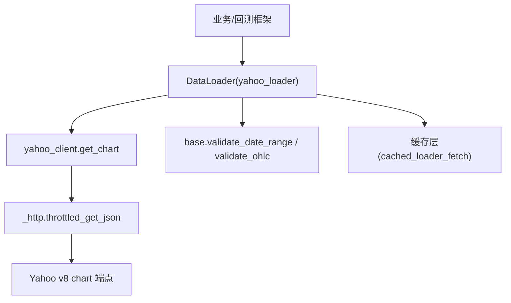
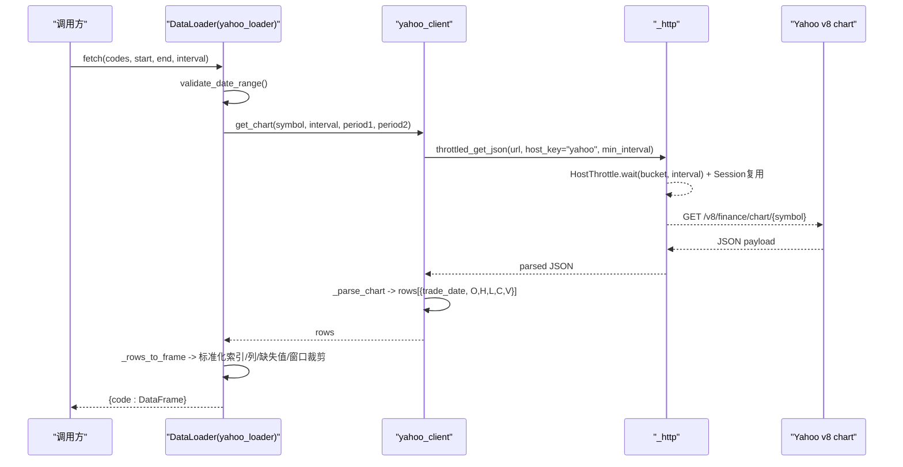
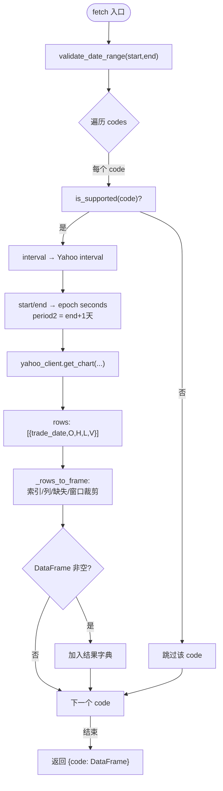
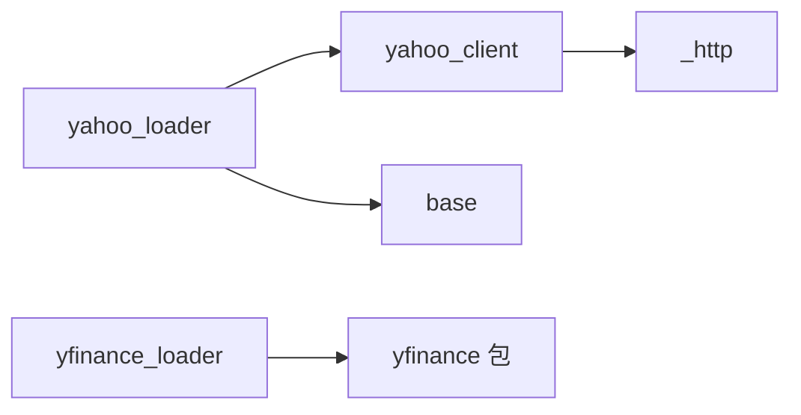

# Yahoo Finance 数据加载器

<cite>
**本文引用的文件**
- [agent/backtest/loaders/yahoo_loader.py](file://agent/backtest/loaders/yahoo_loader.py)
- [agent/backtest/loaders/yahoo_client.py](file://agent/backtest/loaders/yahoo_client.py)
- [agent/backtest/loaders/_http.py](file://agent/backtest/loaders/_http.py)
- [agent/backtest/loaders/base.py](file://agent/backtest/loaders/base.py)
- [agent/tests/test_yahoo_loader.py](file://agent/tests/test_yahoo_loader.py)
- [agent/backtest/loaders/yfinance_loader.py](file://agent/backtest/loaders/yfinance_loader.py)
</cite>

## 目录
1. [简介](#简介)
2. [项目结构](#项目结构)
3. [核心组件](#核心组件)
4. [架构总览](#架构总览)
5. [详细组件分析](#详细组件分析)
6. [依赖关系分析](#依赖关系分析)
7. [性能与节流](#性能与节流)
8. [配置与环境变量](#配置与环境变量)
9. [使用模式与示例](#使用模式与示例)
10. [常见问题与排错](#常见问题与排错)
11. [结论](#结论)

## 简介
本文件为 Yahoo Finance 数据加载器的完整使用文档，聚焦以下要点：
- 免费数据源特点与限制：无需认证、按 IP 限流、通过进程级节流与会话复用降低被限风险。
- 支持市场与数据类型：美股、港股、印度股、韩国股、加拿大股；以及 Yahoo 自有期货（=F）与外汇（=X）。
- 时间间隔映射规则：日线、小时线、分钟线的处理方式与边界约定。
- OHLCV 标准化流程：时间戳处理、复权因子、缺失值与异常数据处理。
- 批量获取与增量更新策略：缓存、去重、窗口裁剪与失败隔离。
- 常见问题解决方案：网络超时、IP 限流、数据格式异常等。

## 项目结构
Yahoo Finance 相关实现位于 backtest/loaders 目录下，主要包含：
- yahoo_loader.py：面向项目的 DataLoader 接口实现，负责符号判定、区间映射、时间窗口计算、OHLCV 标准化与缓存调用。
- yahoo_client.py：共享的 Yahoo 公共 API 客户端，封装 v8 chart、quoteSummary、options、search 等端点，并处理 cookie/crumb 握手与节流。
- _http.py：进程级 HTTP 工具，提供 per-host 节流、会话复用、默认 UA 等。
- base.py：通用校验、重试预算、OHLC 校验等基础能力。
- yfinance_loader.py：基于第三方 yfinance 包的替代实现，用于对比或回退场景。

图表来源
- [agent/backtest/loaders/yahoo_loader.py:173-275](file://agent/backtest/loaders/yahoo_loader.py#L173-L275)
- [agent/backtest/loaders/yahoo_client.py:156-205](file://agent/backtest/loaders/yahoo_client.py#L156-L205)
- [agent/backtest/loaders/_http.py:141-200](file://agent/backtest/loaders/_http.py#L141-L200)
- [agent/backtest/loaders/base.py:168-256](file://agent/backtest/loaders/base.py#L168-L256)

章节来源
- [agent/backtest/loaders/yahoo_loader.py:1-275](file://agent/backtest/loaders/yahoo_loader.py#L1-L275)
- [agent/backtest/loaders/yahoo_client.py:1-419](file://agent/backtest/loaders/yahoo_client.py#L1-L419)
- [agent/backtest/loaders/_http.py:1-201](file://agent/backtest/loaders/_http.py#L1-L201)
- [agent/backtest/loaders/base.py:1-200](file://agent/backtest/loaders/base.py#L1-L200)

## 核心组件
- DataLoader（yahoo_loader）：对外暴露统一 fetch 接口，支持批量代码、起止日期、时间间隔；内部完成符号支持性检查、区间映射、时间窗口转换、调用客户端、标准化 DataFrame 并返回结果。
- yahoo_client：封装 Yahoo 公共端点访问，自动映射项目符号到 Yahoo ticker，解析 chart 响应为行列表，处理 quoteSummary/options 的 crumb/cookie 握手与 401 刷新。
- _http：进程级 HostThrottle，保证同一 host bucket 的请求最小间隔，附带随机抖动避免并发同步；维护 per-bucket 的 requests.Session 复用连接。
- base：日期范围校验、OHLC 结构校验、重试预算与指数退避等通用能力。

章节来源
- [agent/backtest/loaders/yahoo_loader.py:173-275](file://agent/backtest/loaders/yahoo_loader.py#L173-L275)
- [agent/backtest/loaders/yahoo_client.py:156-205](file://agent/backtest/loaders/yahoo_client.py#L156-L205)
- [agent/backtest/loaders/_http.py:46-110](file://agent/backtest/loaders/_http.py#L46-L110)
- [agent/backtest/loaders/base.py:168-256](file://agent/backtest/loaders/base.py#L168-L256)

## 架构总览
下图展示从上层调用到 Yahoo 端点的请求序列，包括节流、会话复用、crumb 握手与数据标准化。

图表来源
- [agent/backtest/loaders/yahoo_loader.py:195-275](file://agent/backtest/loaders/yahoo_loader.py#L195-L275)
- [agent/backtest/loaders/yahoo_client.py:156-233](file://agent/backtest/loaders/yahoo_client.py#L156-L233)
- [agent/backtest/loaders/_http.py:141-200](file://agent/backtest/loaders/_http.py#L141-L200)

## 详细组件分析

### DataLoader（yahoo_loader）
- 支持市场：us_equity、hk_equity、india_equity、kr_equity、ca_equity；同时兼容 Yahoo 自有期货（=F）与外汇（=X）。
- 无需认证：requires_auth=False，is_available 始终返回 True。
- 符号判定：仅接受以 .US/.HK/.NS/.BO/.KS/.KQ/.TO/.V 结尾的股票，以及 =F 与 =X 后缀的期货/外汇。
- 时间间隔映射：
  - 1D → 1d
  - 1H → 1h
  - 4H → 1h（Yahoo 无 4h，采用 1h 近似）
  - 1W → 1wk
  - 1M → 1mo
  - 分钟形如 5m/15m/30m 保持小写透传；空字符串默认 1d。
- 日内判断：区分日/周/月与分钟/小时粒度，决定时间戳是否归一化至午夜。
- 时间窗口：将起止日期转换为 epoch 秒，period2 为闭区间的次日（exclusive），随后在 DataFrame 中裁剪到 inclusive 窗口。
- 标准化：
  - 列：open/high/low/close/volume，缺失列填充 volume=0.0，其他为 NA 后转 float。
  - 时间戳：日线及以上归一化为午夜；分钟/小时保留原始时间。
  - 缺失值：删除 OHLC 任一为空的行；volume 缺失填 0。
  - 排序：按 trade_date 升序。
- 批量与容错：逐 symbol 调用，单个失败不影响其他 symbol；结果为空则省略该 symbol。

图表来源
- [agent/backtest/loaders/yahoo_loader.py:44-106](file://agent/backtest/loaders/yahoo_loader.py#L44-L106)
- [agent/backtest/loaders/yahoo_loader.py:139-184](file://agent/backtest/loaders/yahoo_loader.py#L139-L184)
- [agent/backtest/loaders/yahoo_loader.py:195-275](file://agent/backtest/loaders/yahoo_loader.py#L195-L275)

章节来源
- [agent/backtest/loaders/yahoo_loader.py:1-275](file://agent/backtest/loaders/yahoo_loader.py#L1-L275)
- [agent/tests/test_yahoo_loader.py:56-128](file://agent/tests/test_yahoo_loader.py#L56-L128)
- [agent/tests/test_yahoo_loader.py:130-227](file://agent/tests/test_yahoo_loader.py#L130-L227)
- [agent/tests/test_yahoo_loader.py:229-320](file://agent/tests/test_yahoo_loader.py#L229-L320)

### yahoo_client（公共 API 客户端）
- 符号映射：
  - .US 后缀去除（例如 AAPL.US → AAPL）
  - .HK 前导零规范化为 4 位（例如 00700.HK → 0700.HK）
  - India .NS/.BO、Canada .TO/.V 原样透传
  - 其他符号原样透传（如 BTC-USD、^GSPC）
- Chart 端点：
  - 支持 range 或 period1/period2 指定时间窗
  - 解析 timestamp 与 indicators.quote[0] 的 O/H/L/C/V，丢弃非交易日（null）
- QuoteSummary/Options：
  - 需要 cookie + crumb；首次懒加载，401 时自动刷新一次并重试
- Search/News：
  - 自由文本搜索与新闻检索

章节来源
- [agent/backtest/loaders/yahoo_client.py:14-24](file://agent/backtest/loaders/yahoo_client.py#L14-L24)
- [agent/backtest/loaders/yahoo_client.py:71-92](file://agent/backtest/loaders/yahoo_client.py#L71-L92)
- [agent/backtest/loaders/yahoo_client.py:156-233](file://agent/backtest/loaders/yahoo_client.py#L156-L233)
- [agent/backtest/loaders/yahoo_client.py:302-357](file://agent/backtest/loaders/yahoo_client.py#L302-L357)
- [agent/backtest/loaders/yahoo_client.py:360-419](file://agent/backtest/loaders/yahoo_client.py#L360-L419)
- [agent/backtest/loaders/yahoo_client.py:422-467](file://agent/backtest/loaders/yahoo_client.py#L422-L467)

### _http（进程级节流与会话复用）
- HostThrottle：
  - 按 host_key 维度维护最近请求时间与最小间隔
  - 每次请求等待至允许发射时刻，附加随机抖动避免并发同步
  - 定期清理过期桶，防止内存增长
- Session 复用：
  - 按 host_key 维护 requests.Session，减少 TCP/TLS 握手开销
- 默认 UA：
  - 使用浏览器 UA 字符串，避免部分免费接口拒绝裸 UA
- 环境变量：
  - resolve_min_interval 读取 per-provider 的最小间隔环境变量（如 VIBE_TRADING_YAHOO_MIN_INTERVAL）

章节来源
- [agent/backtest/loaders/_http.py:1-17](file://agent/backtest/loaders/_http.py#L1-L17)
- [agent/backtest/loaders/_http.py:46-110](file://agent/backtest/loaders/_http.py#L46-L110)
- [agent/backtest/loaders/_http.py:118-139](file://agent/backtest/loaders/_http.py#L118-L139)
- [agent/backtest/loaders/_http.py:141-200](file://agent/backtest/loaders/_http.py#L141-L200)

### base（通用校验与验证）
- 日期范围校验：确保 start <= end，格式合法
- OHLC 校验：检测 high < low、价格非正等结构性问题，支持 drop/warn/raise 策略
- 重试预算：retry_with_budget 提供带截止时间的指数退避重试

章节来源
- [agent/backtest/loaders/base.py:168-256](file://agent/backtest/loaders/base.py#L168-L256)
- [agent/backtest/loaders/base.py:377-414](file://agent/backtest/loaders/base.py#L377-L414)

### yfinance_loader（备选实现）
- 基于第三方 yfinance 包，支持 US/HK/India/Korea/Canada 股票与加密货币
- 区间映射：1D→1d、1H→1h、4H→1h（再聚合为 4h）、1W→1wk、1M→1mo、分钟保持小写
- 批量下载与单标的回退：先尝试批量下载，若为空则退回单标下载
- 标准化：列重命名、时间戳本地化移除、volume 填充、dropna、validate_ohlc、必要时 resample 4h

章节来源
- [agent/backtest/loaders/yfinance_loader.py:1-48](file://agent/backtest/loaders/yfinance_loader.py#L1-L48)
- [agent/backtest/loaders/yfinance_loader.py:51-95](file://agent/backtest/loaders/yfinance_loader.py#L51-L95)
- [agent/backtest/loaders/yfinance_loader.py:97-227](file://agent/backtest/loaders/yfinance_loader.py#L97-L227)
- [agent/backtest/loaders/yfinance_loader.py:229-346](file://agent/backtest/loaders/yfinance_loader.py#L229-L346)

## 依赖关系分析
- yahoo_loader 依赖 yahoo_client 进行网络请求，依赖 base 做校验与缓存。
- yahoo_client 依赖 _http 进行节流与 HTTP 访问，依赖 requests 库。
- _http 提供进程内全局节流与会话池，所有 Yahoo 端点共用同一 host_key 以统一限速。
- yfinance_loader 独立于 yahoo_client，直接调用 yfinance 包。

图表来源
- [agent/backtest/loaders/yahoo_loader.py:173-275](file://agent/backtest/loaders/yahoo_loader.py#L173-L275)
- [agent/backtest/loaders/yahoo_client.py:156-205](file://agent/backtest/loaders/yahoo_client.py#L156-L205)
- [agent/backtest/loaders/_http.py:141-200](file://agent/backtest/loaders/_http.py#L141-L200)
- [agent/backtest/loaders/yfinance_loader.py:229-346](file://agent/backtest/loaders/yfinance_loader.py#L229-L346)

章节来源
- [agent/backtest/loaders/yahoo_loader.py:173-275](file://agent/backtest/loaders/yahoo_loader.py#L173-L275)
- [agent/backtest/loaders/yahoo_client.py:156-205](file://agent/backtest/loaders/yahoo_client.py#L156-L205)
- [agent/backtest/loaders/_http.py:141-200](file://agent/backtest/loaders/_http.py#L141-L200)
- [agent/backtest/loaders/yfinance_loader.py:229-346](file://agent/backtest/loaders/yfinance_loader.py#L229-L346)

## 性能与节流
- 进程级节流：
  - 所有 Yahoo 请求通过 _http.throttled_get_json，按 host_key="yahoo" 统一限速
  - 最小间隔默认约 0.6 秒，可通过环境变量覆盖
  - 随机抖动避免并发同步导致瞬时峰值
- 会话复用：
  - 每个 host_key 维护一个 requests.Session，减少握手成本
- 批量与缓存：
  - yahoo_loader 对每个 symbol 单独调用，失败不中断整体
  - 使用 cached_loader_fetch 进行缓存命中，避免重复网络请求
- 时间窗口优化：
  - period2 设置为 end+1 天，确保包含闭区间最后一天，随后在 DataFrame 中精确裁剪

章节来源
- [agent/backtest/loaders/yahoo_client.py:60-69](file://agent/backtest/loaders/yahoo_client.py#L60-L69)
- [agent/backtest/loaders/_http.py:46-110](file://agent/backtest/loaders/_http.py#L46-L110)
- [agent/backtest/loaders/yahoo_loader.py:239-257](file://agent/backtest/loaders/yahoo_loader.py#L239-L257)
- [agent/backtest/loaders/yahoo_loader.py:262-275](file://agent/backtest/loaders/yahoo_loader.py#L262-L275)

## 配置与环境变量
- 最小请求间隔：
  - 环境变量：VIBE_TRADING_YAHOO_MIN_INTERVAL
  - 默认：约 0.6 秒
  - 用途：控制进程内对 Yahoo 的最小请求间隔，避免触发 IP 限流
- 运行时环境白名单：
  - VIBE_TRADING_YAHOO_MIN_INTERVAL 属于允许的运行时环境变量，可安全注入到子进程

章节来源
- [agent/backtest/loaders/yahoo_client.py:60-69](file://agent/backtest/loaders/yahoo_client.py#L60-L69)
- [agent/src/core/runner.py:328-341](file://agent/src/core/runner.py#L328-L341)

## 使用模式与示例

### 基本用法
- 参数：
  - codes：项目符号列表，如 AAPL.US、00700.HK、RELIANCE.NS、TD.TO
  - start_date/end_date：YYYY-MM-DD 格式的闭区间
  - interval：1D/1H/5m/15m/30m/1W/1M 等
- 返回：
  - {code: DataFrame}，DataFrame 索引为 trade_date，列为 open/high/low/close/volume

章节来源
- [agent/backtest/loaders/yahoo_loader.py:195-242](file://agent/backtest/loaders/yahoo_loader.py#L195-L242)

### 批量获取
- 支持一次性传入多个 codes，逐个 symbol 拉取，失败隔离
- 适合组合多只股票的日/小时/分钟线历史

章节来源
- [agent/backtest/loaders/yahoo_loader.py:239-257](file://agent/backtest/loaders/yahoo_loader.py#L239-L257)

### 增量更新策略
- 利用缓存：
  - 相同 source/symbol/timeframe/start/end 的查询会命中缓存，避免重复网络请求
- 窗口裁剪：
  - 通过 start_date/end_date 精确控制返回范围，便于增量追加新日期
- 建议：
  - 每日增量：end_date 设为当日，start_date 设为上次更新日期
  - 结合外部调度任务（如 cron）定时执行

章节来源
- [agent/backtest/loaders/yahoo_loader.py:239-257](file://agent/backtest/loaders/yahoo_loader.py#L239-L257)

### 时间间隔映射规则
- 日线：1D → 1d
- 小时线：1H → 1h
- 分钟线：5m/15m/30m 保持小写透传
- 4H：由于 Yahoo 无 4h，映射为 1h（yfinance_loader 会进一步 resample 为 4h）
- 周/月：1W → 1wk，1M → 1mo

章节来源
- [agent/backtest/loaders/yahoo_loader.py:38-48](file://agent/backtest/loaders/yahoo_loader.py#L38-L48)
- [agent/backtest/loaders/yahoo_loader.py:72-87](file://agent/backtest/loaders/yahoo_loader.py#L72-L87)
- [agent/backtest/loaders/yfinance_loader.py:37-50](file://agent/backtest/loaders/yfinance_loader.py#L37-L50)

### OHLCV 数据格式标准化
- 时间戳：
  - 日线及以上归一化为午夜（tz-naive）
  - 分钟/小时保留原始时间戳
- 复权因子：
  - 本加载器不应用复权；如需复权可使用 yfinance_loader 的 auto_adjust=False 并自行处理
- 缺失值：
  - 删除 OHLC 任一为空的行
  - volume 缺失填充为 0.0
- 列顺序：open/high/low/close/volume，类型 float64

章节来源
- [agent/backtest/loaders/yahoo_loader.py:139-184](file://agent/backtest/loaders/yahoo_loader.py#L139-L184)
- [agent/backtest/loaders/yfinance_loader.py:194-248](file://agent/backtest/loaders/yfinance_loader.py#L194-L248)

## 常见问题与排错

### 网络超时
- 现象：请求超时或连接错误
- 原因：网络波动或 Yahoo 服务端延迟
- 解决：
  - 增加重试预算（使用 base.retry_with_budget 的模式）
  - 适当增大最小间隔，降低并发压力
  - 检查代理与证书设置（如适用）

章节来源
- [agent/backtest/loaders/_http.py:141-200](file://agent/backtest/loaders/_http.py#L141-L200)
- [agent/backtest/loaders/base.py:377-414](file://agent/backtest/loaders/base.py#L377-L414)

### IP 限流
- 现象：频繁请求后被 Yahoo 限流或暂时封禁
- 原因：请求频率过高
- 解决：
  - 提高 VIBE_TRADING_YAHOO_MIN_INTERVAL
  - 使用批量获取减少请求次数
  - 合理拆分批次，避免短时间大量并发

章节来源
- [agent/backtest/loaders/_http.py:46-110](file://agent/backtest/loaders/_http.py#L46-L110)
- [agent/backtest/loaders/yahoo_client.py:60-69](file://agent/backtest/loaders/yahoo_client.py#L60-L69)

### 数据格式异常
- 现象：OHLC 结构不完整、价格为负或 NaN
- 原因：非交易日、数据缺失或异常
- 解决：
  - 使用 validate_ohlc 进行结构校验与过滤
  - 删除缺失 OHLC 的行，填充 volume 为 0
  - 对于负价格，根据市场特性决定是否允许

章节来源
- [agent/backtest/loaders/base.py:187-256](file://agent/backtest/loaders/base.py#L187-L256)
- [agent/backtest/loaders/yahoo_loader.py:139-184](file://agent/backtest/loaders/yahoo_loader.py#L139-L184)

### 符号不被支持
- 现象：某些代码无法拉取数据
- 原因：不在支持的标记集合内
- 解决：
  - 确认代码后缀是否为 .US/.HK/.NS/.BO/.KS/.KQ/.TO/.V 或 =F/=X
  - 使用 map_symbol 进行规范化后再请求

章节来源
- [agent/backtest/loaders/yahoo_loader.py:44-55](file://agent/backtest/loaders/yahoo_loader.py#L44-L55)
- [agent/backtest/loaders/yahoo_client.py:71-92](file://agent/backtest/loaders/yahoo_client.py#L71-L92)

### 4H 数据不准确
- 现象：4H 条形图与实际不符
- 原因：Yahoo 无原生 4h，需通过 1h 近似或 resample
- 解决：
  - yahoo_loader 将 4H 映射为 1h
  - yfinance_loader 在获取 1h 后进行 4h resample

章节来源
- [agent/backtest/loaders/yahoo_loader.py:38-48](file://agent/backtest/loaders/yahoo_loader.py#L38-L48)
- [agent/backtest/loaders/yfinance_loader.py:37-50](file://agent/backtest/loaders/yfinance_loader.py#L37-L50)
- [agent/backtest/loaders/yfinance_loader.py:235-246](file://agent/backtest/loaders/yfinance_loader.py#L235-L246)

## 结论
Yahoo Finance 数据加载器通过进程级节流、会话复用与严格的 OHLCV 标准化，提供了稳定、免费的全球股票市场与期货/外汇历史数据获取能力。其设计兼顾了易用性与健壮性：
- 无需认证、易于集成
- 支持多市场与多种时间粒度
- 完善的缺失值与异常数据处理
- 灵活的批量与增量更新策略
- 针对网络与限流的鲁棒性措施

在生产环境中，建议结合合理的间隔配置与缓存策略，以获得最佳性能与稳定性。