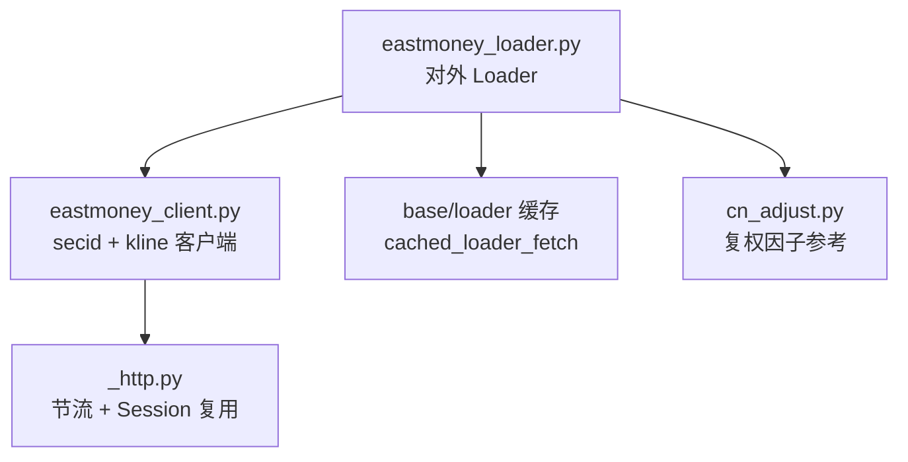
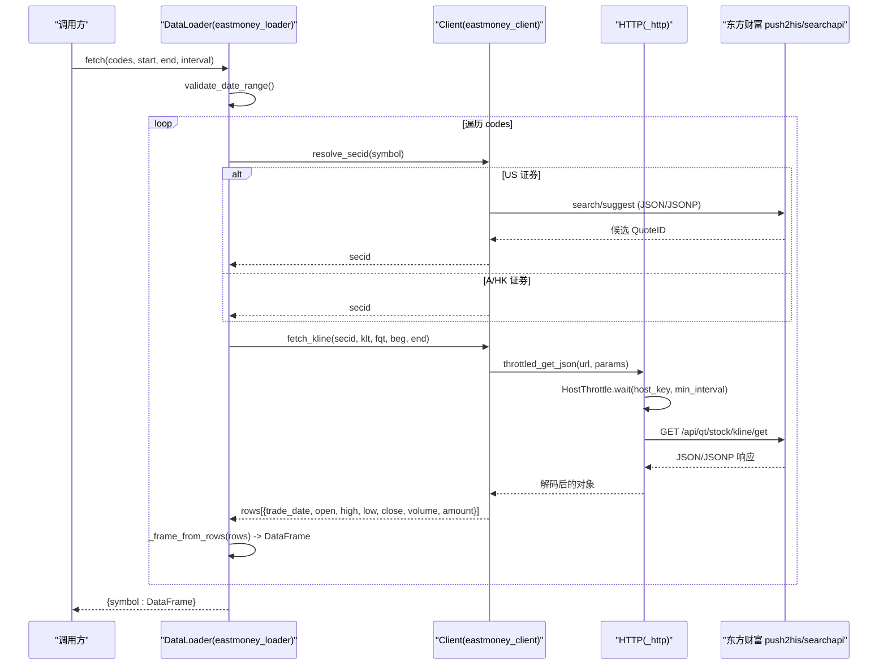
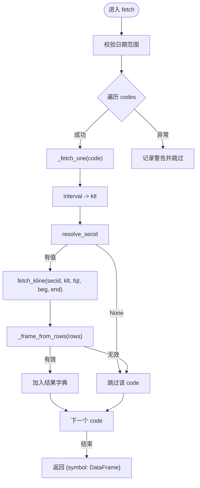
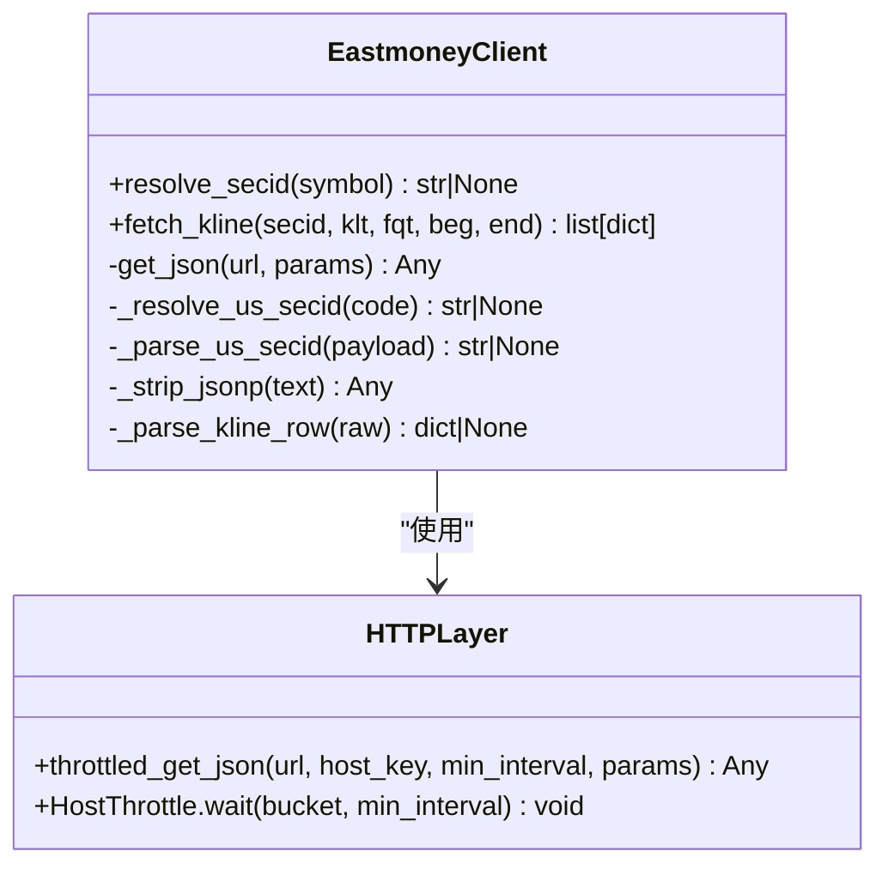
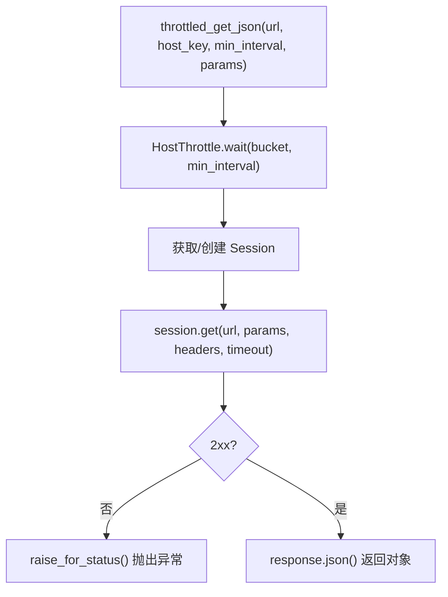
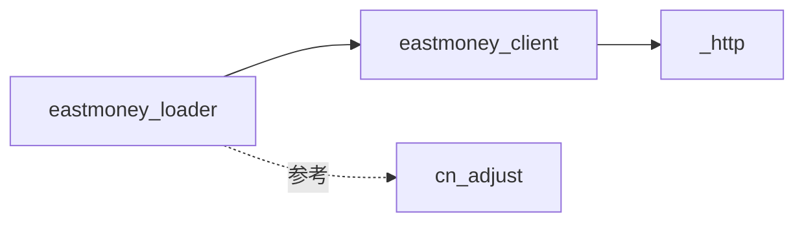

# 东方财富数据加载器

<cite>
**本文引用的文件**
- [eastmoney_loader.py](file://agent/backtest/loaders/eastmoney_loader.py)
- [eastmoney_client.py](file://agent/backtest/loaders/eastmoney_client.py)
- [_http.py](file://agent/backtest/loaders/_http.py)
- [cn_adjust.py](file://agent/backtest/loaders/cn_adjust.py)
- [test_eastmoney_loader.py](file://agent/tests/test_eastmoney_loader.py)
- [test_eastmoney_client.py](file://agent/tests/test_eastmoney_client.py)
- [.env.example](file://agent/.env.example)
</cite>

## 目录
1. [简介](#简介)
2. [项目结构](#项目结构)
3. [核心组件](#核心组件)
4. [架构总览](#架构总览)
5. [详细组件分析](#详细组件分析)
6. [依赖关系分析](#依赖关系分析)
7. [性能与并发控制](#性能与并发控制)
8. [配置与环境变量](#配置与环境变量)
9. [使用模式与示例](#使用模式与示例)
10. [故障排查](#故障排查)
11. [与其他数据源的对比](#与其他数据源的对比)
12. [结论](#结论)

## 简介
本文件面向在 A 股市场进行回测、研究与策略开发的工程师，系统化说明本项目中“东方财富数据加载器”的实现原理、使用方法与最佳实践。该加载器通过东方财富公开的 HTTP 接口获取 A 股、港股、美股的 OHLCV 历史行情，具备以下特点：
- 免费、无需鉴权：基于 push2his 等公开接口，无需 token。
- 跨市场支持：A 股（沪/深/北）、港股、美股（通过搜索解析）。
- 稳健的速率限制与连接复用：统一通过共享 HTTP 层进行节流与 Session 复用，降低被限流封禁的风险。
- 标准化输出：统一为 trade_date 索引的 DataFrame，列包含 open/high/low/close/volume。
- 可缓存：借助通用缓存机制减少重复网络请求。

注意：当前实现以历史 K 线为主，未内置 WebSocket 实时推送；如需实时行情，可在上层结合其他通道或自行扩展。

## 项目结构
围绕东方财富数据加载的关键代码位于 backtest/loaders 目录下，主要文件职责如下：
- eastmoney_loader.py：对外暴露 DataLoader，负责将 symbol/interval/date 映射到客户端调用，并组装标准 DataFrame。
- eastmoney_client.py：封装东方财富 secid 解析、K 线拉取、JSONP 处理、US 证券搜索与缓存。
- _http.py：提供 per-host 节流、Session 复用、JSON GET 封装，供所有直连 API 的 loader 共用。
- cn_adjust.py：提供前复权因子应用逻辑（主要用于 Tushare/AKShare 场景，但可作为复权处理的参考）。

图表来源
- [eastmoney_loader.py:1-183](file://agent/backtest/loaders/eastmoney_loader.py#L1-L183)
- [eastmoney_client.py:1-325](file://agent/backtest/loaders/eastmoney_client.py#L1-L325)
- [_http.py:1-201](file://agent/backtest/loaders/_http.py#L1-L201)
- [cn_adjust.py:1-78](file://agent/backtest/loaders/cn_adjust.py#L1-L78)

章节来源
- [eastmoney_loader.py:1-183](file://agent/backtest/loaders/eastmoney_loader.py#L1-L183)
- [eastmoney_client.py:1-325](file://agent/backtest/loaders/eastmoney_client.py#L1-L325)
- [_http.py:1-201](file://agent/backtest/loaders/_http.py#L1-L201)
- [cn_adjust.py:1-78](file://agent/backtest/loaders/cn_adjust.py#L1-L78)

## 核心组件
- DataLoader（eastmoney_loader.py）
  - 名称与能力：name="eastmoney"，支持 a_share/hk_equity/us_equity，volume_units 区分 A 股（手）与港股（股），不需要鉴权。
  - fetch()：批量拉取 OHLCV，单个失败不影响整体；返回 {symbol: DataFrame}。
  - 日期格式转换：内部将 YYYY-MM-DD 转为 YYYYMMDD 传入客户端。
  - 区间映射：将 "1D"/"1W"/"1M"/"1H"/"5m"/"15m"/"30m" 等映射到客户端 klt 码。
- Eastmoney Client（eastmoney_client.py）
  - secid 解析：A 股 SH/SZ/BJ、HK（五位数零填充）、US（通过搜索端点解析并进程级缓存）。
  - K 线拉取：调用 push2his，解析 JSON 或 JSONP 响应，输出按时间升序的行列表。
  - 字段选择：fields1/fields2 指定元信息与每根 K 线的列顺序。
- HTTP 层（_http.py）
  - HostThrottle：进程内按 host_key 的最小间隔控制，带抖动避免同步突发。
  - throttled_get_json：统一 GET + raise_for_status + json()，便于重试策略分类。
  - Session 复用：按 host_key 维护 requests.Session，减少握手开销。
- 复权处理（cn_adjust.py）
  - apply_qfq：对原始价格序列应用前复权因子，调整价格与成交量，保持金额不变。

章节来源
- [eastmoney_loader.py:51-183](file://agent/backtest/loaders/eastmoney_loader.py#L51-L183)
- [eastmoney_client.py:136-355](file://agent/backtest/loaders/eastmoney_client.py#L136-L355)
- [_http.py:46-201](file://agent/backtest/loaders/_http.py#L46-L201)
- [cn_adjust.py:27-78](file://agent/backtest/loaders/cn_adjust.py#L27-L78)

## 架构总览
下图展示了从调用方到东方财富接口的完整数据流，包括符号解析、HTTP 节流、K 线解析与 DataFrame 构建。

图表来源
- [eastmoney_loader.py:69-183](file://agent/backtest/loaders/eastmoney_loader.py#L69-L183)
- [eastmoney_client.py:210-355](file://agent/backtest/loaders/eastmoney_client.py#L210-L355)
- [_http.py:141-201](file://agent/backtest/loaders/_http.py#L141-L201)

## 详细组件分析

### DataLoader（eastmoney_loader.py）
- 关键行为
  - 校验日期范围，非法则抛出 ValueError。
  - 对每个 code 调用 cached_loader_fetch，屏蔽异常，保证单条失败不中断批次。
  - 将 interval 映射为 klt，再调用 client.fetch_kline。
  - 将返回行组装为标准 DataFrame，索引为 trade_date，列为 open/high/low/close/volume。
- 错误与边界
  - 不支持的 interval：直接跳过并记录警告。
  - 无法解析 symbol：返回空结果。
  - 无数据或列缺失：返回 None，最终不出现在结果字典中。

图表来源
- [eastmoney_loader.py:69-183](file://agent/backtest/loaders/eastmoney_loader.py#L69-L183)

章节来源
- [eastmoney_loader.py:51-183](file://agent/backtest/loaders/eastmoney_loader.py#L51-L183)
- [test_eastmoney_loader.py:75-192](file://agent/tests/test_eastmoney_loader.py#L75-L192)

### Eastmoney Client（eastmoney_client.py）
- secid 解析
  - A 股：SH→市场号 1；SZ/BJ→市场号 0。
  - 港股：市场号 116，代码零填充至五位。
  - 美股：通过 search/suggest 接口解析候选 QuoteID，仅保留 NASDAQ/NYSE/AMEX，结果进程级缓存。
- K 线拉取
  - 调用 push2his，参数包含 secid、klt、fqt、beg/end、fields1/fields2、rev、lmt。
  - 解析 data.klines 中的逗号分隔字符串，转换为字典列表。
  - 支持 JSON 与 JSONP 两种响应体格式。
- 环境变量
  - VIBE_TRADING_EASTMONEY_MIN_INTERVAL：最小请求间隔（秒），默认 1.0。

图表来源
- [eastmoney_client.py:112-355](file://agent/backtest/loaders/eastmoney_client.py#L112-L355)
- [_http.py:46-201](file://agent/backtest/loaders/_http.py#L46-L201)

章节来源
- [eastmoney_client.py:136-355](file://agent/backtest/loaders/eastmoney_client.py#L136-L355)
- [test_eastmoney_client.py:22-199](file://agent/tests/test_eastmoney_client.py#L22-L199)

### HTTP 层（_http.py）
- HostThrottle
  - 进程内全局锁保护的时间槽管理，按 bucket（host_key）记录最近一次“预留发射时间”，并发调用会链式等待并叠加抖动，确保同一 host 的请求至少间隔 min_interval。
- Session 复用
  - 按 host_key 维护 requests.Session，减少 TCP/TLS 握手成本。
- throttled_get_json
  - 统一封装 GET、状态码检查、JSON 解码，便于上层重试策略识别瞬时错误。

图表来源
- [_http.py:141-201](file://agent/backtest/loaders/_http.py#L141-L201)

章节来源
- [_http.py:1-201](file://agent/backtest/loaders/_http.py#L1-201)

### 复权处理（cn_adjust.py）
- apply_qfq
  - 输入：原始日频 DataFrame（含 OHLCV）与 adj_factor 序列。
  - 逻辑：计算 ratio = factor / last(factor)，对 OHLC 乘以 ratio，对 volume 除以 ratio，amount 保持不变。
  - 用途：用于消除除权除息带来的机械跳空，使收益率连续。
- 适用性
  - 当前加载器已使用 fqt=1（前复权）获取 K 线；若需自定义复权或合并多源数据，可参考此模块逻辑。

章节来源
- [cn_adjust.py:27-78](file://agent/backtest/loaders/cn_adjust.py#L27-L78)

## 依赖关系分析
- 耦合度
  - DataLoader 仅依赖 eastmoney_client 的抽象接口（resolve_secid、fetch_kline），低耦合，便于替换后端。
  - eastmoney_client 依赖 _http 提供的节流与 JSON 工具，解耦了网络细节。
  - cn_adjust 独立于加载器，作为复权处理的可复用模块。
- 外部依赖
  - 东方财富 push2his/searchapi 接口；受 IP 限速影响，必须通过 _http 的节流与 Session 复用。
- 潜在循环依赖
  - 无循环依赖；loader → client → http，单向依赖。

图表来源
- [eastmoney_loader.py:1-183](file://agent/backtest/loaders/eastmoney_loader.py#L1-L183)
- [eastmoney_client.py:1-325](file://agent/backtest/loaders/eastmoney_client.py#L1-L325)
- [_http.py:1-201](file://agent/backtest/loaders/_http.py#L1-L201)
- [cn_adjust.py:1-78](file://agent/backtest/loaders/cn_adjust.py#L1-L78)

章节来源
- [eastmoney_loader.py:1-183](file://agent/backtest/loaders/eastmoney_loader.py#L1-L183)
- [eastmoney_client.py:1-325](file://agent/backtest/loaders/eastmoney_client.py#L1-L325)
- [_http.py:1-201](file://agent/backtest/loaders/_http.py#L1-L201)
- [cn_adjust.py:1-78](file://agent/backtest/loaders/cn_adjust.py#L1-L78)

## 性能与并发控制
- 请求合并与缓存
  - 通过 base.cached_loader_fetch 对相同 source/symbol/timeframe/date-range 的结果进行缓存，避免重复网络请求。
  - US secid 解析结果进程级缓存，避免重复搜索。
- 并发控制
  - HostThrottle 保证同一 host_key 的最小请求间隔，防止触发东方财富的 IP 限速。
  - 抖动（jitter）避免多个并发任务同时发起导致“雪崩”。
- 连接复用
  - 按 host_key 复用 requests.Session，减少握手与证书验证开销。
- 错误重试
  - HTTP 层抛出异常由上层重试策略判定是否重试；建议对瞬时错误（如 429/超时）实施指数退避重试。
- 内存与 I/O
  - 单次拉取最大 lmt 较大，建议在批量拉取时分片以减少内存峰值。
  - 对长周期回测启用本地缓存（VIBE_TRADING_DATA_CACHE）可减少网络压力。

章节来源
- [eastmoney_client.py:37-41](file://agent/backtest/loaders/eastmoney_client.py#L37-L41)
- [_http.py:46-115](file://agent/backtest/loaders/_http.py#L46-L115)
- [eastmoney_loader.py:98-116](file://agent/backtest/loaders/eastmoney_loader.py#L98-L116)

## 配置与环境变量
- 关键环境变量
  - VIBE_TRADING_EASTMONEY_MIN_INTERVAL：设置东方财富的最小请求间隔（秒），默认 1.0。批处理时可适当调大以避免被封禁。
  - VIBE_TRADING_DATA_CACHE：开启后，历史数据落盘缓存，加速重复回测。
  - TUSHARE_TOKEN：非必需，仅在切换到 Tushare 时生效。
- 代理与超时
  - 可通过系统代理或 requests 配置；超时由 HTTP 层默认 15s，可按需调整。
- 安全与合规
  - 遵守东方财富的使用条款与频率限制；生产环境建议增加监控与告警。

章节来源
- [eastmoney_client.py:37-41](file://agent/backtest/loaders/eastmoney_client.py#L37-L41)
- [_http.py:127-139](file://agent/backtest/loaders/_http.py#L127-L139)
- [.env.example:166-232](file://agent/.env.example#L166-L232)

## 使用模式与示例
- A 股全量数据获取
  - 目标：获取某只或多只 A 股的日频历史数据。
  - 步骤：
    1) 准备 symbols，如 "600519.SH"、"000001.SZ"。
    2) 调用 DataLoader.fetch(codes, start_date, end_date, interval="1D")。
    3) 返回 {symbol: DataFrame}，索引为 trade_date，列包含 open/high/low/close/volume。
  - 注意事项：
    - 批量拉取时建议分批次，避免单次过大。
    - 如遇限速，增大 VIBE_TRADING_EASTMONEY_MIN_INTERVAL。
- 实时行情订阅
  - 当前实现不包含 WebSocket 实时推送；如需实时，可在上层集成其他通道或自行扩展 eastmoney_client 的实时接口。
- 财务数据分析
  - 当前加载器聚焦 OHLCV；如需财务指标，可结合其他数据源（如 Tushare/FMP）并在上层做对齐与合并。
- 复权因子计算
  - 若需自定义复权或合并不同来源数据，可参考 cn_adjust.apply_qfq 的逻辑进行前复权处理。

章节来源
- [eastmoney_loader.py:69-183](file://agent/backtest/loaders/eastmoney_loader.py#L69-L183)
- [eastmoney_client.py:300-355](file://agent/backtest/loaders/eastmoney_client.py#L300-L355)
- [cn_adjust.py:27-78](file://agent/backtest/loaders/cn_adjust.py#L27-L78)

## 故障排查
- 网络波动与超时
  - 现象：频繁超时或 429 错误。
  - 解决：增大 VIBE_TRADING_EASTMONEY_MIN_INTERVAL；在上层实现指数退避重试；检查代理与防火墙。
- 数据延迟
  - 现象：最新交易日数据缺失或滞后。
  - 解决：确认交易时间与节假日；push2his 通常提供收盘后数据；必要时延后查询或使用延迟行情接口。
- 接口变更
  - 现象：字段缺失或解析失败。
  - 解决：检查 fields1/fields2 与 klines 格式；更新 _parse_kline_row 与 _strip_jsonp；添加更严格的容错与日志。
- 符号解析失败
  - 现象：US 证券无法解析。
  - 解决：确认 ticker 大小写与缓存；检查 search/suggest 返回结构；必要时清空进程级缓存重试。
- 批量失败
  - 现象：部分 symbol 失败但不影响整体。
  - 解决：查看日志定位失败 symbol；单独重试；确认该 symbol 是否支持对应 interval。

章节来源
- [eastmoney_loader.py:98-116](file://agent/backtest/loaders/eastmoney_loader.py#L98-L116)
- [eastmoney_client.py:210-236](file://agent/backtest/loaders/eastmoney_client.py#L210-L236)
- [test_eastmoney_client.py:154-159](file://agent/tests/test_eastmoney_client.py#L154-L159)

## 与其他数据源的对比
- 优势
  - 免费且无需鉴权：适合快速原型与低成本研究。
  - 跨市场覆盖：A/HK/US 统一接口风格，简化接入。
  - 稳健的节流与缓存：降低被封禁风险，提升稳定性。
- 局限
  - 无内置实时推送：需要额外方案实现实时行情。
  - 数据深度与质量：相比付费源（如 Wind/同花顺 iFinD），可能缺少某些高级字段或更高精度。
- 适用场景
  - 回测与离线研究：历史 OHLCV 足够支撑多数因子与策略开发。
  - 轻量级实盘辅助：结合延迟行情或分钟级数据做信号生成。

## 结论
本项目中的东方财富数据加载器以简洁、稳定、易用的方式提供了 A/HK/US 市场的历史 OHLCV 数据获取能力。通过统一的 HTTP 节流与缓存机制，显著降低了网络侧风险与成本。对于需要实时行情或更丰富基本面的场景，可在上层组合其他数据源与通道。建议在生产环境中合理配置最小请求间隔、启用本地缓存，并完善监控与告警，以确保长期稳定运行。