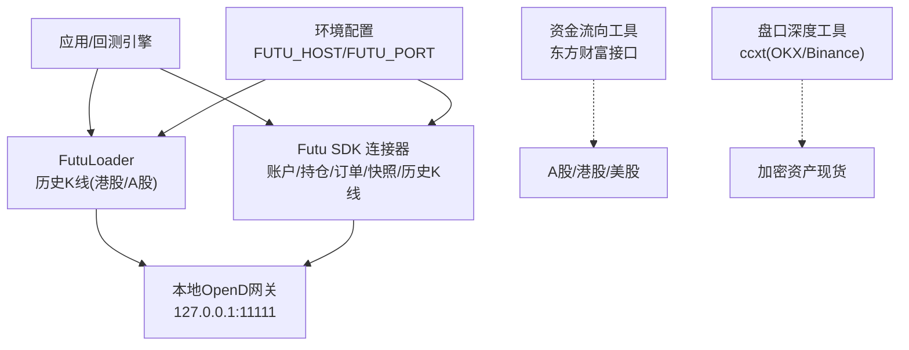
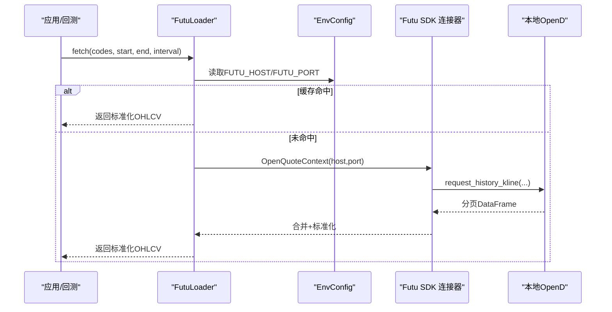
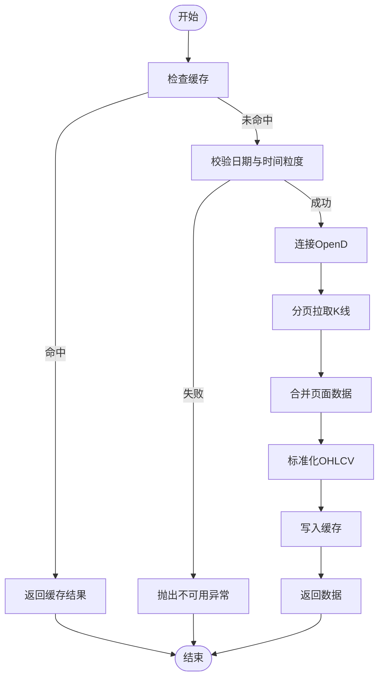
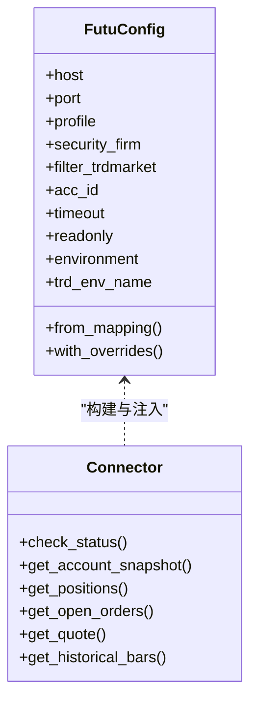
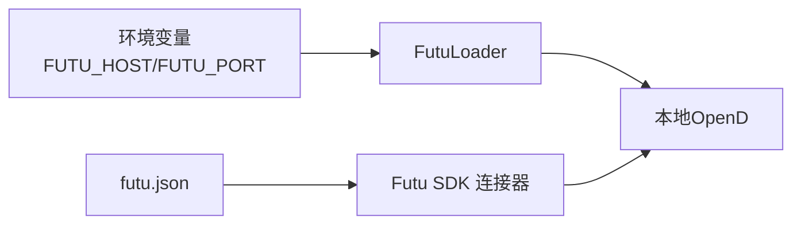

# 富途数据加载器

<cite>
**本文引用的文件**
- [agent/backtest/loaders/futu.py](file://agent/backtest/loaders/futu.py)
- [agent/tests/test_futu_loader.py](file://agent/tests/test_futu_loader.py)
- [agent/src/trading/connectors/futu/sdk.py](file://agent/src/trading/connectors/futu/sdk.py)
- [agent/src/config/env_schema.py](file://agent/src/config/env_schema.py)
- [agent/tests/test_env_schema.py](file://agent/tests/test_env_schema.py)
- [agent/src/tools/fund_flow_tool.py](file://agent/src/tools/fund_flow_tool.py)
- [agent/src/tools/orderbook_depth_tool.py](file://agent/src/tools/orderbook_depth_tool.py)
</cite>

## 目录
1. [简介](#简介)
2. [项目结构](#项目结构)
3. [核心组件](#核心组件)
4. [架构总览](#架构总览)
5. [详细组件分析](#详细组件分析)
6. [依赖关系分析](#依赖关系分析)
7. [性能与扩展性](#性能与扩展性)
8. [故障排查指南](#故障排查指南)
9. [结论](#结论)
10. [附录：配置与使用示例](#附录配置与使用示例)

## 简介
本文件面向“富途数据加载器”的综合使用文档，覆盖以下目标：
- 连接与认证：本地 OpenD 端口、连接参数、安全隔离（不接触富途凭据）。
- 市场范围：港股、A 股等通过富途加载器支持；加密货币通过其他加载器/工具补充。
- 数据类型：历史 K 线为主；实时行情快照、盘口深度、资金流向由连接器或专用工具提供。
- 获取策略：批量历史下载、分页拉取、缓存与增量更新思路。
- 集成方式：与富途官方 SDK 的对接模式与最佳实践。
- 常见问题：断连、数据不完整、性能瓶颈等问题的定位与解决。

## 项目结构
围绕富途数据加载器的关键代码位置如下：
- 回测数据加载器：backtest/loaders/futu.py
- 交易层连接器（官方 SDK 封装）：src/trading/connectors/futu/sdk.py
- 环境变量与默认值：src/config/env_schema.py
- 测试用例：tests/test_futu_loader.py、tests/test_env_schema.py
- 资金流向工具（多市场）：src/tools/fund_flow_tool.py
- 加密资产盘口深度工具（多交易所）：src/tools/orderbook_depth_tool.py

图表来源
- [agent/backtest/loaders/futu.py:106-253](file://agent/backtest/loaders/futu.py#L106-L253)
- [agent/src/trading/connectors/futu/sdk.py:41-56](file://agent/src/trading/connectors/futu/sdk.py#L41-L56)
- [agent/src/config/env_schema.py:207-209](file://agent/src/config/env_schema.py#L207-L209)

章节来源
- [agent/backtest/loaders/futu.py:1-253](file://agent/backtest/loaders/futu.py#L1-L253)
- [agent/src/trading/connectors/futu/sdk.py:1-200](file://agent/src/trading/connectors/futu/sdk.py#L1-L200)
- [agent/src/config/env_schema.py:166-200](file://agent/src/config/env_schema.py#L166-L200)

## 核心组件
- FutuLoader（回测历史K线）
  - 支持市场：港股、A 股（声明为 hk_equity、a_share）。
  - 数据源：本地运行的富途 OpenD，通过 OpenQuoteContext 请求历史 K 线。
  - 时间粒度映射：分钟级（1m/5m/15m/30m）、小时级（1H/4H）、日/周/月。
  - 输出标准化：统一 OHLCV 列名与索引，去重、排序、空值处理。
  - 缓存机制：按 source/symbol/timeframe/date range 缓存，命中则无需连接 OpenD。
  - 分页拉取：基于 page_req_key 循环拉取直到结束，合并后归一化并缓存。
- Futu SDK 连接器（交易层只读能力）
  - 账户快照、持仓、挂单查询；历史 K 线；实时行情快照。
  - 配置文件：~/.vibe-trading/futu.json，支持 profile 与环境隔离（paper/live）。
  - 安全模型：仅通过本地 OpenD 通信，不接触富途登录凭据。
- 环境与配置
  - FUTU_HOST、FUTU_PORT 作为默认 OpenD 地址与端口。
  - 连接器 profile 控制纸模拟/实盘只读身份校验。

章节来源
- [agent/backtest/loaders/futu.py:36-50](file://agent/backtest/loaders/futu.py#L36-L50)
- [agent/backtest/loaders/futu.py:104-125](file://agent/backtest/loaders/futu.py#L104-L125)
- [agent/backtest/loaders/futu.py:106-253](file://agent/backtest/loaders/futu.py#L106-L253)
- [agent/src/trading/connectors/futu/sdk.py:41-56](file://agent/src/trading/connectors/futu/sdk.py#L41-L56)
- [agent/src/trading/connectors/futu/sdk.py:71-158](file://agent/src/trading/connectors/futu/sdk.py#L71-L158)
- [agent/src/config/env_schema.py:207-209](file://agent/src/config/env_schema.py#L207-L209)

## 架构总览
富途数据加载器采用“本地网关 + 官方 SDK”的安全架构：
- 应用侧调用 FutuLoader 或 SDK 连接器。
- 连接器通过 OpenQuoteContext/OpenSecTradeContext 与本地 OpenD 通信。
- 所有凭据保存在用户本地 OpenD，系统不持有敏感信息。
- 回测路径优先走缓存，减少网络开销；交易路径强调身份隔离与错误降级。

图表来源
- [agent/backtest/loaders/futu.py:140-253](file://agent/backtest/loaders/futu.py#L140-L253)
- [agent/src/trading/connectors/futu/sdk.py:369-393](file://agent/src/trading/connectors/futu/sdk.py#L369-L393)
- [agent/src/config/env_schema.py:207-209](file://agent/src/config/env_schema.py#L207-L209)

## 详细组件分析

### FutuLoader（历史K线加载器）
- 功能要点
  - 支持市场：港股、A 股（hk_equity、a_share）。
  - 时间粒度：1m/5m/15m/30m/1H/4H/1D/1W/1M。
  - 符号转换：将项目符号转换为富途格式（如 700.HK -> HK.00700）。
  - 数据清洗：统一 OHLCV 列、时间索引、去重、排序、NaN 处理。
  - 分页拉取：page_req_key 驱动，单次最多 10,000 条，合并后归一化。
  - 缓存策略：按 source/symbol/timeframe/start/end 缓存，命中即短路。
- 错误处理
  - 不支持的时间粒度直接抛出不可用异常。
  - 连接失败抛出不可用异常，包含主机与端口信息。
  - 非 RET_OK 的页返回会记录警告并跳过该标的。
- 性能特性
  - 全缓存命中时不建立网络连接。
  - 分页合并一次归一化，避免多次 IO。
  - 上下文在 finally 中关闭，确保资源释放。

图表来源
- [agent/backtest/loaders/futu.py:140-253](file://agent/backtest/loaders/futu.py#L140-L253)

章节来源
- [agent/backtest/loaders/futu.py:36-50](file://agent/backtest/loaders/futu.py#L36-L50)
- [agent/backtest/loaders/futu.py:104-125](file://agent/backtest/loaders/futu.py#L104-L125)
- [agent/backtest/loaders/futu.py:106-253](file://agent/backtest/loaders/futu.py#L106-L253)
- [agent/tests/test_futu_loader.py:91-133](file://agent/tests/test_futu_loader.py#L91-L133)
- [agent/tests/test_futu_loader.py:141-170](file://agent/tests/test_futu_loader.py#L141-L170)
- [agent/tests/test_futu_loader.py:245-364](file://agent/tests/test_futu_loader.py#L245-L364)

### Futu SDK 连接器（交易层只读）
- 功能要点
  - 账户快照、持仓、挂单查询；历史 K 线；实时行情快照。
  - 配置文件：~/.vibe-trading/futu.json，profile 支持 paper/live-readonly/live。
  - 身份隔离：trd_env 匹配（SIMULATE/REAL），防止误用实盘账户。
  - 健康检查：check_status 报告 SDK、网关、账户状态。
- 安全模型
  - 仅通过本地 OpenD 通信，不接触富途登录凭据。
  - 保存配置时设置严格权限（owner-only）。
- 时间粒度映射
  - 1H/4H 明确映射到 K_60M/K_240M，避免被折叠为日线。

图表来源
- [agent/src/trading/connectors/futu/sdk.py:71-158](file://agent/src/trading/connectors/futu/sdk.py#L71-L158)
- [agent/src/trading/connectors/futu/sdk.py:223-393](file://agent/src/trading/connectors/futu/sdk.py#L223-L393)

章节来源
- [agent/src/trading/connectors/futu/sdk.py:1-200](file://agent/src/trading/connectors/futu/sdk.py#L1-L200)
- [agent/src/trading/connectors/futu/sdk.py:223-393](file://agent/src/trading/connectors/futu/sdk.py#L223-L393)
- [agent/src/trading/connectors/futu/sdk.py:390-407](file://agent/src/trading/connectors/futu/sdk.py#L390-L407)

### 资金流向工具（多市场）
- 支持市场：A 股（.SH/.SZ/.BJ）、港股（.HK）、美股（.US）。
- 数据内容：主力/超大单/大单/中单/小单的净流入（CNY），提供日线与日内分钟线。
- 限流与容错：共享每主机节流；单个标的失败不影响批次。

章节来源
- [agent/src/tools/fund_flow_tool.py:1-14](file://agent/src/tools/fund_flow_tool.py#L1-L14)
- [agent/src/tools/fund_flow_tool.py:164-194](file://agent/src/tools/fund_flow_tool.py#L164-L194)

### 盘口深度工具（加密资产）
- 支持交易所：OKX、Binance 现货（通过 ccxt）。
- 数据内容：买卖盘 L2 深度、价差、深度不平衡、冲击成本估算。
- 适用场景：加密资产微观结构与流动性评估。

章节来源
- [agent/src/tools/orderbook_depth_tool.py:1-18](file://agent/src/tools/orderbook_depth_tool.py#L1-L18)
- [agent/src/tools/orderbook_depth_tool.py:282-312](file://agent/src/tools/orderbook_depth_tool.py#L282-L312)

## 依赖关系分析
- FutuLoader 依赖
  - 环境变量：FUTU_HOST、FUTU_PORT（默认 127.0.0.1:11111）。
  - 外部库：futu-api（可选导入，仅在需要时引入）。
  - 缓存：loader_cache_get/loader_cache_put。
- SDK 连接器依赖
  - 配置文件：~/.vibe-trading/futu.json。
  - 外部库：futu-api（可选导入）。
  - 本地网关：TCP 端口探测与连接。

图表来源
- [agent/src/config/env_schema.py:207-209](file://agent/src/config/env_schema.py#L207-L209)
- [agent/src/trading/connectors/futu/sdk.py:186-211](file://agent/src/trading/connectors/futu/sdk.py#L186-L211)
- [agent/backtest/loaders/futu.py:118-138](file://agent/backtest/loaders/futu.py#L118-L138)

章节来源
- [agent/src/config/env_schema.py:166-200](file://agent/src/config/env_schema.py#L166-L200)
- [agent/src/trading/connectors/futu/sdk.py:186-211](file://agent/src/trading/connectors/futu/sdk.py#L186-L211)
- [agent/backtest/loaders/futu.py:118-138](file://agent/backtest/loaders/futu.py#L118-L138)

## 性能与扩展性
- 缓存优先：完全命中缓存的请求不会打开 OpenD 连接，降低延迟与负载。
- 分页拉取：每次最多 10,000 条，避免单次过大响应；合并后一次性归一化。
- 资源管理：上下文在 finally 中关闭，确保连接释放。
- 可扩展点
  - 新增时间粒度：在 _INTERVAL_MAP/_KLTYPE_MAP 中添加映射。
  - 新增市场：在 markets 集合中声明（当前为 hk_equity、a_share）。
  - 增量更新：可基于缓存键与时间范围实现增量拉取与合并。

[本节为通用指导，不直接分析具体文件]

## 故障排查指南
- 无法连接 OpenD
  - 现象：is_available 返回 False；fetch 抛出不可用异常。
  - 排查：确认 FUTU_HOST/FUTU_PORT 正确；OpenD 已启动且 API 端口开放；防火墙允许本地访问。
  - 参考：is_available 尝试创建 OpenQuoteContext 并关闭；连接失败捕获异常。
- 数据为空或不完整
  - 现象：返回空 DataFrame；部分页失败。
  - 排查：检查 symbol 是否有效；确认时间范围与粒度；查看日志中的错误提示；分页 key 是否正确传递。
  - 参考：非 RET_OK 记录警告并跳过；空结果不缓存。
- 时间粒度不被支持
  - 现象：抛出不可用异常，提示不支持的间隔。
  - 排查：使用支持的间隔（1m/5m/15m/30m/1H/4H/1D/1W/1M）。
  - 参考：_to_futu_ktype 对未知间隔抛出异常。
- 身份与环境不一致
  - 现象：profile 与 trd_env 不匹配导致失败。
  - 排查：确认 futu.json 中 profile 与账户 trd_env 一致；使用 check_status 诊断。
  - 参考：PROFILE_ENVIRONMENTS 与 trd_env_name 映射。

章节来源
- [agent/backtest/loaders/futu.py:125-138](file://agent/backtest/loaders/futu.py#L125-L138)
- [agent/backtest/loaders/futu.py:201-205](file://agent/backtest/loaders/futu.py#L201-L205)
- [agent/backtest/loaders/futu.py:274-287](file://agent/backtest/loaders/futu.py#L274-L287)
- [agent/src/trading/connectors/futu/sdk.py:223-272](file://agent/src/trading/connectors/futu/sdk.py#L223-L272)
- [agent/src/trading/connectors/futu/sdk.py:45-56](file://agent/src/trading/connectors/futu/sdk.py#L45-L56)

## 结论
- 富途数据加载器以本地 OpenD 为核心，结合官方 SDK 提供安全、稳定的历史 K 线获取能力，适用于港股与 A 股的回测与数据分析。
- 通过缓存与分页机制，兼顾性能与可靠性；错误处理清晰，便于定位问题。
- 对于实时行情、盘口深度与资金流向，可通过 SDK 连接器与专用工具组合满足多市场需求。
- 建议在生产环境中启用健康检查与监控，关注连接状态、缓存命中率与错误率。

[本节为总结，不直接分析具体文件]

## 附录：配置与使用示例
- 环境变量
  - FUTU_HOST：默认 127.0.0.1
  - FUTU_PORT：默认 11111
  - 说明：用于回测加载器与连接器的默认网关地址。
- 连接器配置（futu.json）
  - host/port：OpenD 地址与端口
  - profile：paper/live-readonly/live
  - security_firm/filter_trdmarket：券商与市场过滤
  - acc_id：账户 ID（0 表示按 trd_env 自动选择）
  - timeout：连接超时秒数
- 使用模式
  - 批量历史数据下载：传入 codes 列表与时间范围，指定 interval；命中缓存则快速返回。
  - 实时数据订阅：通过 SDK 的 get_quote 获取快照；如需持续推送需自行轮询或基于富途推送能力（本仓库侧重只读与回测）。
  - 增量更新：基于缓存键与时间范围，仅拉取新增区间并合并。
  - 多市场聚合：富途加载器支持港股与 A 股；加密资产通过 orderbook_depth_tool 与相关加载器获取。
  - 高频数据处理：注意粒度与分页大小，合理拆分请求；利用缓存减少重复 IO。
  - 回测数据准备：使用标准 OHLCV 输出，便于因子计算与策略回测。

章节来源
- [agent/src/config/env_schema.py:207-209](file://agent/src/config/env_schema.py#L207-L209)
- [agent/src/trading/connectors/futu/sdk.py:71-158](file://agent/src/trading/connectors/futu/sdk.py#L71-L158)
- [agent/backtest/loaders/futu.py:140-253](file://agent/backtest/loaders/futu.py#L140-L253)
- [agent/src/tools/orderbook_depth_tool.py:282-312](file://agent/src/tools/orderbook_depth_tool.py#L282-L312)
- [agent/src/tools/fund_flow_tool.py:164-194](file://agent/src/tools/fund_flow_tool.py#L164-L194)