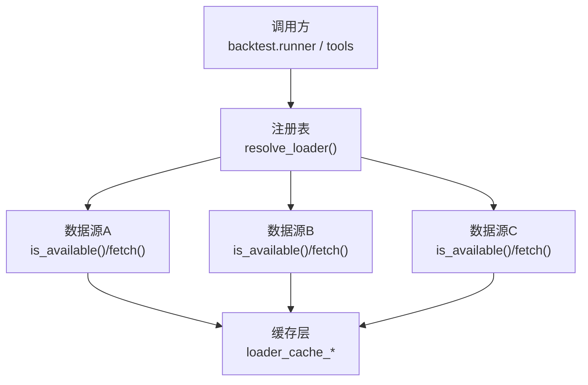
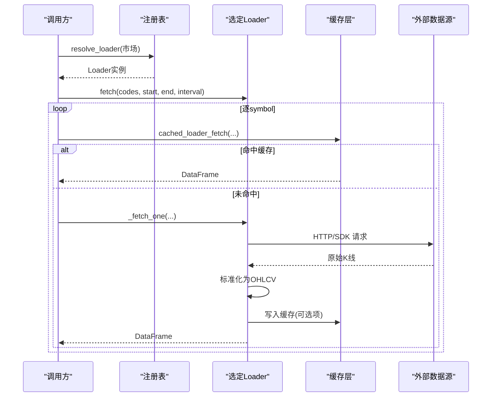
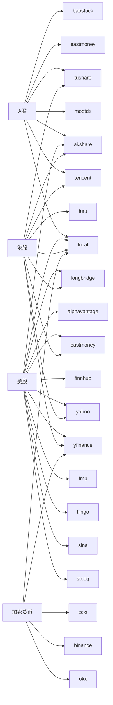

# 市场数据加载器

<cite>
**本文引用的文件**
- [base.py](file://agent/backtest/loaders/base.py)
- [registry.py](file://agent/backtest/loaders/registry.py)
- [yahoo_loader.py](file://agent/backtest/loaders/yahoo_loader.py)
- [yfinance_loader.py](file://agent/backtest/loaders/yfinance_loader.py)
- [tushare.py](file://agent/backtest/loaders/tushare.py)
- [ccxt_loader.py](file://agent/backtest/loaders/ccxt_loader.py)
- [binance_loader.py](file://agent/backtest/loaders/binance_loader.py)
- [eastmoney_loader.py](file://agent/backtest/loaders/eastmoney_loader.py)
- [futu.py](file://agent/backtest/loaders/futu.py)
- [local_loader.py](file://agent/backtest/loaders/local_loader.py)
- [sina_loader.py](file://agent/backtest/loaders/sina_loader.py)
- [tencent_loader.py](file://agent/backtest/loaders/tencent_loader.py)
- [mootdx_loader.py](file://agent/backtest/loaders/mootdx_loader.py)
- [okx.py](file://agent/backtest/loaders/okx.py)
</cite>

## 目录
1. [简介](#简介)
2. [项目结构](#项目结构)
3. [核心组件](#核心组件)
4. [架构总览](#架构总览)
5. [详细组件分析](#详细组件分析)
6. [依赖关系分析](#依赖关系分析)
7. [性能与优化](#性能与优化)
8. [故障排查指南](#故障排查指南)
9. [结论](#结论)
10. [附录：配置示例与最佳实践](#附录：配置示例与最佳实践)

## 简介
本文件面向“市场数据加载器”的使用与维护，覆盖主流数据源的认证配置、API 限制、数据范围支持、获取策略（批量下载、增量更新、重试机制）、数据格式标准化（OHLCV、时间戳、复权因子），以及常见问题解决方案。文档基于仓库中回测数据加载子系统实现，确保每个说明均可追溯到具体源码位置。

## 项目结构
- 统一接口与工具：所有数据源均遵循 DataLoaderProtocol，提供 is_available() 与 fetch(codes, start_date, end_date, interval, fields) 的约定。
- 注册与回退链：通过全局注册表按市场类型选择可用数据源，并内置跨源回退链。
- 各数据源实现：Yahoo、yfinance、Tushare、CCXT/Binance、OKX、东方财富、富途、本地文件、新浪、腾讯、Mootdx 等。

图表来源
- [registry.py:131-196](file://agent/backtest/loaders/registry.py#L131-L196)
- [base.py:243-441](file://agent/backtest/loaders/base.py#L243-L441)

章节来源
- [registry.py:1-256](file://agent/backtest/loaders/registry.py#L1-L256)
- [base.py:1-657](file://agent/backtest/loaders/base.py#L1-L657)

## 核心组件
- 统一协议与校验
  - DataLoaderProtocol：定义 name/markets/requires_auth/is_available/fetch。
  - 日期范围校验 validate_date_range()、OHLC 结构校验 validate_ohlc()。
- 重试与预算控制
  - retry_with_budget()：对声明的瞬态异常进行有限重试，受截止时间约束。
  - check_budget()：在分页循环中快速失败，避免长时间挂起。
- 可选本地缓存
  - loader_cache_get/put/cached_loader_fetch：以内容寻址键存储 parquet，仅对已结算区间生效。
- 注册表与回退链
  - VALID_SOURCES、FALLBACK_CHAINS：按市场类型组织优先顺序与自动回退。

章节来源
- [base.py:164-256](file://agent/backtest/loaders/base.py#L164-L256)
- [base.py:127-236](file://agent/backtest/loaders/base.py#L127-L236)
- [base.py:243-441](file://agent/backtest/loaders/base.py#L243-L441)
- [registry.py:23-158](file://agent/backtest/loaders/registry.py#L23-L158)

## 架构总览
下图展示从调用方到具体数据源的请求路径，包含缓存、重试、回退链与标准化输出。

图表来源
- [registry.py:614-649](file://agent/backtest/loaders/registry.py#L614-L649)
- [base.py:623-661](file://agent/backtest/loaders/base.py#L623-L661)
- [yahoo_loader.py:195-275](file://agent/backtest/loaders/yahoo_loader.py#L195-L275)
- [ccxt_loader.py:226-308](file://agent/backtest/loaders/ccxt_loader.py#L226-L308)

## 详细组件分析

### Yahoo Finance（直接HTTP）
- 认证：无需认证，使用共享节流客户端。
- 支持市场：美股、港股、印度、韩国、加拿大等后缀约定；也支持部分期货/外汇后缀。
- 时间粒度：日/周/月及分钟/小时级（内部映射）。
- 数据范围：按起止日期拉取，内部将结束日延后一天以满足闭区间。
- 标准化：将交易时间转为无时区 DatetimeIndex，日线归一化至午夜对齐。
- 缓存：使用通用缓存封装。

章节来源
- [yahoo_loader.py:1-275](file://agent/backtest/loaders/yahoo_loader.py#L1-L275)

### yfinance
- 认证：无需认证，免费公共数据。
- 支持市场：美股、港股、印度、韩国、加拿大、加密货币。
- 时间粒度：分钟/小时/日/周/月，含 4H 重采样处理。
- 数据范围：批量下载多标的，再按符号拆分。
- 标准化：列名映射、数值转换、去空、OHLC 校验、索引规范化。
- 缓存：按符号+区间缓存，命中则跳过网络。

章节来源
- [yfinance_loader.py:1-346](file://agent/backtest/loaders/yfinance_loader.py#L1-L346)

### Tushare（A股/港/期货/基金）
- 认证：需要 TUSHARE_TOKEN。
- 支持市场：A股、港股、期货、基金；分钟级需积分门槛。
- 时间粒度：日/分钟（1m/5m/15m/30m/1H）。
- API限制：每分钟/每天访问频率限制，采用指数退避重试。
- 数据范围：日频走 daily/fund_daily/index_daily/hk_daily；分钟走 stk_mins。
- 复权因子：尝试获取 adj_factor 并应用前复权；若不可用则丢弃该标的以防回测偏差。
- 基本面字段：可按字段合并 daily_basic 指标。

章节来源
- [tushare.py:1-386](file://agent/backtest/loaders/tushare.py#L1-L386)

### CCXT（加密货币，通用交易所）
- 认证：公开行情无需密钥；永续合约维护保证金层级需外部传入验证后的 artifact。
- 支持市场：crypto（通过 CCXT 支持的百余家交易所）。
- 时间粒度：分钟/小时/日/周/月。
- 数据范围：分页拉取，带预算与重试保护，防止长时挂起。
- 标准化：统一 OHLCV；永续合约额外拼接 mark price 与资金费率序列。
- 代理与超时：支持系统代理环境变量；可配置超时与单次抓取预算。

章节来源
- [ccxt_loader.py:1-502](file://agent/backtest/loaders/ccxt_loader.py#L1-L502)

### Binance（专用 CCXT 包装）
- 认证：无需密钥（公开行情）。
- 行为：固定使用 binance/binanceusdm，忽略全局 CCXT_EXCHANGE。
- 其他：复用 CCXT 的重试、预算、代理逻辑。

章节来源
- [binance_loader.py:1-45](file://agent/backtest/loaders/binance_loader.py#L1-L45)

### OKX（加密货币）
- 认证：无需认证。
- 支持市场：crypto。
- 时间粒度：分钟/小时/日。
- 数据范围：近期端点与历史端点双通道；深度历史优先历史端点。
- 标准化：UTC 时间戳转无时区索引，保留确认K线或回退未确认。
- 可用性探测：启动时短探活，失败则标记不可用。

章节来源
- [okx.py:1-373](file://agent/backtest/loaders/okx.py#L1-L373)

### 东方财富（A/港/美）
- 认证：无需认证，但受 IP 限速。
- 支持市场：A股、港股、美股。
- 时间粒度：按 KLT 映射（日/分钟/小时等）。
- 数据范围：按起止日期拉取，内部做日期格式化。
- 标准化：严格校验必要列，缺失即丢弃该标的。

章节来源
- [eastmoney_loader.py:1-183](file://agent/backtest/loaders/eastmoney_loader.py#L1-L183)

### 富途（A/港）
- 认证：需要本地 FutuOpenD 服务（主机/端口）。
- 支持市场：A股、港股。
- 时间粒度：分钟/小时/日/周/月。
- 数据范围：分页拉取，最大页大小限制。
- 标准化：统一 OHLCV，去重与排序。

章节来源
- [futu.py:1-253](file://agent/backtest/loaders/futu.py#L1-L253)

### 本地文件（CSV/Parquet/DuckDB）
- 认证：无需认证，读取用户配置文件。
- 支持市场：广泛（由配置决定）。
- 时间粒度：支持任意原生粒度，可按规则重采样到目标间隔。
- 数据范围：按起止日期过滤，含闭区间处理。
- 标准化：列映射、日期解析、数值转换、OHLC 校验、volume 缺省填充。

章节来源
- [local_loader.py:1-354](file://agent/backtest/loaders/local_loader.py#L1-L354)

### 新浪（美股日频）
- 认证：无需认证，JSONP 接口。
- 支持市场：美股日频。
- 时间粒度：仅日频。
- 数据范围：起止日期裁剪。
- 标准化：JSONP 剥离、列映射、数值转换、去空。

章节来源
- [sina_loader.py:1-201](file://agent/backtest/loaders/sina_loader.py#L1-L201)

### 腾讯（A/港）
- 认证：无需认证。
- 支持市场：A股、港股。
- 时间粒度：仅日频。
- 数据范围：起止日期裁剪。
- 标准化：数组行解析、列映射、数值转换、去空。

章节来源
- [tencent_loader.py:1-164](file://agent/backtest/loaders/tencent_loader.py#L1-L164)

### Mootdx（A股直连通达信）
- 认证：无需认证，TCP 直连，不受 HTTP 限速影响。
- 支持市场：A股（沪/深/京）。
- 时间粒度：分钟/小时/日/周/月。
- 数据范围：分页回溯，上限页数保护。
- 标准化：统一 OHLCV，闭区间裁剪。

章节来源
- [mootdx_loader.py:1-258](file://agent/backtest/loaders/mootdx_loader.py#L1-L258)

## 依赖关系分析
- 市场到数据源的回退链
  - A股：tencent → mootdx → eastmoney → baostock → akshare → tushare → local
  - 美股：yahoo → stooq → sina → eastmoney → yfinance → tiingo → fmp → finnhub → alphavantage → longbridge → akshare → local
  - 港股：tencent → eastmoney → yahoo → futu → akshare → yfinance → tushare → longbridge → local
  - 加密货币：okx → binance → ccxt → yfinance → local
  - 其他市场亦有各自链条（印度、韩国、加拿大、期货、基金、宏观、外汇）。

图表来源
- [registry.py:139-158](file://agent/backtest/loaders/registry.py#L139-L158)

章节来源
- [registry.py:131-196](file://agent/backtest/loaders/registry.py#L131-L196)

## 性能与优化
- 批量下载
  - yfinance 支持多标的批量下载，减少连接开销。
  - CCXT/OKX 分页拉取，限制每页大小与页数，避免无限循环。
- 增量更新
  - 缓存层仅在“已结算区间”写入/读取，避免缓存未完成日的数据。
  - 本地文件支持重采样，便于将高频源降采样到目标间隔。
- 重试与预算
  - 通用 retry_with_budget 对瞬态错误重试，受截止时间约束。
  - 特定源自定义重试：Tushare 针对配额拒绝的退避；OKX 对 429/5xx 重试。
- 代理与超时
  - CCXT/OKX 支持系统代理环境变量；可配置超时与抓取预算，避免长时阻塞。
- 数据质量
  - 统一 validate_ohlc 剔除非法OHLC，保证下游回测稳定性。
  - 时间戳统一为无时区 DatetimeIndex，日线归一至午夜对齐，便于跨源合并。

章节来源
- [base.py:127-236](file://agent/backtest/loaders/base.py#L127-L236)
- [base.py:243-441](file://agent/backtest/loaders/base.py#L243-L441)
- [ccxt_loader.py:226-308](file://agent/backtest/loaders/ccxt_loader.py#L226-L308)
- [okx.py:109-125](file://agent/backtest/loaders/okx.py#L109-L125)
- [tushare.py:51-79](file://agent/backtest/loaders/tushare.py#L51-L79)

## 故障排查指南
- 网络超时/限流
  - 现象：请求卡住或返回 429/5xx。
  - 处理：启用代理环境变量；调整 CCXT_TIMEOUT_MS/OKX_TIMEOUT_S；降低并发或增大预算。
  - 参考：[ccxt_loader.py:203-224](file://agent/backtest/loaders/ccxt_loader.py#L203-L224)、[okx.py:67-98](file://agent/backtest/loaders/okx.py#L67-L98)
- 数据缺失
  - 现象：返回空DataFrame或某些标的缺失。
  - 处理：检查 symbol 是否被当前加载器支持；查看日志中的“unsupported interval”或“no data”提示；必要时切换回退链中的另一源。
  - 参考：[eastmoney_loader.py:133-149](file://agent/backtest/loaders/eastmoney_loader.py#L133-L149)、[sina_loader.py:161-163](file://agent/backtest/loaders/sina_loader.py#L161-L163)
- 格式异常
  - 现象：OHLC 不合法（如 high < low）或数值非数字。
  - 处理：validate_ohlc 会丢弃非法行；检查上游数据质量；必要时在本地预处理。
  - 参考：[base.py:187-256](file://agent/backtest/loaders/base.py#L187-L256)
- 复权问题
  - 现象：除权日出现价格跳空导致收益计算异常。
  - 处理：Tushare 在无法获取复权因子时会丢弃标的；确保使用具备复权因子的数据源或自行校正。
  - 参考：[tushare.py:253-268](file://agent/backtest/loaders/tushare.py#L253-L268)
- 本地文件重采样
  - 现象：请求更细粒度但源数据不足。
  - 处理：本地加载器会警告并返回原粒度；需补充更高频数据或调整请求间隔。
  - 参考：[local_loader.py:88-131](file://agent/backtest/loaders/local_loader.py#L88-L131)

章节来源
- [base.py:187-256](file://agent/backtest/loaders/base.py#L187-L256)
- [tushare.py:253-268](file://agent/backtest/loaders/tushare.py#L253-L268)
- [local_loader.py:88-131](file://agent/backtest/loaders/local_loader.py#L88-L131)
- [okx.py:109-125](file://agent/backtest/loaders/okx.py#L109-L125)
- [ccxt_loader.py:203-224](file://agent/backtest/loaders/ccxt_loader.py#L203-L224)

## 结论
本加载器体系通过统一协议、注册回退链、缓存与重试机制，提供了稳定、可扩展的市场数据接入能力。不同数据源在认证、限制、粒度与数据质量上各有特点，建议根据市场与场景选择合适的源，并结合缓存与重试策略提升鲁棒性。对于关键回测任务，优先选用具备复权因子与高质量清洗流程的数据源，并在本地做好数据校验与重采样。

## 附录：配置示例与最佳实践

- 环境变量与认证
  - Tushare：设置 TUSHARE_TOKEN。
  - CCXT：可通过 CCXT_EXCHANGE 指定交易所；支持 ALL_PROXY/HTTP_PROXY/HTTPS_PROXY。
  - OKX：可配置 OKX_TIMEOUT_S、OKX_FETCH_BUDGET_S、OKX_PROBE_TIMEOUT_S。
  - 参考：[tushare.py:133-146](file://agent/backtest/loaders/tushare.py#L133-L146)、[ccxt_loader.py:203-224](file://agent/backtest/loaders/ccxt_loader.py#L203-L224)、[okx.py:67-98](file://agent/backtest/loaders/okx.py#L67-L98)

- 本地数据桥配置（CSV/Parquet/DuckDB）
  - 配置文件路径：~/.vibe-trading/data-bridge/config.yaml
  - 字段映射：date/open/high/low/close/volume，可自定义列名与日期格式。
  - DuckDB：支持 db_path 与 query 查询。
  - 参考：[local_loader.py:1-30](file://agent/backtest/loaders/local_loader.py#L1-L30)、[local_loader.py:129-216](file://agent/backtest/loaders/local_loader.py#L129-L216)

- 数据获取策略建议
  - 优先使用回退链中更稳定的源（如 A股优先 tencent/mootdx/eastmoney）。
  - 对高频数据使用分页与预算控制，避免长时阻塞。
  - 开启本地缓存以减少重复请求；注意仅对已结算区间缓存。
  - 对分钟级数据，关注源的限制与配额（如 Tushare 分钟接口需积分）。

- 数据格式标准化要点
  - 统一列名：open/high/low/close/volume。
  - 时间戳：无时区 DatetimeIndex；日线归一至午夜。
  - 复权：优先使用前复权数据；缺失复权因子时谨慎处理。
  - 校验：通过 validate_ohlc 剔除非法行，保障下游指标稳定。

- 常见最佳实践
  - 明确 interval 与数据源支持范围，避免静默降级。
  - 对关键标的准备多源冗余，结合回退链提高可用性。
  - 监控日志中的警告与错误，及时定位网络、配额与数据质量问题。

章节来源
- [local_loader.py:1-354](file://agent/backtest/loaders/local_loader.py#L1-L354)
- [tushare.py:133-146](file://agent/backtest/loaders/tushare.py#L133-L146)
- [ccxt_loader.py:203-224](file://agent/backtest/loaders/ccxt_loader.py#L203-L224)
- [okx.py:67-98](file://agent/backtest/loaders/okx.py#L67-L98)
- [base.py:187-256](file://agent/backtest/loaders/base.py#L187-L256)