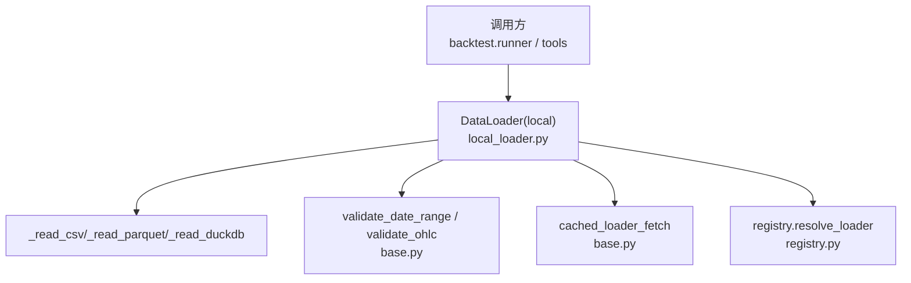
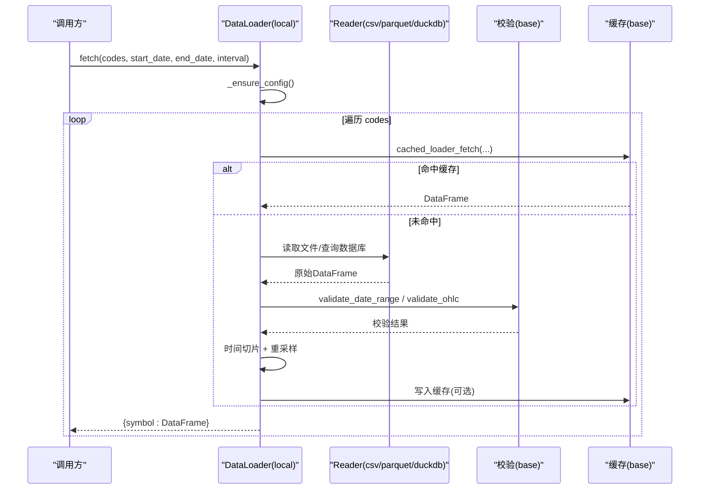
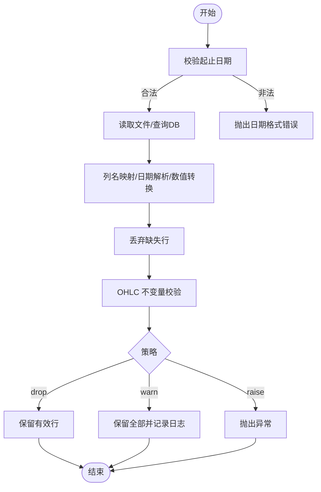
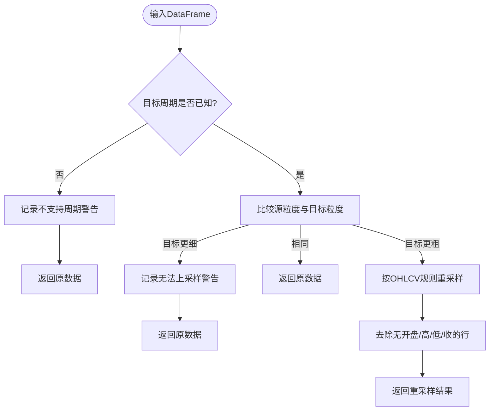
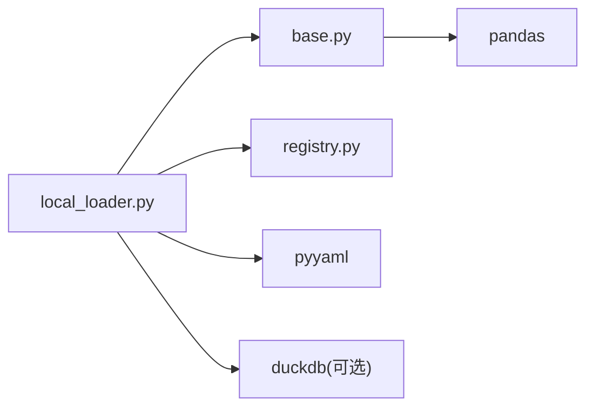

# 本地文件数据加载器

<cite>
**本文引用的文件**
- [agent/backtest/loaders/local_loader.py](file://agent/backtest/loaders/local_loader.py)
- [agent/backtest/loaders/base.py](file://agent/backtest/loaders/base.py)
- [agent/backtest/loaders/registry.py](file://agent/backtest/loaders/registry.py)
- [agent/tests/test_local_loader.py](file://agent/tests/test_local_loader.py)
- [agent/src/tools/trade_journal_parsers.py](file://agent/src/tools/trade_journal_parsers.py)
</cite>

## 目录
1. [简介](#简介)
2. [项目结构](#项目结构)
3. [核心组件](#核心组件)
4. [架构总览](#架构总览)
5. [详细组件分析](#详细组件分析)
6. [依赖关系分析](#依赖关系分析)
7. [性能与批量处理](#性能与批量处理)
8. [故障排查指南](#故障排查指南)
9. [结论](#结论)
10. [附录：配置示例与最佳实践](#附录配置示例与最佳实践)

## 简介
本使用文档面向“本地文件数据加载器”，说明如何从本地 CSV、Parquet、DuckDB 文件中加载 OHLCV 行情数据，并统一为系统内部标准格式。文档覆盖：
- 支持的文件格式与字段规范（OHLCV、时间戳、编码）
- 数据验证机制（完整性、异常值、格式校验）
- 批量处理能力（多标的、分块读取、内存优化、并行策略）
- 完整配置示例（路径、字段映射、清洗规则）
- 常见问题解决方案（文件格式错误、缺失值、编码问题等）
- 与外部数据源的集成方式（导入导出、格式转换）

## 项目结构
本地加载器位于 backtest.loaders 模块中，采用“注册表 + 协议”的扩展设计：
- local_loader.py：实现 CSV/Parquet/DuckDB 的本地数据加载、列名归一化、时间范围过滤、K线周期重采样
- base.py：提供通用校验（日期范围、OHLC 不变量）、可选的本地缓存读写、重试预算工具
- registry.py：维护数据源注册表与回退链，确保“local”作为显式请求时不被静默降级到网络源
- tests/test_local_loader.py：覆盖 CSV/Parquet/DuckDB 的基本行为、重采样、时区与夏令时处理

图表来源
- [agent/backtest/loaders/local_loader.py:271-405](file://agent/backtest/loaders/local_loader.py#L271-L405)
- [agent/backtest/loaders/base.py:168-256](file://agent/backtest/loaders/base.py#L168-L256)
- [agent/backtest/loaders/base.py:623-661](file://agent/backtest/loaders/base.py#L623-L661)
- [agent/backtest/loaders/registry.py:614-649](file://agent/backtest/loaders/registry.py#L614-L649)

章节来源
- [agent/backtest/loaders/local_loader.py:1-354](file://agent/backtest/loaders/local_loader.py#L1-L354)
- [agent/backtest/loaders/base.py:1-657](file://agent/backtest/loaders/base.py#L1-L657)
- [agent/backtest/loaders/registry.py:1-256](file://agent/backtest/loaders/registry.py#L1-L256)
- [agent/tests/test_local_loader.py:1-298](file://agent/tests/test_local_loader.py#L1-L298)

## 核心组件
- DataLoader（local）：基于 YAML 配置的本地数据加载器，支持 CSV、Parquet、DuckDB；负责列映射、时间解析、区间过滤、K线周期重采样
- 校验工具：
  - validate_date_range：校验起止日期合法性
  - validate_ohlc：校验 OHLC 不变量（如 high >= low、价格非负或允许负价策略）
- 缓存层：可选的本地 Parquet 缓存，避免重复读取与计算
- 注册表：统一管理数据源，保证“local”在显式请求时不被静默替换为网络源

章节来源
- [agent/backtest/loaders/local_loader.py:271-405](file://agent/backtest/loaders/local_loader.py#L271-L405)
- [agent/backtest/loaders/base.py:168-256](file://agent/backtest/loaders/base.py#L168-L256)
- [agent/backtest/loaders/base.py:623-661](file://agent/backtest/loaders/base.py#L623-L661)
- [agent/backtest/loaders/registry.py:119-196](file://agent/backtest/loaders/registry.py#L119-L196)

## 架构总览
本地加载器的数据流如下：
- 读取 YAML 配置，按 symbol 建立 source 映射
- 根据 type 选择对应 reader（CSV/Parquet/DuckDB）
- 列名归一化、日期解析、数值类型转换、NaN 清理
- 调用 validate_ohlc 进行结构性与数值性校验
- 按 start_date/end_date 做时间切片
- 对 K 线周期进行重采样（降采样聚合，升采样告警并返回原粒度）
- 通过 cached_loader_fetch 走可选缓存流程

图表来源
- [agent/backtest/loaders/local_loader.py:301-405](file://agent/backtest/loaders/local_loader.py#L301-L405)
- [agent/backtest/loaders/base.py:623-661](file://agent/backtest/loaders/base.py#L623-L661)
- [agent/backtest/loaders/base.py:168-256](file://agent/backtest/loaders/base.py#L168-L256)

## 详细组件分析

### 支持的格式与字段规范
- 支持格式
  - CSV：使用 pandas.read_csv 读取；测试用例显示 UTF-8 编码；其他工具模块也演示了 UTF-16、GBK、GB2312 等多编码兼容能力
  - Parquet：使用 pandas.read_parquet 读取；若索引为 DatetimeIndex，会重置为列以便统一处理
  - DuckDB：只读连接执行 SQL 查询，将结果转为 DataFrame
- 必需字段（OHLCV）
  - open、high、low、close 为必填；volume 可选，缺失时填充为 0.0
  - 日期列默认名为 date，可通过 columns 映射自定义列名
- 时间戳格式
  - 支持指定 date_format；否则自动解析
  - 解析时先以 UTC 解析，再转换为无时区的本地索引，从而正确处理跨时区与夏令时偏移
- 编码要求
  - CSV 推荐 UTF-8；项目内其他工具展示了 UTF-16、GBK、GB2312 的容错读取策略，便于兼容不同导出环境

章节来源
- [agent/backtest/loaders/local_loader.py:136-200](file://agent/backtest/loaders/local_loader.py#L136-L200)
- [agent/backtest/loaders/local_loader.py:254-268](file://agent/backtest/loaders/local_loader.py#L254-L268)
- [agent/tests/test_local_loader.py:208-298](file://agent/tests/test_local_loader.py#L208-L298)
- [agent/src/tools/trade_journal_parsers.py:130-157](file://agent/src/tools/trade_journal_parsers.py#L130-L157)

### 数据验证机制
- 日期范围校验：start_date <= end_date，非法格式抛出 ValueError
- OHLC 不变量校验：
  - 结构性：high < low、high/low 无法包围 open/close 等
  - 数值性：默认拒绝非正价格；可配置允许负价但拒绝零价
  - 策略：drop（默认删除无效行）、warn（记录日志保留）、raise（直接抛错）
- 缺失值处理：
  - 日期解析失败或 OHLC 缺失的行会被丢弃
  - volume 缺失时填充为 0.0

图表来源
- [agent/backtest/loaders/base.py:168-256](file://agent/backtest/loaders/base.py#L168-L256)
- [agent/backtest/loaders/local_loader.py:141-189](file://agent/backtest/loaders/local_loader.py#L141-L189)

章节来源
- [agent/backtest/loaders/base.py:168-256](file://agent/backtest/loaders/base.py#L168-L256)
- [agent/backtest/loaders/local_loader.py:141-189](file://agent/backtest/loaders/local_loader.py#L141-L189)

### 批量数据处理能力
- 多标的批量：fetch 接受 codes 列表，逐个 symbol 拉取并合并结果；单个 symbol 失败不会中断整体批次
- 大文件分块读取：
  - CSV/Parquet 由 pandas 负责 I/O；对于超大文件，建议预先切分为多个分区文件或按时间分段存储，配合多次 fetch 分批处理
  - DuckDB 可通过 SQL 条件筛选减少返回数据量
- 内存优化：
  - 仅保留必要列（open/high/low/close/volume），其余列在归一化阶段丢弃
  - 可选的本地 Parquet 缓存避免重复读取与计算
- 并行处理：
  - 当前 loader 本身为串行循环；可在调用侧对 codes 进行并行调度（例如进程池/线程池），每个进程独立实例化 DataLoader 并设置不同的时间窗口或标的子集

章节来源
- [agent/backtest/loaders/local_loader.py:301-405](file://agent/backtest/loaders/local_loader.py#L301-L405)
- [agent/backtest/loaders/base.py:623-661](file://agent/backtest/loaders/base.py#L623-L661)

### 重采样与周期对齐
- 支持将高频数据降采样至更粗周期（如 1H -> 4H），按 OHLCV 语义聚合（open 首值、high 最大值、low 最小值、close 末值、volume 求和）
- 无法向上采样（如日频 -> 4H）时会记录警告并返回原粒度数据
- 不支持的周期会记录警告并返回原数据

图表来源
- [agent/backtest/loaders/local_loader.py:88-131](file://agent/backtest/loaders/local_loader.py#L88-L131)

章节来源
- [agent/backtest/loaders/local_loader.py:88-131](file://agent/backtest/loaders/local_loader.py#L88-L131)

### 与外部数据源的集成
- 数据导入：
  - 将外部系统的导出文件（CSV/Excel/Parquet）转换为本地加载器期望的列名与时间格式，写入 ~/.vibe-trading/data-bridge/config.yaml
  - Excel 导出常见日期序列号问题，建议在导出前转换为字符串日期或使用工具脚本标准化
- 数据导出：
  - 可将加载后的 DataFrame 导出为 Parquet（高效压缩与快速读取）或 CSV（便于人工检查）
  - 利用 DuckDB 进行复杂筛选与聚合后输出为 Parquet/CSV
- 格式转换工具：
  - 项目中其他工具已展示对多种编码的兼容读取（UTF-8/UTF-16/GBK/GB2312），可用于预处理不同来源的 CSV

章节来源
- [agent/backtest/loaders/local_loader.py:1-30](file://agent/backtest/loaders/local_loader.py#L1-L30)
- [agent/src/tools/trade_journal_parsers.py:130-157](file://agent/src/tools/trade_journal_parsers.py#L130-L157)

## 依赖关系分析
- 组件耦合
  - local_loader 依赖 base 的校验与缓存能力，依赖 registry 的注册与回退策略
  - base 提供通用能力，被多个 loader 复用
  - registry 集中管理所有 loader，确保“local”在显式请求时不被静默替换
- 外部依赖
  - pandas：数据读取与处理
  - pyyaml：YAML 配置解析
  - duckdb：可选，用于 DuckDB 数据源与缓存读写

图表来源
- [agent/backtest/loaders/local_loader.py:34-42](file://agent/backtest/loaders/local_loader.py#L34-L42)
- [agent/backtest/loaders/base.py:23-25](file://agent/backtest/loaders/base.py#L23-L25)
- [agent/backtest/loaders/registry.py:12-17](file://agent/backtest/loaders/registry.py#L12-L17)

章节来源
- [agent/backtest/loaders/local_loader.py:34-42](file://agent/backtest/loaders/local_loader.py#L34-L42)
- [agent/backtest/loaders/base.py:23-25](file://agent/backtest/loaders/base.py#L23-L25)
- [agent/backtest/loaders/registry.py:12-17](file://agent/backtest/loaders/registry.py#L12-L17)

## 性能与批量处理
- 内存优化
  - 仅保留 OHLCV 列，减少内存占用
  - 使用 Parquet 缓存（可选）避免重复读取与计算
- 批量策略
  - 对 codes 列表进行分批处理，每批控制标的数量与时间跨度，避免单次过大
  - 对超大文件建议按时间或标的拆分，配合多次 fetch
- 并发建议
  - 在调用侧并行调度多个 DataLoader 实例，每个实例处理独立的标的子集或时间窗口
  - 注意共享资源竞争（如磁盘 IO、缓存目录）

[本节为通用指导，不直接分析具体文件]

## 故障排查指南
- 文件格式错误
  - CSV 编码不匹配：尝试 UTF-8/UTF-16/GBK/GB2312；参考工具模块的多编码读取策略
  - Excel 日期序列号：导出前转换为字符串日期或使用脚本标准化
- 数据缺失
  - 缺少 OHLC 列：检查 columns 映射是否正确
  - 日期列缺失或解析失败：确认 date_format 与实际格式一致
  - 价格 NaN：会被丢弃；检查原始数据质量
- 编码问题
  - 使用 UTF-8 保存 CSV；如需兼容旧系统，可使用 UTF-16 并添加 BOM
- 重采样告警
  - 请求比源数据更细的周期会记录“无法上采样”警告并返回原数据
  - 不支持的周期会记录警告并返回原数据
- 缓存相关
  - 缓存读写失败不影响主流程，但会导致重复读取；检查缓存目录权限与磁盘空间

章节来源
- [agent/backtest/loaders/local_loader.py:88-131](file://agent/backtest/loaders/local_loader.py#L88-L131)
- [agent/backtest/loaders/local_loader.py:141-189](file://agent/backtest/loaders/local_loader.py#L141-L189)
- [agent/backtest/loaders/base.py:168-256](file://agent/backtest/loaders/base.py#L168-L256)
- [agent/src/tools/trade_journal_parsers.py:130-157](file://agent/src/tools/trade_journal_parsers.py#L130-L157)

## 结论
本地文件数据加载器提供了稳定、可扩展的本地 OHLCV 数据接入能力，支持 CSV、Parquet、DuckDB 三种格式，具备严格的 OHLC 校验、灵活的列映射与时间解析、以及可选的本地缓存。通过合理的批量与并发策略，可有效处理大规模数据。结合外部工具的编码兼容与格式转换能力，能够无缝对接多种数据源。

[本节为总结，不直接分析具体文件]

## 附录：配置示例与最佳实践

- 配置文件位置
  - ~/.vibe-trading/data-bridge/config.yaml
- 基本结构
  - sources：数组，每项定义一个 symbol 的数据源
  - 字段：
    - symbol：交易标的标识
    - type：csv / parquet / duckdb
    - path：文件路径（CSV/Parquet）
    - db_path / query：DuckDB 数据库路径与 SQL 查询
    - columns：列名映射（date/open/high/low/close/volume）
    - date_format：日期格式（可选）
- 示例片段（示意）
  - CSV 示例：
    - symbol: "AAPL.US"
    - type: csv
    - path: "~/data/aapl_2024.csv"
    - columns:
      - date: "Date"
      - open: "Open"
      - high: "High"
      - low: "Low"
      - close: "Close"
      - volume: "Volume"
    - date_format: "%Y-%m-%d"
  - Parquet 示例：
    - symbol: "BTC-USDT"
    - type: parquet
    - path: "~/data/btc.parquet"
  - DuckDB 示例：
    - symbol: "MYINDEX"
    - type: duckdb
    - db_path: "~/data/market.duckdb"
    - query: "SELECT * FROM prices WHERE ticker = 'MYINDEX'"
- 最佳实践
  - 统一列名与时间格式，减少映射复杂度
  - 对大文件按时间或标的拆分，提升加载效率
  - 启用本地缓存以减少重复读取
  - 对 CSV 使用 UTF-8 编码；必要时使用 UTF-16 并带 BOM
  - 在业务层对 codes 进行分批与并发调度，避免单批过大

章节来源
- [agent/backtest/loaders/local_loader.py:1-30](file://agent/backtest/loaders/local_loader.py#L1-L30)
- [agent/backtest/loaders/local_loader.py:51-61](file://agent/backtest/loaders/local_loader.py#L51-L61)
- [agent/backtest/loaders/local_loader.py:271-299](file://agent/backtest/loaders/local_loader.py#L271-L299)
- [agent/tests/test_local_loader.py:15-62](file://agent/tests/test_local_loader.py#L15-L62)