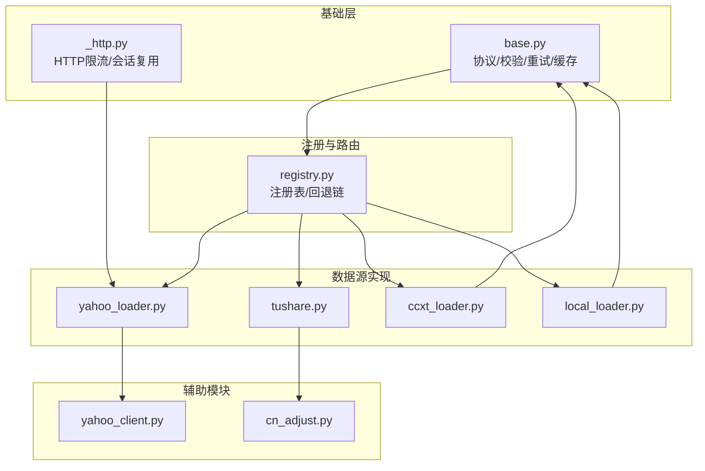
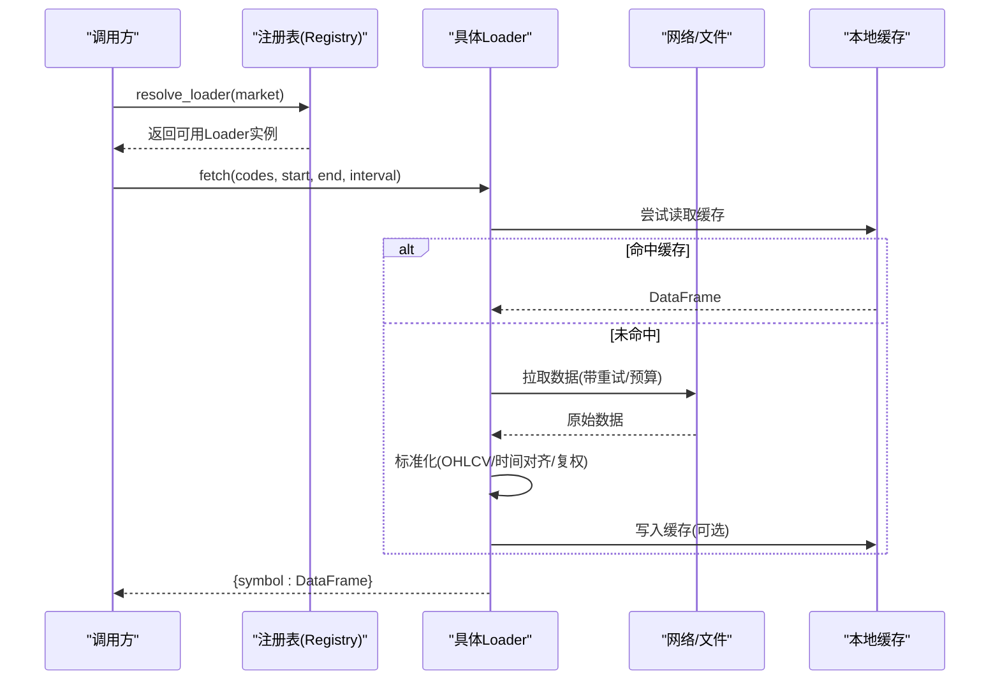
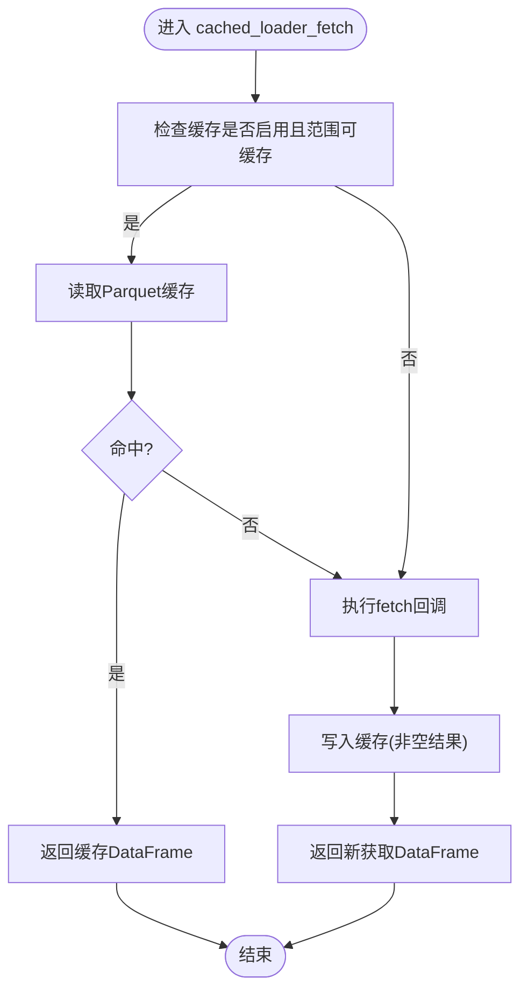
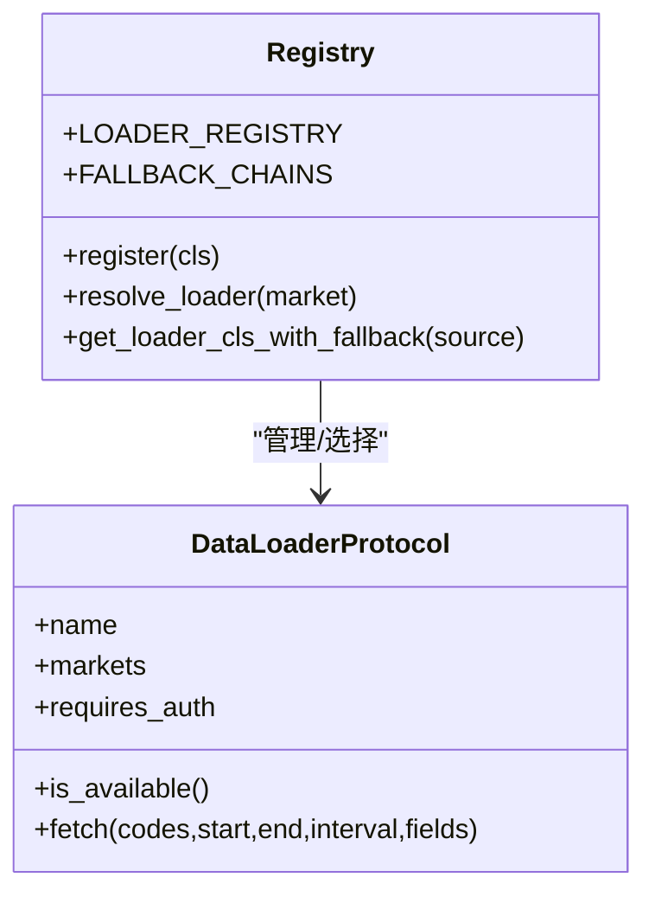
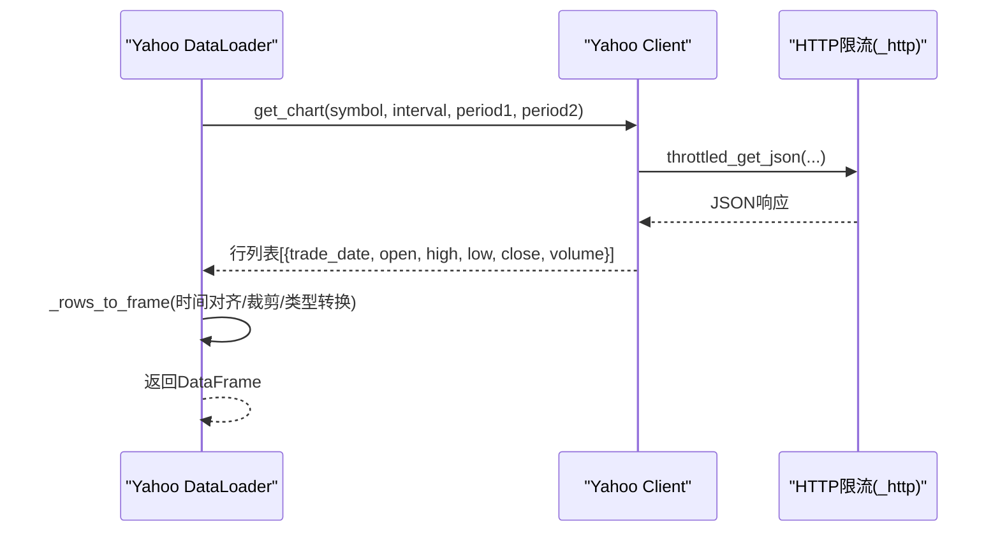
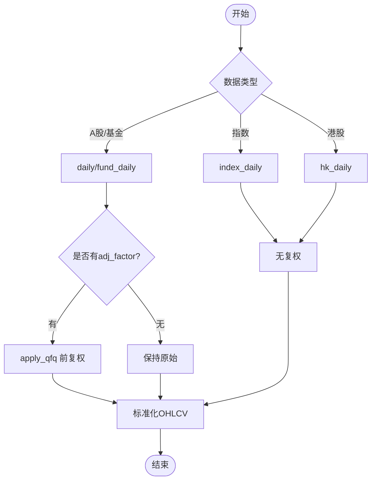
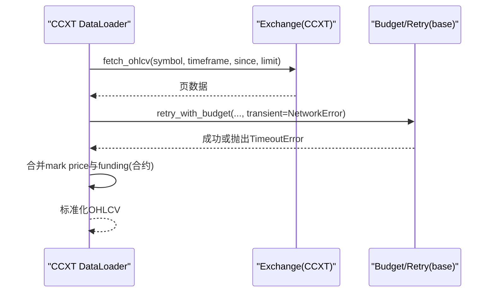
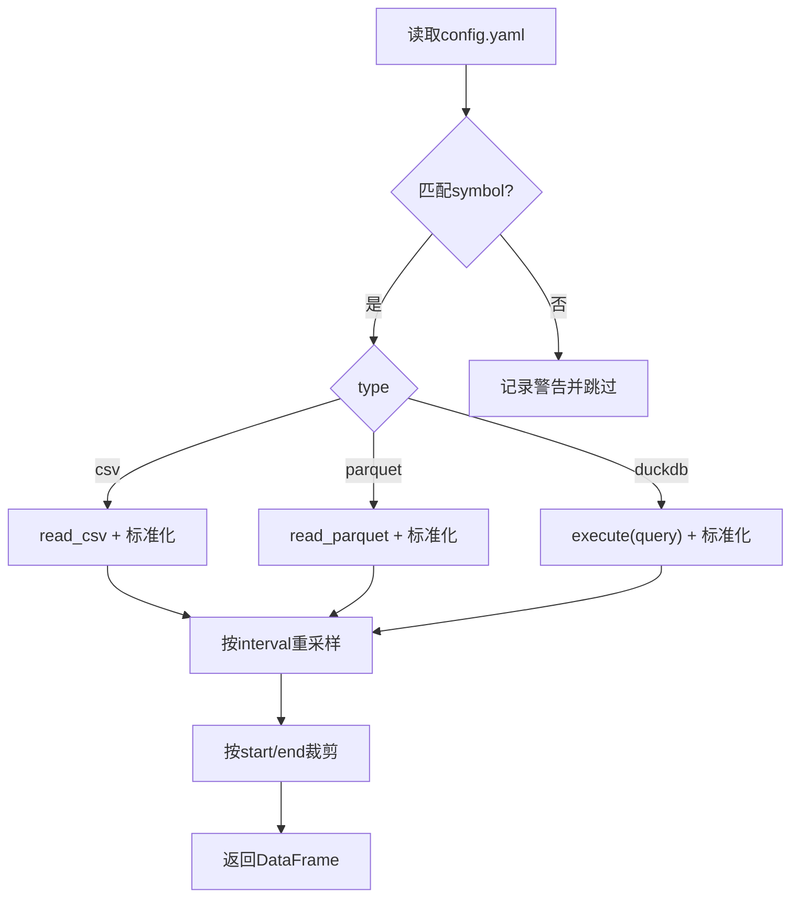
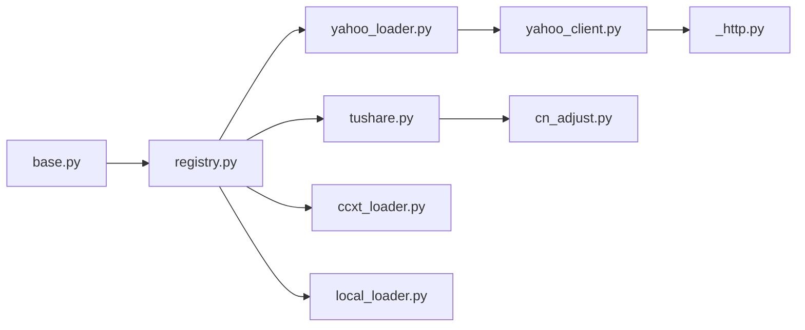

# 数据加载器

<cite>
**本文引用的文件**
- [base.py](file://agent/backtest/loaders/base.py)
- [registry.py](file://agent/backtest/loaders/registry.py)
- [yahoo_loader.py](file://agent/backtest/loaders/yahoo_loader.py)
- [tushare.py](file://agent/backtest/loaders/tushare.py)
- [ccxt_loader.py](file://agent/backtest/loaders/ccxt_loader.py)
- [local_loader.py](file://agent/backtest/loaders/local_loader.py)
- [yahoo_client.py](file://agent/backtest/loaders/yahoo_client.py)
- [cn_adjust.py](file://agent/backtest/loaders/cn_adjust.py)
- [_http.py](file://agent/backtest/loaders/_http.py)
</cite>

## 目录
1. [简介](#简介)
2. [项目结构](#项目结构)
3. [核心组件](#核心组件)
4. [架构总览](#架构总览)
5. [详细组件分析](#详细组件分析)
6. [依赖关系分析](#依赖关系分析)
7. [性能与缓存](#性能与缓存)
8. [故障排查指南](#故障排查指南)
9. [结论](#结论)
10. [附录：使用示例与最佳实践](#附录使用示例与最佳实践)

## 简介
本技术文档面向“数据加载器系统”，系统性说明其架构设计、统一接口、适配器模式实现、多数据源支持（Yahoo Finance、Tushare、CCXT、本地文件等）、数据标准化处理（时间序列对齐、复权、缺失值处理）、缓存机制与性能优化策略，以及自定义数据加载器的开发指南与实际使用示例。目标是帮助读者在不深入源码的情况下也能理解并扩展该系统。

## 项目结构
数据加载器位于 backtest/loaders 目录下，采用“协议 + 注册表 + 多实现”的分层组织方式：
- 基础协议与工具：定义 DataLoaderProtocol、校验、重试、预算控制、本地缓存等通用能力
- 注册中心：集中管理所有已注册的 Loader，并提供按市场类型的回退链选择
- 具体数据源实现：Yahoo、Tushare、CCXT、Local 等各自封装外部 API/文件读取逻辑，并输出统一的 OHLCV DataFrame
- 共享客户端与网络层：Yahoo 专用客户端、HTTP 限流与连接复用等

**图表来源**
- [base.py:1-657](file://agent/backtest/loaders/base.py#L1-L657)
- [registry.py:1-256](file://agent/backtest/loaders/registry.py#L1-L256)
- [yahoo_loader.py:1-275](file://agent/backtest/loaders/yahoo_loader.py#L1-L275)
- [tushare.py:1-386](file://agent/backtest/loaders/tushare.py#L1-L386)
- [ccxt_loader.py:1-502](file://agent/backtest/loaders/ccxt_loader.py#L1-L502)
- [local_loader.py:1-354](file://agent/backtest/loaders/local_loader.py#L1-L354)
- [yahoo_client.py:1-419](file://agent/backtest/loaders/yahoo_client.py#L1-L419)
- [cn_adjust.py:1-78](file://agent/backtest/loaders/cn_adjust.py#L1-L78)
- [_http.py:1-201](file://agent/backtest/loaders/_http.py#L1-L201)

**章节来源**
- [registry.py:1-256](file://agent/backtest/loaders/registry.py#L1-L256)
- [base.py:1-657](file://agent/backtest/loaders/base.py#L1-L657)

## 核心组件
- 数据加载器协议：统一接口 DataLoaderProtocol，要求 name、markets、requires_auth、is_available()、fetch(codes, start_date, end_date, interval, fields)
- 注册表与回退链：LOADER_REGISTRY 保存所有 Loader；FALLBACK_CHAINS 定义各市场的优先级顺序；resolve_loader/get_loader_cls_with_fallback 负责自动选择可用实现
- 数据标准化：validate_ohlc 校验 OHLC 不变量；各 Loader 将不同来源的原始数据转换为统一的 trade_date 索引与 open/high/low/close/volume 列
- 重试与预算：retry_with_budget/check_budget 提供带超时和指数退避的重试，避免外部 API 抖动导致长时间挂起
- 本地缓存：loader_cache_* 系列函数基于内容寻址键（source/symbol/timeframe/date range/fields）持久化 Parquet，减少重复请求

**章节来源**
- [base.py:164-256](file://agent/backtest/loaders/base.py#L164-L256)
- [base.py:377-450](file://agent/backtest/loaders/base.py#L377-L450)
- [base.py:243-442](file://agent/backtest/loaders/base.py#L243-L442)
- [registry.py:23-158](file://agent/backtest/loaders/registry.py#L23-L158)
- [registry.py:161-256](file://agent/backtest/loaders/registry.py#L161-L256)

## 架构总览
数据加载器通过“协议 + 注册表 + 多实现”解耦上层调用与底层数据源差异。上层只需指定 market/source，由注册表根据回退链选择可用的 Loader；每个 Loader 内部完成数据获取、清洗、标准化，并通过统一缓存与重试机制提升鲁棒性。

**图表来源**
- [registry.py:614-649](file://agent/backtest/loaders/registry.py#L614-L649)
- [base.py:623-661](file://agent/backtest/loaders/base.py#L623-L661)
- [yahoo_loader.py:195-242](file://agent/backtest/loaders/yahoo_loader.py#L195-L242)
- [tushare.py:148-211](file://agent/backtest/loaders/tushare.py#L148-L211)
- [ccxt_loader.py:226-308](file://agent/backtest/loaders/ccxt_loader.py#L226-L308)
- [local_loader.py:301-347](file://agent/backtest/loaders/local_loader.py#L301-L347)

## 详细组件分析

### 基础协议与工具（base.py）
- 协议定义：DataLoaderProtocol 规定 name/markets/requires_auth/is_available/fetch 契约，确保所有 Loader 行为一致
- 数据校验：validate_ohlc 强制 OHLC 不变量（如 high>=low、价格非负或允许负价场景），保证下游回测稳定性
- 重试与预算：retry_with_budget 对声明的瞬态异常进行有限次重试，结合 check_budget 在截止时间前快速失败，避免长时阻塞
- 本地缓存：loader_cache_get/put/cached_loader_fetch 提供基于内容哈希的 Parquet 缓存，仅对已结算日期范围生效，读写失败不中断主流程

**图表来源**
- [base.py:623-661](file://agent/backtest/loaders/base.py#L623-L661)
- [base.py:565-620](file://agent/backtest/loaders/base.py#L565-L620)

**章节来源**
- [base.py:164-256](file://agent/backtest/loaders/base.py#L164-L256)
- [base.py:377-450](file://agent/backtest/loaders/base.py#L377-L450)
- [base.py:243-442](file://agent/backtest/loaders/base.py#L243-L442)

### 注册表与回退链（registry.py）
- 全局注册：@register 装饰器将 Loader 类加入 LOADER_REGISTRY
- 自动发现：_ensure_registered 懒加载所有已知 Loader 模块，确保调用时注册表非空
- 回退链：FALLBACK_CHAINS 为每个市场定义优先顺序（考虑 IP 封禁风险、数据质量、认证成本）
- 解析器：resolve_loader 遍历回退链，返回首个 is_available() 为真的 Loader；get_loader_cls_with_fallback 支持按 source 名称解析并回退到同市场其他源

**图表来源**
- [registry.py:23-158](file://agent/backtest/loaders/registry.py#L23-L158)
- [registry.py:161-256](file://agent/backtest/loaders/registry.py#L161-L256)
- [base.py:851-887](file://agent/backtest/loaders/base.py#L851-L887)

**章节来源**
- [registry.py:1-256](file://agent/backtest/loaders/registry.py#L1-L256)

### Yahoo Finance 加载器（yahoo_loader.py + yahoo_client.py）
- 适配 Yahoo 公开 v8 chart 端点，无需认证；支持 US/HK/印度/韩国/加拿大股票及期货/外汇后缀约定
- 时间对齐：日线及以上归一化为午夜索引，分钟/小时保留真实时间戳，确保与其他 Loader 对齐
- 符号映射：map_symbol 将项目符号转为 Yahoo 格式（如 AAPL.US -> AAPL，00700.HK -> 0700.HK）
- 客户端：yahoo_client 封装 HTTP 限流、Cookie/Crumb 握手、错误处理与 JSON 解析

**图表来源**
- [yahoo_loader.py:139-188](file://agent/backtest/loaders/yahoo_loader.py#L139-L188)
- [yahoo_loader.py:195-275](file://agent/backtest/loaders/yahoo_loader.py#L195-L275)
- [yahoo_client.py:156-205](file://agent/backtest/loaders/yahoo_client.py#L156-L205)
- [_http.py:141-201](file://agent/backtest/loaders/_http.py#L141-L201)

**章节来源**
- [yahoo_loader.py:1-275](file://agent/backtest/loaders/yahoo_loader.py#L1-L275)
- [yahoo_client.py:1-419](file://agent/backtest/loaders/yahoo_client.py#L1-L419)

### Tushare 加载器（tushare.py + cn_adjust.py）
- 支持 A 股、港股、期货、基金；日频与分钟频（1m/5m/15m/30m/1H）
- 配额保护：识别 Tushare 频率限制关键字，指数退避等待
- 复权处理：对 A 股/基金使用 apply_qfq 进行前复权，避免除权缺口污染收益计算
- 基本面字段：可按需合并 daily_basic 字段（仅限个股）

**图表来源**
- [tushare.py:207-268](file://agent/backtest/loaders/tushare.py#L207-L268)
- [cn_adjust.py:27-78](file://agent/backtest/loaders/cn_adjust.py#L27-L78)

**章节来源**
- [tushare.py:1-386](file://agent/backtest/loaders/tushare.py#L1-L386)
- [cn_adjust.py:1-78](file://agent/backtest/loaders/cn_adjust.py#L1-L78)

### CCXT 加载器（ccxt_loader.py）
- 统一接入 100+ 交易所，默认 Binance；支持现货与永续合约（BASE-USDT-PERP）
- 安全与稳定：内置请求超时、分页预算、瞬态网络错误重试；永续合约附加 mark price 与资金费率对齐
- 维护保证金层级：通过版本化 artifact 校验注入，避免在线鉴权拉取敏感接口

**图表来源**
- [ccxt_loader.py:226-308](file://agent/backtest/loaders/ccxt_loader.py#L226-L308)
- [ccxt_loader.py:310-372](file://agent/backtest/loaders/ccxt_loader.py#L310-L372)
- [ccxt_loader.py:426-502](file://agent/backtest/loaders/ccxt_loader.py#L426-L502)
- [base.py:398-450](file://agent/backtest/loaders/base.py#L398-L450)

**章节来源**
- [ccxt_loader.py:1-502](file://agent/backtest/loaders/ccxt_loader.py#L1-L502)

### 本地文件加载器（local_loader.py）
- 配置驱动：~/.vibe-trading/data-bridge/config.yaml 定义 symbol -> 文件路径/查询
- 支持 CSV/Parquet/DuckDB；自动列名映射、日期解析、UTC 归一化
- 重采样：支持从细粒度到粗粒度的 OHLCV 聚合（open=first, high=max, low=min, close=last, volume=sum）

**图表来源**
- [local_loader.py:129-216](file://agent/backtest/loaders/local_loader.py#L129-L216)
- [local_loader.py:301-405](file://agent/backtest/loaders/local_loader.py#L301-L405)

**章节来源**
- [local_loader.py:1-354](file://agent/backtest/loaders/local_loader.py#L1-L354)

### 网络层与限流（_http.py）
- HostThrottle：进程级按 host_key 的最小间隔控制，附带随机抖动避免同步风暴
- Session 复用：按 host_key 复用 requests.Session，降低 TCP/TLS 开销
- 环境变量：支持 *_MIN_INTERVAL 覆盖默认最小间隔

**章节来源**
- [_http.py:1-201](file://agent/backtest/loaders/_http.py#L1-L201)

## 依赖关系分析
- 耦合度：各 Loader 仅依赖 base 提供的通用能力与 registry 的选择机制，彼此解耦
- 外部依赖：Tushare 需要 tushare SDK；CCXT 需要 ccxt；Yahoo 依赖 requests；Local 依赖 pyyaml/duckdb
- 循环依赖：无直接循环；注册表通过 importlib 懒加载模块，避免启动时强依赖

**图表来源**
- [registry.py:72-117](file://agent/backtest/loaders/registry.py#L72-L117)
- [yahoo_loader.py:23-25](file://agent/backtest/loaders/yahoo_loader.py#L23-L25)
- [tushare.py:13-16](file://agent/backtest/loaders/tushare.py#L13-L16)
- [ccxt_loader.py:20-28](file://agent/backtest/loaders/ccxt_loader.py#L20-L28)
- [local_loader.py:41-42](file://agent/backtest/loaders/local_loader.py#L41-L42)

**章节来源**
- [registry.py:72-117](file://agent/backtest/loaders/registry.py#L72-L117)

## 性能与缓存
- 增量更新：缓存键包含 start/end 与 fields，天然支持增量追加；end_date 必须为已结算日期才缓存，避免钉住未完成 K 线
- 内存管理：DuckDB 内存引擎读写 Parquet，元数据独立存储；Index dtype 恢复保证一致性
- 并发访问：HostThrottle 进程级锁；Session 按 host_key 隔离；重试与预算防止长时占用
- 网络优化：Yahoo/免费源通过 _http 限流与 UA 伪装；CCXT 设置 enableRateLimit 与 timeout
- 指标建议：合理设置 CCXT_TIMEOUT_MS/CCXT_FETCH_BUDGET_S；调整 *_MIN_INTERVAL 以平衡吞吐与被封风险

[本节为通用性能指导，不直接分析具体文件]

## 故障排查指南
- 无可用数据源：NoAvailableSourceError 表示回退链全部不可用，检查网络与 API Token
- 配额限制：Tushare 出现“每分钟/每天/抽取/频率”等关键字即触发退避；适当调大间隔或降速
- 时间不一致：确认 interval 与时间对齐规则（日线午夜 vs 分钟真实时间）；Local 重采样需满足目标粒度不大于源粒度
- 复权失败：Tushare 若无法获取 adj_factor，将丢弃该标的以避免收益污染
- 缓存问题：缓存读写失败不影响主流程；检查 VIBE_TRADING_DATA_CACHE 开关与磁盘空间

**章节来源**
- [registry.py:646-649](file://agent/backtest/loaders/registry.py#L646-L649)
- [tushare.py:18-49](file://agent/backtest/loaders/tushare.py#L18-L49)
- [tushare.py:253-268](file://agent/backtest/loaders/tushare.py#L253-L268)
- [base.py:550-562](file://agent/backtest/loaders/base.py#L550-L562)
- [base.py:477-513](file://agent/backtest/loaders/base.py#L477-L513)

## 结论
数据加载器系统通过清晰的协议、注册表与回退链，实现了多源数据的统一接入与标准化；借助重试、预算与本地缓存，显著提升了鲁棒性与性能。各 Loader 专注于自身数据源的适配与清洗，上层调用简单直观，便于扩展与维护。

[本节为总结，不直接分析具体文件]

## 附录：使用示例与最佳实践

### 基本用法
- 按市场自动选择：调用 resolve_loader("a_share") 或 "us_equity" 等，系统将按回退链选择可用 Loader
- 指定数据源：get_loader_cls_with_fallback("tushare") 获取具体类，再实例化后调用 fetch
- 批量拉取：传入 codes=[...], start_date="YYYY-MM-DD", end_date="YYYY-MM-DD", interval="1D"

参考路径
- [registry.py:614-649](file://agent/backtest/loaders/registry.py#L614-L649)
- [registry.py:199-256](file://agent/backtest/loaders/registry.py#L199-L256)

### 历史数据获取
- Yahoo：适合美股/港股/加拿大等，无需认证；注意区间裁剪与时间对齐
- Tushare：A 股/港股/期货/基金，支持分钟频；注意配额与复权
- CCXT：加密货币现货/合约，支持多交易所；注意预算与分页
- Local：CSV/Parquet/DuckDB，灵活配置；注意列映射与重采样

参考路径
- [yahoo_loader.py:195-275](file://agent/backtest/loaders/yahoo_loader.py#L195-L275)
- [tushare.py:148-211](file://agent/backtest/loaders/tushare.py#L148-L211)
- [ccxt_loader.py:226-308](file://agent/backtest/loaders/ccxt_loader.py#L226-L308)
- [local_loader.py:301-405](file://agent/backtest/loaders/local_loader.py#L301-L405)

### 实时数据流处理
- CCXT 永续合约：获取交易价格与标记价格对齐，并注入资金费率；严格模式下需传入维护保证金层级 artifact
- Yahoo 分钟级：适用于日内策略研究；注意时间对齐与限流

参考路径
- [ccxt_loader.py:310-372](file://agent/backtest/loaders/ccxt_loader.py#L310-L372)
- [yahoo_loader.py:90-119](file://agent/backtest/loaders/yahoo_loader.py#L90-L119)

### 自定义数据加载器开发指南
- 实现 DataLoaderProtocol：至少实现 name/markets/requires_auth/is_available/fetch
- 数据标准化：确保输出 trade_date 索引与 OHLCV 列；使用 validate_ohlc 校验
- 缓存集成：使用 cached_loader_fetch 包裹 fetch 逻辑，获得透明缓存
- 错误处理：捕获并记录异常，单个标的失败不应中断批次
- 测试验证：覆盖可用/不可用、边界日期、空数据、异常路径

参考路径
- [base.py:851-887](file://agent/backtest/loaders/base.py#L851-L887)
- [base.py:623-661](file://agent/backtest/loaders/base.py#L623-L661)
- [base.py:187-256](file://agent/backtest/loaders/base.py#L187-L256)