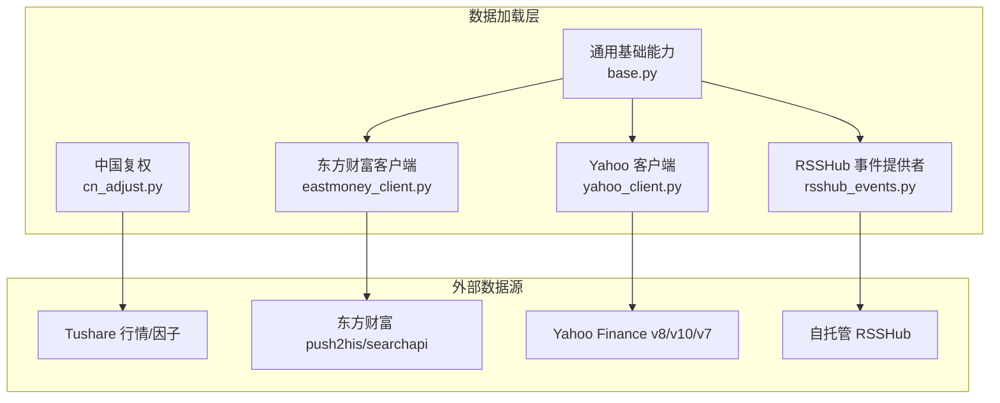
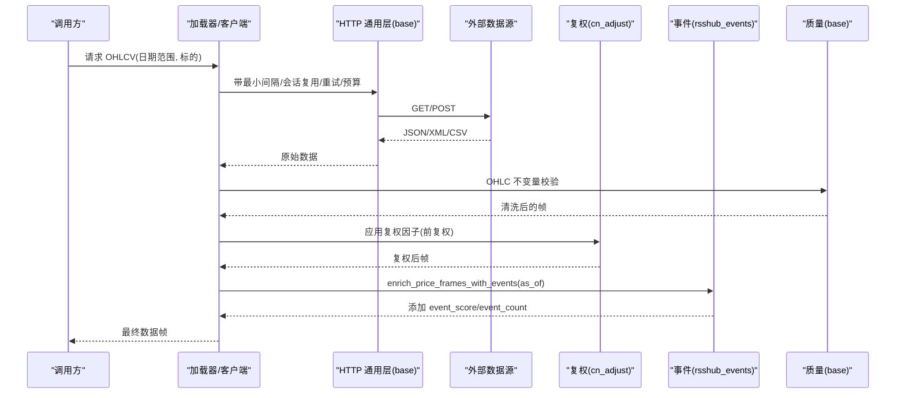
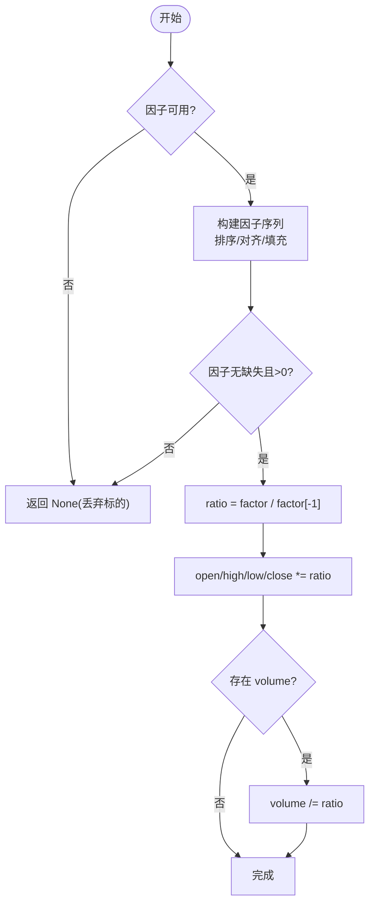
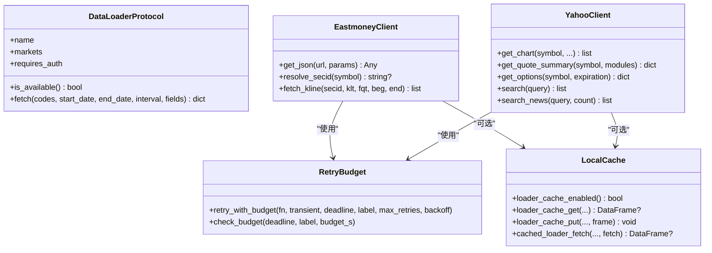
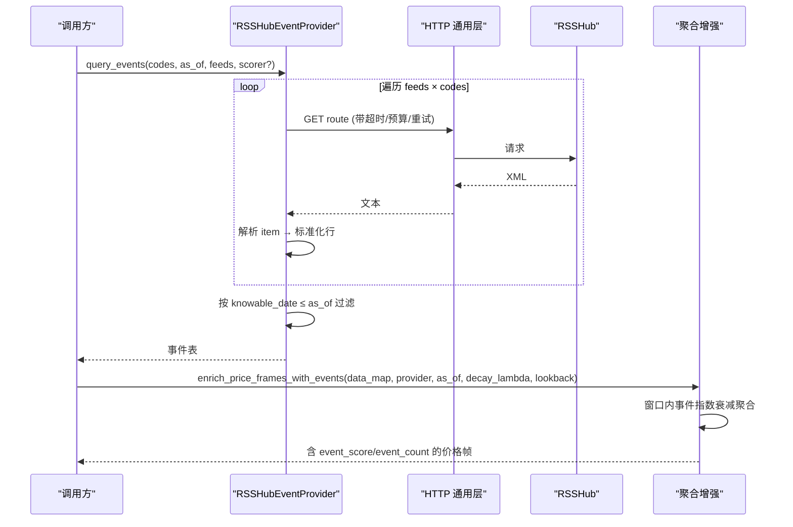
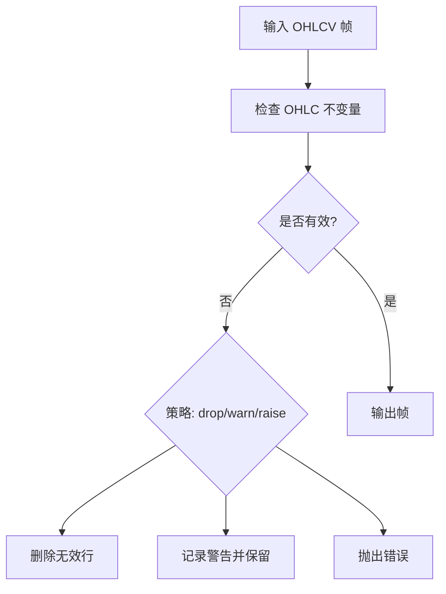
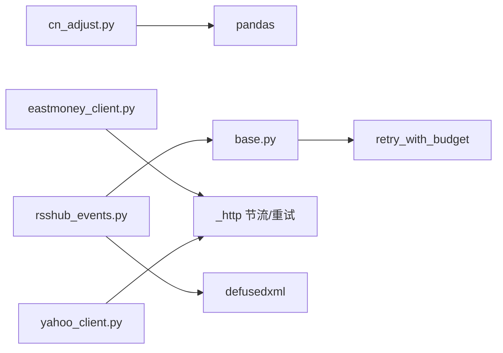

# 数据处理与优化

<cite>
**本文引用的文件**
- [cn_adjust.py](file://agent/backtest/loaders/cn_adjust.py)
- [base.py](file://agent/backtest/loaders/base.py)
- [rsshub_events.py](file://agent/backtest/loaders/rsshub_events.py)
- [eastmoney_client.py](file://agent/backtest/loaders/eastmoney_client.py)
- [yahoo_client.py](file://agent/backtest/loaders/yahoo_client.py)
</cite>

## 目录
1. [简介](#简介)
2. [项目结构](#项目结构)
3. [核心组件](#核心组件)
4. [架构总览](#架构总览)
5. [详细组件分析](#详细组件分析)
6. [依赖关系分析](#依赖关系分析)
7. [性能考量](#性能考量)
8. [故障排查指南](#故障排查指南)
9. [结论](#结论)
10. [附录](#附录)

## 简介
本技术文档聚焦于中国市场复权处理、HTTP 客户端通用能力、RSSHub 事件数据获取与实时处理，以及数据质量保障与性能优化策略。内容基于代码库中的具体实现进行说明，帮助读者理解并正确使用前/后复权计算、除权除息事件处理、网络请求重试与超时控制、代理与缓存策略、事件订阅与过滤、异常值检测与缺失值填充、一致性校验等关键能力。

## 项目结构
本项目在“回测加载器”子模块中提供了统一的数据接入与处理能力：
- 中国市场复权处理：针对 Tushare A 股与基金未复权价格，提供统一的复权因子对齐与前复权缩放逻辑。
- HTTP 客户端通用能力：通过共享的节流、会话复用、重试与预算控制机制，为各数据源（东方财富、Yahoo 等）提供稳定可靠的网络访问。
- RSSHub 事件数据：从自托管 RSSHub 拉取新闻/公告/情绪信号，按“可得知时间”约束注入到日频 OHLCV 框架，支持指数衰减聚合与去重。
- 数据质量与缓存：统一的 OHLC 不变量校验、本地 Parquet 缓存、内容寻址键与版本化元数据，确保一致性与可重复性。

图表来源
- [cn_adjust.py:1-78](file://agent/backtest/loaders/cn_adjust.py#L1-L78)
- [base.py:1-657](file://agent/backtest/loaders/base.py#L1-L657)
- [eastmoney_client.py:1-325](file://agent/backtest/loaders/eastmoney_client.py#L1-L325)
- [yahoo_client.py:1-419](file://agent/backtest/loaders/yahoo_client.py#L1-L419)
- [rsshub_events.py:1-569](file://agent/backtest/loaders/rsshub_events.py#L1-L569)

章节来源
- [cn_adjust.py:1-78](file://agent/backtest/loaders/cn_adjust.py#L1-L78)
- [base.py:1-657](file://agent/backtest/loaders/base.py#L1-L657)
- [eastmoney_client.py:1-325](file://agent/backtest/loaders/eastmoney_client.py#L1-L325)
- [yahoo_client.py:1-419](file://agent/backtest/loaders/yahoo_client.py#L1-L419)
- [rsshub_events.py:1-569](file://agent/backtest/loaders/rsshub_events.py#L1-L569)

## 核心组件
- 中国复权处理（前复权）：将 Tushare 返回的未复权价格按复权因子序列缩放到窗口最后一天，保持成交量同比例调整，金额列保持不变，从而消除除权除息造成的机械跳空对收益计算的污染。
- HTTP 通用能力：统一的请求最小间隔、进程内会话复用、按主机桶限流；带预算的重试循环（退避策略），超时与墙钟预算双重保护；可选本地 Parquet 缓存（内容寻址键、版本化元数据）。
- RSSHub 事件数据：声明式 FeedSpec 注册，按符号或全市场路由拉取 XML，安全解析（defusedxml），按“可得知时间”过滤，默认词典评分器可扩展为 LLM 评分；聚合函数按回看窗口指数衰减生成 event_score/event_count。
- 数据质量保障：OHLC 不变量校验（高低于低、高低不包围开收、非正价格等），支持 drop/warn/raise 策略；本地缓存读写失败降级；事件去重与空结果快速路径。

章节来源
- [cn_adjust.py:27-78](file://agent/backtest/loaders/cn_adjust.py#L27-L78)
- [base.py:168-256](file://agent/backtest/loaders/base.py#L168-L256)
- [base.py:398-450](file://agent/backtest/loaders/base.py#L398-L450)
- [base.py:243-441](file://agent/backtest/loaders/base.py#L243-L441)
- [rsshub_events.py:107-184](file://agent/backtest/loaders/rsshub_events.py#L107-L184)
- [rsshub_events.py:288-400](file://agent/backtest/loaders/rsshub_events.py#L288-L400)
- [rsshub_events.py:501-569](file://agent/backtest/loaders/rsshub_events.py#L501-L569)

## 架构总览
下图展示数据从外部源经客户端/加载器进入系统，并进行复权、事件增强与质量校验的整体流程。

图表来源
- [base.py:398-450](file://agent/backtest/loaders/base.py#L398-L450)
- [eastmoney_client.py:300-355](file://agent/backtest/loaders/eastmoney_client.py#L300-L355)
- [yahoo_client.py:156-205](file://agent/backtest/loaders/yahoo_client.py#L156-L205)
- [cn_adjust.py:27-78](file://agent/backtest/loaders/cn_adjust.py#L27-L78)
- [rsshub_events.py:501-569](file://agent/backtest/loaders/rsshub_events.py#L501-L569)

## 详细组件分析

### 中国市场复权处理（前复权）
- 目标：消除除权除息导致的机械价格跳空，使跨除权日的收益率反映真实波动。
- 方法：使用 Tushare 的 adj_factor/fund_adj 累计因子序列，将价格缩放到窗口最后一天；成交量按相同比率反比调整，金额列保持不变。
- 健壮性：因子缺失/不可用直接丢弃该标的，避免污染后续基准或因子计算。

图表来源
- [cn_adjust.py:27-78](file://agent/backtest/loaders/cn_adjust.py#L27-L78)

章节来源
- [cn_adjust.py:1-78](file://agent/backtest/loaders/cn_adjust.py#L1-L78)

### HTTP 客户端通用功能（重试、超时、代理、缓存）
- 重试与预算：retry_with_budget 提供带退避的重试循环，受 wall-clock deadline 限制；check_budget 用于分页抓取时快速失败。
- 最小间隔与会话复用：各客户端通过 _http 提供的 throttled_get/throttled_get_json 实现按主机桶的最小请求间隔与 session 复用，降低被限速/封禁风险。
- 代理支持：通过底层 httpx/requests 配置代理（由上层传入 client 或全局设置），本仓库以可注入 client 的方式解耦网络栈。
- 本地缓存：loader_cache_* 系列提供基于内容寻址键的 Parquet 缓存，仅对已结算区间写入，读/写失败均降级，不影响主流程。

图表来源
- [base.py:398-450](file://agent/backtest/loaders/base.py#L398-L450)
- [base.py:243-441](file://agent/backtest/loaders/base.py#L243-L441)
- [eastmoney_client.py:112-133](file://agent/backtest/loaders/eastmoney_client.py#L112-L133)
- [eastmoney_client.py:300-355](file://agent/backtest/loaders/eastmoney_client.py#L300-L355)
- [yahoo_client.py:156-205](file://agent/backtest/loaders/yahoo_client.py#L156-L205)
- [yahoo_client.py:302-357](file://agent/backtest/loaders/yahoo_client.py#L302-L357)
- [yahoo_client.py:360-419](file://agent/backtest/loaders/yahoo_client.py#L360-L419)

章节来源
- [base.py:398-450](file://agent/backtest/loaders/base.py#L398-L450)
- [base.py:243-441](file://agent/backtest/loaders/base.py#L243-L441)
- [eastmoney_client.py:1-325](file://agent/backtest/loaders/eastmoney_client.py#L1-L325)
- [yahoo_client.py:1-419](file://agent/backtest/loaders/yahoo_client.py#L1-L419)

### RSSHub 事件数据获取与实时处理
- 事件订阅：通过 FeedSpec 声明 feed 名称、路由模板、事件类型与符号格式；支持按符号或全市场路由。
- 消息过滤：按“可得知时间”（publish time 超过收盘截止小时则顺延至下一交易日）过滤，确保回溯测试无未来信息泄露。
- 格式转换：XML 安全解析（defusedxml），标准化为事件表（ts_code, knowable_date, event_type, score, source, summary）。
- 评分扩展：默认词典评分器，支持替换为任意 scorer(title, summary)->float。
- 聚合增强：enrich_price_frames_with_events 按回看窗口对事件分数做指数衰减，输出 event_score/event_count 两列。

图表来源
- [rsshub_events.py:107-184](file://agent/backtest/loaders/rsshub_events.py#L107-L184)
- [rsshub_events.py:288-400](file://agent/backtest/loaders/rsshub_events.py#L288-L400)
- [rsshub_events.py:449-484](file://agent/backtest/loaders/rsshub_events.py#L449-L484)
- [rsshub_events.py:501-569](file://agent/backtest/loaders/rsshub_events.py#L501-L569)

章节来源
- [rsshub_events.py:1-569](file://agent/backtest/loaders/rsshub_events.py#L1-L569)

### 数据质量保障措施
- OHLC 不变量校验：检测 high<low、high/low 不包围 open/close、非正价格等；支持 drop/warn/raise 三种策略。
- 缺失值与异常值：加载器仅 dropna，结构性脏数据由统一校验拦截；事件聚合中对空结果快速返回零分。
- 一致性验证：本地缓存内容寻址键包含 source/symbol/timeframe/date range/fields，版本化元数据保证向后兼容；读取失败降级到在线源。

图表来源
- [base.py:187-256](file://agent/backtest/loaders/base.py#L187-L256)

章节来源
- [base.py:187-256](file://agent/backtest/loaders/base.py#L187-L256)
- [base.py:243-441](file://agent/backtest/loaders/base.py#L243-L441)
- [rsshub_events.py:383-400](file://agent/backtest/loaders/rsshub_events.py#L383-L400)

## 依赖关系分析
- 复权模块依赖 pandas 与 Tushare 因子序列；对外暴露 apply_qfq 接口。
- 客户端模块依赖 _http 提供的节流与重试能力；Eastmoney 负责 secid 映射与 kline 解析；Yahoo 负责 chart/quoteSummary/options/search 及 crumb 握手。
- RSSHub 模块依赖 defusedxml 安全解析，并通过 base 的 retry_with_budget 实现稳健抓取。

图表来源
- [cn_adjust.py:24-78](file://agent/backtest/loaders/cn_adjust.py#L24-L78)
- [base.py:398-450](file://agent/backtest/loaders/base.py#L398-L450)
- [eastmoney_client.py:28-325](file://agent/backtest/loaders/eastmoney_client.py#L28-L325)
- [yahoo_client.py:35-419](file://agent/backtest/loaders/yahoo_client.py#L35-L419)
- [rsshub_events.py:21-38](file://agent/backtest/loaders/rsshub_events.py#L21-L38)

章节来源
- [eastmoney_client.py:1-325](file://agent/backtest/loaders/eastmoney_client.py#L1-L325)
- [yahoo_client.py:1-419](file://agent/backtest/loaders/yahoo_client.py#L1-L419)
- [rsshub_events.py:1-569](file://agent/backtest/loaders/rsshub_events.py#L1-L569)
- [base.py:1-657](file://agent/backtest/loaders/base.py#L1-L657)

## 性能考量
- 内存管理
  - 复权计算采用逐列缩放与原地拷贝策略，避免不必要的全量复制；成交量按比例反调，金额列保持不变，减少额外列计算。
  - 本地缓存使用 Parquet + DuckDB 内存引擎读写，元数据记录索引列名与 dtype，提升读取效率与一致性。
- 并发控制
  - 通过 _http 的 host_key 桶对同一域名进行最小间隔控制，避免触发第三方限速；Yahoo crumb 握手使用线程锁串行化，防止并发重复握手。
  - 重试退避结合 wall-clock 预算，避免长时间阻塞；RSSHub 抓取使用预算与重试，失败快速降级。
- 批量处理
  - 事件聚合按标的分组，使用 numpy 向量化计算窗口内衰减和，减少 Python 循环开销。
  - 加载器缓存对已结算区间生效，避免重复网络请求。

[本节为通用指导，不直接分析具体文件]

## 故障排查指南
- 复权失败
  - 现象：apply_qfq 返回 None。
  - 原因：因子缺失、不可用或包含非正值。
  - 处理：跳过该标的，避免污染后续计算。
- 网络异常
  - 现象：请求超时或达到预算。
  - 原因：外部服务不可达或响应慢。
  - 处理：检查 RSSHub/Eastmoney/Yahoo 可达性；调整超时与预算；确认代理配置。
- 事件为空
  - 现象：事件表为空或全部为零分。
  - 原因：所有抓取失败或 as_of 之前无可知事件。
  - 处理：确认 RSSHub 实例与路由配置；放宽 as_of；检查 feed 注册。
- 数据不一致
  - 现象：指标出现 NaN/inf。
  - 原因：OHLC 不变量破坏或缺失值。
  - 处理：启用 validate_ohlc 的 raise/warn 模式定位问题；必要时 drop 无效行。

章节来源
- [cn_adjust.py:54-68](file://agent/backtest/loaders/cn_adjust.py#L54-L68)
- [base.py:398-450](file://agent/backtest/loaders/base.py#L398-L450)
- [rsshub_events.py:383-400](file://agent/backtest/loaders/rsshub_events.py#L383-L400)
- [base.py:187-256](file://agent/backtest/loaders/base.py#L187-L256)

## 结论
本仓库在数据加载层提供了面向中国市场的前复权处理、稳健的 HTTP 通用能力与 RSSHub 事件增强管道，配合严格的数据质量校验与本地缓存机制，确保了回测与研究的准确性与可重复性。建议在生产环境中：
- 显式配置 RSSHub 实例与路由，启用事件评分与衰减参数调优。
- 开启 OHLC 校验的 warn/raise 模式，尽早发现脏数据。
- 合理设置重试预算与最小间隔，平衡稳定性与延迟。
- 利用本地缓存加速迭代，但注意仅对已结算区间生效。

[本节为总结，不直接分析具体文件]

## 附录
- 实际应用场景示例（以路径引用代替代码片段）
  - 前复权应用：[cn_adjust.py:27-78](file://agent/backtest/loaders/cn_adjust.py#L27-L78)
  - 东方财富 K 线获取：[eastmoney_client.py:300-355](file://agent/backtest/loaders/eastmoney_client.py#L300-L355)
  - Yahoo 图表获取与 crumb 握手：[yahoo_client.py:156-205](file://agent/backtest/loaders/yahoo_client.py#L156-L205), [yahoo_client.py:302-357](file://agent/backtest/loaders/yahoo_client.py#L302-L357)
  - RSSHub 事件查询与增强：[rsshub_events.py:343-400](file://agent/backtest/loaders/rsshub_events.py#L343-L400), [rsshub_events.py:501-569](file://agent/backtest/loaders/rsshub_events.py#L501-L569)
  - 重试与预算控制：[base.py:398-450](file://agent/backtest/loaders/base.py#L398-L450)
  - 本地缓存读写：[base.py:565-661](file://agent/backtest/loaders/base.py#L565-L661)

[本节为参考链接汇总，不直接分析具体文件]