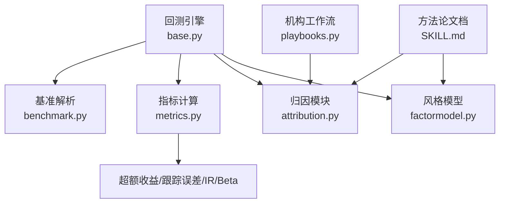
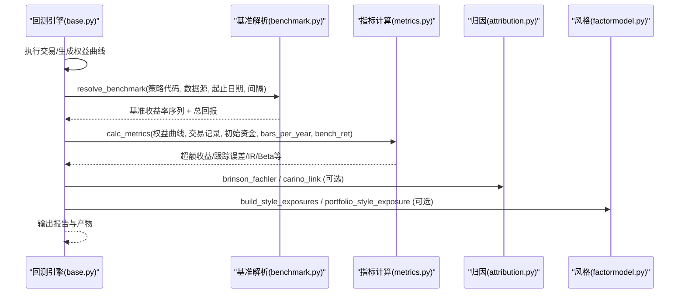
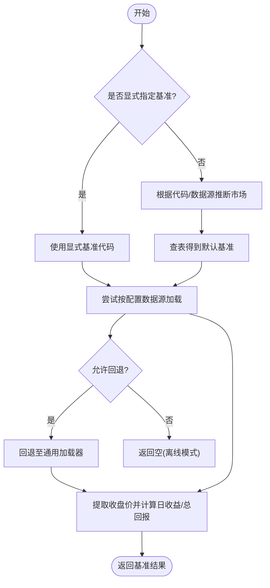
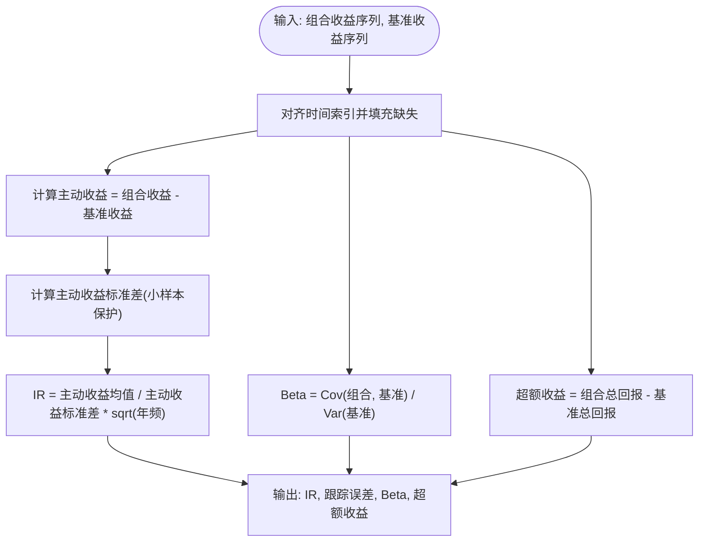
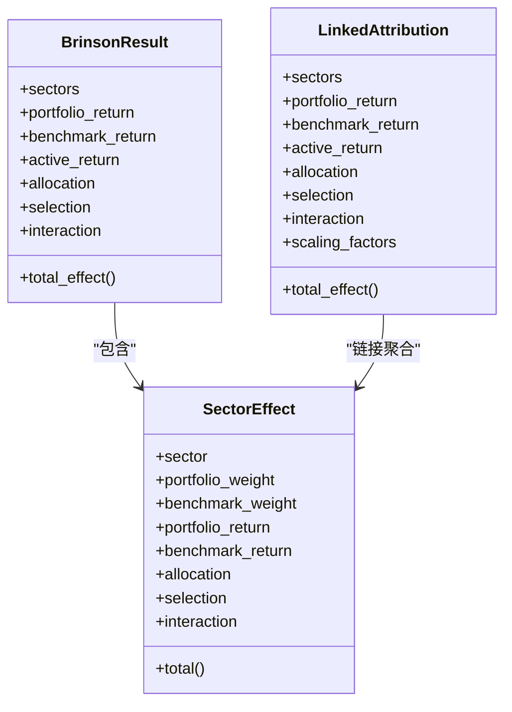

# 基准比较分析

<cite>
**本文引用的文件**
- [agent/backtest/benchmark.py](file://agent/backtest/benchmark.py)
- [agent/backtest/metrics.py](file://agent/backtest/metrics.py)
- [agent/backtest/engines/base.py](file://agent/backtest/engines/base.py)
- [agent/src/quantlib/attribution.py](file://agent/src/quantlib/attribution.py)
- [agent/src/quantlib/factormodel.py](file://agent/src/quantlib/factormodel.py)
- [agent/src/skills/performance-attribution/SKILL.md](file://agent/src/skills/performance-attribution/SKILL.md)
- [agent/cli/commands/institutional/playbooks.py](file://agent/cli/commands/institutional/playbooks.py)
- [agent/tests/test_metrics_tracking_error.py](file://agent/tests/test_metrics_tracking_error.py)
</cite>

## 目录
1. [简介](#简介)
2. [项目结构](#项目结构)
3. [核心组件](#核心组件)
4. [架构总览](#架构总览)
5. [详细组件分析](#详细组件分析)
6. [依赖关系分析](#依赖关系分析)
7. [性能与数值稳定性](#性能与数值稳定性)
8. [故障排查指南](#故障排查指南)
9. [结论](#结论)
10. [附录：使用示例与最佳实践](#附录使用示例与最佳实践)

## 简介
本技术文档面向“基准比较分析系统”，覆盖以下目标：
- 基准选择策略：市场指数、行业基准、自定义基准的配置与获取。
- 超额收益计算：绝对超额收益、风险调整后超额收益（信息比率）、滚动超额收益等。
- 跟踪误差：日度跟踪误差、年化跟踪误差、分解思路与注意事项。
- 信息比率：主动管理效率评估、基准相关性调整。
- 风格归因：市值风格、价值/成长风格、行业配置（Brinson）等。
- 实际使用示例：从简单对比到复杂归因。
- 数据获取与预处理最佳实践。

## 项目结构
与基准比较相关的代码主要分布在以下模块：
- 基准解析与获取：backtest/benchmark.py
- 指标计算（含超额收益、跟踪误差、信息比率、Beta）：backtest/metrics.py
- 回测引擎集成（基准注入与指标输出）：backtest/engines/base.py
- 业绩归因（Brinson-Fachler 多期链接）：src/quantlib/attribution.py
- 风格因子暴露与漂移（市值、价值/成长、动量等）：src/quantlib/factormodel.py
- 方法论与模板说明：src/skills/performance-attribution/SKILL.md
- 机构级工作流与归因流程：cli/commands/institutional/playbooks.py
- 回归测试（跟踪误差与信息比率一致性）：tests/test_metrics_tracking_error.py



图表来源
- [agent/backtest/engines/base.py:735-788](file://agent/backtest/engines/base.py#L735-L788)
- [agent/backtest/benchmark.py:40-102](file://agent/backtest/benchmark.py#L40-L102)
- [agent/backtest/metrics.py:461-626](file://agent/backtest/metrics.py#L461-L626)
- [agent/src/quantlib/attribution.py:209-413](file://agent/src/quantlib/attribution.py#L209-L413)
- [agent/src/quantlib/factormodel.py:102-117](file://agent/src/quantlib/factormodel.py#L102-L117)

章节来源
- [agent/backtest/engines/base.py:735-788](file://agent/backtest/engines/base.py#L735-L788)
- [agent/backtest/benchmark.py:40-102](file://agent/backtest/benchmark.py#L40-L102)
- [agent/backtest/metrics.py:461-626](file://agent/backtest/metrics.py#L461-L626)

## 核心组件
- 基准解析器：根据策略代码与市场类型推断默认基准，或接受显式自定义基准；支持通过指定数据源加载或回退至通用加载器。
- 指标计算器：统一计算组合收益、波动率、最大回撤、夏普、索提诺、卡玛、胜率、换手率，以及与基准的超额收益、跟踪误差、信息比率、基准Beta。
- 归因模块：实现单期 Brinson-Fachler 分解与多期 Carino 链接，保证无残差加总恒等。
- 风格模型：构建市值、价值/成长、动量、质量、低波、杠杆、流动性等风格暴露，并支持组合暴露聚合与基准主动暴露。
- 引擎集成：在回测执行后自动拉取基准序列，注入指标计算，并输出一致性的基准回报与超额回报。

章节来源
- [agent/backtest/benchmark.py:40-102](file://agent/backtest/benchmark.py#L40-L102)
- [agent/backtest/metrics.py:461-626](file://agent/backtest/metrics.py#L461-L626)
- [agent/src/quantlib/attribution.py:209-413](file://agent/src/quantlib/attribution.py#L209-L413)
- [agent/src/quantlib/factormodel.py:102-117](file://agent/src/quantlib/factormodel.py#L102-L117)
- [agent/backtest/engines/base.py:735-788](file://agent/backtest/engines/base.py#L735-L788)

## 架构总览
下图展示了基准比较在回测中的端到端流程：引擎执行交易、生成权益曲线；随后解析基准、对齐时间轴、计算指标与归因。



图表来源
- [agent/backtest/engines/base.py:735-788](file://agent/backtest/engines/base.py#L735-L788)
- [agent/backtest/benchmark.py:40-102](file://agent/backtest/benchmark.py#L40-L102)
- [agent/backtest/metrics.py:461-626](file://agent/backtest/metrics.py#L461-L626)
- [agent/src/quantlib/attribution.py:209-413](file://agent/src/quantlib/attribution.py#L209-L413)
- [agent/src/quantlib/factormodel.py:309-320](file://agent/src/quantlib/factormodel.py#L309-L320)

## 详细组件分析

### 基准选择策略与数据获取
- 默认基准映射：不同市场类型对应默认基准（如美股 SPY、A股 000300.SH、港股恒生中国企业ETF、加密货币 BTC-USDT 等）。
- 市场推断：基于策略代码后缀与数据源推断市场类型，从而选择默认基准。
- 显式基准：可通过配置直接指定任意基准代码，覆盖自动推断。
- 数据源优先：优先使用配置的数据源加载器；若为空或失败且允许回退，则回退至通用加载器；本地模式严格关闭网络回退。
- 价格序列处理：对非正前价场景采用安全的价格相对法计算总回报，避免复利乘积发散问题。



图表来源
- [agent/backtest/benchmark.py:40-102](file://agent/backtest/benchmark.py#L40-L102)
- [agent/backtest/benchmark.py:138-188](file://agent/backtest/benchmark.py#L138-L188)
- [agent/backtest/benchmark.py:162-208](file://agent/backtest/benchmark.py#L162-L208)

章节来源
- [agent/backtest/benchmark.py:40-102](file://agent/backtest/benchmark.py#L40-L102)
- [agent/backtest/benchmark.py:138-188](file://agent/backtest/benchmark.py#L138-L188)
- [agent/backtest/benchmark.py:162-208](file://agent/backtest/benchmark.py#L162-L208)

### 超额收益计算与风险调整
- 绝对超额收益：组合总回报减去基准总回报（两者均使用安全的“价格相对”口径）。
- 风险调整后超额收益：以主动收益的标准差为分母，结合年频因子计算信息比率（IR），用于衡量单位跟踪误差下的超额收益能力。
- 基准Beta：基于组合与基准收益协方差除以基准方差估计，反映组合对基准的系统性暴露。
- 小样本保护：当观测数不足时，标准差与IR被保护为有限值，避免NaN/Inf污染。



图表来源
- [agent/backtest/metrics.py:461-626](file://agent/backtest/metrics.py#L461-L626)

章节来源
- [agent/backtest/metrics.py:461-626](file://agent/backtest/metrics.py#L461-L626)
- [agent/tests/test_metrics_tracking_error.py:1-41](file://agent/tests/test_metrics_tracking_error.py#L1-L41)

### 跟踪误差：日度、年化与分解
- 日度跟踪误差：主动收益序列的标准差（日度）。
- 年化跟踪误差：日度标准差乘以 sqrt(年频)，作为IR的分母口径。
- 分解思路：跟踪误差可视为由系统性部分（与基准相关）与特异性部分（主动择时/选股）共同构成；在本系统中，Beta用于刻画系统性暴露，剩余波动体现主动管理带来的偏离。
- 数值稳健性：对非正前价、极值与单观测序列进行保护，确保TE与IR保持有限值。

章节来源
- [agent/backtest/metrics.py:461-626](file://agent/backtest/metrics.py#L461-L626)

### 信息比率与基准相关性调整
- 信息比率：主动收益均值与年化主动波动之比，衡量单位跟踪误差下的超额收益效率。
- 基准相关性调整：通过Beta识别系统性暴露；高Beta可能放大跟踪误差但未必代表主动管理能力，需结合IR与Alpha解读。
- 小样本与极端值：IR与TE在小样本下被保护，避免误判。

章节来源
- [agent/backtest/metrics.py:640-695](file://agent/backtest/metrics.py#L640-L695)

### 风格归因：市值、价值/成长、行业配置
- 行业配置归因（Brinson-Fachler）：将超额收益分解为配置效应、选择效应与交互效应，三者之和恒等于主动收益，无残差。
- 多期链接（Carino）：将单期分解结果按对数链接合并，保证跨期累计主动收益精确重述。
- 风格暴露：基于公开学术定义构建市值、价值/成长、动量、质量、低波、杠杆、流动性等暴露；组合暴露可按权重聚合，并可计算相对于基准的“主动暴露”。
- 风格漂移：统计暴露的均值、标准差、首尾变化与最大绝对变动，用于检测风格漂移与一致性。



图表来源
- [agent/src/quantlib/attribution.py:72-198](file://agent/src/quantlib/attribution.py#L72-L198)
- [agent/src/quantlib/attribution.py:209-413](file://agent/src/quantlib/attribution.py#L209-L413)

章节来源
- [agent/src/quantlib/attribution.py:209-413](file://agent/src/quantlib/attribution.py#L209-L413)
- [agent/src/quantlib/factormodel.py:102-117](file://agent/src/quantlib/factormodel.py#L102-L117)
- [agent/src/quantlib/factormodel.py:240-320](file://agent/src/quantlib/factormodel.py#L240-L320)
- [agent/src/skills/performance-attribution/SKILL.md:1-308](file://agent/src/skills/performance-attribution/SKILL.md#L1-L308)

### 引擎集成：基准注入与指标输出
- 基准注入：在回测执行完成后，依据配置解析基准序列，对齐到策略时间轴，构造基准权益曲线。
- 指标计算：调用统一指标函数，输出超额收益、跟踪误差、信息比率、Beta等。
- 一致性修正：若基准价格序列存在非正前价，基准总回报已用安全方法修正，超额收益据此重新计算，确保字典内字段一致。

章节来源
- [agent/backtest/engines/base.py:735-788](file://agent/backtest/engines/base.py#L735-L788)

## 依赖关系分析
- backtest/engines/base.py 依赖 benchmark.py 解析基准，依赖 metrics.py 计算指标。
- metrics.py 提供统一的收益转换与指标计算，支撑引擎输出。
- attribution.py 与 factormodel.py 提供归因与风格分析能力，供上层工作流调用。
- SKILL.md 提供方法论与模板，指导如何解释与呈现结果。
- playbooks.py 提供机构级归因流程与工作流编排。

```mermaid
graph LR
base["engines/base.py"] --> bench["benchmark.py"]
base --> met["metrics.py"]
base --> attr["attribution.py"]
base --> style["factormodel.py"]
skill["SKILL.md"] --> attr
skill --> style
playbook["playbooks.py"] --> attr
```

图表来源
- [agent/backtest/engines/base.py:735-788](file://agent/backtest/engines/base.py#L735-L788)
- [agent/backtest/benchmark.py:40-102](file://agent/backtest/benchmark.py#L40-L102)
- [agent/backtest/metrics.py:461-626](file://agent/backtest/metrics.py#L461-L626)
- [agent/src/quantlib/attribution.py:209-413](file://agent/src/quantlib/attribution.py#L209-L413)
- [agent/src/quantlib/factormodel.py:102-117](file://agent/src/quantlib/factormodel.py#L102-L117)
- [agent/src/skills/performance-attribution/SKILL.md:1-308](file://agent/src/skills/performance-attribution/SKILL.md#L1-L308)
- [agent/cli/commands/institutional/playbooks.py:285-305](file://agent/cli/commands/institutional/playbooks.py#L285-L305)

## 性能与数值稳定性
- 收益计算稳健性：对非正前价与无穷大/零值进行保护，避免复利乘积发散与NaN传播。
- 小样本保护：单观测或少量观测下，标准差与IR被保护为有限值，避免误报。
- 年频校正：不同数据源与频率采用不同的bars_per_year，确保年化指标可比。
- 链接归因精度：Carino链接在对数尺度上缩放各期效应，保证累计主动收益精确重述。

章节来源
- [agent/backtest/metrics.py:245-330](file://agent/backtest/metrics.py#L245-L330)
- [agent/backtest/metrics.py:461-626](file://agent/backtest/metrics.py#L461-L626)
- [agent/src/quantlib/attribution.py:314-413](file://agent/src/quantlib/attribution.py#L314-L413)

## 故障排查指南
- 基准为空或列缺失：检查基准代码、数据源与时间范围；确认收盘价列存在。
- 跟踪误差/IR为零或异常：检查主动收益序列是否存在有效变异；关注小样本与极端值保护逻辑。
- 超额收益不一致：确认基准总回报使用安全价格相对法，并与组合总回报口径一致。
- 归因不闭合：检查组合与基准权重总和是否相等；确保每个有非零权重的侧都有对应收益。
- 风格暴露缺失：检查特征数据覆盖率与最小截面数量；未匹配头寸会单独报告。

章节来源
- [agent/backtest/benchmark.py:162-208](file://agent/backtest/benchmark.py#L162-L208)
- [agent/backtest/metrics.py:461-626](file://agent/backtest/metrics.py#L461-L626)
- [agent/src/quantlib/attribution.py:209-311](file://agent/src/quantlib/attribution.py#L209-L311)
- [agent/src/quantlib/factormodel.py:240-320](file://agent/src/quantlib/factormodel.py#L240-L320)

## 结论
本系统提供了从基准选择、超额收益与跟踪误差计算，到风格与行业归因的一体化能力。通过稳健的收益计算、小样本保护与Carino链接，确保了指标的可比性与可审计性。结合风格暴露与漂移分析，能够深入解释超额收益的来源与可持续性。

## 附录：使用示例与最佳实践

### 基准选择与配置
- 自动基准：不指定时，系统根据策略代码与数据源推断市场并选择默认基准。
- 自定义基准：在配置中显式设置基准代码，覆盖自动推断。
- 数据源优先级：优先使用配置的数据源；本地模式禁止网络回退。

章节来源
- [agent/backtest/benchmark.py:40-102](file://agent/backtest/benchmark.py#L40-L102)
- [agent/backtest/benchmark.py:138-188](file://agent/backtest/benchmark.py#L138-L188)
- [agent/backtest/benchmark.py:162-208](file://agent/backtest/benchmark.py#L162-L208)

### 超额收益与跟踪误差分析
- 绝对超额收益：组合总回报减基准总回报。
- 年化跟踪误差：主动收益标准差乘以sqrt(年频)。
- 信息比率：单位跟踪误差下的超额收益效率。
- 基准Beta：系统性暴露度量，辅助解释跟踪误差来源。

章节来源
- [agent/backtest/metrics.py:461-626](file://agent/backtest/metrics.py#L461-L626)

### 滚动分析与稳定性
- 建议窗口：日线数据常用252日；月线数据常用12-36个月。
- 滚动指标：滚动夏普、滚动Alpha、滚动Beta、滚动IR，评估策略稳定性与持续性。

章节来源
- [agent/src/skills/performance-attribution/SKILL.md:234-244](file://agent/src/skills/performance-attribution/SKILL.md#L234-L244)

### 行业配置归因（Brinson-Fachler）
- 单期分解：配置效应、选择效应、交互效应之和等于主动收益。
- 多期链接：Carino链接保证累计主动收益精确重述。
- 工作流：机构级归因流程强调权重归一化、行业映射与残差解释。

章节来源
- [agent/src/quantlib/attribution.py:209-413](file://agent/src/quantlib/attribution.py#L209-L413)
- [agent/cli/commands/institutional/playbooks.py:285-305](file://agent/cli/commands/institutional/playbooks.py#L285-L305)

### 风格暴露与漂移
- 风格因子：市值、价值/成长、动量、质量、低波、杠杆、流动性。
- 暴露构建：先标准化再聚合；缺失特征补零并计数。
- 漂移监测：均值、标准差、首尾变化与最大绝对变动。

章节来源
- [agent/src/quantlib/factormodel.py:102-117](file://agent/src/quantlib/factormodel.py#L102-L117)
- [agent/src/quantlib/factormodel.py:240-320](file://agent/src/quantlib/factormodel.py#L240-L320)

### 数据获取与预处理最佳实践
- 价格序列：确保收盘价连续且可计算收益；对非正前价采用安全方法。
- 时间对齐：基准与组合收益必须对齐到同一时间轴，缺失值合理填充。
- 年频选择：根据数据源与频率选择合适的bars_per_year，确保年化可比。
- 离线运行：本地模式禁止网络回退，确保完全离线。

章节来源
- [agent/backtest/metrics.py:245-330](file://agent/backtest/metrics.py#L245-L330)
- [agent/backtest/benchmark.py:162-208](file://agent/backtest/benchmark.py#L162-L208)