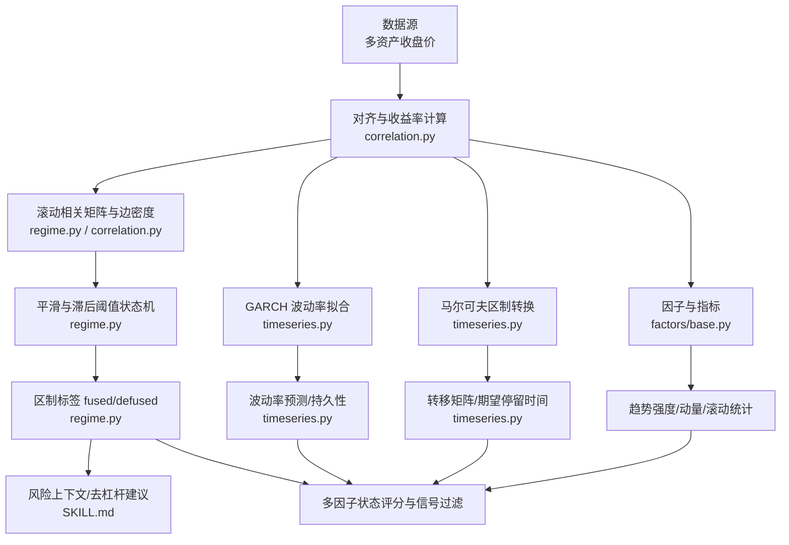
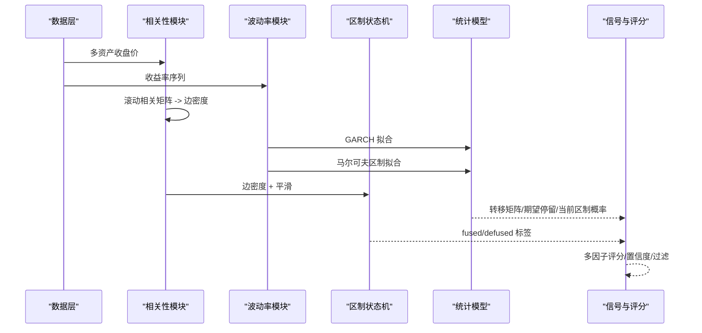
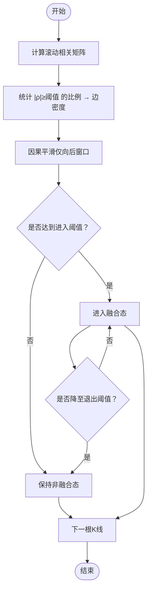
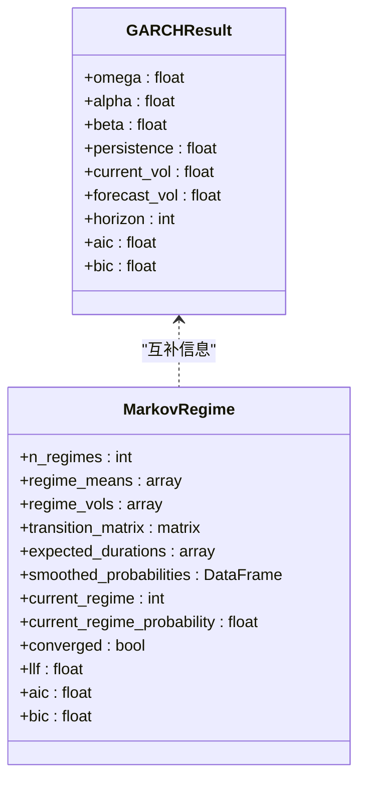
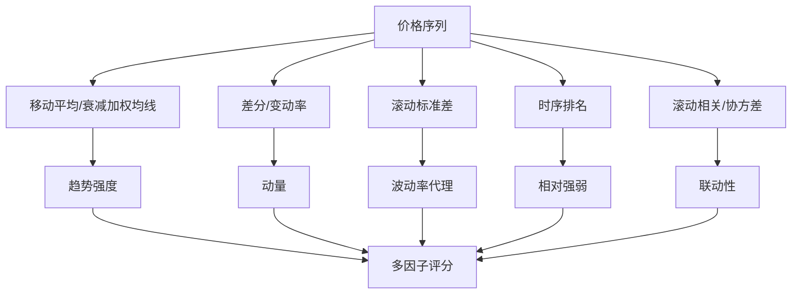
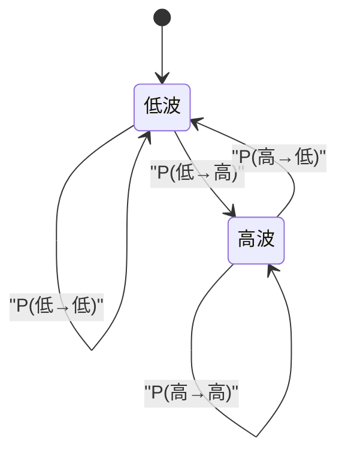
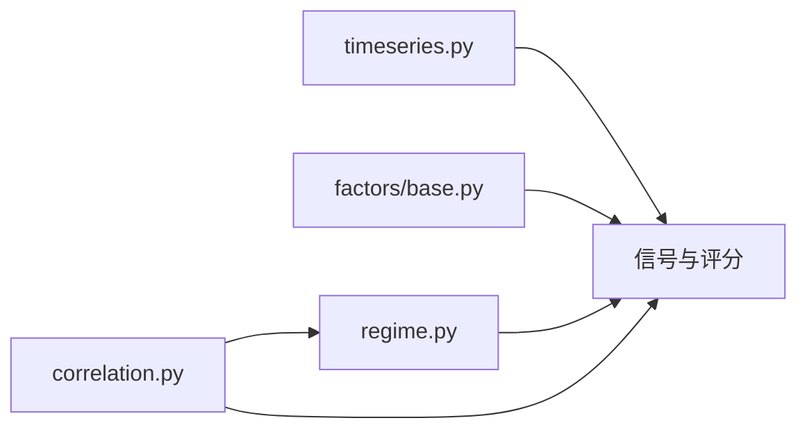

# 市场状态识别

<cite>
**本文引用的文件**
- [agent/backtest/regime.py](file://agent/backtest/regime.py)
- [agent/backtest/correlation.py](file://agent/backtest/correlation.py)
- [agent/src/factors/base.py](file://agent/src/factors/base.py)
- [agent/src/quantlib/timeseries.py](file://agent/src/quantlib/timeseries.py)
- [agent/src/skills/correlation-regime/SKILL.md](file://agent/src/skills/correlation-regime/SKILL.md)
- [agent/src/skills/volatility/SKILL.md](file://agent/src/skills/volatility/SKILL.md)
- [agent/src/swarm/presets/risk_committee.yaml](file://agent/src/swarm/presets/risk_committee.yaml)
</cite>

## 目录
1. [简介](#简介)
2. [项目结构](#项目结构)
3. [核心组件](#核心组件)
4. [架构总览](#架构总览)
5. [详细组件分析](#详细组件分析)
6. [依赖关系分析](#依赖关系分析)
7. [性能考量](#性能考量)
8. [故障排查指南](#故障排查指南)
9. [结论](#结论)
10. [附录](#附录)

## 简介
本技术文档围绕“市场状态识别系统”展开，覆盖趋势识别、波动率状态检测、周期分析、状态转移概率建模、信号生成与验证回测等关键主题。系统以多资产收益序列为基础，通过相关性密度与滞后阈值构建“融合/非融合”的 regime 状态机；结合 GARCH 波动率模型与马尔可夫区制转换模型，输出当前波动率区制、停留时间与转移概率；并通过因子工具箱（移动平均、动量、滚动统计）完成趋势强度与动量度量；最终在多因子评分、置信度评估与信号过滤的基础上，形成可用于策略参数自适应、仓位管理与风险控制的实用工具链。

## 项目结构
仓库中与市场状态识别直接相关的代码主要分布在以下模块：
- 相关性区制与时间线：backtest/regime.py、backtest/correlation.py
- 因子与指标基础：src/factors/base.py
- 时间序列与区制模型：src/quantlib/timeseries.py
- 技能与方法论说明：src/skills/correlation-regime/SKILL.md、src/skills/volatility/SKILL.md
- 风险委员会工作流提示词：src/swarm/presets/risk_committee.yaml

**图表来源**
- [agent/backtest/regime.py:24-98](file://agent/backtest/regime.py#L24-L98)
- [agent/backtest/correlation.py:135-213](file://agent/backtest/correlation.py#L135-L213)
- [agent/src/quantlib/timeseries.py:485-542](file://agent/src/quantlib/timeseries.py#L485-L542)
- [agent/src/factors/base.py:79-207](file://agent/src/factors/base.py#L79-L207)

**章节来源**
- [agent/backtest/regime.py:24-98](file://agent/backtest/regime.py#L24-L98)
- [agent/backtest/correlation.py:135-213](file://agent/backtest/correlation.py#L135-L213)
- [agent/src/quantlib/timeseries.py:485-542](file://agent/src/quantlib/timeseries.py#L485-L542)
- [agent/src/factors/base.py:79-207](file://agent/src/factors/base.py#L79-L207)

## 核心组件
- 相关性区制检测：基于滚动相关矩阵的边密度与滞后阈值状态机，输出每根 K 线的融合度与 regime 标签。
- 波动率建模：GARCH 拟合得到条件波动率、持久性与预测；马尔可夫区制模型给出当前区制、转移矩阵与期望停留时间。
- 因子与指标：提供滚动均值、标准差、相关/协方差、排名、差分、衰减加权均线等基础算子，用于趋势强度与动量度量。
- 方法论与工作流：技能文档定义了因果性约束、阈值选择、风险上下文映射与危机归因流程；风险委员会预设引导将区制结果转化为策略决策。

**章节来源**
- [agent/backtest/regime.py:24-98](file://agent/backtest/regime.py#L24-L98)
- [agent/src/quantlib/timeseries.py:485-542](file://agent/src/quantlib/timeseries.py#L485-L542)
- [agent/src/factors/base.py:79-207](file://agent/src/factors/base.py#L79-L207)
- [agent/src/skills/correlation-regime/SKILL.md:43-163](file://agent/src/skills/correlation-regime/SKILL.md#L43-L163)
- [agent/src/skills/volatility/SKILL.md:8-41](file://agent/src/skills/volatility/SKILL.md#L8-L41)
- [agent/src/swarm/presets/risk_committee.yaml:72-112](file://agent/src/swarm/presets/risk_committee.yaml#L72-L112)

## 架构总览
系统从多资产价格出发，先对齐并计算收益率，再并行进行两类分析：
- 相关性维度：滚动相关矩阵压缩为边密度，经因果平滑后进入滞后阈值状态机，得到融合/非融合 regime。
- 波动率维度：GARCH 估计条件波动率与预测；马尔可夫区制模型估计转移矩阵与期望停留时间，并标注当前区制及概率。

两者共同输入到多因子评分与信号过滤模块，输出可用于策略的参数自适应、仓位调整与风控触发。

**图表来源**
- [agent/backtest/correlation.py:135-213](file://agent/backtest/correlation.py#L135-L213)
- [agent/backtest/regime.py:24-98](file://agent/backtest/regime.py#L24-L98)
- [agent/src/quantlib/timeseries.py:485-542](file://agent/src/quantlib/timeseries.py#L485-L542)

## 详细组件分析

### 相关性区制检测（边密度 + 滞后阈值）
- 边密度：对滚动窗口内的多资产收益率计算相关矩阵，统计绝对值超过阈值的配对比例，作为“市场融合度”标量。
- 平滑与状态机：对边密度使用仅向后的滑动平均进行因果平滑，随后用两个阈值（进入/退出）实现滞回状态机，抑制频繁切换。
- 输出：每根 K 线的密度、平滑值与 fused 标签，以及连续融合区间。

**图表来源**
- [agent/backtest/regime.py:24-98](file://agent/backtest/regime.py#L24-L98)
- [agent/backtest/correlation.py:135-213](file://agent/backtest/correlation.py#L135-L213)

**章节来源**
- [agent/backtest/regime.py:24-98](file://agent/backtest/regime.py#L24-L98)
- [agent/backtest/correlation.py:135-213](file://agent/backtest/correlation.py#L135-L213)
- [agent/src/skills/correlation-regime/SKILL.md:43-163](file://agent/src/skills/correlation-regime/SKILL.md#L43-L163)

### 波动率状态检测（GARCH 与区制转换）
- GARCH 拟合：估计条件波动率、持久性与向前预测，提供波动率聚类与预测能力。
- 马尔可夫区制：估计不同波动率区制的转移矩阵、期望停留时间，并标注当前区制及其概率。
- 应用：在低波/高波区制下分别调整策略参数与仓位大小，配合转移概率做前瞻风险管理。

**图表来源**
- [agent/src/quantlib/timeseries.py:461-482](file://agent/src/quantlib/timeseries.py#L461-L482)
- [agent/src/quantlib/timeseries.py:485-542](file://agent/src/quantlib/timeseries.py#L485-L542)

**章节来源**
- [agent/src/quantlib/timeseries.py:461-482](file://agent/src/quantlib/timeseries.py#L461-L482)
- [agent/src/quantlib/timeseries.py:485-542](file://agent/src/quantlib/timeseries.py#L485-L542)

### 趋势识别与动量分析（因子工具箱）
- 移动平均与衰减加权均线：ts_mean、decay_linear 提供趋势跟踪基础。
- 动量与波动：delta、ts_std、ts_corr/ts_cov 刻画价格变化与联动。
- 相对强弱与时序排名：ts_rank 提供时序百分位排名，便于跨期比较。
- 稳健运算：safe_div 避免除零与无穷值污染。

**图表来源**
- [agent/src/factors/base.py:79-207](file://agent/src/factors/base.py#L79-L207)
- [agent/src/factors/base.py:255-318](file://agent/src/factors/base.py#L255-L318)

**章节来源**
- [agent/src/factors/base.py:79-207](file://agent/src/factors/base.py#L79-L207)
- [agent/src/factors/base.py:255-318](file://agent/src/factors/base.py#L255-L318)

### 周期分析与宏观视角
- 经济周期定位：通过区制模型的“低波/高波”状态与转移概率，结合历史类比期，判断所处宏观阶段。
- 市场周期识别：融合/非融合 regime 与波动率区制共同刻画市场节奏（震荡、趋势、危机）。
- 季节性模式：可叠加滚动统计（如月度/季度均值、波动率）观察周期性特征，但需确保因果性。

**章节来源**
- [agent/src/swarm/presets/risk_committee.yaml:72-112](file://agent/src/swarm/presets/risk_committee.yaml#L72-L112)
- [agent/src/skills/correlation-regime/SKILL.md:43-163](file://agent/src/skills/correlation-regime/SKILL.md#L43-L163)

### 状态转移概率（马尔可夫链）
- 转移矩阵：行 i 表示今日处于区制 i，列 j 表示明日转移到区制 j 的概率。
- 期望停留时间：1/(1-p_ii)，衡量在当前区制的平均持续天数。
- 当前区制概率：最新观测的后验概率，用于置信度评估。

**图表来源**
- [agent/src/quantlib/timeseries.py:485-542](file://agent/src/quantlib/timeseries.py#L485-L542)

**章节来源**
- [agent/src/quantlib/timeseries.py:485-542](file://agent/src/quantlib/timeseries.py#L485-L542)

### 状态信号生成（多因子评分、置信度、过滤）
- 多因子评分：融合 regime、波动率区制、趋势强度、动量、联动性等因子标准化后加权合成。
- 置信度评估：使用当前区制概率、转移概率与因子稳定性（如滚动标准差）综合打分。
- 信号过滤：因果性约束（仅向后）、阈值死区（滞回）、最小持仓期与滑点/成本考虑。

**章节来源**
- [agent/src/skills/correlation-regime/SKILL.md:43-163](file://agent/src/skills/correlation-regime/SKILL.md#L43-L163)
- [agent/src/skills/volatility/SKILL.md:8-41](file://agent/src/skills/volatility/SKILL.md#L8-L41)
- [agent/src/swarm/presets/risk_committee.yaml:72-112](file://agent/src/swarm/presets/risk_committee.yaml#L72-L112)

### 实际应用案例
- 策略参数自适应：在高波/融合 regime 下调仓、放宽止损或降低频率；在非融合/低波 regime 恢复常规参数。
- 仓位管理调整：依据转移概率与期望停留时间动态缩放头寸，避免在即将切换时过度暴露。
- 风险控制触发：当融合 regime 持续且波动率上升时，触发降杠杆或对冲指令。

**章节来源**
- [agent/src/skills/correlation-regime/SKILL.md:167-206](file://agent/src/skills/correlation-regime/SKILL.md#L167-L206)
- [agent/src/swarm/presets/risk_committee.yaml:72-112](file://agent/src/swarm/presets/risk_committee.yaml#L72-L112)

## 依赖关系分析
- 数据依赖：多资产收盘价 → 收益率 → 相关矩阵/波动率/因子。
- 算法依赖：statsmodels（GARCH、马尔可夫区制）、numpy/pandas（滚动计算、矩阵操作）。
- 模块耦合：regime 依赖 correlation 的数据对齐与收益计算；timeseries 独立提供波动率与区制模型；factors/base 提供通用算子供上层组合。

**图表来源**
- [agent/backtest/correlation.py:135-213](file://agent/backtest/correlation.py#L135-L213)
- [agent/backtest/regime.py:24-98](file://agent/backtest/regime.py#L24-L98)
- [agent/src/quantlib/timeseries.py:485-542](file://agent/src/quantlib/timeseries.py#L485-L542)
- [agent/src/factors/base.py:79-207](file://agent/src/factors/base.py#L79-L207)

**章节来源**
- [agent/backtest/correlation.py:135-213](file://agent/backtest/correlation.py#L135-L213)
- [agent/backtest/regime.py:24-98](file://agent/backtest/regime.py#L24-L98)
- [agent/src/quantlib/timeseries.py:485-542](file://agent/src/quantlib/timeseries.py#L485-L542)
- [agent/src/factors/base.py:79-207](file://agent/src/factors/base.py#L79-L207)

## 性能考量
- 滚动相关矩阵复杂度 O(T·N^2)，在大 N 场景下应控制资产数量或采用稀疏/近似方法。
- 使用因果平滑（仅向后）避免未来泄露，同时减少不必要的重算。
- 因子计算尽量向量化（如滑动窗口视图），减少 Python 循环开销。
- GARCH 与马尔可夫区制拟合耗时较高，建议在离线训练或定时更新，而非逐根 K 线实时运行。

[本节为通用指导，不直接分析具体文件]

## 故障排查指南
- 无重叠数据：多资产收益率无法对齐时会报错，检查交易日历与数据源可用性。
- 收敛失败：马尔可夫区制未收敛时需回退到规则化波动率/趋势判断，并在报告中声明。
- 除零与无穷：因子运算中 safe_div 与 inf/nan 替换确保数值稳定。
- 可选依赖缺失：GARCH/区制模型需要 statsmodels/arch，未安装会抛出 ImportError 并提示安装命令。

**章节来源**
- [agent/backtest/correlation.py:175-194](file://agent/backtest/correlation.py#L175-L194)
- [agent/src/quantlib/timeseries.py:68-90](file://agent/src/quantlib/timeseries.py#L68-L90)
- [agent/src/factors/base.py:350-362](file://agent/src/factors/base.py#L350-L362)

## 结论
该系统以相关性区制与波动率区制为核心，结合因子与动量工具，形成一套因果、可解释、可回测的市场状态识别框架。通过转移概率与期望停留时间，系统能够在不同宏观与市场环境下自适应策略参数与仓位管理，并提供明确的风险控制触发机制。实践上应严格遵循因果性、阈值校准与稳健性要求，确保信号的可信度与可复现性。

[本节为总结性内容，不直接分析具体文件]

## 附录
- 阈值选择建议：边密度阈值与滞回阈值应基于平静期分布校准，保持足够死区以减少误报。
- 因果性约束：所有平滑与基线必须仅使用历史信息，避免中心平滑带来的未来泄露。
- 回测与验证：对 regime 与波动率模型进行样本外检验，报告混淆矩阵、AUC、夏普比率与最大回撤等指标。

[本节为补充说明，不直接分析具体文件]