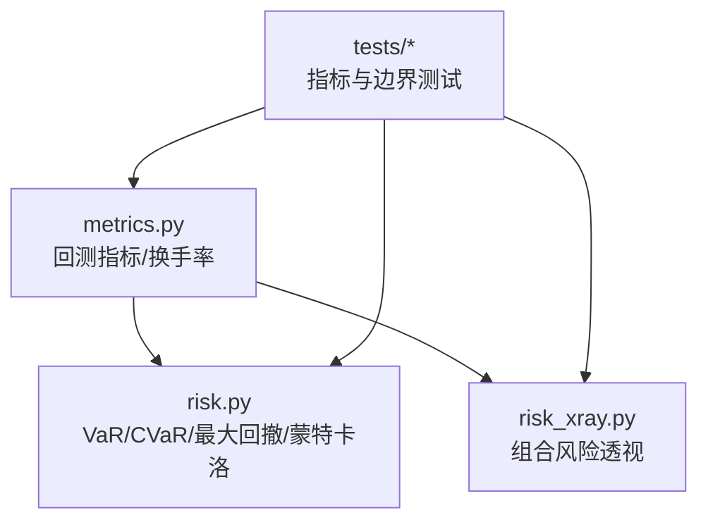
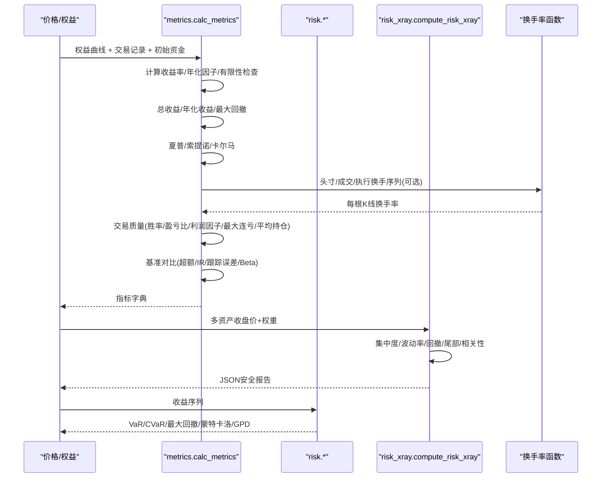
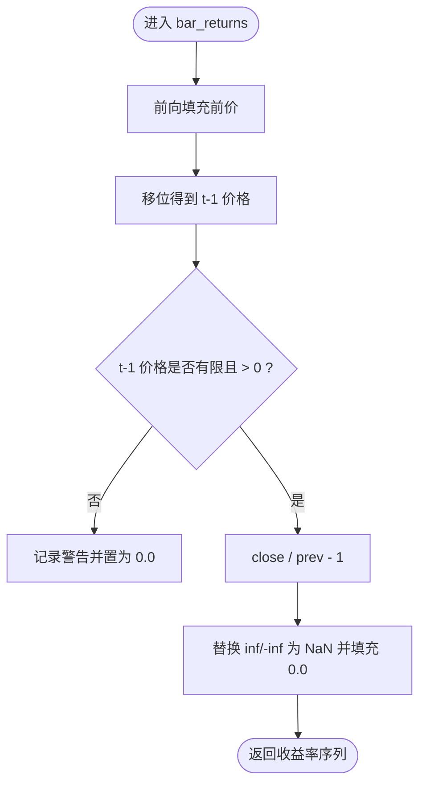
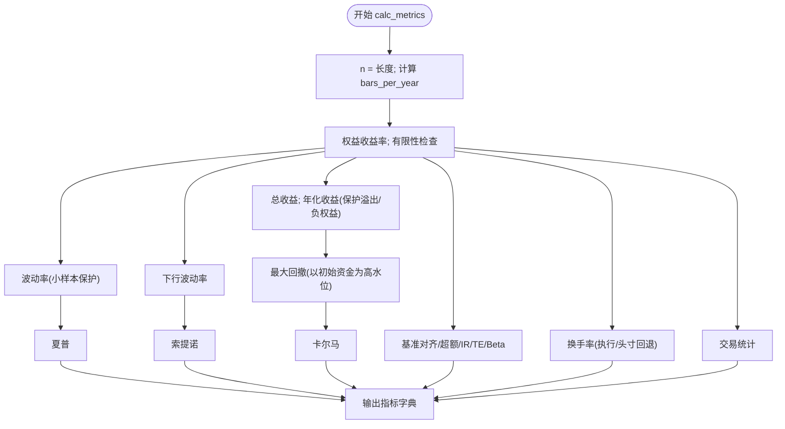
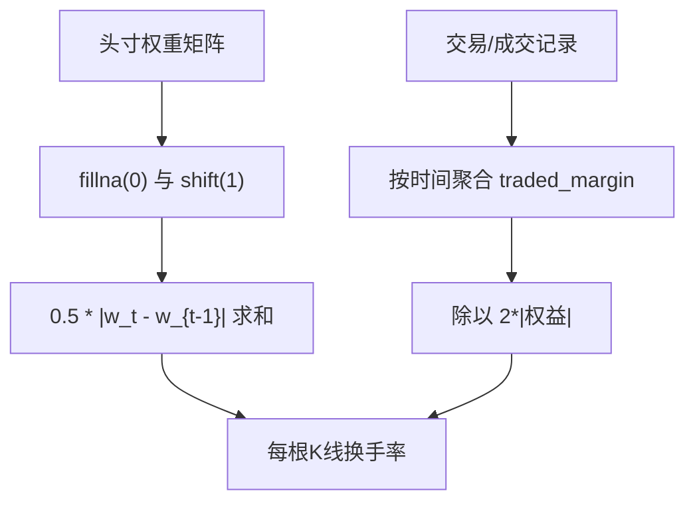
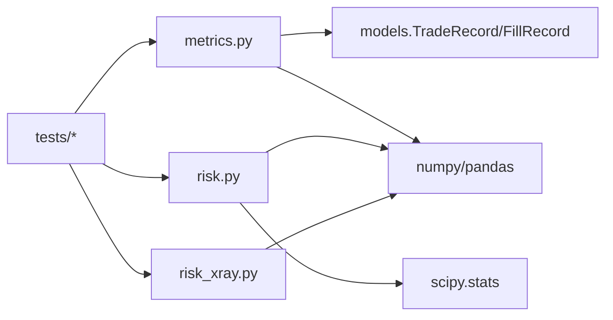

# 核心绩效指标计算

<cite>
**本文引用的文件**
- [agent/backtest/metrics.py](file://agent/backtest/metrics.py)
- [agent/src/quantlib/risk.py](file://agent/src/quantlib/risk.py)
- [agent/backtest/risk_xray.py](file://agent/backtest/risk_xray.py)
- [agent/tests/test_metrics.py](file://agent/tests/test_metrics.py)
- [agent/tests/test_metrics_inf_zero_equity.py](file://agent/tests/test_metrics_inf_zero_equity.py)
- [agent/tests/test_nonpositive_returns.py](file://agent/tests/test_nonpositive_returns.py)
</cite>

## 目录
1. [简介](#简介)
2. [项目结构](#项目结构)
3. [核心组件](#核心组件)
4. [架构总览](#架构总览)
5. [详细组件分析](#详细组件分析)
6. [依赖关系分析](#依赖关系分析)
7. [性能与数值稳定性](#性能与数值稳定性)
8. [故障排查指南](#故障排查指南)
9. [结论](#结论)
10. [附录：从权益曲线与交易记录计算的示例流程](#附录从权益曲线与交易记录计算的示例流程)

## 简介
本技术文档围绕回测与实盘常用的核心绩效指标展开，系统说明计算方法、金融含义与边界处理。覆盖的指标包括：
- 收益序列处理：正收益、负价格、缺失值、零值穿越等异常路径
- 收益类指标：总收益率、年化收益率、夏普比率、索提诺比率、卡尔马比率、最大回撤
- 交易质量指标：胜率、盈亏比、利润因子、最大连续亏损、平均持仓时间
- 换手率：基于头寸的换手率与基于实际成交的换手率差异
- 基准对比：超额收益、信息比率、跟踪误差、Beta
- 风险深度分析：VaR/CVaR、尾部拟合、蒙特卡洛模拟（辅助）

所有实现均来源于仓库中的回测与量化库模块，并通过测试用例验证边界条件与数值稳定性。

## 项目结构
与绩效指标相关的核心代码集中在以下位置：
- 回测指标与换手率：agent/backtest/metrics.py
- 风险度量与极值统计：agent/src/quantlib/risk.py
- 组合风险透视（波动率、回撤、尾部风险、相关性）：agent/backtest/risk_xray.py
- 指标与换手率的单元测试：agent/tests/test_metrics.py、agent/tests/test_metrics_inf_zero_equity.py、agent/tests/test_nonpositive_returns.py

图表来源
- [agent/backtest/metrics.py:1-641](file://agent/backtest/metrics.py#L1-L641)
- [agent/src/quantlib/risk.py:1-512](file://agent/src/quantlib/risk.py#L1-L512)
- [agent/backtest/risk_xray.py:1-369](file://agent/backtest/risk_xray.py#L1-L369)
- [agent/tests/test_metrics.py:1-586](file://agent/tests/test_metrics.py#L1-L586)
- [agent/tests/test_metrics_inf_zero_equity.py:1-141](file://agent/tests/test_metrics_inf_zero_equity.py#L1-L141)
- [agent/tests/test_nonpositive_returns.py:1-173](file://agent/tests/test_nonpositive_returns.py#L1-L173)

章节来源
- [agent/backtest/metrics.py:1-641](file://agent/backtest/metrics.py#L1-L641)
- [agent/src/quantlib/risk.py:1-512](file://agent/src/quantlib/risk.py#L1-L512)
- [agent/backtest/risk_xray.py:1-369](file://agent/backtest/risk_xray.py#L1-L369)
- [agent/tests/test_metrics.py:1-586](file://agent/tests/test_metrics.py#L1-L586)

## 核心组件
- 收益序列生成与清洗
  - bar_returns：对收盘价序列计算逐期简单收益率，保证在“前一期价格为非正或无穷”时返回0.0而非inf/nan，并向前填充前价以正确处理停牌/缺口。
  - buy_and_hold_return：直接按价格相对计算持有期总收益，避免在含零或负价格的序列中因连乘爆炸导致错误结果。
- 回测指标汇总
  - calc_metrics：输入权益曲线、交易记录、初始资金、可选基准与头寸/换手序列，输出总收益、年化收益、最大回撤、夏普、索提诺、卡尔马、交易质量、基准对比、换手率等。
- 换手率计算
  - calc_turnover_series：基于权重变化计算每根K线的头寸换手率。
  - calc_trade_turnover_series / calc_fill_turnover_series：基于实际成交/执行证据计算每根K线换手率，并以两倍权益归一化，保持“全仓轮换=1.0”的一致性约定。
- 风险度量
  - risk.py：历史VaR、参数VaR、历史CVaR、最大回撤分析、蒙特卡洛GBM路径与结果摘要、GPD尾部拟合。
  - risk_xray.py：组合层面的集中度、波动率、回撤、尾部风险、分散化与相关性，输出JSON安全的报告。

章节来源
- [agent/backtest/metrics.py:245-330](file://agent/backtest/metrics.py#L245-L330)
- [agent/backtest/metrics.py:441-531](file://agent/backtest/metrics.py#L441-L531)
- [agent/backtest/metrics.py:461-626](file://agent/backtest/metrics.py#L461-L626)
- [agent/src/quantlib/risk.py:146-251](file://agent/src/quantlib/risk.py#L146-L251)
- [agent/src/quantlib/risk.py:441-517](file://agent/src/quantlib/risk.py#L441-L517)
- [agent/backtest/risk_xray.py:86-176](file://agent/backtest/risk_xray.py#L86-L176)

## 架构总览
下图展示了从原始数据到最终指标的完整流水线，以及关键分支与校验点。

图表来源
- [agent/backtest/metrics.py:461-626](file://agent/backtest/metrics.py#L461-L626)
- [agent/backtest/metrics.py:441-531](file://agent/backtest/metrics.py#L441-L531)
- [agent/backtest/risk_xray.py:86-176](file://agent/backtest/risk_xray.py#L86-L176)
- [agent/src/quantlib/risk.py:146-251](file://agent/src/quantlib/risk.py#L146-L251)
- [agent/src/quantlib/risk.py:441-517](file://agent/src/quantlib/risk.py#L441-L517)

## 详细组件分析

### 收益序列处理与边界情况
- 正收益与正常序列
  - 对于严格为正的价格序列，bar_returns与pct_change().fillna(0.0)位级一致，不改变既有行为。
- 负价格/零价格/非有限价格
  - 当t-1期价格非正或非有限时，当期收益率定义为0.0，避免inf/nan污染后续统计。
  - 通过日志告警记录“未定义”的条数，便于定位数据问题。
- 缺失值与停牌
  - 使用前值填充再移位，确保除数为最后一个已知价格；跨停牌的整段移动归因于恢复日，符合持仓视角。
- 买入持有总收益
  - 使用价格相对P_end/P_start - 1，避免在含零/负价格时的连乘爆炸；若起始价非正或终值为无穷则返回None。

图表来源
- [agent/backtest/metrics.py:245-302](file://agent/backtest/metrics.py#L245-L302)
- [agent/tests/test_nonpositive_returns.py:49-173](file://agent/tests/test_nonpositive_returns.py#L49-L173)

章节来源
- [agent/backtest/metrics.py:245-330](file://agent/backtest/metrics.py#L245-L330)
- [agent/tests/test_nonpositive_returns.py:1-173](file://agent/tests/test_nonpositive_returns.py#L1-L173)

### 回测指标汇总（calc_metrics）
- 年化因子
  - 支持按数据源与周期自动计算bars_per_year；也支持按日历天数推断（跨市场）。
- 总收益与年化收益
  - 总收益 = 期末权益/初始资金 - 1；年化收益在增长路径溢出或负权益时做保护，极端路径返回-inf或-100%。
- 波动率与风险比率
  - 波动率使用ddof=1的标准差；单观测样本保护避免NaN扩散。
  - 夏普 = 均值/标准差 * sqrt(bpy)，索提诺使用下行波动率，卡尔马 = 年化收益/|最大回撤|。
- 最大回撤
  - 以初始资金作为高水位起点，避免首根K线亏损被低估；权益穿越零后仍保持有意义的回撤口径。
- 交易质量
  - 胜率、盈亏比、利润因子、最大连续亏损、平均持仓K线数。
- 基准对比
  - 基准总收益、超额收益、信息比率、跟踪误差、Beta。
- 换手率
  - 优先使用执行证据（fills/trades），否则回退到头寸权重变化；空序列返回0。

图表来源
- [agent/backtest/metrics.py:153-170](file://agent/backtest/metrics.py#L153-L170)
- [agent/backtest/metrics.py:461-626](file://agent/backtest/metrics.py#L461-L626)

章节来源
- [agent/backtest/metrics.py:153-170](file://agent/backtest/metrics.py#L153-L170)
- [agent/backtest/metrics.py:461-626](file://agent/backtest/metrics.py#L461-L626)
- [agent/tests/test_metrics.py:330-505](file://agent/tests/test_metrics.py#L330-L505)

### 换手率计算与差异
- 基于头寸的换手率
  - 公式：0.5 * sum_i |w_t,i - w_{t-1},i|；首根K线视为从现金建仓，计入换手。
  - 适用于策略目标权重，但不反映实际成交/滑点/拒绝。
- 基于实际成交的换手率
  - 将每次成交的保证金等价金额累加到对应K线，再以2倍权益归一化；遵循“全仓轮换=1.0”的约定。
  - 提供两种来源：TradeRecord与FillRecord，后者更贴近执行证据。
- 差异与选择
  - 头寸换手率衡量“意图”，成交换手率衡量“落地”。两者可能因滑点、部分成交、订单拒绝而不同。

图表来源
- [agent/backtest/metrics.py:441-531](file://agent/backtest/metrics.py#L441-L531)
- [agent/tests/test_metrics.py:556-629](file://agent/tests/test_metrics.py#L556-L629)

章节来源
- [agent/backtest/metrics.py:441-531](file://agent/backtest/metrics.py#L441-L531)
- [agent/tests/test_metrics.py:556-629](file://agent/tests/test_metrics.py#L556-L629)

### 交易质量评估指标
- 胜率：盈利交易数/总交易数
- 盈亏比：平均盈利/平均亏损绝对值（分母极小值保护）
- 利润因子：总盈利/总亏损绝对值（分母极小值保护）
- 最大连续亏损：最长连续亏损次数
- 平均持仓时间：按持仓K线数平均（忽略0值）

章节来源
- [agent/backtest/metrics.py:266-316](file://agent/backtest/metrics.py#L266-L316)
- [agent/tests/test_metrics.py:223-273](file://agent/tests/test_metrics.py#L223-L273)

### 风险度量与尾部分析
- VaR/CVaR
  - 历史VaR：排序样本的非插值下分位数取负，并按持有期开方缩放。
  - 参数VaR：假设正态分布，估计均值与标准差后计算分位数。
  - 历史CVaR：VaR阈值及以下损失的平均值，满足CVaR≥VaR。
- 最大回撤分析
  - 返回最大回撤幅度、峰值/谷值日期、恢复日期与区间长度；要求权益严格为正。
- 蒙特卡洛与尾部拟合
  - GBM路径模拟与终端分布摘要；GPD拟合用于尾部形状分类（厚尾/有界/指数）。

章节来源
- [agent/src/quantlib/risk.py:146-251](file://agent/src/quantlib/risk.py#L146-L251)
- [agent/src/quantlib/risk.py:441-517](file://agent/src/quantlib/risk.py#L441-L517)
- [agent/src/quantlib/risk.py:520-618](file://agent/src/quantlib/risk.py#L520-L618)
- [agent/src/quantlib/risk.py:621-702](file://agent/src/quantlib/risk.py#L621-L702)

### 组合风险透视（risk_xray）
- 输入：多资产收盘价面板与权重映射（长多头约束）
- 输出：集中度(HHI/有效N)、波动率与下行波动、最大回撤、尾部风险(VaR/ES)、分散化比率、相关性、Beta
- 特性：JSON安全、跳过不足历史长度的标的、自动重归一化权重

章节来源
- [agent/backtest/risk_xray.py:86-176](file://agent/backtest/risk_xray.py#L86-L176)
- [agent/backtest/risk_xray.py:179-287](file://agent/backtest/risk_xray.py#L179-L287)

## 依赖关系分析
- metrics.py 依赖 pandas/numpy，引用 backtest.models 的交易/成交记录类型，内部包含年化因子表与多种数据源映射。
- risk.py 依赖 numpy/pandas/scipy.stats，提供纯函数式风险度量。
- risk_xray.py 依赖 numpy/pandas，输出JSON安全字典，供API/工具渲染。
- 测试文件覆盖边界条件：零权益穿越、非正价格、单观测样本、基准对比、换手率一致性等。

图表来源
- [agent/backtest/metrics.py:1-15](file://agent/backtest/metrics.py#L1-L15)
- [agent/src/quantlib/risk.py:37-55](file://agent/src/quantlib/risk.py#L37-L55)
- [agent/backtest/risk_xray.py:19-33](file://agent/backtest/risk_xray.py#L19-L33)
- [agent/tests/test_metrics.py:1-26](file://agent/tests/test_metrics.py#L1-L26)

章节来源
- [agent/backtest/metrics.py:1-15](file://agent/backtest/metrics.py#L1-L15)
- [agent/src/quantlib/risk.py:37-55](file://agent/src/quantlib/risk.py#L37-L55)
- [agent/backtest/risk_xray.py:19-33](file://agent/backtest/risk_xray.py#L19-L33)
- [agent/tests/test_metrics.py:1-26](file://agent/tests/test_metrics.py#L1-L26)

## 性能与数值稳定性
- 年化因子选择
  - 根据数据源与周期自动匹配bars_per_year，避免日内频率误用日线年化导致的偏差。
- 小样本保护
  - 单观测样本的std(ddof=1)为NaN，代码中对波动率、下行波动率、信息比率等进行保护，确保指标有限。
- 零/负权益与溢出
  - 权益穿越零时收益率可能产生inf，代码统一替换为nan并填充0.0，确保夏普/索提诺/IR有限。
  - 年化收益在负权益或溢出时进行保护，避免复数或崩溃。
- 非正价格处理
  - 对非正前价的路径返回0.0并记录警告，避免连乘爆炸与基准失真。
- JSON安全
  - risk_xray输出经_finite过滤，确保可序列化。

章节来源
- [agent/backtest/metrics.py:153-170](file://agent/backtest/metrics.py#L153-L170)
- [agent/backtest/metrics.py:640-672](file://agent/backtest/metrics.py#L640-L672)
- [agent/backtest/metrics.py:605-624](file://agent/backtest/metrics.py#L605-L624)
- [agent/backtest/metrics.py:640-672](file://agent/backtest/metrics.py#L640-L672)
- [agent/backtest/metrics.py:245-302](file://agent/backtest/metrics.py#L245-L302)
- [agent/backtest/risk_xray.py:37-45](file://agent/backtest/risk_xray.py#L37-L45)
- [agent/tests/test_metrics_inf_zero_equity.py:56-141](file://agent/tests/test_metrics_inf_zero_equity.py#L56-L141)
- [agent/tests/test_nonpositive_returns.py:49-173](file://agent/tests/test_nonpositive_returns.py#L49-L173)

## 故障排查指南
- 指标出现inf/NaN
  - 检查权益曲线是否穿越零；确认bar_returns已对非正前价进行处理。
  - 确认bars_per_year设置正确，尤其是日内频率与数据源匹配。
- 夏普/索提诺/IR为0
  - 可能是单观测样本或权益全部为零；检查样本量与数据完整性。
- 最大回撤异常
  - 确认初始资金作为高水位起点；权益穿越零后仍应保持有意义。
- 换手率异常高/低
  - 比较头寸换手与成交换手；关注滑点、部分成交、订单拒绝的影响。
- 基准对比异常
  - 检查基准序列与权益序列的对齐方式；缺失值填充为0可能导致偏差。

章节来源
- [agent/tests/test_metrics_inf_zero_equity.py:56-141](file://agent/tests/test_metrics_inf_zero_equity.py#L56-L141)
- [agent/tests/test_metrics.py:436-548](file://agent/tests/test_metrics.py#L436-L548)
- [agent/backtest/metrics.py:605-624](file://agent/backtest/metrics.py#L605-L624)
- [agent/backtest/metrics.py:626-638](file://agent/backtest/metrics.py#L626-L638)

## 结论
该实现提供了稳健、可解释且覆盖广泛边界条件的核心绩效指标计算框架。通过严格的收益序列清洗、年化因子适配、小样本与零/负权益保护，确保了指标在真实数据下的可用性与可比性。结合交易质量与换手率维度，能够全面评估策略表现与执行效率；配合风险度量与组合透视，可为风控与投研提供可靠依据。

## 附录：从权益曲线与交易记录计算的示例流程
以下为从权益曲线与交易记录计算各项指标的步骤指引（不展示具体代码内容）：
- 准备输入
  - 权益曲线：时间戳索引的净值序列
  - 交易记录：完成的双边交易列表（含入场/出场时间、保证金、盈亏、持仓K线数等）
  - 初始资金：用于回撤与年化计算的基准
  - 可选：基准收益率序列、头寸权重矩阵、执行成交记录
- 计算收益序列
  - 使用bar_returns对价格序列生成逐期收益率，处理非正前价与缺失值
  - 对权益曲线计算收益率，并进行有限性检查与异常值替换
- 计算核心指标
  - 总收益与年化收益：考虑负权益与溢出保护
  - 波动率、夏普、索提诺：小样本保护与下行波动率
  - 最大回撤与卡尔马：以初始资金为高水位起点
  - 交易质量：胜率、盈亏比、利润因子、最大连续亏损、平均持仓时间
  - 换手率：优先使用成交/执行证据，否则回退到头寸权重变化
  - 基准对比：超额收益、信息比率、跟踪误差、Beta
- 风险深度分析（可选）
  - 使用risk.py计算VaR/CVaR、最大回撤分析、蒙特卡洛路径与尾部拟合
  - 使用risk_xray进行组合层面的风险透视（集中度、波动率、尾部风险、相关性）
- 验证与调试
  - 参考测试用例验证边界条件：零权益穿越、非正价格、单观测样本、换手率一致性等
  - 如出现inf/NaN，检查收益序列清洗与年化因子设置

章节来源
- [agent/backtest/metrics.py:245-330](file://agent/backtest/metrics.py#L245-L330)
- [agent/backtest/metrics.py:441-531](file://agent/backtest/metrics.py#L441-L531)
- [agent/backtest/metrics.py:461-626](file://agent/backtest/metrics.py#L461-L626)
- [agent/src/quantlib/risk.py:146-251](file://agent/src/quantlib/risk.py#L146-L251)
- [agent/src/quantlib/risk.py:441-517](file://agent/src/quantlib/risk.py#L441-L517)
- [agent/backtest/risk_xray.py:86-176](file://agent/backtest/risk_xray.py#L86-L176)
- [agent/tests/test_metrics.py:330-586](file://agent/tests/test_metrics.py#L330-L586)
- [agent/tests/test_metrics_inf_zero_equity.py:56-141](file://agent/tests/test_metrics_inf_zero_equity.py#L56-L141)
- [agent/tests/test_nonpositive_returns.py:49-173](file://agent/tests/test_nonpositive_returns.py#L49-L173)