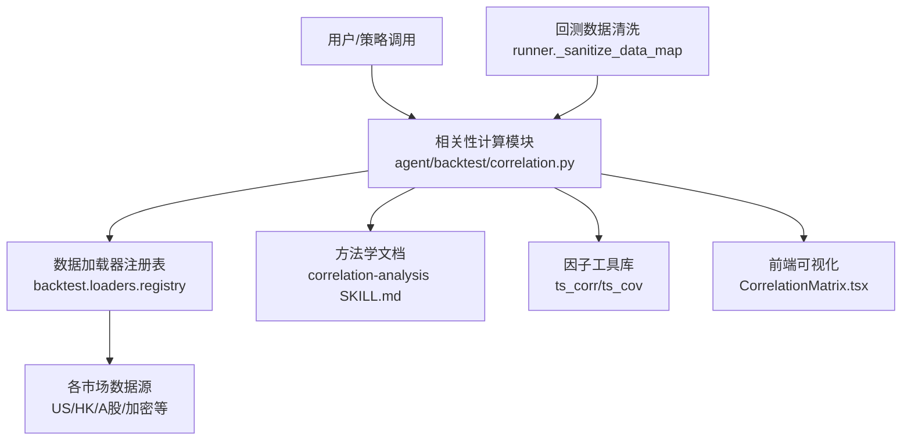
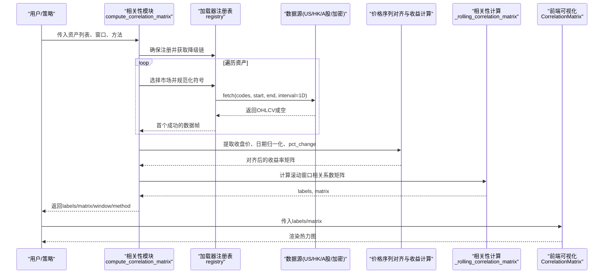
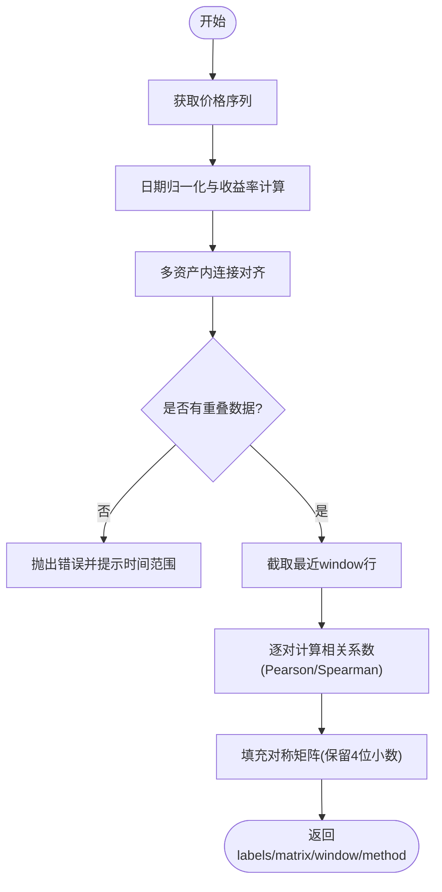
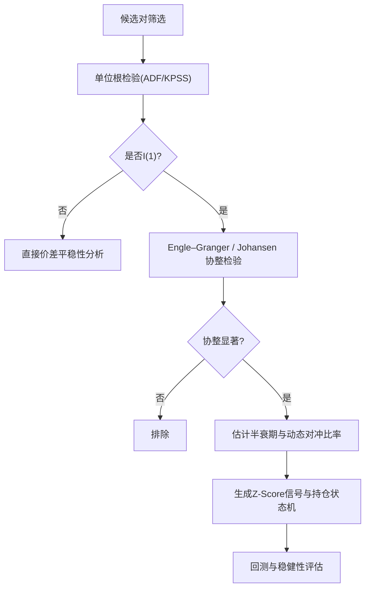
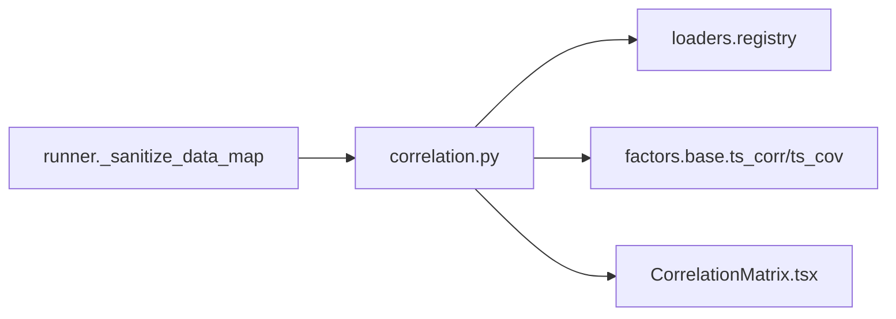

# 相关性分析

<cite>
**本文引用的文件**
- [agent/backtest/correlation.py](file://agent/backtest/correlation.py)
- [agent/src/skills/correlation-analysis/SKILL.md](file://agent/src/skills/correlation-analysis/SKILL.md)
- [agent/src/factors/base.py](file://agent/src/factors/base.py)
- [frontend/src/components/charts/CorrelationMatrix.tsx](file://frontend/src/components/charts/CorrelationMatrix.tsx)
- [agent/src/swarm/presets/pairs_research_lab.yaml](file://agent/src/swarm/presets/pairs_research_lab.yaml)
- [agent/src/swarm/presets/statistical_arbitrage_desk.yaml](file://agent/src/swarm/presets/statistical_arbitrage_desk.yaml)
- [agent/src/skills/correlation-regime/SKILL.md](file://agent/src/skills/correlation-regime/SKILL.md)
- [agent/backtest/runner.py](file://agent/backtest/runner.py)
- [agent/tests/test_correlation.py](file://agent/tests/test_correlation.py)
</cite>

## 目录
1. [简介](#简介)
2. [项目结构](#项目结构)
3. [核心组件](#核心组件)
4. [架构总览](#架构总览)
5. [详细组件分析](#详细组件分析)
6. [依赖关系分析](#依赖关系分析)
7. [性能考量](#性能考量)
8. [故障排查指南](#故障排查指南)
9. [结论](#结论)
10. [附录](#附录)

## 简介
本技术文档系统性梳理了相关性分析系统，覆盖资产间相关性计算（Pearson、Spearman、滚动相关性）、相关性矩阵构建（全样本、滚动窗口、动态相关性）、协整关系检测与配对交易机会识别、均值回归策略、相关性稳定性分析与结构性断点检测、相关性崩溃预警、可视化方案（热力图、网络图、时间序列图），以及实际应用案例（投资组合分散化、对冲策略构建、风险因子暴露分析）和数据质量与异常值处理注意事项。

## 项目结构
相关性能力由后端计算模块、技能文档（方法论与流程）、前端可视化组件和回测数据清洗管线共同构成：
- 后端计算：跨资产相关性矩阵计算、市场推断与符号归一化、价格序列对齐与收益率计算、滚动窗口相关系数矩阵。
- 技能与方法论：双变量深度相关性、聚类、危机期相关性崩溃检测、半衰期估计、信号生成等。
- 前端可视化：ECharts 热力图展示相关性矩阵。
- 回测数据清洗：统一清洗 OHLC 无效K线，避免脏数据污染相关性结果。

图表来源
- [agent/backtest/correlation.py:135-213](file://agent/backtest/correlation.py#L135-L213)
- [agent/src/skills/correlation-analysis/SKILL.md:85-157](file://agent/src/skills/correlation-analysis/SKILL.md#L85-L157)
- [agent/src/factors/base.py:164-193](file://agent/src/factors/base.py#L164-L193)
- [frontend/src/components/charts/CorrelationMatrix.tsx:23-100](file://frontend/src/components/charts/CorrelationMatrix.tsx#L23-L100)
- [agent/backtest/runner.py:1938-1955](file://agent/backtest/runner.py#L1938-L1955)

章节来源
- [agent/backtest/correlation.py:19-90](file://agent/backtest/correlation.py#L19-L90)
- [agent/backtest/correlation.py:216-319](file://agent/backtest/correlation.py#L216-L319)
- [agent/src/skills/correlation-analysis/SKILL.md:1-200](file://agent/src/skills/correlation-analysis/SKILL.md#L1-L200)
- [frontend/src/components/charts/CorrelationMatrix.tsx:1-122](file://frontend/src/components/charts/CorrelationMatrix.tsx#L1-L122)
- [agent/backtest/runner.py:1938-1955](file://agent/backtest/runner.py#L1938-L1955)

## 核心组件
- 相关性矩阵计算：支持 Pearson 与 Spearman，按交易日对齐并计算收益率，采用内连接对齐多资产时间序列，支持滚动窗口限制。
- 市场推断与符号归一化：自动识别加密、美股、港股、A股、韩股、加拿大股市，并将代码转换为加载器期望的规范符号。
- 数据获取与容错：遍历市场降级链，任一可用数据源返回有效数据即停止；对不可用或无数据的标的记录警告。
- 因子工具库：提供滚动相关系数与协方差计算，保证常数序列在窗口内产生 NaN 而非静默零。
- 前端可视化：基于 ECharts 的热力图渲染相关性矩阵，支持标签显示与主题切换。

章节来源
- [agent/backtest/correlation.py:135-213](file://agent/backtest/correlation.py#L135-L213)
- [agent/backtest/correlation.py:19-90](file://agent/backtest/correlation.py#L19-L90)
- [agent/backtest/correlation.py:216-319](file://agent/backtest/correlation.py#L216-L319)
- [agent/src/factors/base.py:164-193](file://agent/src/factors/base.py#L164-L193)
- [frontend/src/components/charts/CorrelationMatrix.tsx:23-100](file://frontend/src/components/charts/CorrelationMatrix.tsx#L23-L100)

## 架构总览
相关性分析从数据到可视化的端到端流程如下：

图表来源
- [agent/backtest/correlation.py:216-319](file://agent/backtest/correlation.py#L216-L319)
- [agent/backtest/correlation.py:135-213](file://agent/backtest/correlation.py#L135-L213)
- [frontend/src/components/charts/CorrelationMatrix.tsx:23-100](file://frontend/src/components/charts/CorrelationMatrix.tsx#L23-L100)

## 详细组件分析

### 相关性矩阵计算（Pearson/Spearman/滚动窗口）
- 输入：资产代码列表、回溯天数、方法（pearson/spearman）。
- 处理：
  - 推断市场并归一化符号，遍历降级链获取价格数据。
  - 提取收盘价，将索引归一化为日期（消除时区差异），计算百分比变化并丢弃缺失值。
  - 多资产收益率内连接对齐，若为空则报错并输出各资产时间范围。
  - 仅使用最后 window 行计算相关系数矩阵，对角线为1，非对角线对称填充。
- 输出：labels、matrix、window、method。

图表来源
- [agent/backtest/correlation.py:135-213](file://agent/backtest/correlation.py#L135-L213)
- [agent/backtest/correlation.py:216-319](file://agent/backtest/correlation.py#L216-L319)

章节来源
- [agent/backtest/correlation.py:135-213](file://agent/backtest/correlation.py#L135-L213)
- [agent/backtest/correlation.py:216-319](file://agent/backtest/correlation.py#L216-L319)
- [agent/tests/test_correlation.py:264-292](file://agent/tests/test_correlation.py#L264-L292)

### 市场推断与符号归一化
- 市场推断优先级：加密（后缀或包含“/”）、港股权益（.HK）、A股（.SH/.SZ/.BJ）、韩股（.KS/.KQ）、加股（.TO/.V）、美股（.US）、纯数字长度判断（6位A股、≤5位港股）、其余默认美股。
- 符号归一化：加密与已带交易所后缀的符号直接透传；美股追加.US；港股追加.HK；A股根据首位数字映射至.SH/.BJ/.SZ。

章节来源
- [agent/backtest/correlation.py:19-90](file://agent/backtest/correlation.py#L19-L90)

### 数据获取与容错机制
- 通过 registry.FALLBACK_CHAINS 按市场顺序尝试多个加载器，直到返回非空数据。
- 构造失败、不可用、请求异常、返回空均记录日志或警告，最终若无至少两个资产数据则抛出错误。

章节来源
- [agent/backtest/correlation.py:216-282](file://agent/backtest/correlation.py#L216-L282)
- [agent/backtest/correlation.py:285-319](file://agent/backtest/correlation.py#L285-L319)

### 因子工具库中的滚动相关与协方差
- ts_corr：按列滚动计算 Pearson 相关系数，窗口内常数序列返回 NaN，避免静默零。
- ts_cov：按列滚动计算样本协方差，同样处理无穷值。
- 这些工具可用于更细粒度的动态相关性监控与因子模型中。

章节来源
- [agent/src/factors/base.py:164-193](file://agent/src/factors/base.py#L164-L193)

### 可视化：相关性热力图
- 前端组件接收 labels 与 matrix，构建 ECharts heatmap 数据，设置颜色区间 [-1, 1]，支持标签显示与主题适配。
- 当 labels 为空时显示“无相关性数据”。

章节来源
- [frontend/src/components/charts/CorrelationMatrix.tsx:23-100](file://frontend/src/components/charts/CorrelationMatrix.tsx#L23-L100)
- [frontend/src/components/charts/CorrelationMatrix.tsx:118-122](file://frontend/src/components/charts/CorrelationMatrix.tsx#L118-L122)

### 方法论与流程：深度相关性、聚类、危机期相关性崩溃
- 双变量深度相关性：报告 Pearson、Spearman、Kendall，OLS Beta/R²，滚动相关，价差与Z-Score。
- 聚类：基于相关性距离矩阵进行层次聚类，输出排序后的热力图与簇标签。
- 危机期相关性崩溃：比较正常期与危机期的平均成对相关系数，计算滚动平均相关以检测结构性变化。

章节来源
- [agent/src/skills/correlation-analysis/SKILL.md:85-157](file://agent/src/skills/correlation-analysis/SKILL.md#L85-L157)
- [agent/src/skills/correlation-analysis/SKILL.md:158-200](file://agent/src/skills/correlation-analysis/SKILL.md#L158-L200)
- [agent/src/skills/correlation-analysis/SKILL.md:711-765](file://agent/src/skills/correlation-analysis/SKILL.md#L711-L765)

### 协整检验与配对交易机会识别
- 预条件：两腿均需为 I(1)，可使用 ADF/KPSS 确认；若为 I(0) 可直接分析价差平稳性。
- Engle–Granger：OLS 估计 β，残差 ADF 检验；Johansen：多资产扩展，迹统计量与最大特征值检验。
- 分类：强协整（EG p<0.01 + Johansen p<0.05）、弱协整（EG 0.01<p<0.05）、无协整（p>0.05）。
- 均值回归参数：OU 模型估计 θ、μ、σ，计算半衰期 t½ = ln(2)/θ，理想持有期参考 5–30 个交易日。
- 动态对冲比率：静态 OLS 与 Kalman 滤波（时变 β），VECM 短期调整与长期均衡。
- 综合评分：协整强度、半衰期、价差波动、Hurst 指数、历史稳定性。

图表来源
- [agent/src/swarm/presets/pairs_research_lab.yaml:70-123](file://agent/src/swarm/presets/pairs_research_lab.yaml#L70-L123)
- [agent/src/skills/correlation-analysis/SKILL.md:466-510](file://agent/src/skills/correlation-analysis/SKILL.md#L466-L510)
- [agent/src/skills/correlation-analysis/SKILL.md:790-894](file://agent/src/skills/correlation-analysis/SKILL.md#L790-L894)

章节来源
- [agent/src/swarm/presets/pairs_research_lab.yaml:70-123](file://agent/src/swarm/presets/pairs_research_lab.yaml#L70-L123)
- [agent/src/skills/correlation-analysis/SKILL.md:466-510](file://agent/src/skills/correlation-analysis/SKILL.md#L466-L510)
- [agent/src/skills/correlation-analysis/SKILL.md:790-894](file://agent/src/skills/correlation-analysis/SKILL.md#L790-L894)

### 相关性稳定性分析与结构性断点检测
- 危机期相关性崩溃测试：定义基准阈值划分危机日与正常日，计算各自平均成对相关系数及滚动平均相关，监测结构性变化。
- 价差健康度监控：跟踪最新半衰期、价差 ADF p 值，结合原始半衰期与相关性下降幅度给出健康评分与行动建议。
- 相关性重连线排行榜：追踪资产与市场的相关性行变化，捕捉缓慢“失血式”崩溃。

章节来源
- [agent/src/skills/correlation-analysis/SKILL.md:711-765](file://agent/src/skills/correlation-analysis/SKILL.md#L711-L765)
- [agent/src/skills/correlation-analysis/SKILL.md:883-941](file://agent/src/skills/correlation-analysis/SKILL.md#L883-L941)
- [agent/src/skills/correlation-regime/SKILL.md:339-363](file://agent/src/skills/correlation-regime/SKILL.md#L339-L363)

### 实际应用案例
- 投资组合分散化：利用聚类与相关性矩阵识别行业/因子暴露集中度，优化权重以降低组合整体相关性。
- 对冲策略构建：基于协整与动态对冲比率（Kalman）构建配对对冲，结合 Z-Score 阈值与事件过滤（财报、指数调仓、停牌恢复）。
- 风险因子暴露分析：通过因子暴露与相关性变化评估组合风格漂移与尾部风险，结合 VaR/CVaR 与压力测试。

章节来源
- [agent/src/swarm/presets/portfolio_review_board.yaml:65-94](file://agent/src/swarm/presets/portfolio_review_board.yaml#L65-L94)
- [agent/src/swarm/presets/pairs_research_lab.yaml:158-185](file://agent/src/swarm/presets/pairs_research_lab.yaml#L158-L185)
- [agent/src/swarm/presets/statistical_arbitrage_desk.yaml:25-47](file://agent/src/swarm/presets/statistical_arbitrage_desk.yaml#L25-L47)

### 数据质量与异常值处理注意事项
- OHLC 有效性校验：统一清洗管线会剔除高低价不合法、价格非正、高低未包围开收的无效K线，防止脏数据导致相关性指标失真。
- 缺失值与常数序列：收益率计算显式禁止前向填充；滚动相关在常数窗口返回 NaN，避免静默零误导。
- 数据对齐：不同市场时区需归一化至日期；内连接对齐确保仅在共同交易日计算相关性。

章节来源
- [agent/backtest/runner.py:1938-1955](file://agent/backtest/runner.py#L1938-L1955)
- [agent/backtest/correlation.py:162-176](file://agent/backtest/correlation.py#L162-L176)
- [agent/src/factors/base.py:164-180](file://agent/src/factors/base.py#L164-L180)

## 依赖关系分析
- 相关性模块依赖：
  - 数据加载器注册表与降级链（市场→加载器→数据源）。
  - 因子工具库（滚动相关/协方差）。
  - 前端可视化组件（ECharts 热力图）。
- 外部依赖：
  - pandas/numpy/scipy/statsmodels 用于统计计算。
  - ECharts 用于前端可视化。

图表来源
- [agent/backtest/correlation.py:216-282](file://agent/backtest/correlation.py#L216-L282)
- [agent/src/factors/base.py:164-193](file://agent/src/factors/base.py#L164-L193)
- [frontend/src/components/charts/CorrelationMatrix.tsx:23-100](file://frontend/src/components/charts/CorrelationMatrix.tsx#L23-L100)
- [agent/backtest/runner.py:1938-1955](file://agent/backtest/runner.py#L1938-L1955)

章节来源
- [agent/backtest/correlation.py:216-319](file://agent/backtest/correlation.py#L216-L319)
- [agent/src/factors/base.py:164-193](file://agent/src/factors/base.py#L164-L193)
- [frontend/src/components/charts/CorrelationMatrix.tsx:23-100](file://frontend/src/components/charts/CorrelationMatrix.tsx#L23-L100)
- [agent/backtest/runner.py:1938-1955](file://agent/backtest/runner.py#L1938-L1955)

## 性能考量
- 窗口大小与数据规模：滚动窗口越大，计算复杂度越高；建议根据数据频率与可用性合理设置。
- 常数序列与缺失值：确保窗口内有足够有效观测，否则返回 NaN，避免虚假低相关。
- 数据对齐与时区：归一化日期可减少跨市场对齐误差，提高相关性准确性。
- 前端渲染：热力图在资产数量较多时注意性能，可限制标签显示或分块渲染。

[本节为通用指导，无需特定文件引用]

## 故障排查指南
- 无重叠数据：若多资产收益率无法对齐，检查各资产时间范围与缺失值处理，必要时扩大回溯期或调整数据源。
- 数据为空：确认加载器可用性与符号归一化是否正确，查看日志中的警告信息。
- 相关性异常：检查是否存在常数序列或缺失值导致的 NaN/Inf，确保滚动窗口满足最小周期要求。
- 前端无数据：确认 labels 与 matrix 非空，检查组件初始化逻辑。

章节来源
- [agent/backtest/correlation.py:175-194](file://agent/backtest/correlation.py#L175-L194)
- [agent/backtest/correlation.py:238-282](file://agent/backtest/correlation.py#L238-L282)
- [agent/src/factors/base.py:164-180](file://agent/src/factors/base.py#L164-L180)
- [frontend/src/components/charts/CorrelationMatrix.tsx:118-122](file://frontend/src/components/charts/CorrelationMatrix.tsx#L118-L122)

## 结论
本相关性分析系统提供了从数据获取、清洗、对齐到相关性计算、可视化与策略应用的完整链路。通过 Pearson/Spearman 与滚动窗口方法，结合协整检验与均值回归策略，能够支持投资组合分散化、对冲策略构建与风险因子暴露分析。同时，危机期相关性崩溃检测与价差健康度监控为风险管理提供了实用工具。严格的数据质量与异常值处理确保了结果的可靠性。

[本节为总结，无需特定文件引用]

## 附录
- 常用方法与参数：
  - 滚动窗口：根据数据频率与策略持有期设定（如 60 日）。
  - 相关性方法：Pearson 适用于线性关系；Spearman 适用于单调关系与含异常值场景。
  - 协整检验：Engle–Granger 与 Johansen 结合，辅以 ADF/KPSS 预检。
  - 信号阈值：Z-Score 进入/退出/止损阈值可根据历史分布与波动率动态调整。
- 可视化模板：
  - 滚动相关性时间序列图：展示不同窗口下的相关性演化。
  - 热力图：直观呈现资产间相关性结构。
  - 网络图：基于相关性距离进行聚类与网络拓扑分析。

[本节为补充说明，无需特定文件引用]