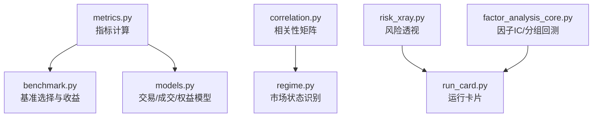
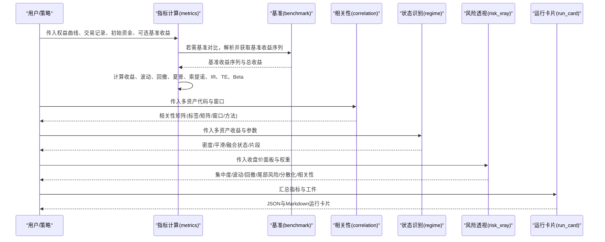
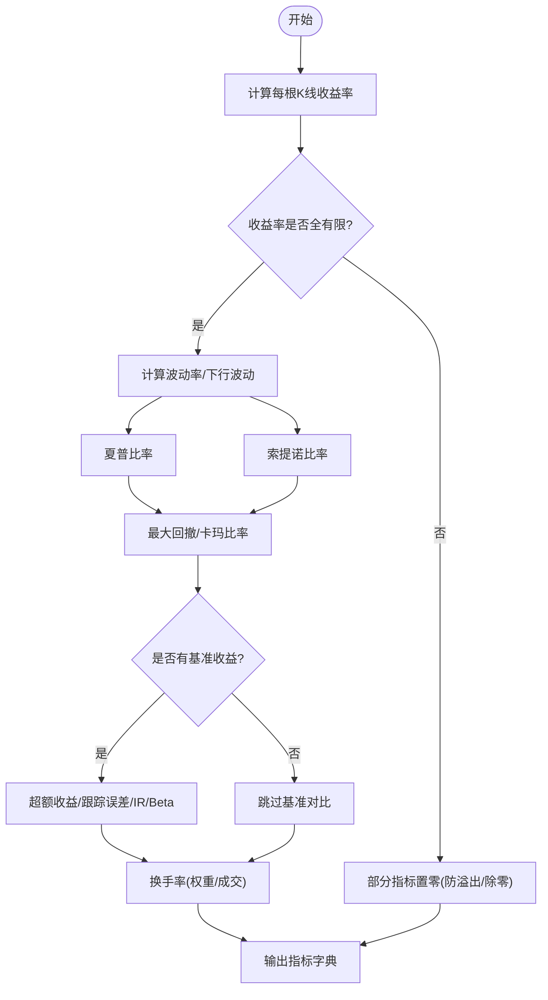
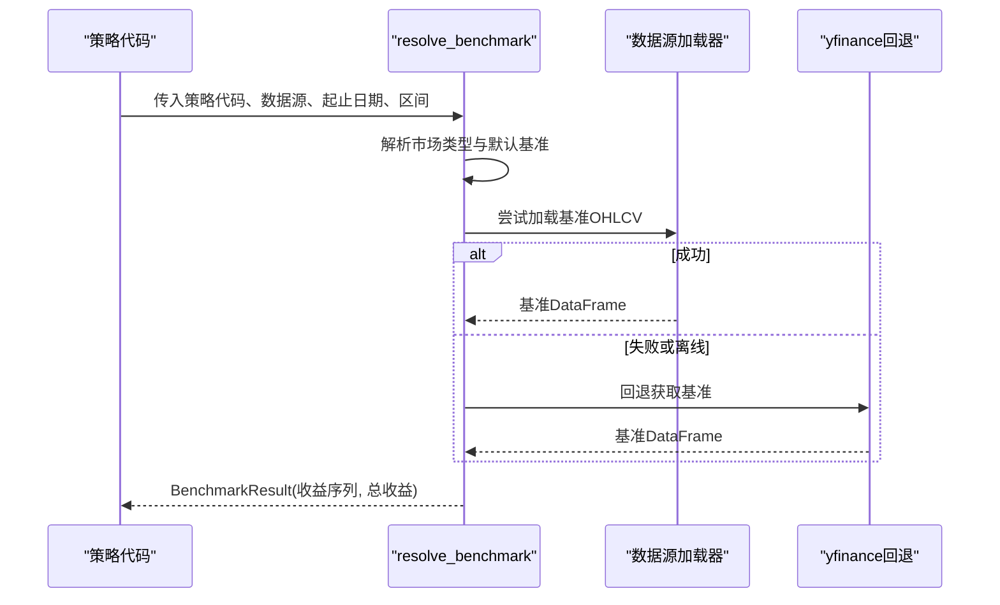
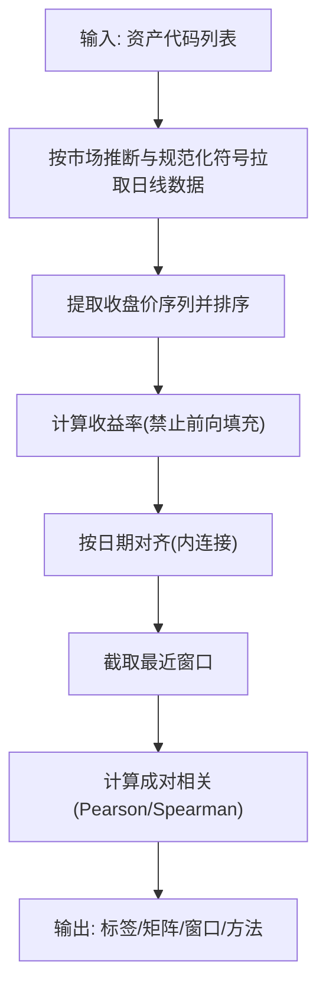
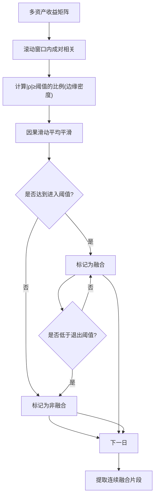
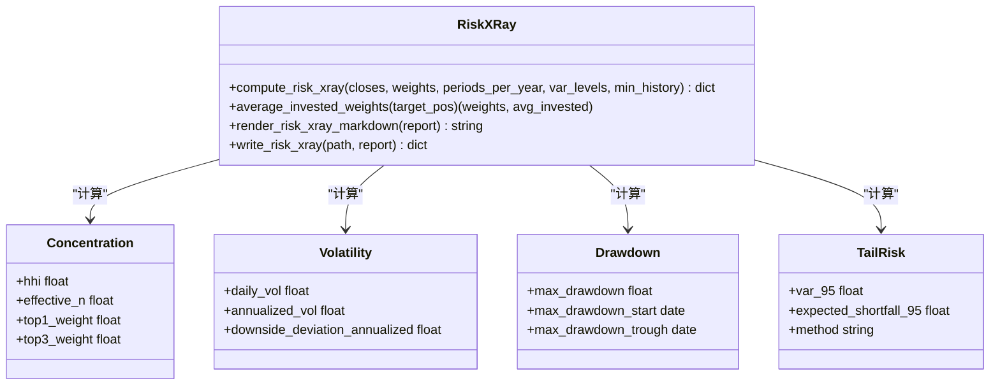
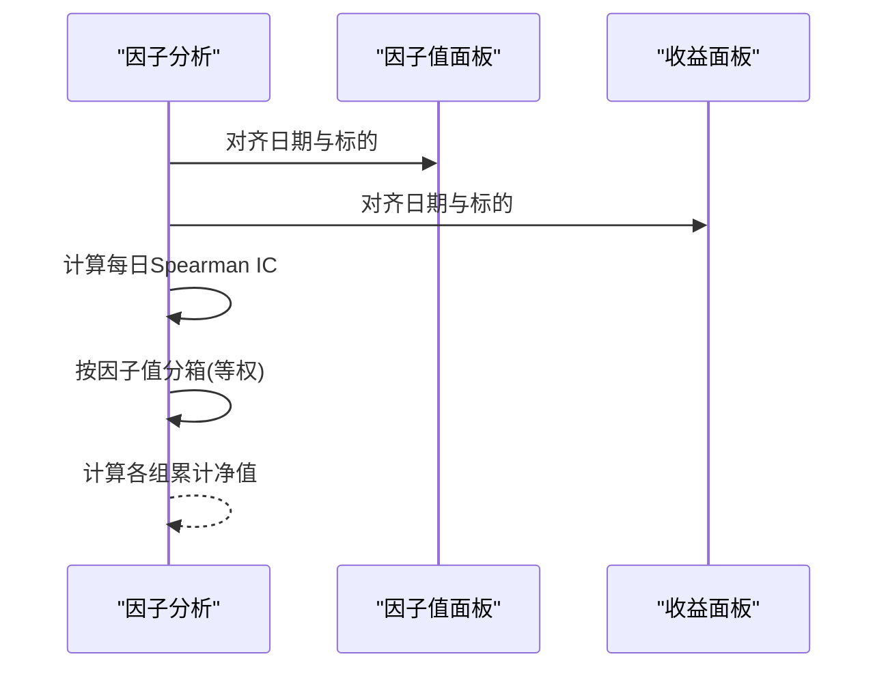
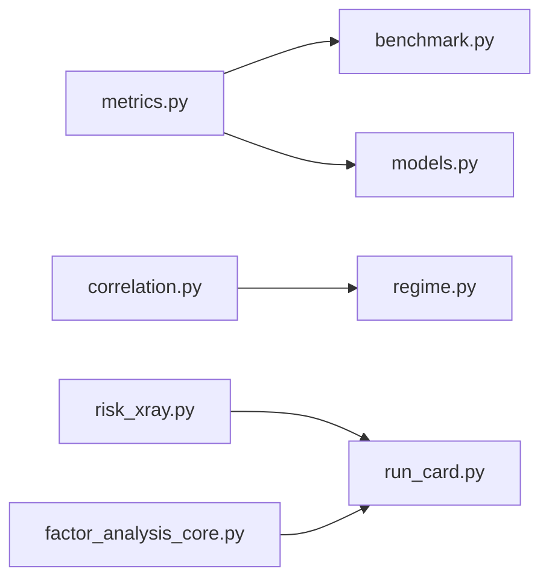

# 绩效评估与指标

<cite>
**本文引用的文件**
- [agent/backtest/metrics.py](file://agent/backtest/metrics.py)
- [agent/backtest/benchmark.py](file://agent/backtest/benchmark.py)
- [agent/backtest/correlation.py](file://agent/backtest/correlation.py)
- [agent/backtest/regime.py](file://agent/backtest/regime.py)
- [agent/backtest/risk_xray.py](file://agent/backtest/risk_xray.py)
- [agent/backtest/models.py](file://agent/backtest/models.py)
- [agent/backtest/run_card.py](file://agent/backtest/run_card.py)
- [agent/src/factors/factor_analysis_core.py](file://agent/src/factors/factor_analysis_core.py)
</cite>

## 目录
1. [简介](#简介)
2. [项目结构](#项目结构)
3. [核心组件](#核心组件)
4. [架构总览](#架构总览)
5. [详细组件分析](#详细组件分析)
6. [依赖关系分析](#依赖关系分析)
7. [性能考虑](#性能考虑)
8. [故障排查指南](#故障排查指南)
9. [结论](#结论)
10. [附录：使用示例](#附录使用示例)

## 简介
本技术文档聚焦于“绩效评估与指标系统”，覆盖以下能力：
- 关键绩效指标计算与含义：收益率、夏普比率、最大回撤、索提诺比率、信息比率、跟踪误差、基准贝塔等。
- 基准比较：自动基准选择与收益对比，超额收益与跟踪误差度量。
- 相关性分析：资产间相关性矩阵、滚动窗口方法、市场状态识别（融合/非融合）。
- 风险透视：集中度、波动率、回撤、尾部风险、分散化与相关性摘要。
- 报告输出：运行卡片（JSON/Markdown）、风险透视报告、因子IC/分组回测。
- 实际使用示例：从简单绩效分析到复杂归因与基准对比的端到端流程。

## 项目结构
围绕绩效评估的核心模块位于 backtest 与 factors 子系统中：
- metrics.py：统一指标计算（年化、收益序列、交易统计、基准对比、换手率等）。
- benchmark.py：基准代码解析与数据获取，提供基准收益序列。
- correlation.py：多资产相关性矩阵计算（Pearson/Spearman），支持滚动窗口。
- regime.py：基于相关性的市场状态识别（边缘密度+滞后阈值的状态机）。
- risk_xray.py：组合风险透视（集中度、波动率、回撤、尾部风险、分散化、相关性）。
- models.py：回测引擎共享数据结构（持仓、成交、交易、权益快照）。
- run_card.py：回测运行卡片（JSON/Markdown）生成，便于归档与复现。
- factor_analysis_core.py：因子分析核心（IC序列、分层回测净值）。

**图表来源**
- [agent/backtest/metrics.py:461-626](file://agent/backtest/metrics.py#L461-L626)
- [agent/backtest/benchmark.py:40-102](file://agent/backtest/benchmark.py#L40-L102)
- [agent/backtest/correlation.py:285-319](file://agent/backtest/correlation.py#L285-L319)
- [agent/backtest/regime.py:147-235](file://agent/backtest/regime.py#L147-L235)
- [agent/backtest/risk_xray.py:86-176](file://agent/backtest/risk_xray.py#L86-L176)
- [agent/backtest/run_card.py:25-95](file://agent/backtest/run_card.py#L25-L95)
- [agent/src/factors/factor_analysis_core.py:8-47](file://agent/src/factors/factor_analysis_core.py#L8-L47)

**章节来源**
- [agent/backtest/metrics.py:16-170](file://agent/backtest/metrics.py#L16-L170)
- [agent/backtest/benchmark.py:23-31](file://agent/backtest/benchmark.py#L23-L31)
- [agent/backtest/correlation.py:19-89](file://agent/backtest/correlation.py#L19-L89)
- [agent/backtest/regime.py:24-98](file://agent/backtest/regime.py#L24-L98)
- [agent/backtest/risk_xray.py:31-34](file://agent/backtest/risk_xray.py#L31-L34)
- [agent/backtest/models.py:13-118](file://agent/backtest/models.py#L13-L118)
- [agent/backtest/run_card.py:13-22](file://agent/backtest/run_card.py#L13-L22)
- [agent/src/factors/factor_analysis_core.py:1-103](file://agent/src/factors/factor_analysis_core.py#L1-L103)

## 核心组件
- 指标计算（metrics.py）
  - 年化因子映射：按数据源与K线周期计算每年K线数，确保波动率/夏普等指标正确年化。
  - 安全收益率：处理零或负价格场景，避免无穷大或NaN污染聚合。
  - 交易统计：胜率、盈亏比、最大连续亏损、平均持仓期、利润因子。
  - 换手率：权重变化与实际成交两种口径，支持执行证据对齐。
  - 综合指标：总收益、年化收益、最大回撤、夏普、卡玛、索提诺、信息比率、跟踪误差、基准贝塔等。
- 基准比较（benchmark.py）
  - 市场类型到默认基准映射（如美股SPY、A股沪深300、加密货币BTC-USDT等）。
  - 通过配置的数据源或yfinance回退获取基准收盘价并计算收益序列与总收益。
- 相关性分析（correlation.py）
  - 自动推断市场与标准化符号，拉取日线数据，对齐日期后计算滚动相关性矩阵（Pearson/Spearman）。
- 市场状态识别（regime.py）
  - 将滚动相关性矩阵压缩为“边缘密度”标量，平滑后以双阈值滞后触发器判定“融合/非融合”状态。
- 风险透视（risk_xray.py）
  - 输入为收盘价面板与权重，输出集中度（HHI、有效N）、波动率（日/年、下行波动）、回撤、尾部风险（VaR/ES）、分散化比率、相关性摘要。
- 因子分析（factor_analysis_core.py）
  - 每日Spearman IC序列；按因子值分组的等权分层回测累计净值。
- 运行卡片（run_card.py）
  - 将配置摘要、指标、警告、工件引用写入JSON与Markdown，便于归档与复现。

**章节来源**
- [agent/backtest/metrics.py:245-302](file://agent/backtest/metrics.py#L245-L302)
- [agent/backtest/metrics.py:266-342](file://agent/backtest/metrics.py#L266-L342)
- [agent/backtest/metrics.py:441-531](file://agent/backtest/metrics.py#L441-L531)
- [agent/backtest/metrics.py:461-626](file://agent/backtest/metrics.py#L461-L626)
- [agent/backtest/benchmark.py:40-102](file://agent/backtest/benchmark.py#L40-L102)
- [agent/backtest/correlation.py:135-213](file://agent/backtest/correlation.py#L135-L213)
- [agent/backtest/regime.py:24-98](file://agent/backtest/regime.py#L24-L98)
- [agent/backtest/risk_xray.py:86-176](file://agent/backtest/risk_xray.py#L86-L176)
- [agent/src/factors/factor_analysis_core.py:8-47](file://agent/src/factors/factor_analysis_core.py#L8-L47)
- [agent/backtest/run_card.py:25-95](file://agent/backtest/run_card.py#L25-L95)

## 架构总览
下图展示了从数据到指标、基准、相关性、市场状态、风险透视与报告的端到端流程。

**图表来源**
- [agent/backtest/metrics.py:461-626](file://agent/backtest/metrics.py#L461-L626)
- [agent/backtest/benchmark.py:40-102](file://agent/backtest/benchmark.py#L40-L102)
- [agent/backtest/correlation.py:285-319](file://agent/backtest/correlation.py#L285-L319)
- [agent/backtest/regime.py:147-235](file://agent/backtest/regime.py#L147-L235)
- [agent/backtest/risk_xray.py:86-176](file://agent/backtest/risk_xray.py#L86-L176)
- [agent/backtest/run_card.py:25-95](file://agent/backtest/run_card.py#L25-L95)

## 详细组件分析

### 指标计算（metrics.py）
- 年化因子与K线计数
  - 根据数据源与K线周期映射每年K线数，保证波动率与风险调整后收益的正确年化。
- 安全收益率与买入持有收益
  - 对零/负价格进行保护，避免无穷大或NaN污染；采用价格相对而非连乘积计算总收益，保证极端情况下的稳健性。
- 交易统计
  - 胜率、盈亏比、最大连续亏损、平均持仓期、利润因子；按标的与退出原因分组统计。
- 换手率
  - 权重变化口径与实际成交口径两种实现，均对齐到权益曲线时间轴。
- 综合指标
  - 总收益、年化收益、最大回撤、夏普、卡玛、索提诺、信息比率、跟踪误差、基准贝塔；空数据时返回零值占位。

**图表来源**
- [agent/backtest/metrics.py:461-626](file://agent/backtest/metrics.py#L461-L626)
- [agent/backtest/metrics.py:245-302](file://agent/backtest/metrics.py#L245-L302)
- [agent/backtest/metrics.py:441-531](file://agent/backtest/metrics.py#L441-L531)

**章节来源**
- [agent/backtest/metrics.py:16-170](file://agent/backtest/metrics.py#L16-L170)
- [agent/backtest/metrics.py:245-302](file://agent/backtest/metrics.py#L245-L302)
- [agent/backtest/metrics.py:266-342](file://agent/backtest/metrics.py#L266-L342)
- [agent/backtest/metrics.py:441-531](file://agent/backtest/metrics.py#L441-L531)
- [agent/backtest/metrics.py:461-626](file://agent/backtest/metrics.py#L461-L626)

### 基准比较（benchmark.py）
- 市场类型到默认基准映射：美股SPY、A股000300.SH、港股恒生中国企业ETF、加密货币BTC-USDT等。
- 基准收益序列：优先使用配置的数据源加载器，失败则回退至yfinance（离线模式关闭回退）。
- 收益计算：使用安全的收益率函数与买入持有收益函数，保证极端价格路径下的稳健性。

**图表来源**
- [agent/backtest/benchmark.py:40-102](file://agent/backtest/benchmark.py#L40-L102)
- [agent/backtest/benchmark.py:162-208](file://agent/backtest/benchmark.py#L162-L208)

**章节来源**
- [agent/backtest/benchmark.py:23-31](file://agent/backtest/benchmark.py#L23-L31)
- [agent/backtest/benchmark.py:40-102](file://agent/backtest/benchmark.py#L40-L102)
- [agent/backtest/benchmark.py:138-188](file://agent/backtest/benchmark.py#L138-L188)
- [agent/backtest/benchmark.py:162-208](file://agent/backtest/benchmark.py#L162-L208)

### 相关性分析（correlation.py）
- 市场推断与符号标准化：自动识别加密货币、港A美韩加等市场，并将裸代码转换为加载器期望的规范符号。
- 数据对齐与收益计算：提取收盘价序列，归一化到日期并对齐，显式避免前向填充制造虚假收益。
- 滚动相关性矩阵：在指定窗口内计算成对Pearson或Spearman相关系数，返回标签与对称矩阵。

**图表来源**
- [agent/backtest/correlation.py:19-89](file://agent/backtest/correlation.py#L19-L89)
- [agent/backtest/correlation.py:135-213](file://agent/backtest/correlation.py#L135-L213)
- [agent/backtest/correlation.py:285-319](file://agent/backtest/correlation.py#L285-L319)

**章节来源**
- [agent/backtest/correlation.py:19-89](file://agent/backtest/correlation.py#L19-L89)
- [agent/backtest/correlation.py:135-213](file://agent/backtest/correlation.py#L135-L213)
- [agent/backtest/correlation.py:285-319](file://agent/backtest/correlation.py#L285-L319)

### 市场状态识别（regime.py）
- 边缘密度：在每个滚动窗口内计算成对相关绝对值超过阈值的比例，得到[0,1]的融合度标量。
- 平滑与滞后：对密度序列做因果滑动平均，使用进入/退出双阈值的状态机标记“融合/非融合”。
- 时间线与片段：输出每日密度、平滑值、融合状态，以及连续的融合片段起止。

**图表来源**
- [agent/backtest/regime.py:24-98](file://agent/backtest/regime.py#L24-L98)
- [agent/backtest/regime.py:147-235](file://agent/backtest/regime.py#L147-L235)

**章节来源**
- [agent/backtest/regime.py:24-98](file://agent/backtest/regime.py#L24-L98)
- [agent/backtest/regime.py:101-122](file://agent/backtest/regime.py#L101-L122)
- [agent/backtest/regime.py:147-235](file://agent/backtest/regime.py#L147-L235)

### 风险透视（risk_xray.py）
- 输入校验与权重归一化：拒绝未知标的与负权重，自动归一化为1.0并提示。
- 历史过滤与对齐：剔除历史不足标的，按日历对齐后计算加权组合收益。
- 指标输出：
  - 集中度：HHI、有效N、Top1/Top3权重。
  - 波动率：日波动、年化波动、下行波动年化。
  - 回撤：最大回撤及起止点。
  - 尾部风险：历史模拟VaR与预期短缺（ES）。
  - 分散化：组合波动与加权资产波动的比值。
  - 相关性：平均成对相关绝对值、最大相关对、等权市场Beta。
- 报告渲染：可输出紧凑Markdown摘要与严格JSON文件。

**图表来源**
- [agent/backtest/risk_xray.py:86-176](file://agent/backtest/risk_xray.py#L86-L176)
- [agent/backtest/risk_xray.py:179-287](file://agent/backtest/risk_xray.py#L179-L287)
- [agent/backtest/risk_xray.py:309-387](file://agent/backtest/risk_xray.py#L309-L387)

**章节来源**
- [agent/backtest/risk_xray.py:31-34](file://agent/backtest/risk_xray.py#L31-L34)
- [agent/backtest/risk_xray.py:48-84](file://agent/backtest/risk_xray.py#L48-L84)
- [agent/backtest/risk_xray.py:86-176](file://agent/backtest/risk_xray.py#L86-L176)
- [agent/backtest/risk_xray.py:179-287](file://agent/backtest/risk_xray.py#L179-L287)
- [agent/backtest/risk_xray.py:309-387](file://agent/backtest/risk_xray.py#L309-L387)

### 因子分析与归因（factor_analysis_core.py）
- IC序列：每日Spearman秩相关，仅保留当日有足够有效观测的日期。
- 分层回测：按因子值每日分箱（分位数或等宽），等权持有组别并计算累计净值，用于风格暴露与归因观察。

**图表来源**
- [agent/src/factors/factor_analysis_core.py:8-47](file://agent/src/factors/factor_analysis_core.py#L8-L47)
- [agent/src/factors/factor_analysis_core.py:50-103](file://agent/src/factors/factor_analysis_core.py#L50-L103)

**章节来源**
- [agent/src/factors/factor_analysis_core.py:1-103](file://agent/src/factors/factor_analysis_core.py#L1-L103)

### 运行卡片（run_card.py）
- 将回测配置摘要、指标、警告、工件引用写入JSON与Markdown，包含哈希与时间戳，便于复现与审计。
- 仅存储标量指标，复杂对象单独存放，保证卡片简洁可读。

**章节来源**
- [agent/backtest/run_card.py:25-95](file://agent/backtest/run_card.py#L25-L95)
- [agent/backtest/run_card.py:121-144](file://agent/backtest/run_card.py#L121-L144)
- [agent/backtest/run_card.py:181-250](file://agent/backtest/run_card.py#L181-L250)

## 依赖关系分析
- 指标计算依赖基准模块与交易/成交模型，形成闭环的回测评估。
- 相关性模块与市场状态识别共享数据拉取与对齐逻辑，确保跨市场可比性。
- 风险透视独立于I/O，仅依赖价格与权重，便于工具/API复用。
- 因子分析为归因与风格暴露提供基础统计与分组净值。

**图表来源**
- [agent/backtest/metrics.py:461-626](file://agent/backtest/metrics.py#L461-L626)
- [agent/backtest/benchmark.py:40-102](file://agent/backtest/benchmark.py#L40-L102)
- [agent/backtest/correlation.py:285-319](file://agent/backtest/correlation.py#L285-L319)
- [agent/backtest/regime.py:147-235](file://agent/backtest/regime.py#L147-L235)
- [agent/backtest/risk_xray.py:86-176](file://agent/backtest/risk_xray.py#L86-L176)
- [agent/backtest/run_card.py:25-95](file://agent/backtest/run_card.py#L25-L95)
- [agent/src/factors/factor_analysis_core.py:8-47](file://agent/src/factors/factor_analysis_core.py#L8-L47)

**章节来源**
- [agent/backtest/metrics.py:461-626](file://agent/backtest/metrics.py#L461-L626)
- [agent/backtest/benchmark.py:40-102](file://agent/backtest/benchmark.py#L40-L102)
- [agent/backtest/correlation.py:285-319](file://agent/backtest/correlation.py#L285-L319)
- [agent/backtest/regime.py:147-235](file://agent/backtest/regime.py#L147-L235)
- [agent/backtest/risk_xray.py:86-176](file://agent/backtest/risk_xray.py#L86-L176)
- [agent/backtest/run_card.py:25-95](file://agent/backtest/run_card.py#L25-L95)
- [agent/src/factors/factor_analysis_core.py:8-47](file://agent/src/factors/factor_analysis_core.py#L8-L47)

## 性能考虑
- 年化因子与K线计数：不同数据源与周期的年化差异显著，错误设置会导致波动率与风险调整指标失真。
- 小样本保护：单观测或极短序列下标准差与协方差可能不稳定，代码中对std/ddof与异常值进行了防护。
- 对齐与缺失：相关性计算显式禁止前向填充，避免构造虚假收益；对齐失败会抛出明确错误以便定位。
- 极端路径：权益曲线出现零或负值时，年化收益与复合收益采取保守处理，防止溢出或复数为实数转换崩溃。
- I/O隔离：风险透视不直接访问网络或加载器，降低外部依赖带来的不确定性。

[本节为通用指导，无需特定文件来源]

## 故障排查指南
- 无重叠收益数据
  - 现象：相关性或风险透视报错“无重叠收益观测”。
  - 排查：检查各资产起止日期与日历对齐；确认未使用前向填充掩盖缺失。
  - 参考：[correlation.py:175-194](file://agent/backtest/correlation.py#L175-L194)、[risk_xray.py:147-155](file://agent/backtest/risk_xray.py#L147-L155)
- 基准无法获取
  - 现象：基准结果为None。
  - 排查：确认市场类型与默认基准匹配；离线模式下回退被禁用；检查加载器可用性。
  - 参考：[benchmark.py:67-102](file://agent/backtest/benchmark.py#L67-L102)、[benchmark.py:162-208](file://agent/backtest/benchmark.py#L162-L208)
- 年化因子不正确
  - 现象：夏普/波动率异常。
  - 排查：核对数据源与K线周期映射；确认bars_per_year设置合理。
  - 参考：[metrics.py:16-170](file://agent/backtest/metrics.py#L16-L170)
- 权益曲线含零/负值
  - 现象：年化收益或复合收益异常。
  - 排查：检查杠杆/空头导致权益降至零或以下；代码已做保护，但仍需审视策略逻辑。
  - 参考：[metrics.py:576-592](file://agent/backtest/metrics.py#L576-L592)
- 因子IC为空
  - 现象：IC序列为空。
  - 排查：检查因子与收益的公共日期/标的数量；确保每日至少5个有效观测。
  - 参考：[factor_analysis_core.py:8-47](file://agent/src/factors/factor_analysis_core.py#L8-L47)

**章节来源**
- [agent/backtest/correlation.py:175-194](file://agent/backtest/correlation.py#L175-L194)
- [agent/backtest/risk_xray.py:147-155](file://agent/backtest/risk_xray.py#L147-L155)
- [agent/backtest/benchmark.py:67-102](file://agent/backtest/benchmark.py#L67-L102)
- [agent/backtest/benchmark.py:162-208](file://agent/backtest/benchmark.py#L162-L208)
- [agent/backtest/metrics.py:16-170](file://agent/backtest/metrics.py#L16-L170)
- [agent/backtest/metrics.py:576-592](file://agent/backtest/metrics.py#L576-L592)
- [agent/src/factors/factor_analysis_core.py:8-47](file://agent/src/factors/factor_analysis_core.py#L8-L47)

## 结论
该绩效评估与指标系统提供了从基础指标到高级归因与风险透视的完整能力链：
- 指标计算稳健且可解释，涵盖收益、风险、换手与基准对比。
- 基准模块灵活适配多市场，支持离线与在线回退。
- 相关性分析与市场状态识别帮助理解宏观环境与资产联动。
- 风险透视提供组合层面的深度洞察，便于优化与风控。
- 运行卡片与因子分析增强可复现性与归因能力。
建议在实际使用中结合业务场景选择合适的窗口、方法与参数，并关注数据对齐与小样本保护。

[本节为总结性内容，无需特定文件来源]

## 附录：使用示例
以下为从简单到复杂的典型使用流程（以调用接口为主，不展示具体代码）：
- 简单绩效分析
  - 准备权益曲线、交易记录与初始资金，调用指标计算函数，获得总收益、年化收益、夏普、索提诺、最大回撤等信息。
  - 参考：[metrics.py:461-626](file://agent/backtest/metrics.py#L461-L626)
- 基准对比与超额收益
  - 通过基准模块解析市场类型与默认基准，获取基准收益序列，再计算超额收益、跟踪误差与信息比率。
  - 参考：[benchmark.py:40-102](file://agent/backtest/benchmark.py#L40-L102)、[metrics.py:640-672](file://agent/backtest/metrics.py#L640-L672)
- 相关性矩阵与滚动窗口
  - 输入多资产代码与窗口，获取Pearson或Spearman相关性矩阵，用于资产配置与风险分散。
  - 参考：[correlation.py:285-319](file://agent/backtest/correlation.py#L285-L319)
- 市场状态识别
  - 基于相关性矩阵计算边缘密度，平滑后用双阈值状态机判断融合/非融合，辅助风险管理。
  - 参考：[regime.py:147-235](file://agent/backtest/regime.py#L147-L235)
- 组合风险透视
  - 输入收盘价面板与权重，输出集中度、波动率、回撤、尾部风险、分散化与相关性摘要。
  - 参考：[risk_xray.py:86-176](file://agent/backtest/risk_xray.py#L86-L176)
- 因子归因与分组回测
  - 计算每日IC序列，并按因子值分组建仓，观察分组净值表现，辅助风格归因。
  - 参考：[factor_analysis_core.py:8-47](file://agent/src/factors/factor_analysis_core.py#L8-L47)、[factor_analysis_core.py:50-103](file://agent/src/factors/factor_analysis_core.py#L50-L103)
- 报告归档
  - 将指标与工件写入运行卡片（JSON/Markdown），便于审计与复现。
  - 参考：[run_card.py:25-95](file://agent/backtest/run_card.py#L25-L95)

**章节来源**
- [agent/backtest/metrics.py:461-626](file://agent/backtest/metrics.py#L461-L626)
- [agent/backtest/benchmark.py:40-102](file://agent/backtest/benchmark.py#L40-L102)
- [agent/backtest/correlation.py:285-319](file://agent/backtest/correlation.py#L285-L319)
- [agent/backtest/regime.py:147-235](file://agent/backtest/regime.py#L147-L235)
- [agent/backtest/risk_xray.py:86-176](file://agent/backtest/risk_xray.py#L86-L176)
- [agent/src/factors/factor_analysis_core.py:8-47](file://agent/src/factors/factor_analysis_core.py#L8-L47)
- [agent/src/factors/factor_analysis_core.py:50-103](file://agent/src/factors/factor_analysis_core.py#L50-L103)
- [agent/backtest/run_card.py:25-95](file://agent/backtest/run_card.py#L25-L95)