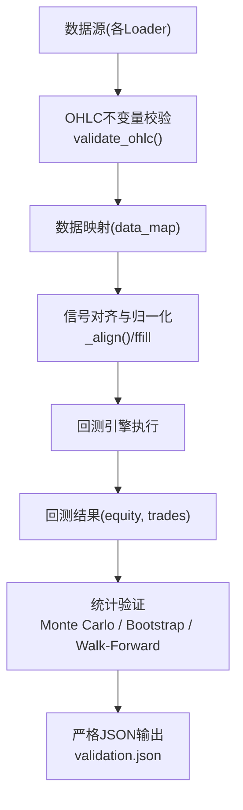
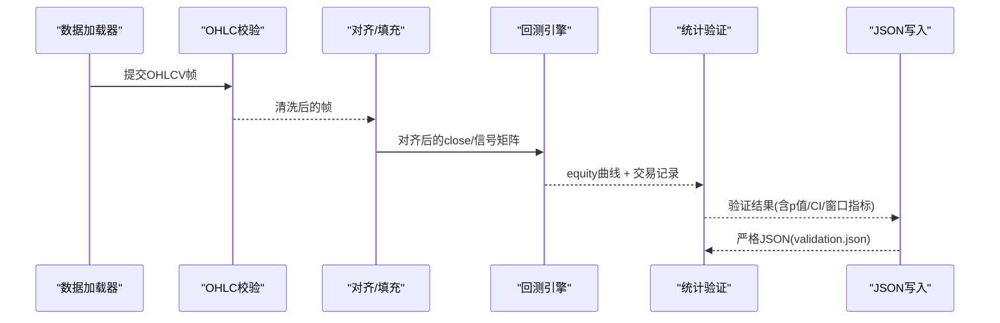
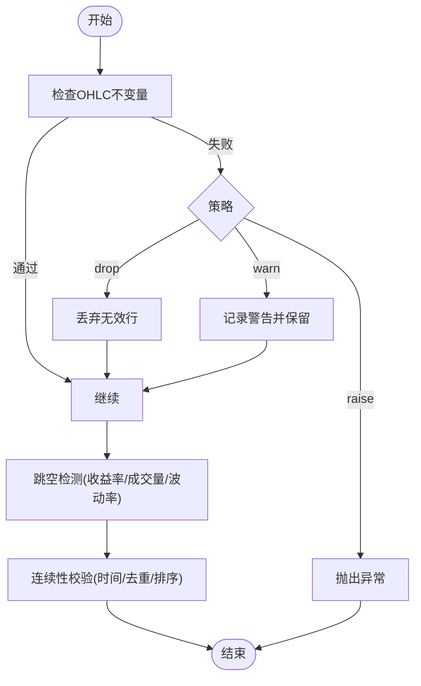
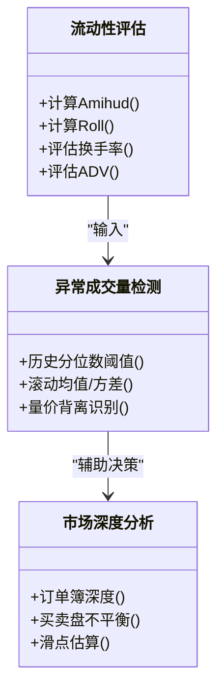
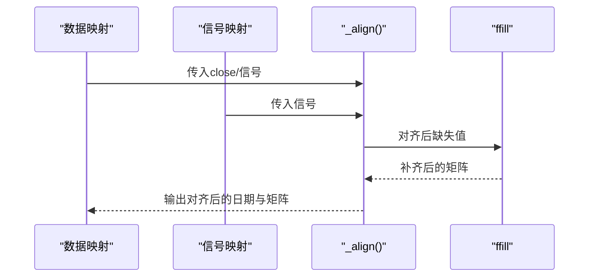
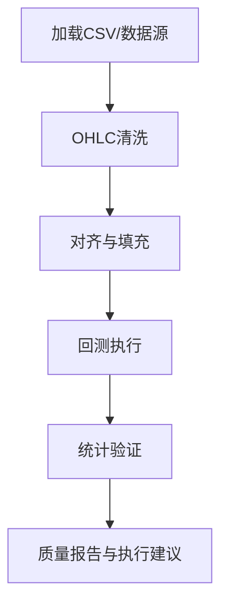
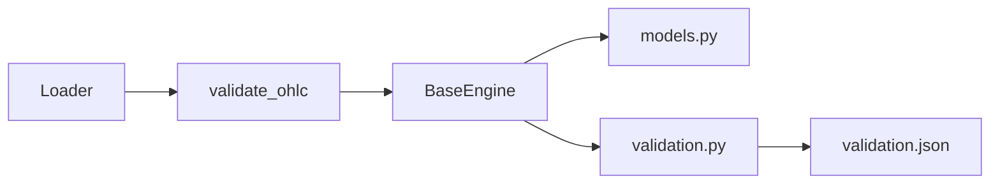

# 数据验证机制

<cite>
**本文引用的文件**
- [agent/backtest/validation.py](file://agent/backtest/validation.py)
- [agent/backtest/loaders/base.py](file://agent/backtest/loaders/base.py)
- [agent/backtest/models.py](file://agent/backtest/models.py)
- [agent/tests/test_ohlc_validation.py](file://agent/tests/test_ohlc_validation.py)
- [agent/tests/test_validation.py](file://agent/tests/test_validation.py)
- [agent/src/skills/market-microstructure/SKILL.md](file://agent/src/skills/market-microstructure/SKILL.md)
- [agent/src/swarm/presets/statistical_arbitrage_desk.yaml](file://agent/src/swarm/presets/statistical_arbitrage_desk.yaml)
- [agent/src/swarm/presets/crypto_trading_desk.yaml](file://agent/src/swarm/presets/crypto_trading_desk.yaml)
- [agent/tests/test_signal_alignment_perf.py](file://agent/tests/test_signal_alignment_perf.py)
- [agent/tests/test_base_engine.py](file://agent/tests/test_base_engine.py)
</cite>

## 目录
1. [简介](#简介)
2. [项目结构](#项目结构)
3. [核心组件](#核心组件)
4. [架构总览](#架构总览)
5. [详细组件分析](#详细组件分析)
6. [依赖关系分析](#依赖关系分析)
7. [性能考量](#性能考量)
8. [故障诊断指南](#故障诊断指南)
9. [结论](#结论)
10. [附录](#附录)

## 简介
本技术文档系统化梳理本仓库中的数据验证与质量控制机制，覆盖价格异常检测、成交量与流动性校验、数据完整性检查、质量评分体系、数据清洗工具以及端到端应用案例。重点围绕以下目标展开：
- 价格异常检测：异常值识别、跳空缺口检测、价格连续性验证
- 成交量验证：异常成交量检测、流动性评估与市场深度分析
- 数据完整性：缺失数据处理、时间序列对齐、一致性校验
- 质量评分：指标计算、评级标准、改进建议
- 数据清洗：异常值修正、插值方法、标准化
- 实战案例：从基础验证到复杂质量控制流程
- 性能优化与故障诊断

## 项目结构
本项目在回测与数据加载层提供了完善的数据验证能力：
- 数据加载边界校验：统一的 OHLC 不变量校验（base.py）
- 回测结果统计验证：蒙特卡洛置换检验、Bootstrap Sharpe 置信区间、滚动窗口一致性（validation.py）
- 模型与数据结构：交易记录、持仓快照等（models.py）
- 市场微观结构与流动性技能：Amihud、Roll、订单簿失衡、冲击成本等（market-microstructure SKILL.md）
- 策略工作流中的流动性/深度要求：量化套利与加密交易面板（presets）
- 信号对齐与时间序列处理：对齐、前向填充、索引时区保持（tests）

图表来源
- [agent/backtest/loaders/base.py:187-256](file://agent/backtest/loaders/base.py#L187-L256)
- [agent/backtest/validation.py:291-346](file://agent/backtest/validation.py#L291-L346)
- [agent/tests/test_signal_alignment_perf.py:136-166](file://agent/tests/test_signal_alignment_perf.py#L136-L166)

章节来源
- [agent/backtest/loaders/base.py:187-256](file://agent/backtest/loaders/base.py#L187-L256)
- [agent/backtest/validation.py:291-346](file://agent/backtest/validation.py#L291-L346)
- [agent/tests/test_signal_alignment_perf.py:136-166](file://agent/tests/test_signal_alignment_perf.py#L136-L166)

## 核心组件
- OHLC 不变量校验：过滤高低价倒挂、非正价格、开收价越界等结构性错误，支持 drop/warn/raise 策略，并允许特定市场负价通过（如欧洲电力）。
- 回测统计验证：
  - 蒙特卡洛置换检验：对交易 PnL 顺序打乱，评估策略显著性（Sharpe、最大回撤 p 值）
  - Bootstrap Sharpe 置信区间：估计风险调整后收益的稳定性
  - 滚动窗口分析：分段评估收益、夏普、最大回撤与胜率，衡量一致性
- 严格 JSON 输出：将非有限数值转为 null，确保可被严格解析器消费
- 数据对齐与前向填充：保证多标的、多信号的时间对齐，保留时区信息，提供高性能 numpy ffill
- 市场微观结构与流动性：Amihud、Roll、订单簿失衡、冲击成本模型、执行窗口建议

章节来源
- [agent/backtest/loaders/base.py:187-256](file://agent/backtest/loaders/base.py#L187-L256)
- [agent/backtest/validation.py:29-130](file://agent/backtest/validation.py#L29-L130)
- [agent/backtest/validation.py:142-208](file://agent/backtest/validation.py#L142-L208)
- [agent/backtest/validation.py:214-291](file://agent/backtest/validation.py#L214-L291)
- [agent/backtest/validation.py:453-470](file://agent/backtest/validation.py#L453-L470)
- [agent/tests/test_signal_alignment_perf.py:557-564](file://agent/tests/test_signal_alignment_perf.py#L557-L564)
- [agent/src/skills/market-microstructure/SKILL.md:103-127](file://agent/src/skills/market-microstructure/SKILL.md#L103-L127)

## 架构总览
数据从各 Loader 进入后，统一经过 OHLC 校验；随后进行信号对齐与缺失值处理；进入回测引擎生成 equity 曲线与交易记录；最后由统计验证模块输出稳健性评估与可视化样本。

图表来源
- [agent/backtest/loaders/base.py:187-256](file://agent/backtest/loaders/base.py#L187-L256)
- [agent/backtest/validation.py:291-346](file://agent/backtest/validation.py#L291-L346)
- [agent/backtest/validation.py:453-470](file://agent/backtest/validation.py#L453-L470)

## 详细组件分析

### 价格异常检测算法
- 异常值识别：基于 OHLC 不变量的结构性校验，包括 high < low、high/low 未包围 open/close、非正价格（可配置允许负价）
- 跳空缺口检测：通过连续日收益率或收盘价序列的极端变动识别跳空；结合成交量放大与波动率阈值降低误报
- 价格连续性验证：检查相邻交易日是否存在缺失、重复或非法时间戳；必要时使用前向填充补齐短缺口并标记

图表来源
- [agent/backtest/loaders/base.py:187-256](file://agent/backtest/loaders/base.py#L187-L256)

章节来源
- [agent/backtest/loaders/base.py:187-256](file://agent/backtest/loaders/base.py#L187-L256)
- [agent/tests/test_ohlc_validation.py:23-57](file://agent/tests/test_ohlc_validation.py#L23-L57)

### 成交量验证机制
- 异常成交量检测：对比历史分布（分位数/滚动均值/方差），识别异常放量或缩量；结合价格方向判断是否“背离”
- 流动性评估：使用 Amihud、Roll 等指标衡量流动性；结合换手率、ADV、日内时段特征评估可交易性
- 市场深度分析：在加密市场可通过订单簿深度（L2）评估买卖盘厚度与滑点；在股票市场中以成交量与价差作为代理

图表来源
- [agent/src/skills/market-microstructure/SKILL.md:103-127](file://agent/src/skills/market-microstructure/SKILL.md#L103-L127)
- [agent/src/swarm/presets/statistical_arbitrage_desk.yaml:70-114](file://agent/src/swarm/presets/statistical_arbitrage_desk.yaml#L70-L114)
- [agent/src/swarm/presets/crypto_trading_desk.yaml:54-83](file://agent/src/swarm/presets/crypto_trading_desk.yaml#L54-L83)

章节来源
- [agent/src/skills/market-microstructure/SKILL.md:103-127](file://agent/src/skills/market-microstructure/SKILL.md#L103-L127)
- [agent/src/swarm/presets/statistical_arbitrage_desk.yaml:70-114](file://agent/src/swarm/presets/statistical_arbitrage_desk.yaml#L70-L114)
- [agent/src/swarm/presets/crypto_trading_desk.yaml:54-83](file://agent/src/swarm/presets/crypto_trading_desk.yaml#L54-L83)

### 数据完整性检查
- 缺失数据处理：对齐阶段使用前向填充（ffill）补齐短期缺失，限制填充长度避免过度外推
- 时间序列对齐：统一多标的与信号的索引，保留时区信息，确保逐日可比
- 一致性验证：校验日期范围、去重、排序；对异常索引或类型进行告警或拒绝

图表来源
- [agent/tests/test_signal_alignment_perf.py:136-166](file://agent/tests/test_signal_alignment_perf.py#L136-L166)
- [agent/tests/test_base_engine.py:588-598](file://agent/tests/test_base_engine.py#L588-L598)

章节来源
- [agent/tests/test_signal_alignment_perf.py:136-166](file://agent/tests/test_signal_alignment_perf.py#L136-L166)
- [agent/tests/test_base_engine.py:588-598](file://agent/tests/test_base_engine.py#L588-L598)

### 数据质量评分系统
- 质量指标计算：
  - 价格质量：不变量违规率、缺失比例、跳空频率
  - 成交量质量：异常成交量占比、流动性指标（Amihud/Roll）、换手率稳定性
  - 回测稳健性：蒙特卡洛 p 值、Bootstrap CI 宽度、滚动窗口一致性
- 评级标准：
  - 优秀：低违规率、高流动性、稳健的回测统计
  - 良好：轻微异常但可控
  - 不合格：大量结构性错误或流动性枯竭
- 改进建议：修复数据源、调整阈值、增加采样、优化对齐与填充策略

章节来源
- [agent/backtest/validation.py:29-130](file://agent/backtest/validation.py#L29-L130)
- [agent/backtest/validation.py:142-208](file://agent/backtest/validation.py#L142-L208)
- [agent/backtest/validation.py:214-291](file://agent/backtest/validation.py#L214-L291)
- [agent/src/skills/market-microstructure/SKILL.md:103-127](file://agent/src/skills/market-microstructure/SKILL.md#L103-L127)

### 数据清洗工具
- 异常值修正：基于 OHLC 不变量丢弃或告警；对极端收益率进行截尾或缩尾
- 插值方法：前向填充（ffill）用于短期缺失；限制填充步数；对长期缺失采用线性插值或剔除
- 数据标准化：收益率年化、波动率缩放、量纲统一（如成交额/换手率）

章节来源
- [agent/backtest/loaders/base.py:187-256](file://agent/backtest/loaders/base.py#L187-L256)
- [agent/tests/test_signal_alignment_perf.py:557-564](file://agent/tests/test_signal_alignment_perf.py#L557-L564)

### 实际应用案例
- 基础数据验证：本地 CSV 加载后通过 validate_ohlc 丢弃脏 K 线，确保回测不污染
- 复杂质量控制：在量化套利场景中，结合流动性评分、交易成本表、最大可行仓位与最佳日内窗口，形成执行可行性报告
- 加密交易场景：利用订单簿深度、清算热力图、滑点评估，制定执行策略与时间窗口

图表来源
- [agent/tests/test_ohlc_validation.py:67-113](file://agent/tests/test_ohlc_validation.py#L67-L113)
- [agent/src/swarm/presets/statistical_arbitrage_desk.yaml:70-114](file://agent/src/swarm/presets/statistical_arbitrage_desk.yaml#L70-L114)
- [agent/src/swarm/presets/crypto_trading_desk.yaml:54-83](file://agent/src/swarm/presets/crypto_trading_desk.yaml#L54-L83)

章节来源
- [agent/tests/test_ohlc_validation.py:67-113](file://agent/tests/test_ohlc_validation.py#L67-L113)
- [agent/src/swarm/presets/statistical_arbitrage_desk.yaml:70-114](file://agent/src/swarm/presets/statistical_arbitrage_desk.yaml#L70-L114)
- [agent/src/swarm/presets/crypto_trading_desk.yaml:54-83](file://agent/src/swarm/presets/crypto_trading_desk.yaml#L54-L83)

## 依赖关系分析
- 数据加载与校验：所有 Loader 最终收敛于 validate_ohlc，确保结构性一致
- 回测与验证：BaseEngine 产出 equity/trades，validation.py 进行统计验证并输出严格 JSON
- 模型定义：TradeRecord、EquitySnapshot 等数据结构贯穿回测与验证流程

图表来源
- [agent/backtest/loaders/base.py:187-256](file://agent/backtest/loaders/base.py#L187-L256)
- [agent/backtest/models.py:13-118](file://agent/backtest/models.py#L13-L118)
- [agent/backtest/validation.py:291-346](file://agent/backtest/validation.py#L291-L346)

章节来源
- [agent/backtest/loaders/base.py:187-256](file://agent/backtest/loaders/base.py#L187-L256)
- [agent/backtest/models.py:13-118](file://agent/backtest/models.py#L13-L118)
- [agent/backtest/validation.py:291-346](file://agent/backtest/validation.py#L291-L346)

## 性能考量
- 蒙特卡洛模拟路径矩阵大小控制：避免内存膨胀与 JSON 过大
- Bootstrap 样本数量与置信度权衡：大样本提高精度但增加计算时间
- 滚动窗口划分：窗口过小导致统计不稳定，过大掩盖时序变化
- 对齐与填充：向量化的 numpy ffill 提升大规模数据对齐效率
- 严格 JSON 序列化：非有限值转 null，避免解析失败

章节来源
- [agent/backtest/validation.py:67-112](file://agent/backtest/validation.py#L67-L112)
- [agent/backtest/validation.py:180-203](file://agent/backtest/validation.py#L180-L203)
- [agent/backtest/validation.py:238-291](file://agent/backtest/validation.py#L238-L291)
- [agent/tests/test_signal_alignment_perf.py:557-564](file://agent/tests/test_signal_alignment_perf.py#L557-L564)
- [agent/backtest/validation.py:453-470](file://agent/backtest/validation.py#L453-L470)

## 故障诊断指南
- OHLC 不变量违规：查看日志中“OHLC validation”警告；根据策略选择 drop/warn/raise
- 数据不足：蒙特卡洛需要至少 3 笔交易；Bootstrap 需要至少 5 个收益观测；滚动窗口需要足够 bars
- 参数非法：n_simulations/n_bootstrap/n_windows 必须为正整数；confidence 必须在 (0,1)；seed 必须为非负整数
- 对齐问题：检查时区与索引一致性；确认 ffill 限制合理
- JSON 解析失败：确认 write_validation_json 已将非有限值转为 null

章节来源
- [agent/backtest/loaders/base.py:187-256](file://agent/backtest/loaders/base.py#L187-L256)
- [agent/backtest/validation.py:54-62](file://agent/backtest/validation.py#L54-L62)
- [agent/backtest/validation.py:162-176](file://agent/backtest/validation.py#L162-L176)
- [agent/backtest/validation.py:233-236](file://agent/backtest/validation.py#L233-L236)
- [agent/backtest/validation.py:453-470](file://agent/backtest/validation.py#L453-L470)
- [agent/tests/test_validation.py:98-117](file://agent/tests/test_validation.py#L98-L117)
- [agent/tests/test_validation.py:170-194](file://agent/tests/test_validation.py#L170-L194)
- [agent/tests/test_validation.py:258-273](file://agent/tests/test_validation.py#L258-L273)

## 结论
本仓库构建了从数据加载到回测验证的完整数据质量控制闭环：以 OHLC 不变量为入口，辅以时间序列对齐与缺失处理，再通过统计验证评估策略稳健性，并结合市场微观结构知识指导执行与流动性管理。该体系兼顾严谨性与实用性，适用于多市场、多资产类别的交易研究与实盘准备。

## 附录
- 关键函数与用途速查：
  - validate_ohlc：OHLC 不变量校验（drop/warn/raise）
  - monte_carlo_test：蒙特卡洛置换检验
  - bootstrap_sharpe_ci：Bootstrap Sharpe 置信区间
  - walk_forward_analysis：滚动窗口一致性分析
  - run_validation：统一调度验证流程
  - write_validation_json：严格 JSON 输出

章节来源
- [agent/backtest/loaders/base.py:187-256](file://agent/backtest/loaders/base.py#L187-L256)
- [agent/backtest/validation.py:29-130](file://agent/backtest/validation.py#L29-L130)
- [agent/backtest/validation.py:142-208](file://agent/backtest/validation.py#L142-L208)
- [agent/backtest/validation.py:214-291](file://agent/backtest/validation.py#L214-L291)
- [agent/backtest/validation.py:291-346](file://agent/backtest/validation.py#L291-L346)
- [agent/backtest/validation.py:453-470](file://agent/backtest/validation.py#L453-L470)