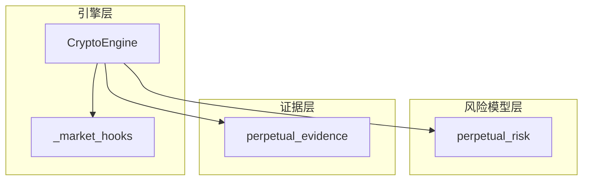
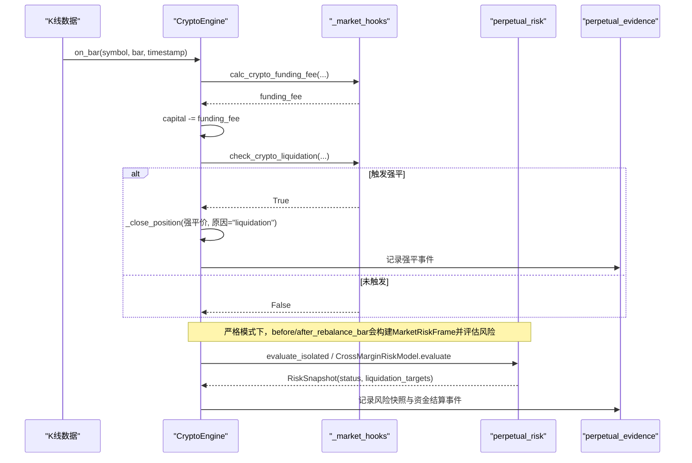
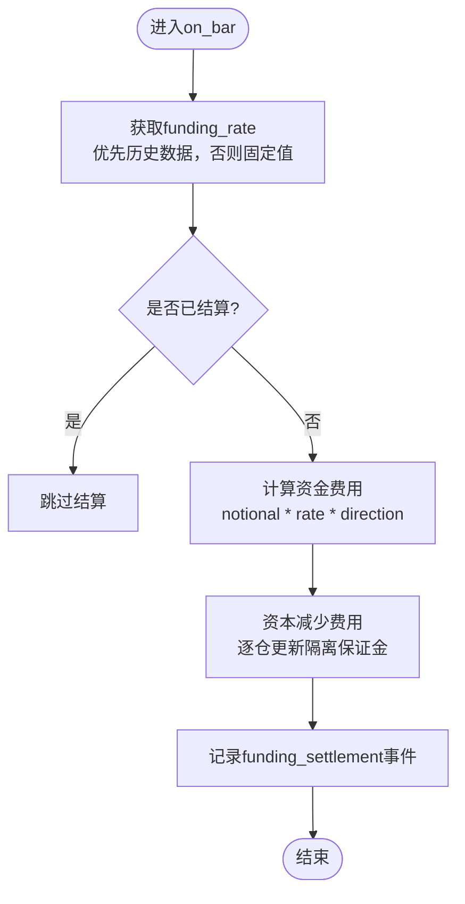
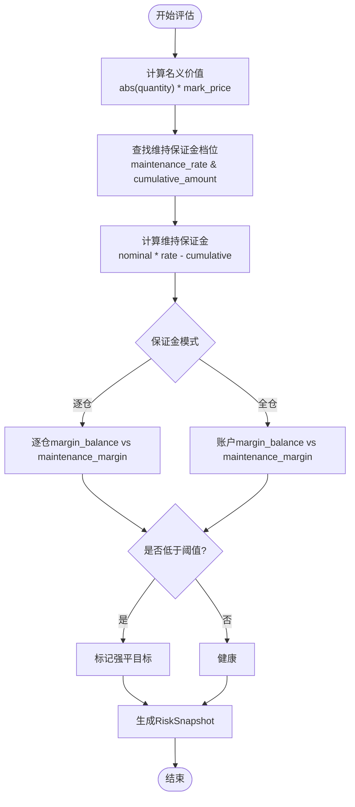
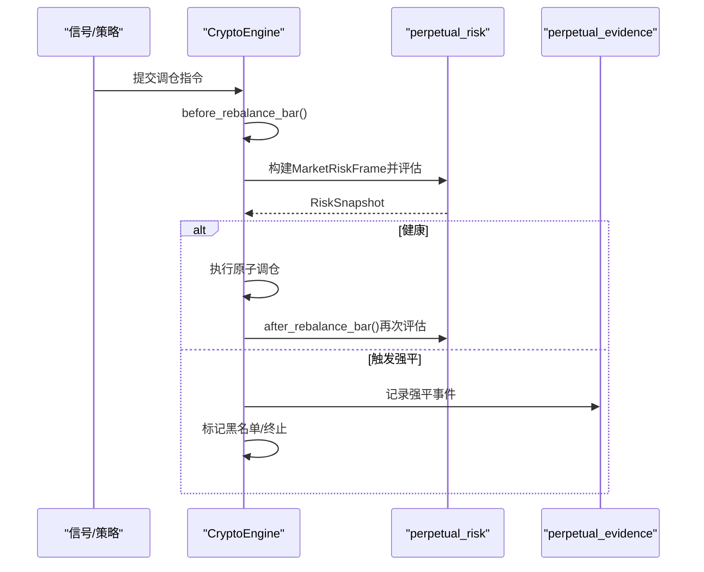
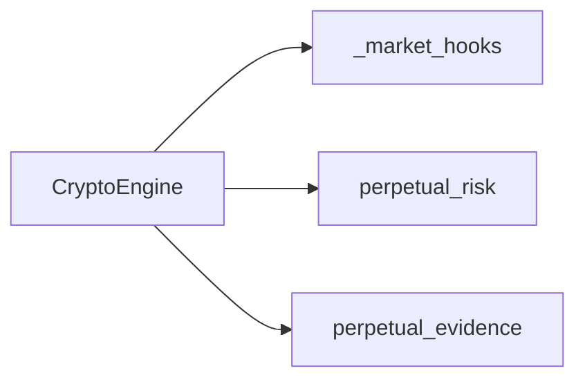

# 永续合约风险管理

<cite>
**本文引用的文件**
- [agent/backtest/engines/crypto.py](file://agent/backtest/engines/crypto.py)
- [agent/backtest/engines/_market_hooks.py](file://agent/backtest/engines/_market_hooks.py)
- [agent/backtest/perpetual_risk.py](file://agent/backtest/perpetual_risk.py)
- [agent/backtest/perpetual_evidence.py](file://agent/backtest/perpetual_evidence.py)
- [agent/tests/test_perpetual_risk.py](file://agent/tests/test_perpetual_risk.py)
</cite>

## 目录
1. [简介](#简介)
2. [项目结构](#项目结构)
3. [核心组件](#核心组件)
4. [架构总览](#架构总览)
5. [详细组件分析](#详细组件分析)
6. [依赖关系分析](#依赖关系分析)
7. [性能考量](#性能考量)
8. [故障排除指南](#故障排除指南)
9. [结论](#结论)
10. [附录：配置与使用示例](#附录：配置与使用示例)

## 简介
本技术文档围绕永续合约的风险管理实现，系统性说明资金费率监控、爆仓风险预警、持仓调整策略以及特有指标。内容基于回测引擎中的加密货币永续合约模块，涵盖资金费率数据采集与结算、维持保证金计算、强平触发与执行、事件审计与证据输出等关键流程，并提供配置建议与排错指引。

## 项目结构
与永续合约风险管理直接相关的代码主要位于回测引擎与风险模型中：
- 引擎层：负责逐根K线处理资金费与强平检查、构建严格市场风险帧、记录事件与快照。
- 风险模型层：提供维持保证金计算、账户状态评估（逐仓/全仓）、强平目标识别。
- 证据层：将运行过程中的资金结算、强平、交易费用等事件写入可审计的JSONL与汇总JSON。

图表来源
- [agent/backtest/engines/crypto.py:43-85](file://agent/backtest/engines/crypto.py#L43-L85)
- [agent/backtest/engines/_market_hooks.py:223-307](file://agent/backtest/engines/_market_hooks.py#L223-L307)
- [agent/backtest/perpetual_risk.py:181-418](file://agent/backtest/perpetual_risk.py#L181-L418)
- [agent/backtest/perpetual_evidence.py:17-85](file://agent/backtest/perpetual_evidence.py#L17-L85)

章节来源
- [agent/backtest/engines/crypto.py:43-85](file://agent/backtest/engines/crypto.py#L43-L85)
- [agent/backtest/engines/_market_hooks.py:223-307](file://agent/backtest/engines/_market_hooks.py#L223-L307)
- [agent/backtest/perpetual_risk.py:181-418](file://agent/backtest/perpetual_risk.py#L181-L418)
- [agent/backtest/perpetual_evidence.py:17-85](file://agent/backtest/perpetual_evidence.py#L17-L85)

## 核心组件
- 资金费率监控与结算
  - 逐根K线调用资金费率计算，支持历史数据费率或固定费率回退；按每8小时或每日去重结算。
  - 在严格模式下，使用MarketRiskFrame携带的资金费率与结算时间进行精确结算。
- 爆仓风险预警与执行
  - 维护保证金按名义价值分档计算；逐仓模式对单头寸评估，全仓模式对账户整体评估。
  - 当维持保证金不足时，标记强平目标并执行强平，记录强平价与费用。
- 持仓调整与风险控制
  - 支持“持有”和“再平衡”两种调仓策略；在再平衡模式下，原子化调整后重新评估风险。
  - 强平后对标的加入黑名单，防止继续开仓。
- 永续合约特有指标
  - 资金结算次数与累计资金PnL、强平事件数与强平标的数量、交易费用与强平费用、维持保证金档位版本与市场风险数据来源、保真标志等。

章节来源
- [agent/backtest/engines/_market_hooks.py:223-307](file://agent/backtest/engines/_market_hooks.py#L223-L307)
- [agent/backtest/engines/crypto.py:246-350](file://agent/backtest/engines/crypto.py#L246-L350)
- [agent/backtest/perpetual_risk.py:181-418](file://agent/backtest/perpetual_risk.py#L181-L418)
- [agent/backtest/perpetual_evidence.py:17-85](file://agent/backtest/perpetual_evidence.py#L17-L85)

## 架构总览
下图展示从K线输入到资金结算、风险评估、强平执行的完整流程，以及事件审计输出。

图表来源
- [agent/backtest/engines/crypto.py:601-615](file://agent/backtest/engines/crypto.py#L601-L615)
- [agent/backtest/engines/_market_hooks.py:223-307](file://agent/backtest/engines/_market_hooks.py#L223-L307)
- [agent/backtest/perpetual_risk.py:357-418](file://agent/backtest/perpetual_risk.py#L357-L418)
- [agent/backtest/perpetual_evidence.py:17-85](file://agent/backtest/perpetual_evidence.py#L17-L85)

## 详细组件分析

### 资金费率监控机制
- 数据采集
  - 优先使用K线中的历史funding_rate；若无则回退到配置的固定funding_rate。
  - 支持每8小时（00/08/16）结算，并通过集合去重避免重复结算。
- 异常检测与预警
  - 严格模式下，MarketRiskFrame要求funding_rate与funding_settlement_time成对出现且时间戳一致；否则抛出错误，确保结算准确性。
  - 通过事件记录资金结算详情（符号、方向、名义价值、费率、PnL），便于事后审计与异常定位。
- 结算逻辑
  - 逐仓模式下，资金结算影响对应头寸的isolated_margin；全仓模式下影响账户余额。
  - 在严格模式的rebalance前后，均会应用数据驱动的资金结算并评估风险。

图表来源
- [agent/backtest/engines/_market_hooks.py:223-277](file://agent/backtest/engines/_market_hooks.py#L223-L277)
- [agent/backtest/engines/crypto.py:246-272](file://agent/backtest/engines/crypto.py#L246-L272)
- [agent/backtest/perpetual_risk.py:226-272](file://agent/backtest/perpetual_risk.py#L226-L272)

章节来源
- [agent/backtest/engines/_market_hooks.py:223-277](file://agent/backtest/engines/_market_hooks.py#L223-L277)
- [agent/backtest/engines/crypto.py:246-272](file://agent/backtest/engines/crypto.py#L246-L272)
- [agent/backtest/perpetual_risk.py:226-272](file://agent/backtest/perpetual_risk.py#L226-L272)

### 爆仓风险预警系统
- 维持保证金计算
  - 基于名义价值分档（MaintenanceBracket），不同档位有不同的维持保证金率与累计扣减额。
  - 支持可选的名义系数字段，但计算时仅使用已验证的分档表。
- 强平价格预测与触发
  - 逐仓：当某头寸的margin_balance <= maintenance_margin时触发该头寸强平。
  - 全仓：当账户margin_balance <= maintenance_margin时触发账户级强平；空账户负余额也视为强平。
  - 非严格模式下，使用简化维持保证金率估算；严格模式下使用分档表精确计算。
- 风险等级评估
  - RiskSnapshot包含status（healthy/position_liquidation/account_liquidation）、liquidation_targets、fidelity_flags等，用于下游决策与审计。

图表来源
- [agent/backtest/perpetual_risk.py:181-191](file://agent/backtest/perpetual_risk.py#L181-L191)
- [agent/backtest/perpetual_risk.py:357-418](file://agent/backtest/perpetual_risk.py#L357-L418)
- [agent/backtest/engines/_market_hooks.py:279-307](file://agent/backtest/engines/_market_hooks.py#L279-L307)

章节来源
- [agent/backtest/perpetual_risk.py:181-191](file://agent/backtest/perpetual_risk.py#L181-L191)
- [agent/backtest/perpetual_risk.py:357-418](file://agent/backtest/perpetual_risk.py#L357-L418)
- [agent/backtest/engines/_market_hooks.py:279-307](file://agent/backtest/engines/_market_hooks.py#L279-L307)

### 持仓调整策略
- 动态调仓算法
  - 支持“hold”与“rebalance”两种策略；rebalance模式下，每次调仓为原子操作，并在调整后重新评估风险。
  - 严格模式下，执行前会构建MarketRiskFrame，确保mark价与资金费率同步。
- 风险控制阈值
  - 强平后标的加入黑名单，阻止后续开仓；账户级强平终止运行。
  - 拒绝资金不足的订单（insufficient_capital_after_liquidation）。
- 自动减仓机制
  - 强平执行时扣除强平费用，并记录强平价与价格来源；逐仓模式下释放对应隔离保证金。

图表来源
- [agent/backtest/engines/crypto.py:352-385](file://agent/backtest/engines/crypto.py#L352-L385)
- [agent/backtest/engines/crypto.py:482-527](file://agent/backtest/engines/crypto.py#L482-L527)
- [agent/backtest/perpetual_risk.py:357-418](file://agent/backtest/perpetual_risk.py#L357-L418)

章节来源
- [agent/backtest/engines/crypto.py:352-385](file://agent/backtest/engines/crypto.py#L352-L385)
- [agent/backtest/engines/crypto.py:482-527](file://agent/backtest/engines/crypto.py#L482-L527)
- [agent/backtest/perpetual_risk.py:357-418](file://agent/backtest/perpetual_risk.py#L357-L418)

### 永续合约特有风险管理指标
- 资金费率偏差：通过事件记录每次结算的funding_rate与实际PnL，可用于统计偏差与极端值。
- 基差风险：严格模式下使用mark_open/mark_high/mark_low/mark_close作为风险价，结合adverse假设捕捉日内波动。
- 流动性风险：通过滑点与手续费模型近似；严格模式下再平衡时滑点被抑制以聚焦风险边界。
- 其他指标：维持保证金档位版本、市场风险数据来源、保真标志（如conservative_intrabar_assumption）等。

章节来源
- [agent/backtest/perpetual_evidence.py:17-85](file://agent/backtest/perpetual_evidence.py#L17-L85)
- [agent/backtest/engines/crypto.py:128-142](file://agent/backtest/engines/crypto.py#L128-L142)
- [agent/backtest/perpetual_risk.py:274-282](file://agent/backtest/perpetual_risk.py#L274-L282)

## 依赖关系分析
- CryptoEngine依赖_market_hooks提供的资金费率计算与强平检查函数。
- CryptoEngine依赖perpetual_risk提供维持保证金计算与账户风险评估。
- perpetual_evidence独立于运行时会计，仅用于审计证据输出。

图表来源
- [agent/backtest/engines/crypto.py:18-38](file://agent/backtest/engines/crypto.py#L18-L38)
- [agent/backtest/engines/_market_hooks.py:223-307](file://agent/backtest/engines/_market_hooks.py#L223-L307)
- [agent/backtest/perpetual_risk.py:181-418](file://agent/backtest/perpetual_risk.py#L181-L418)
- [agent/backtest/perpetual_evidence.py:17-85](file://agent/backtest/perpetual_evidence.py#L17-L85)

章节来源
- [agent/backtest/engines/crypto.py:18-38](file://agent/backtest/engines/crypto.py#L18-L38)
- [agent/backtest/engines/_market_hooks.py:223-307](file://agent/backtest/engines/_market_hooks.py#L223-L307)
- [agent/backtest/perpetual_risk.py:181-418](file://agent/backtest/perpetual_risk.py#L181-L418)
- [agent/backtest/perpetual_evidence.py:17-85](file://agent/backtest/perpetual_evidence.py#L17-L85)

## 性能考量
- 严格模式下的帧构建与校验会增加开销，建议在高频场景下谨慎启用；同时限制杠杆与时间粒度以满足精度边界。
- 资金费率结算采用集合去重，避免重复计算；分档表查找为线性扫描，通常规模较小，性能可接受。
- 再平衡模式下多次风险评估，应控制调仓频率以避免过多计算。

[本节为通用指导，不直接分析具体文件]

## 故障排除指南
- 资金费率缺失或不配对
  - 现象：严格模式下构造MarketRiskFrame时报错，提示funding_rate与funding_settlement_time必须成对且时间戳一致。
  - 排查：确认数据源是否提供funding_rate与结算时间；若为固定费率模式，需关闭严格模式或切换至数据驱动模式。
- 维持保证金档位版本不一致
  - 现象：运行时报错提示maintenance_bracket_version变化。
  - 排查：确保同一标的在整个回测期间使用一致的档位版本；若交易所变更档位，需分段回测或更新数据。
- 强平后继续开仓
  - 现象：强平后仍尝试开仓。
  - 排查：检查是否已将标的加入黑名单；确认can_execute逻辑与阻塞集合状态。
- 全仓空账户负余额
  - 现象：空账户负余额被视为账户级强平。
  - 排查：检查资金结算与费用扣除顺序；确保无开放订单占用保证金。

章节来源
- [agent/backtest/perpetual_risk.py:226-272](file://agent/backtest/perpetual_risk.py#L226-L272)
- [agent/backtest/engines/crypto.py:144-157](file://agent/backtest/engines/crypto.py#L144-L157)
- [agent/backtest/engines/crypto.py:111-113](file://agent/backtest/engines/crypto.py#L111-L113)
- [agent/backtest/perpetual_risk.py:380-418](file://agent/backtest/perpetual_risk.py#L380-L418)

## 结论
本实现提供了完整的永续合约风险管理能力：资金费率采集与结算、维持保证金计算与强平触发、持仓调整与风险控制、以及可审计的事件输出。通过严格模式与分档表，系统在回测环境中实现了高保真的风险边界评估；配合配置项与事件日志，可满足从基础监控到复杂对冲策略的多样化需求。

[本节为总结性内容，不直接分析具体文件]

## 附录：配置与使用示例
- 关键配置项
  - leverage：默认1.0，影响初始保证金与强平敏感度。
  - maker_rate/taker_rate：手续费率，严格模式下开仓使用taker_rate。
  - slippage：滑点率，严格模式下再平衡时抑制滑点以聚焦风险边界。
  - funding_mode：fixed或data；严格模式要求data。
  - margin_mode：isolated或cross；严格模式允许两者。
  - liquidation_fee_rate：强平费用比例，严格模式需在[0,1)。
  - perpetual_strict：开启严格模式，启用精确风险帧与事件审计。
  - position_adjustment：hold或rebalance；rebalance支持原子调仓与二次风险评估。
- 使用步骤
  - 准备数据：确保包含mark OHLC、funding_rate与funding_settlement_time（严格模式必需），以及maintenance_brackets与maintenance_bracket_version。
  - 配置引擎：设置上述参数，选择保证金模式与资金模式。
  - 运行回测：观察资金结算与强平事件，检查RiskSnapshot与证据文件。
  - 分析与优化：根据资金费率偏差、强平事件与费用分布调整策略与风控阈值。

章节来源
- [agent/backtest/engines/crypto.py:43-85](file://agent/backtest/engines/crypto.py#L43-L85)
- [agent/backtest/perpetual_evidence.py:17-85](file://agent/backtest/perpetual_evidence.py#L17-L85)
- [agent/tests/test_perpetual_risk.py:60-147](file://agent/tests/test_perpetual_risk.py#L60-L147)