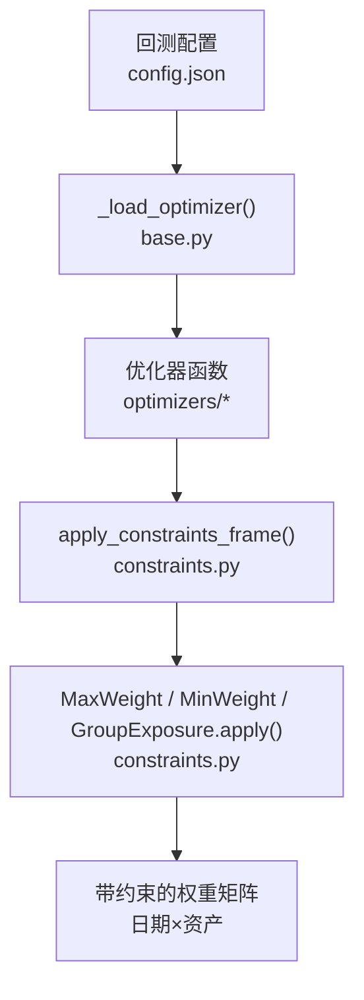
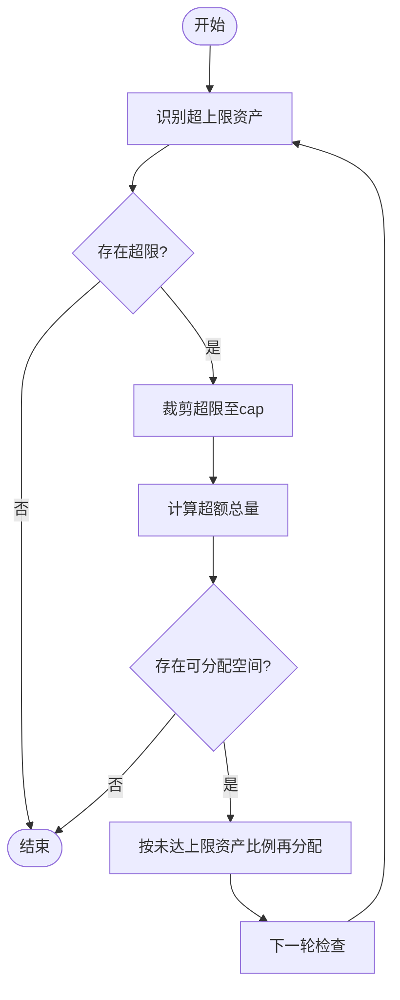
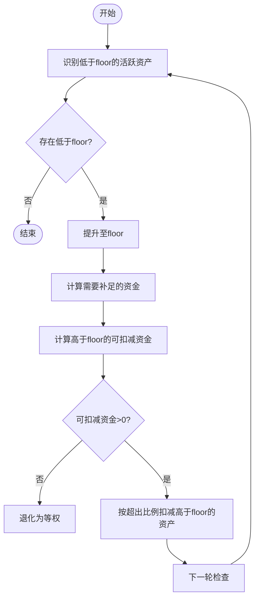
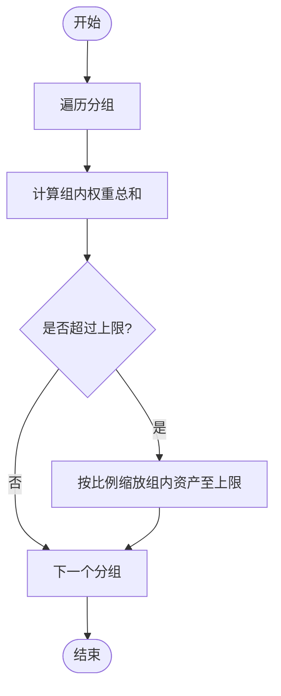
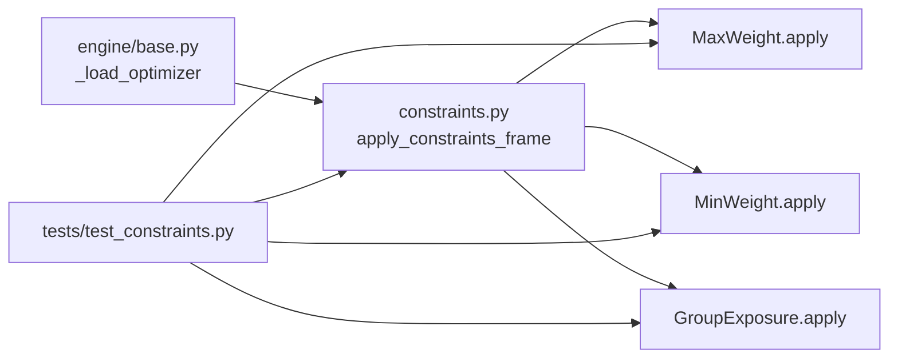

# 约束条件系统

<cite>
**本文引用的文件**
- [constraints.py](file://agent/backtest/constraints.py)
- [base.py](file://agent/backtest/engines/base.py)
- [test_constraints.py](file://agent/tests/test_constraints.py)
</cite>

## 目录
1. [简介](#简介)
2. [项目结构](#项目结构)
3. [核心组件](#核心组件)
4. [架构总览](#架构总览)
5. [详细组件分析](#详细组件分析)
6. [依赖关系分析](#依赖关系分析)
7. [性能考量](#性能考量)
8. [故障排查指南](#故障排查指南)
9. [结论](#结论)
10. [附录：配置示例与使用案例](#附录配置示例与使用案例)

## 简介
本技术文档聚焦于“约束条件系统”，该系统为任何优化器输出的权重矩阵提供可组合的仓位约束层，支持：
- 单资产最大权重限制（MaxWeight）
- 单资产最小权重限制（MinWeight）
- 行业集中度控制（GroupExposure）

约束按配置顺序依次执行，仅对已激活的资产进行幅度调整并保留正负号，不改变持仓方向。系统通过配置加载、参数校验、逐行应用的方式，将约束安全地叠加在优化结果之上。

## 项目结构
约束条件系统位于回测模块中，作为优化器的后置处理层，被引擎统一集成。关键文件与职责如下：
- agent/backtest/constraints.py：定义三类约束类、配置解析与逐行应用逻辑
- agent/backtest/engines/base.py：动态加载优化器并在其输出上调用约束应用函数
- agent/tests/test_constraints.py：覆盖各类约束行为、配置校验与端到端集成测试



图表来源
- [base.py:358-385](file://agent/backtest/engines/base.py#L358-L385)
- [constraints.py:170-206](file://agent/backtest/constraints.py#L170-L206)

章节来源
- [base.py:358-385](file://agent/backtest/engines/base.py#L358-L385)
- [constraints.py:1-206](file://agent/backtest/constraints.py#L1-L206)

## 核心组件
- MaxWeight：对超过上限的资产进行裁剪，并将超额部分按比例再分配给未达上限的资产；若无法容纳则整体收缩至上限之和。
- MinWeight：将低于下限的活跃资产提升至下限，资金由高于下限的资产按比例扣减；若无法满足下限则退化为等权。
- GroupExposure：对每个分组内的资产权重求和，若超过分组上限则对该组内资产按比例缩放；未映射资产不受限。
- 配置加载与验证：从配置中解析约束列表，严格校验类型、取值范围与字段完整性。
- 逐行应用：对优化器输出的权重矩阵按日期逐行处理，仅对绝对值大于阈值的活跃资产施加约束，保持符号不变。

章节来源
- [constraints.py:35-167](file://agent/backtest/constraints.py#L35-L167)
- [constraints.py:170-206](file://agent/backtest/constraints.py#L170-L206)

## 架构总览
约束系统以“后置层”形式嵌入到优化流程中：
- 引擎侧：根据配置动态加载优化器，并在优化输出后调用 apply_constraints_frame
- 约束层：按配置顺序依次执行 MaxWeight → MinWeight → GroupExposure（或用户自定义顺序），每步都保持符号与零值不变
- 数据流：输入为优化器输出的“日期×资产”权重矩阵，输出为经过约束调整的权重矩阵

```mermaid
sequenceDiagram
participant CFG as "配置"
participant ENG as "引擎_base.py"
participant OPT as "优化器"
participant CON as "constraints.py"
CFG->>ENG : _load_optimizer(config)
ENG->>OPT : optimize(ret, pos, dates)
OPT-->>ENG : 权重矩阵 W
ENG->>CON : apply_constraints_frame(W, constraints)
CON->>CON : 逐日提取活跃资产与符号
CON->>CON : 依次调用 MaxWeight/MinWeight/GroupExposure.apply()
CON-->>ENG : 调整后权重 W'
ENG-->>CFG : 返回 W'
```

图表来源
- [base.py:358-385](file://agent/backtest/engines/base.py#L358-L385)
- [constraints.py:180-206](file://agent/backtest/constraints.py#L180-L206)

## 详细组件分析

### MaxWeight（最大权重限制）
- 目标：确保任一资产的权重不超过 cap
- 算法要点：
  - 识别超上限资产，将其权重裁剪至 cap
  - 计算超额总量，按未达上限资产的当前权重比例再分配
  - 迭代直至无超限或无可分配空间
  - 若 n_active × cap < 总暴露，则所有资产均落在 cap，总暴露收缩
- 复杂度：每次扫描 O(n)，最多 _MAX_PASSES 次迭代；通常收敛很快
- 边界处理：使用容差阈值避免浮点误差导致的死循环



图表来源
- [constraints.py:48-74](file://agent/backtest/constraints.py#L48-L74)

章节来源
- [constraints.py:48-74](file://agent/backtest/constraints.py#L48-L74)
- [test_constraints.py:25-48](file://agent/tests/test_constraints.py#L25-L48)

### MinWeight（最小权重限制）
- 目标：确保活跃资产不低于 floor
- 算法要点：
  - 识别低于 floor 的活跃资产，将其提升至 floor
  - 资金来源于高于 floor 的资产，按超出部分比例扣减
  - 若无法满足（floor × n_active > 总暴露），则退化为等权
  - 零权重资产保持不变
- 复杂度：同 MaxWeight，O(n) 每轮，有限迭代
- 边界处理：对零值与极小值采用阈值判断，避免误触发



图表来源
- [constraints.py:77-104](file://agent/backtest/constraints.py#L77-L104)

章节来源
- [constraints.py:77-104](file://agent/backtest/constraints.py#L77-L104)
- [test_constraints.py:51-67](file://agent/tests/test_constraints.py#L51-L67)

### GroupExposure（行业集中度控制）
- 目标：限制每个分组的总权重不超过 caps[group]
- 算法要点：
  - 对每个分组，计算组内资产权重之和
  - 若超过上限，则对该组内资产按比例缩放至上限
  - 未映射资产不受限
  - 释放出的权重不重新分配，以避免破坏其他分组约束
- 复杂度：O(n) 每组，总体 O(k·n)
- 适用场景：控制行业/风格/因子暴露，防止集中度过高



图表来源
- [constraints.py:107-129](file://agent/backtest/constraints.py#L107-L129)

章节来源
- [constraints.py:107-129](file://agent/backtest/constraints.py#L107-L129)
- [test_constraints.py:69-87](file://agent/tests/test_constraints.py#L69-L87)

### 配置格式与参数验证
- 配置位置：config.json 中的 constraints 数组
- 支持的约束类型：
  - max_weight：需包含 cap（0 < cap ≤ 1）
  - min_weight：需包含 floor（0 < floor ≤ 1）
  - group_exposure：需包含 groups（资产→分组映射）与 caps（分组→上限映射）
- 验证规则：
  - 数值必须为有限实数且属于 (0, 1]
  - 禁止布尔值与非法字符串
  - group_exposure 要求 caps 中的所有分组必须在 groups 中有对应映射
  - constraints 必须为列表
- 错误处理：遇到非法配置直接抛出 ValueError，便于快速定位问题

章节来源
- [constraints.py:35-45](file://agent/backtest/constraints.py#L35-L45)
- [constraints.py:135-167](file://agent/backtest/constraints.py#L135-L167)
- [test_constraints.py:90-123](file://agent/tests/test_constraints.py#L90-L123)

### 执行顺序与组合机制
- 顺序：按配置数组顺序依次执行，例如先 max_weight 再 group_exposure
- 作用域：仅对绝对值大于阈值的活跃资产生效，零值与符号保持不变
- 幂等性：多次应用同一组约束不会产生进一步变化（在数值稳定前提下）
- 独立性：每日独立处理，不同日期之间互不影响

章节来源
- [constraints.py:180-206](file://agent/backtest/constraints.py#L180-L206)
- [test_constraints.py:125-177](file://agent/tests/test_constraints.py#L125-L177)

## 依赖关系分析
- 引擎集成：_load_optimizer 在优化器输出后调用 apply_constraints_frame
- 约束模块：MaxWeight、MinWeight、GroupExposure 实现具体约束逻辑
- 测试覆盖：单元测试验证各约束行为、配置校验与端到端集成



图表来源
- [base.py:358-385](file://agent/backtest/engines/base.py#L358-L385)
- [constraints.py:170-206](file://agent/backtest/constraints.py#L170-L206)
- [test_constraints.py:1-211](file://agent/tests/test_constraints.py#L1-L211)

章节来源
- [base.py:358-385](file://agent/backtest/engines/base.py#L358-L385)
- [constraints.py:170-206](file://agent/backtest/constraints.py#L170-L206)
- [test_constraints.py:1-211](file://agent/tests/test_constraints.py#L1-L211)

## 性能考量
- 时间复杂度：每行 O(n·k)，其中 n 为活跃资产数，k 为约束数量；通常很小
- 迭代次数：内部使用固定最大迭代次数（_MAX_PASSES）防止无限循环
- 内存占用：原地拷贝与临时数组，规模与权重矩阵一致
- 建议：
  - 合理设置 cap/floor，避免极端不可行导致频繁退化
  - 控制分组数量与映射规模，减少重复扫描
  - 在大规模回测中，优先选择稀疏权重以减少计算量

[本节为通用性能指导，不直接分析具体文件]

## 故障排查指南
- 配置错误：
  - 缺少必需字段（如 cap、floor、groups、caps）会抛出 ValueError
  - 非法数值（非有限、不在 (0,1]、布尔值）会被拒绝
  - group_exposure 的 caps 引用了未映射的分组会报错
- 行为异常：
  - 未设置 optimizer 但提供了 constraints：引擎会警告并忽略约束
  - 约束未生效：确认权重矩阵中存在活跃资产（绝对值大于阈值）
- 调试建议：
  - 打印每日活跃资产与约束前/后权重，定位问题行
  - 逐步启用约束，隔离冲突来源
  - 参考单元测试用例复现边界情况

章节来源
- [base.py:358-385](file://agent/backtest/engines/base.py#L358-L385)
- [constraints.py:135-167](file://agent/backtest/constraints.py#L135-L167)
- [test_constraints.py:90-123](file://agent/tests/test_constraints.py#L90-L123)

## 结论
约束条件系统以轻量、可组合的方式为优化器输出提供稳健的仓位控制能力。通过 MaxWeight、MinWeight 与 GroupExposure 的组合，既能满足单资产风控，又能控制行业集中度。系统在配置阶段进行严格校验，在执行阶段保持符号与零值不变，确保策略意图不被破坏。结合引擎集成，可在任意优化器之上无缝叠加约束，提升策略鲁棒性与可解释性。

[本节为总结性内容，不直接分析具体文件]

## 附录：配置示例与使用案例

### 配置示例
- 单个资产权重上限：
  - 在 config.json 中添加 constraints 数组，包含 type 为 max_weight 的条目，并设置 cap
- 单个资产权重下限：
  - 添加 type 为 min_weight 的条目，并设置 floor
- 行业暴露限制：
  - 添加 type 为 group_exposure 的条目，定义 groups（资产→分组）与 caps（分组→上限）

章节来源
- [constraints.py:1-21](file://agent/backtest/constraints.py#L1-L21)
- [constraints.py:135-167](file://agent/backtest/constraints.py#L135-L167)

### 使用案例
- 简单仓位控制：仅设置 max_weight 以限制单一资产权重，避免过度集中
- 多重约束组合：先 max_weight 再 group_exposure，确保单资产与行业双重上限
- 下限保障：设置 min_weight 保证活跃资产的最小权重，避免过于分散
- 复杂场景：同时使用三类约束，配合不同分组与上限，实现精细化风险预算

章节来源
- [test_constraints.py:125-177](file://agent/tests/test_constraints.py#L125-L177)
- [test_constraints.py:179-211](file://agent/tests/test_constraints.py#L179-L211)