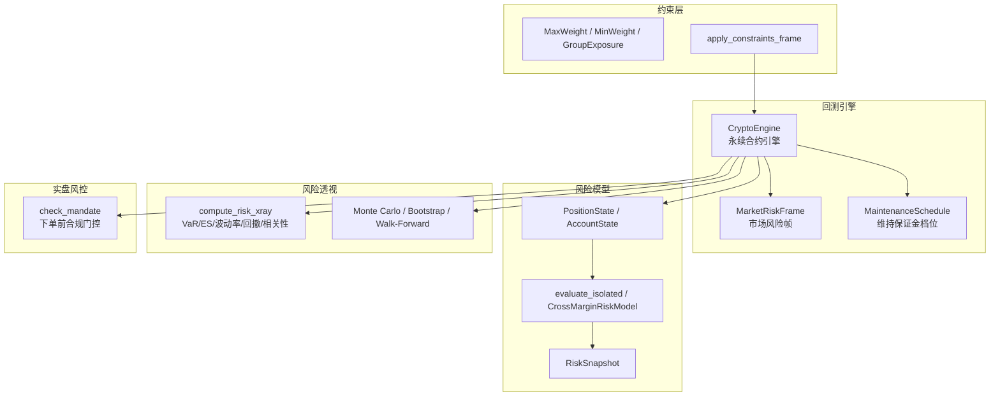
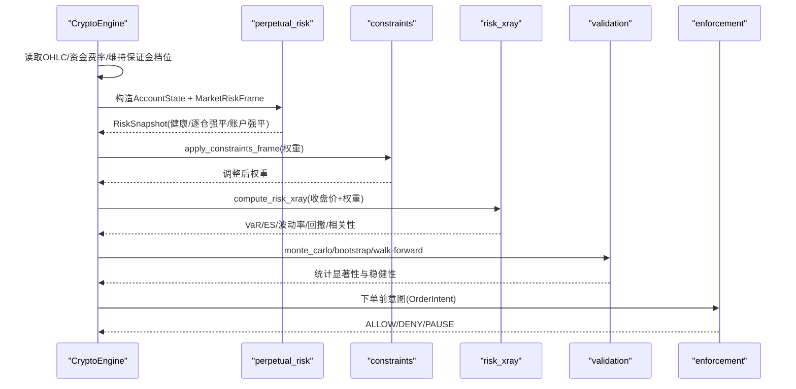
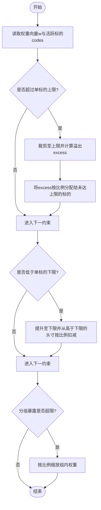
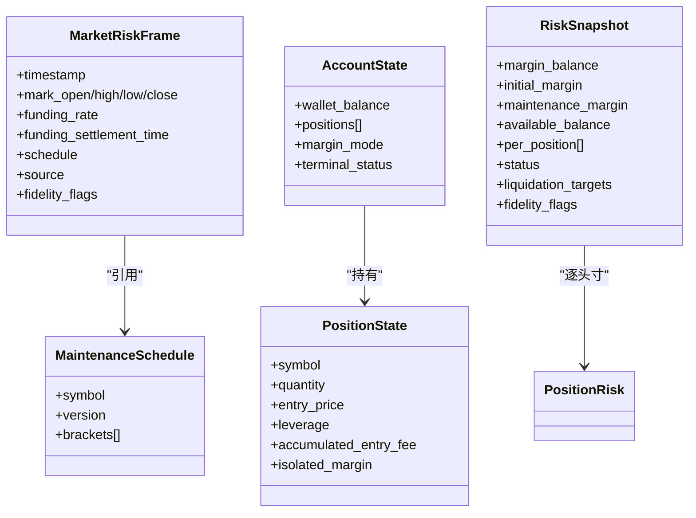
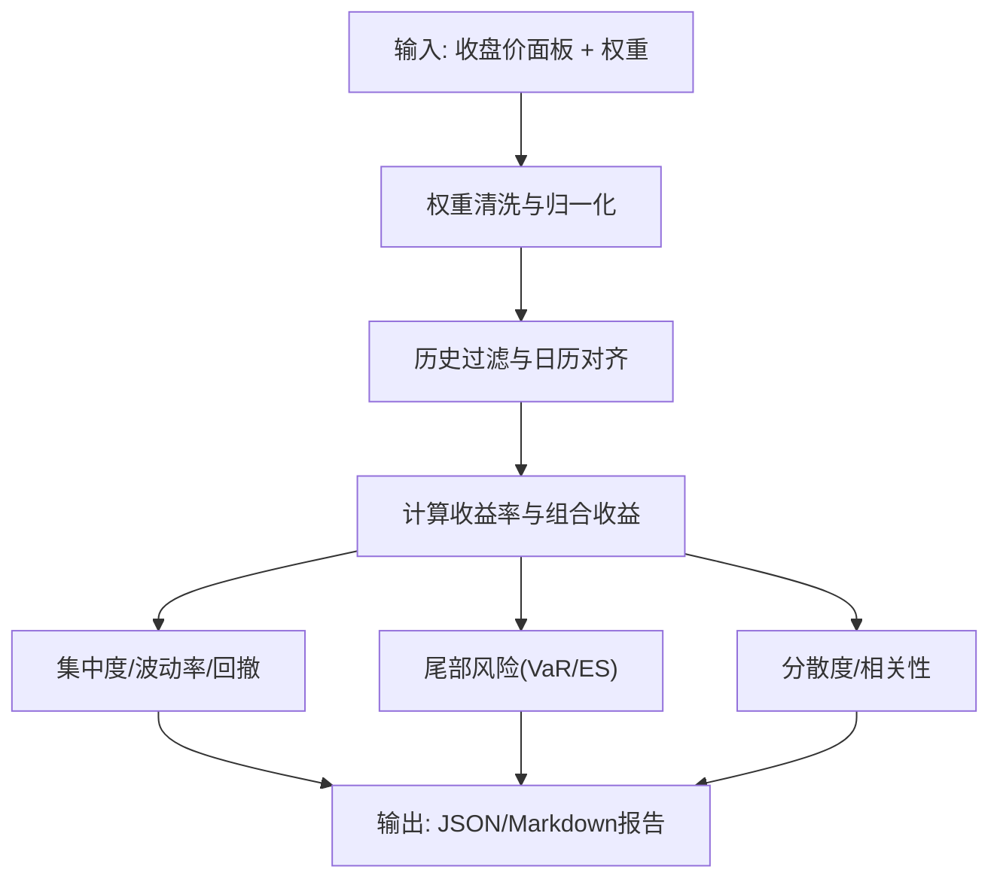
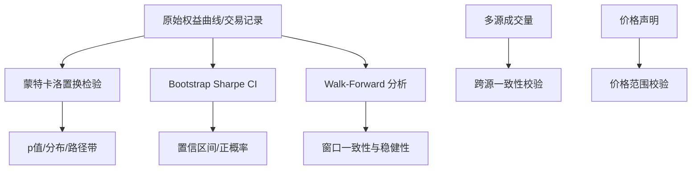
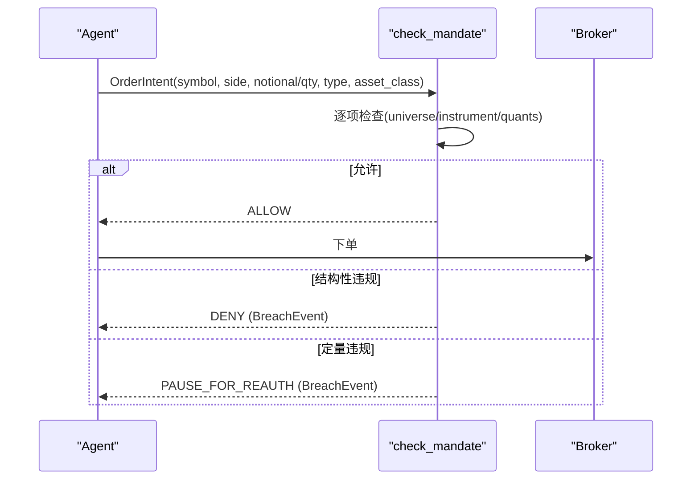
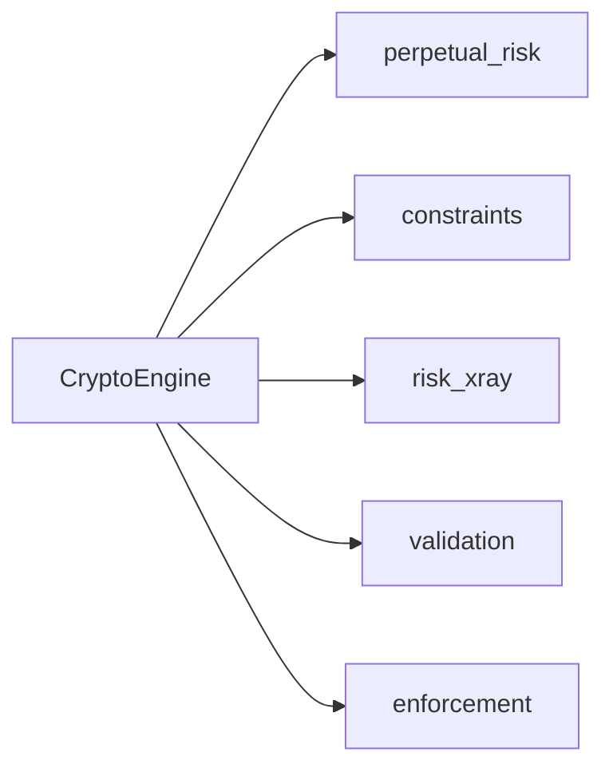

# 风险管理

<cite>
**本文引用的文件**
- [perpetual_risk.py](file://agent/backtest/perpetual_risk.py)
- [constraints.py](file://agent/backtest/constraints.py)
- [risk_xray.py](file://agent/backtest/risk_xray.py)
- [validation.py](file://agent/backtest/validation.py)
- [perpetual_evidence.py](file://agent/backtest/perpetual_evidence.py)
- [crypto.py](file://agent/backtest/engines/crypto.py)
- [enforcement.py](file://agent/src/live/enforcement.py)
- [SKILL.md（风险度量与压力测试）](file://agent/src/skills/risk-analysis/SKILL.md)
</cite>

## 目录
1. [简介](#简介)
2. [项目结构](#项目结构)
3. [核心组件](#核心组件)
4. [架构总览](#架构总览)
5. [详细组件分析](#详细组件分析)
6. [依赖关系分析](#依赖关系分析)
7. [性能考量](#性能考量)
8. [故障排查指南](#故障排查指南)
9. [结论](#结论)
10. [附录：配置与使用示例](#附录配置与使用示例)

## 简介
本技术文档面向“风险管理”子系统，覆盖以下关键能力：
- 约束条件系统：仓位限制、行业集中度、杠杆限制等可组合约束的定义与执行。
- 永续合约风险管理：资金费率监控、爆仓风险预警、持仓调整与强平判定。
- 风险透视分析：VaR/CVaR、压力测试、情景分析与相关性/分散度评估。
- 数据验证机制：价格异常检测、成交量一致性校验、数据完整性检查。
- 风险配置指南：参数设置、阈值调整、告警规则与审计证据输出。
- 实战示例：从基础仓位控制到复杂对冲策略的端到端流程。

## 项目结构
围绕风险管理的代码主要分布在回测引擎、风险计算、约束层与实盘风控门控四个层次：
- 回测引擎层：加密货币永续合约引擎负责订单执行、滑点、手续费、资金结算与强平检查。
- 风险模型层：独立的风险快照与保证金计算，支持逐仓与全仓模式。
- 约束层：对优化器输出的权重进行裁剪与再分配，实现单标的上限、下限与分组暴露上限。
- 风险透视与统计：VaR/CVaR、波动率、最大回撤、尾部风险、分散度与相关性。
- 数据验证：蒙特卡洛置换检验、Bootstrap Sharpe CI、Walk-Forward 稳健性检验。
- 实盘风控门控：下单前强制合规检查，结构化拒绝或暂停重授权。

图表来源
- [crypto.py:43-85](file://agent/backtest/engines/crypto.py#L43-L85)
- [perpetual_risk.py:132-179](file://agent/backtest/perpetual_risk.py#L132-L179)
- [constraints.py:48-129](file://agent/backtest/constraints.py#L48-L129)
- [risk_xray.py:86-176](file://agent/backtest/risk_xray.py#L86-L176)
- [validation.py:29-113](file://agent/backtest/validation.py#L29-L113)
- [enforcement.py:111-176](file://agent/src/live/enforcement.py#L111-L176)

章节来源
- [crypto.py:43-85](file://agent/backtest/engines/crypto.py#L43-L85)
- [perpetual_risk.py:132-179](file://agent/backtest/perpetual_risk.py#L132-L179)
- [constraints.py:48-129](file://agent/backtest/constraints.py#L48-L129)
- [risk_xray.py:86-176](file://agent/backtest/risk_xray.py#L86-L176)
- [validation.py:29-113](file://agent/backtest/validation.py#L29-L113)
- [enforcement.py:111-176](file://agent/src/live/enforcement.py#L111-L176)

## 核心组件
- 永续合约风险模型：维护保证金档位、逐仓/全仓账户状态、风险快照与强平判定。
- 约束条件系统：单标的权重上下限、分组暴露上限，按顺序作用并保持符号。
- 风险透视：基于收盘价面板计算集中度、波动率、回撤、尾部风险（VaR/ES）、分散度与相关性。
- 统计验证：蒙特卡洛置换检验、Bootstrap Sharpe置信区间、Walk-Forward 分段稳健性。
- 实盘风控门控：下单前硬约束（单笔名义、总敞口、杠杆、日交易次数、白名单）。
- 审计证据：永续合约运行事件与汇总摘要，记录资金结算、强平事件与费用。

章节来源
- [perpetual_risk.py:132-179](file://agent/backtest/perpetual_risk.py#L132-L179)
- [constraints.py:48-129](file://agent/backtest/constraints.py#L48-L129)
- [risk_xray.py:86-176](file://agent/backtest/risk_xray.py#L86-L176)
- [validation.py:29-113](file://agent/backtest/validation.py#L29-L113)
- [enforcement.py:111-176](file://agent/src/live/enforcement.py#L111-L176)
- [perpetual_evidence.py:17-65](file://agent/backtest/perpetual_evidence.py#L17-L65)

## 架构总览
下图展示从数据输入到风险决策的关键路径：引擎在每根K线构建市场风险帧，调用风险模型计算维持保证金与强平状态；同时应用约束层对权重进行裁剪；风险透视与统计验证提供事后评估；实盘下单前通过门控进行硬约束校验。

图表来源
- [crypto.py:159-199](file://agent/backtest/engines/crypto.py#L159-L199)
- [perpetual_risk.py:181-418](file://agent/backtest/perpetual_risk.py#L181-L418)
- [constraints.py:170-206](file://agent/backtest/constraints.py#L170-L206)
- [risk_xray.py:86-176](file://agent/backtest/risk_xray.py#L86-L176)
- [validation.py:291-346](file://agent/backtest/validation.py#L291-L346)
- [enforcement.py:111-176](file://agent/src/live/enforcement.py#L111-L176)

## 详细组件分析

### 约束条件系统（仓位限制、行业集中度、杠杆限制）
- 单标的权重上限（MaxWeight）：超过上限的权重被裁剪，剩余空间按比例再分配给未达上限的标的，保持符号不变。
- 单标的权重下限（MinWeight）：低于下限的活跃头寸提升至下限，资金由高于下限的头寸按比例出让；若无法支撑下限则退化为等权。
- 分组暴露上限（GroupExposure）：对同一组内标的的合计权重施加上限，超限时按比例缩放，释放的暴露不重新分配以避免破坏其他组的约束。
- 约束加载与应用：从配置解析约束列表，逐行作用于优化器输出的权重矩阵，仅对非零头寸生效，保证长/短组合的符号保留。

图表来源
- [constraints.py:48-129](file://agent/backtest/constraints.py#L48-L129)
- [constraints.py:170-206](file://agent/backtest/constraints.py#L170-L206)

章节来源
- [constraints.py:48-129](file://agent/backtest/constraints.py#L48-L129)
- [constraints.py:170-206](file://agent/backtest/constraints.py#L170-L206)

### 永续合约风险管理（资金费率、爆仓预警、持仓调整）
- 维持保证金档位：根据名义价值落入不同档位，按档位维护率与累计金额计算维持保证金。
- 逐仓模式：逐个头寸独立核算保证金余额，当某头寸保证金余额低于维持保证金时触发逐仓强平。
- 全仓模式：账户级合并未实现盈亏与维持保证金，账户余额低于维持保证金时触发账户级强平。
- 资金费率：按固定或数据驱动模式在每个结算周期结算，记录资金损益与结算时间戳。
- 严格模式：要求输入帧包含执行价、标记价OHLC、资金费率与结算时间，确保强平序列的可复现性。

图表来源
- [perpetual_risk.py:132-179](file://agent/backtest/perpetual_risk.py#L132-L179)
- [perpetual_risk.py:181-418](file://agent/backtest/perpetual_risk.py#L181-L418)

章节来源
- [perpetual_risk.py:132-179](file://agent/backtest/perpetual_risk.py#L132-L179)
- [perpetual_risk.py:181-418](file://agent/backtest/perpetual_risk.py#L181-L418)
- [crypto.py:159-199](file://agent/backtest/engines/crypto.py#L159-L199)
- [perpetual_evidence.py:17-65](file://agent/backtest/perpetual_evidence.py#L17-L65)

### 风险透视分析（VaR、压力测试、情景分析）
- 输入校验：权重必须为正且归一化，历史长度不足会被剔除并重新归一化。
- 指标计算：
  - 集中度：HHI、有效标的数、Top1/Top3权重。
  - 波动率：日波动率、年化波动率、下行波动率。
  - 回撤：最大回撤及起止点。
  - 尾部风险：历史模拟法VaR与Expected Shortfall（CVaR），多置信水平。
  - 分散度：分散比率。
  - 相关性：平均成对绝对相关、最大相关对、等权基准Beta。
- 报告渲染：生成紧凑Markdown摘要与严格JSON输出。

图表来源
- [risk_xray.py:86-176](file://agent/backtest/risk_xray.py#L86-L176)
- [risk_xray.py:179-287](file://agent/backtest/risk_xray.py#L179-L287)
- [risk_xray.py:340-387](file://agent/backtest/risk_xray.py#L340-L387)

章节来源
- [risk_xray.py:86-176](file://agent/backtest/risk_xray.py#L86-L176)
- [risk_xray.py:179-287](file://agent/backtest/risk_xray.py#L179-L287)
- [risk_xray.py:340-387](file://agent/backtest/risk_xray.py#L340-L387)

### 数据验证机制（价格异常、成交量验证、完整性检查）
- 统计验证：
  - 蒙特卡洛置换检验：打乱PnL顺序评估Sharpe与最大回撤的显著性。
  - Bootstrap Sharpe置信区间：估计风险调整后收益的稳定性。
  - Walk-Forward：分窗口评估策略稳健性。
- 成交量一致性：跨数据源对比A股成交量单位，防止单位漂移导致分析失真。
- 价格有效性：最终答案校验中拒绝超出观测范围的价格声明，避免数值冲突。

图表来源
- [validation.py:29-113](file://agent/backtest/validation.py#L29-L113)
- [validation.py:142-203](file://agent/backtest/validation.py#L142-L203)
- [validation.py:214-291](file://agent/backtest/validation.py#L214-L291)
- [test_volume_unit_consistency.py:1-65](file://agent/tests/test_volume_unit_consistency.py#L1-L65)

章节来源
- [validation.py:29-113](file://agent/backtest/validation.py#L29-L113)
- [validation.py:142-203](file://agent/backtest/validation.py#L142-L203)
- [validation.py:214-291](file://agent/backtest/validation.py#L214-L291)
- [test_volume_unit_consistency.py:1-65](file://agent/tests/test_volume_unit_consistency.py#L1-L65)

### 实盘风控门控（下单前硬约束）
- 订单意图标准化：统一符号、方向、名义/数量、工具类型与资产类别。
- 检查顺序：排除清单 → 工具类型 → 资产类别 → 单笔名义 → 总敞口 → 杠杆 → 日交易次数 → 资金（防御纵深）。
- 违规处理：结构性违规直接拒绝；定量违规暂停并要求重新授权。
- 硬上限：券商侧资金上限为最终兜底，本地门控做前置数学校验。

图表来源
- [enforcement.py:111-176](file://agent/src/live/enforcement.py#L111-L176)

章节来源
- [enforcement.py:111-176](file://agent/src/live/enforcement.py#L111-L176)

## 依赖关系分析
- 引擎依赖风险模型与约束层：CryptoEngine在每根K线构建MarketRiskFrame并调用perpetual_risk进行强平判定；同时在调仓前后应用constraints进行权重裁剪。
- 风险透视与统计验证作为后验工具：对回测结果进行VaR/ES、波动率、回撤与稳健性评估，辅助策略迭代。
- 实盘门控独立于回测：以OrderIntent为输入，依据Mandate硬约束进行放行或拦截。

图表来源
- [crypto.py:43-85](file://agent/backtest/engines/crypto.py#L43-L85)
- [perpetual_risk.py:181-418](file://agent/backtest/perpetual_risk.py#L181-L418)
- [constraints.py:170-206](file://agent/backtest/constraints.py#L170-L206)
- [risk_xray.py:86-176](file://agent/backtest/risk_xray.py#L86-L176)
- [validation.py:291-346](file://agent/backtest/validation.py#L291-L346)
- [enforcement.py:111-176](file://agent/src/live/enforcement.py#L111-L176)

章节来源
- [crypto.py:43-85](file://agent/backtest/engines/crypto.py#L43-L85)
- [perpetual_risk.py:181-418](file://agent/backtest/perpetual_risk.py#L181-L418)
- [constraints.py:170-206](file://agent/backtest/constraints.py#L170-L206)
- [risk_xray.py:86-176](file://agent/backtest/risk_xray.py#L86-L176)
- [validation.py:291-346](file://agent/backtest/validation.py#L291-L346)
- [enforcement.py:111-176](file://agent/src/live/enforcement.py#L111-L176)

## 性能考量
- 风险快照计算：逐头寸遍历与档位查找为O(N)，N为头寸数；档位按名义价值递增，查找可二分优化。
- 约束裁剪：最多50次迭代收敛，适用于中等规模组合；大规模时可考虑向量化加速。
- 风险透视：收益率计算与协方差矩阵为O(T×M^2)，T为交易日，M为标的数；可通过稀疏化与降维降低开销。
- 统计验证：蒙特卡洛与Bootstrap复杂度与样本量线性相关，需控制模拟次数与内存占用。

[本节为通用性能讨论，无需特定文件来源]

## 故障排查指南
- 维持保证金档位版本不一致：引擎会拒绝版本变更，需确保数据管道稳定。
- 资金费率与结算时间不匹配：严格模式下要求二者配对且时间戳一致。
- 缺失市场风险帧：每个头寸必须有对应符号的MarketRiskFrame，否则报错。
- 权重非法：负权重或总和不为1将被拒绝或警告并重归一化。
- 成交量单位漂移：跨源不一致会触发断言，需统一单位。
- 下单前门控拦截：检查具体BreachEvent的limit与overage，定位超限项。

章节来源
- [crypto.py:144-157](file://agent/backtest/engines/crypto.py#L144-L157)
- [crypto.py:159-199](file://agent/backtest/engines/crypto.py#L159-L199)
- [perpetual_risk.py:181-272](file://agent/backtest/perpetual_risk.py#L181-L272)
- [risk_xray.py:48-84](file://agent/backtest/risk_xray.py#L48-L84)
- [test_volume_unit_consistency.py:1-65](file://agent/tests/test_volume_unit_consistency.py#L1-L65)
- [enforcement.py:140-179](file://agent/src/live/enforcement.py#L140-L179)

## 结论
本风险管理子系统以“严格输入契约 + 分层约束 + 可审计证据”为核心设计原则：
- 永续合约风险模型提供逐仓/全仓强平判定与维持保证金计算。
- 约束层确保组合暴露符合业务规则，支持长/短组合与分组限额。
- 风险透视与统计验证提供全面的事后评估与稳健性保障。
- 实盘门控在下单前实施硬约束，确保策略行为受控。
- 审计证据完整记录资金结算与强平事件，便于回溯与合规审查。

[本节为总结性内容，无需特定文件来源]

## 附录：配置与使用示例

### 风险参数设置与阈值调整
- 永续合约引擎配置键：
  - leverage：默认1.0
  - maker_rate/taker_rate：默认0.0002/0.0005
  - slippage：默认0.0005
  - funding_rate：固定资金费率，默认0.0001
  - margin_mode："isolated"或"cross"
  - perpetual_strict：严格模式开关
  - funding_mode："fixed"或"data"
  - liquidation_fee_rate：强平费率
- 约束配置：
  - max_weight：单标的上限
  - min_weight：单标的下限
  - group_exposure：分组暴露上限
- 风险透视参数：
  - periods_per_year：年化因子
  - var_levels：VaR置信水平
  - min_history：最小历史天数

章节来源
- [crypto.py:43-85](file://agent/backtest/engines/crypto.py#L43-L85)
- [constraints.py:1-21](file://agent/backtest/constraints.py#L1-L21)
- [risk_xray.py:86-109](file://agent/backtest/risk_xray.py#L86-L109)

### 实际使用示例
- 基础仓位控制：
  - 在优化器输出上应用MaxWeight与MinWeight，确保单标的暴露合理。
  - 使用GroupExposure限制行业或主题集中度过高。
- 永续合约风控：
  - 开启perpetual_strict与data驱动资金费率，确保强平序列可复现。
  - 在on_bar中结算资金费并检查强平，记录事件与汇总。
- 风险透视与压力测试：
  - 基于收盘价面板计算VaR/ES、波动率与最大回撤。
  - 使用蒙特卡洛与Bootstrap评估Sharpe显著性与稳定性。
  - 通过Walk-Forward验证跨期稳健性。
- 实盘下单前门控：
  - 构造OrderIntent并调用check_mandate，依据BreachEvent决定放行、拒绝或暂停。

章节来源
- [constraints.py:170-206](file://agent/backtest/constraints.py#L170-L206)
- [crypto.py:201-211](file://agent/backtest/engines/crypto.py#L201-L211)
- [risk_xray.py:86-176](file://agent/backtest/risk_xray.py#L86-L176)
- [validation.py:291-346](file://agent/backtest/validation.py#L291-L346)
- [enforcement.py:111-176](file://agent/src/live/enforcement.py#L111-L176)

### 风险度量方法参考
- VaR/CVaR、最大回撤、蒙特卡洛模拟、极值尾部拟合等方法论与实现指引参见技能文档。

章节来源
- [SKILL.md（风险度量与压力测试）:1-100](file://agent/src/skills/risk-analysis/SKILL.md#L1-L100)