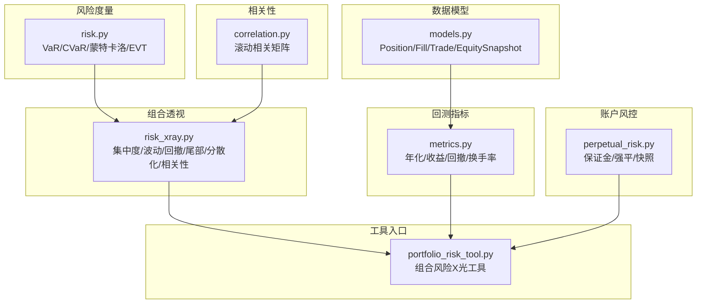
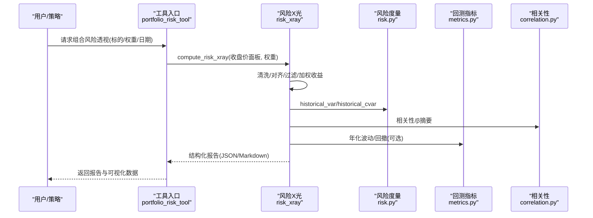
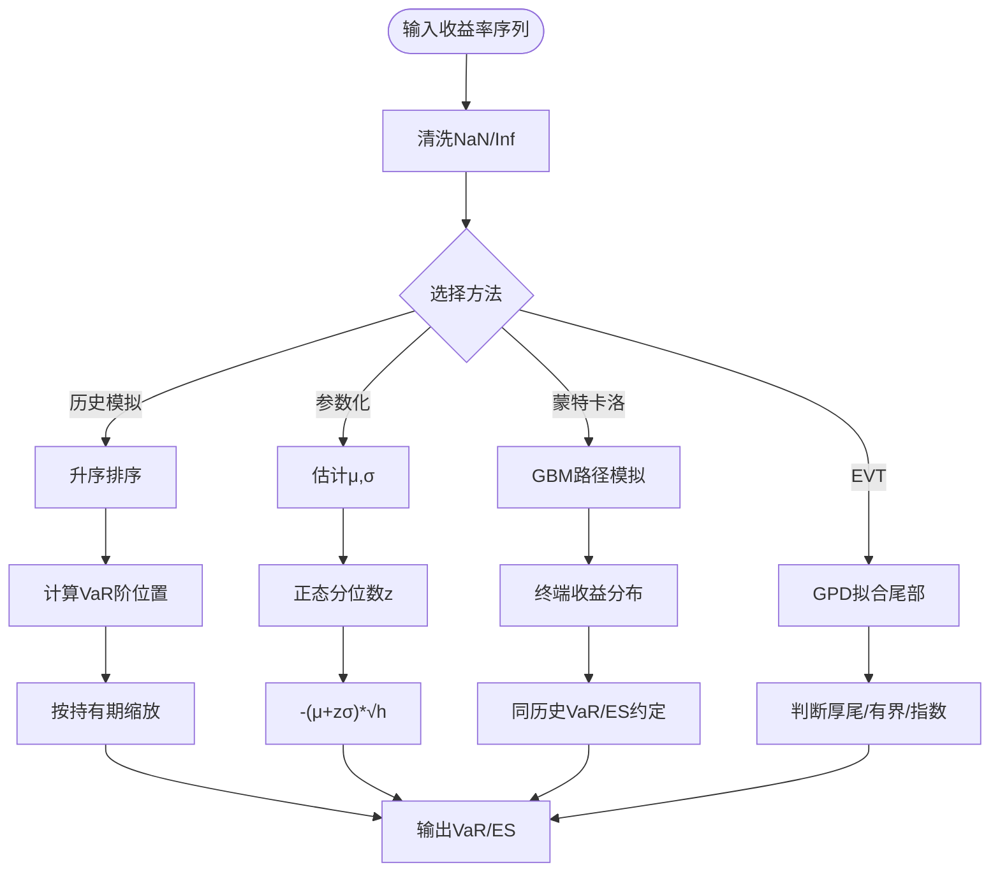
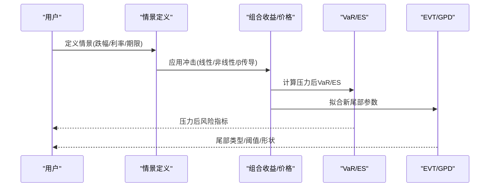
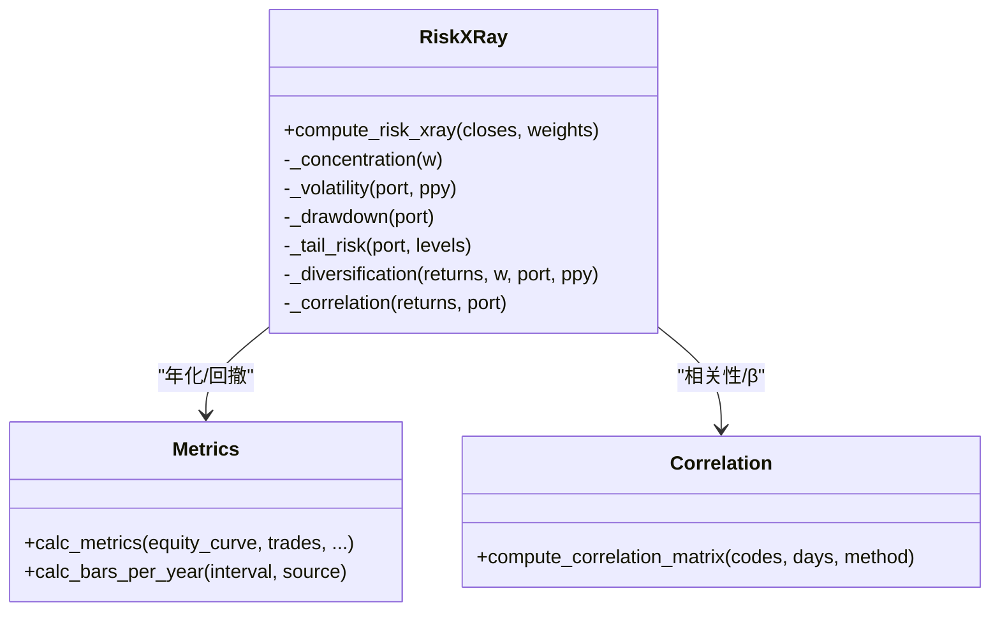
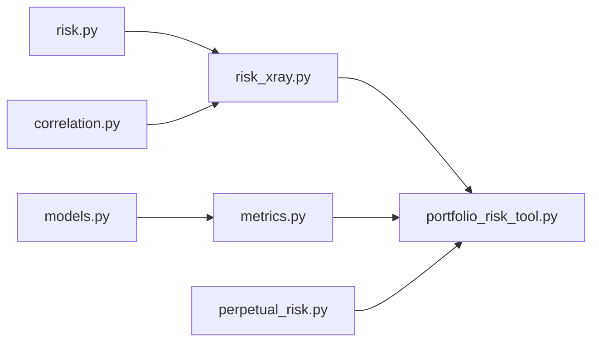

# 风险透视分析

<cite>
**本文引用的文件**
- [agent/src/quantlib/risk.py](file://agent/src/quantlib/risk.py)
- [agent/backtest/perpetual_risk.py](file://agent/backtest/perpetual_risk.py)
- [agent/backtest/risk_xray.py](file://agent/backtest/risk_xray.py)
- [agent/backtest/metrics.py](file://agent/backtest/metrics.py)
- [agent/backtest/correlation.py](file://agent/backtest/correlation.py)
- [agent/backtest/models.py](file://agent/backtest/models.py)
- [agent/src/tools/portfolio_risk_tool.py](file://agent/src/tools/portfolio_risk_tool.py)
- [agent/tests/test_risk_xray.py](file://agent/tests/test_risk_xray.py)
- [agent/tests/quantlib/test_risk.py](file://agent/tests/quantlib/test_risk.py)
</cite>

## 目录
1. [简介](#简介)
2. [项目结构](#项目结构)
3. [核心组件](#核心组件)
4. [架构总览](#架构总览)
5. [详细组件分析](#详细组件分析)
6. [依赖关系分析](#依赖关系分析)
7. [性能考量](#性能考量)
8. [故障排查指南](#故障排查指南)
9. [结论](#结论)
10. [附录](#附录)

## 简介
本技术文档围绕“风险透视分析系统”展开，聚焦以下能力：
- 价值-at-风险（VaR）计算：历史模拟法、参数化方法、蒙特卡洛模拟与尾部风险拟合。
- 压力测试框架：预设情景、自定义压力测试与结果分析方法。
- 情景分析工具：宏观经济情景、市场极端事件与尾部风险分析。
- 风险分解技术：因子风险贡献、相关性分析与分散化效果评估。
- 可视化报告：风险热力图、时间序列分析与对比图表。
- 实战案例：从基础风险度量到复杂多维度风险评估。
- 最佳实践与解读指南。

该系统以纯函数式风险度量为核心，结合回测引擎的持仓与成交数据，提供可复现、可审计的风险指标与报告输出。

## 项目结构
风险相关代码主要分布在以下模块：
- 风险度量与模拟：src/quantlib/risk.py
- 组合风险X光（风险透视）：backtest/risk_xray.py
- 永续合约账户风控快照：backtest/perpetual_risk.py
- 回测指标与年化：backtest/metrics.py
- 多资产相关性矩阵：backtest/correlation.py
- 回测数据模型：backtest/models.py
- 工具封装与API入口：src/tools/portfolio_risk_tool.py
- 单元测试：tests/*

**图示来源**
- [agent/src/quantlib/risk.py:1-512](file://agent/src/quantlib/risk.py#L1-L512)
- [agent/backtest/risk_xray.py:1-369](file://agent/backtest/risk_xray.py#L1-L369)
- [agent/backtest/perpetual_risk.py:1-418](file://agent/backtest/perpetual_risk.py#L1-L418)
- [agent/backtest/metrics.py:1-641](file://agent/backtest/metrics.py#L1-L641)
- [agent/backtest/correlation.py:1-302](file://agent/backtest/correlation.py#L1-L302)
- [agent/backtest/models.py:1-118](file://agent/backtest/models.py#L1-L118)
- [agent/src/tools/portfolio_risk_tool.py:38-69](file://agent/src/tools/portfolio_risk_tool.py#L38-L69)

**章节来源**
- [agent/src/quantlib/risk.py:1-512](file://agent/src/quantlib/risk.py#L1-L512)
- [agent/backtest/risk_xray.py:1-369](file://agent/backtest/risk_xray.py#L1-L369)
- [agent/backtest/perpetual_risk.py:1-418](file://agent/backtest/perpetual_risk.py#L1-L418)
- [agent/backtest/metrics.py:1-641](file://agent/backtest/metrics.py#L1-L641)
- [agent/backtest/correlation.py:1-302](file://agent/backtest/correlation.py#L1-L302)
- [agent/backtest/models.py:1-118](file://agent/backtest/models.py#L1-L118)
- [agent/src/tools/portfolio_risk_tool.py:38-69](file://agent/src/tools/portfolio_risk_tool.py#L38-L69)

## 核心组件
- VaR/CVaR与蒙特卡洛：基于历史分布、正态假设与GBM路径模拟，统一采用“损失为正”的符号约定，确保跨方法可比性。
- 组合风险X光：对加权篮子计算集中度、年化波动、最大回撤、历史VaR/ES、分散化比率与相关性摘要，并输出严格JSON安全的结果。
- 永续合约风控：维护账户状态、逐仓/全仓保证金、逐标的维持保证金与强平判定，生成风险快照。
- 回测指标：统一年化因子、交易统计、换手率、基准对比与信息比率等。
- 相关性矩阵：支持Pearson/Spearman滚动相关，自动推断市场与标准化符号，拉取多源数据。
- 工具入口：将上述能力封装为可调用的工具接口，便于Agent或API调用。

**章节来源**
- [agent/src/quantlib/risk.py:1-512](file://agent/src/quantlib/risk.py#L1-L512)
- [agent/backtest/risk_xray.py:1-369](file://agent/backtest/risk_xray.py#L1-L369)
- [agent/backtest/perpetual_risk.py:1-418](file://agent/backtest/perpetual_risk.py#L1-L418)
- [agent/backtest/metrics.py:1-641](file://agent/backtest/metrics.py#L1-L641)
- [agent/backtest/correlation.py:1-302](file://agent/backtest/correlation.py#L1-L302)
- [agent/src/tools/portfolio_risk_tool.py:38-69](file://agent/src/tools/portfolio_risk_tool.py#L38-L69)

## 架构总览
系统以“数据→度量→报告”的分层架构组织：
- 数据层：价格面板、成交记录、持仓轨迹、账户快照。
- 度量层：VaR/CVaR、蒙特卡洛、EVT尾部拟合、波动/回撤/分散化/相关性。
- 报告层：JSON/Markdown报告、可视化图表（由上层渲染）。

**图示来源**
- [agent/src/tools/portfolio_risk_tool.py:38-69](file://agent/src/tools/portfolio_risk_tool.py#L38-L69)
- [agent/backtest/risk_xray.py:86-176](file://agent/backtest/risk_xray.py#L86-L176)
- [agent/src/quantlib/risk.py:146-251](file://agent/src/quantlib/risk.py#L146-L251)
- [agent/backtest/correlation.py:285-319](file://agent/backtest/correlation.py#L285-L319)
- [agent/backtest/metrics.py:461-626](file://agent/backtest/metrics.py#L461-L626)

## 详细组件分析

### 价值-at-风险（VaR）计算方法
- 历史模拟法：对排序后的收益样本选取非插值下阶统计量，按持有期平方根缩放；保证结果为实际观测到的收益，避免插值偏差。
- 参数化方法：估计均值与标准差（ddof=1），使用正态分位数计算VaR；在中等置信度可能高估风险，在极深尾部才更可能低估。
- 蒙特卡洛模拟：几何布朗运动路径模拟，终端分布汇总得到VaR/CVaR、亏损概率、最坏/最好百分位；支持种子固定以保证可复现。
- 尾部风险拟合：用广义帕累托分布（GPD）拟合超额损失，判断尾部类型（厚尾/有界/指数），提供阈值、超阈比例、形状参数及其标准误。

**图示来源**
- [agent/src/quantlib/risk.py:146-251](file://agent/src/quantlib/risk.py#L146-L251)
- [agent/src/quantlib/risk.py:520-618](file://agent/src/quantlib/risk.py#L520-L618)
- [agent/src/quantlib/risk.py:621-702](file://agent/src/quantlib/risk.py#L621-L702)

**章节来源**
- [agent/src/quantlib/risk.py:146-251](file://agent/src/quantlib/risk.py#L146-L251)
- [agent/src/quantlib/risk.py:520-618](file://agent/src/quantlib/risk.py#L520-L618)
- [agent/src/quantlib/risk.py:621-702](file://agent/src/quantlib/risk.py#L621-L702)
- [agent/tests/quantlib/test_risk.py:1-41](file://agent/tests/quantlib/test_risk.py#L1-L41)

### 压力测试框架
- 预设情景：通过历史极端事件（如金融危机、加息周期、疫情冲击）定义市场跌幅与利率变动，作为外部输入驱动组合损益重估。
- 自定义压力测试：允许用户指定冲击幅度、传导系数（如组合β）、资产敏感度，直接作用于价格或收益序列进行重算。
- 结果分析：比较基准与压力下的VaR/CVaR、最大回撤、尾部概率变化；结合EVT尾部拟合评估极端损失分布变化。

[此图为概念流程，不直接映射具体源码]

### 情景分析工具
- 宏观经济情景：利率上行/下行、汇率波动、信用利差走阔等，作为外生变量影响不同资产类别。
- 市场极端事件：利用历史回撤窗口或自定义冲击，评估组合脆弱点与恢复时间。
- 尾部风险分析：通过GPD拟合识别厚尾特征，量化极端损失频率与幅度，辅助资本配置与限额设定。

**章节来源**
- [agent/src/quantlib/risk.py:621-702](file://agent/src/quantlib/risk.py#L621-L702)

### 风险分解技术
- 因子风险贡献：通过各资产波动与相关性，计算组合波动与分散化比率，识别主导风险来源。
- 相关性分析：滚动Pearson/Spearman相关矩阵，捕捉时变联动与结构性变化；计算组合对等权市场的β。
- 分散化效果评估：分散化比率>1表示分散有效；接近1表示高度集中；结合HHI与有效N衡量集中度。

**图示来源**
- [agent/backtest/risk_xray.py:86-287](file://agent/backtest/risk_xray.py#L86-L287)
- [agent/backtest/metrics.py:153-170](file://agent/backtest/metrics.py#L153-L170)
- [agent/backtest/correlation.py:285-319](file://agent/backtest/correlation.py#L285-L319)

**章节来源**
- [agent/backtest/risk_xray.py:179-287](file://agent/backtest/risk_xray.py#L179-L287)
- [agent/backtest/correlation.py:135-213](file://agent/backtest/correlation.py#L135-L213)
- [agent/backtest/metrics.py:461-626](file://agent/backtest/metrics.py#L461-L626)

### 可视化报告生成
- 风险热力图：基于滚动相关矩阵绘制资产间相关性强度，识别同步性与结构性断裂。
- 时间序列分析：权益曲线、回撤轨迹、VaR/ES时间序列，观察风险动态演化。
- 对比图表：基准与策略收益、压力前后VaR/ES对比、分散化比率趋势。

报告输出形式：
- JSON：严格JSON安全，便于程序消费。
- Markdown：可读性强的文本摘要，包含关键指标与警告信息。

**章节来源**
- [agent/backtest/risk_xray.py:340-387](file://agent/backtest/risk_xray.py#L340-L387)
- [agent/backtest/correlation.py:285-319](file://agent/backtest/correlation.py#L285-L319)

### 实际分析案例
- 基础风险度量：对单资产/多资产收益序列计算历史VaR/CVaR、参数VaR、蒙特卡洛VaR，并比较差异。
- 多维度风险评估：组合集中度、波动、回撤、分散化比率、相关性、β；叠加压力情景与EVT尾部分析，形成完整风险画像。
- 实操建议：优先使用历史VaR与CVaR配对；在99%及以上关注参数VaR与历史的差异；结合EVT识别厚尾；压力测试需明确传导机制与假设。

**章节来源**
- [agent/src/quantlib/risk.py:146-251](file://agent/src/quantlib/risk.py#L146-L251)
- [agent/backtest/risk_xray.py:86-176](file://agent/backtest/risk_xray.py#L86-L176)
- [agent/backtest/correlation.py:285-319](file://agent/backtest/correlation.py#L285-L319)

## 依赖关系分析
- risk.py为底层度量库，被risk_xray.py与工具入口调用。
- risk_xray.py聚合波动、回撤、尾部、分散化与相关性，输出结构化报告。
- metrics.py提供年化因子与回测指标，供工具与报告使用。
- correlation.py负责多资产相关性计算，支撑分散化与β分析。
- perpetual_risk.py提供账户级保证金与强平逻辑，适用于衍生品场景。
- models.py定义回测数据结构，贯穿交易与指标计算。

**图示来源**
- [agent/src/quantlib/risk.py:1-512](file://agent/src/quantlib/risk.py#L1-L512)
- [agent/backtest/risk_xray.py:1-369](file://agent/backtest/risk_xray.py#L1-L369)
- [agent/backtest/metrics.py:1-641](file://agent/backtest/metrics.py#L1-L641)
- [agent/backtest/correlation.py:1-302](file://agent/backtest/correlation.py#L1-L302)
- [agent/backtest/perpetual_risk.py:1-418](file://agent/backtest/perpetual_risk.py#L1-L418)
- [agent/backtest/models.py:1-118](file://agent/backtest/models.py#L1-L118)
- [agent/src/tools/portfolio_risk_tool.py:38-69](file://agent/src/tools/portfolio_risk_tool.py#L38-L69)

**章节来源**
- [agent/src/quantlib/risk.py:1-512](file://agent/src/quantlib/risk.py#L1-L512)
- [agent/backtest/risk_xray.py:1-369](file://agent/backtest/risk_xray.py#L1-L369)
- [agent/backtest/metrics.py:1-641](file://agent/backtest/metrics.py#L1-L641)
- [agent/backtest/correlation.py:1-302](file://agent/backtest/correlation.py#L1-L302)
- [agent/backtest/perpetual_risk.py:1-418](file://agent/backtest/perpetual_risk.py#L1-L418)
- [agent/backtest/models.py:1-118](file://agent/backtest/models.py#L1-L118)
- [agent/src/tools/portfolio_risk_tool.py:38-69](file://agent/src/tools/portfolio_risk_tool.py#L38-L69)

## 性能考量
- 历史VaR/CVaR：排序复杂度O(n log n)，适合日频长序列；持有期缩放假设i.i.d.，自相关会低估风险。
- 参数VaR：仅依赖均值与方差，计算高效；但在厚尾分布下可能失真，需在深尾部谨慎解读。
- 蒙特卡洛：路径数越大越稳定，但计算成本高；建议使用合理路径数并结合种子保证可复现。
- EVT拟合：阈值选择影响稳定性；阈值过低导致噪声，过高导致样本不足；需结合标准误判断尾部类型。
- 相关性矩阵：滚动窗口越长越平滑但滞后；短窗口敏感且噪声大；缺失值处理需谨慎，避免制造虚假零回报。

[本节为通用指导，不直接分析具体文件]

## 故障排查指南
- 输入校验失败：
  - 收益率序列为空或非一维：检查数据清洗与对齐。
  - 置信度不在(0,1)或持有期小于1：修正参数范围。
  - 权益曲线含非正值：回撤计算要求严格正权益。
- 数据问题：
  - 无重叠交易日：检查各资产日历对齐与缺失值填充策略。
  - 零或负价格：收益率定义需跳过不可用区间，避免inf/nan污染。
- 权重与标的：
  - 权重未归一或含负值：风险X光当前仅支持多头；自动归一化并提示警告。
  - 存活标的权重和为零：需调整权重或延长历史窗口。
- 相关性计算：
  - 无法获取至少两个资产数据：检查数据源可用性与符号标准化。
  - 滚动窗口过短：增加天数或减少资产数量。

**章节来源**
- [agent/src/quantlib/risk.py:76-143](file://agent/src/quantlib/risk.py#L76-L143)
- [agent/src/quantlib/risk.py:441-517](file://agent/src/quantlib/risk.py#L441-L517)
- [agent/backtest/risk_xray.py:47-176](file://agent/backtest/risk_xray.py#L47-L176)
- [agent/backtest/correlation.py:216-282](file://agent/backtest/correlation.py#L216-L282)
- [agent/tests/test_risk_xray.py:36-41](file://agent/tests/test_risk_xray.py#L36-L41)
- [agent/tests/test_risk_xray.py:219-225](file://agent/tests/test_risk_xray.py#L219-L225)

## 结论
本系统提供了从基础到高级的全面风险度量与分析能力：
- 统一的符号约定与严格的输入校验确保结果一致性与可审计性。
- 历史模拟、参数化与蒙特卡洛方法互补，覆盖不同风险特征与监管需求。
- 组合风险X光将集中度、波动、回撤、尾部风险与相关性整合为结构化报告。
- 压力测试与EVT尾部分析增强对极端事件的洞察与应对能力。
- 工具化封装使Agent与API能够便捷调用，支持可视化与自动化工作流。

建议在实际应用中：
- 同时报告历史VaR与CVaR，并在深尾部比较参数VaR与历史VaR。
- 结合相关性与时变β识别风险集中区域。
- 使用压力测试验证策略在极端情景下的稳健性。
- 通过EVT拟合评估尾部风险的真实形态，指导资本配置与限额管理。

[本节为总结，不直接分析具体文件]

## 附录
- 术语表：
  - VaR：给定置信水平下的最大预期损失。
  - CVaR/ES：超过VaR阈值的平均损失，满足次可加性。
  - 分散化比率：加权资产波动之和与组合波动之比。
  - GPD：广义帕累托分布，用于极端值理论尾部拟合。
- 参考实现路径：
  - VaR/CVaR/蒙特卡洛/EVT：[agent/src/quantlib/risk.py](file://agent/src/quantlib/risk.py)
  - 组合风险X光：[agent/backtest/risk_xray.py](file://agent/backtest/risk_xray.py)
  - 相关性矩阵：[agent/backtest/correlation.py](file://agent/backtest/correlation.py)
  - 回测指标：[agent/backtest/metrics.py](file://agent/backtest/metrics.py)
  - 工具入口：[agent/src/tools/portfolio_risk_tool.py](file://agent/src/tools/portfolio_risk_tool.py)

[本节为补充信息，不直接分析具体文件]