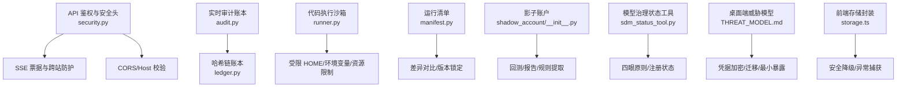
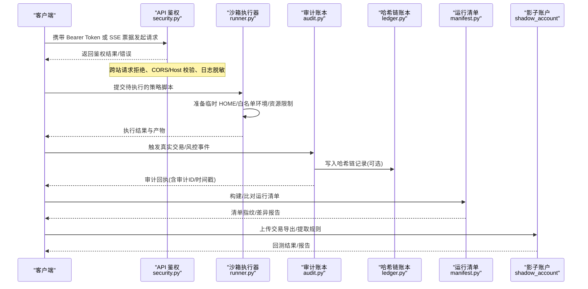
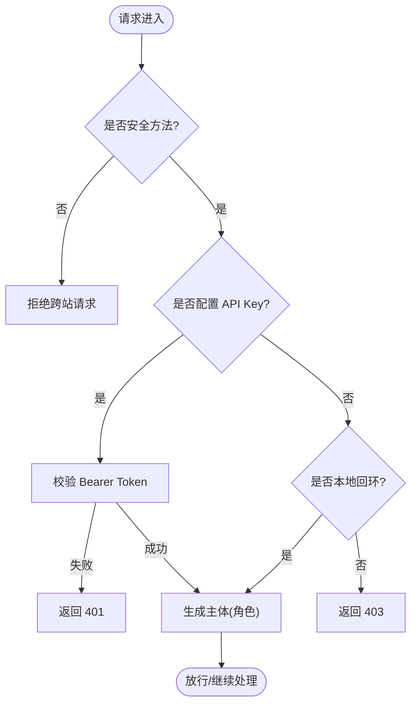
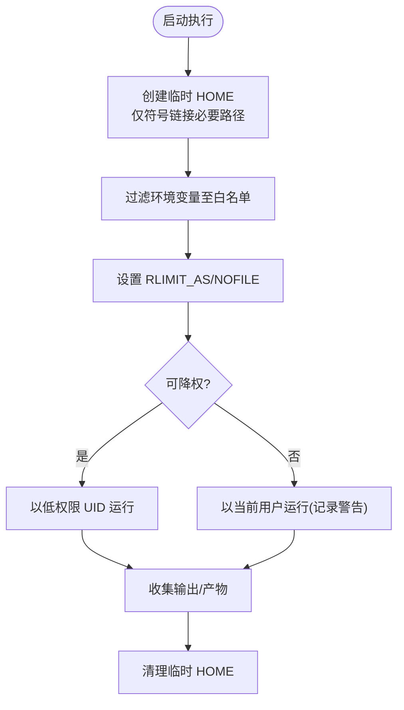
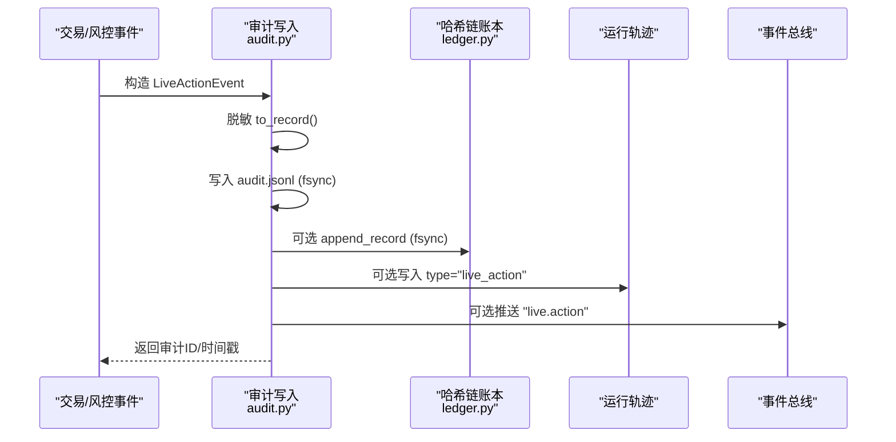
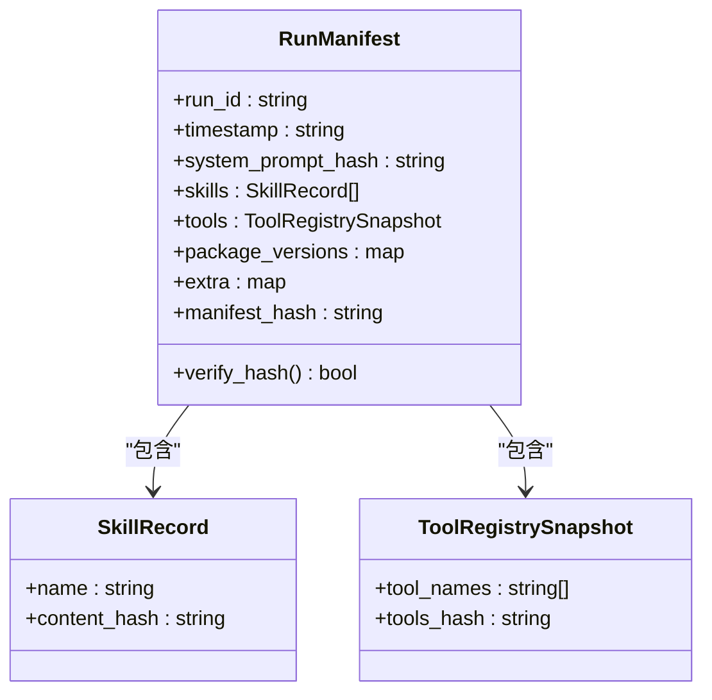
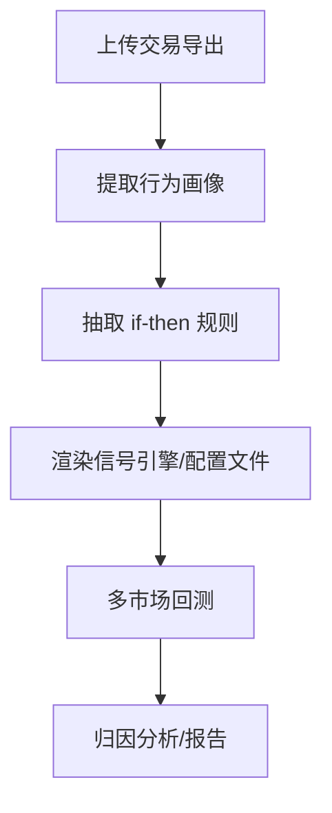
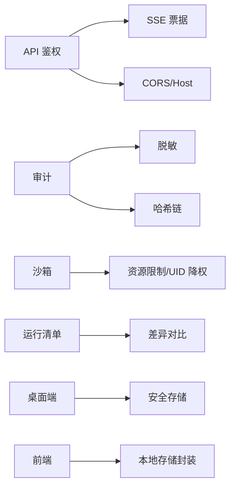

# 安全与治理

<cite>
**本文引用的文件**
- [agent/src/api/security.py](file://agent/src/api/security.py)
- [agent/src/live/audit.py](file://agent/src/live/audit.py)
- [agent/src/governance/ledger.py](file://agent/src/governance/ledger.py)
- [agent/src/core/runner.py](file://agent/src/core/runner.py)
- [agent/src/governance/manifest.py](file://agent/src/governance/manifest.py)
- [agent/src/shadow_account/__init__.py](file://agent/src/shadow_account/__init__.py)
- [agent/src/tools/sdm_status_tool.py](file://agent/src/tools/sdm_status_tool.py)
- [desktop/electron/THREAT_MODEL.md](file://desktop/electron/THREAT_MODEL.md)
- [frontend/src/lib/storage.ts](file://frontend/src/lib/storage.ts)
- [agent/tests/test_runner_env.py](file://agent/tests/test_runner_env.py)
- [agent/tests/test_governance.py](file://agent/tests/test_governance.py)
- [agent/tests/test_shadow_account.py](file://agent/tests/test_shadow_account.py)
- [agent/tests/test_principal_wiring.py](file://agent/tests/test_principal_wiring.py)
</cite>

## 目录
1. [简介](#简介)
2. [项目结构](#项目结构)
3. [核心组件](#核心组件)
4. [架构总览](#架构总览)
5. [详细组件分析](#详细组件分析)
6. [依赖关系分析](#依赖关系分析)
7. [性能考量](#性能考量)
8. [故障排查指南](#故障排查指南)
9. [结论](#结论)
10. [附录](#附录)

## 简介
本技术文档聚焦于系统的安全与治理体系，覆盖认证与授权、数据安全策略、沙箱隔离执行、审计日志与合规证据链、治理框架（策略管理、规则引擎、决策追溯）、影子账户功能，以及威胁分析与防护措施。目标读者为安全工程师与合规人员，旨在提供可落地的实践指导与架构级说明。

## 项目结构
与安全治理相关的核心模块分布在以下位置：
- API 层鉴权与安全头：agent/src/api/security.py
- 实时交易审计账本：agent/src/live/audit.py
- 防篡改哈希链账本：agent/src/governance/ledger.py
- 代码执行沙箱与环境裁剪：agent/src/core/runner.py
- 运行清单与差异对比：agent/src/governance/manifest.py
- 影子账户能力入口：agent/src/shadow_account/__init__.py
- 模型治理状态工具：agent/src/tools/sdm_status_tool.py
- 桌面端凭据存储威胁模型：desktop/electron/THREAT_MODEL.md
- 前端本地存储安全封装：frontend/src/lib/storage.ts

**图表来源**
- [agent/src/api/security.py:166-253](file://agent/src/api/security.py#L166-L253)
- [agent/src/live/audit.py:1-59](file://agent/src/live/audit.py#L1-L59)
- [agent/src/governance/ledger.py:1-48](file://agent/src/governance/ledger.py#L1-L48)
- [agent/src/core/runner.py:34-53](file://agent/src/core/runner.py#L34-L53)
- [agent/src/governance/manifest.py:1-33](file://agent/src/governance/manifest.py#L1-L33)
- [agent/src/shadow_account/__init__.py:1-54](file://agent/src/shadow_account/__init__.py#L1-L54)
- [agent/src/tools/sdm_status_tool.py:38-71](file://agent/src/tools/sdm_status_tool.py#L38-L71)
- [desktop/electron/THREAT_MODEL.md:163-179](file://desktop/electron/THREAT_MODEL.md#L163-L179)
- [frontend/src/lib/storage.ts:1-29](file://frontend/src/lib/storage.ts#L1-L29)

**章节来源**
- [agent/src/api/security.py:166-253](file://agent/src/api/security.py#L166-L253)
- [agent/src/live/audit.py:1-59](file://agent/src/live/audit.py#L1-L59)
- [agent/src/governance/ledger.py:1-48](file://agent/src/governance/ledger.py#L1-L48)
- [agent/src/core/runner.py:34-53](file://agent/src/core/runner.py#L34-L53)
- [agent/src/governance/manifest.py:1-33](file://agent/src/governance/manifest.py#L1-L33)
- [agent/src/shadow_account/__init__.py:1-54](file://agent/src/shadow_account/__init__.py#L1-L54)
- [agent/src/tools/sdm_status_tool.py:38-71](file://agent/src/tools/sdm_status_tool.py#L38-L71)
- [desktop/electron/THREAT_MODEL.md:163-179](file://desktop/electron/THREAT_MODEL.md#L163-L179)
- [frontend/src/lib/storage.ts:1-29](file://frontend/src/lib/storage.ts#L1-L29)

## 核心组件
- 认证与授权
  - 基于 Bearer Token 的 API Key 校验；未配置 Key 时仅信任本地回环客户端；支持 SSE 一次性票据避免长密钥泄露到 URL。
  - 跨站请求拒绝、CORS 白名单、Host 校验与 DNS 重绑定防护。
- 数据安全策略
  - 访问日志中敏感查询参数值脱敏；桌面端凭据通过安全存储加密并迁移；前端本地存储使用安全封装以在受限环境中降级。
- 沙箱机制
  - 生成代码在独立子进程中执行；HOME 被替换为临时目录，仅以符号链接方式暴露必要路径；环境变量白名单；POSIX 下设置 RLIMIT_AS/NOFILE；可选 UID 降权。
- 审计日志与证据链
  - 所有真实资金操作写入专用追加式审计账本，记录经脱敏后多路分发；同时维护哈希链账本实现防篡改验证与归档轮换。
- 治理框架
  - 运行清单对系统提示、技能、工具集、关键包版本进行内容寻址化指纹；支持差异对比与可重复性判定。
  - 模型治理状态工具输出注册信息、四眼原则违规检测等。
- 影子账户
  - 从用户交易日志提取行为画像与规则，生成可回测的影子策略，并在多市场进行回测与归因分析。

**章节来源**
- [agent/src/api/security.py:343-504](file://agent/src/api/security.py#L343-L504)
- [agent/src/api/security.py:591-622](file://agent/src/api/security.py#L591-L622)
- [agent/src/api/security.py:260-297](file://agent/src/api/security.py#L260-L297)
- [desktop/electron/THREAT_MODEL.md:163-179](file://desktop/electron/THREAT_MODEL.md#L163-L179)
- [frontend/src/lib/storage.ts:1-29](file://frontend/src/lib/storage.ts#L1-L29)
- [agent/src/core/runner.py:113-172](file://agent/src/core/runner.py#L113-L172)
- [agent/src/core/runner.py:259-341](file://agent/src/core/runner.py#L259-L341)
- [agent/src/core/runner.py:571-592](file://agent/src/core/runner.py#L571-L592)
- [agent/src/live/audit.py:1-59](file://agent/src/live/audit.py#L1-L59)
- [agent/src/governance/ledger.py:1-48](file://agent/src/governance/ledger.py#L1-L48)
- [agent/src/governance/manifest.py:1-33](file://agent/src/governance/manifest.py#L1-L33)
- [agent/src/tools/sdm_status_tool.py:38-71](file://agent/src/tools/sdm_status_tool.py#L38-L71)
- [agent/src/shadow_account/__init__.py:1-54](file://agent/src/shadow_account/__init__.py#L1-L54)

## 架构总览
下图展示了安全与治理的关键交互：API 鉴权保护路由，SSE 票据用于浏览器流式连接；运行时将生成的策略放入沙箱执行；真实交易动作进入审计账本并同步到哈希链；运行清单记录方法论组成以便追溯；影子账户从历史交易提取规则并回测。

**图表来源**
- [agent/src/api/security.py:343-504](file://agent/src/api/security.py#L343-L504)
- [agent/src/api/security.py:591-622](file://agent/src/api/security.py#L591-L622)
- [agent/src/core/runner.py:113-172](file://agent/src/core/runner.py#L113-L172)
- [agent/src/core/runner.py:259-341](file://agent/src/core/runner.py#L259-L341)
- [agent/src/live/audit.py:248-351](file://agent/src/live/audit.py#L248-L351)
- [agent/src/governance/ledger.py:368-469](file://agent/src/governance/ledger.py#L368-L469)
- [agent/src/governance/manifest.py:356-430](file://agent/src/governance/manifest.py#L356-L430)
- [agent/src/shadow_account/__init__.py:1-54](file://agent/src/shadow_account/__init__.py#L1-L54)

## 详细组件分析

### 认证与授权（API 鉴权、SSE 票据、跨站防护）
- 支持两种认证模式：
  - 已配置 API Key：必须提供有效 Bearer Token，否则 401。
  - 未配置 API Key：仅允许本地回环客户端访问，否则 403。
- SSE 流式连接使用一次性票据，避免长密钥出现在 URL 与日志中。
- 跨站请求拒绝：对非安全方法或非同源 Origin 的请求直接拒绝。
- CORS 与 Host 校验：禁止通配符，支持额外可信 Host 列表。
- 访问日志脱敏：对查询串中的 api_key/ticket 值进行脱敏。

**图表来源**
- [agent/src/api/security.py:463-504](file://agent/src/api/security.py#L463-L504)
- [agent/src/api/security.py:591-622](file://agent/src/api/security.py#L591-L622)
- [agent/src/api/security.py:423-431](file://agent/src/api/security.py#L423-L431)
- [agent/src/api/security.py:260-297](file://agent/src/api/security.py#L260-L297)

**章节来源**
- [agent/src/api/security.py:343-504](file://agent/src/api/security.py#L343-L504)
- [agent/src/api/security.py:591-622](file://agent/src/api/security.py#L591-L622)
- [agent/src/api/security.py:423-431](file://agent/src/api/security.py#L423-L431)
- [agent/src/api/security.py:260-297](file://agent/src/api/security.py#L260-L297)
- [agent/tests/test_principal_wiring.py:116-130](file://agent/tests/test_principal_wiring.py#L116-L130)

### 数据安全策略（传输、存储、日志）
- 传输安全：
  - CSP/Permissions-Policy/Referrer-Policy 响应头强化浏览器侧安全。
  - CORS 严格白名单，禁止通配符。
- 存储安全：
  - 桌面端凭据通过安全存储加密，明文字段迁移后移除；写入采用临时文件+原子重命名。
- 日志脱敏：
  - 访问日志中对敏感查询参数值进行脱敏，防止密钥泄露。
- 前端安全：
  - 本地存储访问封装，遇到受限环境自动降级，避免白屏。

**章节来源**
- [agent/src/api/security.py:180-253](file://agent/src/api/security.py#L180-L253)
- [desktop/electron/THREAT_MODEL.md:163-179](file://desktop/electron/THREAT_MODEL.md#L163-L179)
- [agent/src/api/security.py:260-297](file://agent/src/api/security.py#L260-L297)
- [frontend/src/lib/storage.ts:1-29](file://frontend/src/lib/storage.ts#L1-L29)

### 沙箱机制（代码执行隔离、资源限制、网络访问控制）
- 执行隔离：
  - 生成代码在独立子进程执行；HOME 替换为临时目录，仅以符号链接暴露必要路径（如缓存、数据桥、qveris.json）。
- 环境变量白名单：
  - 仅传递运行所需的环境变量，避免继承 LLM/券商/生产凭据。
- 资源限制：
  - POSIX 下通过 RLIMIT_AS 限制虚拟地址空间，RLIMIT_NOFILE 限制文件描述符；可通过环境变量调整上限。
- 权限降权：
  - 若存在专用沙箱用户且具备能力，子进程将以低权限 UID/GID 运行；不可降权时记录警告并继续执行（AST 静态防御仍生效）。
- 测试覆盖：
  - 验证沙箱 HOME 仅暴露必要路径、预置 mootdx 配置、资源限制读取与默认值。

**图表来源**
- [agent/src/core/runner.py:113-172](file://agent/src/core/runner.py#L113-L172)
- [agent/src/core/runner.py:259-341](file://agent/src/core/runner.py#L259-L341)
- [agent/src/core/runner.py:571-592](file://agent/src/core/runner.py#L571-L592)
- [agent/tests/test_runner_env.py:161-222](file://agent/tests/test_runner_env.py#L161-L222)

**章节来源**
- [agent/src/core/runner.py:113-172](file://agent/src/core/runner.py#L113-L172)
- [agent/src/core/runner.py:259-341](file://agent/src/core/runner.py#L259-L341)
- [agent/src/core/runner.py:571-592](file://agent/src/core/runner.py#L571-L592)
- [agent/tests/test_runner_env.py:161-222](file://agent/tests/test_runner_env.py#L161-L222)

### 审计日志系统（操作记录、合规检查、证据保全）
- 三通道写入：
  - 专用合规账本（append-only，fsync），可选每运行目录 TraceWriter，可选表面事件回调。
- 脱敏：
  - 写入前对所有敏感字段进行脱敏，确保 OAuth/账号/PII 不落地。
- 防篡改链：
  - 可选写入哈希链账本，每条记录包含 seq/prev_record_hash/record_hash；支持归档与全量验证。
- 容错：
  - 链写入失败不影响主账本持久化；后续可通过验证发现断点。

**图表来源**
- [agent/src/live/audit.py:248-351](file://agent/src/live/audit.py#L248-L351)
- [agent/src/governance/ledger.py:368-469](file://agent/src/governance/ledger.py#L368-L469)

**章节来源**
- [agent/src/live/audit.py:1-59](file://agent/src/live/audit.py#L1-L59)
- [agent/src/live/audit.py:248-351](file://agent/src/live/audit.py#L248-L351)
- [agent/src/governance/ledger.py:1-48](file://agent/src/governance/ledger.py#L1-L48)
- [agent/tests/test_governance.py:662-732](file://agent/tests/test_governance.py#L662-L732)

### 治理框架（策略管理、规则引擎、决策追溯）
- 运行清单：
  - 对系统提示、技能、工具集、关键包版本进行内容寻址化指纹；排除 run_id/timestamp，保证可重复比较。
  - 支持差异对比，精确指出变更项（技能/工具/版本/扩展维度）。
- 模型治理：
  - 输出注册状态与“四眼原则”违规检测；未注册即视为无主模型。
- 决策追溯：
  - 审计账本与运行清单共同构成“谁在何时以何种方法做了什么”的可审计链条。

**图表来源**
- [agent/src/governance/manifest.py:128-186](file://agent/src/governance/manifest.py#L128-L186)
- [agent/src/governance/manifest.py:218-269](file://agent/src/governance/manifest.py#L218-L269)
- [agent/src/governance/manifest.py:356-430](file://agent/src/governance/manifest.py#L356-L430)
- [agent/src/governance/manifest.py:478-531](file://agent/src/governance/manifest.py#L478-L531)
- [agent/src/tools/sdm_status_tool.py:38-71](file://agent/src/tools/sdm_status_tool.py#L38-L71)

**章节来源**
- [agent/src/governance/manifest.py:1-33](file://agent/src/governance/manifest.py#L1-L33)
- [agent/src/governance/manifest.py:128-186](file://agent/src/governance/manifest.py#L128-L186)
- [agent/src/governance/manifest.py:218-269](file://agent/src/governance/manifest.py#L218-L269)
- [agent/src/governance/manifest.py:356-430](file://agent/src/governance/manifest.py#L356-L430)
- [agent/src/governance/manifest.py:478-531](file://agent/src/governance/manifest.py#L478-L531)
- [agent/src/tools/sdm_status_tool.py:38-71](file://agent/src/tools/sdm_status_tool.py#L38-L71)

### 影子账户（模拟交易、风险评估、策略验证）
- 能力入口：
  - 提供提取影子画像、渲染信号引擎、多市场回测、报告渲染等公开接口。
- 工作流：
  - 解析交易导出 → 行为画像 → 规则提取 → 生成策略代码 → 多市场回测 → 归因与报告。
- 安全与质量：
  - 生成的信号引擎需通过语法/结构校验；回测结果用于评估策略稳健性与风险指标。

**图表来源**
- [agent/src/shadow_account/__init__.py:1-54](file://agent/src/shadow_account/__init__.py#L1-L54)
- [agent/tests/test_shadow_account.py:1766-1806](file://agent/tests/test_shadow_account.py#L1766-L1806)

**章节来源**
- [agent/src/shadow_account/__init__.py:1-54](file://agent/src/shadow_account/__init__.py#L1-L54)
- [agent/tests/test_shadow_account.py:1766-1806](file://agent/tests/test_shadow_account.py#L1766-L1806)

## 依赖关系分析
- 组件耦合：
  - API 鉴权模块被服务启动时引入，提供中间件与依赖注入。
  - 审计模块依赖脱敏工具与路径解析，并与哈希链模块协作。
  - 沙箱执行器依赖系统资源模块与平台能力，具备优雅降级。
  - 治理清单与审计账本共同支撑可追溯性。
- 外部依赖：
  - 桌面端依赖安全存储库进行凭据加密。
  - 前端依赖浏览器存储 API 并提供安全封装。

**图表来源**
- [agent/src/api/security.py:343-504](file://agent/src/api/security.py#L343-L504)
- [agent/src/live/audit.py:248-351](file://agent/src/live/audit.py#L248-L351)
- [agent/src/governance/ledger.py:368-469](file://agent/src/governance/ledger.py#L368-L469)
- [agent/src/core/runner.py:113-172](file://agent/src/core/runner.py#L113-L172)
- [agent/src/governance/manifest.py:356-430](file://agent/src/governance/manifest.py#L356-L430)
- [desktop/electron/THREAT_MODEL.md:163-179](file://desktop/electron/THREAT_MODEL.md#L163-L179)
- [frontend/src/lib/storage.ts:1-29](file://frontend/src/lib/storage.ts#L1-L29)

**章节来源**
- [agent/src/api/security.py:343-504](file://agent/src/api/security.py#L343-L504)
- [agent/src/live/audit.py:248-351](file://agent/src/live/audit.py#L248-L351)
- [agent/src/governance/ledger.py:368-469](file://agent/src/governance/ledger.py#L368-L469)
- [agent/src/core/runner.py:113-172](file://agent/src/core/runner.py#L113-L172)
- [agent/src/governance/manifest.py:356-430](file://agent/src/governance/manifest.py#L356-L430)
- [desktop/electron/THREAT_MODEL.md:163-179](file://desktop/electron/THREAT_MODEL.md#L163-L179)
- [frontend/src/lib/storage.ts:1-29](file://frontend/src/lib/storage.ts#L1-L29)

## 性能考量
- 哈希链追加的 O(n) 验证：
  - 每次追加会完整校验现有链，保障强一致性；适用于低频高价值事件（订单/指令/风控），可接受延迟。
- fsync 与目录同步：
  - 审计与链账本写入均尝试 fsync，首次创建目录也会同步目录项，提升崩溃恢复能力。
- 沙箱资源限制：
  - RLIMIT_AS 默认 4GB，避免恶意占用导致 DoS；可根据分钟级大任务调优。
- 环境变量裁剪：
  - 仅传递必要环境变量，减少子进程初始化开销与潜在泄漏面。

[本节为通用性能讨论，无需特定文件引用]

## 故障排查指南
- 认证失败
  - 检查是否配置 API Key；本地开发未配置 Key 时仅允许回环访问；确认 Bearer Token 正确。
  - 若使用 SSE，确认已通过 POST /auth/sse-ticket 获取一次性票据并通过 ?ticket= 传递。
- 跨站请求被拒
  - 检查 Origin/Sec-Fetch-Site；确保来自受信任的同源或回环站点。
- 沙箱执行异常
  - 检查临时 HOME 创建与符号链接；确认环境变量白名单；查看资源限制是否过严。
- 审计链断裂
  - 使用链验证工具检查断点；归档段删除或编辑会被检测到；必要时隔离并修复。
- 前端存储不可用
  - 在受限环境中 localStorage 可能抛出异常；封装会自动降级，检查应用是否按预期回退。

**章节来源**
- [agent/src/api/security.py:463-504](file://agent/src/api/security.py#L463-L504)
- [agent/src/api/security.py:591-622](file://agent/src/api/security.py#L591-L622)
- [agent/src/core/runner.py:113-172](file://agent/src/core/runner.py#L113-L172)
- [agent/src/governance/ledger.py:309-324](file://agent/src/governance/ledger.py#L309-L324)
- [agent/src/governance/ledger.py:665-739](file://agent/src/governance/ledger.py#L665-L739)
- [frontend/src/lib/storage.ts:1-29](file://frontend/src/lib/storage.ts#L1-L29)

## 结论
本系统在认证授权、数据安全、沙箱隔离、审计与治理方面提供了纵深防御与可审计能力。通过哈希链账本与运行清单，实现了强一致的证据链与方法论可重复性；沙箱与环境裁剪降低了执行风险；影子账户为策略验证与风险评估提供了闭环。建议在生产部署中启用 API Key、严格 CORS/Host 策略、开启链账本与归档，并结合桌面端安全存储与前端安全封装，形成端到端的安全与治理体系。

[本节为总结性内容，无需特定文件引用]

## 附录
- 最佳实践
  - 始终配置 API Key 并仅在回环开发环境放宽限制。
  - 启用 CSP/Permissions-Policy，限制不必要的能力。
  - 使用沙箱执行任意代码，限制 HOME/环境变量/资源。
  - 开启审计链与归档，定期验证完整性。
  - 使用运行清单进行方法论版本管理与差异对比。
  - 影子账户用于策略验证与风险评估，结合多市场回测。
- 合规要求
  - 所有真实资金操作必须审计并脱敏。
  - 策略与模型需注册并满足四眼原则。
  - 凭据加密存储，禁止明文落地。
  - 前端在受限环境中安全降级，避免泄露。

[本节为通用指导，无需特定文件引用]