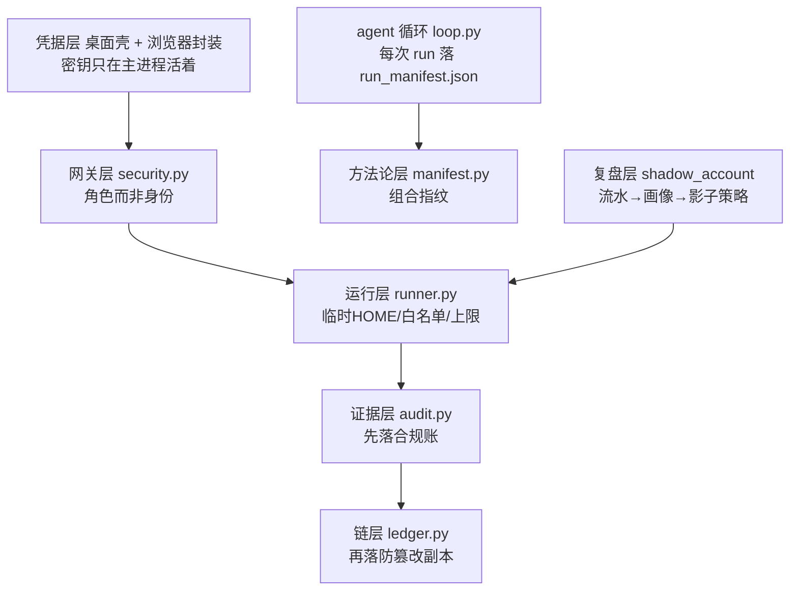
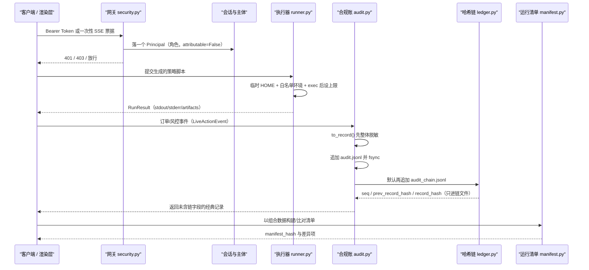
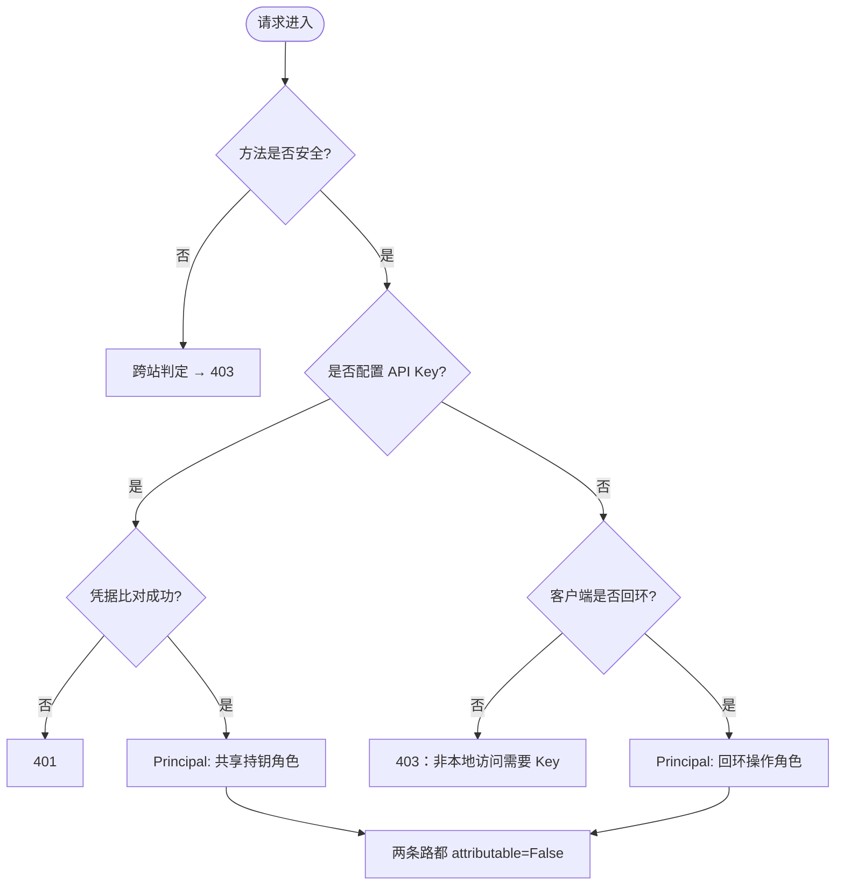
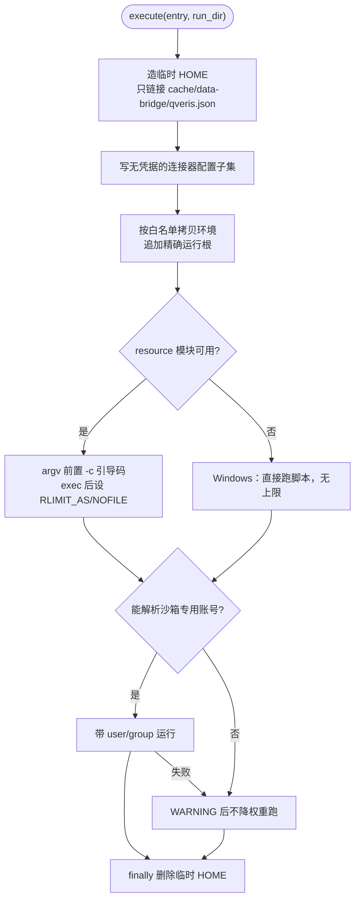
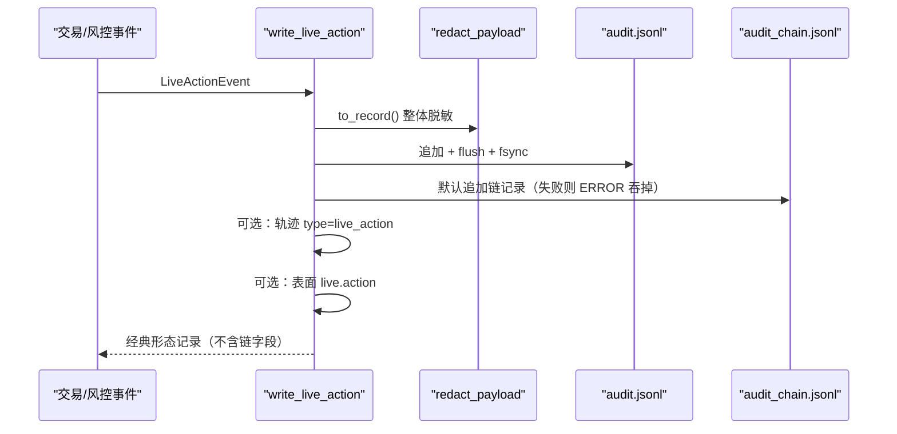
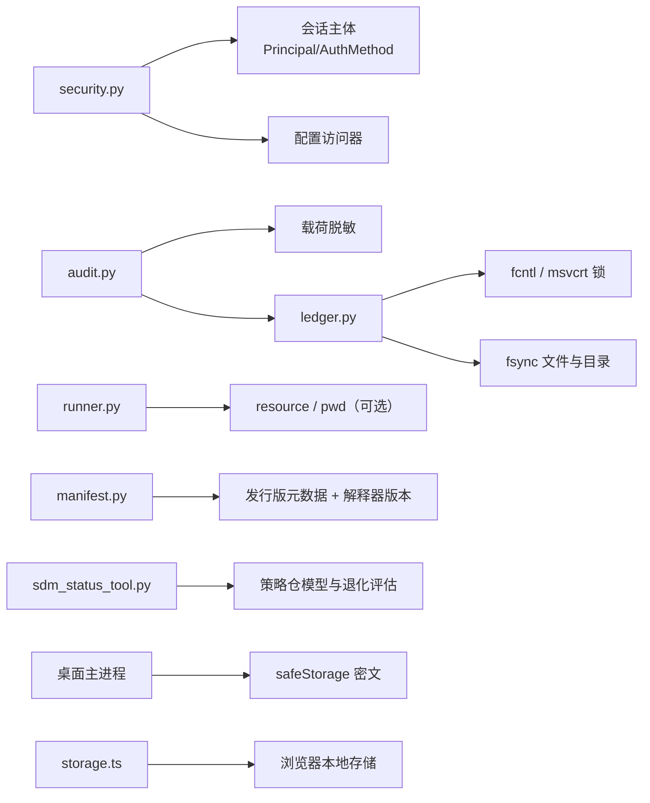

# 安全与治理

<cite>
**本文引用的文件**
- [agent/src/agent/loop.py](file://agent/src/agent/loop.py)
- [agent/src/api/security.py](file://agent/src/api/security.py)
- [agent/src/core/runner.py](file://agent/src/core/runner.py)
- [agent/src/governance/ledger.py](file://agent/src/governance/ledger.py)
- [agent/src/governance/manifest.py](file://agent/src/governance/manifest.py)
- [agent/src/live/audit.py](file://agent/src/live/audit.py)
- [agent/src/shadow_account/__init__.py](file://agent/src/shadow_account/__init__.py)
- [agent/src/tools/sdm_status_tool.py](file://agent/src/tools/sdm_status_tool.py)
- [agent/tests/test_governance.py](file://agent/tests/test_governance.py)
- [agent/tests/test_principal_wiring.py](file://agent/tests/test_principal_wiring.py)
- [agent/tests/test_run_manifest_wiring.py](file://agent/tests/test_run_manifest_wiring.py)
- [agent/tests/test_runner_env.py](file://agent/tests/test_runner_env.py)
- [agent/tests/test_shadow_account.py](file://agent/tests/test_shadow_account.py)
- [desktop/electron/THREAT_MODEL.md](file://desktop/electron/THREAT_MODEL.md)
- [frontend/src/lib/storage.ts](file://frontend/src/lib/storage.ts)
</cite>

## 目录
1. [简介](#简介)
2. [治理面的落点](#治理面的落点)
3. [核心组件](#核心组件)
4. [架构总览](#架构总览)
5. [详细组件分析](#详细组件分析)
6. [边界与非目标](#边界与非目标)
7. [依赖关系分析](#依赖关系分析)
8. [性能与可靠性考量](#性能与可靠性考量)
9. [故障排查指南](#故障排查指南)
10. [结论](#结论)
11. [附录](#附录)

## 简介
本页是「安全与治理」的总览页，讲三件事：**治理面在仓库里落在哪些模块**、**这些模块串成的链条是什么形状**、**每一环保证什么、又不保证什么**。

链条的形状可以背下来：一次请求先被**网关层**鉴权（换到的是一个*角色*，不是一个*人*），生成的策略代码进**运行层**沙箱执行，真实资金动作进**证据层**双账本（合规账 + 防篡改链），方法论组成进**方法论层**清单指纹，历史成交流水进**复盘层**影子账户。桌面壳与浏览器是这条链外侧的**凭据层**，管的是密钥在哪一个进程里活着。

分层细节不在本页：审计事件字段与链的取证语义、数据安全与脱敏面、影子账户的画像与回测算法、沙箱的逐层降级、认证路由与主体模型，分别由同目录下的 `审计日志.md`、`数据安全.md`、`影子账户.md`、`沙箱机制.md`、`认证与授权.md` 五页展开；本页只给出边界与交接点。

## 治理面的落点
- 网关层（鉴权、跨站、响应头、访问日志脱敏）：`agent/src/api/security.py`
- 运行层（临时 HOME、环境白名单、资源上限、UID 降权）：`agent/src/core/runner.py`
- 证据层：`agent/src/live/audit.py`（合规账与三通道分发）＋ `agent/src/governance/ledger.py`（哈希链原语）
- 方法论层：`agent/src/governance/manifest.py`（运行清单指纹）＋ `agent/src/tools/sdm_status_tool.py`（策略/因子状态与模型治理读数）＋ `agent/src/agent/loop.py`（把清单接进 run 起点并落盘的接入点）
- 复盘层：`agent/src/shadow_account/__init__.py`（能力入口）
- 凭据层：`desktop/electron/THREAT_MODEL.md`（进程边界与威胁模型）＋ `frontend/src/lib/storage.ts`（浏览器侧受限环境降级）
- 契约证据：`agent/tests/test_governance.py`、`agent/tests/test_runner_env.py`、`agent/tests/test_principal_wiring.py`、`agent/tests/test_run_manifest_wiring.py`、`agent/tests/test_shadow_account.py`

**图表来源**
- [agent/src/api/security.py:454-504](file://agent/src/api/security.py#L454-L504)
- [agent/src/core/runner.py:628-680](file://agent/src/core/runner.py#L628-L680)
- [agent/src/live/audit.py:301-355](file://agent/src/live/audit.py#L301-L355)
- [agent/src/governance/ledger.py:368-469](file://agent/src/governance/ledger.py#L368-L469)
- [agent/src/governance/manifest.py:356-430](file://agent/src/governance/manifest.py#L356-L430)
- [agent/src/agent/loop.py:1008-1063](file://agent/src/agent/loop.py#L1008-L1063)
- [agent/src/shadow_account/__init__.py:1-53](file://agent/src/shadow_account/__init__.py#L1-L53)
- [desktop/electron/THREAT_MODEL.md:31-74](file://desktop/electron/THREAT_MODEL.md#L31-L74)

**章节来源**
- [agent/src/api/security.py:1-24](file://agent/src/api/security.py#L1-L24)
- [agent/src/core/runner.py:34-53](file://agent/src/core/runner.py#L34-L53)
- [agent/src/live/audit.py:1-59](file://agent/src/live/audit.py#L1-L59)
- [agent/src/governance/ledger.py:1-48](file://agent/src/governance/ledger.py#L1-L48)
- [agent/src/governance/manifest.py:1-32](file://agent/src/governance/manifest.py#L1-L32)
- [agent/src/tools/sdm_status_tool.py:1-18](file://agent/src/tools/sdm_status_tool.py#L1-L18)
- [desktop/electron/THREAT_MODEL.md:3-15](file://desktop/electron/THREAT_MODEL.md#L3-L15)
- [frontend/src/lib/storage.ts:1-5](file://frontend/src/lib/storage.ts#L1-L5)

## 核心组件
- 认证与授权
  - Bearer Token 校验配置了的 API Key；没配 Key 时才启用「回环即信任」的开发模式。Key-first：只要配了 Key，连回环客户端也必须出示凭据。
  - 两条路都只授予身份*角色*（共享持钥者 / 回环操作者），返回的主体 `attributable=False`；需要「人」的调用方必须检查这个标志并拒绝，而不是把 `subject` 读成人。
  - 浏览器流式连接用一次性短票换掉长密钥；跨站请求、不可信 Host、通配符 CORS 各自被独立拒掉。
- 数据安全
  - 访问日志层脱敏 `api_key=` / `ticket=` 的*值*；审计记录层在写入任何目的地之前先整体脱敏。
  - 桌面凭据只以密文落盘、只注入自有子进程环境；浏览器侧存储访问全部走 try/catch 封装，受限环境降级为不持久化。
- 沙箱机制
  - 临时 HOME 只以符号链接（无权限时退化为拷贝）重新暴露 loader 拥有的少数路径；真实家目录里的 `.env`、会话库、live 账本对生成代码不可见。
  - 环境变量按白名单拷贝：保留 OS/Python 基础项、代理与证书设置、只读行情配置；LLM、API 服务、券商/实盘凭据不继承。
  - 资源上限由 exec 之后的引导代码施加，绝不使用 `preexec_fn`；UID 降权只在加固镜像里成立，失败则告警后照常执行。
- 审计与证据链
  - 真实资金动作先无条件写进专用合规账本并 fsync，再追加哈希链副本；链写失败只记 ERROR 并吞掉，缺口留给链验证发现。
  - 链账本提供导出（可离线复验）、按大小封段（**只封不删**）、跨段全量验证（整段删除会在接缝处暴露）。
- 治理框架
  - 运行清单把系统提示、技能、工具集、关键包版本压成一个确定性指纹，刻意排除 `run_id`/`timestamp`，从而能回答「方法论变了没有」。
  - 状态工具对每个策略/因子工件附带治理读数（是否注册、是否违反四眼原则）与退化检查建议；清单模块那句「接入 agent 循环不在范围内」只是**本模块**的范围声明，接入实际发生在 agent 循环里（详见方法论层一节）。
- 影子账户
  - 从成交流水提取画像与规则、渲染信号引擎与配置、在多市场跑影子回测并做归因；价格特征严格 as-of，只用已收盘数据。

**章节来源**
- [agent/src/api/security.py:300-340](file://agent/src/api/security.py#L300-L340)
- [agent/src/api/security.py:423-431](file://agent/src/api/security.py#L423-L431)
- [agent/src/api/security.py:260-297](file://agent/src/api/security.py#L260-L297)
- [agent/src/api/security.py:454-504](file://agent/src/api/security.py#L454-L504)
- [agent/src/core/runner.py:181-230](file://agent/src/core/runner.py#L181-L230)
- [agent/src/core/runner.py:259-361](file://agent/src/core/runner.py#L259-L361)
- [agent/src/core/runner.py:86-145](file://agent/src/core/runner.py#L86-L145)
- [agent/src/live/audit.py:22-28](file://agent/src/live/audit.py#L22-L28)
- [agent/src/live/audit.py:301-344](file://agent/src/live/audit.py#L301-L344)
- [agent/src/governance/ledger.py:614-662](file://agent/src/governance/ledger.py#L614-L662)
- [agent/src/governance/manifest.py:1-32](file://agent/src/governance/manifest.py#L1-L32)
- [agent/src/tools/sdm_status_tool.py:49-69](file://agent/src/tools/sdm_status_tool.py#L49-L69)
- [agent/src/shadow_account/__init__.py:1-53](file://agent/src/shadow_account/__init__.py#L1-L53)
- [agent/tests/test_shadow_account.py:1202-1258](file://agent/tests/test_shadow_account.py#L1202-L1258)
- [frontend/src/lib/storage.ts:1-29](file://frontend/src/lib/storage.ts#L1-L29)
- [desktop/electron/THREAT_MODEL.md:163-179](file://desktop/electron/THREAT_MODEL.md#L163-L179)

## 架构总览
一次「真实资金动作」在治理链上留下的痕迹，是判断这套体系是否可用的最小可观测单元：请求先证明*持钥*，执行先证明*可读边界*，落账先证明*发生过*，链副本再证明*没被改过*，清单最后证明*用什么方法做的*。

**图表来源**
- [agent/src/api/security.py:463-504](file://agent/src/api/security.py#L463-L504)
- [agent/src/api/security.py:591-622](file://agent/src/api/security.py#L591-L622)
- [agent/src/core/runner.py:594-680](file://agent/src/core/runner.py#L594-L680)
- [agent/src/live/audit.py:248-355](file://agent/src/live/audit.py#L248-L355)
- [agent/src/governance/ledger.py:368-469](file://agent/src/governance/ledger.py#L368-L469)
- [agent/src/governance/manifest.py:356-430](file://agent/src/governance/manifest.py#L356-L430)

## 详细组件分析

### 认证与授权（网关层）
- 凭据解析与优先级
  - API Key 从配置解析并兼容别名，再退到宿主进程变量；没配 Key 才允许「回环即信任」。
  - 非常规方法（非 GET/HEAD/OPTIONS）先做跨站判定；`Sec-Fetch-Site: cross-site` 直接 403，非同源且非回环的 `Origin` 也 403。
  - 凭据只从被允许的来源取：流式路由只认 Bearer 头或一次性票据，长密钥不接受查询串形式。
- 主体（Principal）的诚实性
  - 两条认证路径返回的角色常量分别是共享持钥者与回环操作者，注释明确写着「这是角色不是人」。
  - 该主体会被线程化进会话并持久化：HTTP 建会话时记录 `LOOPBACK_TRUST` 且 `attributable is False`；老会话文件缺 `owner` 键也能载入，`owner` 为 `None` 表示未知而非匿名者。
- 传输与浏览器侧的闸门
  - 默认 CORS 只有回环来源；`CORS_ORIGINS` 是*替换*语义，额外可信来源用追加语义，两者都拒绝 `*`（带凭据的 CORS 不允许通配）。
  - 中间件在鉴权旁路之前先拦下不可信的 Host，防 DNS 重绑定；可信 Host 名单可扩展。
  - 每个响应补 CSP（默认强制，可切 Report-Only）、`nosniff`、`X-Frame-Options: DENY`、拒绝式 Permissions-Policy 与严格 Referrer-Policy；HSTS 刻意不发，交给终止 TLS 的反向代理。
  - 文档路由（Swagger/ReDoc）因需要从外部 CDN 加载并内联引导脚本，只给它一条窄例外策略而不是全站放宽。
  - 访问日志过滤器装在 uvicorn 的 access/error logger 上且幂等，把 `api_key=`/`ticket=` 的值替换为固定占位符。
- 其它闸门
  - 设置写入、设置读、本地关停控制面各有独立依赖：写凭据路由的设置要求 Key 或回环，关停同样如此。
  - 服务端 shell 工具由配置显式开启，默认关。
  - 容器部署可选把「宿主机默认网关 IP」当作可信回环，其地址来自 Linux procfs 路由表，非 Linux 环境自然拿不到。

**图表来源**
- [agent/src/api/security.py:463-504](file://agent/src/api/security.py#L463-L504)
- [agent/src/api/security.py:423-431](file://agent/src/api/security.py#L423-L431)
- [agent/src/api/security.py:507-518](file://agent/src/api/security.py#L507-L518)
- [agent/src/api/security.py:454-460](file://agent/src/api/security.py#L454-L460)

**章节来源**
- [agent/src/api/security.py:30-51](file://agent/src/api/security.py#L30-L51)
- [agent/src/api/security.py:69-103](file://agent/src/api/security.py#L69-L103)
- [agent/src/api/security.py:106-136](file://agent/src/api/security.py#L106-L136)
- [agent/src/api/security.py:147-158](file://agent/src/api/security.py#L147-L158)
- [agent/src/api/security.py:166-173](file://agent/src/api/security.py#L166-L173)
- [agent/src/api/security.py:181-253](file://agent/src/api/security.py#L181-L253)
- [agent/src/api/security.py:260-297](file://agent/src/api/security.py#L260-L297)
- [agent/src/api/security.py:300-340](file://agent/src/api/security.py#L300-L340)
- [agent/src/api/security.py:343-380](file://agent/src/api/security.py#L343-L380)
- [agent/src/api/security.py:434-452](file://agent/src/api/security.py#L434-L452)
- [agent/src/api/security.py:526-563](file://agent/src/api/security.py#L526-L563)
- [agent/src/api/security.py:571-659](file://agent/src/api/security.py#L571-L659)
- [agent/tests/test_principal_wiring.py:42-130](file://agent/tests/test_principal_wiring.py#L42-L130)

### 执行沙箱（运行层）
- 定位：纵深防御，不是隔离保证
  - 模块注释把这一层叫作 VT-001 的 defense-in-depth：这些层只在加固的容器部署里真正生效，其它环境（裸装、本地开发、CI、非 Linux）探测到前置条件缺失后退化为旧行为并打 WARNING；始终生效的那道控制是生成代码的 AST 静态检查。
- 临时 HOME
  - 用 `mkdtemp` 造一次性家目录，只把 `~/.vibe-trading` 下 loader 拥有的 `cache`、`data-bridge`、`qveris.json` 以符号链接重新暴露；清理时 `rmtree` 删掉链接而非目标。
  - Windows 无符号链接权限时退化为逐路径拷贝（每次运行快照，代价是缓存不再跨运行持久）；两者都失败就best-effort 放弃，loader 自行回退到实时取数。
  - 连接器配置单独处理：只写入无凭据子集（终端路径与超时），券商登录名/密码/服务器字段永不进沙箱；非原始类型的值一律拒写。
  - 额外预置 mootdx 的配置文件，避免第三方库在空 HOME 下抛未捕获异常；临时 HOME 与 `.vibe-trading` 子目录放宽到 0755，好让降权后的 UID 能穿过。
- 环境裁剪
  - 白名单集合含 OS/Python 基础项、代理与证书设置、若干只读行情源键与节流参数；注释写明「生成代码在同一子进程执行，因此默认不继承 LLM、API 服务、券商、实盘与咨询类凭据」。
  - 执行环境再补 `PYTHONUNBUFFERED`/`PYTHONIOENCODING`/`PYTHONUTF8`，并把当前运行目录作为**精确**根追加进允许运行根（用运行目录本身而不是其父目录，把授予范围压到最窄）。
- 资源上限与降权
  - 地址空间上限默认 4096 MB（虚地址空间含 mmap，2 GB 会让 numpy/BLAS 的正常回测假性 OOM），可用环境变量调；文件描述符上限固定 512。
  - 上限由 exec 之后子解释器自己 `setrlimit`（一段 `-c` 引导代码，argv 契约是 `python -c BOOTSTRAP <as_bytes> <nofile> <entry> [args...]`），绝不用 `preexec_fn`：在多线程父进程里 fork 后跑 Python 字节码是 POSIX 未定义行为，在 aarch64/glibc 2.34 上稳定 SIGSEGV。
  - Windows 没有 `resource` 模块，引导返回 `None`，脚本直接执行、不施加任何上限。
  - UID 降权只有在 `pwd` 模块存在且能找到专用沙箱账号时才尝试；调用 `subprocess.run` 失败（权限/账号/OS 错误）则记录 WARNING 并不带降权重跑。
- 生命周期
  - `execute()` 把 `HOME`/`USERPROFILE` 换成临时目录、把 `XDG_CACHE_HOME` 指回真实缓存以保持库缓存，`finally` 里删除临时 HOME；stdout/stderr 落到运行目录 `logs/`，产物按 artifact 规格收集。
  - 影子回测与常规回测走同一个执行器（运行目录桶 `runs` 与 `shadow_runs` 参数化同一用例），因此共享同一套 HOME 沙箱与运行根校验。
- 测试面
  - 覆盖：只重新暴露 loader 路径且不暴露 `.env`/记忆目录、连接器配置无凭据子集、无符号链接权限时的拷贝回退、mootdx 预置、argv 与脚本目录对生成脚本保持透明、退出码不被吞、上限真实落到子进程、绝不出现 `preexec_fn`、无降权账号与降权失败两条退化路径。

**图表来源**
- [agent/src/core/runner.py:34-53](file://agent/src/core/runner.py#L34-L53)
- [agent/src/core/runner.py:96-145](file://agent/src/core/runner.py#L96-L145)
- [agent/src/core/runner.py:148-230](file://agent/src/core/runner.py#L148-L230)
- [agent/src/core/runner.py:522-569](file://agent/src/core/runner.py#L522-L569)
- [agent/src/core/runner.py:571-592](file://agent/src/core/runner.py#L571-L592)
- [agent/src/core/runner.py:628-680](file://agent/src/core/runner.py#L628-L680)

**章节来源**
- [agent/src/core/runner.py:56-83](file://agent/src/core/runner.py#L56-L83)
- [agent/src/core/runner.py:231-256](file://agent/src/core/runner.py#L231-L256)
- [agent/src/core/runner.py:259-361](file://agent/src/core/runner.py#L259-L361)
- [agent/src/core/runner.py:685-709](file://agent/src/core/runner.py#L685-L709)
- [agent/tests/test_runner_env.py:20-88](file://agent/tests/test_runner_env.py#L20-L88)
- [agent/tests/test_runner_env.py:103-148](file://agent/tests/test_runner_env.py#L103-L148)
- [agent/tests/test_runner_env.py:162-279](file://agent/tests/test_runner_env.py#L162-L279)
- [agent/tests/test_runner_env.py:282-392](file://agent/tests/test_runner_env.py#L282-L392)
- [agent/tests/test_runner_env.py:401-466](file://agent/tests/test_runner_env.py#L401-L466)
- [agent/tests/test_runner_env.py:469-501](file://agent/tests/test_runner_env.py#L469-L501)

### 审计与防篡改链（证据层）
- 为什么单独一本账
  - 专用账本位于 `<runtime_root>/live/audit.jsonl`，与每运行的诊断轨迹刻意分离：它是必须活过运行目录清理的那份合规记录，也是「把 agent 用真钱做过的事全列出来」的权威答案。
  - 记录种类覆盖下单/撤单/拒单/授权承诺/越权/熔断触发与解除，结果覆盖 accepted/filled/rejected/error/blocked。
- 问责链
  - `mandate_snapshot_ref` + `consent_record_ref` 两个字段把每笔真实下单回溯到授权它的那次用户点击；账本里没有 `account_ref` 这个字段，其来源在别处保留。
- 三通道分发与脱敏顺序
  - 同一条脱敏后的记录最多扇出到三处：专用账本（总是）、每运行轨迹（给了 `trace_writer` 才写 `type="live_action"`）、事件表面（给了回调才推 `"live.action"`）；推送不用于闸门自治。
  - 脱敏发生在写/发**之前**，因此 OAuth、账号、个人信息既不落账本也不落轨迹；`to_record()` 返回新字典，不改事件本身。
- 双写次序与容错（链默认打开）
  - 经典账本先写并 fsync，链副本随后再追加：链写失败被 ERROR 日志吞掉，因为记录已经落盘，丢的只是这一条的防篡改证据，而这个缺口本身可被链验证发现；为一个日志故障打断在途订单更糟。
  - 链的三个字段（`seq`/`prev_record_hash`/`record_hash`）只属于链文件，返回值与经典行保持逐字节兼容，既有读取方不受影响。
  - 另有两个开关：`chain=False` 只写经典账本；`require_durable` 让经典账本的 fsync 失败抛出（默认降级为 flush 并只告警一次）。
- 链的取证语义
  - 每条记录把自己提交到「位置 + 前驱哈希 + 载荷」，编辑或删除任一条都会破坏其后所有记录的哈希——可检测性来自传播，而不是逐行校验和。
  - 追加前会验证**整条**现有链，坏了就抛 `LedgerCorruptionError` 拒绝续写，绝不在被篡改的历史上长出一段看起来合法的尾巴。
  - 读尾 + 追加这段临界区由跨进程排他锁保护（POSIX `fcntl`，Windows `msvcrt` 字节范围锁；空账本不再写哨兵字节）；锁只是活性优化，验证才是保证。
  - 每条写默认 fsync，首次创建文件还 fsync 父目录；文件系统不支持时降级并只告警。
  - 导出是自包含、可离线复验的信封，信封自身的哈希先被校验，因此被改过的导出即使内部记录仍能互相链上也会被抓。
- 保留策略：只封段，不删史
  - 活动账本达到阈值（默认 64 MiB）就整体改名封存，**不删除任何记录**：本仓不是受监管实体、没有法定保存期，而删除审计记录本身就是应被审计的事件。
  - 链跨封存延续——新段的下一记录从前段最后的 `record_hash` 续起，因此整段删除和段内编辑一样可检测；全量核对用带归档的验证入口，接缝断裂会以 `seq_gap`/`prev_hash_mismatch` 报出。
  - 拒绝封存损坏的账本（要么修、要么主动隔离），阈值非正数直接报错。
  - 归档段名是零填充计数，字典序即时间序。

**图表来源**
- [agent/src/live/audit.py:217-245](file://agent/src/live/audit.py#L217-L245)
- [agent/src/live/audit.py:301-355](file://agent/src/live/audit.py#L301-L355)
- [agent/src/governance/ledger.py:368-469](file://agent/src/governance/ledger.py#L368-L469)

**章节来源**
- [agent/src/live/audit.py:1-59](file://agent/src/live/audit.py#L1-L59)
- [agent/src/live/audit.py:80-103](file://agent/src/live/audit.py#L80-L103)
- [agent/src/live/audit.py:120-169](file://agent/src/live/audit.py#L120-L169)
- [agent/src/live/audit.py:172-255](file://agent/src/live/audit.py#L172-L255)
- [agent/src/governance/ledger.py:1-48](file://agent/src/governance/ledger.py#L1-L48)
- [agent/src/governance/ledger.py:133-221](file://agent/src/governance/ledger.py#L133-L221)
- [agent/src/governance/ledger.py:309-365](file://agent/src/governance/ledger.py#L309-L365)
- [agent/src/governance/ledger.py:472-585](file://agent/src/governance/ledger.py#L472-L585)
- [agent/src/governance/ledger.py:588-738](file://agent/src/governance/ledger.py#L588-L738)
- [agent/tests/test_governance.py:256-274](file://agent/tests/test_governance.py#L256-L274)
- [agent/tests/test_governance.py:291-403](file://agent/tests/test_governance.py#L291-L403)
- [agent/tests/test_governance.py:410-495](file://agent/tests/test_governance.py#L410-L495)
- [agent/tests/test_governance.py:516-671](file://agent/tests/test_governance.py#L516-L671)
- [agent/tests/test_governance.py:677-774](file://agent/tests/test_governance.py#L677-L774)

### 治理指纹与模型状态（方法论层）
- 运行清单回答什么
  - 指纹覆盖「组合」而非「实例」：系统提示只留哈希、每个注入的技能留 `(名称, 内容哈希)`、工具留名字表加一个哈希、外加一组精心挑选的关键包版本（含解释器版本；可选包未安装记为 `None`，这本身也是方法论事实）。
  - `run_id` 与 `timestamp` 被记录但**排除**在 `manifest_hash` 之外，否则同一方法论隔一天重跑就会被报成变更，差异比对再无意义。
  - 模块承诺「没有隐藏时钟」：自身不调 `now()`/`time()`，时间戳一律由调用方在运行开始时传入；测试用 AST 遍历对清单与链两个模块都强制这条。
  - 序列化后重新载入时存的哈希是被信任的，完整性要靠显式的 `verify_hash()` 重算；篡改过技能哈希的清单在这里翻车。
  - 差异比对能点名：哪些技能新增/移除/内容变了、哪些工具增删、哪些包版本变化、哪些扩展维度变化，以及总哈希是否变化。
- 这一环目前的边界
  - 清单模块刻意保持独立：不 import 受保护的 agent 树，也不自己去读注册表/技能加载器，只接受已经抽好的组合数据；它把「接进 agent 循环、把清单落到运行目录」列为**本模块**范围外的未来挂载点。
  - 那份挂载点清单不是仓库现状：agent 循环的 `run()` 在起轨迹的同时就调用 `_write_run_manifest()`，六项挂载点里已实现五项——系统提示只存哈希、工具名表、关键包版本、调用方传入的时间戳、以及与 `trace.jsonl` 同目录落一份 `run_manifest.json`（模块文档举例时叫它 `manifest.json`，实现用的是这个名字）；唯独「逐技能 `(名称, 内容哈希)`」没接线（调用时不传 `skills=`），所以落盘清单的 `skills` 恒为空，技能覆盖边界只写在 `extra.skill_coverage` 里。
  - 也就是说：指纹与差异是**已实现且被测透**的原语，落盘这半边同样由接线测试锁住——一次 run 产出清单、提示原文绝不入档、改提示/改工具表都会改哈希、同方法论隔一天重跑哈希相同、构造清单失败也只记 WARNING 绝不打断这次 run。
- 模型/策略治理读数
  - 状态工具是策略仓的状态查询与更新封装：`list`/`detail`/`disable`/`enable`/`decay_check`，写操作（停用/启用，停用可带原因）存在且 `is_readonly = False`。
  - 每个工件的读出都附带治理块：是否注册（开发者/负责人/校验者/批准者/用途/限制任一存在即视为已注册）与是否违反四眼原则；**空治理块也照样输出**——「这模型无主」本身就是结论，藏起空块等于藏起发现。
  - 退化检查要求至少 3 条基准结果且至少有一个可评估指标（IC 均值或夏普），否则明说 `insufficient_data`；满足后给出信号与「建议状态迁移」。

**章节来源**
- [agent/src/governance/manifest.py:1-32](file://agent/src/governance/manifest.py#L1-L32)
- [agent/src/governance/manifest.py:34-66](file://agent/src/governance/manifest.py#L34-L66)
- [agent/src/governance/manifest.py:87-110](file://agent/src/governance/manifest.py#L87-L110)
- [agent/src/governance/manifest.py:128-215](file://agent/src/governance/manifest.py#L128-L215)
- [agent/src/governance/manifest.py:218-330](file://agent/src/governance/manifest.py#L218-L330)
- [agent/src/governance/manifest.py:356-430](file://agent/src/governance/manifest.py#L356-L430)
- [agent/src/governance/manifest.py:433-531](file://agent/src/governance/manifest.py#L433-L531)
- [agent/src/governance/manifest.py:534-566](file://agent/src/governance/manifest.py#L534-L566)
- [agent/src/agent/loop.py:1008-1063](file://agent/src/agent/loop.py#L1008-L1063)
- [agent/src/agent/loop.py:1158-1163](file://agent/src/agent/loop.py#L1158-L1163)
- [agent/tests/test_run_manifest_wiring.py:43-132](file://agent/tests/test_run_manifest_wiring.py#L43-L132)
- [agent/src/tools/sdm_status_tool.py:29-70](file://agent/src/tools/sdm_status_tool.py#L29-L70)
- [agent/src/tools/sdm_status_tool.py:73-114](file://agent/src/tools/sdm_status_tool.py#L73-L114)
- [agent/src/tools/sdm_status_tool.py:180-270](file://agent/src/tools/sdm_status_tool.py#L180-L270)
- [agent/tests/test_governance.py:46-71](file://agent/tests/test_governance.py#L46-L71)
- [agent/tests/test_governance.py:102-132](file://agent/tests/test_governance.py#L102-L132)
- [agent/tests/test_governance.py:201-207](file://agent/tests/test_governance.py#L201-L207)
- [agent/tests/test_governance.py:233-249](file://agent/tests/test_governance.py#L233-L249)

### 桌面壳与浏览器（凭据层）
- 进程边界（按威胁模型的信任图）
  - Electron 主进程持有每次启动随机生成的 API 密钥与 `safeStorage` 加解密能力，并把 `Authorization` 只注入与当前后端 origin 完全一致的请求；密钥长度是 32 字节随机数经 Base64URL 编码，不进日志、不进配置、不进渲染层存储，进程重启即换新的，旧值作废。
  - 后端只绑 `127.0.0.1` 加一个每次选出的临时端口；健康检查与关停都是要鉴权的。
  - 渲染层被允许做与 Web UI 等价的操作，但拿不到原始密钥；文档明确写出「渲染层被注入脚本仍能调已鉴权的路由」是残余风险，因此它是安全相关的。
  - 渲染层加固：关 `nodeIntegration`、开 `contextIsolation` 与 Chromium 沙箱、权限默认拒绝、不开新窗、站内导航锁到后端 origin、打包版禁开发者工具、用独立持久分区。
  - 后端可执行文件的选定有规则：显式算子覆盖优先，打包发现只查锚定在应用/资源目录下的确切路径、不走祖先目录，源码模式在打包应用里关闭并要求项目标记文件，最后的兜底才看 `PATH`。
  - 生命周期：单实例；主进程先起一个 watchdog，校验父 PID 存活后才 spawn Python，之后靠 IPC 断开或父 PID 死亡触发按 PID 的进程树终止，绝不按映像名杀进程。
- 凭据落盘与迁移
  - 凭据名字受主进程里固定白名单约束；值只经 `safeStorage` 加解密；磁盘 JSON 只有密文与名字列表；写入走同目录临时文件 + 改名；把既有明文一次性迁入后，明文字段在密文确认落盘之后删除；解出的值只注入自有后端子进程环境；桌面安全模式阻止设置 API 把注入的密钥再抄回 dotenv。
  - 迁移抹不掉备份、文件系统历史、崩溃转储或外部日志里可能残留的明文；`safeStorage` 只保护当前 Windows 用户的静态数据，不防同权限的恶意进程或调试器。
- 尚未启用的更新面
  - 更新校验/恢复是**休眠**原语：只检视调用方给的本地工件、fail-closed 记账，没有发布源、下载器、安装器启动或默认开启的更新器；签发者白名单当前为空，而空白名单本身就是策略错误，因此不会「相信看到的第一个证书」。
  - 阶段顺序固定为 `verified` → `backend-stopped` → `installer-launched`，待写_journal 用同目录临时文件 fsync，首次发布用原子 hard-link 创建，两个并发 begin 不能互相替换。
- 浏览器侧
  - 存储 API 在受限环境会抛异常（第三方 iframe 被拦、WebView 关掉 DOM 存储、零配额隐私模式），入口启动脚本之外的一切应用内访问必须走三个 try/catch 封装，降级为「偏好不持久」而不是白屏。

**章节来源**
- [desktop/electron/THREAT_MODEL.md:3-15](file://desktop/electron/THREAT_MODEL.md#L3-L15)
- [desktop/electron/THREAT_MODEL.md:31-58](file://desktop/electron/THREAT_MODEL.md#L31-L58)
- [desktop/electron/THREAT_MODEL.md:62-88](file://desktop/electron/THREAT_MODEL.md#L62-L88)
- [desktop/electron/THREAT_MODEL.md:90-129](file://desktop/electron/THREAT_MODEL.md#L90-L129)
- [desktop/electron/THREAT_MODEL.md:131-161](file://desktop/electron/THREAT_MODEL.md#L131-L161)
- [desktop/electron/THREAT_MODEL.md:163-179](file://desktop/electron/THREAT_MODEL.md#L163-L179)
- [desktop/electron/THREAT_MODEL.md:181-223](file://desktop/electron/THREAT_MODEL.md#L181-L223)
- [frontend/src/lib/storage.ts:1-29](file://frontend/src/lib/storage.ts#L1-L29)

### 影子账户（复盘层）
- 能力入口是一个包的公开面：画像抽取、四个数据模型、存储读写与按流水哈希查重、代码渲染与校验、多市场回测与选码、报告渲染，全部经 `__all__` 导出供工具与测试使用。
- 治理相关的三条约束（细节归 `影子账户.md`）：
  - 输入不足即拒绝：盈利回合数低于下限、没有完整买卖对、流水文件不存在，分别抛错而不是产出弱画像。
  - 生成物先自检：渲染出的信号引擎必须通过语法与结构校验（缺类、语法错都拒），渲染出的引擎在最小数据面上能跑。
  - 时序纪律：价格特征按买入时点 as-of 取值，忽略买入日尚未收盘的那根 K 线，追加 `buy_dt` 之后的行情不改变既有特征值；RSI 因果且有暖机 NaN 窗口。这条与「信号/指标时序只用已收盘数据、不引入未来函数」的铁律一致。
- 与运行层的交接：影子策略回测产出的是生成的脚本，执行仍走同一执行器，因此也吃到临时 HOME、环境白名单与运行根校验；工具面（提取/回测/报告/扫描）经注册表自动发现，配套技能文件随包存在。

**章节来源**
- [agent/src/shadow_account/__init__.py:1-53](file://agent/src/shadow_account/__init__.py#L1-L53)
- [agent/tests/test_shadow_account.py:16-33](file://agent/tests/test_shadow_account.py#L16-L33)
- [agent/tests/test_shadow_account.py:137-177](file://agent/tests/test_shadow_account.py#L137-L177)
- [agent/tests/test_shadow_account.py:237-261](file://agent/tests/test_shadow_account.py#L237-L261)
- [agent/tests/test_shadow_account.py:331-338](file://agent/tests/test_shadow_account.py#L331-L338)
- [agent/tests/test_shadow_account.py:1028-1039](file://agent/tests/test_shadow_account.py#L1028-L1039)
- [agent/tests/test_shadow_account.py:1100-1107](file://agent/tests/test_shadow_account.py#L1100-L1107)
- [agent/tests/test_shadow_account.py:1202-1258](file://agent/tests/test_shadow_account.py#L1202-L1258)
- [agent/tests/test_runner_env.py:119-148](file://agent/tests/test_runner_env.py#L119-L148)

## 边界与非目标
治理链上每一环的「不保证」比「保证」更需要写清楚：

- 网关层：认证只证明持钥，不证明是人；`attributable=False` 是设计约束，不是待补的缺陷。未配置 Key 的回环模式把信任交给本机进程，桌面壳因此用每次启动的新随机密钥把它收窄。
- 运行层：沙箱是纵深防御。UID 降权与资源上限在加固镜像之外**不成立**；Windows 连地址空间上限都不施加；临时 HOME 为了可 traversal 主动放宽到 0755。始终生效的是静态检查与窄环境。
- 证据层：链的防篡改是「事后检测」，不是「事前阻止」——文件被改写仍然会发生，被抓到靠验证；链写失败被吞，那一刻只有经典账在保护这条记录。
- 保留策略：只封段不删史；不提供任何自动清理，也没有法定保存期可依。
- 方法论层：清单已接进 agent 循环——`run()` 每次起 run 都在 `trace.jsonl` 旁边落一份 `run_manifest.json`，构造失败只记 WARNING 不打断 run；没接的是逐技能 `(名称, 内容哈希)`（落盘清单的 `skills` 恒为空），而清单模块自身仍零依赖 agent 树。
- 凭据层：桌面端目标里明确不包含远程 API 访问、不包含券商/交易所/IM 凭据管理、不把凭据值回吐渲染层、不防已被完全控制的 Windows 账户或管理员，也不发布/签名更新。
- 复盘层：影子账户是历史流水的再演示，不是账户授权，也不引入新的资金动作能力。

**章节来源**
- [agent/src/api/security.py:454-483](file://agent/src/api/security.py#L454-L483)
- [agent/src/core/runner.py:34-39](file://agent/src/core/runner.py#L34-L39)
- [agent/src/core/runner.py:120-145](file://agent/src/core/runner.py#L120-L145)
- [agent/src/live/audit.py:50-58](file://agent/src/live/audit.py#L50-L58)
- [agent/src/governance/ledger.py:29-47](file://agent/src/governance/ledger.py#L29-L47)
- [agent/src/governance/ledger.py:620-633](file://agent/src/governance/ledger.py#L620-L633)
- [agent/src/governance/manifest.py:24-66](file://agent/src/governance/manifest.py#L24-L66)
- [agent/src/agent/loop.py:1008-1063](file://agent/src/agent/loop.py#L1008-L1063)
- [agent/src/agent/loop.py:1158-1163](file://agent/src/agent/loop.py#L1158-L1163)
- [desktop/electron/THREAT_MODEL.md:216-223](file://desktop/electron/THREAT_MODEL.md#L216-L223)
- [agent/tests/test_principal_wiring.py:1-7](file://agent/tests/test_principal_wiring.py#L1-L7)

## 依赖关系分析
- 网关与主体：鉴权函数返回会话主体模型里的 `Principal`/`AuthMethod`，配置读取统一走配置访问器而不是直接读进程环境，从而让别名与环境层一致。
- 审计与链：审计模块在函数内部延迟 import 链模块，把「链不可用/链已损坏」限制在日志与返回值之外；两本账是两个文件，经典行的字节不因此改变。
- 链与平台：锁与 fsync 都按平台分支（`fcntl`/`msvcrt`、目录 fsync 尽力而为），链原语与领域无关，可被别的治理记录复用。
- 运行层与平台：`resource`/`pwd` 为 POSIX 专有，缺失时置 `None` 并被显式判空；上层静态检查不依赖这些可选层。
- 方法论层与其他人：清单模块零依赖 agent 树，状态工具依赖策略仓的模型与退化评估；两者都不写账本，靠调用方把读数呈现给人。
- 凭据层：桌面主进程是密钥与密文的唯一持有者，浏览器封装只处理偏好数据的可用性，两者都不触碰治理账本。

**图表来源**
- [agent/src/api/security.py:1-24](file://agent/src/api/security.py#L1-L24)
- [agent/src/live/audit.py:61-75](file://agent/src/live/audit.py#L61-L75)
- [agent/src/governance/ledger.py:50-68](file://agent/src/governance/ledger.py#L50-L68)
- [agent/src/core/runner.py:20-28](file://agent/src/core/runner.py#L20-L28)
- [agent/src/governance/manifest.py:534-566](file://agent/src/governance/manifest.py#L534-L566)
- [agent/src/tools/sdm_status_tool.py:1-18](file://agent/src/tools/sdm_status_tool.py#L1-L18)
- [desktop/electron/THREAT_MODEL.md:31-53](file://desktop/electron/THREAT_MODEL.md#L31-L53)
- [frontend/src/lib/storage.ts:1-29](file://frontend/src/lib/storage.ts#L1-L29)

**章节来源**
- [agent/src/api/security.py:343-366](file://agent/src/api/security.py#L343-L366)
- [agent/src/live/audit.py:320-344](file://agent/src/live/audit.py#L320-L344)
- [agent/src/governance/ledger.py:327-365](file://agent/src/governance/ledger.py#L327-L365)
- [agent/src/core/runner.py:571-592](file://agent/src/core/runner.py#L571-L592)
- [agent/src/governance/manifest.py:24-32](file://agent/src/governance/manifest.py#L24-L32)

## 性能与可靠性考量
- 追加一次、验证整条：链的 O(n) 前置验证换到的是「不在被篡改历史上续写」的最强保证，前提是这类账本天然低频（每个订单/承诺/越权/熔断一条，而不是每笔行情一条）。64 MiB 的封段阈值给这个 O(n) 一个上界。
- fsync 换延迟：审计与链写默认每条 fsync，首次建档还 fsync 目录项；不支持的 filesystem 退化为 flush 并只告警一次，绝不因为持久性告警而拒绝记录合规事件。
- 锁的粒度：读尾 + 追加在排他锁内，避免两个写入者算出同一个 `seq`；这是活性优化，正确性由验证兜底。
- 地址空间上限取值：默认 4 GB 而不是更小的 2 GB，因为 numpy/BLAS 预留的是多 GB 虚地址（含 mmap），小上限会让合法回测假性 OOM；分钟级大任务用环境变量抬。
- 环境拷贝的成本与泄漏面：白名单一次性拷贝既缩小泄漏面，也减少子进程初始化噪声；符号链接失败时的拷贝回退把「跨运行缓存」换成「每运行快照」，是可用性优先的取舍。
- 清单哈希不含时间，比较两个运行不需要重跑；`extra` 维度明文存储（非哈希）以便差异直读，代价是调用方必须只放小的、不含敏感信息的字符串。

**章节来源**
- [agent/src/governance/ledger.py:36-47](file://agent/src/governance/ledger.py#L36-L47)
- [agent/src/governance/ledger.py:104-121](file://agent/src/governance/ledger.py#L104-L121)
- [agent/src/governance/ledger.py:327-352](file://agent/src/governance/ledger.py#L327-L352)
- [agent/src/governance/ledger.py:588-599](file://agent/src/governance/ledger.py#L588-L599)
- [agent/src/live/audit.py:80-96](file://agent/src/live/audit.py#L80-L96)
- [agent/src/core/runner.py:47-53](file://agent/src/core/runner.py#L47-L53)
- [agent/src/core/runner.py:200-220](file://agent/src/core/runner.py#L200-L220)
- [agent/src/governance/manifest.py:11-22](file://agent/src/governance/manifest.py#L11-L22)
- [agent/src/governance/manifest.py:232-236](file://agent/src/governance/manifest.py#L232-L236)
- [agent/tests/test_governance.py:410-437](file://agent/tests/test_governance.py#L410-L437)
- [agent/tests/test_governance.py:677-701](file://agent/tests/test_governance.py#L677-L701)

## 故障排查指南
- 401 还是 403
  - 401 是「配了 Key 且凭据不对/缺失」；403 是「没配 Key 且客户端不是本地」或跨站/不可信 Host。先确认是否配了 Key，再看是不是回环地址，再看 `Origin`/`Sec-Fetch-Site`/`Host`。
  - 流式连接：确认先经由票据接口取一次性票据、再以 `?ticket=` 传；票据约 60 秒有效且**单次使用**，成功读取即作废，重连必须换票。
  - CORS 或额外来源里写了 `*` 会在构建阶段直接抛错（带凭据的 CORS 禁止通配）；`VIBE_TRADING_EXTRA_CORS_ORIGINS` 必须在服务构建中间件之前就是真实进程环境变量。
  - 改凭据路由的设置项需要 Key 或回环；关停接口同样。
- 沙箱相关
  - 看到「UID 降权失败，未启用该层」的 WARNING 是预期退化路径（没有专用账号或缺 CAP_SETUID），静态检查仍在。
  - Windows 上符号链接被拒（权限不足）会走拷贝回退；跨运行缓存因此不再持久，是已知代价。
  - 临时 HOME 创建失败时子进程继承真实 `HOME`，此时隔离层缺位，应立即检查磁盘/权限。
  - 回测里读不到券商账号是设计如此：连接器配置只以无凭据子集进入沙箱；只有终端路径与超时可用。
  - 大任务被地址空间上限掐掉时，用 `VIBE_TRADING_SANDBOX_RLIMIT_AS_MB` 抬；非正数或非法值会回落到默认值。
- 账本与链
  - `LedgerCorruptionError` 表示现有链已被改动（编辑/删除任一条都会传播）：核对断点的 `index`/`seq`/`reason`，修或隔离，别手改补齐。
  - 链副本失败不会丢合规记录：先看 `audit.jsonl` 是否有该条，再用链验证找出缺口；`chain=False` 与 `require_durable` 是两个不同的开关，别混。
  - 封段之后单文件验证会看到「从中间起始」的链：整段核对要用带归档的验证入口，接缝断点说明有段被整段删掉。
  - 交给外部复核时用导出件：信封哈希不匹配（`export_hash_mismatch`，断点 index 为 -1）说明导出的副本被动过，而不是账本被动过。
- 清单与状态读数
  - `verify_hash()` 为假说明持久化后的清单被手改；差异比对在两次运行哈希相同却 `run_id`/`timestamp` 不同时不应报任何变更。
  - 治理块里 `registered` 为假意味着开发者/负责人/校验者/批准者/用途/限制六项全空（这模型无主）；`four_eyes_violation` 为真意味着开发者与批准者是同一人（该字段取的就是 `developer`），这次批准没有独立复核。
  - 退化检查报 `insufficient_data` 是样本/指标不足，不是策略失效结论。
- 浏览器与桌面
  - localStorage 被拦时三个封装吞掉异常、偏好不再持久化，但应用不应白屏；出现白屏说明有访问绕过了封装。
  - 桌面端重启后旧密钥失效属正常；渲染层能调已鉴权路由但读不到密钥值，也能覆盖/清空白名单内的凭据——这是列明的残余风险。

**章节来源**
- [agent/src/api/security.py:69-103](file://agent/src/api/security.py#L69-L103)
- [agent/src/api/security.py:166-173](file://agent/src/api/security.py#L166-L173)
- [agent/src/api/security.py:299-340](file://agent/src/api/security.py#L299-L340)
- [agent/src/api/security.py:463-504](file://agent/src/api/security.py#L463-L504)
- [agent/src/api/security.py:640-659](file://agent/src/api/security.py#L640-L659)
- [agent/src/core/runner.py:56-83](file://agent/src/core/runner.py#L56-L83)
- [agent/src/core/runner.py:148-179](file://agent/src/core/runner.py#L148-L179)
- [agent/src/core/runner.py:181-230](file://agent/src/core/runner.py#L181-L230)
- [agent/src/core/runner.py:649-680](file://agent/src/core/runner.py#L649-L680)
- [agent/src/governance/ledger.py:152-221](file://agent/src/governance/ledger.py#L152-L221)
- [agent/src/governance/ledger.py:665-738](file://agent/src/governance/ledger.py#L665-L738)
- [agent/src/live/audit.py:248-355](file://agent/src/live/audit.py#L248-L355)
- [agent/src/governance/manifest.py:251-269](file://agent/src/governance/manifest.py#L251-L269)
- [agent/src/tools/sdm_status_tool.py:49-69](file://agent/src/tools/sdm_status_tool.py#L49-L69)
- [agent/src/tools/sdm_status_tool.py:212-241](file://agent/src/tools/sdm_status_tool.py#L212-L241)
- [desktop/electron/THREAT_MODEL.md:181-214](file://desktop/electron/THREAT_MODEL.md#L181-L214)
- [frontend/src/lib/storage.ts:1-29](file://frontend/src/lib/storage.ts#L1-L29)
- [agent/tests/test_runner_env.py:432-466](file://agent/tests/test_runner_env.py#L432-L466)
- [agent/tests/test_governance.py:636-671](file://agent/tests/test_governance.py#L636-L671)

## 结论
这棵树上的安全与治理不是「一个模块」，而是一条责任清晰的链：网关层把「谁」降级成「什么角色」，运行层把「能读什么」收窄到少数被重新暴露的路径，证据层把「发生过」与「没被改过」拆成两本账并明确先后次序，方法论层把「用什么方法做的」压成可重复比较的指纹（agent 循环每次 run 都把它落成 `run_manifest.json`，只是不含逐技能哈希），复盘层把历史流水变成可回测的影子策略而不新增资金动作能力，凭据层把密钥的生命周期锁在主进程与一次性的子环境里。

判断某处是否真的「有治理」，看的是这三问：记录是否落到活过运行目录清理的账本、指纹是否排除了时间因而可比、边界退化时是否留下可被验证发现的缺口而不是静默。生产部署上，配 Key、开链账本、**取用每次 run 已落在轨迹旁的 `run_manifest.json`**、按 THREAT_MODEL 的残余风险清单做一次自查，是把这条链从「可用」推到「可审」的最短路径。

## 附录
- 关键标识符
  | 标识符 | 语义 | 出处 |
  | --- | --- | --- |
  | `shared-key-holder` / `loopback-operator` | 两个认证主体角色，不是人名 | [agent/src/api/security.py:454-460](file://agent/src/api/security.py#L454-L460) |
  | `live.action` / `live_action` | 表面事件名 / 轨迹记录类型 | [agent/src/live/audit.py:98-103](file://agent/src/live/audit.py#L98-L103) |
  | `la_<hex>` | 审计记录主键前缀 | [agent/src/live/audit.py:138-140](file://agent/src/live/audit.py#L138-L140) |
  | `audit.jsonl` / `audit_chain.jsonl` | 经典合规账 / 防篡改副本 | [agent/src/live/audit.py:120-169](file://agent/src/live/audit.py#L120-L169) |
  | `sha256:genesis` | 首条记录的前驱哨兵 | [agent/src/governance/ledger.py:90-92](file://agent/src/governance/ledger.py#L90-L92) |
  | `seq` / `prev_record_hash` / `record_hash` | 保留链字段，调用方载荷不得自带 | [agent/src/governance/ledger.py:94-96](file://agent/src/governance/ledger.py#L94-L96) |
  | `audit_chain.0001.jsonl` | 零填充封段名，字典序即时间序 | [agent/src/governance/ledger.py:597-611](file://agent/src/governance/ledger.py#L597-L611) |
  | `manifest_hash` | 只覆盖组合、不覆盖 run_id/timestamp | [agent/src/governance/manifest.py:193-215](file://agent/src/governance/manifest.py#L193-L215) |
  | `four_eyes_violation` | 开发者与批准者同一人 | [agent/src/tools/sdm_status_tool.py:52-69](file://agent/src/tools/sdm_status_tool.py#L52-L69) |
- 治理相关的开关（多数默认关闭、需算子显式打开；三处例外：链副本默认就写（`chain` 默认 `True`）、地址空间上限默认 4096 MB 与封段阈值默认 64 MiB——后两项是带默认值的可调项，不是待打开的开关）
  - `CORS_ORIGINS`（替换语义）与 `VIBE_TRADING_EXTRA_CORS_ORIGINS`（追加语义）：[agent/src/api/security.py:39-51](file://agent/src/api/security.py#L39-L51)
  - CSP 改为 Report-Only 的回落开关：[agent/src/api/security.py:228-232](file://agent/src/api/security.py#L228-L232)
  - 额外可信 Host 列表：[agent/src/api/security.py:113-115](file://agent/src/api/security.py#L113-L115)
  - 容器宿主机网关当作可信回环：[agent/src/api/security.py:546-553](file://agent/src/api/security.py#L546-L553)
  - 服务端 shell 工具显式开启：[agent/src/api/security.py:556-558](file://agent/src/api/security.py#L556-L558)
  - 沙箱地址空间上限（默认 4096 MB）：[agent/src/core/runner.py:51-52](file://agent/src/core/runner.py#L51-L52)
  - 运行根显式授予：[agent/src/core/runner.py:542-558](file://agent/src/core/runner.py#L542-L558)
  - 链副本开关与强制持久开关：[agent/src/live/audit.py:248-255](file://agent/src/live/audit.py#L248-L255)
  - 封段阈值（默认 64 MiB）：[agent/src/governance/ledger.py:592-595](file://agent/src/governance/ledger.py#L592-L595)
- 子页指引（只给路径，不给行号）：`repowiki/topics/安全与治理/` 下的 `审计日志.md`、`数据安全.md`、`影子账户.md`、`沙箱机制.md`、`认证与授权.md`。
