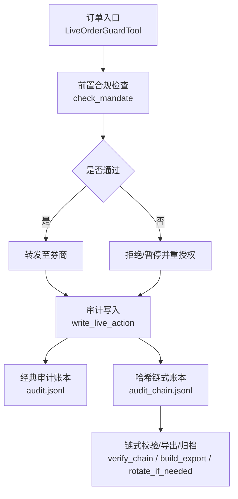
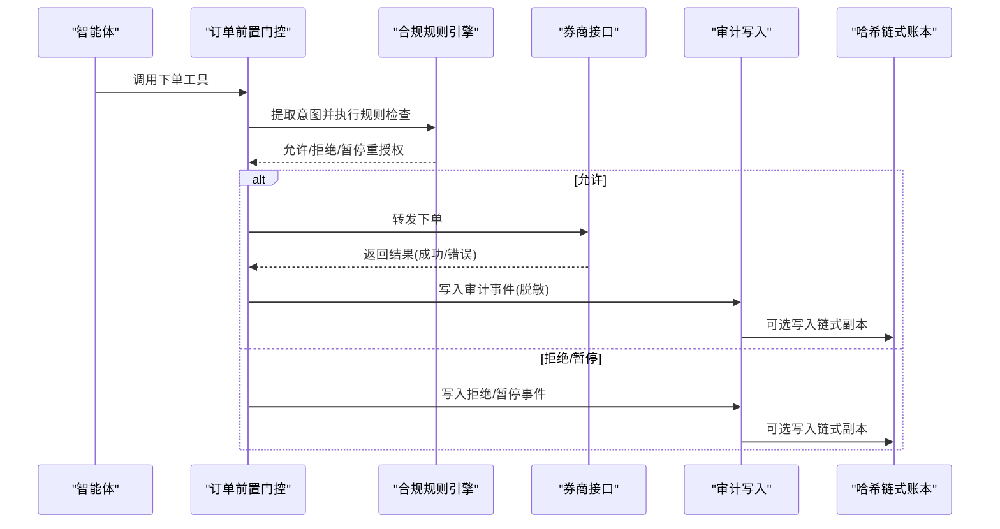
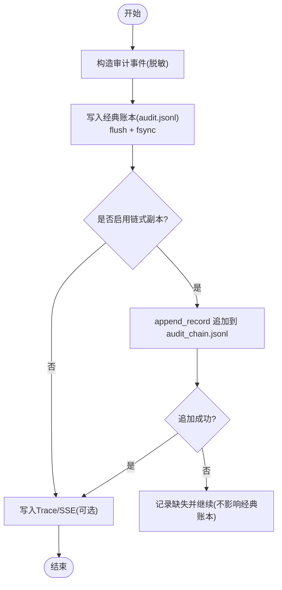
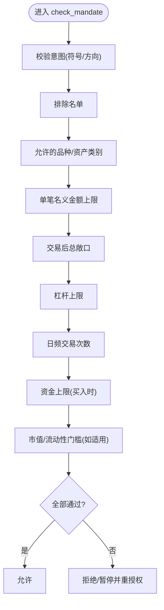
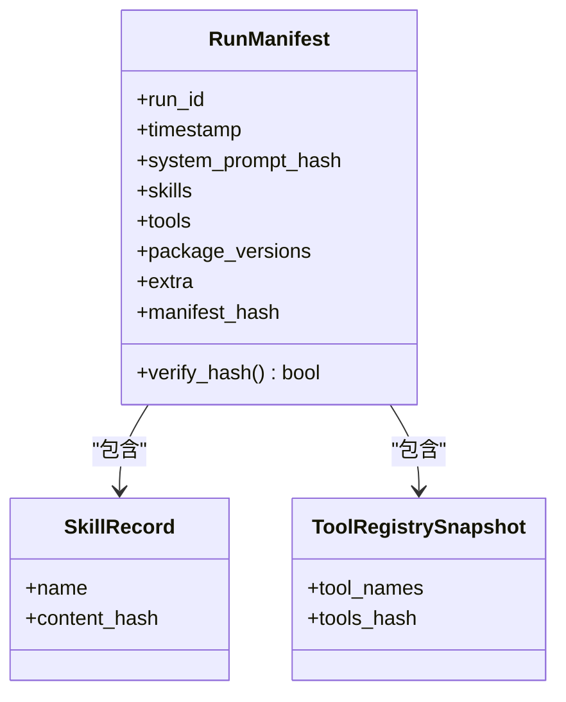
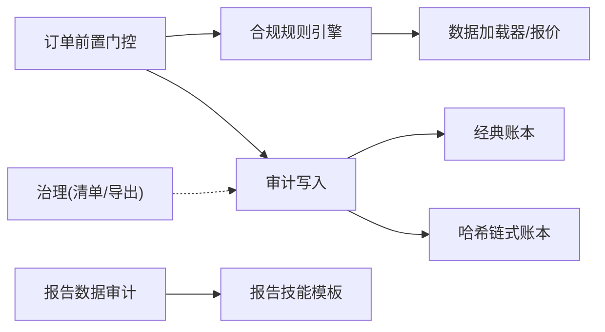

# 审计日志

<cite>
**本文引用的文件**
- [agent/src/live/audit.py](file://agent/src/live/audit.py)
- [agent/src/governance/ledger.py](file://agent/src/governance/ledger.py)
- [agent/src/governance/manifest.py](file://agent/src/governance/manifest.py)
- [agent/src/live/order_guard.py](file://agent/src/live/order_guard.py)
- [agent/src/live/enforcement.py](file://agent/src/live/enforcement.py)
- [agent/src/tools/report_audit_tool.py](file://agent/src/tools/report_audit_tool.py)
- [agent/src/skills/report-generate/SKILL.md](file://agent/src/skills/report-generate/SKILL.md)
- [agent/backtest/validation.py](file://agent/backtest/validation.py)
- [agent/tests/test_governance.py](file://agent/tests/test_governance.py)
- [agent/tests/test_mandate_enforcement.py](file://agent/tests/test_mandate_enforcement.py)
</cite>

## 目录
1. [简介](#简介)
2. [项目结构](#项目结构)
3. [核心组件](#核心组件)
4. [架构总览](#架构总览)
5. [详细组件分析](#详细组件分析)
6. [依赖关系分析](#依赖关系分析)
7. [性能与可靠性](#性能与可靠性)
8. [故障排查指南](#故障排查指南)
9. [结论](#结论)
10. [附录：配置与报表模板](#附录配置与报表模板)

## 简介
本技术文档面向合规人员与审计专家，系统化说明本系统的审计日志体系，覆盖操作记录机制（用户行为追踪、API调用日志、交易记录）、合规检查（监管规则验证、策略合规性检查、风险指标监控）、证据保全（日志完整性校验、防篡改存储、审计轨迹）、治理框架（策略管理、规则引擎、决策追溯），以及日志分析与报告生成能力。文档同时提供审计配置选项与合规报表模板指引，确保可落地、可核查、可追溯。

## 项目结构
围绕“实时交易审计”的核心路径，系统由以下关键模块构成：
- 实时审计写入：将每笔真实资金操作以不可变方式落盘，并支持可选的哈希链式防篡改副本。
- 订单前置合规门控：在每次下单前执行强约束的规则校验，拒绝或暂停需重新授权的交易。
- 治理与证据：运行清单（方法学指纹）与哈希链式账本，支撑事后核验与跨期对比。
- 报告与审计工具：对研究/回测/风控输出进行抽样核对与结构化报告生成。

**图表来源**
- [agent/src/live/order_guard.py:130-214](file://agent/src/live/order_guard.py#L130-L214)
- [agent/src/live/enforcement.py:458-620](file://agent/src/live/enforcement.py#L458-L620)
- [agent/src/live/audit.py:248-351](file://agent/src/live/audit.py#L248-L351)
- [agent/src/governance/ledger.py:368-469](file://agent/src/governance/ledger.py#L368-L469)

**章节来源**
- [agent/src/live/order_guard.py:1-800](file://agent/src/live/order_guard.py#L1-L800)
- [agent/src/live/audit.py:1-352](file://agent/src/live/audit.py#L1-L352)
- [agent/src/governance/ledger.py:1-739](file://agent/src/governance/ledger.py#L1-L739)

## 核心组件
- 实时审计事件模型与多路扇出：统一封装订单、拒绝、授权、熔断等事件，脱敏后写入经典账本，并可同步写入哈希链式账本、运行时Trace与SSE事件总线。
- 哈希链式账本：每条记录包含序列号与前序记录哈希，追加前全量校验，支持分段归档与离线导出验真。
- 运行清单（Run Manifest）：对系统提示词、技能注入、工具集、关键包版本等进行内容寻址化指纹，用于复现性与变更比对。
- 前置合规门控：按固定顺序执行排除名单、品种/资产类别、单笔名义金额、总敞口、杠杆、日频计数、资金上限、流动性/市值门槛等检查，失败即关闭（fail-closed）。
- 报告与数据审计：对研究报告中的数值点进行抽样抽取与权威数据比对，结合标准化报告模板输出合规友好的交付物。

**章节来源**
- [agent/src/live/audit.py:172-351](file://agent/src/live/audit.py#L172-L351)
- [agent/src/governance/ledger.py:133-469](file://agent/src/governance/ledger.py#L133-L469)
- [agent/src/governance/manifest.py:218-430](file://agent/src/governance/manifest.py#L218-L430)
- [agent/src/live/enforcement.py:458-620](file://agent/src/live/enforcement.py#L458-L620)
- [agent/src/tools/report_audit_tool.py:427-460](file://agent/src/tools/report_audit_tool.py#L427-L460)

## 架构总览
下图展示从订单到审计与合规的全链路交互，强调“先合规、后审计、再归档”的闭环。

**图表来源**
- [agent/src/live/order_guard.py:130-214](file://agent/src/live/order_guard.py#L130-L214)
- [agent/src/live/enforcement.py:458-620](file://agent/src/live/enforcement.py#L458-L620)
- [agent/src/live/audit.py:248-351](file://agent/src/live/audit.py#L248-L351)
- [agent/src/governance/ledger.py:368-469](file://agent/src/governance/ledger.py#L368-L469)

## 详细组件分析

### 实时审计与证据保全
- 事件模型：统一封装交易动作、结果、网关决策、请求/响应（已脱敏）、会话与授权引用，保证可追溯到人机交互与授权上下文。
- 多路写入：经典审计账本始终写入；哈希链式副本默认开启，若失败仅记录告警，不阻塞主流程。
- 持久化与并发：追加模式+fsync；首次创建时目录级fsync；POSIX flock/Windows字节范围锁保护写临界区。
- 链式校验：追加前全量校验现有链，发现破坏直接拒绝扩展；支持分段归档与跨段连续校验。
- 离线导出：构建自包含导出包，含记录、校验结果与导出包自身哈希，便于独立复核。

**图表来源**
- [agent/src/live/audit.py:248-351](file://agent/src/live/audit.py#L248-L351)
- [agent/src/governance/ledger.py:368-469](file://agent/src/governance/ledger.py#L368-L469)

**章节来源**
- [agent/src/live/audit.py:1-352](file://agent/src/live/audit.py#L1-L352)
- [agent/src/governance/ledger.py:1-739](file://agent/src/governance/ledger.py#L1-L739)
- [agent/tests/test_governance.py:370-700](file://agent/tests/test_governance.py#L370-L700)

### 前置合规检查（规则引擎）
- 检查顺序（严格 fail-closed）：排除名单→品种→资产类别→单笔名义金额→总敞口→杠杆→日频计数→资金上限→流动性/市值门槛。
- 断言类型：结构性违规（市场/品种）直接拒绝；定量超限暂停并要求重新授权。
- 价格与数量归一：当以数量下单时，优先使用券商报价，否则回退到数据加载器获取USD价格，取显式名义金额与隐含名义金额较大者作为最终口径，避免绕过限额。
- 数据可用性：任何无法解析或不可用的输入均拒绝放行，确保“宁可错杀，不可放行”。

**图表来源**
- [agent/src/live/enforcement.py:458-620](file://agent/src/live/enforcement.py#L458-L620)

**章节来源**
- [agent/src/live/enforcement.py:1-798](file://agent/src/live/enforcement.py#L1-L798)
- [agent/src/live/order_guard.py:130-214](file://agent/src/live/order_guard.py#L130-L214)

### 治理框架（策略管理与决策追溯）
- 运行清单（Run Manifest）：对系统提示词、注入技能、工具集、关键包版本进行内容寻址化指纹，支持两次运行间的差异对比，定位方法论变化。
- 策略状态机与四眼原则：注册与审批流程受状态机约束，禁止越级审批；同一个人开发/审批会触发“四眼原则”违规标记，便于审计可见。
- 决策追溯：审计事件携带授权快照与同意记录引用，形成“用户点击→授权→指令→执行”的完整责任链。

**图表来源**
- [agent/src/governance/manifest.py:128-186](file://agent/src/governance/manifest.py#L128-L186)
- [agent/src/governance/manifest.py:218-430](file://agent/src/governance/manifest.py#L218-L430)

**章节来源**
- [agent/src/governance/manifest.py:1-567](file://agent/src/governance/manifest.py#L1-L567)
- [agent/tests/test_sdm_governance_wiring.py:113-153](file://agent/tests/test_sdm_governance_wiring.py#L113-L153)

### 报告与数据审计
- 报告数据审计：对Markdown报告中的数值点随机抽样，与权威数据源比对，给出PASS/FAIL判定，防止报告数据失真。
- 标准化报告模板：规定标题、评级、摘要、核心观点、主体分析、数据附录、风险提示、投资建议等结构，确保一致性与可读性。
- 回测验证：支持蒙特卡洛、Bootstrap、滚动窗口等验证配置，增强策略稳健性评估的可审计性。

**章节来源**
- [agent/src/tools/report_audit_tool.py:427-460](file://agent/src/tools/report_audit_tool.py#L427-L460)
- [agent/src/skills/report-generate/SKILL.md:25-76](file://agent/src/skills/report-generate/SKILL.md#L25-L76)
- [agent/backtest/validation.py:298-337](file://agent/backtest/validation.py#L298-L337)

## 依赖关系分析
- 订单前置门控依赖合规规则引擎与审计写入；合规规则引擎依赖数据加载器与账户/持仓读取；审计写入依赖经典账本与可选的哈希链式账本。
- 治理模块与审计解耦：运行清单不参与交易路径，但为策略与方法学变更提供可审计的基线。
- 报告工具与技能模板为上层交付物提供一致性规范与质量门禁。

**图表来源**
- [agent/src/live/order_guard.py:130-214](file://agent/src/live/order_guard.py#L130-L214)
- [agent/src/live/enforcement.py:458-620](file://agent/src/live/enforcement.py#L458-L620)
- [agent/src/live/audit.py:248-351](file://agent/src/live/audit.py#L248-L351)
- [agent/src/governance/ledger.py:368-469](file://agent/src/governance/ledger.py#L368-L469)
- [agent/src/tools/report_audit_tool.py:427-460](file://agent/src/tools/report_audit_tool.py#L427-L460)
- [agent/src/skills/report-generate/SKILL.md:25-76](file://agent/src/skills/report-generate/SKILL.md#L25-L76)

**章节来源**
- [agent/src/live/order_guard.py:1-800](file://agent/src/live/order_guard.py#L1-L800)
- [agent/src/live/enforcement.py:1-798](file://agent/src/live/enforcement.py#L1-L798)
- [agent/src/live/audit.py:1-352](file://agent/src/live/audit.py#L1-L352)
- [agent/src/governance/ledger.py:1-739](file://agent/src/governance/ledger.py#L1-L739)
- [agent/src/tools/report_audit_tool.py:427-460](file://agent/src/tools/report_audit_tool.py#L427-L460)
- [agent/src/skills/report-generate/SKILL.md:25-76](file://agent/src/skills/report-generate/SKILL.md#L25-L76)

## 性能与可靠性
- 写入延迟与吞吐：审计事件为低频高价值记录，逐条fsync可接受；哈希链式追加前全量校验为O(n)，适合低吞吐场景。
- 并发安全：POSIX flock/Windows字节范围锁避免并发写导致的seq/prev_hash冲突。
- 容错设计：链式副本写入失败不会阻断经典账本与交易主流程；fsync失败降级为flush-only并记录告警。
- 归档策略：按大小阈值自动归档活跃账本，历史永不删除，保留完整审计轨迹。

[本节为通用指导，无需特定文件引用]

## 故障排查指南
- 链式账本损坏：使用链式校验函数定位首个断点（JSON格式错误、字段缺失、序列号跳变、前向哈希不匹配、记录哈希不匹配、导出包哈希不匹配）。
- 追加被拒：若现有链已损坏，追加将被拒绝以防止“自愈式伪造”，需先隔离修复后再恢复写入。
- 审计缺失：若链式副本写入异常，检查日志中关于“链式副本追加失败”的记录；经典账本仍应存在。
- 合规拒绝：查看拒绝原因与检查项列表，确认是否因结构性违规或定量超限导致；必要时走重新授权流程。
- 数据不可用：当市场容量/流动性数据不可用时，规则引擎会fail-closed拒绝；检查数据加载器可用性与网络连通性。

**章节来源**
- [agent/src/governance/ledger.py:309-324](file://agent/src/governance/ledger.py#L309-L324)
- [agent/src/governance/ledger.py:368-469](file://agent/src/governance/ledger.py#L368-L469)
- [agent/src/live/audit.py:320-344](file://agent/src/live/audit.py#L320-L344)
- [agent/src/live/enforcement.py:458-620](file://agent/src/live/enforcement.py#L458-L620)
- [agent/tests/test_mandate_enforcement.py:501-528](file://agent/tests/test_mandate_enforcement.py#L501-L528)

## 结论
本系统构建了“强合规前置 + 强审计后置 + 强证据保全”的闭环：所有真实资金操作均被不可变记录，并通过哈希链实现防篡改与可验证；策略与方法学变更通过运行清单进行可复现与可对比；报告与数据审计保障对外交付物的准确性与一致性。该体系满足监管与内审对可追溯、可验证、可审计的核心诉求。

[本节为总结性内容，无需特定文件引用]

## 附录：配置与报表模板

### 审计与合规关键配置要点
- 链式副本开关：默认开启，写入失败仅记录告警，不影响经典账本与交易主流程。
- 归档阈值：按文件大小自动归档活跃账本，历史永不删除。
- 合规检查：fail-closed策略，数据不可用即拒绝；结构性违规直接拒绝，定量超限暂停并重授权。
- 报告数据审计：抽样比例与随机种子可配置，建议固定种子以保证可重复抽样。

**章节来源**
- [agent/src/live/audit.py:320-344](file://agent/src/live/audit.py#L320-L344)
- [agent/src/governance/ledger.py:592-662](file://agent/src/governance/ledger.py#L592-L662)
- [agent/src/live/enforcement.py:458-620](file://agent/src/live/enforcement.py#L458-L620)
- [agent/src/tools/report_audit_tool.py:427-460](file://agent/src/tools/report_audit_tool.py#L427-L460)

### 合规报表模板（节选）
- 标准结构：标题、评级、摘要、核心观点、主体分析、数据附录、风险提示、投资建议。
- 回测报告：策略概述、绩效汇总、年度表现、风险分析、改进建议、评级。
- 数据审计：抽取样本、与权威数据比对、给出PASS/FAIL判定与差异明细。

**章节来源**
- [agent/src/skills/report-generate/SKILL.md:25-76](file://agent/src/skills/report-generate/SKILL.md#L25-L76)
- [agent/src/skills/report-generate/SKILL.md:184-225](file://agent/src/skills/report-generate/SKILL.md#L184-L225)
- [agent/src/tools/report_audit_tool.py:427-460](file://agent/src/tools/report_audit_tool.py#L427-L460)