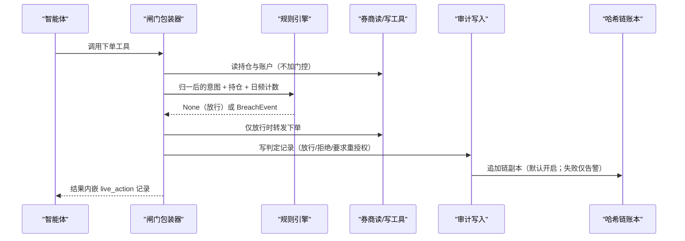
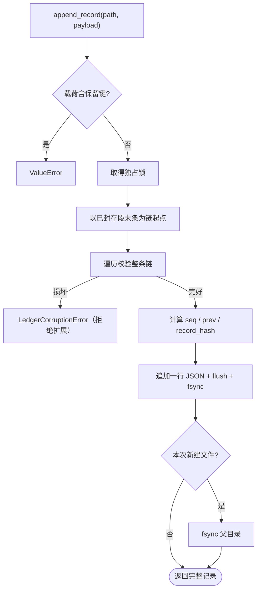
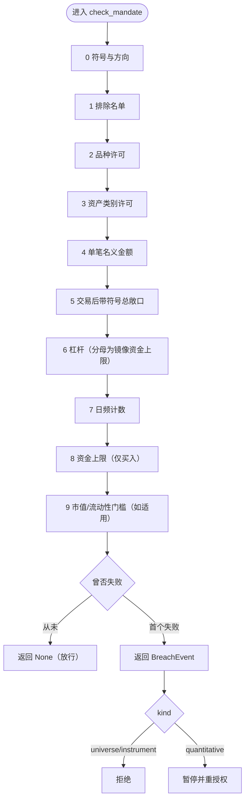
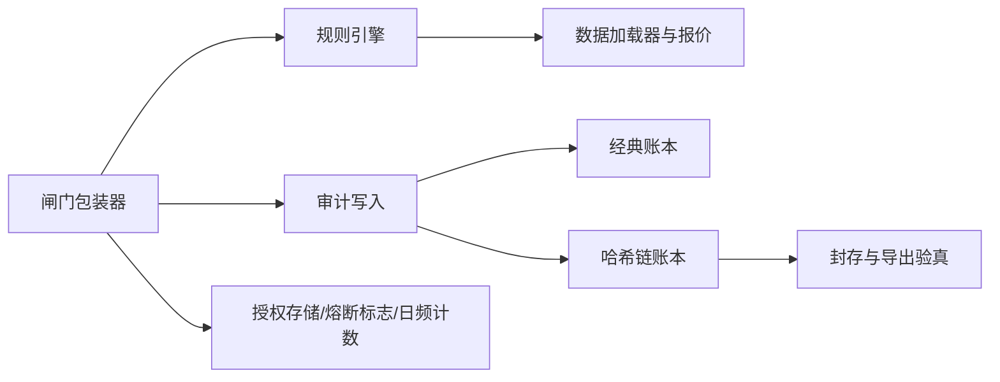

# 审计日志

<cite>
**本文引用的文件**
- [agent/backtest/validation.py](file://agent/backtest/validation.py)
- [agent/src/governance/ledger.py](file://agent/src/governance/ledger.py)
- [agent/src/governance/manifest.py](file://agent/src/governance/manifest.py)
- [agent/src/live/audit.py](file://agent/src/live/audit.py)
- [agent/src/live/enforcement.py](file://agent/src/live/enforcement.py)
- [agent/src/live/order_guard.py](file://agent/src/live/order_guard.py)
- [agent/src/skills/report-generate/SKILL.md](file://agent/src/skills/report-generate/SKILL.md)
- [agent/src/tools/report_audit_tool.py](file://agent/src/tools/report_audit_tool.py)
- [agent/tests/test_governance.py](file://agent/tests/test_governance.py)
- [agent/tests/test_mandate_enforcement.py](file://agent/tests/test_mandate_enforcement.py)
- [agent/tests/test_sdm_governance_wiring.py](file://agent/tests/test_sdm_governance_wiring.py)
</cite>

## 目录
1. [简介](#简介)
2. [核心组件](#核心组件)
3. [架构总览](#架构总览)
4. [详细分析](#详细分析)
5. [依赖关系](#依赖关系)
6. [可靠性与性能](#可靠性与性能)
7. [故障排查](#故障排查)
8. [结论](#结论)
9. [附录：留痕与核验清单](#附录留痕与核验清单)

## 简介
本页说明「审计与留痕」这条链路：一次真实资金动作从下单入口到落盘、到防篡改校验、到归档导出，中间经过哪些不可绕过的判定点；以及方法学与交付物层面的留痕手段（运行清单、模型治理字段、报告数据审计、回测统计验证）。读者是合规与内审视角：关注「谁授权、依据哪条规则、结果如何、事后能否复核」。

链路的总原则是**先合规、后落盘、再留证**，四段组成：闸门在调用券商之前完成全部判定；每一条判定（放行、拒绝、暂停重授权、熔断、违规）都产出一条脱敏审计记录，落 `<runtime_root>/live/audit.jsonl`（经典账本）并默认同时落 `audit_chain.jsonl`（哈希链副本）；哈希链使「事后修改或删除**靠前位置的某条**记录」可被定位，尾部缺条不在其能力内（链条只少最新一条时序列依旧连续），并支持离线导出验真与分段封存；交付物侧由运行清单固化方法学、由抽样比对与统计验证把住数值口径。

**章节来源**
- [agent/src/live/audit.py:1-59](file://agent/src/live/audit.py#L1-L59)
- [agent/src/governance/ledger.py:1-48](file://agent/src/governance/ledger.py#L1-L48)
- [agent/src/live/order_guard.py:1-39](file://agent/src/live/order_guard.py#L1-L39)

## 核心组件
- **审计事件模型与三路扇出**：`LiveActionEvent` 用固定的 kind/outcome 枚举封装一次动作，`to_record()` 先整体脱敏再落盘；记录可扇出到专用账本、逐轮 Trace 与事件总线。
- **哈希链账本**：每条记录内嵌 `seq` 与 `prev_record_hash`，`record_hash` 同时提交位置、前驱与载荷；追加前全量校验现有链，损坏即拒绝扩展。
- **闸门包装器**：`LiveOrderGuardTool` 只包住券商的写单工具，读工具走未加门控的原路径；放行与否、拒绝原因与限额清单（`gate_decision.checked_limits`）都写进审计记录。
- **规则引擎**：`check_mandate` 不改调用方状态、不写任何账本，按固定顺序返回首个违规的 `BreachEvent`（`universe`/`instrument` 为结构性，`quantitative` 为定量）；但市值/日均成交额下限一旦置值，每次判定都会经数据加载器与基本面接口取外部数据，并非全无副作用。
- **运行清单**：`RunManifest` 对系统提示词、注入技能、工具集、关键包版本与调用方自定义维度做指纹；`diff_manifests` 点名两次运行之间到底改了哪一项。
- **交付物审计**：报告数值点抽取→抽样→PASS/FAIL 判定；回测侧的蒙特卡洛/Bootstrap/滚动窗口验证与严格 JSON 落盘。

**章节来源**
- [agent/src/live/audit.py:172-216](file://agent/src/live/audit.py#L172-L216)
- [agent/src/governance/ledger.py:133-149](file://agent/src/governance/ledger.py#L133-L149)

## 架构总览
一次下单从入口到留证的交互如下；重点在于「审计写入永远在判定之后、链副本失败不改变判定结果」。

**图表来源**
- [agent/src/live/order_guard.py:134-231](file://agent/src/live/order_guard.py#L134-L231)
- [agent/src/live/audit.py:301-344](file://agent/src/live/audit.py#L301-L344)

## 详细分析

### 实时审计事件与三路扇出
- **事件枚举固定**：`kind` 为 `order_placed` / `order_cancelled` / `order_rejected` / `mandate_committed` / `breach` / `halt_tripped` / `halt_cleared`；`outcome` 为 `accepted` / `filled` / `rejected` / `error` / `blocked`。
- **脱敏先于任何出口**：`to_record()` 按 SPEC 字段顺序组装记录，再把整棵结构交给共享脱敏函数，因此 token/账号/PII 在到达账本、Trace、事件总线之前就已经是 `[redacted]`。
- **三个落点**：专用合规账本始终写入（追加模式、逐条 flush+fsync、首建目录 `0700`）；`trace_writer` 给出时以 `type="live_action"` 写入逐轮 Trace；`event_callback` 给出时以 `live.action` 事件上屏——后两个可选，缺省静默跳过。
- **链副本默认开启，且是「两本都写」而非「替换」**：`write_live_action` 的 `chain` 形参默认为 `True`（函数签名如此；其 Args 文档仍写着默认 `False`，属注释滞后）。经典账本先写并 fsync，链副本随后追加；链的三个字段（`seq`/`prev_record_hash`/`record_hash`）只属于链文件，返回值与 Trace/事件上的记录保持经典形状，因此既有读取方按字节不变。
- **链副本失败不推翻判定**：追加异常被捕获后仅在 ERROR 级记录，因为合规记录已在经典账本落地，损失的只是这一条的防篡改证明；而链少的若是**最新一条**，序列仍然连续，`verify_chain` 看不到断点（该函数把每条记录只与自己的前驱比对、起点固定为 `seq=1` 与 genesis，因此砍掉尾部不留任何接缝），模块注释与日志文案里「缺口可由 `verify_chain` 报出」与实际相反。
- **`require_durable`**：置真时，经典账本的 fsync 失败会向上抛出而不是降级告警。

**章节来源**
- [agent/src/live/audit.py:120-146](file://agent/src/live/audit.py#L120-L146)
- [agent/src/live/audit.py:217-355](file://agent/src/live/audit.py#L217-L355)
- [agent/tests/test_governance.py:516-540](file://agent/tests/test_governance.py#L516-L540)
- [agent/tests/test_governance.py:599-633](file://agent/tests/test_governance.py#L599-L633)

### 哈希链账本与防篡改
- **链条不变量**：`compute_record_hash(seq, prev_record_hash, payload)` 对 `{seq, prev_record_hash, payload}` 的规范化 JSON 取 `sha256:`；首条记录的 `prev_record_hash` 是哨兵 `sha256:genesis`。改或删任意靠前记录，会连带破坏其后每条记录的哈希——可检测性来自这种传播，而不是逐行校验和。
- **保留字段**：`seq`/`prev_record_hash`/`record_hash` 由账本计算，调用方载荷若带这三个键直接 `ValueError`，防止伪造位置或前驱。
- **追加前全量校验**：`append_record` 在独占锁内读尾、从头走完现有链，一旦发现断点抛 `LedgerCorruptionError` 并拒绝扩展——绝不在被篡改的历史上盖一段「看起来合法」的后缀（自愈式伪造正是这条不变量要排除的）。
- **断点定位**：`verify_chain` 返回 `ChainVerificationResult(ok, record_count, first_break)`，`first_break.reason` 只取值 `malformed_json` / `missing_chain_fields` / `seq_gap` / `prev_hash_mismatch` / `record_hash_mismatch` 这五种；`export_hash_mismatch` 是导出封套层的断点，只由 `verify_export` 造出（`ChainBreak` 类文档列的六值是这两个函数的并集，别按单个函数读）；遇到首个不可解析行即停止后向扫描。文件不存在视作一条完好空链。
- **持久化与并发**：逐条 fsync；首次创建文件时额外 fsync 父目录；POSIX `flock` 与 Windows 字节范围锁覆盖「读尾+追加」临界区。Windows 空账本在偏移 0 加锁而**不写入哨兵字节**——早先写 `b"\0"` 会让链遍历把空文件判成坏链，拒绝每一次首条追加。锁只是防意外分叉的活性优化，真正的保证来自校验。
- **离线导出**：`build_export` 打出自包含导出包（记录 + 构建时的校验结果 + 对导出封套自身的 `export_hash`）；`verify_export` 先验封套再走记录，因此被改过的导出包即便内部链条自洽也会被判 `export_hash_mismatch`（`index=-1`）。

**图表来源**
- [agent/src/governance/ledger.py:368-469](file://agent/src/governance/ledger.py#L368-L469)
- [agent/src/governance/ledger.py:133-149](file://agent/src/governance/ledger.py#L133-L149)

**章节来源**
- [agent/src/governance/ledger.py:152-239](file://agent/src/governance/ledger.py#L152-L239)
- [agent/src/governance/ledger.py:242-324](file://agent/src/governance/ledger.py#L242-L324)
- [agent/src/governance/ledger.py:496-585](file://agent/src/governance/ledger.py#L496-L585)
- [agent/tests/test_governance.py:287-371](file://agent/tests/test_governance.py#L287-L371)
- [agent/tests/test_governance.py:445-495](file://agent/tests/test_governance.py#L445-L495)

### 归档与保留
- **默认阈值**：`DEFAULT_ROTATE_BYTES` 为 64 MiB；活跃文件达到该大小时被**封存**为 `audit_chain.0001.jsonl` 这样的零填充段，活跃文件随后重建。
- **历史永不删除**：本仓不是受监管主体、没有法定留存期，因此在无策略时安全默认是全部保留——删除审计记录本身即是应被审计的事件，由库擅自设定的留存窗口会静默销毁无人决定销毁的证据。这里的轮转只约束**活跃文件**大小，不约束历史。
- **链跨段延续**：封存段内容原样保留，新活跃文件的首条从封存段末条的 `record_hash` 续接；因此整段删除与段内改动同样可检测。跨段全史校验用 `verify_chain_with_archives`。
- **封存的前置条件**：活跃链已损坏时 `rotate_if_needed` 抛 `LedgerCorruptionError`（不让任何人「封存」一份可疑账本）；`max_bytes` 非正数抛 `ValueError`；未达阈值返回 `None` 且文件保持存在。
- 注意：轮转与导出是**由调用方显式触发**的能力，实时写入路径本身不会自动轮转；未触发时活跃账本只是持续增长。

**章节来源**
- [agent/src/governance/ledger.py:592-611](file://agent/src/governance/ledger.py#L592-L611)
- [agent/src/governance/ledger.py:614-662](file://agent/src/governance/ledger.py#L614-L662)
- [agent/src/governance/ledger.py:665-738](file://agent/src/governance/ledger.py#L665-L738)
- [agent/tests/test_governance.py:677-740](file://agent/tests/test_governance.py#L677-L740)

### 前置合规闸门链
门控包装器只包住券商的**写单**远程工具；读工具保持原始路径、不加门控。`execute()` 在触达券商之前按下列顺序判定，每一步都 fail-closed（模块文档编号为 1–7 步）：

1. `load_mandate` + `schema_version` 匹配——无有效授权或版本未知即拒绝。
2. 过期——越过 `consent.expires_at` 即拒绝并路由到重新授权；`expires_at` 无法解析时**按已过期处理**。
3. `halt_flag_set`——熔断已触发即拒绝，且不发起任何远程调用。
4. 账户绑定——登录可达多账户的 connector，未绑定账户的授权拒绝所有订单，订单点名另一个账户时拒绝而非改道；无默认账户兜底。
5. `extract_order_intent`——无法解析的订单结构即拒绝。
6. 读持仓与余额（走未加门控的读路径，并按授权账户限定范围）。
7. `check_mandate`——放行则 `super().execute` 转发，结构性违规拒绝，定量超限暂停重授权。

代码里另有两处不属于上述编号、但同样 fail-closed 的环节：

- **数量→名义金额归一**（第 5 与第 6 步之间）：意图同时带 `notional_usd` 与 `quantity` 时，按两者中**较大**的口径强制约束；只带 `quantity` 时先用券商自有报价工具、再退回数据加载器取价格；买限价单的价格口径取「报价与限价的较大者」，避免限价远高于市价时以数倍于授权的金额成交；取不到可用价格即拒绝。重建意图时 `asset_class` 必须原样携带，否则其它市场的订单会被错误归入美股桶并绕过只允许美股的授权。
- **日频计数锁**（第 6 与第 7 步之间）：读今日计数、`check_mandate` 与消费计数在同一次提交的事务锁内完成，锁不可用时直接拒绝。持仓快照里价格缺失的行会被补价，任一行补不到价就让整份快照不可读，从而总敞口 fail-closed 而不是把该持仓按 0 计。

留证侧的行为：

- 每一次判定都经 `_audit()` 写一条 live-action 记录；**审计失败绝不阻断判定**（异常被捕获后仅告警并返回 `None`）。
- 记录携带授权引用：`mandate_snapshot_ref` 取授权的 `consent_token_sha256`，`consent_record_ref` 取授权的 `account_ref`；意图渲染为人类可读串（形如 `buy $100 <代码> (equity)`）。
- 转发结果按错误信封判定：券商侧失败是返回 `{"status": "error", ...}` 而非抛异常，因此只有「确认放行 + 非错误转发」才消费一次日频计数，错误转发写 `order_rejected`/`error` 且不消费计数。
- 拒绝返回结构化信封：`status="blocked"`、`decision`、`reason`、`broker`、`remote_tool`、`requires_reauthorization`，定量违规还带完整 `breach`；脱敏审计记录嵌在冻结键 `live_action` 下供事件中继直接取用而不触碰智能体循环，但**两处嵌入都是条件性的**——`_audit()` 写失败返回 `None` 时不嵌，放行侧转发结果不是 JSON 对象时原样返回 `forwarded`（这正是上一条「审计失败绝不阻断判定」的副作用面）。
- `repeatable = False`、`is_readonly = False`：真实下单永不静默重试。
- 咨询式复核（advisory）是可选旁路，由环境开关控制、默认关闭；它只把结论与关注点并入审计的 `gate_decision`，从不阻断放行路径，且自身不得抛异常——异常一律收敛成「复核不可用」的结论。

**章节来源**
- [agent/src/live/order_guard.py:101-231](file://agent/src/live/order_guard.py#L101-L231)
- [agent/src/live/order_guard.py:235-292](file://agent/src/live/order_guard.py#L235-L292)
- [agent/src/live/order_guard.py:364-432](file://agent/src/live/order_guard.py#L364-L432)
- [agent/src/live/order_guard.py:514-616](file://agent/src/live/order_guard.py#L514-L616)
- [agent/src/live/order_guard.py:620-831](file://agent/src/live/order_guard.py#L620-L831)
- [agent/src/live/order_guard.py:950-961](file://agent/src/live/order_guard.py#L950-L961)
- [agent/tests/test_mandate_enforcement.py:274-329](file://agent/tests/test_mandate_enforcement.py#L274-L329)

### 检查项与判决路由
`check_mandate` 是「纯判决函数」——不改调用方状态、不写账本、不落地；但模块文档给的强度只到「判决」这一层，它并非无副作用：固定顺序、首个失败即判决，而第 9 步的市值/日均成交额门槛一旦置值，每次判定都要经数据加载器与基本面接口取外部数据（[agent/src/live/enforcement.py:623-679](file://agent/src/live/enforcement.py#L623-L679)、[agent/src/live/enforcement.py:715-791](file://agent/src/live/enforcement.py#L715-L791)），产出违规时还要读系统时钟盖 `created_at`：

0. 意图合法性（符号非空、方向为 `buy`/`sell`）。
1. 排除名单（优先级高于其它任何宇宙规则）。
2. 品种类型许可（`allowed_instruments` 为空即全部拒绝）。
3. 资产类别许可（期权无宇宙桶，只受品种许可约束；意图显式的 `asset_class` 优先于品种默认桶）。
4. 单笔名义金额（不可解析即拒绝）。
5. 交易后总敞口：按**带符号的逐标的持仓**计算绝对值之和——卖出只能把既有头寸减到 0，超出部分转为空头敞口，不会反向冲减整个组合。
6. 杠杆：分母是授权里镜像的 `account_funding_usd`（非正数即 fail-closed）。
7. 日频计数（按 UTC 自然日累计）。
8. 资金上限：只有买入可能越过，绝不因这条拦卖出。
9. 宇宙门槛（市值/日均成交额下限）：置空表示无下限；置值时数字取自现有加载器链，取不到即拒绝，而不是放行。

路由规则：`universe`/`instrument` 为结构性违规，直接拒绝（除非编辑授权否则无从放宽，而**智能体不得编辑授权**）；`quantitative` 要求重新授权。数据不可用与字段歧义一律 fail-closed，宁可错杀。市值口径目前仅美股/美股 ETF 尽力而得，其余资产桶与外汇在设了下限时按 fail-closed 拒绝——这是有意为之，尚无非美股基本面源接入。

**图表来源**
- [agent/src/live/enforcement.py:495-620](file://agent/src/live/enforcement.py#L495-L620)
- [agent/src/live/enforcement.py:623-679](file://agent/src/live/enforcement.py#L623-L679)

**章节来源**
- [agent/src/live/enforcement.py:1-26](file://agent/src/live/enforcement.py#L1-L26)
- [agent/src/live/enforcement.py:111-242](file://agent/src/live/enforcement.py#L111-L242)
- [agent/src/live/enforcement.py:318-343](file://agent/src/live/enforcement.py#L318-L343)
- [agent/src/live/enforcement.py:755-791](file://agent/src/live/enforcement.py#L755-L791)
- [agent/tests/test_mandate_enforcement.py:332-412](file://agent/tests/test_mandate_enforcement.py#L332-L412)

### 运行清单（方法学指纹）
- **组成入、单一确定性哈希出**：`RunManifest` 记录 `run_id`、`timestamp`、`system_prompt_hash`、`skills`、`tools`、`package_versions`、`extra` 与 `manifest_hash`。系统提示词只存哈希，注入技能只存 `(name, content_hash)`，工具集存去重排序后的名字列表加一个哈希，包版本用一组精选维度并附带解释器版本。
- **哈希范围是组成而非实例**：`timestamp` 与 `run_id` 明确**不**参与 `manifest_hash`，否则两次同方法学的运行永远不会同哈希，`diff_manifests` 会在每次调用上都报出伪变化。
- **无隐藏时钟**：模块自身不调系统时钟，时间戳一律由调用方显式供给；这条不变量由源码级 AST 断言把守（而非子串匹配），因此注释里提到时钟不会造成假失败，真实调用也无法躲过格式化。
- **篡改可见**：`from_dict`/`from_json` 装载时**信任**已存的 `manifest_hash`，完整性检查靠事后 `verify_hash()` 重新推导比对。
- **差异点名**：`diff_manifests` 分别给出提示词是否变、技能增/删/内容改（直接回答「哪个技能正文变了」）、工具增删、包版本三元组变化、`extra` 维度变化与总体哈希是否不同。
- **入参约束**：`run_id` 或 `timestamp` 为空抛 `ValueError`；序列形态的技能列表出现重名抛 `ValueError`；`extra` 维度按原值存（不哈希），因此只应放小而非敏感的字符串，便于人直接读 diff。

清单模块本身刻意不解析运行目录、不接工具注册表，只接收已抽取好的组成数据；运行侧的构建与落盘由主循环完成（每轮组装消息时构建一次并写出序列化结果，失败只告警不影响运行）。清单不参与交易路径，也不写进任何账本——它提供的是方法学的可比基线。

**章节来源**
- [agent/src/governance/manifest.py:1-33](file://agent/src/governance/manifest.py#L1-L33)
- [agent/src/governance/manifest.py:193-269](file://agent/src/governance/manifest.py#L193-L269)
- [agent/src/governance/manifest.py:356-531](file://agent/src/governance/manifest.py#L356-L531)
- [agent/tests/test_governance.py:46-71](file://agent/tests/test_governance.py#L46-L71)
- [agent/tests/test_governance.py:94-132](file://agent/tests/test_governance.py#L94-L132)

### 模型治理留痕（四眼与状态机）
策略/因子登记侧的治理字段同样是留痕载体，其契约由测试把守：

- **空也要可见**：未登记任何治理信息的制品，详情里 `governance.registered` 为假并带说明；治理块不得因没内容就整块省略——省略即等于隐藏这条发现。
- **声明即齐全**：一旦声明任一治理字段（开发者、所有者、层级、验证者、审批者），`intended_use` 与 `limitations` 就必须同时给出，否则登记被拒。
- **四眼原则可标不可拦**：开发者与审批者为同一人时标记 `four_eyes_violation` 并附「同一人」说明，但登记仍然成功——是否阻断自批属于公司政策，不由该工具代决；同时也不得反向静默阻止。
- **状态机禁止越级**：直接登记为 `approved` 被拒，登记为 `in_validation` 允许；完整登记的初始 `validation_status` 为 `unvalidated`。
- **不伪造证据**：无人验证时 `validation_date` 永不自动填充（保持为空）；未知的模型层级被拒。
- **可达即契约**：每个治理字段都必须出现在工具的参数模式里——写不进存储的治理字段等同于不存在。

**章节来源**
- [agent/tests/test_sdm_governance_wiring.py:1-7](file://agent/tests/test_sdm_governance_wiring.py#L1-L7)
- [agent/tests/test_sdm_governance_wiring.py:45-102](file://agent/tests/test_sdm_governance_wiring.py#L45-L102)
- [agent/tests/test_sdm_governance_wiring.py:108-159](file://agent/tests/test_sdm_governance_wiring.py#L108-L159)
- [agent/tests/test_sdm_governance_wiring.py:162-189](file://agent/tests/test_sdm_governance_wiring.py#L162-L189)

### 报告数据审计
两阶段质量门，工具本身**只读**、只收文本与结果、不自行取数、不落盘：

1. `extract`：解析 Markdown 报告，收集数值点（多列表格与 `标签: 数值 单位` 行，含 `亿/万亿/倍/%` 等中文单位），按「标签＋数值＋单位」去重后随机抽样，比例默认 15%，样本量夹在 [3, 30]，可传 `seed` 复现同一抽样。
2. `verdict`：逐个把报告值与权威值按 1% 相对容差比对，输出 `PASS`/`FAIL` 与 `fail_items`/`warn_items` 明细。

判定与 fail-closed 细节：

- **单点失败即整报告失败**；一个点配两个来源时，两者都过才算过、都败才算败，一过一败记为 WARN（口径/准则差异，不当失败）。
- **零证据即失败**：所有结果都没有 `fetched_value` 时判 `FAIL`——用零条证据出具 PASS，正是这道门要防的失效模式。
- **不可核对与未核对区别对待**：缺失或非数值的报告值、提供了但非有限数的权威值都作为失败点并附原因，而不是被静默跳过；只有真正未提供的 `fetched_value` 才按「未核对」跳过且不计入总数。
- **会计记号不误读**：括号（半角/全角）读作负数，配对的括号与内部/外部单位同时出现、括号残缺、外层单位收尾等畸形形态一律不解析；被跳过的标签集合与同比/增速类列头不进入样本；值为 0 或绝对值超过 1e15 的点不进入样本。
- **报告模板约束一致性**：明确评级、量化支撑、至少三条风险提示、具体行动建议与结尾免责声明写在通用 `Output Format` 一节（[agent/src/skills/report-generate/SKILL.md:244-251](file://agent/src/skills/report-generate/SKILL.md#L244-L251)），是面向整篇报告的总则；要求写在总则里而不是各模板骨架里——标准结构本体（标题＋评级/目标价/日期抬头、摘要、核心观点、主体分析、数据附录、风险提示、投资建议、免责声明）自带编号三条的风险提示与免责声明行，回测模板本体（策略概述、绩效汇总、年度表现、风险分析占位、改进建议、评级）则**既无条数要求也无免责声明行**；另要求区间化预测、全文数值自洽、标注数据截止与生成日期。

**章节来源**
- [agent/src/tools/report_audit_tool.py:1-19](file://agent/src/tools/report_audit_tool.py#L1-L19)
- [agent/src/tools/report_audit_tool.py:64-256](file://agent/src/tools/report_audit_tool.py#L64-L256)
- [agent/src/tools/report_audit_tool.py:415-479](file://agent/src/tools/report_audit_tool.py#L415-L479)
- [agent/src/tools/report_audit_tool.py:482-531](file://agent/src/tools/report_audit_tool.py#L482-L531)
- [agent/src/skills/report-generate/SKILL.md:25-76](file://agent/src/skills/report-generate/SKILL.md#L25-L76)
- [agent/src/skills/report-generate/SKILL.md:184-225](file://agent/src/skills/report-generate/SKILL.md#L184-L225)

### 回测统计验证
三个相互独立的验证工具，让「策略稳健性」这类结论带上可复算的证据：

- **蒙特卡洛置换**：对同一批已平仓交易的盈亏序列做随机置换，检验观测 Sharpe 与最大回撤是否显著优于随机排列；输出两个 p 值、模拟 Sharpe 的均值/标准差/5–95 分位与样本序列，交易数少于 3 条即返回错误并把 Sharpe 的 p 值钉在 1.0；权益路径把初始资金并入序列，观测路径与每条置换路径同口径。
- **Bootstrap Sharpe 置信区间**：对收益序列重采样估计区间，给出观测 Sharpe、上下界、中位数与正概率；收益观测少于 5 个即返回错误；样本序列仅在重采样数不超过 20000 时附带。
- **滚动窗口分析**：切成顺序不重叠窗口，逐窗独立评估收益/Sharpe/最大回撤/交易数/胜率，并汇总盈利窗口数、一致性比率与窗口间收益/Sharpe 的均值与标准差。
- **口径一致**：`run_validation` 读 `config["validation"]` 的 `monte_carlo`/`bootstrap`/`walk_forward` 三个键（默认 1000 次、seed 42、95% 置信、5 窗口），并在校验入口把「年化因子为空」解析成跨度派生的统一年化因子，避免跨市场运行里 Sharpe 计算崩掉。
- **落盘严格性**：验证结果写出时对非有限值做净化并以 `allow_nan=False` 序列化，保证 `artifacts/validation.json` 是严格合法 JSON，可被任何下游审阅方解析。

**章节来源**
- [agent/backtest/validation.py:1-9](file://agent/backtest/validation.py#L1-L9)
- [agent/backtest/validation.py:30-138](file://agent/backtest/validation.py#L30-L138)
- [agent/backtest/validation.py:144-205](file://agent/backtest/validation.py#L144-L205)
- [agent/backtest/validation.py:216-293](file://agent/backtest/validation.py#L216-L293)
- [agent/backtest/validation.py:299-362](file://agent/backtest/validation.py#L299-L362)
- [agent/backtest/validation.py:440-472](file://agent/backtest/validation.py#L440-L472)

## 依赖关系
- 闸门包装器依赖规则引擎与审计写入，并依赖券商读工具、熔断标志、授权存储、共享日频计数锁与 connector 的读映射。
- 审计写入依赖运行时路径解析（`live_root`）与共享脱敏函数；链副本依赖治理账本。
- 规则引擎依赖数据加载器（报价、市值、日均成交额），全部不可用时 fail-closed。
- 治理账本只依赖标准库与平台锁；清单模块刻意不导入智能体内核，也不接运行目录。
- 交付物审计：报告数据审计是注册进工具集的只读工具，统计验证被回测引擎在配置了校验段时自动调用；两者都不参与交易路径。

**图表来源**
- [agent/src/live/order_guard.py:49-76](file://agent/src/live/order_guard.py#L49-L76)
- [agent/src/live/audit.py:72-73](file://agent/src/live/audit.py#L72-L73)

**章节来源**
- [agent/src/governance/ledger.py:60-68](file://agent/src/governance/ledger.py#L60-L68)
- [agent/src/governance/manifest.py:69-85](file://agent/src/governance/manifest.py#L69-L85)
- [agent/src/live/enforcement.py:623-679](file://agent/src/live/enforcement.py#L623-L679)
- [agent/backtest/validation.py:1-9](file://agent/backtest/validation.py#L1-L9)
- [agent/src/tools/report_audit_tool.py:482-531](file://agent/src/tools/report_audit_tool.py#L482-L531)

## 可靠性与性能
- **写延迟换最强保证**：追加前全量校验是 O(n)；实时动作账本天然低频（每个订单/授权/违规/熔断一条，不是每笔行情一条），因此按「每条一次 fsync」设计而非提前优化。
- **64 MiB 阈值同时是性能护栏**：它把「每次追加都走全链」的代价限制在有界区间内，又不至于产出一堆碎片段。
- **降级方向明确**：不支持 fsync 的文件系统上，耐久性降级为 flush-only 并只告警一次——因为拒绝记录一条合规事件比降级保证更糟；链副本追加失败只降级掉那一条的防篡改证明，判定与经典账本不受影响。
- **并发**：锁覆盖读尾与追加，防的是意外分叉造成的 `seq`/`prev_record_hash` 冲突；即便绕过锁，全链校验仍会报出分叉或坏尾。
- **审计不阻断主流程**：闸门里的 `_audit()` 捕获一切异常并返回 `None`；咨询式复核同样不得抛出，异常一律收敛成「复核不可用」的结论。

**章节来源**
- [agent/src/governance/ledger.py:36-48](file://agent/src/governance/ledger.py#L36-L48)
- [agent/src/governance/ledger.py:104-121](file://agent/src/governance/ledger.py#L104-L121)
- [agent/src/governance/ledger.py:327-352](file://agent/src/governance/ledger.py#L327-L352)
- [agent/src/live/order_guard.py:436-512](file://agent/src/live/order_guard.py#L436-L512)
- [agent/src/live/order_guard.py:754-795](file://agent/src/live/order_guard.py#L754-L795)

## 故障排查
- **定位链断点**：`verify_chain` 的 `first_break` 给出 0 基行索引、可解析时的 `seq`、原因与期望/实际细节。`seq_gap` 通常是删行；`prev_hash_mismatch` 说明前一条被改且重算了自己的哈希（篡改点在其前一条）；`record_hash_mismatch` 是载荷被改而链字段未动；`missing_chain_fields` 表示该行不是本账本写入的；`malformed_json` 之后的内容不再向后信任。
- **追加被拒**：现有链已损坏时追加抛 `LedgerCorruptionError`，这是防「自愈式伪造」，需要人工隔离修复而非绕过；绕过不会毁掉证据，但会把可疑后缀混进可采信区间。
- **链副本缺一条**：经典账本应仍有该记录，但缺的若是**尾部那一条**，`verify_chain` 报不出缺口——序列仍从 1 连续、每条只与自己的前驱比对，两边都自洽；可定位的是靠前记录的删改。本仓不比对两本账的记录数，所以这条只能靠运行日志里链追加失败的 ERROR 发现。
- **判定被拒但原因不明**：看拒绝信封的 `decision`/`reason`/`requires_reauthorization`，以及审计记录 `gate_decision.checked_limits`（放行路径写死的是一份限额全集 [agent/src/live/order_guard.py:394-402](file://agent/src/live/order_guard.py#L394-L402)，不随本次实际跑了哪些检查增减：期权/CFD 无宇宙桶时 `asset_classes` 与宇宙门槛两项被跳过，清单里仍列着它们；拒绝路径的清单才是各分支手写的已到达步骤）；定量违规另看 `breach` 的 `limit`、`limit_value`、`attempted_value`、`overage`。
- **数据不可用**：市值/流动性下限、报价、持仓解析任一取不到都会 fail-closed 拒绝；先查加载器可用性与网络，再看持仓行能否补价。
- **跨段核对**：出现过轮转的账本要用 `verify_chain_with_archives`——轮转后活跃文件从非 1 的 `seq` 起头（追加时以封存段末条为起点），而单文件 `verify_chain` 的起点固定是 `seq=1` 加 genesis，对它**必在第 0 行报 `seq_gap`**，并不会把它当成完好；整段被删也只能在这个按归档顺序拼接的全史遍历里以接缝断点现形。

**章节来源**
- [agent/src/governance/ledger.py:152-175](file://agent/src/governance/ledger.py#L152-L175)
- [agent/src/governance/ledger.py:309-324](file://agent/src/governance/ledger.py#L309-L324)
- [agent/src/live/order_guard.py:577-616](file://agent/src/live/order_guard.py#L577-L616)
- [agent/tests/test_governance.py:636-671](file://agent/tests/test_governance.py#L636-L671)

## 结论
留痕体系是「强合规前置 + 强审计后置 + 强证据保全」的闭环：真实资金操作在触达券商之前完成全部判定，任何输入不可解析都指向拒绝而非放行；每一次判定都留下先脱敏、再落两本账的记录，链副本使靠前位置的删除与篡改可定位而非可蒙混（尾部缺条不在其能力内）；轮转只收缩活跃文件、从不销毁历史；方法学以内容寻址指纹固化成可比基线；对外交付物则经抽样比对与统计验证两道门。这套设计的可核查前提是「智能体不能自我授权」——授权只能由用户点击产生，结构性违规的救济路径不存在于工具面；登记侧拦越级的是状态机（直接登记为 `approved` 被拒），四眼违规只标记不拒绝——它让自批可见，拦不拦归公司政策。

## 附录：留痕与核验清单

### 落盘位置与标识
- 经典合规账本：`<runtime_root>/live/audit.jsonl`（追加、逐条 fsync、目录 `0700`）。
- 哈希链账本：`<runtime_root>/live/audit_chain.jsonl`，封存段命名 `audit_chain.0001.jsonl`（零填充 4 位）。
- 导出封套格式标签：`vibe-trading-governance-ledger-export/v1`。
- 逐轮 Trace 记录类型 `live_action`；上屏事件名 `live.action`；工具结果里的冻结键 `live_action`。
- 审计标识 `la_<hex>` 与毫秒精度 UTC 时间戳（省略时自动生成）。

**章节来源**
- [agent/src/live/audit.py:98-103](file://agent/src/live/audit.py#L98-L103)
- [agent/src/live/audit.py:149-169](file://agent/src/live/audit.py#L149-L169)
- [agent/src/governance/ledger.py:92-99](file://agent/src/governance/ledger.py#L92-L99)
- [agent/src/governance/ledger.py:597-611](file://agent/src/governance/ledger.py#L597-L611)

### 可调项与默认值
| 维度 | 默认/取值 | 出处 |
|------|------|------|
| 链副本开关 | `chain=True` | [agent/src/live/audit.py:248-255](file://agent/src/live/audit.py#L248-L255) |
| 经典账本 fsync 失败是否上抛 | `require_durable=False` | [agent/src/live/audit.py:301-318](file://agent/src/live/audit.py#L301-L318) |
| 追加是否 fsync | `fsync=True` | [agent/src/governance/ledger.py:368-410](file://agent/src/governance/ledger.py#L368-L410) |
| 封存阈值 | `DEFAULT_ROTATE_BYTES=64 MiB` | [agent/src/governance/ledger.py:592-598](file://agent/src/governance/ledger.py#L592-L598) |
| 报价回看窗 / 日均成交额窗 | 10 / 45 个自然日 | [agent/src/live/enforcement.py:682-693](file://agent/src/live/enforcement.py#L682-L693) |
| 咨询式复核开关 | 环境开关，默认关闭 | [agent/src/live/order_guard.py:94-98](file://agent/src/live/order_guard.py#L94-L98) |
| 报告抽样比例/样本量/容差 | 15% / 夹取 [3,30] / 1% | [agent/src/tools/report_audit_tool.py:259-292](file://agent/src/tools/report_audit_tool.py#L259-L292) |
| 验证默认参数 | 1000 次 · seed 42 · 95% · 5 窗口 | [agent/backtest/validation.py:333-362](file://agent/backtest/validation.py#L333-L362) |

### 合规报表要点（节选）
- **可追溯到点击**：每条 live 记录携带授权快照引用与授权账户引用，串起「用户点击 → 授权 → 指令 → 执行」。
- **限额可核对**：放行记录里的 `checked_limits` 列的是闸门名义上覆盖的限额全集（清单写死在代码里），不是逐次观测到的已核对集；违规记录的 `gate_decision` 给出 `limit`/`kind`/`limit_value`/`attempted_value`，返回给智能体的拒绝信封另在 `breach` 里补上 `overage`。
- **交付物一致**：报表按标准结构出，评级、量化支撑、至少三条风险提示与免责声明缺一不可。
- **证据可独立复算**：链导出包自含记录、校验结果与封套哈希，可在离线条款下独立复验；验证结果以严格 JSON 落盘，避免非有限值让下游解析器直接拒读。

**章节来源**
- [agent/src/live/order_guard.py:394-408](file://agent/src/live/order_guard.py#L394-L408)
- [agent/src/live/order_guard.py:552-568](file://agent/src/live/order_guard.py#L552-L568)
- [agent/src/live/order_guard.py:597-615](file://agent/src/live/order_guard.py#L597-L615)
- [agent/src/skills/report-generate/SKILL.md:244-261](file://agent/src/skills/report-generate/SKILL.md#L244-L261)
