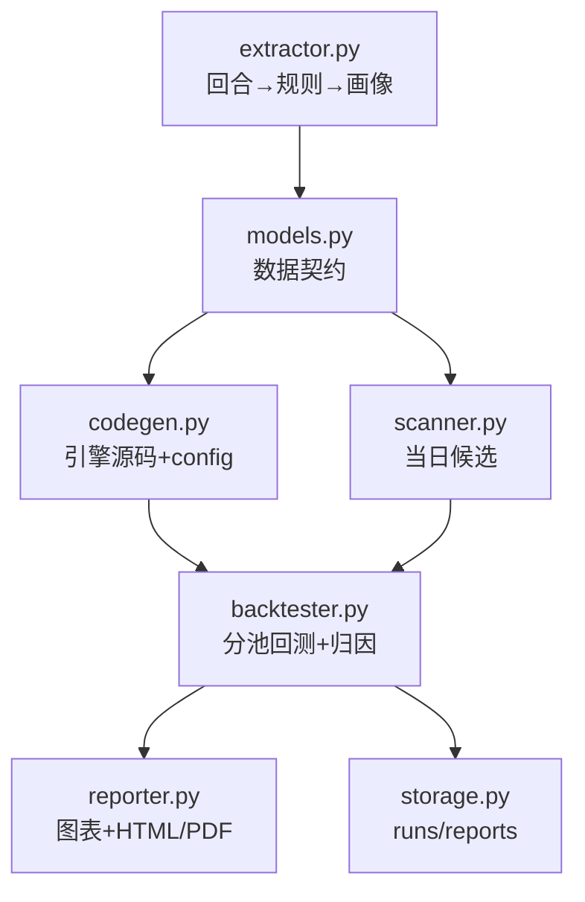
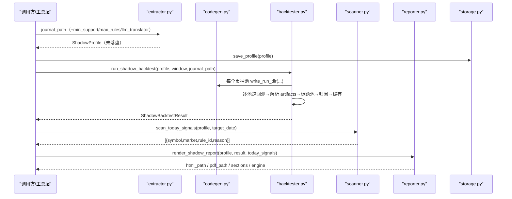
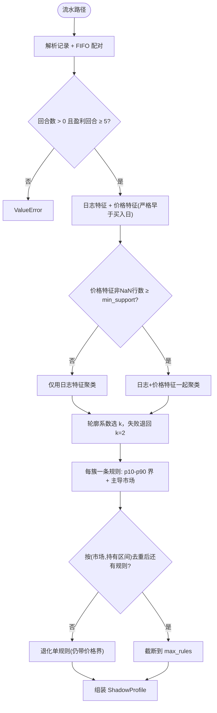
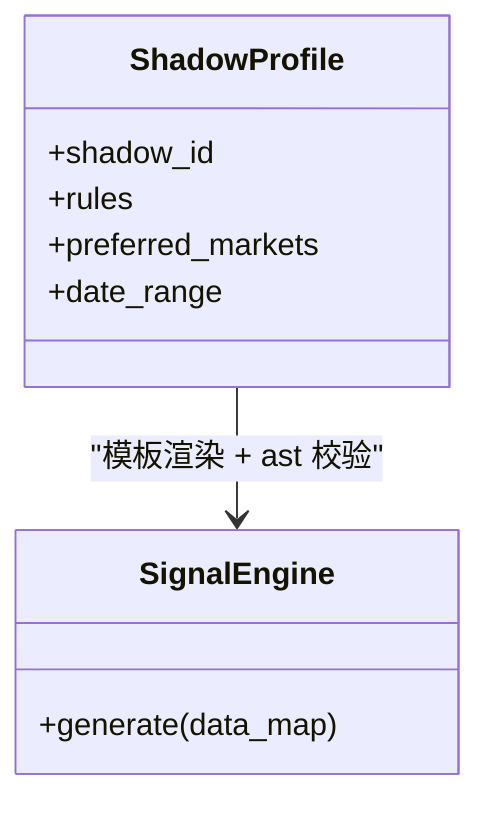
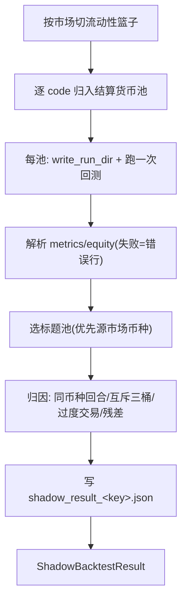
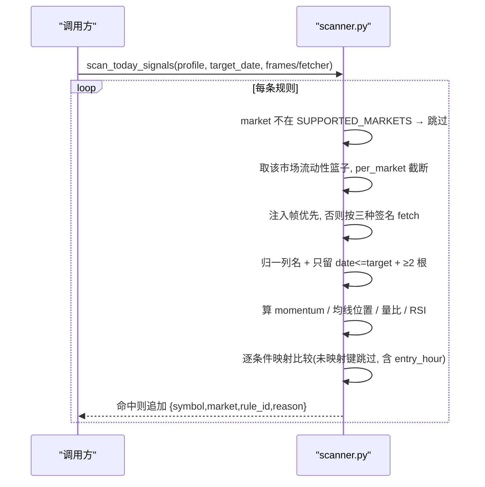
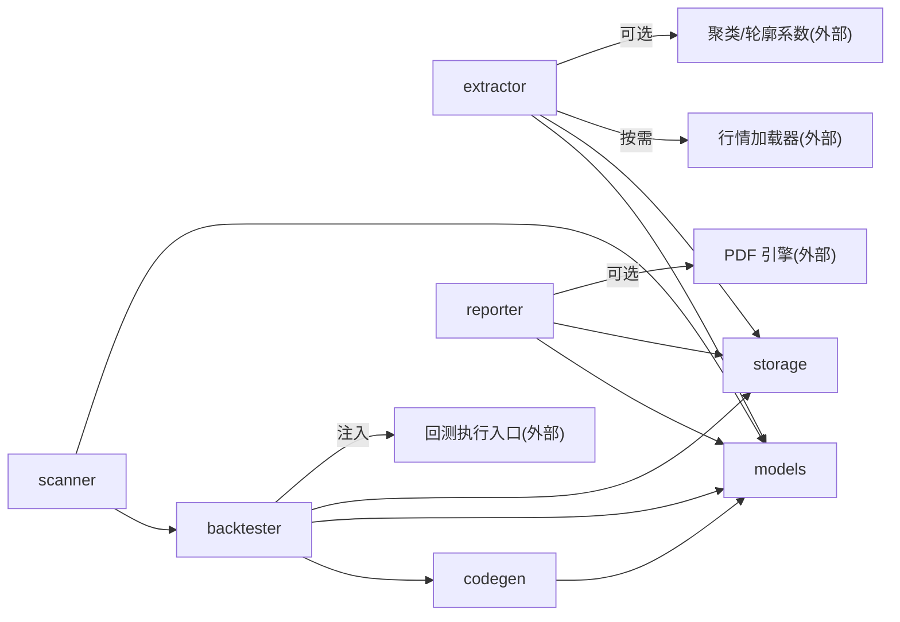

# 影子账户

<cite>
**本文引用的文件**
- [__init__.py](file://agent/src/shadow_account/__init__.py)
- [backtester.py](file://agent/src/shadow_account/backtester.py)
- [codegen.py](file://agent/src/shadow_account/codegen.py)
- [extractor.py](file://agent/src/shadow_account/extractor.py)
- [models.py](file://agent/src/shadow_account/models.py)
- [reporter.py](file://agent/src/shadow_account/reporter.py)
- [scanner.py](file://agent/src/shadow_account/scanner.py)
- [storage.py](file://agent/src/shadow_account/storage.py)
- [test_shadow_account.py](file://agent/tests/test_shadow_account.py)
</cite>

## 目录
1. [简介](#简介)
2. [项目结构](#项目结构)
3. [核心组件](#核心组件)
4. [架构总览](#架构总览)
5. [详细组件分析](#详细组件分析)
6. [依赖关系分析](#依赖关系分析)
7. [性能与可扩展性](#性能与可扩展性)
8. [故障排查指南](#故障排查指南)
9. [结论](#结论)
10. [附录：游标、参数与观测要点](#附录游标参数与观测要点)

## 简介
「影子账户」是一条离线的“你 vs 你的影子”流水线：从券商成交流水里提取盈利回合的共同形态，把形态固化成 1–5 条 if-then 规则，渲染成可被回测引擎加载的信号引擎，再按**结算货币分池**跑多市场回测，最后把“影子赚了多少、你赚了多少、差额由什么构成”算成可审计的算术归因并出报告；另外提供一个确定性扫描器，用同一批规则去扫固定流动性池，产出研究用途的候选。

链路上没有实盘语义：扫描器的返回值被明确要求“永远是研究型”，调用方要把免责声明一起透出；测试也锁住了这一点。

**章节来源**
- [scanner.py:30-44](file://agent/src/shadow_account/scanner.py#L30-L44)
- [test_shadow_account.py:1075-1089](file://agent/tests/test_shadow_account.py#L1075-L1089)

## 项目结构
模块在 `agent/src/shadow_account/`，包的 `__init__` 把提取、生成、回测、报告、存储五侧的入口汇成一层，`__all__` 共 17 个符号；**扫描器入口不在包级再导出里**，要从子模块显式取。

- 契约层 models：四个 frozen dataclass + 一份跨模块共用的价格特征名 `PRICE_FEATURES`
- 提取层 extractor：流水 → FIFO 回合 → 特征 → 聚类 → 规则 → 画像
- 生成层 codegen：规则 → 信号引擎源码 + 回测配置，带静态校验
- 回测层 backtester：选标的 → 按币种分池 → 逐池回测 → 解析产物 → 归因 → 结果缓存
- 扫描层 scanner：规则 + 近期日线 → 确定性候选
- 报告层 reporter：图表 + HTML + 可选 PDF
- 存储层 storage：Profile 落盘/回读、运行目录、报告目录、幂等哈希

**图示来源**
- [__init__.py:9-33](file://agent/src/shadow_account/__init__.py#L9-L33)
- [backtester.py:28-37](file://agent/src/shadow_account/backtester.py#L28-L37)
- [codegen.py:20-26](file://agent/src/shadow_account/codegen.py#L20-L26)
- [extractor.py:29-32](file://agent/src/shadow_account/extractor.py#L29-L32)
- [reporter.py:29-31](file://agent/src/shadow_account/reporter.py#L29-L31)
- [scanner.py:14-15](file://agent/src/shadow_account/scanner.py#L14-L15)
- [storage.py:18-19](file://agent/src/shadow_account/storage.py#L18-L19)

**章节来源**
- [__init__.py:1-53](file://agent/src/shadow_account/__init__.py#L1-L53)

## 核心组件
- 数据契约（models）：`ShadowRule`、`ShadowProfile`、`AttributionBreakdown`、`ShadowBacktestResult` 四个不可变结构，加上 `PRICE_FEATURES = ("entry_rsi14", "prior_5d_return")` 这一份“特征名单”，让提取、生成、扫描三边不能各写一套。
- 提取器（extractor）：解析流水 → FIFO 配对 → 只留盈利回合 → 造特征（日志侧 4 列数值 + 市场；价格侧 2 列按买入时点回看）→ 自动聚类 → 每簇一条规则 → 规则文本与画像段落。
- 代码生成（codegen）：把规则摊平成模板上下文，渲染出 `code/signal_engine.py` 与 `config.json`；写盘前必过 `ast` 静态校验。
- 回测驱动（backtester）：按市场篮子选标的 → 按结算货币分池 → 每池一次回测 → 解析 metrics/equity → 选“标题池” → 算术归因 → 结果缓存。
- 扫描器（scanner）：对规则市场在流动性池上逐标的判入场条件，缺数据就**不命中**而不是编造。
- 报告（reporter）：三张图 + sections 结构化载荷 + HTML，PDF 视渲染库可用性而定。
- 存储（storage）：runtime 根下的 `shadow_accounts/`、`shadow_runs/<id>/`、`shadow_reports/`，以及流水内容哈希。

**章节来源**
- [models.py:12-117](file://agent/src/shadow_account/models.py#L12-L117)
- [extractor.py:65-145](file://agent/src/shadow_account/extractor.py#L65-L145)
- [codegen.py:97-228](file://agent/src/shadow_account/codegen.py#L97-L228)
- [backtester.py:164-304](file://agent/src/shadow_account/backtester.py#L164-L304)
- [scanner.py:22-74](file://agent/src/shadow_account/scanner.py#L22-L74)
- [reporter.py:56-102](file://agent/src/shadow_account/reporter.py#L56-L102)
- [storage.py:22-129](file://agent/src/shadow_account/storage.py#L22-L129)

## 架构总览
链路以“策略即代码”为主线，但“回测”不是一个整体：复合回测引擎的资金池不做外汇折算，所以多市场被拆成**一个币种一池一跑**，只有标题池的指标进入 `combined` 与归因比较。

**图示来源**
- [backtester.py:208-241](file://agent/src/shadow_account/backtester.py#L208-L241)
- [codegen.py:193-228](file://agent/src/shadow_account/codegen.py#L193-L228)
- [extractor.py:65-145](file://agent/src/shadow_account/extractor.py#L65-L145)
- [reporter.py:56-102](file://agent/src/shadow_account/reporter.py#L56-L102)
- [scanner.py:22-74](file://agent/src/shadow_account/scanner.py#L22-L74)
- [storage.py:67-74](file://agent/src/shadow_account/storage.py#L67-L74)

**章节来源**
- [backtester.py:96-120](file://agent/src/shadow_account/backtester.py#L96-L120)
- [backtester.py:176-207](file://agent/src/shadow_account/backtester.py#L176-L207)

## 详细组件分析

### 数据契约（models）
- `ShadowRule`：`rule_id` / `human_text` / `entry_condition` / `exit_condition` / `holding_days_range` / `support_count` / `coverage_rate` / `sample_trades` / `weight`（默认 1.0）。`entry_condition` 的值既可以是标量，也可以是 `{"min","max"}` 界；提取端目前写的是标量市场 + 小时界 + 价格界。
- `ShadowProfile`：`shadow_id`、`created_at`、`journal_hash`、`source_market`、盈利/总回合数、`date_range`、`profile_text`、`rules`、`preferred_markets`、`typical_holding_days=(median,p75)`；序列化走 `asdict`。
- `AttributionBreakdown`：五个带符号分项 + `counterfactual_trades`（默认空）+ `excluded_currencies`（币种→被排除的回合数，单币种流水为空）。
- `ShadowBacktestResult`：`shadow_total_pnl` 与 `delta_pnl` 允许 `None`——“比较失败绝不能渲染成 0.0”，报告端与缓存端都按这个三态走。
- 一处文档与实现的偏差值得注意：字段注释写的是“中文、≤30 字”的规则文本与“3–5 条规则”，而提取端产出的是**英文、截到 `RULE_TEXT_MAX = 80`** 的句子，样本或簇不足时会退化成**恰好 1 条**规则；测试明确断言规则文本必须是纯 ASCII。

**章节来源**
- [models.py:20-46](file://agent/src/shadow_account/models.py#L20-L46)
- [models.py:49-81](file://agent/src/shadow_account/models.py#L49-L81)
- [models.py:84-99](file://agent/src/shadow_account/models.py#L84-L99)
- [models.py:102-117](file://agent/src/shadow_account/models.py#L102-L117)
- [extractor.py:561-593](file://agent/src/shadow_account/extractor.py#L561-L593)
- [extractor.py:354-416](file://agent/src/shadow_account/extractor.py#L354-L416)
- [test_shadow_account.py:150-165](file://agent/tests/test_shadow_account.py#L150-L165)

### 策略提取（extractor）
- 输入与硬门：解析不出记录 → `ValueError`；FIFO 配对后零回合 → `ValueError`；盈利回合少于 `MIN_PROFITABLE_ROUNDTRIPS = 5` → `ValueError`。后两条各有夹具（样本不足、只买不卖），第一条门目前没有测试触达——`rejects_missing_file` 锁的是文件不存在的 `FileNotFoundError`，不是这条 `ValueError`。
- 日志侧特征：`holding_days` / `pnl_pct` / `entry_hour` / `entry_weekday` 四个数值列加 `market` 一个类别列，市场缺失时落 `"other"`。
- 价格侧特征（时序铁律的落点）：`entry_rsi14` 与 `prior_5d_return` 只从**严格早于买入日**的已收盘日线读出——按买入日归一化到日期后 `< as_of` 过滤，买入当日的日线一律排除（当日收盘在盘中建仓时点还没发生）。历史不足 14 根/6 根时该项留 `NaN`。
- 取数与降级：按标的分组，每个标的一次取数，窗口是 `[min(buy_dt) - 40 天, max(buy_dt)]`（40 天是给 RSI 预热留的日历缓冲）；市场标签经映射表换成回测侧的市场键，未映射标签（如 `other`）不取数；无可用源、加载器抛错、返回空帧、缺 `close` 列——四种情况统一降级为 `None`，特征变 `NaN`。
- 稀疏即退出：只有“非 `NaN` 行数 ≥ `min_support`”的价格特征才会被提升进聚类维度，所以价格数据大面积缺失时行为**等价于纯日志特征**。
- 聚类与规则成型：轮廓系数在 `2..min(max_rules,5)` 里挑 k，失败退回 k=2，`random_state=42`；簇内样本 < `min_support` 跳过；按 `(market, holding_days_range)` 去重；攒够 `max_rules` 就停；一条都没攒出来就退化成单规则（单规则路径同样携带价格界，不再只出行为规则）。
- 规则边界：持有天数与入场小时取簇内 p10–p90（持有下界至少 1 天）；价格特征界同样是 p10–p90，但保留 4 位小数且需 ≥2 个非 `NaN` 样本，否则该键不写进 `entry_condition`。
- 文本产出：可选 `llm_translator`（异常或空串退回模板句 `Enter <市场> <小时窗>, hold <lo>-<hi>d`，截到 80 字符）；画像段落 `profile_text` 是英文一段，含盈利/总回合、主市场、中位与 p75 持有。
- 输出：返回**未落盘**的 `ShadowProfile`，是否持久化由调用方决定。

**图示来源**
- [extractor.py:88-104](file://agent/src/shadow_account/extractor.py#L88-L104)
- [extractor.py:228-270](file://agent/src/shadow_account/extractor.py#L228-L270)
- [extractor.py:335-351](file://agent/src/shadow_account/extractor.py#L335-L351)
- [extractor.py:354-416](file://agent/src/shadow_account/extractor.py#L354-L416)
- [extractor.py:419-459](file://agent/src/shadow_account/extractor.py#L419-L459)
- [extractor.py:462-547](file://agent/src/shadow_account/extractor.py#L462-L547)

**章节来源**
- [extractor.py:36-60](file://agent/src/shadow_account/extractor.py#L36-L60)
- [extractor.py:150-172](file://agent/src/shadow_account/extractor.py#L150-L172)
- [extractor.py:175-225](file://agent/src/shadow_account/extractor.py#L175-L225)
- [extractor.py:273-330](file://agent/src/shadow_account/extractor.py#L273-L330)
- [extractor.py:564-621](file://agent/src/shadow_account/extractor.py#L564-L621)
- [test_shadow_account.py:98-132](file://agent/tests/test_shadow_account.py#L98-L132)
- [test_shadow_account.py:168-196](file://agent/tests/test_shadow_account.py#L168-L196)
- [test_shadow_account.py:1202-1259](file://agent/tests/test_shadow_account.py#L1202-L1259)
- [test_shadow_account.py:1361-1407](file://agent/tests/test_shadow_account.py#L1361-L1407)

### 代码生成（codegen）
- 上下文摊平：一条规则 → `rule_id` / `market` / `entry_hour_min|max`（缺省 0 与 23）/ `hold_days`（持有区间中点四舍五入且 ≥1）/ `weight`，再把 `PRICE_FEATURES` 里那些 `{"min","max"}` 界摊平成 `<特征>_min` / `<特征>_max`。
- 字面量闸门：只有 `None`/字符串/布尔/整数/**有限**浮点/列表/元组/字典能进模板，非有限浮点直接 `ValueError`；渲染出的字面量还要过一遍 `ast.literal_eval` 回环校验。
- 模板环境：Jinja2 的文件系统加载器根在模块自带的模板目录，`select_autoescape` 只对 html/xml 生效，自定义过滤器 `py_literal` 挂上面的闸门函数。
- 静态校验三查：`ast.parse` 通过 → 模块里有 `class SignalEngine` → 该类有 `generate` 且除 `self` 外至少一个参数。`write_run_dir` 在**写盘之前**跑校验，不过就抛 `ValueError`。
- 产出：`<run_dir>/code/signal_engine.py` + `<run_dir>/config.json`；配置固定带 `source/codes/start_date/end_date/interval/initial_capital/engine/shadow_id`，`engine` 恒为 `"daily"`、`interval` 默认 `"1D"`，`extra` 最后合并覆盖。
- I/O 边界：本模块唯一的落盘函数是 `write_run_dir`（建 `code/` 目录、写上面这两个文件），`render_*` 与 `validate_generated` 不写文件（渲染只读模块自带的模板目录，校验是纯 `ast` 三查）；把回测跑起来才是调用方的事——每池先 `write_run_dir`、再调注入的回测入口。
- 生成引擎的时序：`hold_days` 与小时窗都来自规则；测试锁住了四条行为——同一标的在持仓期内不重复入场、一旦入场信号连续保持 `hold_days` 根、RSI 预热期的 `NaN` bar 被跳过、日线（同一时间戳）不受盘中小时窗约束而日内数据仍受约束。

**图示来源**
- [codegen.py:97-114](file://agent/src/shadow_account/codegen.py#L97-L114)
- [codegen.py:117-153](file://agent/src/shadow_account/codegen.py#L117-L153)
- [models.py:49-77](file://agent/src/shadow_account/models.py#L49-L77)

**章节来源**
- [codegen.py:28-94](file://agent/src/shadow_account/codegen.py#L28-L94)
- [codegen.py:156-228](file://agent/src/shadow_account/codegen.py#L156-L228)
- [test_shadow_account.py:237-261](file://agent/tests/test_shadow_account.py#L237-L261)
- [test_shadow_account.py:296-326](file://agent/tests/test_shadow_account.py#L296-L326)
- [test_shadow_account.py:2093-2144](file://agent/tests/test_shadow_account.py#L2093-L2144)
- [test_shadow_account.py:2289-2365](file://agent/tests/test_shadow_account.py#L2289-L2365)

### 多货币池回测与归因（backtester）
- 标的选择：`SUPPORTED_MARKETS = ("china_a","hk","us","crypto")`，每个市场一个固定流动性篮子；`select_multi_market_codes` 只做“按 `per_market_count`（下限 1）切篮子”，没有篮子的市场被跳过。该函数注释里写的“源市场优先”在当前实现里并不存在，选择结果与 `profile` 无关，测试也只断言“四个市场都覆盖、每市场 1–3 个”。
- 分池：按每个代码的结算货币把选择结果重组成 `{currency: {market: [codes]}}`；同币种的市场共用一池（默认四市场产出 CNY / HKD / USD 三池，`us` 与 `crypto` 同落 USD 池）。池名既是分组键也是运行目录名，所以必须是干净的币种码——测试专门锁了这一点（不允许出现带冒号的未知标记）。
- 逐池执行：每池一次 `write_run_dir` + 一次回测入口调用（默认指向真实入口，测试用注入点替换），每池都从**完整的** `initial_capital` 起步、不做跨池汇总；一个池失败只是留下一行错误，不影响其它池。
- 产物解析：指标优先 `metrics.json`，其次 `metrics`、`metrics.csv`（CSV 取最后一行），都没有就递归扫运行目录里的 `metrics.*`；净值曲线同理找 `equity.csv` 等键并按日期/权益列名猜列。只有“既没解析出指标、状态又非 ok”才把 `stderr` 尾 200 字写成 `combined.error`。
- 汇总三态：`per_market` 由各池自己的指标填充（同池市场确实共享资金池，因此共享指标；失败池给出空行）；`combined` 取“标题池”——优先含源市场代码且有可用指标的那一池，否则第一个有可用指标的，否则第 0 个；`equity_curves` 只收“确实跑出了曲线”的池（曲线为空的池不占位），标题池自己也有曲线时再额外挂一条 `combined` 别名。多池且有指标时补一句 `_currency_note`，明说没有外汇折算。
- 影子盈亏：从 runner 指标反推，顺序是 `total_return_abs` → `total_pnl` → `final_value - initial_capital` → `total_return × initial_capital`；四者皆无则 `None`（于是 `delta_pnl` 也是 `None`），显式 0 被视为真实测量。
- 归因（纯算术，不叫模型、不做模拟重建）：比较只取与标题池同币种的回合，其它币种的回合按币种计数进 `excluded_currencies`；三个桶互斥——盈利且持有短于规则并集下界记 `early_exit`，亏损且持有长于上界记 `late_exit`，其余越界记 `rule_violation` 噪声；`overtrading` 用“跨度天数 ÷ (2×中位持有)”当期望笔数（跨度取 `max(sell_dt) - min(buy_dt)`，注释解释了为什么不能用首末元素），且只统计**尚未被前三桶解释**的、`|pnl|` 最小的若干笔并取负号；`missed_signals` 是残差。`counterfactual_trades` 按 `|impact|` 取前 5。
- 现金分红：`side == "dividend"` 的行，若该标的已被本轮产出的复权帧覆盖则跳过（复权口径里已经含着，再加就双计），异币种行同样跳过；这部分现金只加进 `real_pnl`，因此只消化在 `missed` 残差里。
- 结果缓存：键是 `sha1(start|end|journal_hash)` 前 12 位，写成 `shadow_result_<key>.json`；窗口变了或流水重新提取（哈希变了）就**故意 miss**，不会端出旧运行；读不到或 JSON 坏了返回 `None`，缓存写失败只记 warning 不影响返回结果。

**图示来源**
- [backtester.py:53-120](file://agent/src/shadow_account/backtester.py#L53-L120)
- [backtester.py:128-159](file://agent/src/shadow_account/backtester.py#L128-L159)
- [backtester.py:208-241](file://agent/src/shadow_account/backtester.py#L208-L241)
- [backtester.py:243-304](file://agent/src/shadow_account/backtester.py#L243-L304)
- [backtester.py:386-412](file://agent/src/shadow_account/backtester.py#L386-L412)
- [backtester.py:616-731](file://agent/src/shadow_account/backtester.py#L616-L731)

**章节来源**
- [backtester.py:41-48](file://agent/src/shadow_account/backtester.py#L41-L48)
- [backtester.py:270-288](file://agent/src/shadow_account/backtester.py#L270-L288)
- [backtester.py:308-376](file://agent/src/shadow_account/backtester.py#L308-L376)
- [backtester.py:415-508](file://agent/src/shadow_account/backtester.py#L415-L508)
- [backtester.py:513-602](file://agent/src/shadow_account/backtester.py#L513-L602)
- [backtester.py:734-785](file://agent/src/shadow_account/backtester.py#L734-L785)
- [test_shadow_account.py:331-338](file://agent/tests/test_shadow_account.py#L331-L338)
- [test_shadow_account.py:397-494](file://agent/tests/test_shadow_account.py#L397-L494)
- [test_shadow_account.py:549-759](file://agent/tests/test_shadow_account.py#L549-L759)
- [test_shadow_account.py:764-869](file://agent/tests/test_shadow_account.py#L764-L869)

### 当日扫描器（scanner）
- 入参：`profile`、`target_date`（字符串 / `date` / `None` 取今天）、`per_market` 上限（默认 3）、可选的 `price_frames` 注入与 `fetcher`；注入优先，`fetcher` 支持三元/二元/一元三种签名，除 `TypeError` 外的异常一律当作拿不到数据。
- 市场闸门：规则的 `market` 不在 `SUPPORTED_MARKETS` 就直接跳过——于是标记为 `uk` 或 `other` 的规则一条也不会扫出来。命中理由串固定为 `"<规则号> price features matched (hold lo-hid)"`。
- 数据游标：列名先归一（`vol`/`amount`→`volume`，`trade_date`/`datetime`/`timestamp`→`date`），必须有 `close`，索引按日期排序后**只保留 `date <= target` 的 bar**，不足 2 根返回“无数据”。也就是说扫描读的是“目标日及以前已经收出的日线”，当日那条 bar 要等它收盘入库之后才可能参与判定；拿不到帧就跳过标的，绝不产出编造的命中。
- 特征：动量窗口从规则键名里的 `Nd` 猜（默认 5）；均线窗口默认 20 且被可用 bar 数截断；量比窗口默认 5；RSI 需 ≥14 根，公式与提取端同一份因果 Wilder EWM。
- 条件匹配：`market`/`ma_window`/`volume_window` 被显式忽略；键名含 `rsi`、`above_ma|price_above|close_gt_ma`、`volume|turnover`、`return|momentum|roc` 的分别映射到四个已算特征；其它键（**包括 `entry_hour`**）映射不到而被跳过，即扫描器不校验小时窗。只要有一个条件成功映射却没算出对应特征就判不命中；一个都没映射上时才退回兜底判据“动量>0 且收盘在均线上方，若有量比则量比>1”。
- 阈值比较：`{"min","max"}` 走闭区间；`(op, value)` 支持 `> >= < <= == !=` 六种（含 `gt/gte/lt/lte/eq/ne` 别名）；裸标量按 `>=`；阈值解析不出数字则视为通过。
- 输出：`{symbol, market, rule_id, reason}` 列表，研究型，免责声明由上层透出。

**图示来源**
- [scanner.py:22-74](file://agent/src/shadow_account/scanner.py#L22-L74)
- [scanner.py:100-128](file://agent/src/shadow_account/scanner.py#L100-L128)
- [scanner.py:131-166](file://agent/src/shadow_account/scanner.py#L131-L166)
- [scanner.py:169-229](file://agent/src/shadow_account/scanner.py#L169-L229)
- [scanner.py:232-284](file://agent/src/shadow_account/scanner.py#L232-L284)

**章节来源**
- [scanner.py:77-97](file://agent/src/shadow_account/scanner.py#L77-L97)
- [scanner.py:203-216](file://agent/src/shadow_account/scanner.py#L203-L216)
- [backtester.py:41-48](file://agent/src/shadow_account/backtester.py#L41-L48)

### 报告渲染（reporter）
- 返回四个键：`html_path`（总是有）、`pdf_path`（只有 PDF 引擎成功时）、`sections`（给前端预览的结构化载荷）、`engine`（`"weasyprint"` 或 `"html-only"`）。
- 顺序有讲究：先设 matplotlib 的中文字体（必须早于任何画图），再渲染图表，再拼 sections，最后用模板出 HTML；HTML 落在输出目录的 `<shadow_id>.html`，PDF 同名 `.pdf`。
- sections 是严格字典：指标被拆成“数字部分”和“错误串部分”（字符串按 `key: value` 连成 `combined_error`，布尔丢弃），所以模板里 `%f` 格式化不会踩到错误文本。
- 三张图各管一节：权益曲线（用 `combined` 曲线，超过 8 个点做 x 轴抽样）、分市场夏普柱状、归因瀑布（7 段：Real → 四个分项 → Missed → Shadow）。任何一张图失败只记 warning 并丢掉对应的 ``，且要求文件存在且非空才登记 URI；`shadow_total_pnl` 或 `delta_pnl` 为 `None`、或七段全为 0 时，瀑布图直接不画。
- PDF 探针每进程只做一次：导入失败后**永不再试**（注释给出原因——失败的导入会让底层库句柄被释放而符号表残留，二次导入可能在初始化时踩坏内存），渲染异常时删掉半成品并退回 `html-only`。
- CSS 从模板目录读入并前置一段中文字体 `@font-face`；另有把图片内联成 data URI 和把结果 dict 化的两个便利函数。
- 降级文案是被测试锁住的：结果为空时封面显示“unavailable”，第 5 节说明“没产出可用指标”，第 6 节显示“没有值得列出的反事实交易”。

**章节来源**
- [reporter.py:56-149](file://agent/src/shadow_account/reporter.py#L56-L149)
- [reporter.py:154-280](file://agent/src/shadow_account/reporter.py#L154-L280)
- [reporter.py:285-340](file://agent/src/shadow_account/reporter.py#L285-L340)
- [reporter.py:345-355](file://agent/src/shadow_account/reporter.py#L345-L355)
- [test_shadow_account.py:902-954](file://agent/tests/test_shadow_account.py#L902-L954)
- [test_shadow_account.py:957-1026](file://agent/tests/test_shadow_account.py#L957-L1026)

### 存储管理（storage）
- 布局：runtime 根下的 `shadow_accounts/<shadow_id>.json`、`shadow_runs/<shadow_id>/`、`shadow_reports/`；根目录由配置给出，取目录时顺手 `mkdir`。
- 身份与幂等：`new_shadow_id()` 是 `shadow_` + UUID4 前 8 位十六进制；`hash_journal()` 对原始字节按 64 KB 分块做 SHA1（40 位十六进制，测试断言长度）；`now_iso()` 是 UTC、秒级精度的 ISO8601。
- 序列化：`save_profile()` 用 `asdict` + `default=str` 写 JSON（元组因此落成数组）；`load_profile()` 手工重建每条 `ShadowRule`，`weight` 缺失时回落到 1.0，找不到文件抛 `FileNotFoundError`。
- 幂等查找：`find_by_journal_hash()` 扫目录下所有 JSON，坏文件跳过，按 `created_at` **字符串比较**取最新——它依赖 `now_iso()` 的定长 UTC 格式，换成别的格式这层排序就不可靠了。

**章节来源**
- [storage.py:3-6](file://agent/src/shadow_account/storage.py#L3-L6)
- [storage.py:22-64](file://agent/src/shadow_account/storage.py#L22-L64)
- [storage.py:67-113](file://agent/src/shadow_account/storage.py#L67-L113)
- [storage.py:116-129](file://agent/src/shadow_account/storage.py#L116-L129)
- [test_shadow_account.py:201-232](file://agent/tests/test_shadow_account.py#L201-L232)

## 依赖关系分析
- 包内方向：`extractor` → `models` + `storage`；`codegen` → `models`；`backtester` → `codegen` + `models` + `storage`；`scanner` → `models` 且**直接复用 `backtester` 的私有常量**（流动性池与市场元组）；`reporter` → `models` + `storage`；`storage` → `models`。
- 包外依赖按类别：
  - 成交日志解析与 FIFO 配对：提取端与回测端各取一半（回测端配对时还传入复权口径），因此两侧的回合口径由同一套工具保证。
  - 回测执行入口：通过参数注入，默认在函数内部延迟取得。
  - 行情加载：提取端经回测侧的加载器注册表按市场键取日线，取不到即降级。
  - 币种判定：分池与归因过滤都依赖“按代码判结算货币”的钩子。
  - 数值/学习：`numpy`/`pandas` 常驻，`sklearn` 的 KMeans、StandardScaler、轮廓系数在聚类函数内部导入。
  - 展示：`matplotlib` 在每张图的函数内部导入；PDF 引擎按可选处理；Jinja2 与中文字体模块在报告模块顶部。

**图示来源**
- [backtester.py:28-37](file://agent/src/shadow_account/backtester.py#L28-L37)
- [extractor.py:26-32](file://agent/src/shadow_account/extractor.py#L26-L32)
- [extractor.py:434-448](file://agent/src/shadow_account/extractor.py#L434-L448)
- [reporter.py:27-31](file://agent/src/shadow_account/reporter.py#L27-L31)
- [scanner.py:14-15](file://agent/src/shadow_account/scanner.py#L14-L15)
- [storage.py:18-19](file://agent/src/shadow_account/storage.py#L18-L19)

**章节来源**
- [backtester.py:379-381](file://agent/src/shadow_account/backtester.py#L379-L381)
- [extractor.py:201-225](file://agent/src/shadow_account/extractor.py#L201-L225)
- [reporter.py:180-247](file://agent/src/shadow_account/reporter.py#L180-L247)

## 性能与可扩展性
- 串行按池：池的循环里逐个写目录、逐个调回测入口，没有并发；好处是失败被隔离在一池一行里，代价是墙钟时间线性于池数。
- 归因开销可控：主循环对同币种回合走一趟常数次算术，排序只在 `|impact|` 上做一次；模块头注释把“不叫模型、不做模拟重建”当作可审计性的前提。
- 取数量：提取端每个标的一次日线请求（不是每回合一次），窗口固定带 40 天缓冲；聚类候选 k 的循环最多 `max_k-1` 次预拟合再定终拟合，`n_init=5`、随机种子固定。
- 报告：图表按需渲染、失败即丢该图；PDF 引擎的进程级探针让后续渲染跳过导入开销。
- 扩展市场：要同时改回测侧的市场元组和流动性池映射（两处），只改提取端的市场标签映射会得到“规则里有 uk、回测与扫描都不认”的半状态。
- 扩展特征：改 `models.PRICE_FEATURES` 一处即可让提取、生成、扫描三边同步；测试专门断言提取端与生成端引用的是同一个对象，防止两边各写一份字面量。
- 扩展归因项：要同时动 `AttributionBreakdown` 字段、归因组装处**以及缓存回读的手工映射**——回读不是 `from_dict` 通用实现，漏改会让新字段只在首跑可见。
- 池名即目录名：新增币种时注意键必须是干净币种码，别把分隔符带进路径。

**章节来源**
- [backtester.py:14-15](file://agent/src/shadow_account/backtester.py#L14-L15)
- [backtester.py:223-241](file://agent/src/shadow_account/backtester.py#L223-L241)
- [backtester.py:336-351](file://agent/src/shadow_account/backtester.py#L336-L351)
- [backtester.py:716-731](file://agent/src/shadow_account/backtester.py#L716-L731)
- [extractor.py:419-459](file://agent/src/shadow_account/extractor.py#L419-L459)
- [models.py:12-17](file://agent/src/shadow_account/models.py#L12-L17)
- [test_shadow_account.py:1409-1437](file://agent/tests/test_shadow_account.py#L1409-L1437)

## 故障排查指南
- 解析不出记录：`No trade records parsed from <path> (format=...)`，先确认导出格式与表头。
- 零回合：`No complete buy→sell roundtrips found in journal.`，通常是流水只有单边或卖出早于任何买入。
- 盈利样本不足：`Insufficient profitable roundtrips: N (need ≥5).`，`MIN_PROFITABLE_ROUNDTRIPS` 是硬下限，调 `min_support` 不能绕过它。
- 规则里没有价格界：三种成因——市场标签不在映射表（如 `other`）、当轮无可用行情源、历史不足 14/6 根；表现是聚类退回纯日志特征，规则只带小时与持有区间。
- 只出 1 条规则：样本数低于 `min_support`，或所有簇都被 `(market, holding_days_range)` 去重吃掉，两者都走单规则退化路径。
- `combined` 里有 `error` 且 `shadow_total_pnl` 为 `None`：所有池都没产出可用指标；此时 `delta_pnl` 同样是 `None`，报告封面与第 5 节按“不可比较”渲染。
- 某个市场的行是空字典：那一池失败，其它池照常；`combined` 会滑到下一个有可用指标的池，多池时看 `_currency_note` 确认它只是某一币种池。
- 归因全是 0 但影子盈亏正常：没传 `journal_path`、文件不存在、或流水解析抛错——归因走“零值 + 影子盈亏”分支，`real_total_pnl` 记 0.0。
- 只有 HTML 没有 PDF：PDF 引擎不可用或渲染异常；本进程不会重试导入，半成品文件会被删掉，`engine` 字段是 `"html-only"`。
- 扫不出任何候选：既没注入 `price_frames` 又没给 `fetcher`；或目标日的日线还没收进数据（不足 2 根直接判无数据）；或规则市场不受支持。
- 报告的“被排除币种”说明不见了：本次读的是结果缓存，缓存回读没有恢复 `excluded_currencies` 字段。

**章节来源**
- [extractor.py:88-104](file://agent/src/shadow_account/extractor.py#L88-L104)
- [extractor.py:201-203](file://agent/src/shadow_account/extractor.py#L201-L203)
- [extractor.py:335-351](file://agent/src/shadow_account/extractor.py#L335-L351)
- [extractor.py:365-373](file://agent/src/shadow_account/extractor.py#L365-L373)
- [extractor.py:407-416](file://agent/src/shadow_account/extractor.py#L407-L416)
- [backtester.py:344-351](file://agent/src/shadow_account/backtester.py#L344-L351)
- [backtester.py:407-408](file://agent/src/shadow_account/backtester.py#L407-L408)
- [backtester.py:496-508](file://agent/src/shadow_account/backtester.py#L496-L508)
- [backtester.py:513-531](file://agent/src/shadow_account/backtester.py#L513-L531)
- [backtester.py:534-574](file://agent/src/shadow_account/backtester.py#L534-L574)
- [reporter.py:317-339](file://agent/src/shadow_account/reporter.py#L317-L339)
- [scanner.py:87-88](file://agent/src/shadow_account/scanner.py#L87-L88)
- [scanner.py:166](file://agent/src/shadow_account/scanner.py#L166)

## 结论
影子账户把“凭经验赚钱的那几笔”变成一件可读的东西：规则从盈利回合里统计出来、渲染成带静态校验的代码、在按结算货币隔离的池子里重放，再用纯算术把“你和你的影子”的差额拆成噪声、早退、晚退、过度交易与残差。三处时间游标是分开的——提取只看买入日之前收出的日线，重放逐 bar 因果推进，扫描只用目标日及以前已经收出的 bar——所以任何一步都不需要未来数据；反过来，数据没到位时链路的一致行为是“不命中/不可比较/不画这张图”，而不是补一个好看的数字。留在纸面上的弱点主要是市场集合不一致（`uk` 只在提取端有映射）、缓存回读的手工映射、以及若干与实现不同步的注释文本。

**章节来源**
- [backtester.py:176-207](file://agent/src/shadow_account/backtester.py#L176-L207)
- [extractor.py:9-17](file://agent/src/shadow_account/extractor.py#L9-L17)
- [scanner.py:3-4](file://agent/src/shadow_account/scanner.py#L3-L4)

## 附录：游标、参数与观测要点

### 三处游标（什么时候能看到什么）
- 提取端：特征按 `buy_dt` 回看，索引过滤是“严格早于买入日所在日期”，买入当日的日线即使已在库里也被排除；预热缓冲只往**过去**加 40 天。
- 重放端：生成的引擎按 bar 顺序推进，持仓期内不重复入场、入场后连续保持 `hold_days` 根；RSI 预热期为 `NaN` 的 bar 被跳过；小时窗只在数据带多个时间（日内）时才生效，日线（同一时间戳）不受它约束。
- 扫描端：保留 `date <= target` 的 bar，且至少 2 根才计算特征；因此“当日扫描”语义上是收盘后动作，盘中数据没进来就是零命中。

**章节来源**
- [extractor.py:228-240](file://agent/src/shadow_account/extractor.py#L228-L240)
- [scanner.py:131-166](file://agent/src/shadow_account/scanner.py#L131-L166)
- [test_shadow_account.py:2093-2144](file://agent/tests/test_shadow_account.py#L2093-L2144)
- [test_shadow_account.py:2312-2365](file://agent/tests/test_shadow_account.py#L2312-L2365)

### 默认参数速查
- 提取：`MIN_PROFITABLE_ROUNDTRIPS = 5`、`DEFAULT_MAX_RULES = 5`、`DEFAULT_MIN_SUPPORT = 3`、RSI 周期 14、前 5 日收益、取数缓冲 40 天、规则文本上限 80 字符。
- 回测：`per_market_count = 5`、`initial_capital = 1_000_000.0`（每池一份）、`source = "auto"`、`interval = "1D"`、`engine = "daily"`。
- 扫描：`per_market = 3`、均线窗口 20、量比窗口 5、动量窗口 5、RSI 周期 14。
- 缓存键：`窗口起|窗口止|流水哈希` 的 SHA1 前 12 位。

**章节来源**
- [codegen.py:156-190](file://agent/src/shadow_account/codegen.py#L156-L190)
- [backtester.py:164-175](file://agent/src/shadow_account/backtester.py#L164-L175)
- [backtester.py:308-313](file://agent/src/shadow_account/backtester.py#L308-L313)
- [extractor.py:36-50](file://agent/src/shadow_account/extractor.py#L36-L50)
- [extractor.py:42-47](file://agent/src/shadow_account/extractor.py#L42-L47)
- [extractor.py:561](file://agent/src/shadow_account/extractor.py#L561)
- [scanner.py:19-28](file://agent/src/shadow_account/scanner.py#L19-L28)
- [scanner.py:175-194](file://agent/src/shadow_account/scanner.py#L175-L194)

### 观测点
- `combined` 里的数字与 `combined_error` 是分开的两条通道，别只看状态字段。
- `_currency_note` 一旦出现，说明 `combined` 只代表一个币种池，其它池只在 `per_market` 行里。
- `shadow_total_pnl is None` 与 `== 0.0` 是两种事实：前者是“没测出来”，后者是“真零”。
- `attribution.excluded_currencies` 非空表示有回合因币种不同被排除在比较之外。
- 报告返回值里的 `engine` 字段直接告诉你这次有没有出 PDF。

**章节来源**
- [backtester.py:254-260](file://agent/src/shadow_account/backtester.py#L254-L260)
- [backtester.py:392-412](file://agent/src/shadow_account/backtester.py#L392-L412)
- [models.py:96-99](file://agent/src/shadow_account/models.py#L96-L99)
- [models.py:104-117](file://agent/src/shadow_account/models.py#L104-L117)
- [reporter.py:63-71](file://agent/src/shadow_account/reporter.py#L63-L71)
- [reporter.py:112-128](file://agent/src/shadow_account/reporter.py#L112-L128)
- [reporter.py:138-149](file://agent/src/shadow_account/reporter.py#L138-L149)

### 对外入口与通知接入点
- 工具层的注册表应自动发现四个影子工具名（提取、回测、报告、扫描）；提取工具会顺手落盘 Profile，扫描工具的返回值必须带免责声明，未知 `shadow_id` 走错误分支——这些都由模块外的测试用例锁定。
- 扫描结果适合当“收盘后研究提醒”的触发源：字段就是 `{symbol, market, rule_id, reason}`，但本模块不含任何推送/通道实现，接入点要在业务层。

**章节来源**
- [scanner.py:30-44](file://agent/src/shadow_account/scanner.py#L30-L44)
- [test_shadow_account.py:1028-1039](file://agent/tests/test_shadow_account.py#L1028-L1039)
- [test_shadow_account.py:1042-1097](file://agent/tests/test_shadow_account.py#L1042-L1097)
- [test_shadow_account.py:1100-1115](file://agent/tests/test_shadow_account.py#L1100-L1115)
