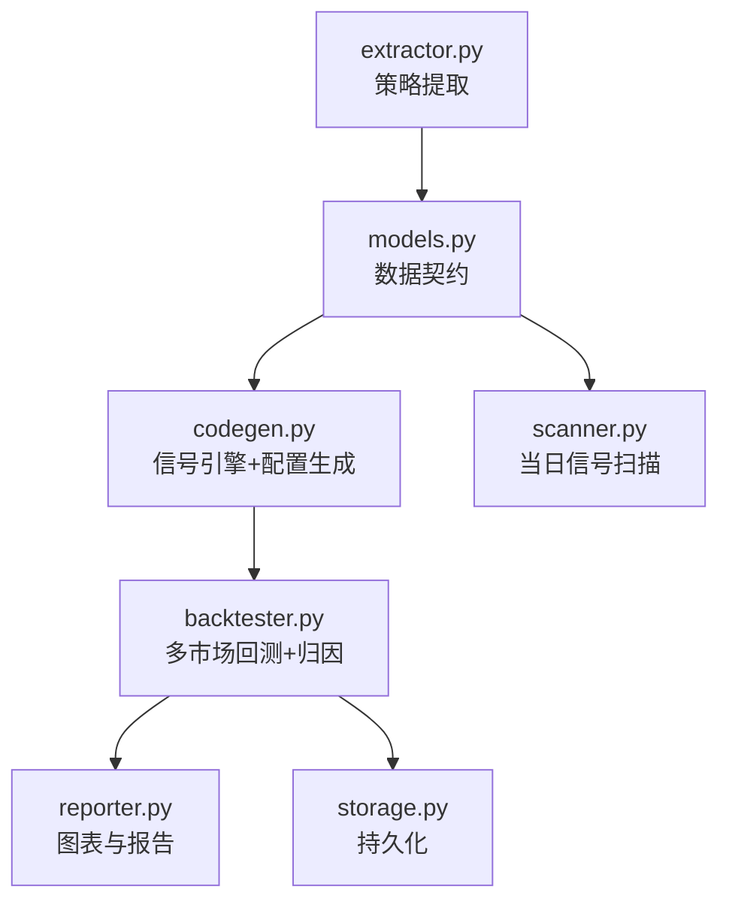
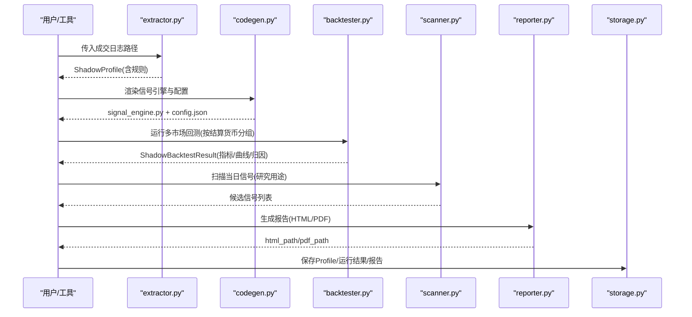
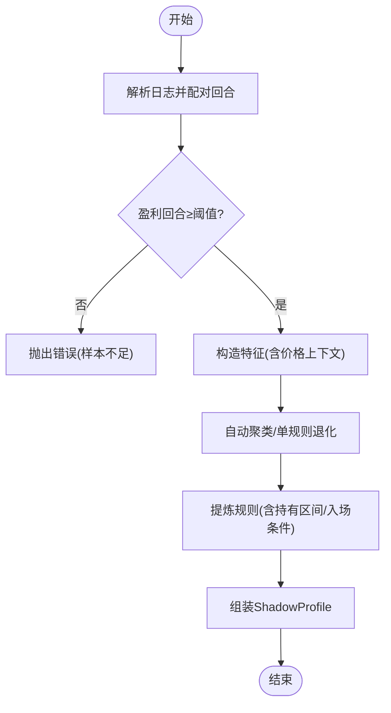
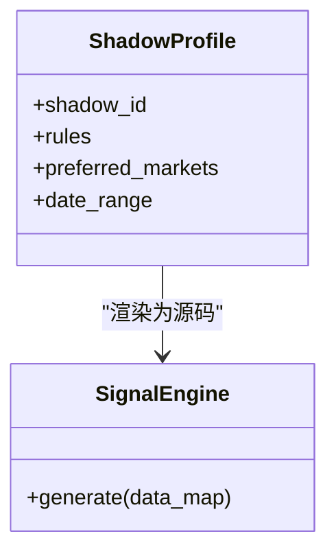
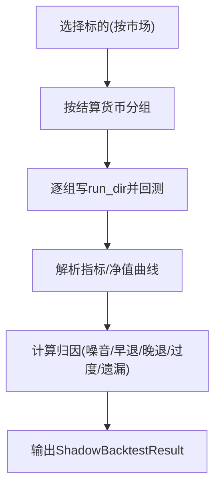
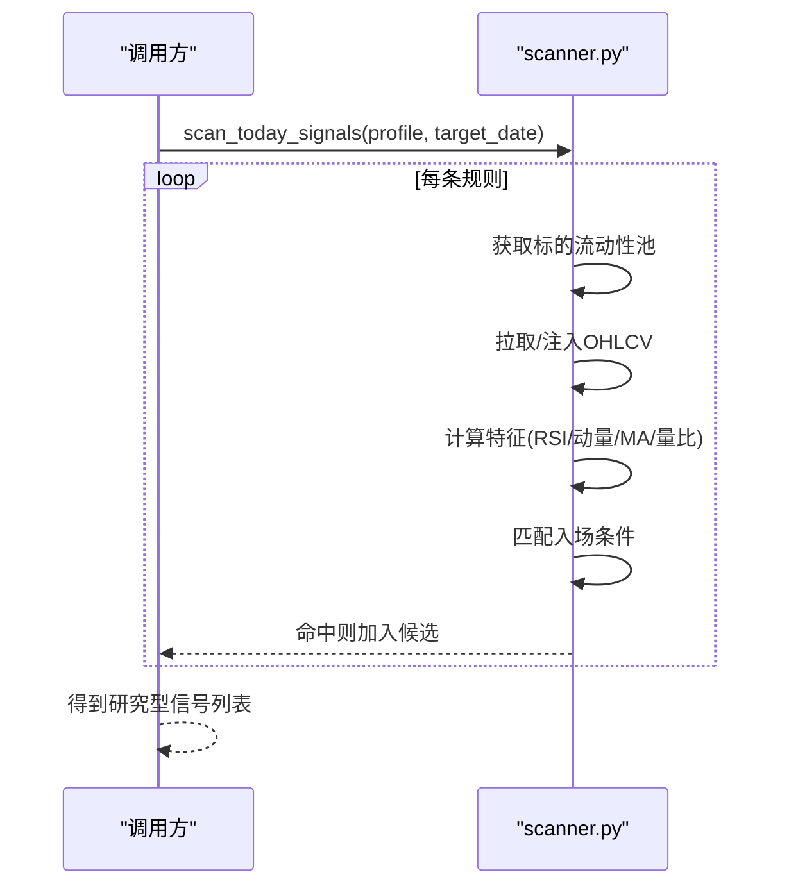
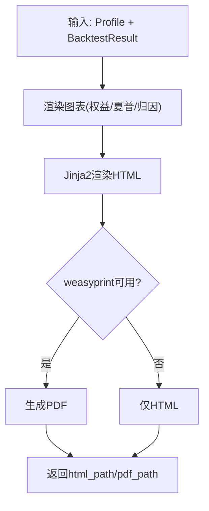
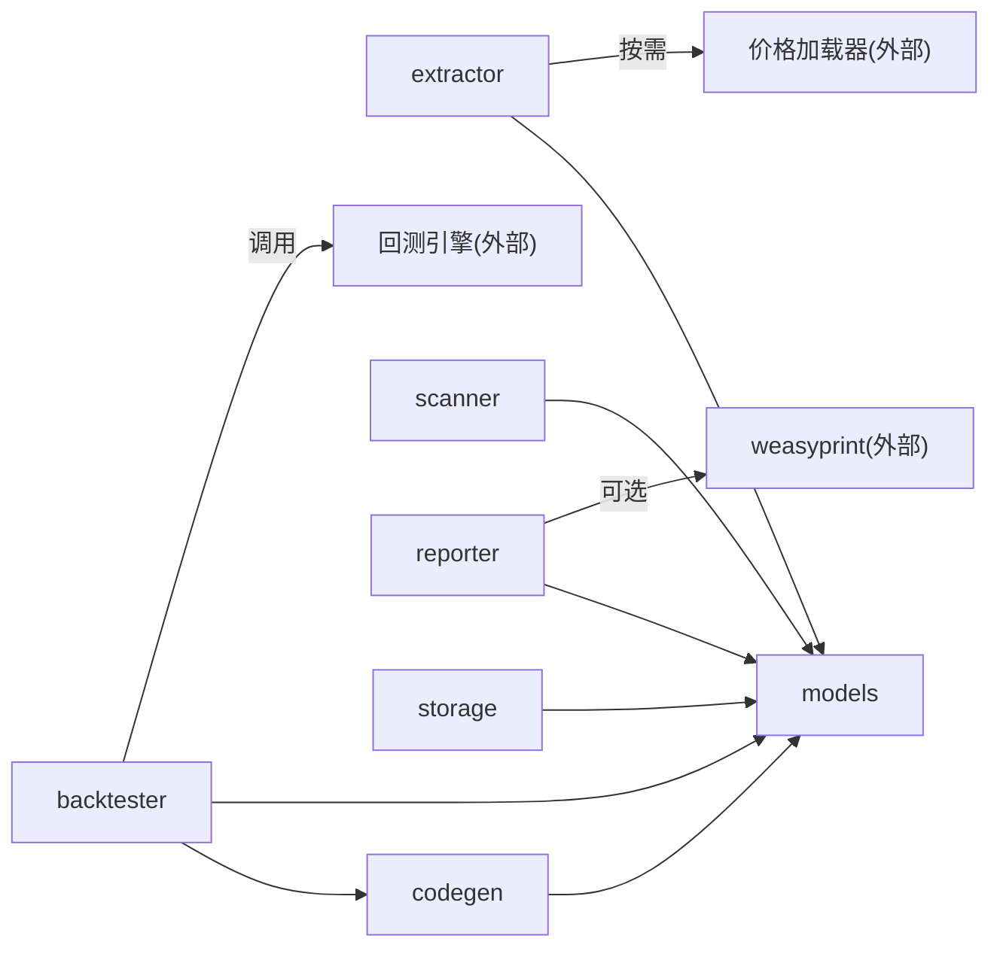

# 影子账户

<cite>
**本文引用的文件**
- [__init__.py](file://agent/src/shadow_account/__init__.py)
- [backtester.py](file://agent/src/shadow_account/backtester.py)
- [models.py](file://agent/src/shadow_account/models.py)
- [extractor.py](file://agent/src/shadow_account/extractor.py)
- [codegen.py](file://agent/src/shadow_account/codegen.py)
- [scanner.py](file://agent/src/shadow_account/scanner.py)
- [storage.py](file://agent/src/shadow_account/storage.py)
- [reporter.py](file://agent/src/shadow_account/reporter.py)
- [test_shadow_account.py](file://agent/tests/test_shadow_account.py)
</cite>

## 目录
1. [简介](#简介)
2. [项目结构](#项目结构)
3. [核心组件](#核心组件)
4. [架构总览](#架构总览)
5. [详细组件分析](#详细组件分析)
6. [依赖关系分析](#依赖关系分析)
7. [性能与可扩展性](#性能与可扩展性)
8. [故障排查指南](#故障排查指南)
9. [结论](#结论)
10. [附录：配置与监控指南](#附录配置与监控指南)

## 简介
本技术文档面向量化交易员与风险管理师，系统性说明“影子账户”功能：从真实交易日志中自动提取可复现的“影子策略”，在虚拟资金账户中进行多市场回测、生成信号引擎代码、进行风险归因与报告输出；并提供当日扫描器以发现潜在机会。文档覆盖模拟交易机制（虚拟资金、模拟订单执行、市场数据仿真）、风险评估（回测、指标计算、压力测试思路）、策略验证流程（信号生成、仓位管理、绩效评估）、扫描器（机会发现、信号触发、通知接入点）、存储管理与报告生成，以及配置与监控要点。

## 项目结构
影子账户模块位于 agent/src/shadow_account，围绕“提取—生成—回测—扫描—报告—存储”的闭环组织：
- 提取器 extractor：从成交日志提取规则与画像
- 代码生成 codegen：将规则渲染为可执行的信号引擎与运行配置
- 回测驱动 backtester：按结算货币分组执行多市场回测，并做归因
- 扫描器 scanner：基于规则对近期行情进行确定性扫描
- 报告 reporter：图表与HTML/PDF报告
- 存储 storage：Profile、运行结果与报告的持久化
- 模型 models：跨模块稳定契约（ShadowProfile/Rule/BacktestResult）

**图示来源**
- [__init__.py:9-33](file://agent/src/shadow_account/__init__.py#L9-L33)
- [backtester.py:163-286](file://agent/src/shadow_account/backtester.py#L163-L286)
- [codegen.py:97-229](file://agent/src/shadow_account/codegen.py#L97-L229)
- [extractor.py:65-145](file://agent/src/shadow_account/extractor.py#L65-L145)
- [reporter.py:56-102](file://agent/src/shadow_account/reporter.py#L56-L102)
- [scanner.py:22-74](file://agent/src/shadow_account/scanner.py#L22-L74)
- [storage.py:22-130](file://agent/src/shadow_account/storage.py#L22-L130)

**章节来源**
- [__init__.py:1-54](file://agent/src/shadow_account/__init__.py#L1-L54)

## 核心组件
- 数据契约（models）：定义 ShadowProfile、ShadowRule、AttributionBreakdown、ShadowBacktestResult 等不可变数据结构，作为提取、生成、回测、报告之间的稳定边界。
- 提取器（extractor）：从券商日志解析成交记录，配对成完整回合，筛选盈利回合，构造特征（含价格上下文），聚类与规则提炼，生成自然语言描述。
- 代码生成（codegen）：将规则渲染为 signal_engine.py 与 config.json，并进行静态校验，确保可被回测引擎安全加载。
- 回测驱动（backtester）：按结算货币分组选择代表性标的，调用底层回测工具，汇总指标与净值曲线，计算归因（噪音交易、早退、晚退、过度交易、遗漏信号）。
- 扫描器（scanner）：对当日或指定日期，用规则匹配流动性池中的标的，返回研究型候选信号。
- 报告（reporter）：绘制权益曲线、分市场夏普、归因瀑布图，输出HTML与可选PDF。
- 存储（storage）：Profile、运行产物与报告落盘，支持按journal哈希查找最近一次提取结果。

**章节来源**
- [models.py:20-111](file://agent/src/shadow_account/models.py#L20-L111)
- [extractor.py:65-145](file://agent/src/shadow_account/extractor.py#L65-L145)
- [codegen.py:97-229](file://agent/src/shadow_account/codegen.py#L97-L229)
- [backtester.py:163-286](file://agent/src/shadow_account/backtester.py#L163-L286)
- [scanner.py:22-74](file://agent/src/shadow_account/scanner.py#L22-L74)
- [reporter.py:56-102](file://agent/src/shadow_account/reporter.py#L56-L102)
- [storage.py:22-130](file://agent/src/shadow_account/storage.py#L22-L130)

## 架构总览
影子账户以“策略即代码”的方式工作：从历史成交中提炼规则，自动生成可执行的信号引擎，并在虚拟资金账户下进行多市场回测与归因；同时提供当日扫描器用于机会发现，最终产出可视化报告。

**图示来源**
- [extractor.py:65-145](file://agent/src/shadow_account/extractor.py#L65-L145)
- [codegen.py:193-229](file://agent/src/shadow_account/codegen.py#L193-L229)
- [backtester.py:163-286](file://agent/src/shadow_account/backtester.py#L163-L286)
- [scanner.py:22-74](file://agent/src/shadow_account/scanner.py#L22-L74)
- [reporter.py:56-102](file://agent/src/shadow_account/reporter.py#L56-L102)
- [storage.py:67-130](file://agent/src/shadow_account/storage.py#L67-L130)

## 详细组件分析

### 策略提取（extractor）
- 输入：券商导出的成交日志（CSV/Excel），自动识别格式并解析。
- 处理：FIFO配对回合 → 过滤盈利回合 → 构造特征（持有期、收益率、入场时间、星期、市场、RSI、前N日收益等）→ 自动聚类与规则提炼 → 生成人类可读规则文本。
- 约束：无强制外部价格数据调用；若价格数据不可用则降级为NaN并从特征矩阵剔除；样本过少时直接报错。
- 输出：ShadowProfile（包含若干条ShadowRule及画像信息）。

**图示来源**
- [extractor.py:65-145](file://agent/src/shadow_account/extractor.py#L65-L145)
- [extractor.py:301-330](file://agent/src/shadow_account/extractor.py#L301-L330)
- [extractor.py:354-416](file://agent/src/shadow_account/extractor.py#L354-L416)

**章节来源**
- [extractor.py:65-145](file://agent/src/shadow_account/extractor.py#L65-L145)
- [extractor.py:150-270](file://agent/src/shadow_account/extractor.py#L150-L270)
- [extractor.py:301-330](file://agent/src/shadow_account/extractor.py#L301-L330)
- [extractor.py:354-416](file://agent/src/shadow_account/extractor.py#L354-L416)
- [test_shadow_account.py:137-184](file://agent/tests/test_shadow_account.py#L137-L184)

### 代码生成（codegen）
- 输入：ShadowProfile
- 处理：将规则映射为Jinja模板上下文，渲染出 signal_engine.py 与 config.json；对生成的Python源码进行AST静态检查，确保类与方法签名符合预期。
- 输出：可被回测引擎加载的信号引擎与运行配置。

**图示来源**
- [codegen.py:97-153](file://agent/src/shadow_account/codegen.py#L97-L153)
- [codegen.py:156-229](file://agent/src/shadow_account/codegen.py#L156-L229)
- [models.py:20-78](file://agent/src/shadow_account/models.py#L20-L78)

**章节来源**
- [codegen.py:97-229](file://agent/src/shadow_account/codegen.py#L97-L229)

### 多市场回测与归因（backtester）
- 标的选择：按市场流动性池选取代表性代码，优先保留源市场代码。
- 分组执行：按结算货币分组（避免混合货币共享资金池导致的FX问题），每组独立初始资金。
- 指标聚合：读取artifacts中的metrics与equity曲线，合并为 per_market 与 combined。
- 归因算法：对比影子PnL与真实PnL，分解为噪音交易、早退、晚退、过度交易、遗漏信号，并列出影响最大的反向事实交易。

**图示来源**
- [backtester.py:53-120](file://agent/src/shadow_account/backtester.py#L53-L120)
- [backtester.py:163-286](file://agent/src/shadow_account/backtester.py#L163-L286)
- [backtester.py:469-629](file://agent/src/shadow_account/backtester.py#L469-L629)

**章节来源**
- [backtester.py:163-286](file://agent/src/shadow_account/backtester.py#L163-L286)
- [backtester.py:469-629](file://agent/src/shadow_account/backtester.py#L469-L629)

### 当日扫描器（scanner）
- 输入：ShadowProfile、目标日期、可选价格数据注入或fetcher。
- 处理：遍历规则，针对每个市场的流动性池标的，标准化OHLCV并计算动量、均线位置、成交量比率、RSI等，判断是否满足入场条件。
- 输出：研究型候选信号列表（symbol, market, rule_id, reason）。

**图示来源**
- [scanner.py:22-74](file://agent/src/shadow_account/scanner.py#L22-L74)
- [scanner.py:100-128](file://agent/src/shadow_account/scanner.py#L100-L128)
- [scanner.py:169-200](file://agent/src/shadow_account/scanner.py#L169-L200)

**章节来源**
- [scanner.py:22-74](file://agent/src/shadow_account/scanner.py#L22-L74)
- [scanner.py:100-128](file://agent/src/shadow_account/scanner.py#L100-L128)
- [scanner.py:169-200](file://agent/src/shadow_account/scanner.py#L169-L200)

### 报告生成（reporter）
- 输入：ShadowProfile、ShadowBacktestResult、可选当日信号。
- 处理：绘制权益曲线、分市场夏普柱状图、归因瀑布图；使用Jinja2渲染HTML；可选weasyprint生成PDF。
- 输出：html_path、pdf_path（可用时）、sections结构化数据。

**图示来源**
- [reporter.py:56-102](file://agent/src/shadow_account/reporter.py#L56-L102)
- [reporter.py:154-278](file://agent/src/shadow_account/reporter.py#L154-L278)
- [reporter.py:304-340](file://agent/src/shadow_account/reporter.py#L304-L340)

**章节来源**
- [reporter.py:56-102](file://agent/src/shadow_account/reporter.py#L56-L102)
- [reporter.py:154-278](file://agent/src/shadow_account/reporter.py#L154-L278)
- [reporter.py:304-340](file://agent/src/shadow_account/reporter.py#L304-L340)

### 存储管理（storage）
- 布局：runtime根目录下 shadow_accounts/<id>.json、shadow_runs/<id>/、shadow_reports/<id>.pdf。
- 能力：生成唯一ID、计算journal哈希、保存/加载Profile、按journal哈希查找最新Profile、创建runs/reports目录。

**章节来源**
- [storage.py:22-130](file://agent/src/shadow_account/storage.py#L22-L130)

## 依赖关系分析
- 模块内耦合：
  - extractor 依赖 models 契约与 tools 的交易日志解析；
  - codegen 依赖 models 与 jinja2 模板；
  - backtester 依赖 codegen 写run_dir，再调用底层回测工具，最后解析artifacts；
  - scanner 复用 backtester 的流动性池与市场常量；
  - reporter 依赖 models 与 matplotlib/weasyprint；
  - storage 负责所有持久化。
- 外部依赖：
  - 回测引擎（通过 backtester 默认函数注入）；
  - 价格数据加载器（extractor 按需通过注册表获取，失败降级）；
  - weasyprint（可选，用于PDF）。

**图示来源**
- [backtester.py:379-381](file://agent/src/shadow_account/backtester.py#L379-L381)
- [extractor.py:175-225](file://agent/src/shadow_account/extractor.py#L175-L225)
- [reporter.py:304-340](file://agent/src/shadow_account/reporter.py#L304-L340)

**章节来源**
- [backtester.py:379-381](file://agent/src/shadow_account/backtester.py#L379-L381)
- [extractor.py:175-225](file://agent/src/shadow_account/extractor.py#L175-L225)
- [reporter.py:304-340](file://agent/src/shadow_account/reporter.py#L304-L340)

## 性能与可扩展性
- 性能特性
  - 回测按结算货币分组并行度由底层回测工具决定；当前实现串行逐组执行，便于隔离与容错。
  - 归因计算为纯算术，复杂度与回合数线性相关，开销可控。
  - 报告图表按需渲染，缺失数据时优雅降级。
- 可扩展建议
  - 扩展市场：在流动性池与映射表中新增市场键值即可。
  - 扩展特征：在 models.PRICE_FEATURES 中统一声明，保证提取器、生成器、扫描器一致。
  - 扩展归因维度：可在 _compute_attribution 中追加新的归因项，并同步更新报告展示。
  - 并行化：如需加速，可在 backtester 中对不同货币组并行执行（注意资源隔离与结果合并）。

[本节为通用指导，不直接分析具体文件]

## 故障排查指南
- 样本不足
  - 现象：提取阶段抛出“盈利回合不足”的错误。
  - 处理：增加有效交易日或放宽最小支持阈值（谨慎）。
  - 参考：[extractor.py:99-104](file://agent/src/shadow_account/extractor.py#L99-L104)、[test_shadow_account.py:168-177](file://agent/tests/test_shadow_account.py#L168-L177)
- 无完整回合
  - 现象：日志仅有买入或卖出，无法配对。
  - 处理：检查日志完整性与时间顺序。
  - 参考：[extractor.py:94-97](file://agent/src/shadow_account/extractor.py#L94-L97)
- 价格数据不可用
  - 现象：价格上下文特征为NaN，聚类退化为仅基于日志特征。
  - 处理：确认市场映射与数据源可用性；必要时关闭价格特征参与。
  - 参考：[extractor.py:175-225](file://agent/src/shadow_account/extractor.py#L175-L225)
- 回测artifacts缺失
  - 现象：combined为空且状态非ok。
  - 处理：检查run_dir中metrics/equity文件是否存在；查看stderr提示。
  - 参考：[backtester.py:386-412](file://agent/src/shadow_account/backtester.py#L386-L412)
- PDF生成失败
  - 现象：仅输出HTML，无PDF。
  - 处理：检查weasyprint安装与环境；失败时不影响HTML输出。
  - 参考：[reporter.py:304-340](file://agent/src/shadow_account/reporter.py#L304-L340)

**章节来源**
- [extractor.py:94-104](file://agent/src/shadow_account/extractor.py#L94-L104)
- [extractor.py:175-225](file://agent/src/shadow_account/extractor.py#L175-L225)
- [backtester.py:386-412](file://agent/src/shadow_account/backtester.py#L386-L412)
- [reporter.py:304-340](file://agent/src/shadow_account/reporter.py#L304-L340)
- [test_shadow_account.py:168-177](file://agent/tests/test_shadow_account.py#L168-L177)

## 结论
影子账户将“经验策略”转化为“可验证、可回放、可审计”的代码化策略，并通过多市场回测与归因揭示真实交易与策略之间的差异来源。其模块化设计使扩展新市场、新特征与新归因成为可能；报告与存储体系便于日常监控与复盘。对于量化团队，该方案提供了从策略挖掘到风险度量的一体化基础设施。

[本节为总结性内容，不直接分析具体文件]

## 附录：配置与监控指南

### 配置要点
- 回测窗口与标的
  - 通过 write_run_dir/render_config 设置 codes、start_date、end_date、initial_capital、source 等参数。
  - 参考：[codegen.py:156-229](file://agent/src/shadow_account/codegen.py#L156-L229)
- 市场与流动性池
  - 支持 china_a/hk/us/crypto，可通过 select_multi_market_codes 控制每市场标的数量。
  - 参考：[backtester.py:41-81](file://agent/src/shadow_account/backtester.py#L41-L81)
- 价格数据与特征
  - 价格上下文特征名称集中在 models.PRICE_FEATURES，确保提取器、生成器、扫描器一致。
  - 参考：[models.py:12-17](file://agent/src/shadow_account/models.py#L12-L17)

### 监控与告警建议
- 关键指标
  - 组合夏普、最大回撤、年化收益、换手率、归因各分项（噪音/早退/晚退/过度/遗漏）。
  - 参考：[reporter.py:154-278](file://agent/src/shadow_account/reporter.py#L154-L278)
- 异常检测
  - 回测artifacts缺失、价格数据不可用、PDF渲染失败等场景应纳入监控。
  - 参考：[backtester.py:386-412](file://agent/src/shadow_account/backtester.py#L386-L412)、[reporter.py:304-340](file://agent/src/shadow_account/reporter.py#L304-L340)
- 存储健康
  - 定期巡检 shadow_accounts、shadow_runs、shadow_reports 目录完整性。
  - 参考：[storage.py:22-44](file://agent/src/shadow_account/storage.py#L22-L44)

### 通知机制接入点
- 扫描器输出可作为通知触发源（例如每日收盘后推送候选信号）。
- 建议在业务层订阅 scan_today_signals 的结果，结合通道系统（如邮件/IM）发送提醒。
- 参考：[scanner.py:22-74](file://agent/src/shadow_account/scanner.py#L22-L74)

**章节来源**
- [codegen.py:156-229](file://agent/src/shadow_account/codegen.py#L156-L229)
- [backtester.py:41-81](file://agent/src/shadow_account/backtester.py#L41-L81)
- [models.py:12-17](file://agent/src/shadow_account/models.py#L12-L17)
- [reporter.py:154-278](file://agent/src/shadow_account/reporter.py#L154-L278)
- [storage.py:22-44](file://agent/src/shadow_account/storage.py#L22-L44)
- [scanner.py:22-74](file://agent/src/shadow_account/scanner.py#L22-L74)