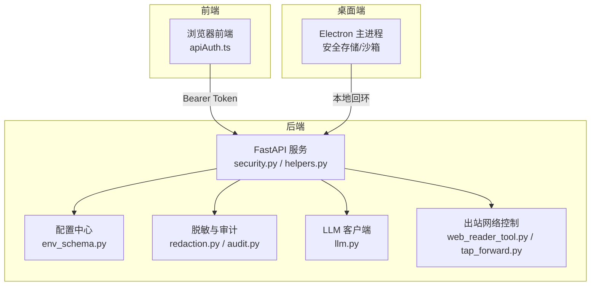
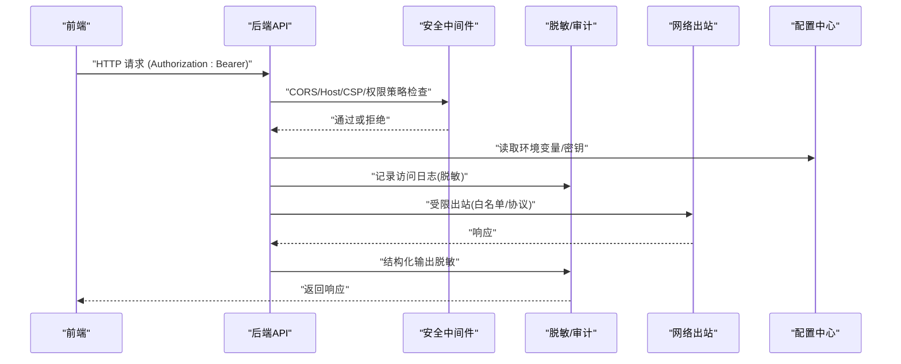
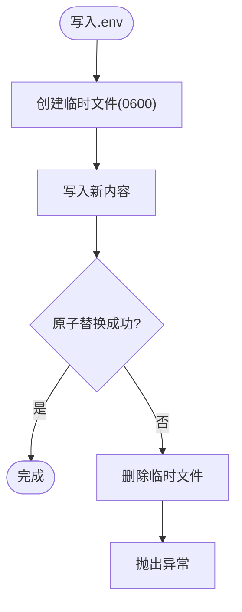
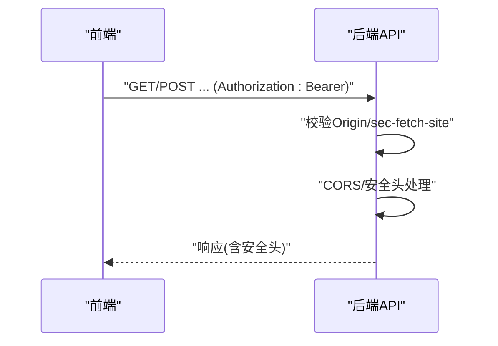
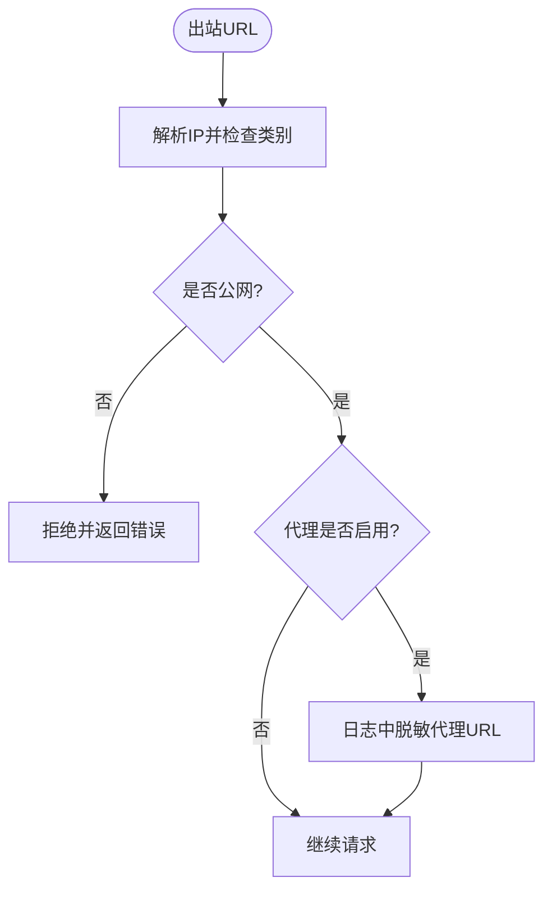
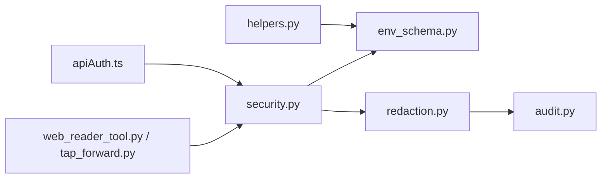

# 数据安全

<cite>
**本文引用的文件**
- [agent/src/api/security.py](file://agent/src/api/security.py)
- [agent/src/api/helpers.py](file://agent/src/api/helpers.py)
- [agent/src/config/env_schema.py](file://agent/src/config/env_schema.py)
- [agent/src/tools/redaction.py](file://agent/src/tools/redaction.py)
- [agent/src/live/audit.py](file://agent/src/live/audit.py)
- [agent/src/providers/llm.py](file://agent/src/providers/llm.py)
- [agent/src/trading/tap_forward.py](file://agent/src/trading/tap_forward.py)
- [agent/src/tools/web_reader_tool.py](file://agent/src/tools/web_reader_tool.py)
- [desktop/electron/THREAT_MODEL.md](file://desktop/electron/THREAT_MODEL.md)
- [SECURITY.md](file://SECURITY.md)
- [frontend/src/lib/apiAuth.ts](file://frontend/src/lib/apiAuth.ts)
- [tools/ci_env_var_gate.py](file://tools/ci_env_var_gate.py)
</cite>

## 目录
1. [简介](#简介)
2. [项目结构](#项目结构)
3. [核心组件](#核心组件)
4. [架构总览](#架构总览)
5. [详细组件分析](#详细组件分析)
6. [依赖关系分析](#依赖关系分析)
7. [性能与安全权衡](#性能与安全权衡)
8. [故障排查指南](#故障排查指南)
9. [结论](#结论)
10. [附录：安全配置与监控告警示例](#附录：安全配置与监控告警示例)

## 简介
本技术文档面向数据安全专家与合规人员，系统化梳理 Vibe-Trading 的数据安全策略与控制点，覆盖敏感信息保护、数据传输安全、数据存储安全、网络访问控制、数据泄露防护以及合规要求。文档基于代码库中的实际实现进行说明，并提供可操作的配置建议与监控告警思路，帮助在开发与生产环境中落地最小权限、纵深防御与可观测性原则。

## 项目结构
本项目围绕“后端 API + 桌面端 Electron + 前端 SPA”的架构组织安全能力：
- 后端 API（FastAPI）提供鉴权、CORS、安全响应头、日志脱敏、SSE 票据等能力。
- 桌面端 Electron 通过安全存储加密凭据，限制渲染进程能力，并仅向本地后端发起受控请求。
- 前端 SPA 使用本地存储管理 API 认证令牌，并通过统一方法注入 Authorization 头。
- 配置层集中管理环境变量与默认值，CI 工具强制仅允许特定路径读取环境变量，降低密钥泄漏面。
- 工具与运行时对输出进行结构化脱敏，确保审计、追踪与事件流不泄露敏感字段。

**图示来源**
- [agent/src/api/security.py:1-120](file://agent/src/api/security.py#L1-L120)
- [agent/src/api/helpers.py:73-124](file://agent/src/api/helpers.py#L73-L124)
- [agent/src/config/env_schema.py:1-120](file://agent/src/config/env_schema.py#L1-L120)
- [agent/src/tools/redaction.py:1-60](file://agent/src/tools/redaction.py#L1-L60)
- [agent/src/live/audit.py:243-271](file://agent/src/live/audit.py#L243-L271)
- [agent/src/providers/llm.py:935-1003](file://agent/src/providers/llm.py#L935-L1003)
- [agent/src/tools/web_reader_tool.py:42-79](file://agent/src/tools/web_reader_tool.py#L42-L79)
- [agent/src/trading/tap_forward.py:49-76](file://agent/src/trading/tap_forward.py#L49-L76)
- [frontend/src/lib/apiAuth.ts:1-21](file://frontend/src/lib/apiAuth.ts#L1-L21)

**章节来源**
- [agent/src/api/security.py:1-120](file://agent/src/api/security.py#L1-L120)
- [agent/src/api/helpers.py:73-124](file://agent/src/api/helpers.py#L73-L124)
- [agent/src/config/env_schema.py:1-120](file://agent/src/config/env_schema.py#L1-L120)
- [frontend/src/lib/apiAuth.ts:1-21](file://frontend/src/lib/apiAuth.ts#L1-L21)

## 核心组件
- 身份认证与会话：
  - 共享密钥（API Key）优先校验；未配置时允许本地回环开发模式。
  - SSE 短票机制避免长生命周期密钥进入 URL 与日志。
- 网络安全：
  - CORS 白名单严格化，禁止带凭证的 wildcard。
  - 安全响应头（CSP、X-Frame-Options、Permissions-Policy、Referrer-Policy）。
  - DNS 重绑定防护与 Host 头校验。
- 敏感数据处理：
  - .env 原子写入与 0600 权限控制。
  - 结构化载荷递归脱敏（参数与结果双通道）。
  - 访问日志中查询参数脱敏。
- 网络访问控制：
  - Web 读取器仅允许公网目标，拒绝私有/回环/保留地址。
  - TAP 转发对 poll_url 做协议与域名白名单校验。
- 配置与合规：
  - 环境变量集中 schema 定义与类型校验。
  - CI 门禁限制任意 os.environ 读取，仅允许配置模块读取。
  - 桌面端凭据加密存储与迁移策略。

**章节来源**
- [agent/src/api/security.py:166-253](file://agent/src/api/security.py#L166-L253)
- [agent/src/api/security.py:300-341](file://agent/src/api/security.py#L300-L341)
- [agent/src/api/security.py:463-519](file://agent/src/api/security.py#L463-L519)
- [agent/src/api/helpers.py:73-124](file://agent/src/api/helpers.py#L73-L124)
- [agent/src/tools/redaction.py:1-60](file://agent/src/tools/redaction.py#L1-L60)
- [agent/src/tools/web_reader_tool.py:42-79](file://agent/src/tools/web_reader_tool.py#L42-L79)
- [agent/src/trading/tap_forward.py:49-76](file://agent/src/trading/tap_forward.py#L49-L76)
- [tools/ci_env_var_gate.py:51-90](file://tools/ci_env_var_gate.py#L51-L90)
- [desktop/electron/THREAT_MODEL.md:60-88](file://desktop/electron/THREAT_MODEL.md#L60-L88)

## 架构总览
下图展示关键安全流程：前端携带 Bearer 调用后端，后端执行跨域与主机校验、鉴权、安全头注入与日志脱敏；SSE 使用一次性票据；工具输出经脱敏后进入审计与追踪；网络出站受白名单与协议约束；配置与凭据通过集中 schema 与原子写入保障安全。

**图示来源**
- [agent/src/api/security.py:166-253](file://agent/src/api/security.py#L166-L253)
- [agent/src/api/security.py:300-341](file://agent/src/api/security.py#L300-L341)
- [agent/src/tools/redaction.py:1-60](file://agent/src/tools/redaction.py#L1-L60)
- [agent/src/tools/web_reader_tool.py:42-79](file://agent/src/tools/web_reader_tool.py#L42-L79)
- [agent/src/config/env_schema.py:1-120](file://agent/src/config/env_schema.py#L1-L120)

## 详细组件分析

### 敏感信息保护机制
- API 密钥与环境变量管理
  - 共享密钥优先：当配置了 API 密钥时，所有请求（包括本地回环）必须携带有效密钥；否则仅允许本地回环开发模式。
  - 环境变量集中 schema：所有环境变量的键名、类型、默认值集中在 env_schema 中，避免散落的 os.getenv 调用。
  - CI 门禁：仅允许 agent/src/config/ 下的模块读取环境变量，其他位置直接读取将被阻断。
  - 桌面端凭据：Electron 主进程通过安全存储加密保存凭据，仅注入到子进程环境，不在日志或渲染存储中持久化明文。
- 日志脱敏
  - 访问日志中针对 api_key= 与 ticket= 等查询参数值进行脱敏替换，防止密钥落入访问日志。
  - 结构化载荷递归脱敏：对工具调用参数与结果进行敏感键识别与替换，确保审计与追踪不泄露敏感信息。
- 原子写入与权限控制
  - .env 文件采用临时文件 + 原子替换写入，失败时清理临时文件，避免半写状态；文件权限设置为 0600（所有者读写），目录权限 0700。

**图示来源**
- [agent/src/api/helpers.py:73-124](file://agent/src/api/helpers.py#L73-L124)

**章节来源**
- [agent/src/api/security.py:463-519](file://agent/src/api/security.py#L463-L519)
- [agent/src/config/env_schema.py:1-120](file://agent/src/config/env_schema.py#L1-L120)
- [tools/ci_env_var_gate.py:51-90](file://tools/ci_env_var_gate.py#L51-L90)
- [desktop/electron/THREAT_MODEL.md:163-179](file://desktop/electron/THREAT_MODEL.md#L163-L179)
- [agent/src/api/security.py:257-297](file://agent/src/api/security.py#L257-L297)
- [agent/src/tools/redaction.py:1-60](file://agent/src/tools/redaction.py#L1-L60)
- [agent/src/api/helpers.py:73-124](file://agent/src/api/helpers.py#L73-L124)

### 数据传输安全
- HTTPS 与 TLS 终止
  - 应用内不强制设置 HSTS，建议在反向代理/入口层终止 TLS 并设置 HSTS。
  - 安全响应头包含 CSP、X-Frame-Options、Permissions-Policy、Referrer-Policy，减少 XSS、点击劫持与不必要的能力暴露。
- 跨域与同源策略
  - CORS 白名单默认仅信任本地回环；禁止带凭证的 wildcard；支持额外可信源追加但需显式配置。
  - 拒绝跨站浏览器请求，结合 Origin 与 sec-fetch-site 头进行校验。
- 前端认证头注入
  - 前端通过统一方法从本地存储获取 API 认证密钥并注入 Authorization 头，空值时不发送。

**图示来源**
- [agent/src/api/security.py:166-253](file://agent/src/api/security.py#L166-L253)
- [agent/src/api/security.py:383-431](file://agent/src/api/security.py#L383-L431)
- [frontend/src/lib/apiAuth.ts:1-21](file://frontend/src/lib/apiAuth.ts#L1-L21)

**章节来源**
- [agent/src/api/security.py:166-253](file://agent/src/api/security.py#L166-L253)
- [agent/src/api/security.py:383-431](file://agent/src/api/security.py#L383-L431)
- [frontend/src/lib/apiAuth.ts:1-21](file://frontend/src/lib/apiAuth.ts#L1-L21)

### 数据存储安全
- 配置文件与凭据
  - .env 文件原子写入与 0600 权限，目录 0700，避免并发写入与越权访问。
  - 桌面端凭据通过安全存储加密保存，仅注入到子进程环境，不在日志或渲染存储中持久化明文。
- 审计与追踪
  - 实时操作审计记录先脱敏再写入，目录权限 0700，append-only 且 fsync，保证并发安全与持久化。
- 数据库与备份
  - 仓库未包含数据库连接与备份逻辑；若引入外部数据库，应遵循最小权限、传输加密（TLS）、静态加密与定期备份策略。

**章节来源**
- [agent/src/api/helpers.py:73-124](file://agent/src/api/helpers.py#L73-L124)
- [desktop/electron/THREAT_MODEL.md:163-179](file://desktop/electron/THREAT_MODEL.md#L163-L179)
- [agent/src/live/audit.py:243-271](file://agent/src/live/audit.py#L243-L271)

### 网络访问控制
- URL 白名单与域名过滤
  - Web 读取器仅允许公网目标，拒绝私有、回环、链路本地、多播、保留与未指定地址。
  - TAP 转发对 poll_url 进行协议与域名白名单校验，拒绝绝对 URL 与协议相对 URL 绕过。
- 代理配置
  - 支持禁用 HTTP 代理的环境变量；代理 URL 在日志中进行脱敏显示。
- 远程工具与服务发现
  - MCP 工具注册按工作器白名单装配，仅暴露允许的远程工具；不可达服务器不会阻塞本地工具。

**图示来源**
- [agent/src/tools/web_reader_tool.py:42-79](file://agent/src/tools/web_reader_tool.py#L42-L79)
- [agent/src/trading/tap_forward.py:49-76](file://agent/src/trading/tap_forward.py#L49-L76)
- [agent/src/providers/llm.py:976-982](file://agent/src/providers/llm.py#L976-L982)

**章节来源**
- [agent/src/tools/web_reader_tool.py:42-79](file://agent/src/tools/web_reader_tool.py#L42-L79)
- [agent/src/trading/tap_forward.py:49-76](file://agent/src/trading/tap_forward.py#L49-L76)
- [agent/src/providers/llm.py:976-982](file://agent/src/providers/llm.py#L976-L982)

### 数据泄露防护措施与合规要求
- 脱敏与最小可见性
  - 结构化载荷递归脱敏，敏感键（如 api_key、token、账号号段、PII）被替换为占位符。
  - 访问日志中查询参数值脱敏，避免密钥进入日志。
- 合规与披露
  - 漏洞报告渠道与范围明确；生成策略代码视为本地代码运行，需审阅后再执行。
  - 官方渠道与防钓鱼提示，避免社会工程攻击。
- 桌面端安全模式
  - 安全模式下阻止设置 API 将注入的凭据复制回 dotenv，防止明文落盘。

**章节来源**
- [agent/src/tools/redaction.py:1-60](file://agent/src/tools/redaction.py#L1-L60)
- [agent/src/api/security.py:257-297](file://agent/src/api/security.py#L257-L297)
- [SECURITY.md:23-48](file://SECURITY.md#L23-L48)
- [desktop/electron/THREAT_MODEL.md:163-179](file://desktop/electron/THREAT_MODEL.md#L163-L179)

## 依赖关系分析
- 安全中间件依赖配置中心读取 API Key、CORS 与额外可信源。
- 脱敏模块被审计与工具链复用，确保一致的安全输出。
- 网络出站控制由工具层实现，避免全局代理或开放出站。
- 前端认证头注入依赖本地存储，需配合后端鉴权策略。

**图示来源**
- [agent/src/api/security.py:1-120](file://agent/src/api/security.py#L1-L120)
- [agent/src/tools/redaction.py:1-60](file://agent/src/tools/redaction.py#L1-L60)
- [agent/src/live/audit.py:243-271](file://agent/src/live/audit.py#L243-L271)
- [agent/src/api/helpers.py:73-124](file://agent/src/api/helpers.py#L73-L124)
- [agent/src/tools/web_reader_tool.py:42-79](file://agent/src/tools/web_reader_tool.py#L42-L79)
- [agent/src/trading/tap_forward.py:49-76](file://agent/src/trading/tap_forward.py#L49-L76)
- [frontend/src/lib/apiAuth.ts:1-21](file://frontend/src/lib/apiAuth.ts#L1-L21)

**章节来源**
- [agent/src/api/security.py:1-120](file://agent/src/api/security.py#L1-L120)
- [agent/src/tools/redaction.py:1-60](file://agent/src/tools/redaction.py#L1-L60)
- [agent/src/live/audit.py:243-271](file://agent/src/live/audit.py#L243-L271)
- [agent/src/api/helpers.py:73-124](file://agent/src/api/helpers.py#L73-L124)
- [agent/src/tools/web_reader_tool.py:42-79](file://agent/src/tools/web_reader_tool.py#L42-L79)
- [agent/src/trading/tap_forward.py:49-76](file://agent/src/trading/tap_forward.py#L49-L76)
- [frontend/src/lib/apiAuth.ts:1-21](file://frontend/src/lib/apiAuth.ts#L1-L21)

## 性能与安全权衡
- 日志脱敏增加少量字符串处理开销，但显著降低密钥泄漏风险。
- 原子写入与权限控制在高并发场景下仍保持强一致性，避免竞争条件。
- CORS 与 CSP 严格化可能影响第三方资源加载，需在部署层按需放宽并最小化信任面。
- 网络出站白名单与代理脱敏不影响正常业务流量，仅在边界处进行校验与日志处理。

[本节为通用指导，无需具体文件引用]

## 故障排查指南
- 无法访问设置接口
  - 检查是否配置了 API 密钥；未配置时仅允许本地回环访问。
  - 确认请求来源是否为本地回环或携带有效 Bearer。
- 日志中出现密钥
  - 检查是否使用了非受控的日志记录方式；应使用已安装脱敏过滤器的访问日志。
- 出站请求被拒绝
  - 检查目标 URL 是否为公网地址；避免私有/回环/保留地址。
  - 检查代理配置是否启用，并在日志中确认代理 URL 已脱敏。
- 桌面端凭据问题
  - 确认 Electron 安全存储可用；检查迁移过程是否移除明文字段。

**章节来源**
- [agent/src/api/security.py:463-519](file://agent/src/api/security.py#L463-L519)
- [agent/src/api/security.py:257-297](file://agent/src/api/security.py#L257-L297)
- [agent/src/tools/web_reader_tool.py:42-79](file://agent/src/tools/web_reader_tool.py#L42-L79)
- [desktop/electron/THREAT_MODEL.md:163-179](file://desktop/electron/THREAT_MODEL.md#L163-L179)

## 结论
Vibe-Trading 在敏感信息保护、数据传输安全、数据存储安全、网络访问控制与数据泄露防护方面具备多层次控制点。通过集中化的配置管理、严格的鉴权与跨域策略、原子写入与权限控制、结构化脱敏与审计、以及桌面端安全存储，系统实现了最小权限与纵深防御。建议在部署层强化 TLS 终止与 HSTS，持续监控安全头与日志脱敏效果，并定期审查网络白名单与工具白名单，确保合规与安全性随演进持续提升。

[本节为总结，无需具体文件引用]

## 附录：安全配置与监控告警示例
- 环境变量与密钥
  - 设置 API 密钥以启用共享密钥鉴权；在生产环境务必配置。
  - 使用 env_schema 定义的键名管理数据源与 LLM 提供商密钥。
- CORS 与 CSP
  - 配置可信源列表，避免 wildcard；必要时通过额外可信源追加。
  - 在反向代理层设置 HSTS；应用内保持严格 CSP。
- 日志与审计
  - 启用访问日志脱敏过滤器；确保审计记录先脱敏后写入。
- 网络出站
  - 仅允许必要公网目标；禁用不必要的代理；在日志中脱敏代理 URL。
- 桌面端
  - 使用安全存储保存凭据；确保迁移完成后移除明文字段。
- 监控告警
  - 对 401/403 错误率上升告警；对 CORS/CSP 相关错误告警；对出站请求被拒告警；对 .env 写入失败告警。

**章节来源**
- [agent/src/api/security.py:166-253](file://agent/src/api/security.py#L166-L253)
- [agent/src/api/security.py:463-519](file://agent/src/api/security.py#L463-L519)
- [agent/src/config/env_schema.py:1-120](file://agent/src/config/env_schema.py#L1-L120)
- [agent/src/tools/redaction.py:1-60](file://agent/src/tools/redaction.py#L1-L60)
- [agent/src/live/audit.py:243-271](file://agent/src/live/audit.py#L243-L271)
- [agent/src/tools/web_reader_tool.py:42-79](file://agent/src/tools/web_reader_tool.py#L42-L79)
- [agent/src/providers/llm.py:976-982](file://agent/src/providers/llm.py#L976-L982)
- [desktop/electron/THREAT_MODEL.md:163-179](file://desktop/electron/THREAT_MODEL.md#L163-L179)