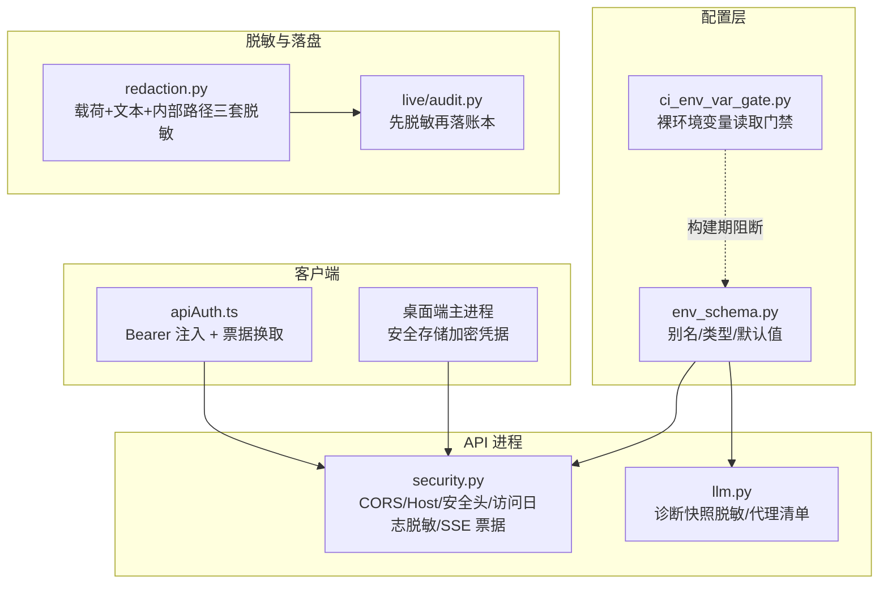
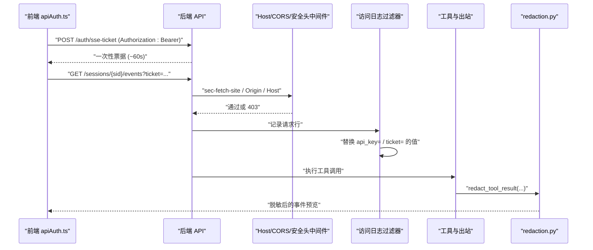
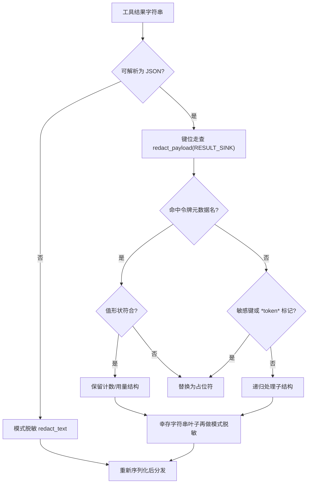
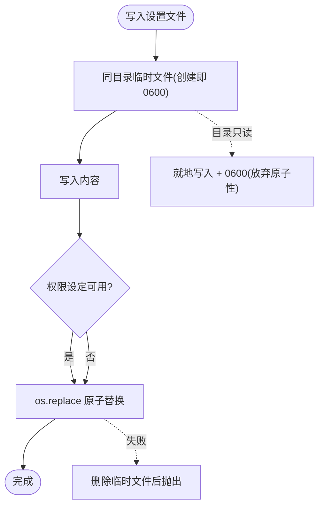
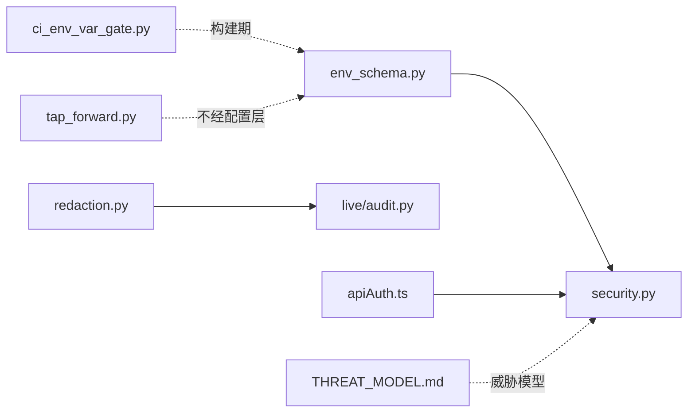

# 数据安全

<cite>
**本文引用的文件**
- [SECURITY.md](file://SECURITY.md)
- [agent/src/api/helpers.py](file://agent/src/api/helpers.py)
- [agent/src/api/security.py](file://agent/src/api/security.py)
- [agent/src/config/env_schema.py](file://agent/src/config/env_schema.py)
- [agent/src/live/audit.py](file://agent/src/live/audit.py)
- [agent/src/providers/llm.py](file://agent/src/providers/llm.py)
- [agent/src/tools/redaction.py](file://agent/src/tools/redaction.py)
- [agent/src/tools/web_reader_tool.py](file://agent/src/tools/web_reader_tool.py)
- [agent/src/trading/tap_forward.py](file://agent/src/trading/tap_forward.py)
- [desktop/electron/THREAT_MODEL.md](file://desktop/electron/THREAT_MODEL.md)
- [frontend/src/lib/apiAuth.ts](file://frontend/src/lib/apiAuth.ts)
- [tools/ci_env_var_gate.py](file://tools/ci_env_var_gate.py)
</cite>

## 目录
1. [简介](#简介)
2. [项目结构](#项目结构)
3. [核心组件](#核心组件)
4. [架构总览](#架构总览)
5. [详细组件分析](#详细组件分析)
6. [依赖关系分析](#依赖关系分析)
7. [残余风险与权衡](#残余风险与权衡)
8. [故障排查指南](#故障排查指南)
9. [结论](#结论)
10. [附录：配置面与核对清单](#附录配置面与核对清单)

## 简介
本页只管「数据会不会漏」，不管「谁能进来」——后者的主体判定见认证与授权页。仓库里的敏感面有三类：
- **凭据**：共享 API 密钥、模型服务与数据源密钥、券商侧交易凭据。
- **用户与业务数据**：账户号段、身份信息、工具读到的正文、生成的文档内容。
- **内部拓扑**：家目录、工作目录、运行时根、依赖安装位置——用于错误可诊断，但不该外显。

对应的控制点分布在六个面上：配置面（集中声明 + CI 拦下配置层之外的裸读，带豁免标记即放行）、落盘面（私有权限位，设置文件另走原子替换）、日志与诊断面（查询参数、环境变量存在性、基址与代理标签脱敏）、载荷面（结构化键位走查 + 自由文本模式脱敏）、传输面（回环约束、CORS、安全响应头、一次性 SSE 票据）、出站面（读取工具对显式内部地址的拒绝、凭据隔离代理的审批地址构造）。

## 项目结构
安全能力按「配置层 → API 进程 → 脱敏与落盘 → 客户端」四层组织，桌面端与前端各带一条独立的凭据链路。箭头只标注本页证据面内可证的依赖，同一子图内是并列关系；设置文件 helper 与两个出站模块在本页白名单内画不出可证的边，因此不在这张图上出现，它们的机制见下文各节。

**图示来源**
- [agent/src/api/security.py:26-59](file://agent/src/api/security.py#L26-L59)
- [agent/src/config/env_schema.py:1-18](file://agent/src/config/env_schema.py#L1-L18)
- [agent/src/tools/redaction.py:1-33](file://agent/src/tools/redaction.py#L1-L33)
- [agent/src/live/audit.py:301-318](file://agent/src/live/audit.py#L301-L318)
- [agent/src/providers/llm.py:1516-1540](file://agent/src/providers/llm.py#L1516-L1540)
- [desktop/electron/THREAT_MODEL.md:31-58](file://desktop/electron/THREAT_MODEL.md#L31-L58)
- [frontend/src/lib/apiAuth.ts:1-21](file://frontend/src/lib/apiAuth.ts#L1-L21)
- [tools/ci_env_var_gate.py:42-60](file://tools/ci_env_var_gate.py#L42-L60)

**章节来源**
- [agent/src/api/security.py:26-59](file://agent/src/api/security.py#L26-L59)
- [agent/src/config/env_schema.py:1-18](file://agent/src/config/env_schema.py#L1-L18)
- [tools/ci_env_var_gate.py:42-60](file://tools/ci_env_var_gate.py#L42-L60)
- [frontend/src/lib/apiAuth.ts:1-21](file://frontend/src/lib/apiAuth.ts#L1-L21)
- [desktop/electron/THREAT_MODEL.md:31-58](file://desktop/electron/THREAT_MODEL.md#L31-L58)

## 核心组件
- **脱敏层** `redaction.py`：三套互相独立的机制——内部根路径替换、结构化载荷的键位走查、自由文本的模式替换；并按「流向哪个 sink」分级。
- **配置层** `env_schema.py`：声明 `EnvConfig` 所覆盖键名的别名、类型与默认值；数值型环境变量解析失败时落回默认值而不是抛错。少数引导期／动态键不在声明面内，由消费方带行内豁免标记裸读，配置层不是全集。
- **读取门禁** `ci_env_var_gate.py`：AST 扫描 `agent/src`、`agent/backtest`、`agent/cli`、`agent/scripts` 与两个服务入口，配置层之外直接读环境变量即判失败，带豁免标记的行放行。
- **API 中间件** `security.py`：DNS 重绑定 Host 校验、CSP 等安全响应头、跨站请求拒绝、访问日志查询参数脱敏、SSE 一次性票据。
- **落盘helper** `helpers.py`：dotenv 的原子替换写入、0600 文件权限与 0700 目录权限、换行注入拒绝。
- **诊断层** `llm.py`：provider 诊断快照只输出「是否设置 / 长度 / 是否 ASCII」，基址与代理地址只保留协议 + 主机 + 端口（代理地址与默认基址走同一个折叠函数），配置文件路径折叠为符号槽位标签。
- **审计层** `live/audit.py`：实时动作记录在任何写入或广播之前先整体脱敏，账本目录 0700、追加写并 fsync。
- **出站层** `web_reader_tool.py` / `tap_forward.py`：前者只接受 http/https、无内联凭据、且不是显式写出的内部地址的目标（非 IP 主机名交给解析层判定），后者把券商凭据写成占位符外发、真实券商密钥由隔离代理在服务端替换（本进程只持有一把按策略收窄的接入密钥），审批轮询地址只由已配置基址拼出。

**章节来源**
- [agent/src/tools/redaction.py:1-33](file://agent/src/tools/redaction.py#L1-L33)
- [agent/src/config/env_schema.py:104-147](file://agent/src/config/env_schema.py#L104-L147)
- [agent/src/config/env_schema.py:1-18](file://agent/src/config/env_schema.py#L1-L18)
- [tools/ci_env_var_gate.py:118-191](file://tools/ci_env_var_gate.py#L118-L191)
- [agent/src/api/security.py:161-173](file://agent/src/api/security.py#L161-L173)
- [agent/src/api/security.py:256-296](file://agent/src/api/security.py#L256-L296)
- [agent/src/api/helpers.py:73-133](file://agent/src/api/helpers.py#L73-L133)
- [agent/src/providers/llm.py:843-882](file://agent/src/providers/llm.py#L843-L882)
- [agent/src/providers/llm.py:885-932](file://agent/src/providers/llm.py#L885-L932)
- [agent/src/providers/llm.py:976-982](file://agent/src/providers/llm.py#L976-L982)
- [agent/src/live/audit.py:217-245](file://agent/src/live/audit.py#L217-L245)
- [agent/src/tools/web_reader_tool.py:24-58](file://agent/src/tools/web_reader_tool.py#L24-L58)
- [agent/src/trading/tap_forward.py:1-22](file://agent/src/trading/tap_forward.py#L1-L22)
- [agent/src/trading/tap_forward.py:79-102](file://agent/src/trading/tap_forward.py#L79-L102)
- [agent/src/trading/tap_forward.py:116-143](file://agent/src/trading/tap_forward.py#L116-L143)
- [agent/src/trading/tap_forward.py:152-167](file://agent/src/trading/tap_forward.py#L152-L167)

## 架构总览
一次带流的浏览器请求会经过四道与数据保护有关的关卡：Origin/Host 校验、密钥或票据校验、访问日志脱敏、工具结果脱敏。

**图示来源**
- [agent/src/api/security.py:299-341](file://agent/src/api/security.py#L299-L341)
- [agent/src/api/security.py:423-431](file://agent/src/api/security.py#L423-L431)
- [agent/src/api/security.py:591-622](file://agent/src/api/security.py#L591-L622)
- [agent/src/api/security.py:272-296](file://agent/src/api/security.py#L272-L296)
- [agent/src/tools/redaction.py:514-548](file://agent/src/tools/redaction.py#L514-L548)
- [frontend/src/lib/apiAuth.ts:23-53](file://frontend/src/lib/apiAuth.ts#L23-L53)

## 详细组件分析

### 敏感信息保护机制
- **凭据解析集中在配置层**：API 侧只经配置访问器取共享密钥，并额外保留一个「宿主模块同名变量」的回退位，使两种部署方式解析出同一把密钥；旧键名到当前键名的合并由配置根模型的校验器完成，因此不存在「CLI 读到、服务端读不到」的分叉。
- **环境变量读取的构建期门禁**：`agent/src/config/` 之外的裸读一律判失败；`copy()` / `items()` / `setdefault()` 与写入型下标不算读；`pop()` 只在设置路由与配置层被容忍，其它位置仅告警。门禁只匹配行内 `# noqa: env-gate` 标记这一子串、不校验理由，带标记即放行：仓库多数豁免在标记后附了一句理由，仍有至少 7 处只有标记本身。
- **诊断输出不回显值**：环境变量只报「set / unset」，HTTP 头值只报「是否设置 / 长度 / 是否纯 ASCII」，基址只保留协议 + 主机 + 端口，代理变量中的排除清单只报「set」。凭据若含非 ASCII 或控制字符，直接拒绝构建请求头，错误信息里点名的是来源变量名而不是值。
- **配置文件位置不外泄**：`.env` 候选顺序固定，解析日志只打印符号槽位标签；接口返回给前端的设置路径也折叠成项目相对形式，避免暴露绝对路径与用户名。
- **内部拓扑脱敏**：把家目录、当前工作目录、运行时根、依赖安装目录等前缀替换为哨兵，并保留相对尾巴；替换只在真正的路径边界处生效，因此不会把同前缀的兄弟目录一起打掉。根前缀表按当前工作目录做缓存，`chdir` 之后不会停止脱敏。
- **值形状的例外要显式给**：令牌元数据类字段名（预算、用量、公开整型标识）只有在值满足预期形状时才放行——计数必须是非负整数、用量必须是映射且映射内仍递归脱敏、公开标识必须是长度受限的十进制串；拿不到值或形状不符即回到严格集。

**图示来源**
- [agent/src/tools/redaction.py:514-548](file://agent/src/tools/redaction.py#L514-L548)
- [agent/src/tools/redaction.py:330-375](file://agent/src/tools/redaction.py#L330-L375)
- [agent/src/tools/redaction.py:304-327](file://agent/src/tools/redaction.py#L304-L327)

**章节来源**
- [agent/src/api/security.py:343-366](file://agent/src/api/security.py#L343-L366)
- [agent/src/config/env_schema.py:705-716](file://agent/src/config/env_schema.py#L705-L716)
- [tools/ci_env_var_gate.py:42-60](file://tools/ci_env_var_gate.py#L42-L60)
- [tools/ci_env_var_gate.py:92-96](file://tools/ci_env_var_gate.py#L92-L96)
- [agent/src/trading/tap_forward.py:79-102](file://agent/src/trading/tap_forward.py#L79-L102)
- [agent/src/providers/llm.py:920-932](file://agent/src/providers/llm.py#L920-L932)
- [agent/src/providers/llm.py:935-982](file://agent/src/providers/llm.py#L935-L982)
- [agent/src/providers/llm.py:843-882](file://agent/src/providers/llm.py#L843-L882)
- [agent/src/api/helpers.py:183-205](file://agent/src/api/helpers.py#L183-L205)
- [agent/src/tools/redaction.py:163-262](file://agent/src/tools/redaction.py#L163-L262)
- [agent/src/tools/redaction.py:117-128](file://agent/src/tools/redaction.py#L117-L128)

### 日志与诊断输出
- **访问日志只替换值**：请求行里 `api_key=` 与 `ticket=` 的取值被换成固定占位符，参数名保留以便定位；过滤器挂在服务框架的访问/错误日志器上，且重复启动不会叠加。
- **诊断快照是白名单式的**：provider 诊断把凭据字段呈现为「变量名 → set/unset」的映射，并把代理清单逐个折叠，快照里默认不出现任何凭据值。
- **一次性的解析日志**：首次加载配置时打印一条「来自哪个槽位 / provider / model / 基址」的日志，路径与基址均已折叠，密钥不出现。
- **远端错误正文有限外显**：读取工具把上游响应体前若干字符带进错误信息，这段文本随后仍要经载荷脱敏，因此模式脱敏是这条链路的兜底而非唯一防线。

**章节来源**
- [agent/src/api/security.py:256-296](file://agent/src/api/security.py#L256-L296)
- [agent/src/providers/llm.py:1516-1606](file://agent/src/providers/llm.py#L1516-L1606)
- [agent/src/providers/llm.py:885-909](file://agent/src/providers/llm.py#L885-L909)
- [agent/src/providers/llm.py:1366-1392](file://agent/src/providers/llm.py#L1366-L1392)
- [agent/src/tools/web_reader_tool.py:95-100](file://agent/src/tools/web_reader_tool.py#L95-L100)
- [agent/src/tools/redaction.py:484-511](file://agent/src/tools/redaction.py#L484-L511)

### 数据存储安全
- **dotenv 落盘**：主路径用同目录临时文件 + 原子替换，临时文件由创建即带 0600；替换失败时清理临时文件后再抛出，避免留下持有密钥的残片。父目录只读时退化为就地写入并仍强制 0600——该分支牺牲原子性换取可用性。平台不支持权限设定时按尽力而为处理。
- **目录与文件权限**：设置文件所在目录以 0700 创建；写入前保证 dotenv 自身带注释头且权限私有。
- **写回不破坏可审计性**：更新保留原有注释与顺序，同一键的最后一条生效行被就地改写；带空白或注释符的值统一加引号；含换行的值直接判 400，防止一次设置写入伪造新的键值。
- **实时动作账本**：记录在写入或广播之前已完成整体脱敏；账本目录 0700，单行 JSON 追加打开，落盘后 flush 并 fsync；fsync 失败只降级为 flush 并告警一次，调用方显式要求持久性时才抛错。链式账本写入失败被记为错误并吞掉——合规记录已在经典账本落盘，缺失的只是该条的防篡改证据，而这个缺口后续可被链校验发现。
- **桌面端凭据**：凭据值只经系统级安全存储加解密，磁盘上保存的是 Base64 密文与已配置名称清单，写入同样是同目录临时文件加改名；一次性迁移在密文存储持久化之后删除明文字段；解密值只注入被拥有的后端子进程环境。

**图示来源**
- [agent/src/api/helpers.py:73-133](file://agent/src/api/helpers.py#L73-L133)

**章节来源**
- [agent/src/api/helpers.py:73-133](file://agent/src/api/helpers.py#L73-L133)
- [agent/src/api/helpers.py:193-234](file://agent/src/api/helpers.py#L193-L234)
- [agent/src/live/audit.py:80-96](file://agent/src/live/audit.py#L80-L96)
- [agent/src/live/audit.py:217-245](file://agent/src/live/audit.py#L217-L245)
- [desktop/electron/THREAT_MODEL.md:163-179](file://desktop/electron/THREAT_MODEL.md#L163-L179)

### 数据传输与访问边界
- **默认只信任回环**：CORS 默认清单只有本地回环上的若干端口；带凭据的通配符配置直接判运行时错误——追加清单同样禁止通配符。追加项是「加法式」的，与替换默认清单的旧键不同，因此信任一个新来源不会顺手丢掉内置界面。
- **追加清单的解析时机**：它在服务入口构造中间件时读取，早于 dotenv 预检，因此只写在设置文件里的值会读得太晚，必须作为真实进程环境变量提供。
- **DNS 重绑定防护**：客户端来自回环时，Host 头必须落在内置回环名或显式追加的可信主机名内，否则在鉴权旁路生效之前就返回 403。
- **安全响应头**：默认 CSP 只放行同源脚本、样式与连接（样式允许内联、图片与字体允许 data），只有 `/docs` 与 `/redoc` 这两条路由享有单独的**放宽**策略——在默认集合之外追加内联脚本样式与一个外部 CDN，以此避免全局放宽；另有一个开关可把 CSP 改为仅报告模式，作为异常部署的回退位。同时统一附加内容嗅探拒绝、禁止被嵌套、能力清单全拒与引用来源收窄。严格传输安全头刻意不在应用内设置，交由终止 TLS 的入口层负责。
- **跨站浏览器请求拒绝**：非安全方法一律先查 `sec-fetch-site`，跨站即 403；带 Origin 时要求其为回环界面或与请求主机同源。设置写入与本地关机控制额外禁止凭据出现在查询串中，凭据比较使用定长时间算法。
- **流式连接用一次性票据**：浏览器的事件流无法携带认证头，因此先用头部认证换取约 60 秒有效的单次票据；票据在第一次查表时即被移除，过期与重放同等失败。长生命周期密钥从不接受查询串形式，避免进入浏览历史、代理与访问日志以及引用头。
- **共享密钥优先于回环信任**：只要配置了密钥，回环客户端同样必须给出有效凭据；只有未配置时才退回回环开发信任。两条路径都只证明「持有」而非「身份」，返回主体带有不可归因标记，需要具名操作者的调用方必须据此拒绝。
- **前端注入方式**：前端从本地存储读取密钥并统一生成 `Authorization` 头，空值时不发送任何头；每次建立事件流都重新换取票据，而不是复用缓存值。

**章节来源**
- [agent/src/api/security.py:26-59](file://agent/src/api/security.py#L26-L59)
- [agent/src/api/security.py:69-103](file://agent/src/api/security.py#L69-L103)
- [agent/src/api/security.py:147-173](file://agent/src/api/security.py#L147-L173)
- [agent/src/api/security.py:180-253](file://agent/src/api/security.py#L180-L253)
- [agent/src/api/security.py:400-451](file://agent/src/api/security.py#L400-L451)
- [agent/src/api/security.py:454-504](file://agent/src/api/security.py#L454-L504)
- [agent/src/api/security.py:591-622](file://agent/src/api/security.py#L591-L622)
- [agent/src/api/security.py:625-659](file://agent/src/api/security.py#L625-L659)
- [agent/src/config/env_schema.py:326-375](file://agent/src/config/env_schema.py#L326-L375)
- [frontend/src/lib/apiAuth.ts:1-21](file://frontend/src/lib/apiAuth.ts#L1-L21)
- [frontend/src/lib/apiAuth.ts:23-53](file://frontend/src/lib/apiAuth.ts#L23-L53)

### 出站与网络访问控制
- **网页读取工具**：目标必须使用 http/https、带主机名且不含用户信息；本地主机名及其后缀域名、私有/回环/链路本地/多播/保留/未指定以及非全球可路由地址一律拒绝。非 IP 主机名交给解析层，因此这是「不允许显式写内部地址」的约束，不等于对 DNS 解析结果的完全等价校验。整段目标 URL 会被拼到远端读取服务前缀之后发出，故凭据绝不应出现在被读取的 URL 里；正文按上限截断并附带内容风险标记。
- **重复读取的外发抑制**：`no_cache` 只在上一次读取明确报告为缓存快照、或任务确实需要更新数据时使用；该工具声明 `replay_after_compaction = True`，配套注释称若压缩移除了一次精确成功的读取，运行期可能改由运行期结果恢复而不再打远端读取服务与源站——正常的重复读取仍然允许，抑制行为本身在本页证据面之外。
- **凭据隔离代理**：配置后券商请求改发往代理的转发端点，真实密钥驻留在代理侧，本进程只持有策略范围内的代理密钥，请求头里携带的是凭据占位符。环境补齐只搬运该代理专用的键，并且绝不覆盖真实进程变量，密钥值不入日志。
- **审批地址只能由配置拼出**：轮询地址优先用交易号拼在已配置基址上；只有当响应给出的路径是「单个斜杠开头」时才拼接，协议相对形式被拒——否则被篡改的响应可以把代理密钥引到攻击者主机。任何审批或上游异常都以结构化结果返回而不抛异常，未配置即为失败关闭。
- **回环信任的显式扩展**：容器场景可以把「默认网关地址」当作可信回环，但必须由开关显式开启，且网关集合从系统路由表读取；服务端 shell 工具默认关闭。

**章节来源**
- [agent/src/tools/web_reader_tool.py:18-21](file://agent/src/tools/web_reader_tool.py#L18-L21)
- [agent/src/tools/web_reader_tool.py:24-58](file://agent/src/tools/web_reader_tool.py#L24-L58)
- [agent/src/tools/web_reader_tool.py:61-79](file://agent/src/tools/web_reader_tool.py#L61-L79)
- [agent/src/tools/web_reader_tool.py:109-121](file://agent/src/tools/web_reader_tool.py#L109-L121)
- [agent/src/tools/web_reader_tool.py:139-161](file://agent/src/tools/web_reader_tool.py#L139-L161)
- [agent/src/trading/tap_forward.py:1-22](file://agent/src/trading/tap_forward.py#L1-L22)
- [agent/src/trading/tap_forward.py:49-102](file://agent/src/trading/tap_forward.py#L49-L102)
- [agent/src/trading/tap_forward.py:128-167](file://agent/src/trading/tap_forward.py#L128-L167)
- [agent/src/trading/tap_forward.py:181-188](file://agent/src/trading/tap_forward.py#L181-L188)
- [agent/src/api/security.py:507-563](file://agent/src/api/security.py#L507-L563)

### 载荷最小可见性
- **sink 决定严格度**：默认与审计账本使用参数侧 sink，是最严格集合；结果侧 sink 只额外放行读取类结果的正文字段——它在参数侧仍是整篇用户文档或生成的凭据。环境字典类字段在两侧都算敏感。无法识别的 sink 值落回严格集合。
- **键名判定做分隔符折叠**：蛇形、驼峰、连字符与空格写法归一到同一核心，从而命中同一集合，而不是靠宽泛子串把正常的账户余额字段打掉。账户类与身份类字段只用精确名单匹配，因此作为「授权 → 同意」责任链环节的那个不透明账户引用不会被子串规则顺手打掉。
- **两侧都要过模式脱敏**：命令串、输出与错误正文可能在不敏感的键名下夹带凭据，故结构化走查后幸存的字符串叶子再做一次模式替换；无标签的裸凭据按已知签发方的前缀形状与令牌结构识别。
- **单一收口点**：工具结果只在入口处脱敏一次，持久化的轨迹记录与每一个事件订阅者拿到的是同一份已脱敏文本，避免某个订阅者漏挂过滤器。

**章节来源**
- [agent/src/tools/redaction.py:45-128](file://agent/src/tools/redaction.py#L45-L128)
- [agent/src/tools/redaction.py:131-160](file://agent/src/tools/redaction.py#L131-L160)
- [agent/src/tools/redaction.py:265-327](file://agent/src/tools/redaction.py#L265-L327)
- [agent/src/tools/redaction.py:330-395](file://agent/src/tools/redaction.py#L330-L395)
- [agent/src/tools/redaction.py:398-443](file://agent/src/tools/redaction.py#L398-L443)
- [agent/src/tools/redaction.py:468-511](file://agent/src/tools/redaction.py#L468-L511)
- [agent/src/tools/redaction.py:514-548](file://agent/src/tools/redaction.py#L514-L548)

### 合规与生成代码边界
- **漏洞披露口径**：只支持最新版本；发现问题走私下安全公告而不是公开议题，报告需含复现步骤、影响与修复建议；承诺 5 个工作日内响应；修复发布前不做公开披露，致谢可匿名。
- **生成策略代码按本地代码对待**：回测可能执行生成的策略代码，要求先审阅再运行；子进程环境被收窄——保留操作系统与解释器基础项、代理与证书设置、允许的运行根配置以及读取类行情凭据，默认不转发模型服务密钥、API 服务的头部凭据、shell 工具开关与券商交易密钥。该子进程仍具备网络能力，因此不要把敏感文件或不可信网络暴露给它。
- **仿冒与社交工程**：项目定位为研究工具，不会要求用户连接或签名钱包以「验证身份」、领取空投或解锁功能；此类提示一律视为骗局，官方社群入口以仓库内声明为唯一依据。
- **桌面端进程边界**：每次启动生成一把随机密钥，只存在于主进程内存与被拥有的子进程环境，不落日志、配置或渲染侧存储；渲染进程不拿到原始密钥、无 Node 能力、上下文隔离且权限默认拒绝；安全模式下设置接口不会把注入的凭据抄回明文设置文件。

**章节来源**
- [SECURITY.md:3-8](file://SECURITY.md#L3-L8)
- [SECURITY.md:9-21](file://SECURITY.md#L9-L21)
- [SECURITY.md:23-27](file://SECURITY.md#L23-L27)
- [SECURITY.md:29-42](file://SECURITY.md#L29-L42)
- [SECURITY.md:44-47](file://SECURITY.md#L44-L47)
- [desktop/electron/THREAT_MODEL.md:60-88](file://desktop/electron/THREAT_MODEL.md#L60-L88)
- [desktop/electron/THREAT_MODEL.md:163-179](file://desktop/electron/THREAT_MODEL.md#L163-L179)

## 依赖关系分析
- `security.py` 只经配置访问器取密钥、CORS 与可信主机名，不直接读进程环境；因此配置层与读取门禁是它的隐含依赖。访问日志的查询参数脱敏用的是本文件正则，不借道脱敏模块。
- `redaction.py` 被审计层与工具结果链复用：账本走参数侧 sink（最严格），工具结果走单一收口点；诊断链另有自己的折叠函数、访问日志另有自己的正则，两条日志链路各自保留自己的窄化规则，不复用这个模块。
- 落盘能力分两处，机制并不同构：设置文件在 API 侧 helper，走同目录临时文件 + 原子改名 + 文件 0600 与目录 0700；审计账本在实时模块，走单行 JSON 追加写 + flush/fsync + 目录 0700。
- 前端的票据换取与后端的事件流校验必须成对升级；桌面端凭据注入依赖后端把密钥当作进程环境变量读取。

**图示来源**
- [agent/src/api/security.py:5-23](file://agent/src/api/security.py#L5-L23)
- [agent/src/tools/redaction.py:1-33](file://agent/src/tools/redaction.py#L1-L33)
- [agent/src/live/audit.py:14-28](file://agent/src/live/audit.py#L14-L28)
- [agent/src/config/env_schema.py:104-147](file://agent/src/config/env_schema.py#L104-L147)
- [agent/src/trading/tap_forward.py:79-102](file://agent/src/trading/tap_forward.py#L79-L102)
- [frontend/src/lib/apiAuth.ts:23-53](file://frontend/src/lib/apiAuth.ts#L23-L53)
- [desktop/electron/THREAT_MODEL.md:31-58](file://desktop/electron/THREAT_MODEL.md#L31-L58)

**章节来源**
- [agent/src/api/security.py:5-23](file://agent/src/api/security.py#L5-L23)
- [agent/src/api/security.py:256-296](file://agent/src/api/security.py#L256-L296)
- [agent/src/tools/redaction.py:1-33](file://agent/src/tools/redaction.py#L1-L33)
- [agent/src/live/audit.py:14-28](file://agent/src/live/audit.py#L14-L28)
- [agent/src/api/helpers.py:73-133](file://agent/src/api/helpers.py#L73-L133)
- [agent/src/live/audit.py:301-318](file://agent/src/live/audit.py#L301-L318)
- [agent/src/providers/llm.py:885-932](file://agent/src/providers/llm.py#L885-L932)
- [agent/src/providers/llm.py:1346-1363](file://agent/src/providers/llm.py#L1346-L1363)
- [desktop/electron/THREAT_MODEL.md:31-58](file://desktop/electron/THREAT_MODEL.md#L31-L58)

## 残余风险与权衡
- **脱敏是模式驱动的最后兜底**：自由文本的模式集合限定在凭据形状的键名与前缀上，既为普通数值输出留出不被误伤的空间，也意味着自造的、无标签的秘密形态不会被自动识别。
- **sink 选择是人为判断**：结果侧 sink 一旦用于参数或账本，就会放行读取类正文；未显式指定时的默认严格集合是唯一的护栏。
- **权限位在部分平台是尽力而为**：文件权限设定在不支持的平台上被吞掉，实际访问控制依赖平台自身的访问控制表。
- **账本持久化会降级**：fsync 失败只告警一次并继续，除非调用方显式要求持久性；链式副本失败会被吞掉，留下可被发现但不可自动补齐的缺口。
- **桌面端信任边界止于当前用户**：安全存储保护的是当前用户的静态数据，不抵御同等权限的进程、调试器或恶意软件；迁移也不会清除备份、文件系统历史或崩溃转储里可能残留的明文。被攻陷的渲染进程仍无法读取原始密钥，但可以覆写或清空已列入白名单的凭据。
- **读取工具会把整段 URL 外发**：目标地址连同查询串交给远端读取服务，因此「不把凭据写进被读 URL」是使用约束而不是代码约束。

**章节来源**
- [agent/src/tools/redaction.py:398-443](file://agent/src/tools/redaction.py#L398-L443)
- [agent/src/tools/redaction.py:49-L56](file://agent/src/tools/redaction.py#L49-L56)
- [agent/src/api/helpers.py:101-124](file://agent/src/api/helpers.py#L101-L124)
- [agent/src/live/audit.py:80-96](file://agent/src/live/audit.py#L80-L96)
- [agent/src/live/audit.py:320-344](file://agent/src/live/audit.py#L320-L344)
- [desktop/electron/THREAT_MODEL.md:181-214](file://desktop/electron/THREAT_MODEL.md#L181-L214)
- [agent/src/tools/web_reader_tool.py:61-79](file://agent/src/tools/web_reader_tool.py#L61-L79)

## 故障排查指南
- **设置接口读不到或 403**：先确认是否配置了共享密钥——配置后回环客户端也必须带凭据；未配置时仅回环客户端可用；再检查 Host/Origin 是否落在可信清单，跨站标记会直接 403。
- **日志里仍看到疑似密钥**：访问日志过滤器只处理 `api_key=` 与 `ticket=` 两类查询参数，其余通道要走 `redaction.py` 的文本或载荷入口；自建的日志记录不在受控范围内。
- **工具结果被过度脱敏**：确认取的是结果侧 sink 而不是参数侧；令牌元数据字段需要值形状匹配才放行，缺值的调用会保持敏感。
- **出站请求被拒**：核对目标是否为 http/https、无内联凭据、且不是显式写出的内部地址（非 IP 主机名由解析层判定）；需要强制新鲜读取时，`no_cache` 只在上一轮明确报告 `cached=true` 或任务确实需要更新数据这两种情况下使用，不能因为上一轮结果被压缩或重放就设置它。
- **凭据隔离代理未生效**：代理基址与代理密钥必须两者齐备，缺一即按「未配置」失败关闭；真实进程变量优先于 `.env` 里的同名值，且本模块只补代理前缀的键；审批响应既无交易号也不是单斜杠相对路径时按失败关闭处理。
- **桌面端凭据丢失或未加密**：确认安全存储可用、磁盘文件只含密文与名称清单、迁移后明文字段已删除，并检查安全模式是否阻止凭据被抄回设置文件。

**章节来源**
- [agent/src/api/security.py:463-504](file://agent/src/api/security.py#L463-L504)
- [agent/src/api/security.py:625-659](file://agent/src/api/security.py#L625-L659)
- [agent/src/api/security.py:256-296](file://agent/src/api/security.py#L256-L296)
- [agent/src/tools/redaction.py:304-327](file://agent/src/tools/redaction.py#L304-L327)
- [agent/src/tools/web_reader_tool.py:24-58](file://agent/src/tools/web_reader_tool.py#L24-L58)
- [agent/src/tools/web_reader_tool.py:139-161](file://agent/src/tools/web_reader_tool.py#L139-L161)
- [agent/src/trading/tap_forward.py:49-102](file://agent/src/trading/tap_forward.py#L49-L102)
- [agent/src/trading/tap_forward.py:152-167](file://agent/src/trading/tap_forward.py#L152-L167)
- [desktop/electron/THREAT_MODEL.md:163-179](file://desktop/electron/THREAT_MODEL.md#L163-L179)

## 结论
数据安全在这套代码里不是单点功能，而是一串可独立验证的收口：配置层把 `EnvConfig` 覆盖到的键与默认值收在一起，构建期门禁把配置层之外的裸读判为失败、除非该行带 `# noqa: env-gate` 标记（带标记即放行，不校验理由）；凭据值在诊断、日志与载荷三条出口各自被折叠成不可逆的标签；落盘两处都强制私有权限，只有设置文件的主分支走原子替换（并有一条明确放弃原子性的降级分支），账本走追加写加 flush/fsync，且坚持先脱敏再写；访问边界把默认信任限制在回环并拒绝跨站与重绑定；出站拒绝显式写出的内部地址、把非 IP 主机名交给解析层判定，凭据隔离代理则把券商密钥留在本进程之外。剩余的风险集中在「同等权限的本地进程」「模式集合覆盖不到的自造形态」「尽力而为的平台权限」三处，需要在部署与审阅环节继续收窄。

**章节来源**
- [agent/src/config/env_schema.py:1-18](file://agent/src/config/env_schema.py#L1-L18)
- [tools/ci_env_var_gate.py:92-125](file://tools/ci_env_var_gate.py#L92-L125)
- [agent/src/tools/redaction.py:1-33](file://agent/src/tools/redaction.py#L1-L33)
- [agent/src/api/helpers.py:73-133](file://agent/src/api/helpers.py#L73-L133)
- [agent/src/live/audit.py:301-318](file://agent/src/live/audit.py#L301-L318)
- [agent/src/api/security.py:26-59](file://agent/src/api/security.py#L26-L59)
- [agent/src/api/security.py:166-172](file://agent/src/api/security.py#L166-L172)
- [agent/src/tools/web_reader_tool.py:24-58](file://agent/src/tools/web_reader_tool.py#L24-L58)
- [agent/src/trading/tap_forward.py:1-22](file://agent/src/trading/tap_forward.py#L1-L22)

## 附录：配置面与核对清单
- **安全相关的配置分组**：共享密钥及其别名、CORS 基清单与追加清单、可信主机名清单、网络传输层的主机白名单、CSP 仅报告开关、容器回环信任开关、会话运行时开关、shell 工具开关、文件/写入/运行三类允许根，一个本地服务地址，一个把模型请求从 HTTP(S) 代理上摘下来的开关（显式 transport 取代由代理变量推导出的挂载，但仍信任证书类环境变量，缺对应依赖时直接报错而不是静默忽略），以及一个交易密码摘要类凭据字段。凭据类字段的默认值是空串：未配置就是未配置，不会回退到任何内置值。
- **构建期允许清单**：全量环境快照、迭代、条件写入、显式赋值、限定文件与配置层内的 `pop`，以及配置层内的全部读取与测试目录整体豁免；此外 `# noqa: env-gate` 标记本身即放行——门禁只匹配这个标记子串，不校验标记后面有没有理由（仓库多数豁免附了一句，至少 7 处只有标记本身）。
- **核对顺序建议**：
  1. 配置层是否解析出预期密钥（别名与主键是否一致）。
  2. 访问日志与诊断快照里是否只出现占位符与 set/unset 标签。
  3. 工具结果是否经单一收口点，而非各订阅者自行脱敏。
  4. 设置文件与账本目录权限是否为 0600 / 0700。
  5. 出站目标是否都不带内联凭据、且没有被显式写成内部地址（主机名交由解析层判定），凭据是否只以占位符外发。

**章节来源**
- [agent/src/config/env_schema.py:155-190](file://agent/src/config/env_schema.py#L155-L190)
- [agent/src/config/env_schema.py:326-375](file://agent/src/config/env_schema.py#L326-L375)
- [agent/src/config/env_schema.py:204-219](file://agent/src/config/env_schema.py#L204-L219)
- [tools/ci_env_var_gate.py:235-244](file://tools/ci_env_var_gate.py#L235-L244)
- [tools/ci_env_var_gate.py:92-125](file://tools/ci_env_var_gate.py#L92-L125)
- [tools/ci_env_var_gate.py:287-295](file://tools/ci_env_var_gate.py#L287-L295)
- [agent/src/providers/llm.py:49-72](file://agent/src/providers/llm.py#L49-L72)
- [agent/src/tools/web_reader_tool.py:24-58](file://agent/src/tools/web_reader_tool.py#L24-L58)
- [agent/src/trading/tap_forward.py:219-224](file://agent/src/trading/tap_forward.py#L219-L224)