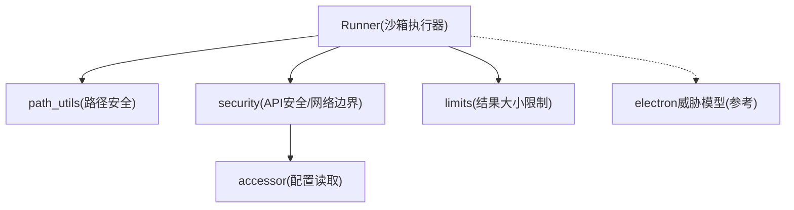
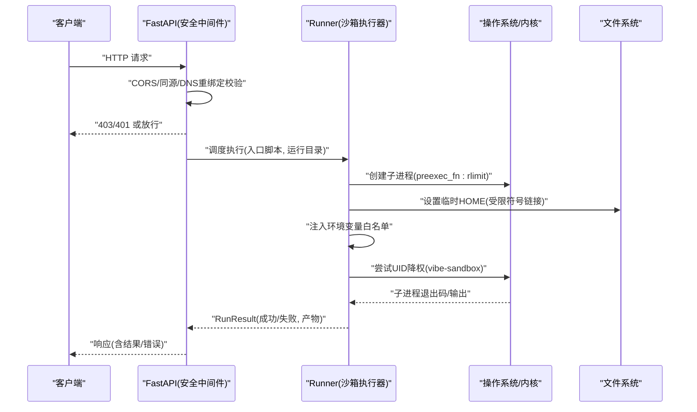
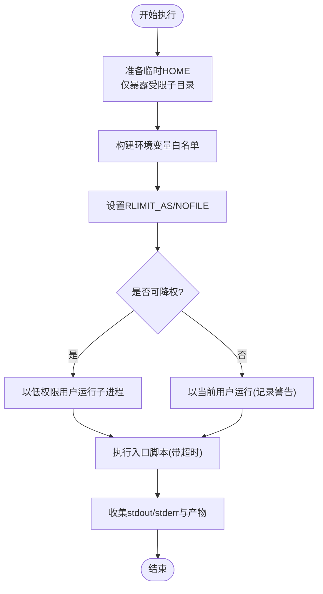
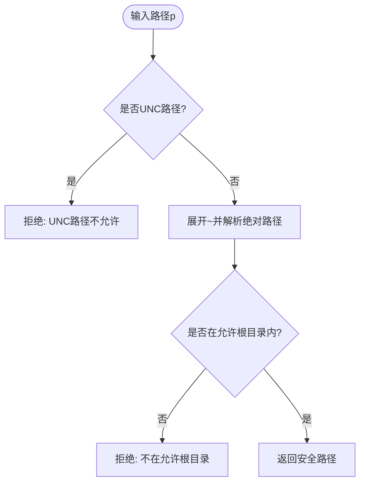
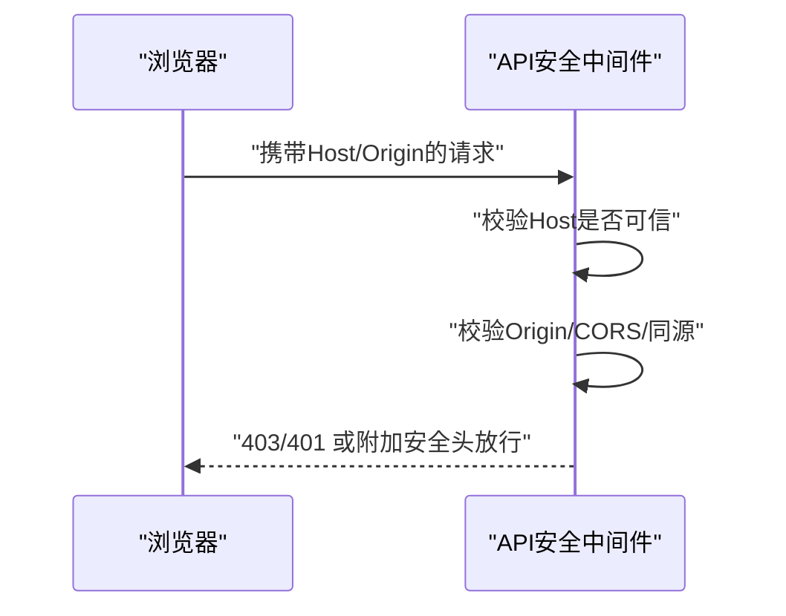
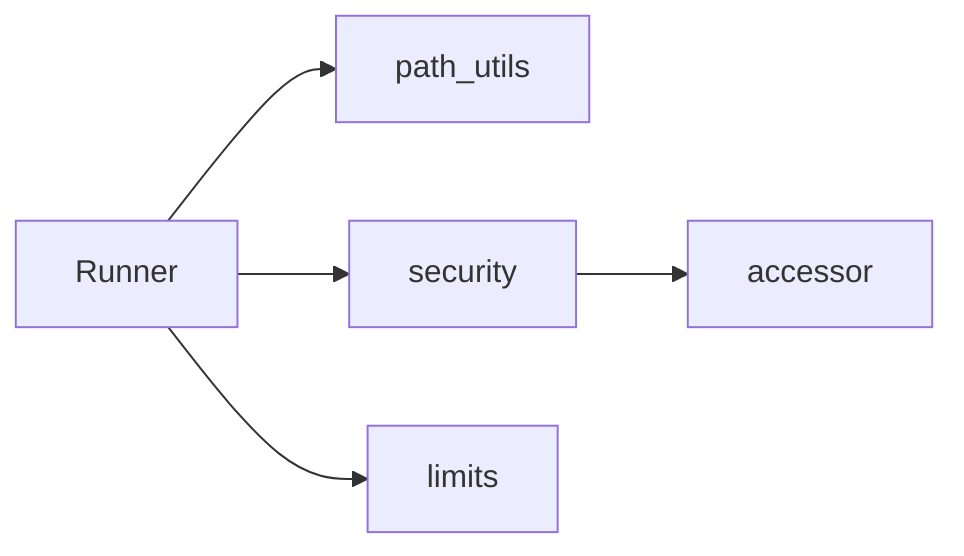

# 沙箱机制

<cite>
**本文引用的文件**
- [agent/src/core/runner.py](file://agent/src/core/runner.py)
- [agent/src/tools/path_utils.py](file://agent/src/tools/path_utils.py)
- [agent/src/api/security.py](file://agent/src/api/security.py)
- [agent/src/config/limits.py](file://agent/src/config/limits.py)
- [agent/src/config/accessor.py](file://agent/src/config/accessor.py)
- [desktop/electron/THREAT_MODEL.md](file://desktop/electron/THREAT_MODEL.md)
- [agent/tests/test_runner_env.py](file://agent/tests/test_runner_env.py)
- [agent/tests/test_path_safety.py](file://agent/tests/test_path_safety.py)
- [agent/tests/test_file_tool_sandbox_security.py](file://agent/tests/test_file_tool_sandbox_security.py)
</cite>

## 目录
1. [简介](#简介)
2. [项目结构](#项目结构)
3. [核心组件](#核心组件)
4. [架构总览](#架构总览)
5. [详细组件分析](#详细组件分析)
6. [依赖关系分析](#依赖关系分析)
7. [性能考量](#性能考量)
8. [故障排查指南](#故障排查指南)
9. [结论](#结论)
10. [附录：配置参数与调优清单](#附录：配置参数与调优清单)

## 简介
本技术文档面向安全工程师与开发者，系统化说明本项目的“沙箱执行环境”设计与实现，覆盖以下关键主题：
- 代码执行隔离：进程隔离、最小权限用户、临时 HOME 目录、环境变量白名单。
- 资源限制策略：虚拟内存上限（RLIMIT_AS）、打开文件数上限（RLIMIT_NOFILE）、子进程超时控制。
- 网络访问控制：出站连接默认允许但受代理/证书环境变量约束；API 层提供 DNS 重绑定防护、CORS 与同源校验、本地回环主机信任列表。
- 文件操作安全：路径验证、UNC 路径拒绝、工作目录边界检查、读写根目录白名单。
- 沙箱逃逸防护与异常处理：AST 静态防御（注释引用）、UID 降级失败降级策略、错误日志脱敏、结果截断。
- 配置参数与性能调优：环境变量、运行时限制、可观测性与排障建议。

## 项目结构
围绕沙箱的关键代码分布在如下模块：
- 执行器与隔离：agent/src/core/runner.py
- 路径安全与边界控制：agent/src/tools/path_utils.py
- API 安全与网络边界：agent/src/api/security.py
- 工具结果大小限制：agent/src/config/limits.py
- 配置读取与布尔解析：agent/src/config/accessor.py
- 桌面端威胁模型参考：desktop/electron/THREAT_MODEL.md
- 相关测试用例：agent/tests/test_runner_env.py、test_path_safety.py、test_file_tool_sandbox_security.py

图表来源
- [agent/src/core/runner.py:33-110](file://agent/src/core/runner.py#L33-L110)
- [agent/src/tools/path_utils.py:1-16](file://agent/src/tools/path_utils.py#L1-L16)
- [agent/src/api/security.py:161-173](file://agent/src/api/security.py#L161-L173)
- [agent/src/config/limits.py:1-13](file://agent/src/config/limits.py#L1-L13)
- [desktop/electron/THREAT_MODEL.md:60-88](file://desktop/electron/THREAT_MODEL.md#L60-L88)

章节来源
- [agent/src/core/runner.py:33-110](file://agent/src/core/runner.py#L33-L110)
- [agent/src/tools/path_utils.py:1-16](file://agent/src/tools/path_utils.py#L1-L16)
- [agent/src/api/security.py:161-173](file://agent/src/api/security.py#L161-L173)
- [agent/src/config/limits.py:1-13](file://agent/src/config/limits.py#L1-L13)
- [desktop/electron/THREAT_MODEL.md:60-88](file://desktop/electron/THREAT_MODEL.md#L60-L88)

## 核心组件
- Runner（沙箱执行器）
  - 创建临时 HOME，仅以符号链接方式暴露受限的 ~/.vibe-trading 子目录给子进程。
  - 在 POSIX 环境下通过 preexec_fn 设置 RLIMIT_AS 与 RLIMIT_NOFILE。
  - 尝试将子进程 UID/GID 降至专用低权限账户（如 vibe-sandbox），不可用时记录警告并继续执行。
  - 构建最小化环境变量白名单，避免泄露 LLM、交易、凭证等敏感变量。
  - 为子进程设置超时，收集 stdout/stderr 与产物文件。
- 路径安全（path_utils）
  - 统一拒绝 UNC 路径（\\server\share 或 //server/share）。
  - 对工具调用限定工作目录边界（safe_path）。
  - 对用户/文档导入路径进行“允许根目录”白名单校验（safe_user_path/safe_document_path）。
  - 对 run_dir 与 run_id 进行严格校验，防止越权写入。
- API 安全（security）
  - DNS 重绑定防护：本地客户端请求必须使用可信 Host。
  - CORS 与同源校验：禁止危险跨站请求，支持显式扩展源。
  - 安全响应头：CSP、X-Frame-Options、Permissions-Policy 等。
  - 访问日志脱敏：对查询串中的敏感键值进行掩码。
- 工具结果限制（limits）
  - 对工具返回结果进行字符级截断，避免大输出影响模型上下文与性能。
- 配置读取（accessor）
  - 线程安全的单例 EnvConfig 读取，统一布尔解析与环境变量别名兼容。

章节来源
- [agent/src/core/runner.py:33-110](file://agent/src/core/runner.py#L33-L110)
- [agent/src/tools/path_utils.py:40-74](file://agent/src/tools/path_utils.py#L40-L74)
- [agent/src/tools/path_utils.py:283-369](file://agent/src/tools/path_utils.py#L283-L369)
- [agent/src/api/security.py:161-173](file://agent/src/api/security.py#L161-L173)
- [agent/src/api/security.py:176-253](file://agent/src/api/security.py#L176-L253)
- [agent/src/config/limits.py:12-49](file://agent/src/config/limits.py#L12-L49)
- [agent/src/config/accessor.py:52-76](file://agent/src/config/accessor.py#L52-L76)

## 架构总览
下图展示了从外部请求到沙箱执行的端到端流程，包括认证、网络边界、路径校验与资源限制。

图表来源
- [agent/src/api/security.py:161-173](file://agent/src/api/security.py#L161-L173)
- [agent/src/core/runner.py:571-592](file://agent/src/core/runner.py#L571-L592)
- [agent/src/core/runner.py:510-627](file://agent/src/core/runner.py#L510-L627)

## 详细组件分析

### 执行器与进程隔离（Runner）
- 进程隔离与最小权限
  - 在 POSIX 平台尝试将子进程切换到低权限用户/组（如 vibe-sandbox），若失败则记录警告并继续执行，确保 AST 静态防御仍生效。
  - 通过 preexec_fn 在 fork 后设置资源限制，避免子进程滥用系统资源。
- 临时 HOME 与数据可见性
  - 为子进程创建临时 HOME，并以符号链接形式仅暴露必要的 ~/.vibe-trading 子目录（如缓存、data-bridge、qveris.json），其他敏感目录不可见。
  - 预置第三方库所需的最小配置文件，避免因缺失导致崩溃。
- 环境变量白名单
  - 仅传递必要的环境变量（PATH、HOME、代理、证书、各数据源只读配置等），避免泄露密钥与凭据。
  - 自动追加当前运行目录到允许的 run roots，保证产物落盘位置可控。
- 超时与产物收集
  - 子进程执行带超时保护，捕获 stdout/stderr 并持久化到运行目录。
  - 根据产物规范扫描 artifacts 目录，提取结构化结果供上层消费。

图表来源
- [agent/src/core/runner.py:113-172](file://agent/src/core/runner.py#L113-L172)
- [agent/src/core/runner.py:259-361](file://agent/src/core/runner.py#L259-L361)
- [agent/src/core/runner.py:571-592](file://agent/src/core/runner.py#L571-L592)
- [agent/src/core/runner.py:510-627](file://agent/src/core/runner.py#L510-L627)

章节来源
- [agent/src/core/runner.py:33-110](file://agent/src/core/runner.py#L33-L110)
- [agent/src/core/runner.py:113-172](file://agent/src/core/runner.py#L113-L172)
- [agent/src/core/runner.py:259-361](file://agent/src/core/runner.py#L259-L361)
- [agent/src/core/runner.py:571-592](file://agent/src/core/runner.py#L571-L592)
- [agent/src/core/runner.py:510-627](file://agent/src/core/runner.py#L510-L627)

### 路径安全与文件访问控制（path_utils）
- 拒绝 UNC 路径与路径穿越
  - 所有入口函数均拒绝 UNC 路径（\\server\share 或 //server/share），防止网络共享绕过。
  - safe_path 强制目标路径位于工作目录下，否则抛出异常。
- 允许根目录白名单
  - 用户文件/文档导入路径必须在“允许的文件根目录”集合内，该集合由默认路径与环境配置组合而成。
  - run_dir/run_id 同样需落在“允许的 run 根目录”集合中，防止任意路径写入。
- 统一解析与错误提示
  - resolve_safe_path 支持 run_dir 优先解析，失败时回退到允许根目录，并提供清晰的错误信息与环境变量指引。

图表来源
- [agent/src/tools/path_utils.py:40-74](file://agent/src/tools/path_utils.py#L40-L74)
- [agent/src/tools/path_utils.py:283-369](file://agent/src/tools/path_utils.py#L283-L369)

章节来源
- [agent/src/tools/path_utils.py:40-74](file://agent/src/tools/path_utils.py#L40-L74)
- [agent/src/tools/path_utils.py:283-369](file://agent/src/tools/path_utils.py#L283-L369)
- [agent/tests/test_path_safety.py:32-124](file://agent/tests/test_path_safety.py#L32-L124)
- [agent/tests/test_file_tool_sandbox_security.py:1-41](file://agent/tests/test_file_tool_sandbox_security.py#L1-L41)

### 网络访问控制与API安全（security）
- DNS 重绑定防护
  - 本地客户端请求必须使用可信 Host（localhost、127.0.0.1、::1 等），否则返回 403。
- CORS 与同源校验
  - 默认允许本地开发站点，支持额外扩展源；禁止 credentialed 模式下的通配符。
  - 拒绝跨站浏览器请求，保障前端与后端同源安全。
- 安全响应头
  - 强制 CSP、X-Frame-Options、Permissions-Policy、Referrer-Policy 等，降低 XSS/点击劫持风险。
- 访问日志脱敏
  - 对查询串中的敏感键值（如 api_key、ticket）进行掩码，避免泄露。

图表来源
- [agent/src/api/security.py:161-173](file://agent/src/api/security.py#L161-L173)
- [agent/src/api/security.py:176-253](file://agent/src/api/security.py#L176-L253)
- [agent/src/api/security.py:256-297](file://agent/src/api/security.py#L256-L297)

章节来源
- [agent/src/api/security.py:161-173](file://agent/src/api/security.py#L161-L173)
- [agent/src/api/security.py:176-253](file://agent/src/api/security.py#L176-L253)
- [agent/src/api/security.py:256-297](file://agent/src/api/security.py#L256-L297)

### 工具结果限制与异常处理（limits）
- 工具结果截断
  - 对工具返回字符串进行字符级截断，附带提示告知被截断长度，避免模型上下文过载。
- 异常处理与可观测性
  - 子进程执行异常会被捕获并记录 stderr，便于定位问题。
  - 访问日志中的敏感参数会被脱敏，减少泄露风险。

章节来源
- [agent/src/config/limits.py:12-49](file://agent/src/config/limits.py#L12-L49)
- [agent/src/core/runner.py:682-709](file://agent/src/core/runner.py#L682-L709)
- [agent/src/api/security.py:256-297](file://agent/src/api/security.py#L256-L297)

### 沙箱逃逸防护与降级策略
- 多层防护
  - AST 静态防御（注释引用）作为始终生效的防线。
  - 进程级隔离：临时 HOME、环境变量白名单、UID 降权、资源限制。
- 降级策略
  - 当无法降权（无对应用户或缺少能力）时，记录警告并继续执行，确保可用性同时维持 AST 防护。
- 桌面端进程边界（参考）
  - Electron 主进程与 Python 后端进程间通过本地回环通信，启用鉴权与隔离，避免渲染进程直接访问后端。

章节来源
- [agent/src/core/runner.py:33-110](file://agent/src/core/runner.py#L33-L110)
- [desktop/electron/THREAT_MODEL.md:60-88](file://desktop/electron/THREAT_MODEL.md#L60-L88)

## 依赖关系分析
- Runner 依赖 path_utils 进行路径校验，依赖 security 提供的网络边界策略，依赖 limits 进行结果大小控制。
- security 依赖 accessor 读取配置（CORS、额外源、本地主机信任列表等）。
- 测试用例覆盖 runner 环境变量与 rlimit、路径安全、文件工具沙箱行为。

图表来源
- [agent/src/core/runner.py:33-110](file://agent/src/core/runner.py#L33-L110)
- [agent/src/tools/path_utils.py:1-16](file://agent/src/tools/path_utils.py#L1-L16)
- [agent/src/api/security.py:161-173](file://agent/src/api/security.py#L161-L173)
- [agent/src/config/limits.py:1-13](file://agent/src/config/limits.py#L1-L13)
- [agent/src/config/accessor.py:52-76](file://agent/src/config/accessor.py#L52-L76)

章节来源
- [agent/src/core/runner.py:33-110](file://agent/src/core/runner.py#L33-L110)
- [agent/src/tools/path_utils.py:1-16](file://agent/src/tools/path_utils.py#L1-L16)
- [agent/src/api/security.py:161-173](file://agent/src/api/security.py#L161-L173)
- [agent/src/config/limits.py:1-13](file://agent/src/config/limits.py#L1-L13)
- [agent/src/config/accessor.py:52-76](file://agent/src/config/accessor.py#L52-L76)

## 性能考量
- 虚拟内存限制（RLIMIT_AS）
  - 默认设置为 4096 MB，兼顾 numpy/BLAS 的大虚拟地址空间预留，避免误报 OOM。
  - 可通过环境变量调整，适用于分钟级大规模回测场景。
- 文件描述符限制（RLIMIT_NOFILE）
  - 限制最大打开文件数，防止文件句柄耗尽导致的 DoS。
- 工具结果截断
  - 限制单次工具结果大小，降低模型上下文压力与网络传输开销。
- 子进程超时
  - 为每个执行任务设置超时，避免长时间占用资源。

章节来源
- [agent/src/core/runner.py:73-110](file://agent/src/core/runner.py#L73-L110)
- [agent/src/config/limits.py:12-49](file://agent/src/config/limits.py#L12-L49)

## 故障排查指南
- 子进程无法降权
  - 现象：日志中出现“Sandbox UID drop to ... failed”，随后以当前用户执行。
  - 处理：确认容器/主机已创建低权限用户并具备相应能力；或在非生产环境接受降级策略。
- 路径访问被拒绝
  - 现象：ValueError 提示“UNC paths are not allowed”或“outside allowed ... roots”。
  - 处理：检查路径是否为 UNC；将目标目录加入允许根目录环境变量配置。
- 网络请求被拒
  - 现象：403 “Untrusted local API host”或跨站请求被拒绝。
  - 处理：确保 Host/Origin 为本地可信域名；必要时在配置中添加额外可信源。
- 结果过大或超时
  - 现象：工具结果被截断或子进程超时。
  - 处理：缩小查询范围或使用分页参数；适当提高超时或调整资源限制。

章节来源
- [agent/src/core/runner.py:571-592](file://agent/src/core/runner.py#L571-L592)
- [agent/src/tools/path_utils.py:40-74](file://agent/src/tools/path_utils.py#L40-L74)
- [agent/src/api/security.py:161-173](file://agent/src/api/security.py#L161-L173)
- [agent/src/config/limits.py:12-49](file://agent/src/config/limits.py#L12-L49)

## 结论
本项目通过多层隔离与限制构建了稳健的沙箱执行环境：
- 进程级隔离（UID 降权、临时 HOME、环境变量白名单）与资源限制（RLIMIT_AS/NOFILE、超时）共同构成执行边界。
- 路径安全与允许根目录白名单确保文件访问最小化。
- API 层提供 DNS 重绑定防护、CORS/同源校验与安全头，强化网络边界。
- 结果截断与日志脱敏提升可用性与安全性。
建议在生产环境中结合容器能力启用 UID 降权，并根据业务规模调整资源限制与超时策略。

## 附录：配置参数与调优清单
- 沙箱资源限制
  - VIBE_TRADING_SANDBOX_RLIMIT_AS_MB：设置虚拟内存上限（MB），默认 4096。
  - RLIMIT_NOFILE：最大打开文件数，默认 512。
- 路径与运行目录
  - VIBE_TRADING_ALLOWED_FILE_ROOTS：允许的用户文件/文档导入根目录（逗号分隔）。
  - VIBE_TRADING_ALLOWED_RUN_ROOTS：允许的 run 根目录（逗号分隔）。
  - VIBE_TRADING_ALLOWED_WRITE_ROOTS：允许写入的根目录（逗号分隔）。
- API 安全
  - CORS_ORIGINS / VIBE_TRADING_EXTRA_CORS_ORIGINS：允许的浏览器源。
  - API_AUTH_KEY：API 鉴权密钥（可选）。
  - VIBE_TRADING_CSP_REPORT_ONLY：CSP 报告模式开关。
  - VIBE_TRADING_TRUST_DOCKER_LOOPBACK：是否信任 Docker 网关回环 IP。
- 工具结果限制
  - TOOL_RESULT_LIMIT：工具结果字符上限（默认 10000）。
- 调试与可观测性
  - 关注 Runner 日志中的警告与错误输出。
  - 检查访问日志中的敏感参数是否已被脱敏。

章节来源
- [agent/src/core/runner.py:73-110](file://agent/src/core/runner.py#L73-L110)
- [agent/src/tools/path_utils.py:25-32](file://agent/src/tools/path_utils.py#L25-L32)
- [agent/src/tools/path_utils.py:137-182](file://agent/src/tools/path_utils.py#L137-L182)
- [agent/src/api/security.py:30-51](file://agent/src/api/security.py#L30-L51)
- [agent/src/api/security.py:147-158](file://agent/src/api/security.py#L147-L158)
- [agent/src/api/security.py:193-253](file://agent/src/api/security.py#L193-L253)
- [agent/src/config/limits.py:12-49](file://agent/src/config/limits.py#L12-L49)
- [agent/tests/test_runner_env.py:189-222](file://agent/tests/test_runner_env.py#L189-L222)
- [agent/tests/test_path_safety.py:32-124](file://agent/tests/test_path_safety.py#L32-L124)
- [agent/tests/test_file_tool_sandbox_security.py:1-41](file://agent/tests/test_file_tool_sandbox_security.py#L1-L41)