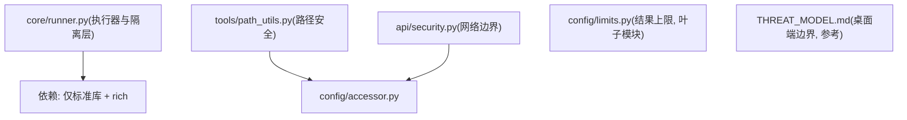
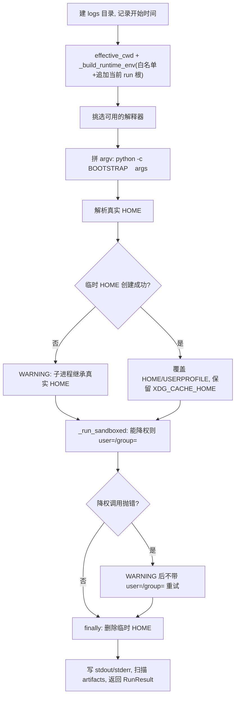
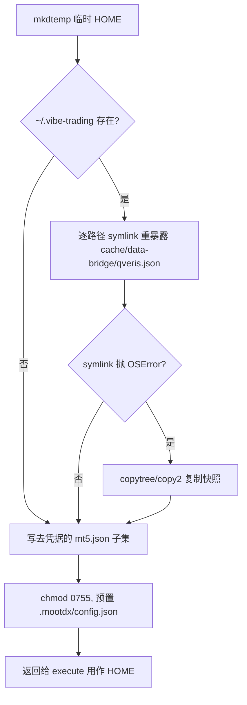
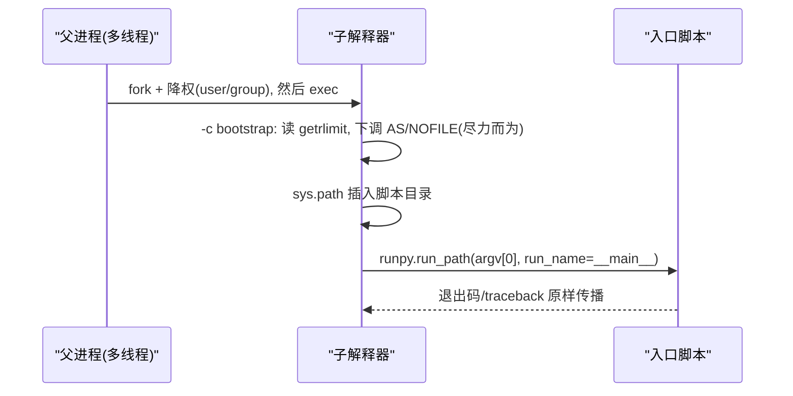
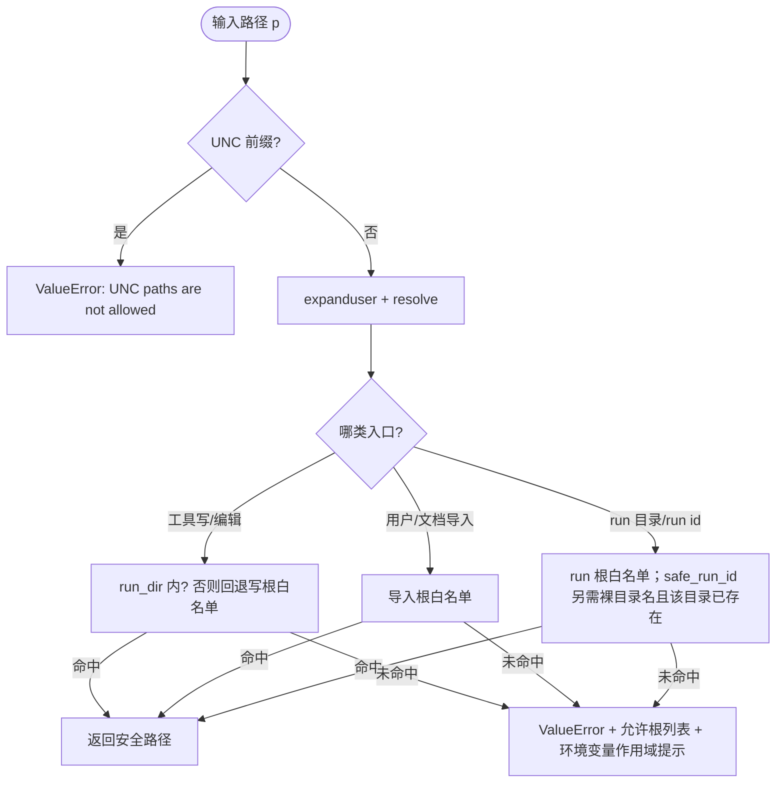
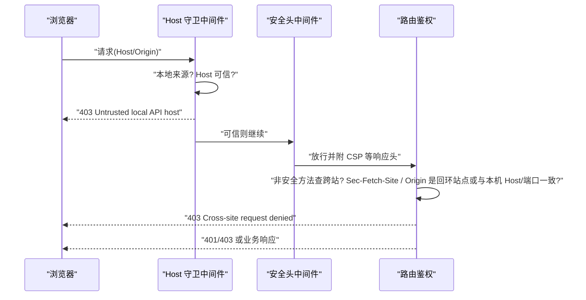
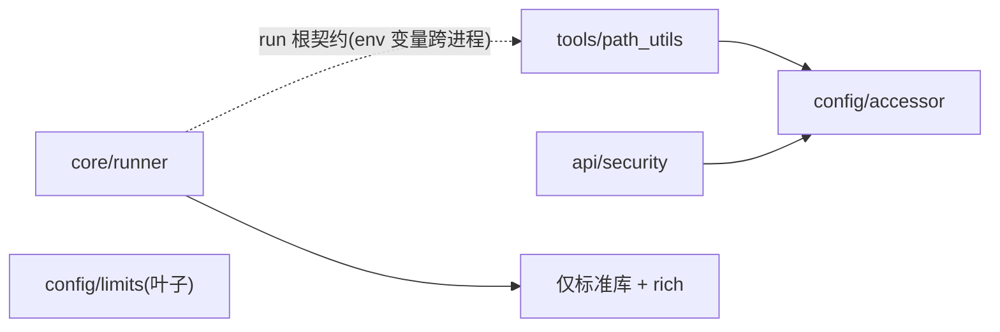

# 沙箱机制

<cite>
**本文引用的文件**
- [agent/src/api/security.py](file://agent/src/api/security.py)
- [agent/src/config/accessor.py](file://agent/src/config/accessor.py)
- [agent/src/config/limits.py](file://agent/src/config/limits.py)
- [agent/src/core/runner.py](file://agent/src/core/runner.py)
- [agent/src/tools/path_utils.py](file://agent/src/tools/path_utils.py)
- [agent/tests/test_file_tool_sandbox_security.py](file://agent/tests/test_file_tool_sandbox_security.py)
- [agent/tests/test_path_safety.py](file://agent/tests/test_path_safety.py)
- [agent/tests/test_runner_env.py](file://agent/tests/test_runner_env.py)
- [desktop/electron/THREAT_MODEL.md](file://desktop/electron/THREAT_MODEL.md)
</cite>

## 目录
1. [简介](#简介)
2. [项目结构](#项目结构)
3. [核心组件](#核心组件)
4. [架构总览](#架构总览)
5. [详细组件分析](#详细组件分析)
6. [依赖关系分析](#依赖关系分析)
7. [回归测试映射](#回归测试映射)
8. [性能考量](#性能考量)
9. [故障排查指南](#故障排查指南)
10. [结论](#结论)
11. [附录：参数与开关清单](#附录参数与开关清单)

## 简介
本页说明「模型生成的回测代码 + 工具调用」这条执行路径上的沙箱边界，覆盖六个主题：

- 进程隔离层：临时 HOME、环境变量白名单、UID/GID 降权、超时。
- 资源限额：地址空间上限（`RLIMIT_AS`）与打开文件数上限（`RLIMIT_NOFILE`），由 **exec 之后的子解释器 bootstrap** 下调，不经 `preexec_fn`。
- 文件边界：UNC 路径拒绝、工作目录包含检查、读根/写根/run 根三套互不相同的白名单。
- API 网络边界：DNS 重绑定的 Host 校验、CORS 与同源、安全响应头、访问日志脱敏。
- 结果体积：工具结果的字符级截断与截断告知。
- 桌面端进程边界：渲染进程/主进程/后端子进程的职责划分（参考威胁模型）。

不在本页范围：AST 静态清洗器的实现（只被注释指认为「始终生效」的那道控制）、会话与 `Principal` 的鉴权细节（见「认证与授权」）、密钥存储与脱敏落盘（见「数据安全」）。

章节来源
- [agent/src/core/runner.py:34-39](file://agent/src/core/runner.py#L34-L39)
- [agent/src/tools/path_utils.py:1-16](file://agent/src/tools/path_utils.py#L1-L16)

## 项目结构
沙箱相关代码分成几块，彼此几乎没有 import 关系（唯一的汇聚点是配置层）：

- 执行器与隔离层：`agent/src/core/runner.py`（临时 HOME、环境白名单、降权、限额 bootstrap、超时与产物收集）。
- 路径安全与边界控制：`agent/src/tools/path_utils.py`（三个校验入口 + 三套根目录白名单）。
- API 网络边界：`agent/src/api/security.py`（Host/CORS/同源/安全头/日志脱敏/一次性 SSE 票据）。
- 工具结果上限与配置读取：`agent/src/config/limits.py`（无内部依赖的叶子模块，定字符上限）、`agent/src/config/accessor.py`（单例配置与布尔解析，被路径安全与 API 边界两簇共用）。
- 桌面端威胁模型：`desktop/electron/THREAT_MODEL.md`（进程边界、回环鉴权、渲染进程隔离）。
- 回归测试：`agent/tests/test_runner_env.py`、`agent/tests/test_path_safety.py`、`agent/tests/test_file_tool_sandbox_security.py`。

图表来源
- [agent/src/core/runner.py:3-32](file://agent/src/core/runner.py#L3-L32)
- [agent/src/tools/path_utils.py:20-26](file://agent/src/tools/path_utils.py#L20-L26)
- [agent/src/api/security.py:20-24](file://agent/src/api/security.py#L20-L24)
- [agent/src/config/limits.py:1-13](file://agent/src/config/limits.py#L1-L13)

## 核心组件
- `Runner`（执行器）
  - 为子进程创建临时 HOME，只以符号链接（失败则复制）重新暴露 `~/.vibe-trading` 下三个加载器所需路径：`cache`、`data-bridge`、`qveris.json`，另单独写一份只含 `terminal_path` 与 `timeout` 的去凭据 `mt5.json` 子集。
  - 按白名单构造子进程环境：OS/Python 基础项、代理与证书、只读行情配置；LLM、API 服务、券商、实盘、advisory 类变量不继承。
  - 通过 `subprocess.run(..., user=..., group=...)` 尝试降到 `vibe-sandbox`；账号不存在或无权限时记录 WARNING 并按原样运行。
  - 资源上限由 exec 后的 `-c` bootstrap 施加；带 wall-clock 超时；stdout/stderr 落盘到运行目录的 `logs/`。
- 路径安全（`path_utils`）
  - 每个入口先拒 UNC 前缀（`\\server\share` 与 `//server/share`）；`safe_path` 在 `resolve()` 之后做工作目录包含检查。
  - `safe_user_path` / `safe_document_path` 只认「导入根」白名单；`safe_run_dir` / `safe_run_id` 只认「运行根」白名单；写/编辑另有独立的写根集合。
- API 安全（`security`）
  - 本地客户端必须携带可信 Host，否则 403；CORS 默认只含回环开发站点，通配符在凭据模式下直接 `RuntimeError`。
  - 统一附加 CSP、`X-Frame-Options`、`Permissions-Policy`、`Referrer-Policy`；访问日志掩码 `api_key=` / `ticket=` 的值。
- 结果上限（`limits`）
  - `truncate_tool_result` 把单次工具结果裁到上限，并在结尾告知被扣掉了多少。
- 配置读取（`accessor`）
  - 双检锁单例 + 统一布尔解析 + 变量别名回退；改 `os.environ` 后需 `reset_env_config()` 才生效。

章节来源
- [agent/src/core/runner.py:34-53](file://agent/src/core/runner.py#L34-L53)
- [agent/src/core/runner.py:148-256](file://agent/src/core/runner.py#L148-L256)
- [agent/src/core/runner.py:352-361](file://agent/src/core/runner.py#L352-L361)
- [agent/src/tools/path_utils.py:40-74](file://agent/src/tools/path_utils.py#L40-L74)
- [agent/src/api/security.py:166-173](file://agent/src/api/security.py#L166-L173)
- [agent/src/config/limits.py:22-48](file://agent/src/config/limits.py#L22-L48)
- [agent/src/config/accessor.py:52-92](file://agent/src/config/accessor.py#L52-L92)

## 架构总览
`execute()` 的实际顺序如下（不含任何「API 直接调用 Runner」的推断——该调用边界的实现在本页 sources 之外）：

图表来源
- [agent/src/core/runner.py:614-633](file://agent/src/core/runner.py#L614-L633)
- [agent/src/core/runner.py:639-680](file://agent/src/core/runner.py#L639-L680)
- [agent/src/core/runner.py:685-709](file://agent/src/core/runner.py#L685-L709)

三处边界各自的位置：子进程侧「exec 前降权 → exec 后 bootstrap 下调 `RLIMIT_AS`/`RLIMIT_NOFILE` → `runpy` 执行入口脚本」；工具侧「`path_utils` 校验路径 → 读写根白名单 → 结果交给 `limits` 截断后回给模型」；入口侧「Host/CORS/同源判断 → 安全响应头 → 访问日志脱敏」。

章节来源
- [agent/src/core/runner.py:86-145](file://agent/src/core/runner.py#L86-L145)
- [agent/src/tools/path_utils.py:185-240](file://agent/src/tools/path_utils.py#L185-L240)
- [agent/src/api/security.py:235-253](file://agent/src/api/security.py#L235-L253)

## 详细组件分析

### 执行器与进程隔离（`Runner`）
- 临时 HOME 与可见性
  - 临时目录由 `tempfile.mkdtemp(prefix="vibe-sandbox-home-")` 创建；`mkdtemp` 默认 0700，随后放宽到 0755，否则降权后的 UID 无法穿越该目录。
  - 只重暴露加载器所需的三个路径（`cache`、`data-bridge`、`qveris.json`），用符号链接以便可选的加载器缓存跨运行保留；`shutil.rmtree` 只删链接，不删目标。符号链接在 Windows 上可能因权限不足抛 `OSError`，此时退化为逐路径复制（目录 `copytree`、文件 `copy2`），复制是每次运行的快照，故无法建链接的主机上可选缓存不再跨运行持久化；两者都失败则放弃——加载器只会退回实时拉取或关闭缓存，不会硬崩。
  - `~/.vibe-trading/mt5.json` 走「字段白名单」而非整文件链接：只带 `terminal_path`（非空且不含 NUL 的字符串）与 `timeout`（有限的正数），任一无效即整项跳过，两者都不可用时连文件都不写。
  - 额外预置 `.mootdx/config.json`（优先复制真实 HOME 的配置，其次用库默认，最后兜底 `{}`），因为该库在空 HOME 下会抛出未被捕获的 `FileNotFoundError`。
  - `execute()` 里把 `HOME`/`USERPROFILE` 指向临时目录，并把 `XDG_CACHE_HOME` 指回真实 `~/.cache`，让守规矩的库缓存不被迫每次重下。
- 环境变量白名单
  - 允许集为 `_RUNTIME_ENV_KEYS` ∪ `_PROXY_ENV_KEYS`，外加 `LC_` 前缀；判定函数只看键名，不看值。意图写在注释里：不继承 LLM、API 服务、券商、实盘交易、advisory 凭据，保留 OS/Python 基础项、代理与证书设置、内置加载器需要的只读行情配置。
  - `_build_runtime_env` 再补 `PYTHONUNBUFFERED`/`PYTHONIOENCODING`/`PYTHONUTF8`，并把**当前 run 目录本身**（而非其父目录）追加进 `VIBE_TRADING_ALLOWED_RUN_ROOTS`——因为入口脚本会在换了 HOME 的子进程里再次校验 run 目录。
  - 出网不被这层限制：代理与证书变量透传、行情源需要联网，本模块不做网络隔离。
- 超时与产物
  - `timeout` 通过 `subprocess.run(..., timeout=self.timeout)` 施加，默认 300 秒；超时异常不在 `execute()` 内被吞掉，`finally` 只保证临时 HOME 被清理。
  - 正常返回后 stdout/stderr 写入 `run_dir/logs/runner_stdout.txt` 与 `runner_stderr.txt`，再按 `artifacts_spec` 逐项探测存在性，组成 `RunResult.artifacts`。

图表来源
- [agent/src/core/runner.py:181-256](file://agent/src/core/runner.py#L181-L256)
- [agent/src/core/runner.py:635-680](file://agent/src/core/runner.py#L635-L680)

章节来源
- [agent/src/core/runner.py:40-53](file://agent/src/core/runner.py#L40-L53)
- [agent/src/core/runner.py:148-256](file://agent/src/core/runner.py#L148-L256)
- [agent/src/core/runner.py:259-361](file://agent/src/core/runner.py#L259-L361)
- [agent/src/core/runner.py:466-476](file://agent/src/core/runner.py#L466-L476)
- [agent/src/core/runner.py:522-569](file://agent/src/core/runner.py#L522-L569)
- [agent/src/core/runner.py:614-709](file://agent/src/core/runner.py#L614-L709)

### 资源限额：为什么不经 `preexec_fn`
- 限额由一段内嵌的 `-c` bootstrap 在 exec **之后**执行：契约是 `python -c BOOTSTRAP <as_bytes> <nofile> <entry> [args...]`，两个数值由父进程算好后放进 argv（子侧读到的是 `sys.argv[1]`/`sys.argv[2]`），bootstrap 用 `sys.argv = sys.argv[3:]` 把它还原成「`argv[0]` 就是入口脚本」的形态，再把脚本目录插入 `sys.path` 并 `runpy.run_path(sys.argv[0], run_name="__main__")`。
- 原因是 `preexec_fn` 会在 fork 与 exec 之间跑 Python 字节码；`serve` 进程必然是多线程的（uvicorn worker 加后台 agent 循环），这在 POSIX 下是未定义行为，在 aarch64/glibc 2.34 上稳定 SIGSEGV，导致从 Web UI 发起的回测在 exec 前就死掉。
- 顺序含义：降权在 exec 之前（由 `subprocess.run` 的 `user=`/`group=` 完成），下调限额在降权之后——非特权进程下调限额总是被允许。
- 不抬高已有上限：每项先读 `(soft, hard)`，目标超过硬限时取 `min(target, hard)`，硬限为无穷则用目标值；`ValueError`/`OSError` 一律 `pass`，即尽力而为。
- 平台差异：`resource` 模块缺失（Windows）时 `_rlimit_bootstrap_argv()` 直接返回 `None`，入口脚本被裸跑，没有任何上限——这与变更前行为一致，属文档化降级而非隐性失败。
- 虚拟内存语义：`RLIMIT_AS` 限的是**虚拟地址空间**（含 mmap），numpy/BLAS 会预留数 GB 但不常驻，2 GB 上限会误杀正常回测，故默认 4096 MB 只是 DoS 天花板；可用 `VIBE_TRADING_SANDBOX_RLIMIT_AS_MB` 调大，非法值或非正数都回落到默认。

图表来源
- [agent/src/core/runner.py:86-145](file://agent/src/core/runner.py#L86-L145)
- [agent/src/core/runner.py:571-592](file://agent/src/core/runner.py#L571-L592)

章节来源
- [agent/src/core/runner.py:47-53](file://agent/src/core/runner.py#L47-L53)
- [agent/src/core/runner.py:74-145](file://agent/src/core/runner.py#L74-L145)
- [agent/tests/test_runner_env.py:303-333](file://agent/tests/test_runner_env.py#L303-L333)
- [agent/tests/test_runner_env.py:469-490](file://agent/tests/test_runner_env.py#L469-L490)

### 降权与降级策略
- 预检：`_resolve_sandbox_credentials()` 在 `pwd` 模块缺失（非 POSIX）或 `vibe-sandbox` 账号不存在时返回 `None`，即除加固容器镜像之外的所有环境都不会尝试降权。
- 执行：返回凭据对时以 `subprocess.run(cmd, user=user, group=group, ...)` 起进程；捕获 `PermissionError`/`LookupError`/`OSError`，记录明确 WARNING 后**不带降权重试同一条命令**。
- 降权的定位：注释把这层和临时 HOME、环境白名单、rlimit 一起标为 defense-in-depth，只在加固 Docker 部署里真正生效；VT-001 始终生效的控制项是 AST 静态清洗（其实现文件不在本页 sources 内，故不作断言），降权失败时该防线仍在。
- 另一处降级：临时 HOME 创建失败（`OSError`）时记录 WARNING 并让子进程继承真实 HOME——此时「读不到持久 `~/.vibe-trading` 机密与状态」这一层就不存在了，是可用性优先的取舍，值得在部署时监控该日志。

章节来源
- [agent/src/core/runner.py:34-39](file://agent/src/core/runner.py#L34-L39)
- [agent/src/core/runner.py:56-71](file://agent/src/core/runner.py#L56-L71)
- [agent/src/core/runner.py:571-592](file://agent/src/core/runner.py#L571-L592)
- [agent/src/core/runner.py:649-664](file://agent/src/core/runner.py#L649-L664)
- [agent/tests/test_runner_env.py:156-159](file://agent/tests/test_runner_env.py#L156-L159)
- [agent/tests/test_runner_env.py:419-466](file://agent/tests/test_runner_env.py#L419-L466)

### 路径安全与文件访问控制（`path_utils`）
- 一个共同的拒绝点：`_rejects_unc` 只看前缀 `\\` 与 `//`，被 `safe_path`、`resolve_safe_path`、`_safe_import_path`（`safe_user_path`/`safe_document_path` 的实现）、`safe_run_dir`、`safe_run_id` 逐个调用，也被三处「按逗号拆分配置项」的解析逐条调用，因此配置里的 UNC 根同样会被拒。
- `safe_path(p, workdir)`：先 `expanduser()`，绝对路径直接 `resolve()`，相对路径拼到 `workdir` 后 `resolve()`，再用 `relative_to(base)` 判包含。因为检查发生在 `resolve()` 之后，落在工作目录内但指向外部的符号链接会在解析后掉出边界并被拒。
- 三个入口对应三种威胁模型（模块文档字符串明说）：`safe_path` 是工具可控沙箱（`read_file`/`write_file`/`edit_file` 必须留在当前 run 目录内）；`safe_user_path` 是用户自备的券商/导出文件；`safe_document_path` 是文档读取器的输入，与前者共用导入根边界。
- 三套白名单并不相同：读根 `allowed_file_roots()` 是默认根（agent 的 `uploads`/`runs`、cwd 的 `uploads`/`data`、用户级 `uploads`/`imports`、运行时根的 `uploads`/`runs`/`imports`）∪ `VIBE_TRADING_ALLOWED_FILE_ROOTS`；写根 `allowed_write_roots()` 是一组**更窄**的默认根（没有 cwd 的 `data`、没有 `imports`）∪ `VIBE_TRADING_ALLOWED_WRITE_ROOTS`；run 根 `_allowed_run_roots()` 是默认根（agent 的 `runs`、swarm 运行根与其未迁移的遗留目录、cwd 的 `runs`、用户级与运行时根的 `runs`/`shadow_runs`）∪ `VIBE_TRADING_ALLOWED_RUN_ROOTS`。能被读到的目录不等于能被写——读写根分离有专门回归测试守住。
- 上传句柄的回溯解析：浏览器上传对外表现为 `uploads/<name>`，`_import_candidate` 把它（以及 `agent/uploads/<name>`）映射回运行时上传根，其余相对路径按 cwd 解析，映射之后才判白名单。于是 `uploads/../x` 会被回溯成上传根的**兄弟路径**，再因落在所有允许根之外而被拒——句柄机制没有给穿越留后门。
- `resolve_safe_path` 的三段语义：给了 `run_dir` 就先用 `safe_run_dir` 校验再 `safe_path`；任一环节失败都**先回退到允许根**再报错；没给 `run_dir` 时路径必须落在允许根内；`purpose` 只影响错误文案。`safe_run_id` 比 `safe_run_dir` 更严：必须是单个裸目录名（非绝对、只有一段、不含 `.`/`..`），且在某个 run 根下真实存在目录才返回。
- 拒绝信息是运维面的一部分：`_describe_roots` 会逐行列出「当前允许哪些根」，并附上设置环境变量的名字与一句作用域提示——MCP 客户端自己拉起 server，在 shell 里 export 传不进去。

图表来源
- [agent/src/tools/path_utils.py:40-74](file://agent/src/tools/path_utils.py#L40-L74)
- [agent/src/tools/path_utils.py:185-240](file://agent/src/tools/path_utils.py#L185-L240)
- [agent/src/tools/path_utils.py:283-403](file://agent/src/tools/path_utils.py#L283-L403)

章节来源
- [agent/src/tools/path_utils.py:1-37](file://agent/src/tools/path_utils.py#L1-L37)
- [agent/src/tools/path_utils.py:82-182](file://agent/src/tools/path_utils.py#L82-L182)
- [agent/src/tools/path_utils.py:243-280](file://agent/src/tools/path_utils.py#L243-L280)
- [agent/tests/test_path_safety.py:16-46](file://agent/tests/test_path_safety.py#L16-L46)
- [agent/tests/test_path_safety.py:107-193](file://agent/tests/test_path_safety.py#L107-L193)
- [agent/tests/test_file_tool_sandbox_security.py:141-193](file://agent/tests/test_file_tool_sandbox_security.py#L141-L193)

### 网络访问控制与 API 边界（`security`）
- DNS 重绑定防护：中间件只对「本地客户端」生效判断——本地来源且 Host 不在可信回环集合内时直接 403（`Untrusted local API host`）。可信默认集合是 `localhost`、`127.0.0.1`、`::1`、`[::1]`、`testserver`；比较前统一去端口、转小写、去尾点。额外可信 Host 从配置字段 `api.api_allowed_hosts` 读取。
- 「本地」的定义可被显式放宽：回环 IP 与 `localhost`/`testclient` 之外，开启 `VIBE_TRADING_TRUST_DOCKER_LOOPBACK` 后会把 Linux 默认网关 IP（读 procfs 路由表，仅 IPv4）也算本地。放宽后 Host 校验依然适用，因为守卫的判断条件正是同一个「本地」判定。
- CORS 与同源：`CORS_ORIGINS` 是**替换**语义（不给就用 6 个回环开发站点默认值），`VIBE_TRADING_EXTRA_CORS_ORIGINS` 是**追加**语义（存在理由写在注释里：信任一个额外源不该把内置 Web UI 的来源悄悄挤掉），两者都拒绝 `*`，凭据已启用时直接 `RuntimeError`。非安全方法（不在 `GET`/`HEAD`/`OPTIONS` 内）先过跨站检查：`Sec-Fetch-Site: cross-site` 一律 403；带 `Origin` 时必须**要么**命名一个回环站点、**要么**与请求自身的 Host 与端口一致，两者都不满足才 403。
- 安全响应头：CSP 以 `default-src 'self'` 起步，`style-src` 允许内联（图表库与组件内联样式需要），字体与图片允许 `data:`，并有 `frame-ancestors 'none'`、`base-uri 'self'`、`form-action 'self'`；`/docs` 与 `/redoc` 走一条单独放宽的策略（允许内联脚本与外部 CDN 的样式/脚本），因为文档页 HTML 的引导块由框架硬编码。另有 `X-Content-Type-Options: nosniff`、`X-Frame-Options: DENY`、`Permissions-Policy`（关掉定位/摄像头/麦克风/支付/USB 等本应用从不用到的能力）、`Referrer-Policy: strict-origin-when-cross-origin`。`VIBE_TRADING_CSP_REPORT_ONLY` 只切换响应头名字（强制头 → 报告头），策略内容不变，是给「静态资源不在这条策略覆盖内」的部署留的回退开关；HSTS **故意不在这里设**——应用常见地部署在只做 TLS 终结的反向代理之后，无法保证始终 HTTPS，该头应由终结 TLS 的那一层下发。
- 访问日志脱敏：正则只掩 `api_key=` 与 `ticket=` 的**值**，保留键名，作用在日志记录的 `msg` 以及 `args` 里那些字符串项上；安装函数对 `uvicorn.access`/`uvicorn.error`/`uvicorn` 三个 logger 幂等，重复启动服务不会叠同一层过滤器。
- 查询串里的凭据形式：浏览器 `EventSource` 发不了 `Authorization` 头，于是先用头鉴权换一张一次性票据（`token_urlsafe(32)`，约 60 秒过期），再以 `?ticket=` 传；票据在校验时就从内存表里弹出，过期与否都不复用。事件流这条鉴权路径只从请求头接受长生命周期的 API key，注释说明理由是查询串会进浏览器历史、代理与访问日志。
- 服务端 shell 工具是显式 opt-in：一个配置布尔决定是否向 agent 暴露，不看请求本身。

图表来源
- [agent/src/api/security.py:166-173](file://agent/src/api/security.py#L166-L173)
- [agent/src/api/security.py:235-253](file://agent/src/api/security.py#L235-L253)
- [agent/src/api/security.py:423-431](file://agent/src/api/security.py#L423-L431)
- [agent/src/api/security.py:489-490](file://agent/src/api/security.py#L489-L490)

章节来源
- [agent/src/api/security.py:30-61](file://agent/src/api/security.py#L30-L61)
- [agent/src/api/security.py:69-116](file://agent/src/api/security.py#L69-L116)
- [agent/src/api/security.py:147-158](file://agent/src/api/security.py#L147-L158)
- [agent/src/api/security.py:181-232](file://agent/src/api/security.py#L181-L232)
- [agent/src/api/security.py:260-296](file://agent/src/api/security.py#L260-L296)
- [agent/src/api/security.py:303-340](file://agent/src/api/security.py#L303-L340)
- [agent/src/api/security.py:400-431](file://agent/src/api/security.py#L400-L431)
- [agent/src/api/security.py:507-563](file://agent/src/api/security.py#L507-L563)
- [agent/src/api/security.py:591-622](file://agent/src/api/security.py#L591-L622)

### 工具结果上限（`limits`）
- 上限是模块常量 `TOOL_RESULT_LIMIT = 10_000`（字符），不是环境变量；`truncate_tool_result` 允许每次调用传入自己的 `limit`。
- 不做静默裁剪：超长时返回「前缀 + 告知文案」，文案里写明「已投递多少 / 总共多少」并提示收窄请求或使用分页参数。理由是静默裁剪与完整答案无法区分，模型会把前缀当成全量结论。计数包含告知文案本身：先按上限渲染文案，再从上限里扣出正文预算；若上限小到装不下文案，就只交付被裁到 `limit` 的文案本身，而不是裁成空串。
- 该模块被刻意做成「自己没有任何 import」的叶子，以便 agent 循环、swarm worker 与各工具共用同一个上限而不互相依赖——曾经这个值在两处各写一份字面量，会漂移。
- 与沙箱的关系：这一层不在 `Runner` 的 import 路径上，它限的是**回给模型的结果体积**，不是子进程输出；子进程输出走 `run_dir/logs/` 落盘。

章节来源
- [agent/src/config/limits.py:1-19](file://agent/src/config/limits.py#L1-L19)
- [agent/src/config/limits.py:22-48](file://agent/src/config/limits.py#L22-L48)
- [agent/src/core/runner.py:614-616](file://agent/src/core/runner.py#L614-L616)

### 配置读取层（`accessor`）
- `get_env_config()` 用模块级锁做双检锁单例：首次调用才构造配置对象，之后的调用返回同一实例；因此**运行中改 `os.environ` 不会自动反映**，需要 `reset_env_config()`（同样持锁）清掉缓存——典型调用方是设置 API 写完 `.env` 并回填环境变量之后。
- 布尔语义唯一化：真值只有 `1`/`true`/`yes`/`on`（去空白、转小写），其余（含 `None`、空串、`0`、`false`、`no`、`off`）一律 `False`；注释称这是全仓布尔环境变量解析的唯一来源，取代了 6 处以上的重复内联判断。`get_env_or(primary, fallback, default)` 处理改名期的别名兼容：先读新名，空则读旧名，再空则默认值。
- 对沙箱的意义：`path_utils` 的三套根目录、`security` 的 CORS/可信 Host/CSP 开关都经这同一个入口读取，因此「同一个环境变量在不同模块解析结果不一致」这类偏差被从源头消掉。

章节来源
- [agent/src/config/accessor.py:1-14](file://agent/src/config/accessor.py#L1-L14)
- [agent/src/config/accessor.py:44-52](file://agent/src/config/accessor.py#L44-L52)
- [agent/src/config/accessor.py:52-113](file://agent/src/config/accessor.py#L52-L113)
- [agent/src/config/accessor.py:116-148](file://agent/src/config/accessor.py#L116-L148)
- [agent/src/tools/path_utils.py:82-92](file://agent/src/tools/path_utils.py#L82-L92)
- [agent/src/api/security.py:228-232](file://agent/src/api/security.py#L228-L232)

### 桌面端进程边界（参考威胁模型）
桌面壳把「沙箱」定义在进程职责上，而不是资源限制上，与后端子进程边界互补：

- 后端只绑回环：以 `--host 127.0.0.1` 启动、每次挑一个空闲临时端口；鉴权密钥是每次启动新随机的 32 字节 Base64URL 值，只存在于主进程内存与它拥有的 watchdog/Python 子进程环境里，不写日志、配置或渲染进程存储；只有请求来源与当前后端来源精确匹配时才附加 `Authorization: Bearer`，健康检查与关停都要鉴权。
- 渲染进程隔离：禁用 `nodeIntegration`，启用 `contextIsolation` 与渲染进程沙箱；预加载脚本只暴露状态、错误、重试、日志目录、后端重启与「白名单内的凭据写入」，凭据值永不回传给渲染进程；浏览器权限默认拒绝、新窗口默认拒绝、窗口内导航限制到当前本地后端来源，打包构建里开发者工具不可用，流量走独立持久分区而非默认会话。
- 后端可执行文件解析也是路径边界的一部分：显式覆盖变量优先；打包模式只检查锚定在应用与资源目录下的确切路径，不向上遍历祖先，源码模式在打包应用里被禁用；最后才回退到非空 `PATH` 里的可执行文件名。
- 生命周期与进程树：只允许单实例；主进程先起一个 watchdog，watchdog 校验父 PID 存活并保留 IPC 通道，IPC 断开或父进程已死即以 PID 为范围做进程树终止，绝不按映像名杀进程。
- 模型自己承认的残留风险（值得抄进评审清单）：渲染进程被注入脚本后即便读不到密钥，仍能调用已鉴权的本地 API；同权限的本地管理员/调试器可以检视进程与其环境；操作系统级的凭据加密存储只保护当前用户的静态数据，不防恶意软件或同权限进程。

章节来源
- [desktop/electron/THREAT_MODEL.md:31-58](file://desktop/electron/THREAT_MODEL.md#L31-L58)
- [desktop/electron/THREAT_MODEL.md:62-88](file://desktop/electron/THREAT_MODEL.md#L62-L88)
- [desktop/electron/THREAT_MODEL.md:90-129](file://desktop/electron/THREAT_MODEL.md#L90-L129)
- [desktop/electron/THREAT_MODEL.md:181-223](file://desktop/electron/THREAT_MODEL.md#L181-L223)

## 依赖关系分析
按实际 import 关系（不是概念相邻）：

- `path_utils` 与 `security` 都 → `config.accessor`：三套根目录的环境变量与 CORS/额外可信 Host/CSP 报告模式/Docker 回环信任/shell 工具开关都经 `get_env_config().api.*` 读取；`path_utils` 另有延迟导入的运行时路径与 swarm 运行根解析。
- `limits` → 无依赖（刻意如此）。
- `core.runner` → 只用标准库与 `rich`，**不 import** `path_utils`、`security`、`limits`。它与路径安全的关系是一条跨进程契约：父进程把当前 run 目录追加进 `VIBE_TRADING_ALLOWED_RUN_ROOTS`，入口脚本在换了 HOME 的子进程里再自行用 run 根白名单校验——回归测试正是用这种「子进程里调 `safe_run_dir`」的方式证明该契约。

图表来源
- [agent/src/tools/path_utils.py:23-26](file://agent/src/tools/path_utils.py#L23-L26)
- [agent/src/api/security.py:20-24](file://agent/src/api/security.py#L20-L24)
- [agent/src/core/runner.py:3-28](file://agent/src/core/runner.py#L3-L28)
- [agent/src/config/limits.py:1-8](file://agent/src/config/limits.py#L1-L8)

章节来源
- [agent/src/core/runner.py:542-558](file://agent/src/core/runner.py#L542-L558)
- [agent/tests/test_runner_env.py:119-148](file://agent/tests/test_runner_env.py#L119-L148)

## 回归测试映射
| 被守的行为 | 测试锚点 |
| --- | --- |
| 白名单保留只读行情配置与代理/证书；服务、券商、advisory、shell 开关类变量被剔除 | [test_runner_env.py:20-89](file://agent/tests/test_runner_env.py#L20-L89) |
| `PYTHONPATH` 前置而非覆盖；追加的是当前 run 目录本身 | [test_runner_env.py:91-116](file://agent/tests/test_runner_env.py#L91-L116) |
| HOME 被沙箱化后 run 目录仍通过校验（`runs` 与 `shadow_runs` 两个桶） | [test_runner_env.py:119-148](file://agent/tests/test_runner_env.py#L119-L148) |
| 临时 HOME 只重暴露加载器路径、清理不伤目标；无符号链接权限时复制回退仍保住这些路径 | [test_runner_env.py:162-186](file://agent/tests/test_runner_env.py#L162-L186)、[test_runner_env.py:227-262](file://agent/tests/test_runner_env.py#L227-L262) |
| `mt5.json` 只带非凭据字段；非标量字段整项拒写 | [test_runner_env.py:189-224](file://agent/tests/test_runner_env.py#L189-L224)、[test_runner_env.py:493-501](file://agent/tests/test_runner_env.py#L493-L501) |
| 空 HOME 下预置行情库配置 | [test_runner_env.py:265-279](file://agent/tests/test_runner_env.py#L265-L279) |
| 绝不传 `preexec_fn`，且 POSIX 上限额仍被要求 | [test_runner_env.py:303-333](file://agent/tests/test_runner_env.py#L303-L333) |
| `-c` 包装对 argv/`__name__`/脚本目录/退出码透明 | [test_runner_env.py:336-382](file://agent/tests/test_runner_env.py#L336-L382) |
| 子进程看到临时 HOME 且退出后被删；无降权正常跑；降权失败只重试一次 | [test_runner_env.py:401-466](file://agent/tests/test_runner_env.py#L401-L466) |
| 限额真的落地（读回 `RLIMIT_NOFILE` 软限）与上限的 env 回落 | [test_runner_env.py:385-392](file://agent/tests/test_runner_env.py#L385-L392)、[test_runner_env.py:469-490](file://agent/tests/test_runner_env.py#L469-L490) |
| 穿越、绝对越界、UNC 与双斜杠均被 `safe_path` 拒 | [test_path_safety.py:16-46](file://agent/tests/test_path_safety.py#L16-L46) |
| 导入根外与从 cwd 起的 `../` 链被拒；上传句柄解析及其穿越拒绝 | [test_path_safety.py:82-118](file://agent/tests/test_path_safety.py#L82-L118) |
| 默认配置下系统临时目录不是 run 根；拒绝信息列出允许根并提示 MCP 作用域 | [test_path_safety.py:134-170](file://agent/tests/test_path_safety.py#L134-L170) |
| `run_id` 必须是存在且裸的目录名 | [test_path_safety.py:173-193](file://agent/tests/test_path_safety.py#L173-L193) |
| 未配置的绝对 run 目录被拒且不落盘（写文件与回测两条路）；`skills/` 前缀不被 run_dir 诱饵遮蔽也穿不出去 | [test_file_tool_sandbox_security.py:46-121](file://agent/tests/test_file_tool_sandbox_security.py#L46-L121) |
| 读写根分离：只读根可写即失败；`resolve_safe_path` 的三段回退与最终报错 | [test_file_tool_sandbox_security.py:141-193](file://agent/tests/test_file_tool_sandbox_security.py#L141-L193) |

## 性能考量
- `RLIMIT_AS` 默认 4096 MB 是「不误杀」的折中：它管的是虚拟地址空间，而 numpy/BLAS 预留多 GB 但不常驻；大规模分钟级回测可经环境变量抬高，非法值回落默认，因此抬高它不是靠试错。`RLIMIT_NOFILE` 则是 512 的固定常量，没有环境变量开关，且两项都在子进程里尽力而为地下调——父进程已经更紧的硬限不会被抬起。
- 子进程超时默认 300 秒，由构造器参数决定；每次执行还额外付一次解释器就绪探测（带 20 秒上限的 `-c` 探针）。
- 临时 HOME 的准备按运行发生：符号链接路径下缓存跨运行保留；退化为复制时，每次运行一份快照，可选的加载器缓存不再命中，等于把重复下载的代价转回网络。`XDG_CACHE_HOME` 指回真实 `~/.cache` 是为了缓解这一类重下。
- 工具结果上限 10 000 字符约束的是每次回填给模型的体积，与上下文窗口成本直接相关；被截断时告知文案也计入上限，因此实际正文预算是 `limit - len(notice)`。

章节来源
- [agent/src/core/runner.py:47-53](file://agent/src/core/runner.py#L47-L53)
- [agent/src/core/runner.py:74-83](file://agent/src/core/runner.py#L74-L83)
- [agent/src/core/runner.py:181-256](file://agent/src/core/runner.py#L181-L256)
- [agent/src/core/runner.py:466-499](file://agent/src/core/runner.py#L466-L499)
- [agent/src/config/limits.py:22-48](file://agent/src/config/limits.py#L22-L48)

## 故障排查指南
- 看到 `Sandbox UID drop to ... failed` WARNING
  - 行为：同一条命令会不带 `user=`/`group=` 重试，且只出现一次降权尝试；本地开发与 CI 拿不到这层属正常路径。处理：确认主机/容器预建了低权限账号并具备改 UID/GID 的能力。
- 看到 `Could not create ephemeral sandbox HOME ...; subprocess inherits HOME.`
  - 含义比「少了个 tmpfs」更重：这一层缺失时子进程能读到真实家目录下的持久机密与状态。处理：检查临时目录空间与权限，并把这行日志当告警而非提示。
- 子进程在 exec 之前就挂掉 / 从 UI 发起的回测全部失败
  - 检查是否有人重新引入 `preexec_fn`：回归测试既断言所有 `subprocess.run` 调用都不带该关键字，又在 POSIX 上要求 argv 里存在 `-c` bootstrap，所以只删限额来讨好测试会被拦下。
- 回测因内存类错误失败
  - 先看是否被 `RLIMIT_AS` 误杀（默认 4096 MB 的虚拟空间上限），按数据规模用环境变量抬高压测；批量打开文件时也可能先撞 `RLIMIT_NOFILE` 的 512。
- `ValueError` 类拒绝
  - `UNC paths are not allowed`：前缀 `\\` 或 `//` 即拒，配置里每个逗号分段单独判。
  - `outside allowed run roots` / `outside allowed ... roots`：报错自带当前允许根列表，把目标目录加进对应环境变量；MCP 场景要写进客户端的 server env 配置，shell `export` 到不了它。
  - `run_dir is required to write/edit ...` 但读同一目录没问题：读根与写根是两套默认集合，写根更窄。
- 本地 API 的 403
  - `Untrusted local API host`：来源被判为本地但 Host 不在可信回环集合，修正 Host 或经配置字段追加。`Cross-site request denied`：看 `Sec-Fetch-Site` 与 `Origin` 的 host/端口是否与请求一致。
- 改了 CORS 或根目录却不生效
  - 配置是单例缓存的，进程内改环境变量后要显式清缓存；且只在 `agent/.env` 里设扩展 CORS 源可能读得太晚——中间件在预检加载该文件之前就已构建，要作为真实进程环境变量提供。
- 启动即 `RuntimeError`：CORS 里出现 `*`
  - 凭据模式下两个变量都不接受通配符，改为显式列举来源。
- 结果被截断
  - 告知文案给出「已投递/总计」字符数；收窄查询或使用该工具的分页参数，而不是改上限常量。

章节来源
- [agent/src/core/runner.py:86-145](file://agent/src/core/runner.py#L86-L145)
- [agent/src/core/runner.py:584-591](file://agent/src/core/runner.py#L584-L591)
- [agent/src/core/runner.py:649-664](file://agent/src/core/runner.py#L649-L664)
- [agent/src/tools/path_utils.py:40-43](file://agent/src/tools/path_utils.py#L40-L43)
- [agent/src/tools/path_utils.py:238-240](file://agent/src/tools/path_utils.py#L238-L240)
- [agent/src/tools/path_utils.py:365-369](file://agent/src/tools/path_utils.py#L365-L369)
- [agent/src/api/security.py:69-103](file://agent/src/api/security.py#L69-L103)
- [agent/src/api/security.py:166-173](file://agent/src/api/security.py#L166-L173)
- [agent/src/api/security.py:423-431](file://agent/src/api/security.py#L423-L431)
- [agent/src/config/accessor.py:79-92](file://agent/src/config/accessor.py#L79-L92)
- [agent/tests/test_runner_env.py:303-333](file://agent/tests/test_runner_env.py#L303-L333)

## 结论
- 执行边界由四类机制组成：临时 HOME（读隔离）、环境变量白名单（凭据隔离）、UID/GID 降权（能力隔离）、exec 后 bootstrap 的 `RLIMIT_AS`/`RLIMIT_NOFILE` 加 wall-clock 超时（资源隔离）。
- 限额的实现位置是关键教训：它**必须**留在 exec 之后，`preexec_fn` 在多线程父进程里是未定义行为并有实测崩溃；任何「顺手改回 fork 回调」的补丁都会撞到同一条回归测试。
- 降权、临时 HOME 都是尽力而为的层：非加固环境里它们缺席且被明确记录，真正始终生效的是生成代码的 AST 静态清洗；把沙箱当成唯一防线来评审会高估它。
- 文件侧没有单一「沙箱目录」概念，而是三套白名单 + 三种校验入口：包含检查靠 `resolve()` 之后的相对性判断，穿越与 UNC 在最前面就拒，读得到不等于写得到。API 侧的边界与之正交（Host 可信、同源/跨站、安全头、日志脱敏、一次性票据），而本页 sources 里没有任何拦截子进程出网的代码——出网靠代理/证书变量透传，桌面端靠回环绑定与鉴权兜底。
- 生产建议：在容器里预建低权限账号并授予改 UID/GID 的能力；把「继承真实 HOME」的 WARNING 纳入告警；按数据规模调 `VIBE_TRADING_SANDBOX_RLIMIT_AS_MB`；只按需追加 CORS 扩展源与 Docker 回环信任，两者都在放大可信面。

章节来源
- [agent/src/core/runner.py:34-53](file://agent/src/core/runner.py#L34-L53)
- [agent/src/core/runner.py:571-592](file://agent/src/core/runner.py#L571-L592)
- [agent/src/tools/path_utils.py:1-16](file://agent/src/tools/path_utils.py#L1-L16)
- [agent/src/api/security.py:39-51](file://agent/src/api/security.py#L39-L51)
- [desktop/electron/THREAT_MODEL.md:62-88](file://desktop/electron/THREAT_MODEL.md#L62-L88)

## 附录：参数与开关清单
| 名称 | 位置 | 默认值 | 可调方式 |
| --- | --- | --- | --- |
| `vibe-sandbox`（低权限账号名） | [runner.py:40](file://agent/src/core/runner.py#L40)、[runner.py:56-71](file://agent/src/core/runner.py#L56-L71) | 固定用户名 | 常量；账号缺失或无 `pwd` 即跳过降权 |
| 重暴露的家目录路径 | [runner.py:46](file://agent/src/core/runner.py#L46)、[runner.py:196-221](file://agent/src/core/runner.py#L196-L221) | `cache`、`data-bridge`、`qveris.json` | 模块常量，非环境变量 |
| `VIBE_TRADING_SANDBOX_RLIMIT_AS_MB` | [runner.py:51-52](file://agent/src/core/runner.py#L51-L52)、[runner.py:74-83](file://agent/src/core/runner.py#L74-L83) | 4096 MB | 环境变量；非法/非正数回落默认 |
| `RLIMIT_NOFILE` | [runner.py:53](file://agent/src/core/runner.py#L53)、[runner.py:140-145](file://agent/src/core/runner.py#L140-L145) | 512 | 常量，无环境变量开关 |
| `Runner.timeout` | [runner.py:466](file://agent/src/core/runner.py#L466)、[runner.py:665-675](file://agent/src/core/runner.py#L665-L675) | 300 秒 | 构造参数 |
| 环境白名单键集 | [runner.py:259-349](file://agent/src/core/runner.py#L259-L349) | 基础项 + 代理/证书 + 只读行情配置 + `LC_` 前缀 | 常量集合 |
| `VIBE_TRADING_ALLOWED_FILE_ROOTS` | [path_utils.py:25](file://agent/src/tools/path_utils.py#L25)、[path_utils.py:82-113](file://agent/src/tools/path_utils.py#L82-L113)、[path_utils.py:137-144](file://agent/src/tools/path_utils.py#L137-L144) | 空（默认根仍生效） | 逗号分隔，追加到默认读根 |
| `VIBE_TRADING_ALLOWED_WRITE_ROOTS` | [path_utils.py:147-182](file://agent/src/tools/path_utils.py#L147-L182) | 空 | 逗号分隔，追加到默认写根 |
| `VIBE_TRADING_ALLOWED_RUN_ROOTS` | [path_utils.py:26](file://agent/src/tools/path_utils.py#L26)、[path_utils.py:243-259](file://agent/src/tools/path_utils.py#L243-L259)、[runner.py:542-558](file://agent/src/core/runner.py#L542-L558) | 空 | 逗号分隔；runner 另把当前 run 目录追加给子进程 |
| `CORS_ORIGINS` | [security.py:30-37](file://agent/src/api/security.py#L30-L37)、[security.py:69-79](file://agent/src/api/security.py#L69-L79)、[security.py:147-158](file://agent/src/api/security.py#L147-L158) | 6 个回环开发站点 | **替换**默认列表；不接受 `*` |
| `VIBE_TRADING_EXTRA_CORS_ORIGINS` | [security.py:39-51](file://agent/src/api/security.py#L39-L51)、[security.py:82-103](file://agent/src/api/security.py#L82-L103) | 空 | **追加**；不接受 `*`；需为真实进程环境变量 |
| 额外可信 Host（配置字段 `api_allowed_hosts`） | [security.py:53-59](file://agent/src/api/security.py#L53-L59)、[security.py:106-116](file://agent/src/api/security.py#L106-L116) | 5 个默认回环 Host | 逗号分隔，追加到默认集合 |
| `VIBE_TRADING_CSP_REPORT_ONLY` | [security.py:193-194](file://agent/src/api/security.py#L193-L194)、[security.py:228-232](file://agent/src/api/security.py#L228-L232) | 关（强制执行） | 布尔 |
| `VIBE_TRADING_TRUST_DOCKER_LOOPBACK` | [security.py:546-553](file://agent/src/api/security.py#L546-L553) | 关 | 布尔；开启后默认网关 IPv4 算本地 |
| 服务端 shell 工具开关 | [security.py:556-563](file://agent/src/api/security.py#L556-L563) | 关 | 布尔，与请求无关 |
| 一次性 SSE 票据 TTL | [security.py:306](file://agent/src/api/security.py#L306)、[security.py:318-340](file://agent/src/api/security.py#L318-L340) | 60 秒，单次使用 | 常量 |
| `TOOL_RESULT_LIMIT` | [limits.py:13](file://agent/src/config/limits.py#L13)、[limits.py:22-48](file://agent/src/config/limits.py#L22-L48) | 10 000 字符 | 常量；`truncate_tool_result` 可传每次调用的 `limit` |
| 布尔解析真值集 | [accessor.py:44](file://agent/src/config/accessor.py#L44)、[accessor.py:95-113](file://agent/src/config/accessor.py#L95-L113) | `1`/`true`/`yes`/`on` | 统一入口，其余皆 `False` |

章节来源
- [agent/src/core/runner.py:40-53](file://agent/src/core/runner.py#L40-L53)
- [agent/src/api/security.py:30-51](file://agent/src/api/security.py#L30-L51)
- [agent/src/config/accessor.py:95-113](file://agent/src/config/accessor.py#L95-L113)
