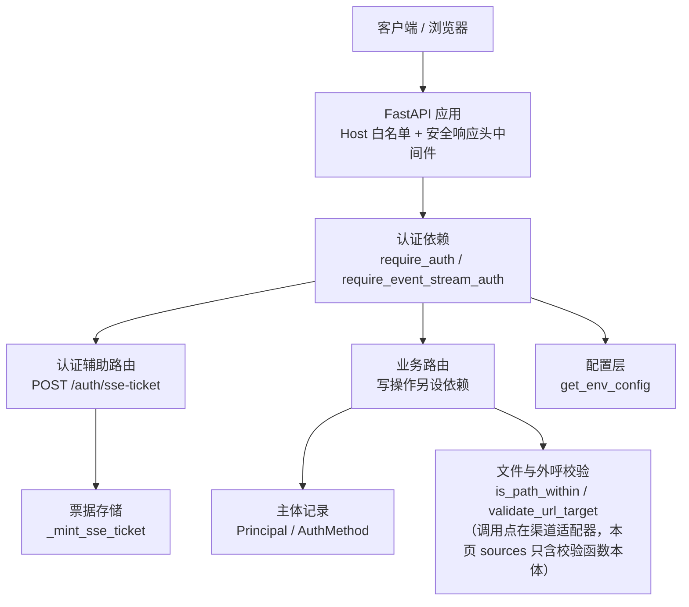
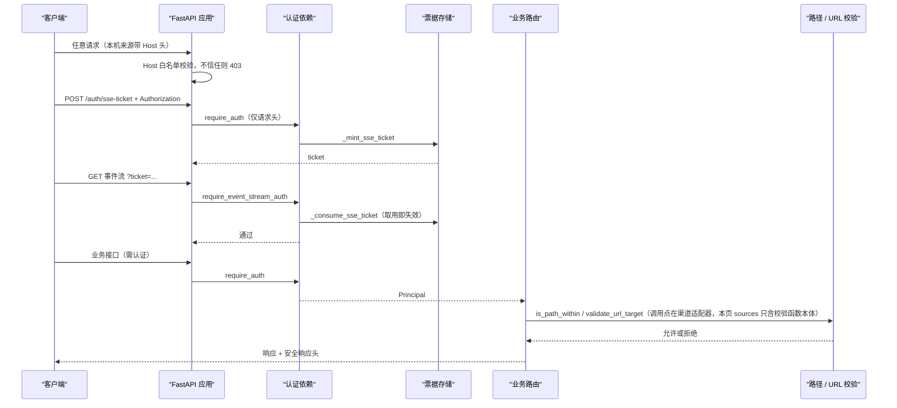
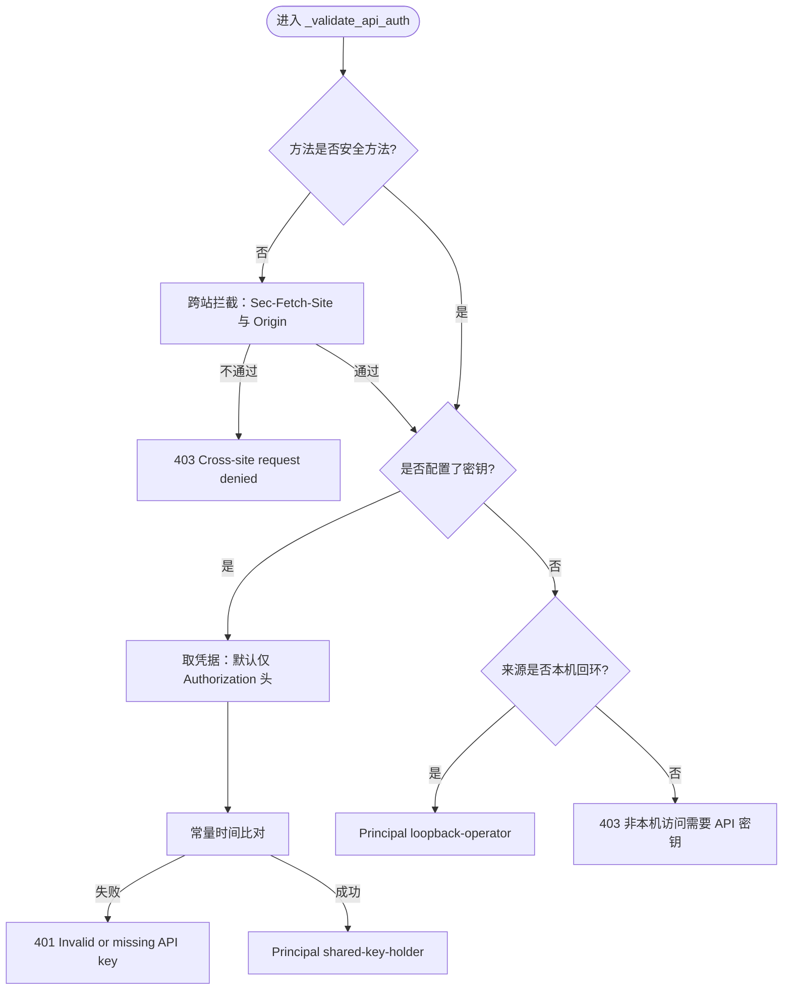
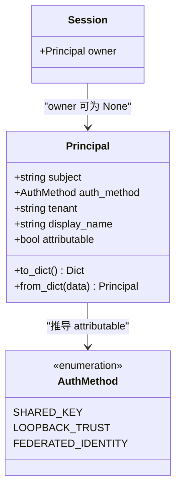
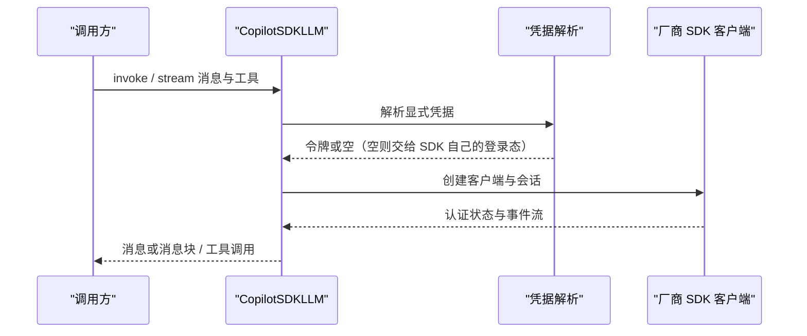
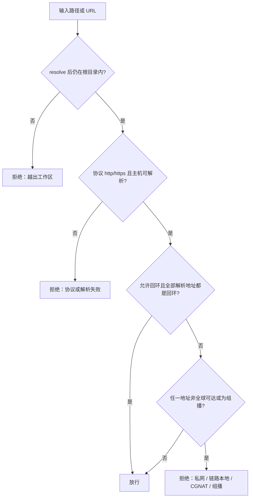
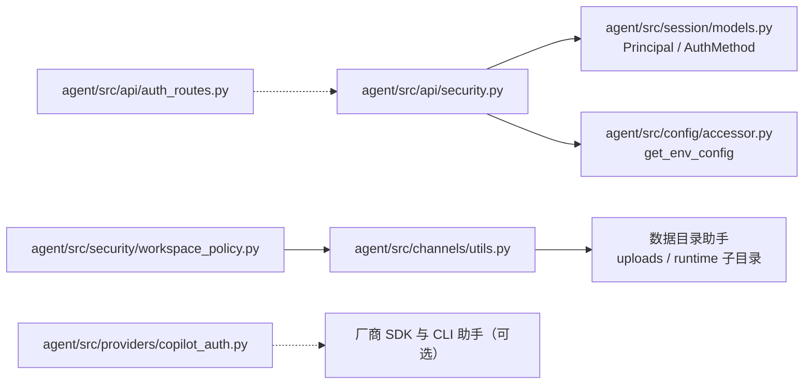

# 认证与授权

<cite>
**本文引用的文件**
- [agent/src/api/auth_routes.py](file://agent/src/api/auth_routes.py)
- [agent/src/api/security.py](file://agent/src/api/security.py)
- [agent/src/channels/utils.py](file://agent/src/channels/utils.py)
- [agent/src/config/accessor.py](file://agent/src/config/accessor.py)
- [agent/src/providers/copilot_auth.py](file://agent/src/providers/copilot_auth.py)
- [agent/src/security/workspace_access.py](file://agent/src/security/workspace_access.py)
- [agent/src/security/workspace_policy.py](file://agent/src/security/workspace_policy.py)
- [agent/src/session/models.py](file://agent/src/session/models.py)
</cite>

## 目录
1. [简介](#简介)
2. [项目结构](#项目结构)
3. [核心组件](#核心组件)
4. [架构总览](#架构总览)
5. [详细组件分析](#详细组件分析)
6. [依赖关系分析](#依赖关系分析)
7. [性能与安全考量](#性能与安全考量)
8. [故障排除指南](#故障排除指南)
9. [结论](#结论)
10. [附录：配置要点与边界](#附录配置要点与边界)

## 简介
本文件面向安全工程师与系统管理员，说明当前代码里的认证与授权实现：
- API 认证依赖与凭据校验顺序：共享密钥优先，未配置密钥时才回环信任
- 浏览器 `EventSource` 用的一次性 SSE 票据机制
- 主体模型 `Principal` 与 `AuthMethod`：授权成功不等于身份可归因
- 安全中间件：DNS 重绑定防护、安全响应头、CORS 白名单、访问日志脱敏
- 配置访问层 `get_env_config`：线程安全单例与旧别名兼容；LLM provider 的凭据解析则整体委托给厂商 SDK
- 工作区路径与外呼 URL 目标的访问控制

三条贯穿全篇的边界，先说结论：
- 凭据实际只从 `Authorization` 头取（`allow_query` 通道默认关闭）；唯一进 URL 的是 `?ticket=`，而票据一次性且约 60 秒过期
- 共享密钥与回环信任都只证明"持密者/本机操作员"，不证明"某个人"，因此 `Principal.attributable` 恒为 `False`
- 文件访问默认锁在工作区根目录内，外呼 URL 默认只允许全球可路由的 `http`/`https` 目标

## 项目结构
围绕认证与授权的关键代码分布：
- API 安全与认证依赖：`agent/src/api/security.py`（Bearer 校验、SSE 票据、CORS/Host 解析、中间件、日志脱敏、shell 工具开关）
- 认证辅助路由：`agent/src/api/auth_routes.py`（`POST /auth/sse-ticket`，票据存储与校验仍在 `agent/src/api/security.py`）
- 主体与会话模型：`agent/src/session/models.py`（`AuthMethod`、`Principal`、`Session.owner`）；配置访问：`agent/src/config/accessor.py`（环境变量单例与别名读取）
- 渠道侧文件与外呼安全：`agent/src/channels/utils.py`（`is_path_within`、`validate_url_target`）；兼容层：`agent/src/security/workspace_policy.py`（再导出 `is_path_within`）与 `agent/src/security/workspace_access.py`（作用域元数据键、异常类型）
- provider 认证适配：`agent/src/providers/copilot_auth.py`（SDK 型 provider 的一个实例）

**图示来源**
- [agent/src/api/security.py:166-173](file://agent/src/api/security.py#L166-L173)
- [agent/src/api/security.py:235-253](file://agent/src/api/security.py#L235-L253)
- [agent/src/api/security.py:571-622](file://agent/src/api/security.py#L571-L622)
- [agent/src/api/security.py:303-340](file://agent/src/api/security.py#L303-L340)
- [agent/src/api/auth_routes.py:44-55](file://agent/src/api/auth_routes.py#L44-L55)
- [agent/src/session/models.py:41-79](file://agent/src/session/models.py#L41-L79)
- [agent/src/channels/utils.py:55-61](file://agent/src/channels/utils.py#L55-L61)
- [agent/src/channels/utils.py:146-190](file://agent/src/channels/utils.py#L146-L190)

**章节来源**
- [agent/src/api/security.py:1-1](file://agent/src/api/security.py#L1-L1)
- [agent/src/api/auth_routes.py:1-10](file://agent/src/api/auth_routes.py#L1-L10)
- [agent/src/security/workspace_policy.py:1-11](file://agent/src/security/workspace_policy.py#L1-L11)
- [agent/src/security/workspace_access.py:1-14](file://agent/src/security/workspace_access.py#L1-L14)

## 核心组件
- 认证依赖（`agent/src/api/security.py`）
  - `require_auth`：敏感接口的 Bearer 校验，返回 `Principal`
  - `require_event_stream_auth`：事件流专用，先试 Bearer、再试一次性票据
  - `require_local_or_auth` / `require_settings_write_auth`：设置读写与写操作保护
  - `_require_shutdown_authorization`：本机控制面动作的独立授权路径
  - `_validate_api_auth`：`require_auth` 的实现体，也是 `require_local_or_auth` 有密钥分支的落点；`require_event_stream_auth`、`require_settings_write_auth`、`_require_shutdown_authorization` 各自内联同一条"密钥优先、再回环"次序，不经它
- SSE 票据
  - `_mint_sse_ticket` / `_consume_sse_ticket` / `_sweep_expired_sse_tickets_locked`：进程内内存表 + 锁
- 主体与认证方法（`agent/src/session/models.py`）
  - `AuthMethod`：`shared_key`、`loopback_trust`、`federated_identity`
  - `Principal`：`subject`、`auth_method`、`tenant`、`display_name`、`attributable`
  - `ATTRIBUTABLE_AUTH_METHODS`：目前只有 `federated_identity`
- 配置访问（`agent/src/config/accessor.py`）
  - `get_env_config`：双检锁单例；`reset_env_config` 在运行期改环境变量后失效缓存
  - `get_env_or` / `get_env_value`：旧别名与数据驱动注册表的窄读取
- 工作区与外呼安全（`agent/src/channels/utils.py`）
  - `is_path_within`：解析后的绝对路径必须落在根目录内
  - `validate_url_target`：协议、主机解析、解析后 IP 的全局可达性

**章节来源**
- [agent/src/api/security.py:434-451](file://agent/src/api/security.py#L434-L451)
- [agent/src/api/security.py:463-504](file://agent/src/api/security.py#L463-L504)
- [agent/src/api/security.py:311-340](file://agent/src/api/security.py#L311-L340)
- [agent/src/session/models.py:17-38](file://agent/src/session/models.py#L17-L38)
- [agent/src/config/accessor.py:52-92](file://agent/src/config/accessor.py#L52-L92)
- [agent/src/channels/utils.py:55-61](file://agent/src/channels/utils.py#L55-L61)
- [agent/src/channels/utils.py:146-190](file://agent/src/channels/utils.py#L146-L190)

## 架构总览
从请求进入到认证、票据、会话归属与外呼校验的整体顺序：

**图示来源**
- [agent/src/api/security.py:166-173](file://agent/src/api/security.py#L166-L173)
- [agent/src/api/auth_routes.py:44-55](file://agent/src/api/auth_routes.py#L44-L55)
- [agent/src/api/security.py:591-622](file://agent/src/api/security.py#L591-L622)
- [agent/src/api/security.py:235-253](file://agent/src/api/security.py#L235-L253)
- [agent/src/channels/utils.py:55-61](file://agent/src/channels/utils.py#L55-L61)
- [agent/src/channels/utils.py:146-190](file://agent/src/channels/utils.py#L146-L190)

## 详细组件分析

### 认证依赖与凭据校验
`_validate_api_auth` 的判定顺序即代码顺序，不是文档顺序：
1. 方法不在 `_SAFE_BROWSER_METHODS`（`GET`/`HEAD`/`OPTIONS`）里时，先做跨站浏览器请求拦截
2. 取当前配置的密钥：命中密钥配置时，**任何**来源（含回环）都必须出示有效凭据，缺或错即 401
3. 比对成功返回 `Principal(subject=SHARED_KEY_SUBJECT, auth_method=AuthMethod.SHARED_KEY)`
4. 只有未配置密钥时才走回环信任：本机来源返回 `LOOPBACK_TRUST` 主体
5. 非本机且无密钥可配 → 403

要点：
- 凭据比较用 `hmac.compare_digest`，避免按字节早退造成的时间侧信道
- 凭据来源由 `allow_query` 开关控制，默认 `False`：`require_auth` 与两个写依赖都只接受请求头，密钥不进 URL
- 密钥解析走配置层，旧别名在服务器侧归一，因此 `API_AUTH_KEY` 与历史别名得到同一个键
- `_validate_api_auth` 的返回值是后加的：老调用方继续忽略它，需要记录"谁做了这件事"的路由才声明 `principal: Principal = Depends(require_auth)`
- 跨站拦截 `_reject_cross_site_browser_request` 只有两条规则：`Sec-Fetch-Site: cross-site` 直接 403；带 `Origin` 时既不是回环来源、也不是同站则 403。同站判定比较主机与端口，缺省端口按 `https`→443、其余→80 补齐
- 该拦截只作用于不安全方法，`GET`/`HEAD`/`OPTIONS` 不拦，浏览器事件流因此由票据与 Bearer 那一层把关

**图示来源**
- [agent/src/api/security.py:463-504](file://agent/src/api/security.py#L463-L504)
- [agent/src/api/security.py:61-61](file://agent/src/api/security.py#L61-L61)

**章节来源**
- [agent/src/api/security.py:463-504](file://agent/src/api/security.py#L463-L504)
- [agent/src/api/security.py:355-380](file://agent/src/api/security.py#L355-L380)
- [agent/src/api/security.py:383-431](file://agent/src/api/security.py#L383-L431)
- [agent/src/api/security.py:454-460](file://agent/src/api/security.py#L454-L460)
- [agent/src/api/security.py:571-588](file://agent/src/api/security.py#L571-L588)
- [agent/src/api/security.py:347-352](file://agent/src/api/security.py#L347-L352)

### SSE 票据与事件流认证
`EventSource` 发不出 `Authorization` 头，所以浏览器先用请求头认证的密钥换一个一次性票据，再用 `?ticket=` 开流；长生命周期的密钥因此不出现在 URL、浏览器历史与访问日志里。
- 票据存储是进程内的 `dict`（票据值 → 单调时钟过期时间），配 `threading.Lock`；有效期常量约 60 秒
- `_mint_sse_ticket` 用 URL 安全的随机值，铸造前先扫一遍过期项
- `_consume_sse_ticket` 在第一次查找时就把票据 `pop` 出来：无论是否已过期，被截获的票据都无法二次使用
- `require_event_stream_auth` 在配置了密钥时的次序是：先试 Bearer，命中即放行；否则试 `?ticket=`；两者都不行 → 401
- 未配置密钥时退化为回环信任；`require_event_stream_auth` 不返回主体，只做通过/拒绝
- 路由侧只暴露铸造入口：`POST /auth/sse-ticket` 挂在 `require_auth` 之下，返回 `{"ticket": ...}`

**章节来源**
- [agent/src/api/security.py:303-340](file://agent/src/api/security.py#L303-L340)
- [agent/src/api/security.py:591-622](file://agent/src/api/security.py#L591-L622)
- [agent/src/api/auth_routes.py:21-55](file://agent/src/api/auth_routes.py#L21-L55)

### 安全中间件：Host 白名单、响应头与日志脱敏
- DNS 重绑定防护：本机来源的请求必须带受信回环 `Host`，否则 403；默认名单含 `localhost`、`127.0.0.1`、`::1`、`[::1]`、`testserver`，追加项走配置字段 `api_allowed_hosts`（配置侧只做去空白、转小写、去掉尾点，**不去端口**；去端口只发生在请求头一侧，所以配成带端口的值会留下一条永远匹配不上的条目）
- 安全响应头：CSP、`X-Content-Type-Options: nosniff`、`X-Frame-Options: DENY`、`Permissions-Policy`、`Referrer-Policy`，全部用 `setdefault` 以免覆盖上游已设的值
- CSP 默认严格同源，内联样式与 `data:` 图片/字体例外；`/docs` 与 `/redoc` 两个路径用一套放宽到必要 CDN 的专用策略
- `VIBE_TRADING_CSP_REPORT_ONLY` 打开时改发 `Content-Security-Policy-Report-Only`，作为灰度回滚开关
- HSTS 故意不在这里设：应用常部署在 TLS 终止的反代之后，无法保证始终 HTTPS，应由反代/入口层设
- 访问日志脱敏：正则只替换 `api_key=` / `ticket=` 的**值**，保留参数名，占位符为固定文本；过滤器挂在 Uvicorn 的 access/error logger 上且幂等
- 本机来源判定 `_is_local_client`：`localhost`/`testclient`、回环 IP，以及显式开关下的 Docker 宿主网关 IP（从 `procfs` 路由表读默认网关）
- CORS：默认只列回环开发端口；`CORS_ORIGINS` 是**替换**语义，出现 `*` 直接抛 `RuntimeError`；`VIBE_TRADING_EXTRA_CORS_ORIGINS` 是**追加**语义，同样拒绝 `*`，因为它扩的是带凭据的跨域面

**章节来源**
- [agent/src/api/security.py:166-173](file://agent/src/api/security.py#L166-L173)
- [agent/src/api/security.py:53-61](file://agent/src/api/security.py#L53-L61)
- [agent/src/api/security.py:106-136](file://agent/src/api/security.py#L106-L136)
- [agent/src/api/security.py:181-232](file://agent/src/api/security.py#L181-L232)
- [agent/src/api/security.py:235-253](file://agent/src/api/security.py#L235-L253)
- [agent/src/api/security.py:260-296](file://agent/src/api/security.py#L260-L296)
- [agent/src/api/security.py:507-553](file://agent/src/api/security.py#L507-L553)
- [agent/src/api/security.py:30-37](file://agent/src/api/security.py#L30-L37)
- [agent/src/api/security.py:69-103](file://agent/src/api/security.py#L69-L103)
- [agent/src/api/security.py:147-158](file://agent/src/api/security.py#L147-L158)

### 主体与认证方法（Principal/AuthMethod）
- `AuthMethod` 是 `str, Enum`：`SHARED_KEY`、`LOOPBACK_TRUST`、`FEDERATED_IDENTITY`；最后一个当前不可达，只是给 `attributable` 留一个 `True` 的落点，让下游按枚举分支而不是自己造字符串
- `ATTRIBUTABLE_AUTH_METHODS` 只含 `FEDERATED_IDENTITY`
- `Principal` 是 frozen dataclass，`attributable` 声明为 `init=False`，在 `__post_init__` 里由 `auth_method` 推导：调用方不能自己声明"这个主体可归因"
- `subject` 去空白后为空会抛 `ValueError`
- `to_dict` 显式带上 `attributable`，`from_dict` 忽略输入里的这个字段并按 `auth_method` 重算——被改写过的历史记录拿不到它没有的归因能力
- `Session.owner` 可为 `None`：`None` 是"归属未知"（早于主体概念、或无请求上下文的路径创建），与"有主体但不可归因"是两件事，不能合并处理

需要具名人的控制（双人复核、外部报送）必须先看 `attributable` 并拒绝，而不是把 `subject` 当人名引用。

**图示来源**
- [agent/src/session/models.py:17-38](file://agent/src/session/models.py#L17-L38)
- [agent/src/session/models.py:41-119](file://agent/src/session/models.py#L41-L119)
- [agent/src/session/models.py:142-167](file://agent/src/session/models.py#L142-L167)

**章节来源**
- [agent/src/session/models.py:17-38](file://agent/src/session/models.py#L17-L38)
- [agent/src/session/models.py:41-119](file://agent/src/session/models.py#L41-L119)
- [agent/src/session/models.py:169-178](file://agent/src/session/models.py#L169-L178)
- [agent/src/api/security.py:454-460](file://agent/src/api/security.py#L454-L460)

### 写操作与本地控制面
- `require_local_or_auth`：配了密钥就转交 `require_auth`；没配则只允许本机来源，否则 403
- `require_settings_write_auth`：改凭据路由类设置前的显式授权。不安全方法先做跨站拦截，再要求**仅请求头**的有效凭据；无密钥配置时要求本机来源
- `_require_shutdown_authorization`：关停类控制面动作走同样的密钥优先逻辑，但只接受请求头凭据
- shell 类工具不在认证依赖里判定：`_env_shell_tools_enabled` / `_shell_tools_enabled_for_request` 只读配置开关，当前对每个请求返回同一结果

**章节来源**
- [agent/src/api/security.py:625-637](file://agent/src/api/security.py#L625-L637)
- [agent/src/api/security.py:640-659](file://agent/src/api/security.py#L640-L659)
- [agent/src/api/security.py:434-451](file://agent/src/api/security.py#L434-L451)
- [agent/src/api/security.py:556-563](file://agent/src/api/security.py#L556-L563)

### 配置访问层与别名兼容
- `get_env_config` 返回缓存的 `EnvConfig` 单例：先无锁快路径，再用模块级 `threading.Lock` 做双检锁，避免并发调用看到半成品或建出两份
- `reset_env_config` 在同一把锁下清缓存；典型调用方是写入本机配置文件并补丁 `os.environ` 之后的设置路由
- `get_env_or(primary, fallback, default)` 先读新名、再读旧别名，这是 `VIBE_TRADING_API_KEY` → `API_AUTH_KEY` 这类改名的兼容入口
- `get_env_value` 是给"运行时才确定变量名"的窄口子，例如 provider 凭据元数据注册表
- `_parse_bool` 的注释称这是全仓布尔解析的唯一来源：`1`/`true`/`yes`/`on`（去空白、转小写）为真，其余（含 `None`、空串）为假；配置模型层另有布尔强制（不在本页 sources 内，故本页不作断言）
- `security.py` 侧保留 `_API_KEY`、`_CORS_ORIGINS`、`_EXTRA_LOOPBACK_HOSTS` 三个旧模块属性名，通过模块级 `__getattr__` 每次现算，实际值仍来自配置层

**章节来源**
- [agent/src/config/accessor.py:52-92](file://agent/src/config/accessor.py#L52-L92)
- [agent/src/config/accessor.py:95-148](file://agent/src/config/accessor.py#L95-L148)
- [agent/src/config/accessor.py:1-14](file://agent/src/config/accessor.py#L1-L14)
- [agent/src/api/security.py:662-672](file://agent/src/api/security.py#L662-L672)
- [agent/src/api/security.py:355-366](file://agent/src/api/security.py#L355-L366)

### provider 凭据解析（委托厂商 SDK）
`agent/src/providers/copilot_auth.py` 是"把一个 SDK 型 provider 接进来"的样例：认证与传输都交给厂商官方 SDK，本仓不自己实现 OAuth、也不借用编辑器的身份。
- 凭据解析次序：显式环境变量 → 命令行助手取令牌；令牌必须过前缀白名单才算受支持，白名单常量与解析入口在同一文件里
- 解析不到显式凭据时不注入任何选项，让 SDK 用它自己的已存登录态；显式取到才作为 SDK 选项传入
- `get_copilot_auth_status` 在独立线程里跑一次事件循环，向 SDK 要认证状态；SDK 未安装时返回安装指引而不是抛栈
- 消息与工具定义先转成"单轮 SDK 调用"：系统消息单独摘出，历史转录序列化为提示词并要求只续写下一条助手回复；工具名缺名就跳过
- `CopilotSDKLLM` 提供 `invoke`/`stream`/`ainvoke`：非流式一次拿全量并回填 `tool_calls`；流式版本在后台线程里把增量转成消息块，异常经队列原样抛出，`finally` 里置取消事件
- 取消与超时：每次调用起一个 runtime，等待完成事件或工具请求事件；取消事件轮询命中（`copilot_auth.py:299`）与拿到工具调用（`:325`）各自显式 `abort`，超时分支只取消三个 asyncio 任务（`:316-317`），runtime 由 `async with` 退出释放

凭据边界：这里的令牌是**上游 provider 的**凭据，与本文前述的本机 API 密钥是两条独立的通路，不互相替代。

**图示来源**
- [agent/src/providers/copilot_auth.py:51-70](file://agent/src/providers/copilot_auth.py#L51-L70)
- [agent/src/providers/copilot_auth.py:73-101](file://agent/src/providers/copilot_auth.py#L73-L101)
- [agent/src/providers/copilot_auth.py:332-347](file://agent/src/providers/copilot_auth.py#L332-L347)

**章节来源**
- [agent/src/providers/copilot_auth.py:1-6](file://agent/src/providers/copilot_auth.py#L1-L6)
- [agent/src/providers/copilot_auth.py:23-58](file://agent/src/providers/copilot_auth.py#L23-L58)
- [agent/src/providers/copilot_auth.py:129-190](file://agent/src/providers/copilot_auth.py#L129-L190)
- [agent/src/providers/copilot_auth.py:193-201](file://agent/src/providers/copilot_auth.py#L193-L201)
- [agent/src/providers/copilot_auth.py:266-329](file://agent/src/providers/copilot_auth.py#L266-L329)
- [agent/src/providers/copilot_auth.py:349-380](file://agent/src/providers/copilot_auth.py#L349-L380)
- [agent/src/providers/copilot_auth.py:442-459](file://agent/src/providers/copilot_auth.py#L442-L459)

### 工作区访问控制与路径安全
- `is_path_within`：把待检查路径与根目录都 `resolve()` 后再取 `relative_to`，抛 `ValueError` 即判为越界——因此符号链接、`..` 这类绕过在解析阶段就失效
- 兼容层不复制逻辑：`agent/src/security/workspace_policy.py` 只是把同一个函数再导出给移植进来的渠道代码；`agent/src/security/workspace_access.py` 提供作用域元数据键与一个带 `message` 便捷属性的异常类型
- 渠道媒体与运行时目录都落在数据目录之下：入站媒体进 `uploads/<渠道名>`，运行期子目录进 `runtime/<名>`，两者都会就地建目录；文件名先过 `safe_filename` 把路径分隔与保留字符换成下划线
- `validate_url_target` 返回 `(ok, error)`，次序是：协议必须 `http`/`https` → 主机名存在 → `getaddrinfo` 能解析 → 允许回环时先做回环目标判定（`_is_allowed_loopback_target`） → 任一解析地址不合格即拒绝
- `_is_private` 的判定是"非全球可达或组播"，因此一次覆盖回环、链路本地、RFC1918、保留段与 CGNAT 段，并显式补上组播（组播的 `is_global` 为真，不能指望前一项）
- `allow_loopback` 的判据只看解析结果：除 `localhost`/`localhost.` 外，主机名是否为字面量从不参与判断，只要**全部**解析地址都是回环就放行——某个公网域名恰好解析到回环同样会被放行；RFC1918/链路本地/元数据地址不属回环，仍被拒
- `_is_allowed_loopback_target` 的 docstring（`channels/utils.py:197`）与 `validate_url_target` 的 docstring（`:149-152`）都写作"只放行字面回环主机、不因公网域名解析到回环而放行"，与上面这条实现不一致——本页按实现写
- `validate_resolved_url` 是同名旧入口的薄封装，行为完全一致
- 邮件通道的 TLS 上下文集中在 `email_tls_context`：默认校验证书与主机名，`verify=False` 是显式写出的豁免，代价是放弃中间人防护

**图示来源**
- [agent/src/channels/utils.py:55-61](file://agent/src/channels/utils.py#L55-L61)
- [agent/src/channels/utils.py:146-190](file://agent/src/channels/utils.py#L146-L190)
- [agent/src/channels/utils.py:193-228](file://agent/src/channels/utils.py#L193-L228)

**章节来源**
- [agent/src/channels/utils.py:27-52](file://agent/src/channels/utils.py#L27-L52)
- [agent/src/channels/utils.py:103-105](file://agent/src/channels/utils.py#L103-L105)
- [agent/src/channels/utils.py:127-143](file://agent/src/channels/utils.py#L127-L143)
- [agent/src/channels/utils.py:146-228](file://agent/src/channels/utils.py#L146-L228)
- [agent/src/security/workspace_access.py:1-14](file://agent/src/security/workspace_access.py#L1-L14)
- [agent/src/security/workspace_policy.py:1-11](file://agent/src/security/workspace_policy.py#L1-L11)

## 依赖关系分析
- `agent/src/api/security.py` 从会话模型取 `AuthMethod`/`Principal`，从配置层取 `get_env_config`，从 FastAPI 取 `Request`/`Security`/`HTTPBearer`/`HTTPException`
- `agent/src/api/auth_routes.py` 不 import 安全模块的顶层，而是在注册函数内部再取 `_mint_sse_ticket`；缺省的 `require_auth` 通过 `sys.modules` 从宿主模块解析，解析不到直接抛 `RuntimeError`，不静默降级
- `agent/src/security/workspace_policy.py` 依赖 `agent/src/channels/utils.py`；`agent/src/channels/utils.py` 依赖数据目录助手与标准库 `ipaddress`/`socket`/`ssl`
- `agent/src/providers/copilot_auth.py` 只硬依赖消息类型，SDK 与 CLI 助手都是可选路径

**图示来源**
- [agent/src/api/security.py:16-23](file://agent/src/api/security.py#L16-L23)
- [agent/src/api/auth_routes.py:21-45](file://agent/src/api/auth_routes.py#L21-L45)
- [agent/src/security/workspace_policy.py:1-11](file://agent/src/security/workspace_policy.py#L1-L11)
- [agent/src/channels/utils.py:1-16](file://agent/src/channels/utils.py#L1-L16)
- [agent/src/providers/copilot_auth.py:193-216](file://agent/src/providers/copilot_auth.py#L193-L216)

**章节来源**
- [agent/src/api/security.py:16-23](file://agent/src/api/security.py#L16-L23)
- [agent/src/api/auth_routes.py:33-44](file://agent/src/api/auth_routes.py#L33-L44)
- [agent/src/providers/copilot_auth.py:8-24](file://agent/src/providers/copilot_auth.py#L8-L24)

## 性能与安全考量
- 票据表是进程内内存结构，铸造与消费前各做一次过期清扫，规模由并发浏览器连接决定，进程重启即失效——多进程部署时票据不共享，这既是隔离也是限制
- 密钥比较走常量时间路径，票据查表用 `pop` 一次成型，避免"先查后删"的竞态窗口
- 配置单例带锁，热路径先做无锁判空；运行期改动必须显式 `reset_env_config` 才可见，否则新旧值在不同线程里不一致
- 路径校验把 `resolve()` 作为代价换取符号链接一致性；URL 校验只做一次 DNS 解析，解析结果与真正发起连接时的结果之间仍有重绑定窗口，这一层只由"解析时即拒绝非全球可达/组播地址"间接压缩——本页 sources 内没有连接前二次解析或按已解析 IP 建连的实现
- CORS 的两种语义要分清：替换与追加。误用替换会连带丢掉内置 Web UI 依赖的回环来源；带凭据的跨域下通配一律抛错
- CSP 只放必要项，文档页的单列例外比全局放宽更安全；报告模式开关是给异常部署留的回滚口；归因性同样优先于便利性——`attributable` 由枚举推导而非入参，宁可少一个可用主体，也不给下游一个看起来像人名的字符串

**章节来源**
- [agent/src/api/security.py:306-340](file://agent/src/api/security.py#L306-L340)
- [agent/src/api/security.py:489-497](file://agent/src/api/security.py#L489-L497)
- [agent/src/config/accessor.py:62-92](file://agent/src/config/accessor.py#L62-L92)
- [agent/src/channels/utils.py:55-61](file://agent/src/channels/utils.py#L55-L61)
- [agent/src/channels/utils.py:146-190](file://agent/src/channels/utils.py#L146-L190)
- [agent/src/api/security.py:147-158](file://agent/src/api/security.py#L147-L158)
- [agent/src/session/models.py:74-79](file://agent/src/session/models.py#L74-L79)

## 故障排除指南
- 建不起事件流
  - 先 `POST /auth/sse-ticket` 拿票据，再用 `?ticket=` 开流；票据约 60 秒过期且一次性，重连要重新申请
  - 直连时先用请求头凭据试一次：配置了密钥时，请求头命中就无需票据
  - 没配密钥时只信任本机来源，跨机访问会被 403
- 401 与 403 的含义不同
  - 401：配了密钥但凭据缺失或不匹配（请求头路径）
  - 403：非本机访问且未配置密钥；跨站浏览器请求被拦；本机来源带了不受信的 `Host`
- 设置类写入被拒
  - 写依赖只认请求头凭据，把密钥拼在查询串里不会生效；无密钥配置时要求本机来源
- 路径或外呼被拒
  - 路径：确认解析后的绝对路径仍在根目录内
  - URL：协议须 `http`/`https`，域名要能解析，且解析地址不能是私网/链路本地/CGNAT/组播；需要访问本机服务时（`allow_loopback=True`）只看解析结果——全部解析地址都是回环即放行，主机名是否字面回环不参与判断
- provider 侧认证不通过
  - 显式凭据要满足受支持前缀，否则解析视为未提供；也可由命令行助手提供
  - SDK 未安装时状态接口返回安装指引；这类失败不会退回本机 API 密钥
- 日志里看不到完整凭据
  - 这是预期行为：敏感查询串的值在访问日志里被替换为固定占位符

**章节来源**
- [agent/src/api/security.py:591-622](file://agent/src/api/security.py#L591-L622)
- [agent/src/api/security.py:463-504](file://agent/src/api/security.py#L463-L504)
- [agent/src/api/security.py:166-173](file://agent/src/api/security.py#L166-L173)
- [agent/src/api/security.py:640-659](file://agent/src/api/security.py#L640-L659)
- [agent/src/channels/utils.py:146-228](file://agent/src/channels/utils.py#L146-L228)
- [agent/src/providers/copilot_auth.py:23-58](file://agent/src/providers/copilot_auth.py#L23-L58)
- [agent/src/api/security.py:260-296](file://agent/src/api/security.py#L260-L296)

## 结论
本仓的授权模型目前只有两条通路：共享密钥与无密钥时的本机回环信任，且次序是密钥优先——配了密钥之后回环也必须出示凭据。浏览器侧的事件流用一次性票据替代把长生命密钥塞进 URL。安全中间件（受信回环 `Host`、CSP 与安全头、CORS 白名单、访问日志脱敏）与资源侧边界（工作区内路径、外呼 URL 的地址可达性）把"认证通过"之后的可达面继续收窄。主体层的取舍最值得注意：它承认自己拿不到身份，并用一个不可由调用方设置的标志位把这件事写进数据模型，等真的接进身份提供者时再放开。

**章节来源**
- [agent/src/api/security.py:463-504](file://agent/src/api/security.py#L463-L504)
- [agent/src/session/models.py:41-79](file://agent/src/session/models.py#L41-L79)
- [agent/src/channels/utils.py:146-190](file://agent/src/channels/utils.py#L146-L190)

## 附录：配置要点与边界
| 配置项 | 语义 | 缺省行为 |
| --- | --- | --- |
| `API_AUTH_KEY`（旧别名 `VIBE_TRADING_API_KEY`） | 共享密钥，服务器侧归一后由配置字段 `api_auth_key` 读出 | 为空则启用回环信任 |
| `CORS_ORIGINS` | 替换默认回环来源列表；含 `*` 直接抛错 | 内置回环开发端口 |
| `VIBE_TRADING_EXTRA_CORS_ORIGINS` | 追加可信来源；含 `*` 同样抛错 | 空，须在中间件构建前就在进程环境里 |
| `api_allowed_hosts` | 追加受信回环 `Host` 名 | 内置回环主机名集合 |
| `vibe_trading_csp_report_only` | CSP 改为报告模式 | 关闭，即强制执行 |
| `vibe_trading_trust_docker_loopback` | 把容器视为本机来源（以宿主默认网关 IP 判定） | 关闭 |
| `vibe_trading_enable_shell_tools` | 是否对请求暴露 shell 类工具 | 关闭 |
| `COPILOT_GITHUB_TOKEN` / `GH_TOKEN` / `GITHUB_TOKEN` | provider 侧凭据，按次序尝试并过前缀白名单 | 缺省交给 SDK 自身登录态 |

实践建议：
- 对外暴露就配密钥：回环信任只在"确实没有密钥"时生效，而 `_is_local_client` 会承认容器来源
- 密钥只放请求头；URL 里只允许一次性票据
- 需要具名人的流程先检查 `Principal.attributable`，当前它恒为 `False`
- 文件访问一律先 `is_path_within`，外呼先 `validate_url_target`；`allow_loopback` 只在确有本机服务需求时开
- TLS 与 HSTS 在终止 TLS 的那一层配，不要指望应用响应头
- 凭据示意统一写 `<redacted>`，示例里不要放任何看似可用的值

**章节来源**
- [agent/src/api/security.py:39-51](file://agent/src/api/security.py#L39-L51)
- [agent/src/api/security.py:113-115](file://agent/src/api/security.py#L113-L115)
- [agent/src/api/security.py:228-232](file://agent/src/api/security.py#L228-L232)
- [agent/src/api/security.py:546-563](file://agent/src/api/security.py#L546-L563)
- [agent/src/api/security.py:355-366](file://agent/src/api/security.py#L355-L366)
- [agent/src/config/accessor.py:116-138](file://agent/src/config/accessor.py#L116-L138)
- [agent/src/providers/copilot_auth.py:23-58](file://agent/src/providers/copilot_auth.py#L23-L58)
- [agent/src/channels/utils.py:146-190](file://agent/src/channels/utils.py#L146-L190)
