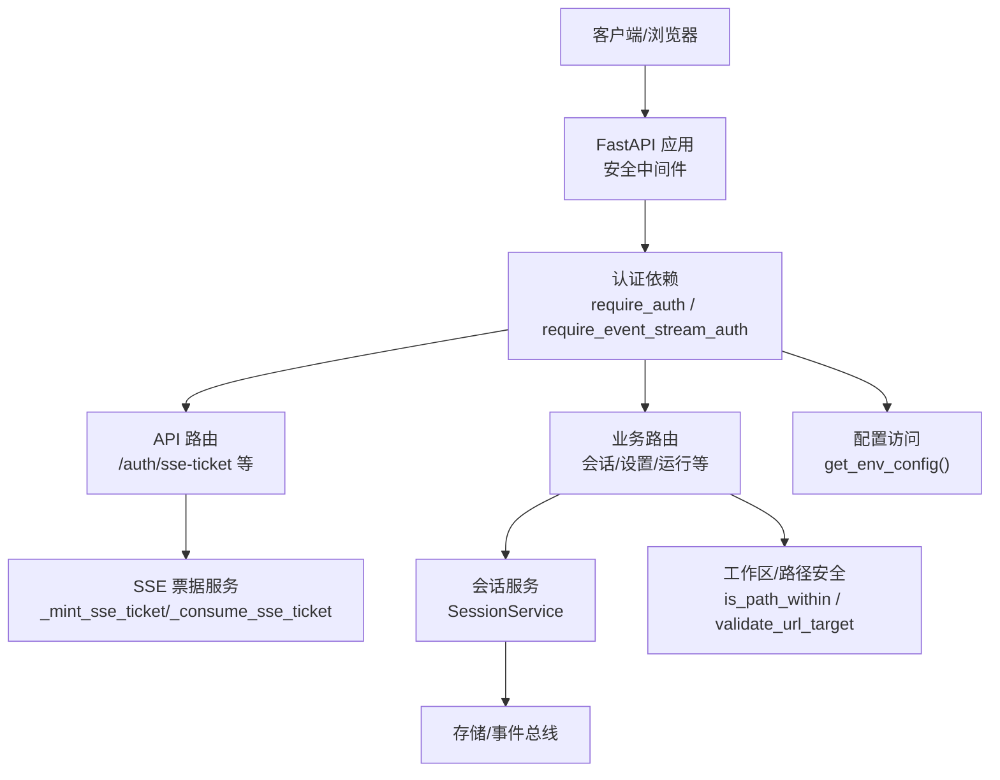
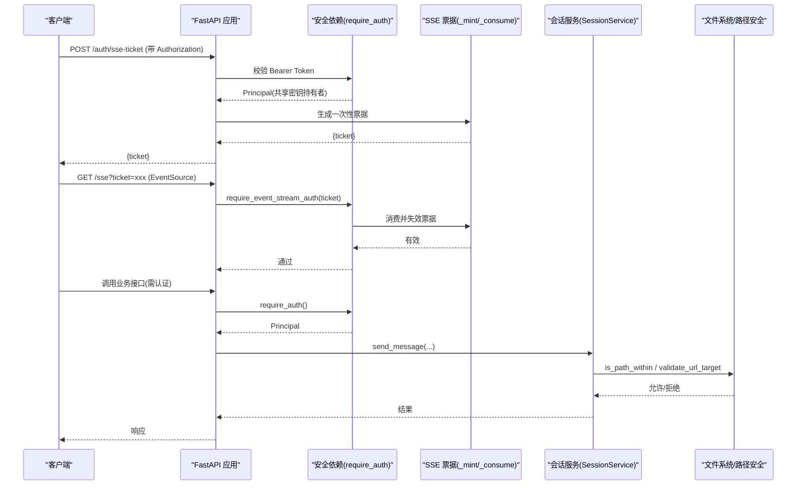
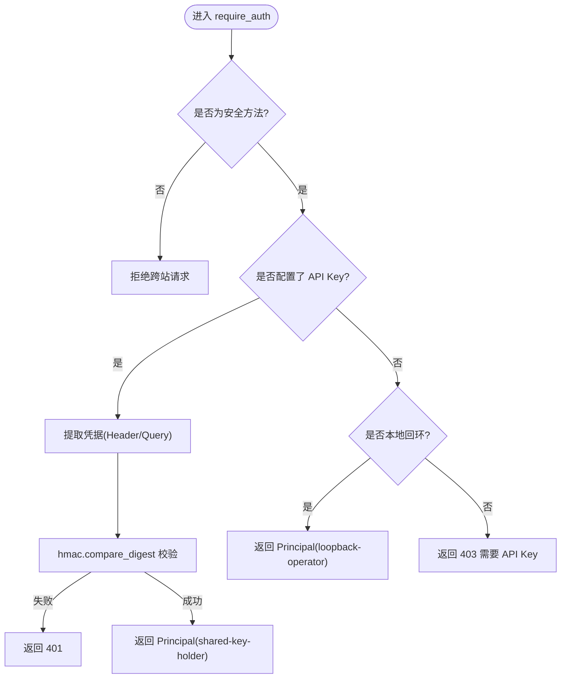
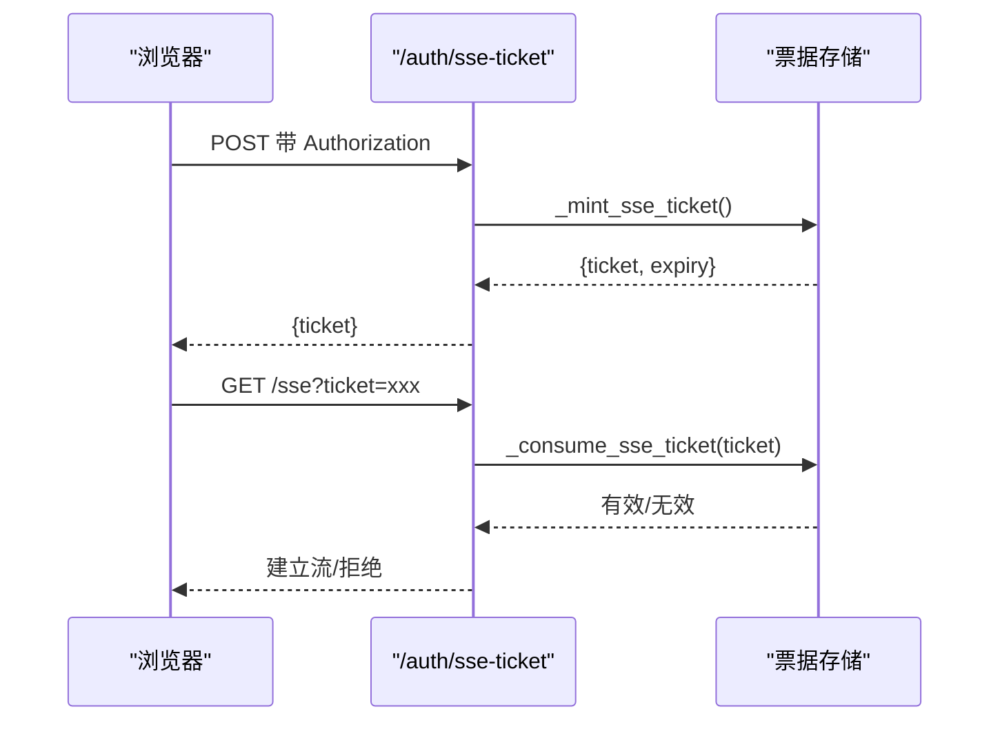
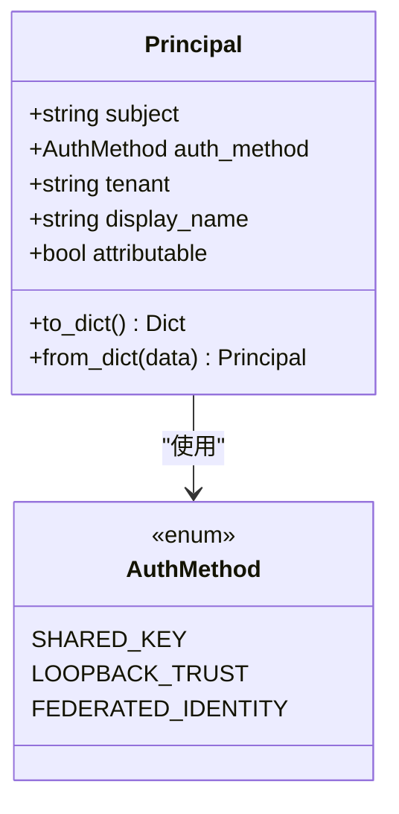
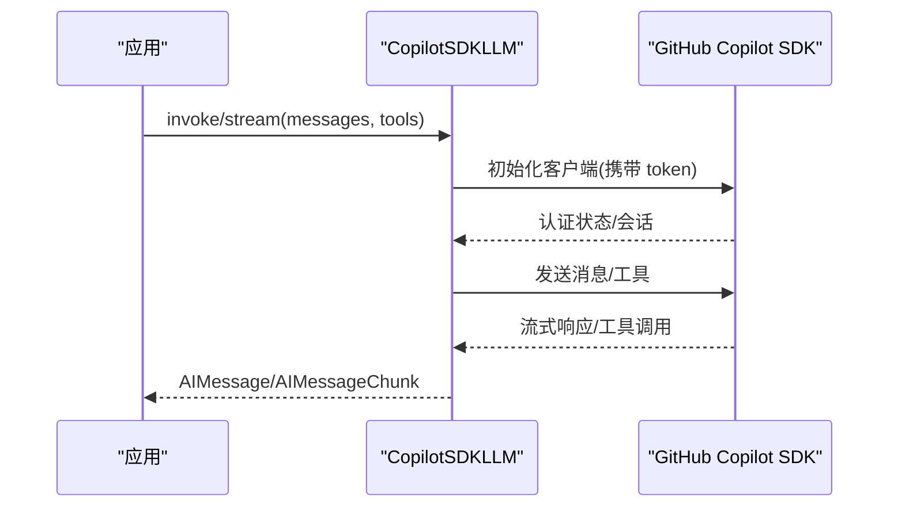
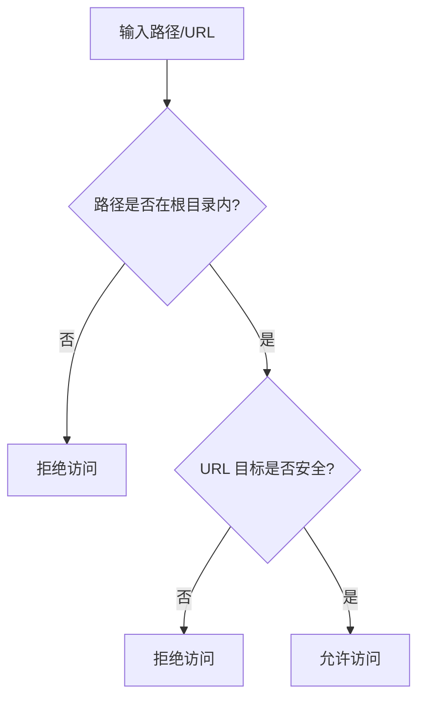
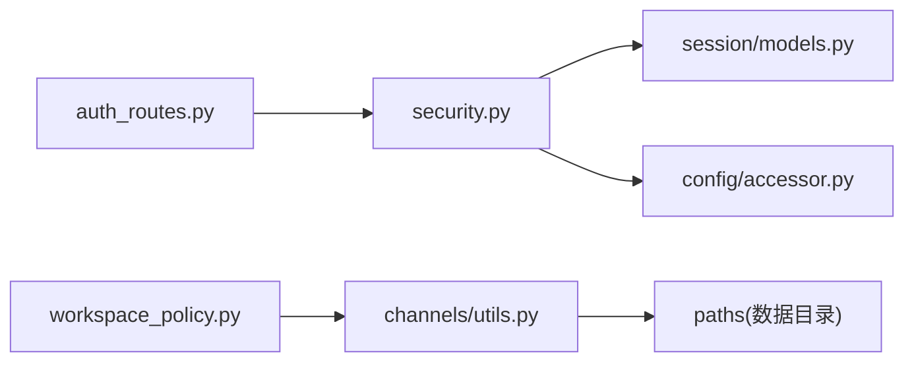

# 认证与授权

<cite>
**本文引用的文件**
- [agent/src/api/security.py](file://agent/src/api/security.py)
- [agent/src/api/auth_routes.py](file://agent/src/api/auth_routes.py)
- [agent/src/session/models.py](file://agent/src/session/models.py)
- [agent/src/providers/copilot_auth.py](file://agent/src/providers/copilot_auth.py)
- [agent/src/config/accessor.py](file://agent/src/config/accessor.py)
- [agent/src/channels/utils.py](file://agent/src/channels/utils.py)
- [agent/src/security/workspace_access.py](file://agent/src/security/workspace_access.py)
- [agent/src/security/workspace_policy.py](file://agent/src/security/workspace_policy.py)
</cite>

## 目录
1. [简介](#简介)
2. [项目结构](#项目结构)
3. [核心组件](#核心组件)
4. [架构总览](#架构总览)
5. [详细组件分析](#详细组件分析)
6. [依赖关系分析](#依赖关系分析)
7. [性能与安全考量](#性能与安全考量)
8. [故障排除指南](#故障排除指南)
9. [结论](#结论)
10. [附录：配置示例与最佳实践](#附录配置示例与最佳实践)

## 简介
本文件面向安全工程师与系统管理员，系统化说明本项目的认证与授权机制，包括：
- 多提供商认证接入（如 OpenAI、Anthropic、GitHub Copilot）的鉴权与凭据管理方式
- API 密钥认证、SSE 票据机制与会话上下文
- 权限控制模型：主体（Principal）、认证方法枚举、可归因性标记
- 工作区隔离与路径访问控制
- 安全中间件：CORS/主机校验、DNS 重绑定防护、安全响应头、日志脱敏
- 安全流程与最佳实践、配置要点与常见问题排查

## 项目结构
围绕认证与授权的关键代码分布在以下模块：
- API 安全与认证依赖：FastAPI 依赖、CORS、Host 校验、SSE 票据、API Key 验证
- 会话与主体：Session/Message/Attempt 模型及 Principal 与 AuthMethod
- 提供商认证适配：GitHub Copilot SDK 适配器（作为多提供商接入的一个示例）
- 配置访问：环境变量与运行时配置的线程安全单例
- 工作区与路径安全：工作区范围检查、URL 目标安全校验

**图示来源**
- [agent/src/api/security.py:166-253](file://agent/src/api/security.py#L166-L253)
- [agent/src/api/security.py:300-341](file://agent/src/api/security.py#L300-L341)
- [agent/src/api/security.py:463-504](file://agent/src/api/security.py#L463-L504)
- [agent/src/api/security.py:571-622](file://agent/src/api/security.py#L571-L622)
- [agent/src/api/auth_routes.py:21-55](file://agent/src/api/auth_routes.py#L21-L55)
- [agent/src/channels/utils.py:55-61](file://agent/src/channels/utils.py#L55-L61)
- [agent/src/channels/utils.py:146-190](file://agent/src/channels/utils.py#L146-L190)

**章节来源**
- [agent/src/api/security.py:166-253](file://agent/src/api/security.py#L166-L253)
- [agent/src/api/auth_routes.py:21-55](file://agent/src/api/auth_routes.py#L21-L55)

## 核心组件
- 认证依赖与令牌验证
  - require_auth：对敏感接口进行 Bearer Token 校验，返回 Principal
  - require_event_stream_auth：针对浏览器 EventSource 的 SSE 流认证，支持 ticket 或 Bearer
  - require_local_or_auth / require_settings_write_auth：开发模式与写操作保护
- SSE 票据机制
  - _mint_sse_ticket：生成一次性、短生命周期票据
  - _consume_sse_ticket：消费并立即失效，防重放
- 主体与认证方法
  - Principal：包含 subject、auth_method、tenant、display_name、attributable
  - AuthMethod：shared_key、loopback_trust、federated_identity
- 配置访问
  - get_env_config：线程安全的配置单例，读取环境变量
- 工作区与路径安全
  - is_path_within：限制文件路径在工作区内
  - validate_url_target：限制 URL 协议、域名与解析 IP，禁止私网/组播等不安全目标

**章节来源**
- [agent/src/api/security.py:463-504](file://agent/src/api/security.py#L463-L504)
- [agent/src/api/security.py:571-622](file://agent/src/api/security.py#L571-L622)
- [agent/src/api/security.py:300-341](file://agent/src/api/security.py#L300-L341)
- [agent/src/session/models.py:17-79](file://agent/src/session/models.py#L17-L79)
- [agent/src/config/accessor.py:52-76](file://agent/src/config/accessor.py#L52-L76)
- [agent/src/channels/utils.py:55-61](file://agent/src/channels/utils.py#L55-L61)
- [agent/src/channels/utils.py:146-190](file://agent/src/channels/utils.py#L146-L190)

## 架构总览
下图展示从请求进入 FastAPI 到认证、SSE 票据、会话执行与路径安全的整体流程。

**图示来源**
- [agent/src/api/auth_routes.py:21-55](file://agent/src/api/auth_routes.py#L21-L55)
- [agent/src/api/security.py:300-341](file://agent/src/api/security.py#L300-L341)
- [agent/src/api/security.py:571-622](file://agent/src/api/security.py#L571-L622)
- [agent/src/channels/utils.py:55-61](file://agent/src/channels/utils.py#L55-L61)
- [agent/src/channels/utils.py:146-190](file://agent/src/channels/utils.py#L146-L190)

## 详细组件分析

### 认证依赖与令牌验证
- 关键职责
  - 统一从 Header 或查询参数提取凭据（按策略控制是否允许查询参数）
  - 校验 API Key（若已配置），否则在本地回环信任模式下放行
  - 对非安全 HTTP 方法进行跨站请求拦截
  - 为 SSE 流提供 ticket 或 Bearer 双通道认证
- 设计要点
  - 使用 hmac.compare_digest 进行常量时间比较，防止时序攻击
  - 将“共享密钥持有者”和“本地回环操作员”映射为不可归因的 Principal
  - 通过 require_settings_write_auth 保护敏感设置写入

**图示来源**
- [agent/src/api/security.py:463-504](file://agent/src/api/security.py#L463-L504)

**章节来源**
- [agent/src/api/security.py:463-504](file://agent/src/api/security.py#L463-L504)
- [agent/src/api/security.py:571-589](file://agent/src/api/security.py#L571-L589)

### SSE 票据机制
- 关键职责
  - 为浏览器 EventSource 提供一次性、短生命周期的票据，避免长密钥出现在 URL 中
  - 票据生成后即刻加入内存表，首次消费即删除，防重放
  - 定期清理过期票据，降低内存占用
- 安全考虑
  - 票据有效期约 60 秒，且仅能使用一次
  - 日志中对 api_key/ticket 值进行脱敏，避免泄露

**图示来源**
- [agent/src/api/auth_routes.py:21-55](file://agent/src/api/auth_routes.py#L21-L55)
- [agent/src/api/security.py:300-341](file://agent/src/api/security.py#L300-L341)

**章节来源**
- [agent/src/api/security.py:300-341](file://agent/src/api/security.py#L300-L341)
- [agent/src/api/auth_routes.py:21-55](file://agent/src/api/auth_routes.py#L21-L55)

### 主体与认证方法（Principal/AuthMethod）
- 关键职责
  - 明确区分“可归因身份”与“不可归因凭据”，避免将共享密钥误认为具体用户
  - 为未来联邦身份（Federation Identity）预留扩展点
- 数据结构
  - Principal.subject：角色或标识，当前多为“shared-key-holder”或“loopback-operator”
  - Principal.auth_method：shared_key、loopback_trust、federated_identity
  - Principal.attributable：由 auth_method 自动推导，仅 federated_identity 为真

**图示来源**
- [agent/src/session/models.py:17-79](file://agent/src/session/models.py#L17-L79)

**章节来源**
- [agent/src/session/models.py:17-79](file://agent/src/session/models.py#L17-L79)

### 多提供商认证（以 GitHub Copilot 为例）
- 关键职责
  - 通过官方 SDK 获取认证状态与令牌，不直接实现 OAuth 流程
  - 支持从环境变量或 gh CLI 获取令牌，并进行前缀校验
- 集成方式
  - 作为 LLM 提供者之一，遵循统一的工具与消息转换接口
  - 错误与超时处理清晰，支持流式输出与工具调用

**图示来源**
- [agent/src/providers/copilot_auth.py:51-58](file://agent/src/providers/copilot_auth.py#L51-L58)
- [agent/src/providers/copilot_auth.py:193-329](file://agent/src/providers/copilot_auth.py#L193-L329)
- [agent/src/providers/copilot_auth.py:332-460](file://agent/src/providers/copilot_auth.py#L332-L460)

**章节来源**
- [agent/src/providers/copilot_auth.py:51-58](file://agent/src/providers/copilot_auth.py#L51-L58)
- [agent/src/providers/copilot_auth.py:193-329](file://agent/src/providers/copilot_auth.py#L193-L329)
- [agent/src/providers/copilot_auth.py:332-460](file://agent/src/providers/copilot_auth.py#L332-L460)

### 工作区访问控制与路径安全
- 关键职责
  - 限制文件路径必须位于工作区根目录下，防止越权访问
  - 限制 URL 目标的安全属性（协议、域名、解析 IP），阻止内网/组播/私有地址
- 适用场景
  - 渠道适配器、上传媒体目录、运行时子目录
  - 代理/网络工具对外部资源的访问控制

**图示来源**
- [agent/src/channels/utils.py:55-61](file://agent/src/channels/utils.py#L55-L61)
- [agent/src/channels/utils.py:146-190](file://agent/src/channels/utils.py#L146-L190)

**章节来源**
- [agent/src/channels/utils.py:55-61](file://agent/src/channels/utils.py#L55-L61)
- [agent/src/channels/utils.py:146-190](file://agent/src/channels/utils.py#L146-L190)
- [agent/src/security/workspace_access.py:1-15](file://agent/src/security/workspace_access.py#L1-L15)
- [agent/src/security/workspace_policy.py:1-12](file://agent/src/security/workspace_policy.py#L1-L12)

## 依赖关系分析
- 模块耦合
  - security.py 依赖 session.models.Principal 与 config.accessor.get_env_config
  - auth_routes.py 依赖 security._mint_sse_ticket 与宿主 require_auth
  - channels.utils 被工作区策略复用，提供路径与 URL 安全能力
- 外部依赖
  - FastAPI 安全组件（HTTPBearer、Security、Request）
  - 标准库（secrets、time、threading、ipaddress、urllib.parse）
  - GitHub Copilot SDK（可选，用于提供商认证）

**图示来源**
- [agent/src/api/security.py:16-24](file://agent/src/api/security.py#L16-L24)
- [agent/src/api/auth_routes.py:21-55](file://agent/src/api/auth_routes.py#L21-L55)
- [agent/src/security/workspace_policy.py:1-12](file://agent/src/security/workspace_policy.py#L1-L12)

**章节来源**
- [agent/src/api/security.py:16-24](file://agent/src/api/security.py#L16-L24)
- [agent/src/api/auth_routes.py:21-55](file://agent/src/api/auth_routes.py#L21-L55)
- [agent/src/security/workspace_policy.py:1-12](file://agent/src/security/workspace_policy.py#L1-L12)

## 性能与安全考量
- 性能
  - SSE 票据采用内存字典存储，配合周期性清理，避免无限增长
  - 配置访问使用线程安全单例，减少重复解析开销
  - 会话执行使用线程池限制并发 AgentLoop，避免资源耗尽
- 安全
  - CORS 严格白名单，禁止 credentialed 模式下的通配符
  - CSP 默认严格，文档页放宽至必要 CDN；HSTS 交由反向代理
  - DNS 重绑定防护：本地回环 Host 白名单校验
  - 日志脱敏：api_key/ticket 值在访问日志中替换为占位符
  - 常量时间比较：防止时序侧信道攻击
  - URL 目标安全：禁止私网/组播/非全局可达地址

[本节为通用指导，无需特定文件引用]

## 故障排除指南
- 无法建立 SSE 流
  - 检查是否先调用 /auth/sse-ticket 获取票据，再使用 ?ticket= 打开流
  - 确认票据未过期且未被重复使用
  - 查看日志中是否出现 ticket 被脱敏后的记录
- 401/403 错误
  - 401：缺少或错误的 API Key/Bearer Token
  - 403：非本地回环访问且未配置 API Key；或跨站请求被拒绝
- 路径/URL 访问被拒
  - 确认路径在工作区根目录内
  - 确认 URL 协议为 http/https，域名解析到公网地址，非私网/组播
- 设置写入受限
  - 使用 require_settings_write_auth 保护的接口需要本地回环或有效的 API Key

**章节来源**
- [agent/src/api/security.py:300-341](file://agent/src/api/security.py#L300-L341)
- [agent/src/api/security.py:463-504](file://agent/src/api/security.py#L463-L504)
- [agent/src/api/security.py:571-622](file://agent/src/api/security.py#L571-L622)
- [agent/src/channels/utils.py:146-190](file://agent/src/channels/utils.py#L146-L190)

## 结论
本项目通过统一的认证依赖、SSE 票据机制、严格的中间件与路径/URL 安全校验，构建了可扩展且安全的认证与授权体系。当前以共享密钥与本地回环信任为主，并为联邦身份预留扩展点。建议在生产环境启用 API Key、严格 CORS/CSP、并在反向代理层配置 TLS 与 HSTS，同时结合工作区隔离与最小权限原则，确保多租户与多提供商场景下的数据安全。

[本节为总结，无需特定文件引用]

## 附录：配置示例与最佳实践
- 环境变量与配置
  - API 认证密钥：通过配置层读取（支持别名兼容）
  - CORS 额外来源：通过环境变量追加可信来源，禁止通配符
  - 本地回环信任：仅在无 API Key 时生效，生产务必配置密钥
  - 安全头策略：CSP Report-Only 开关用于灰度回滚
- 最佳实践
  - 始终在生产环境配置 API Key，禁用本地回环信任
  - 使用 HTTPS 与反向代理终止 TLS，并设置 HSTS
  - 限制 CORS 白名单为必要的 Web UI 来源
  - 对敏感接口使用 require_settings_write_auth 保护
  - 对文件与 URL 访问使用 is_path_within 与 validate_url_target 校验
  - 对 SSE 流使用票据机制，避免长密钥暴露于 URL 与日志

**章节来源**
- [agent/src/config/accessor.py:52-76](file://agent/src/config/accessor.py#L52-L76)
- [agent/src/api/security.py:69-103](file://agent/src/api/security.py#L69-L103)
- [agent/src/api/security.py:235-253](file://agent/src/api/security.py#L235-L253)
- [agent/src/api/security.py:463-504](file://agent/src/api/security.py#L463-L504)
- [agent/src/channels/utils.py:55-61](file://agent/src/channels/utils.py#L55-L61)
- [agent/src/channels/utils.py:146-190](file://agent/src/channels/utils.py#L146-L190)