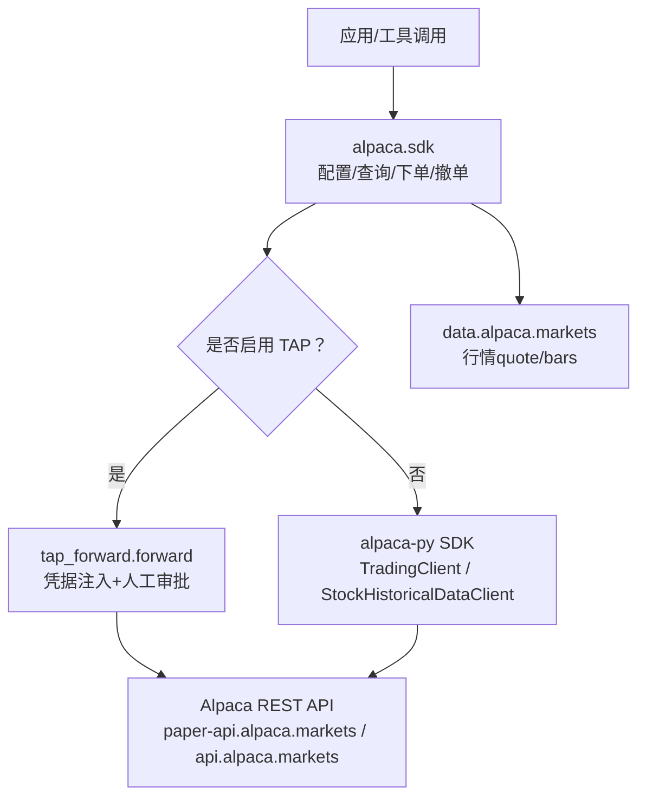
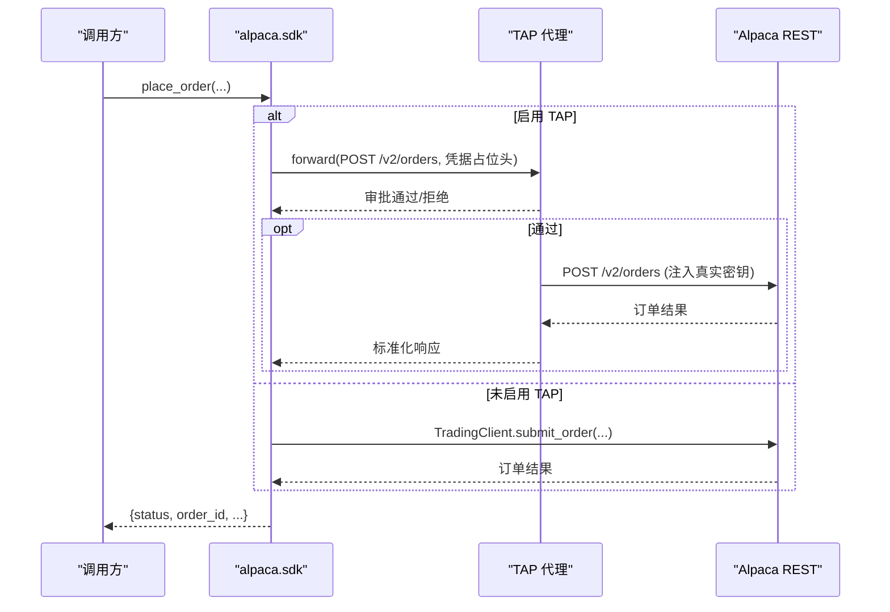
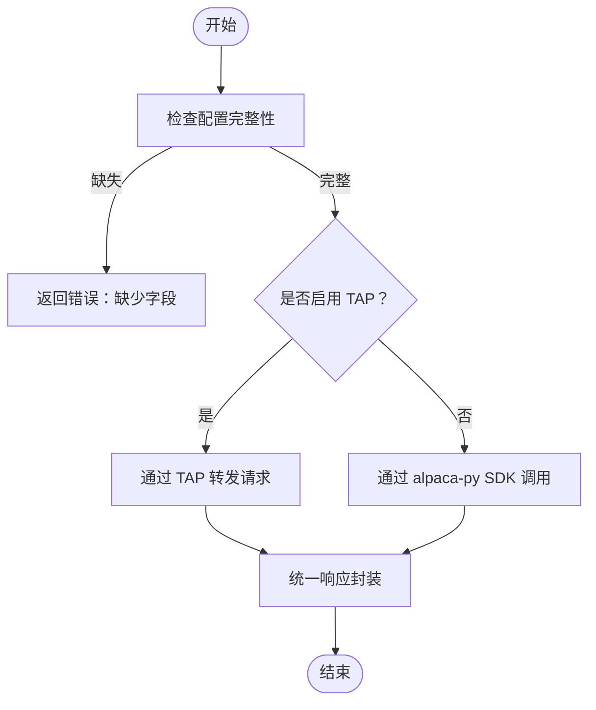
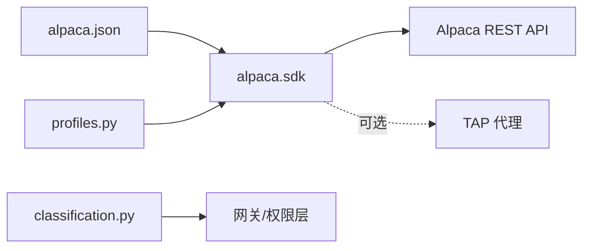

# Alpaca 券商配置

<cite>
**本文引用的文件**
- [sdk.py](file://agent/src/trading/connectors/alpaca/sdk.py)
- [profiles.py](file://agent/src/trading/connectors/alpaca/profiles.py)
- [classification.py](file://agent/src/trading/connectors/alpaca/classification.py)
- [test_alpaca_tap_routing.py](file://agent/tests/test_alpaca_tap_routing.py)
- [test_alpaca_timeframe_map.py](file://agent/tests/test_alpaca_timeframe_map.py)
- [test_runner_env.py](file://agent/tests/test_runner_env.py)
</cite>

## 目录
1. [简介](#简介)
2. [项目结构](#项目结构)
3. [核心组件](#核心组件)
4. [架构总览](#架构总览)
5. [详细组件分析](#详细组件分析)
6. [依赖关系分析](#依赖关系分析)
7. [性能与可用性考虑](#性能与可用性考虑)
8. [故障排除指南](#故障排除指南)
9. [结论](#结论)
10. [附录：环境变量与配置示例](#附录环境变量与配置示例)

## 简介
本指南面向使用 Vibe-Trading 的 Alpaca 连接器用户，覆盖账户注册与 API 密钥获取、模拟盘/实盘切换、交易品种支持、订单类型、连接测试、账户信息查询、交易执行以及常见错误处理。该连接器基于官方 alpaca-py SDK，并可选通过 TAP（审批代理）进行凭据隔离与人工审批路由。

## 项目结构
Alpaca 连接器位于 agent/src/trading/connectors/alpaca 目录下，主要包含：
- sdk.py：连接器实现（配置加载、账户/持仓/订单查询、行情数据、下单/撤单、TAP 路由）。
- profiles.py：内置交易画像（paper/live 只读、paper/live 可交易等）。
- classification.py：读写分类（用于网关对写操作进行强管控）。

图表来源
- [sdk.py:44-56](file://agent/src/trading/connectors/alpaca/sdk.py#L44-L56)
- [sdk.py:210-229](file://agent/src/trading/connectors/alpaca/sdk.py#L210-L229)
- [sdk.py:826-837](file://agent/src/trading/connectors/alpaca/sdk.py#L826-L837)

章节来源
- [sdk.py:1-20](file://agent/src/trading/connectors/alpaca/sdk.py#L1-L20)
- [profiles.py:1-72](file://agent/src/trading/connectors/alpaca/profiles.py#L1-L72)
- [classification.py:1-26](file://agent/src/trading/connectors/alpaca/classification.py#L1-L26)

## 核心组件
- 配置模型与加载
  - 配置文件路径：~/.vibe-trading/alpaca.json（运行时根目录下的 alpaca.json）。
  - 配置项：api_key、secret_key、profile（paper/live-readonly/live）、feed（iex/sip）、timeout、readonly。
  - 构建顺序：保存的配置 ← 画像默认值 ← CLI 覆盖。
- 环境与环境隔离
  - paper 与 live 使用不同主机与密钥对；profile 决定 host 与 key 的使用。
  - 可选 TAP 路由：当启用时，所有读写均经 TAP 转发，凭据以占位符形式由服务端注入，进程不持有密钥。
- 能力与画像
  - 内置画像：alpaca-paper-sdk（只读）、alpaca-live-sdk-readonly（只读）、alpaca-paper-trade（可交易）、alpaca-live-trade（需授权委托才允许下单）。
- 读写分类
  - 将 submit_order、cancel_order_by_id 等标记为 WRITE，确保网关严格管控。

章节来源
- [sdk.py:67-104](file://agent/src/trading/connectors/alpaca/sdk.py#L67-L104)
- [sdk.py:145-181](file://agent/src/trading/connectors/alpaca/sdk.py#L145-L181)
- [profiles.py:15-71](file://agent/src/trading/connectors/alpaca/profiles.py#L15-L71)
- [classification.py:13-25](file://agent/src/trading/connectors/alpaca/classification.py#L13-L25)

## 架构总览
Alpaca 连接器提供两类访问路径：
- 直连 SDK 路径：通过 alpaca-py 直接访问 Alpaca REST API。
- TAP 路由路径：通过 TAP 代理转发请求，凭据在服务端注入，写操作需人工审批。

图表来源
- [sdk.py:429-577](file://agent/src/trading/connectors/alpaca/sdk.py#L429-L577)
- [sdk.py:580-665](file://agent/src/trading/connectors/alpaca/sdk.py#L580-L665)
- [test_alpaca_tap_routing.py:33-79](file://agent/tests/test_alpaca_tap_routing.py#L33-L79)

## 详细组件分析

### 配置与账户注册、API 密钥获取
- 账户注册与密钥
  - 在 Alpaca 官网创建账户并生成 API Key ID 与 Secret Key。
  - paper 与 live 使用不同的密钥对，且分别对应不同主机。
- 本地配置
  - 将密钥写入 ~/.vibe-trading/alpaca.json，或通过系统环境变量传入（见附录）。
  - profile 选择：paper（模拟盘）、live-readonly（实盘只读）、live（实盘交易，需授权委托）。
- 验证连通性
  - 使用 check_status/get_account_snapshot 验证配置与网络连通。

章节来源
- [sdk.py:44-56](file://agent/src/trading/connectors/alpaca/sdk.py#L44-L56)
- [sdk.py:161-181](file://agent/src/trading/connectors/alpaca/sdk.py#L161-L181)
- [sdk.py:263-298](file://agent/src/trading/connectors/alpaca/sdk.py#L263-L298)

### 模拟盘与实盘切换
- 通过 profile 控制：
  - paper → 连接 paper-api.alpaca.markets
  - live-readonly/live → 连接 api.alpaca.markets
- 注意：paper 密钥无法访问 live 主机，反之亦然；切换需更换密钥对。

章节来源
- [sdk.py:44-56](file://agent/src/trading/connectors/alpaca/sdk.py#L44-L56)
- [profiles.py:15-71](file://agent/src/trading/connectors/alpaca/profiles.py#L15-L71)

### 交易品种支持（股票、ETF、加密货币）
- 股票与 ETF
  - 通过 data.alpaca.markets 的 stocks 接口获取 quote/bars，适用于美股股票与 ETF。
- 加密货币
  - 当前连接器聚焦美股市场数据与交易；加密货币不在该连接器范围内。
  - 若需加密货币，请使用其他数据源或连接器（如 CCXT/OKX 等）。

章节来源
- [sdk.py:396-455](file://agent/src/trading/connectors/alpaca/sdk.py#L396-L455)

### 订单类型与参数
- 支持的订单类型
  - market（市价单）
  - limit（限价单）
- 时间有效方式
  - day（当日有效）
  - gtc（持续有效）
- 数量与名义金额
  - quantity（股数）与 notional（美元名义金额）二选一。
- 限价单要求
  - limit_price 必填且为正数。

章节来源
- [sdk.py:429-577](file://agent/src/trading/connectors/alpaca/sdk.py#L429-L577)

### 连接测试、账户信息查询、交易执行
- 连接测试
  - 调用 check_status 返回状态、SDK 安装情况、TAP 开关、目标主机与账户摘要。
- 账户信息查询
  - get_account_snapshot 返回账号号、状态、现金、权益、购买力、组合价值等。
- 交易执行
  - place_order 提交订单；返回订单 ID、状态、成交数量等。
  - cancel_order 按订单 ID 撤销订单。

图表来源
- [sdk.py:263-298](file://agent/src/trading/connectors/alpaca/sdk.py#L263-L298)
- [sdk.py:429-577](file://agent/src/trading/connectors/alpaca/sdk.py#L429-L577)

章节来源
- [sdk.py:263-298](file://agent/src/trading/connectors/alpaca/sdk.py#L263-L298)
- [sdk.py:301-366](file://agent/src/trading/connectors/alpaca/sdk.py#L301-L366)
- [sdk.py:429-577](file://agent/src/trading/connectors/alpaca/sdk.py#L429-L577)
- [sdk.py:712-792](file://agent/src/trading/connectors/alpaca/sdk.py#L712-L792)

### TAP 路由与凭据隔离
- 当启用 TAP 时：
  - 所有请求通过 tap_forward.forward 转发，凭据以 <CREDENTIAL:...> 占位符形式由服务端注入。
  - 写操作（下单/撤单）需要人工审批；读取为 GET，自动批准。
  - 订单携带确定性 client_order_id，避免重复下单。
- 禁用 TAP 时：
  - 直接使用 alpaca-py SDK 访问 Alpaca。

章节来源
- [sdk.py:184-229](file://agent/src/trading/connectors/alpaca/sdk.py#L184-L229)
- [sdk.py:580-665](file://agent/src/trading/connectors/alpaca/sdk.py#L580-L665)
- [test_alpaca_tap_routing.py:33-79](file://agent/tests/test_alpaca_tap_routing.py#L33-L79)

### 时间框架映射
- 内部 period token 到 Alpaca REST timeframe 的映射区分大小写（例如 1m 与 1M）。

章节来源
- [sdk.py:244-251](file://agent/src/trading/connectors/alpaca/sdk.py#L244-L251)
- [test_alpaca_timeframe_map.py:8-17](file://agent/tests/test_alpaca_timeframe_map.py#L8-L17)

## 依赖关系分析
- 外部依赖
  - alpaca-py：可选依赖；未安装时，check_status 会提示安装。
  - TAP：可选；启用后所有请求经 TAP 转发。
- 内部依赖
  - 配置加载：从 alpaca.json 读取，支持 profile 覆盖。
  - 画像与分类：限制能力暴露与写操作管控。

图表来源
- [sdk.py:161-181](file://agent/src/trading/connectors/alpaca/sdk.py#L161-L181)
- [profiles.py:15-71](file://agent/src/trading/connectors/alpaca/profiles.py#L15-L71)
- [classification.py:13-25](file://agent/src/trading/connectors/alpaca/classification.py#L13-L25)

章节来源
- [sdk.py:254-284](file://agent/src/trading/connectors/alpaca/sdk.py#L254-L284)
- [profiles.py:15-71](file://agent/src/trading/connectors/alpaca/profiles.py#L15-L71)
- [classification.py:13-25](file://agent/src/trading/connectors/alpaca/classification.py#L13-L25)

## 性能与可用性考虑
- 超时与重试
  - 可通过 timeout 调整网络超时；建议结合上层重试策略。
- 数据源
  - feed 可选择 iex（免费）或 sip（付费），影响行情数据质量与延迟。
- TAP 审批延迟
  - 启用 TAP 时，写操作需等待人工审批，可能引入额外延迟。
- 并发与限流
  - 遵循 Alpaca API 速率限制；在高并发场景下适当退避。

[本节为通用指导，无需特定文件引用]

## 故障排除指南
- 常见错误与定位
  - 依赖缺失：提示安装 alpaca-py。
  - 配置不完整：提示缺少 api_key/secret_key/profile/feed 等字段。
  - 认证失败：检查密钥对与 profile/host 是否匹配。
  - 网络不可达：检查防火墙/代理设置。
  - TAP 拒绝/超时：查看 tap_decision 与错误信息。
- 诊断步骤
  - 运行 check_status 确认 SDK、TAP、host 与账户信息。
  - 使用 get_account_snapshot 验证账户可达性与基本信息。
  - 逐步缩小问题范围：先只读后写，先纸面后实盘。

章节来源
- [sdk.py:263-298](file://agent/src/trading/connectors/alpaca/sdk.py#L263-L298)
- [sdk.py:429-577](file://agent/src/trading/connectors/alpaca/sdk.py#L429-L577)
- [sdk.py:580-665](file://agent/src/trading/connectors/alpaca/sdk.py#L580-L665)

## 结论
Alpaca 连接器提供了清晰的模拟盘/实盘切换机制、严格的读写分类与可选的 TAP 凭据隔离方案。通过标准化的配置与统一的响应封装，用户可以安全地接入 Alpaca 进行股票与 ETF 的数据查询与交易执行。对于加密货币需求，建议使用其他专用连接器。

[本节为总结性内容，无需特定文件引用]

## 附录：环境变量与配置示例
- 环境变量
  - 敏感键名包含 ALPACA_API_KEY（参见测试中的敏感键列表）。
  - 实际密钥通常保存在 alpaca.json 或通过 TAP 凭据注入。
- BASE_URL
  - 连接器内部固定使用 Alpaca 主机：
    - 模拟盘：https://paper-api.alpaca.markets
    - 实盘：https://api.alpaca.markets
    - 行情：https://data.alpaca.markets
- 配置示例（alpaca.json）
  - 模拟盘只读：
    - profile: "paper"
    - feed: "iex"
  - 实盘只读：
    - profile: "live-readonly"
    - feed: "iex"
  - 实盘交易（需授权委托）：
    - profile: "live"
    - feed: "iex"
- 代码示例路径（不含具体代码）
  - 连接测试：check_status
  - 账户信息查询：get_account_snapshot
  - 交易执行：place_order、cancel_order

章节来源
- [test_runner_env.py:71-88](file://agent/tests/test_runner_env.py#L71-L88)
- [sdk.py:44-56](file://agent/src/trading/connectors/alpaca/sdk.py#L44-L56)
- [sdk.py:263-298](file://agent/src/trading/connectors/alpaca/sdk.py#L263-L298)
- [sdk.py:301-366](file://agent/src/trading/connectors/alpaca/sdk.py#L301-L366)
- [sdk.py:429-577](file://agent/src/trading/connectors/alpaca/sdk.py#L429-L577)
- [sdk.py:712-792](file://agent/src/trading/connectors/alpaca/sdk.py#L712-L792)