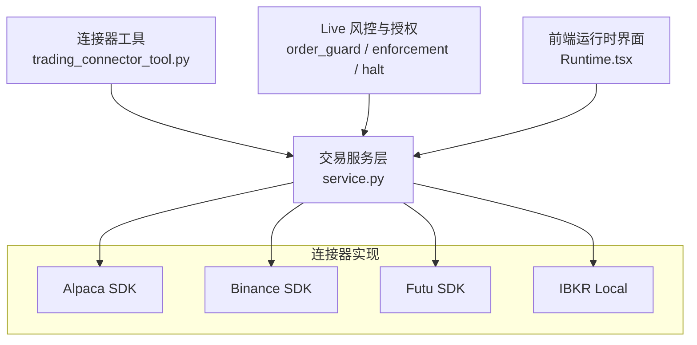
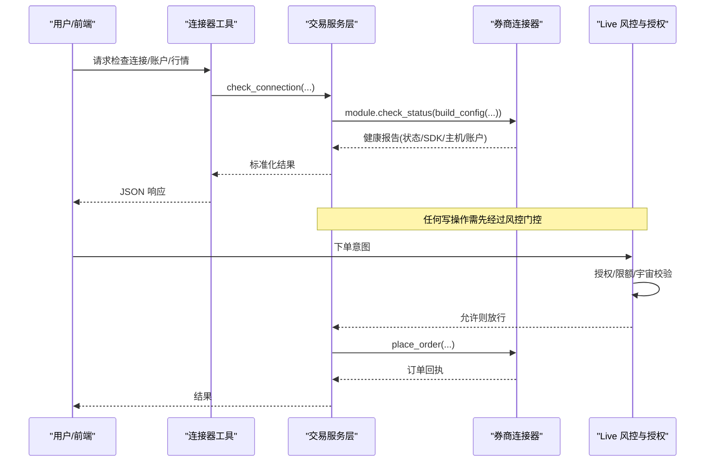
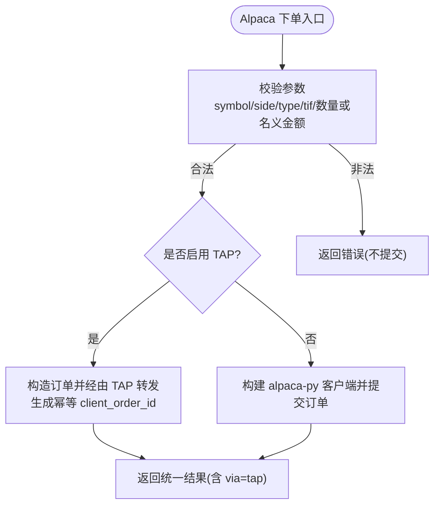
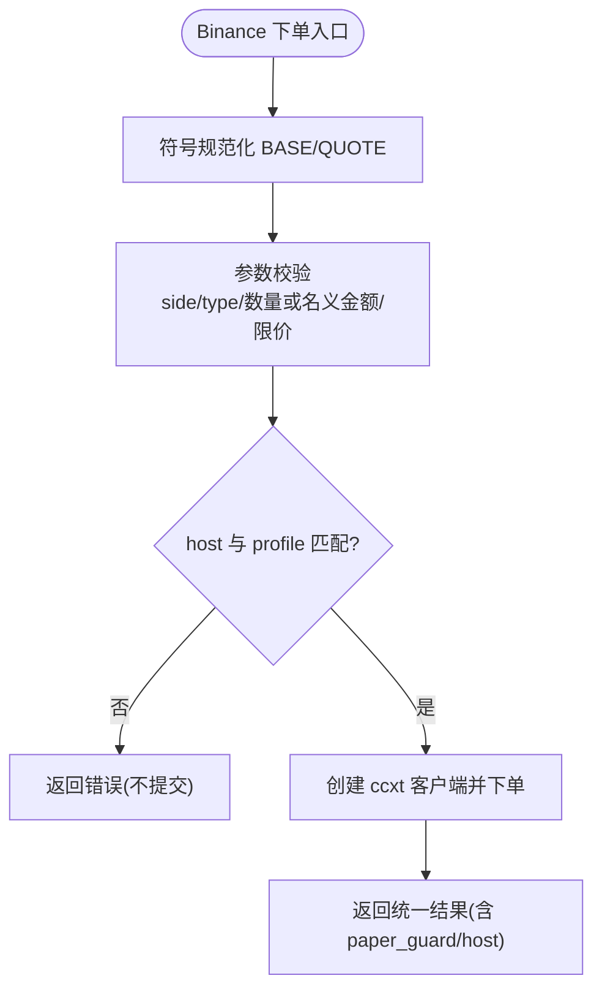
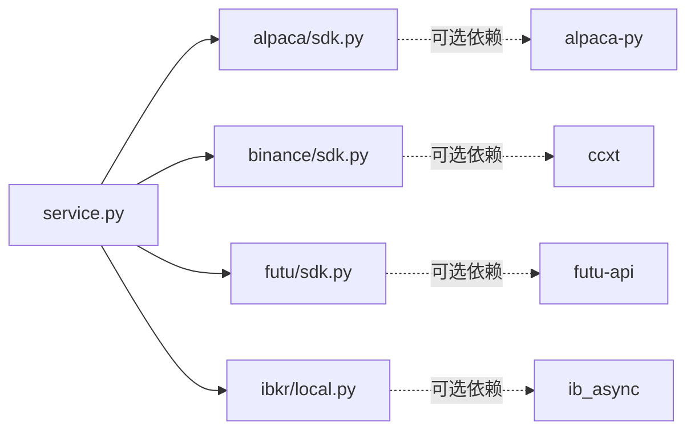

# 交易连接器配置

<cite>
**本文引用的文件**
- [agent/src/trading/connectors/alpaca/sdk.py](file://agent/src/trading/connectors/alpaca/sdk.py)
- [agent/src/trading/connectors/binance/sdk.py](file://agent/src/trading/connectors/binance/sdk.py)
- [agent/src/trading/connectors/futu/sdk.py](file://agent/src/trading/connectors/futu/sdk.py)
- [agent/src/trading/connectors/ibkr/local.py](file://agent/src/trading/connectors/ibkr/local.py)
- [agent/src/trading/service.py](file://agent/src/trading/service.py)
- [agent/src/tools/trading_connector_tool.py](file://agent/src/tools/trading_connector_tool.py)
- [agent/src/live/order_guard.py](file://agent/src/live/order_guard.py)
- [agent/src/live/enforcement.py](file://agent/src/live/enforcement.py)
- [agent/src/live/halt.py](file://agent/src/live/halt.py)
- [agent/src/live/runtime/flatten.py](file://agent/src/live/runtime/flatten.py)
- [agent/src/api/live_routes.py](file://agent/src/api/live_routes.py)
- [frontend/src/pages/Runtime.tsx](file://frontend/src/pages/Runtime.tsx)
</cite>

## 目录
1. [简介](#简介)
2. [项目结构](#项目结构)
3. [核心组件](#核心组件)
4. [架构总览](#架构总览)
5. [详细组件分析](#详细组件分析)
6. [依赖关系分析](#依赖关系分析)
7. [性能与可靠性](#性能与可靠性)
8. [故障排查指南](#故障排查指南)
9. [结论](#结论)
10. [附录：各券商配置要点速查](#附录各券商配置要点速查)

## 简介
本指南面向需要接入多家券商/交易所的交易系统用户，提供“交易连接器”的完整配置说明。内容覆盖支持的券商接口（Alpaca、富途牛牛、盈透证券、币安等），认证与账户配置（API 密钥、账户信息、模拟盘/实盘切换）、连接器通用选项（订单类型、风险控制参数、市场选择、货币设置）、多账户管理与资金分配策略、连接器状态监控与连接测试、错误诊断方法，以及常见接口的配置示例与故障排除。

## 项目结构
交易连接器以“按券商分目录 + 统一服务层”的方式组织：
- 各券商 SDK 封装位于 agent/src/trading/connectors/<broker>/sdk.py，负责读取账户、持仓、行情、历史数据，以及在受控条件下下单与撤单。
- 统一检查与调用入口在 agent/src/trading/service.py，根据 profile 路由到具体 connector。
- 工具层暴露只读能力（检查连接、账户、持仓、行情）给上层使用。
- 风控与授权在 live 层实现（order_guard、enforcement、halt）。
- 前端 Runtime 页面展示连接器状态与诊断信息。

图表来源
- [agent/src/trading/service.py:42-65](file://agent/src/trading/service.py#L42-L65)
- [agent/src/tools/trading_connector_tool.py:307-343](file://agent/src/tools/trading_connector_tool.py#L307-L343)
- [agent/src/trading/connectors/alpaca/sdk.py:1-20](file://agent/src/trading/connectors/alpaca/sdk.py#L1-L20)
- [agent/src/trading/connectors/binance/sdk.py:1-22](file://agent/src/trading/connectors/binance/sdk.py#L1-L22)
- [agent/src/trading/connectors/futu/sdk.py:1-25](file://agent/src/trading/connectors/futu/sdk.py#L1-L25)
- [agent/src/trading/connectors/ibkr/local.py:1-6](file://agent/src/trading/connectors/ibkr/local.py#L1-L6)

章节来源
- [agent/src/trading/service.py:42-65](file://agent/src/trading/service.py#L42-L65)
- [agent/src/tools/trading_connector_tool.py:307-343](file://agent/src/tools/trading_connector_tool.py#L307-L343)

## 核心组件
- 连接器配置对象：每个券商都有独立的配置类（如 AlpacaConfig、BinanceConfig、FutuConfig、IBKRLocalConfig），包含 API 密钥、环境（paper/live）、超时、市场/数据源等字段，并提供 from_mapping/with_overrides/build_config/load/save 等方法。
- 健康检查：check_status/check_local_status 返回连接就绪、SDK 安装情况、主机隔离、账户摘要等。
- 读写分离：默认层为只读；写操作（下单/撤单）在更高层通过风控门控执行。
- 多账户与环境：profile 决定目标环境（paper/live-readonly/live），并通过主机或本地端口进行硬性隔离。

章节来源
- [agent/src/trading/connectors/alpaca/sdk.py:67-139](file://agent/src/trading/connectors/alpaca/sdk.py#L67-L139)
- [agent/src/trading/connectors/binance/sdk.py:82-152](file://agent/src/trading/connectors/binance/sdk.py#L82-L152)
- [agent/src/trading/connectors/futu/sdk.py:71-157](file://agent/src/trading/connectors/futu/sdk.py#L71-L157)
- [agent/src/trading/connectors/ibkr/local.py:61-86](file://agent/src/trading/connectors/ibkr/local.py#L61-L86)

## 架构总览
下图展示了从工具调用到连接器、再到 Live 风控与授权的端到端流程。

图表来源
- [agent/src/tools/trading_connector_tool.py:307-343](file://agent/src/tools/trading_connector_tool.py#L307-L343)
- [agent/src/trading/service.py:42-65](file://agent/src/trading/service.py#L42-L65)
- [agent/src/live/order_guard.py:1-17](file://agent/src/live/order_guard.py#L1-L17)
- [agent/src/live/enforcement.py:1-28](file://agent/src/live/enforcement.py#L1-L28)

## 详细组件分析

### Alpaca 连接器
- 认证与账户
  - 配置项：api_key、secret_key、profile（paper/live-readonly/live）、feed（iex/sip）、timeout、readonly。
  - 配置文件路径：~/.vibe-trading/alpaca.json。
  - 模拟/实盘：通过 host 隔离（paper-api.alpaca.markets vs api.alpaca.markets），profile 决定 host。
- 市场与数据
  - feed 控制数据源（免费 iex 或付费 sip）。
  - 支持报价与历史 K 线查询。
- 订单与风控
  - 支持 market/limit 订单、day/gtc 有效期。
  - 可选 TAP 代理：将凭据注入服务端，避免本地持有密钥；下单/撤单需人工审批。
- 健康检查
  - check_status 返回 SDK 安装、TAP 启用、host、账户摘要等。

图表来源
- [agent/src/trading/connectors/alpaca/sdk.py:429-577](file://agent/src/trading/connectors/alpaca/sdk.py#L429-L577)
- [agent/src/trading/connectors/alpaca/sdk.py:580-665](file://agent/src/trading/connectors/alpaca/sdk.py#L580-L665)

章节来源
- [agent/src/trading/connectors/alpaca/sdk.py:67-139](file://agent/src/trading/connectors/alpaca/sdk.py#L67-L139)
- [agent/src/trading/connectors/alpaca/sdk.py:263-324](file://agent/src/trading/connectors/alpaca/sdk.py#L263-L324)
- [agent/src/trading/connectors/alpaca/sdk.py:429-577](file://agent/src/trading/connectors/alpaca/sdk.py#L429-L577)
- [agent/src/trading/connectors/alpaca/sdk.py:580-665](file://agent/src/trading/connectors/alpaca/sdk.py#L580-L665)

### 币安（Binance）连接器
- 认证与账户
  - 配置项：api_key、api_secret、profile（paper/live-readonly/live）、testnet_host、timeout、readonly。
  - 配置文件路径：~/.vibe-trading/binance.json。
  - 模拟/实盘：通过 testnet 与 live host 隔离；testnet_host 可配置。
- 市场与数据
  - 基于 ccxt 统一接口；支持余额、持仓（现货无仓位概念，用非零余额表示）、报价、历史 OHLCV。
  - 符号规范化：支持 BTC/USDT、BTC-USDT、BTCUSDT 等。
- 订单与风控
  - 支持 market/limit；limit 需 quantity+limit_price；market 支持 notional（quoteOrderQty）。
  - time_in_force 映射：day→GTC，ioc/ioc/fok 直接映射。
  - 强校验：下单前断言 host 与 profile 一致，防止误连。
- 健康检查
  - check_status 返回 SDK 安装、host、账户余额数等。

图表来源
- [agent/src/trading/connectors/binance/sdk.py:423-547](file://agent/src/trading/connectors/binance/sdk.py#L423-L547)
- [agent/src/trading/connectors/binance/sdk.py:628-663](file://agent/src/trading/connectors/binance/sdk.py#L628-L663)

章节来源
- [agent/src/trading/connectors/binance/sdk.py:82-152](file://agent/src/trading/connectors/binance/sdk.py#L82-L152)
- [agent/src/trading/connectors/binance/sdk.py:217-264](file://agent/src/trading/connectors/binance/sdk.py#L217-L264)
- [agent/src/trading/connectors/binance/sdk.py:423-547](file://agent/src/trading/connectors/binance/sdk.py#L423-L547)

### 富途牛牛（Futu）连接器
- 认证与账户
  - 本地 OpenD 网关（默认 127.0.0.1:11111），SDK 仅与本地通信，不接触富途凭据。
  - 配置项：host/port/profile/security_firm/filter_trdmarket/acc_id/timeout/readonly。
  - 配置文件路径：~/.vibe-trading/futu.json。
- 模拟/实盘
  - 通过 trd_env（SIMULATE/REAL）与 acc_id 组合判定；若指定 acc_id，必须与 profile 环境一致。
- 市场与数据
  - 支持账户、持仓、订单、报价、历史 K 线。
- 健康检查
  - check_status 会探测本地端口连通性并返回状态。

章节来源
- [agent/src/trading/connectors/futu/sdk.py:1-25](file://agent/src/trading/connectors/futu/sdk.py#L1-L25)
- [agent/src/trading/connectors/futu/sdk.py:71-157](file://agent/src/trading/connectors/futu/sdk.py#L71-L157)

### 盈透证券（IBKR）本地连接器
- 认证与账户
  - 通过本地 TWS/IB Gateway 会话连接，不直接访问云端；无需在此层管理凭据。
  - 配置项：host/port/client_id/profile/account/timeout/readonly/market_data_type。
  - 配置文件路径：~/.vibe-trading/ibkr-local.json。
- 模拟/实盘
  - 通过默认端口区分：paper 7497，live-readonly 7496；亦支持 IB Gateway 端口。
- 市场与数据
  - 支持延迟/冻结行情类型，默认使用延迟以避免付费订阅限制。
- 健康检查
  - check_local_status 扫描默认端口并返回目标连通状态。

章节来源
- [agent/src/trading/connectors/ibkr/local.py:21-47](file://agent/src/trading/connectors/ibkr/local.py#L21-L47)
- [agent/src/trading/connectors/ibkr/local.py:61-86](file://agent/src/trading/connectors/ibkr/local.py#L61-L86)
- [agent/src/trading/connectors/ibkr/local.py:188-200](file://agent/src/trading/connectors/ibkr/local.py#L188-L200)

### 统一服务与工具
- 服务层 service.py 根据 profile 的 transport 路由到 broker_sdk 或 local_tws，并调用对应 connector 的 check_status/get_account 等。
- 工具层 trading_connector_tool.py 暴露只读工具：检查连接、账户、持仓、行情等，便于 CLI/前端调用。

章节来源
- [agent/src/trading/service.py:42-65](file://agent/src/trading/service.py#L42-L65)
- [agent/src/tools/trading_connector_tool.py:307-343](file://agent/src/tools/trading_connector_tool.py#L307-L343)

## 依赖关系分析
- 连接器对各自 SDK 的依赖为可选：alpaca-py、ccxt、futu-api、ib_async 未安装时，check_status 会报告缺失。
- 服务层通过模块名映射加载具体 connector 模块，保持扩展性。
- Live 层与连接器解耦：仅在写路径上拦截并执行风控。

图表来源
- [agent/src/trading/service.py:42-65](file://agent/src/trading/service.py#L42-L65)
- [agent/src/trading/connectors/alpaca/sdk.py:254-260](file://agent/src/trading/connectors/alpaca/sdk.py#L254-L260)
- [agent/src/trading/connectors/binance/sdk.py:208-214](file://agent/src/trading/connectors/binance/sdk.py#L208-L214)
- [agent/src/trading/connectors/futu/sdk.py:59-68](file://agent/src/trading/connectors/futu/sdk.py#L59-L68)
- [agent/src/trading/connectors/ibkr/local.py:179-185](file://agent/src/trading/connectors/ibkr/local.py#L179-L185)

章节来源
- [agent/src/trading/service.py:42-65](file://agent/src/trading/service.py#L42-L65)

## 性能与可靠性
- 网络与超时：各连接器均支持 timeout 配置；建议根据网络状况合理设置。
- 限流与重试：Binance 通过 ccxt 开启 enableRateLimit；其他连接器遵循各自 SDK 行为。
- 幂等与去重：Alpaca 通过 TAP 路径生成确定性 client_order_id，避免重复下单。
- 安全隔离：Alpaca/Binance 通过 host 隔离纸/实盘；Futu/IBKR 通过本地网关/端口隔离。
- 熔断与降级：Live 层支持 kill switch（HALT 文件）立即停止所有写操作；扁平化平仓在触发后取消挂单并尝试平仓。

章节来源
- [agent/src/trading/connectors/binance/sdk.py:628-640](file://agent/src/trading/connectors/binance/sdk.py#L628-L640)
- [agent/src/trading/connectors/alpaca/sdk.py:615-625](file://agent/src/trading/connectors/alpaca/sdk.py#L615-L625)
- [agent/src/live/halt.py:1-26](file://agent/src/live/halt.py#L1-L26)
- [agent/src/live/runtime/flatten.py:1-14](file://agent/src/live/runtime/flatten.py#L1-L14)

## 故障排查指南
- 连接器状态查看
  - 使用工具层“检查连接”接口获取状态、SDK 安装、主机、账户摘要等。
  - 前端 Runtime 页面会根据 connection_state 显示“未配置/就绪/已连接/错误”，并提供重试按钮。
- 常见错误码与含义
  - credentials_partial：凭据不完整
  - credentials_conflict：凭据冲突
  - sdk_missing：SDK 未安装
  - authentication_failed：认证失败
  - network_unreachable：网络不可达
- 定位步骤
  - 确认配置文件是否存在且格式正确（各连接器 save_config 会写入 ~/.vibe-trading/*.json）。
  - 检查 SDK 是否安装（check_status 中 sdk.installed 字段）。
  - 检查主机/端口是否正确（Alpaca host、Binance testnet_host、Futu OpenD 端口、IBKR TWS/IB Gateway 端口）。
  - 对于 Live 写操作被拒：检查 HALT 文件是否存在（kill switch），以及 mandate 是否过期或未提交。
- 快速恢复
  - 清除 HALT：使用 API 或 CLI 恢复（/live/resume）。
  - 重新提交 mandate：确保 universe/instrument/限额满足要求。
  - 调整网络/凭据后重试。

章节来源
- [agent/src/tools/trading_connector_tool.py:307-343](file://agent/src/tools/trading_connector_tool.py#L307-L343)
- [frontend/src/pages/Runtime.tsx:369-412](file://frontend/src/pages/Runtime.tsx#L369-L412)
- [agent/src/api/live_routes.py:841-867](file://agent/src/api/live_routes.py#L841-L867)
- [agent/src/live/halt.py:1-26](file://agent/src/live/halt.py#L1-L26)

## 结论
本系统通过统一的连接器抽象与服务层，将多家券商/交易所接入标准化，并以严格的 host/端口隔离与 Live 风控保障交易安全。用户可按券商特性完成认证与环境配置，借助健康检查与前端状态面板进行连接测试与问题定位；在写操作上，系统通过强制授权与限额校验，确保交易在合规范围内执行。

## 附录：各券商配置要点速查
- Alpaca
  - 配置文件：~/.vibe-trading/alpaca.json
  - 关键字段：api_key、secret_key、profile（paper/live-readonly/live）、feed（iex/sip）、timeout
  - 模拟/实盘：通过 host 隔离；TAP 可选用于凭据隔离与人工审批
  - 订单类型：market/limit；有效期：day/gtc
- 币安（Binance）
  - 配置文件：~/.vibe-trading/binance.json
  - 关键字段：api_key、api_secret、profile、testnet_host、timeout
  - 模拟/实盘：testnet_host vs api.binance.com
  - 订单类型：market/limit；limit 需 quantity+limit_price；market 支持 notional
- 富途牛牛（Futu）
  - 配置文件：~/.vibe-trading/futu.json
  - 关键字段：host/port、security_firm、filter_trdmarket、acc_id、profile
  - 模拟/实盘：trd_env（SIMULATE/REAL）与 acc_id 匹配
  - 本地网关：OpenD 默认 127.0.0.1:11111
- 盈透证券（IBKR）
  - 配置文件：~/.vibe-trading/ibkr-local.json
  - 关键字段：host/port、client_id、account、profile、market_data_type
  - 模拟/实盘：paper 7497，live-readonly 7496；也支持 IB Gateway 端口
  - 本地会话：通过 TWS/IB Gateway，不直接处理凭据

章节来源
- [agent/src/trading/connectors/alpaca/sdk.py:67-139](file://agent/src/trading/connectors/alpaca/sdk.py#L67-L139)
- [agent/src/trading/connectors/binance/sdk.py:82-152](file://agent/src/trading/connectors/binance/sdk.py#L82-L152)
- [agent/src/trading/connectors/futu/sdk.py:71-157](file://agent/src/trading/connectors/futu/sdk.py#L71-L157)
- [agent/src/trading/connectors/ibkr/local.py:61-86](file://agent/src/trading/connectors/ibkr/local.py#L61-L86)