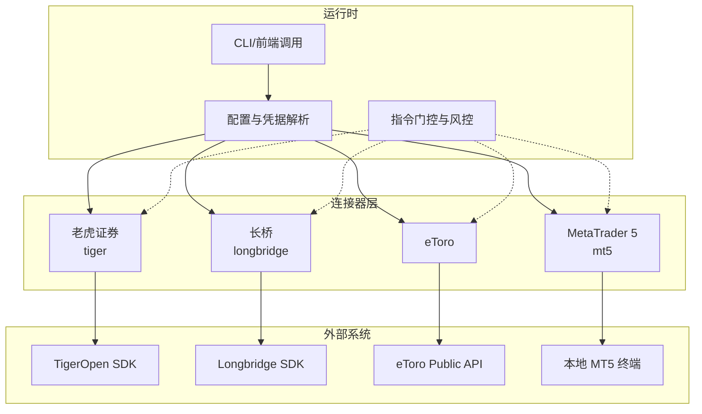
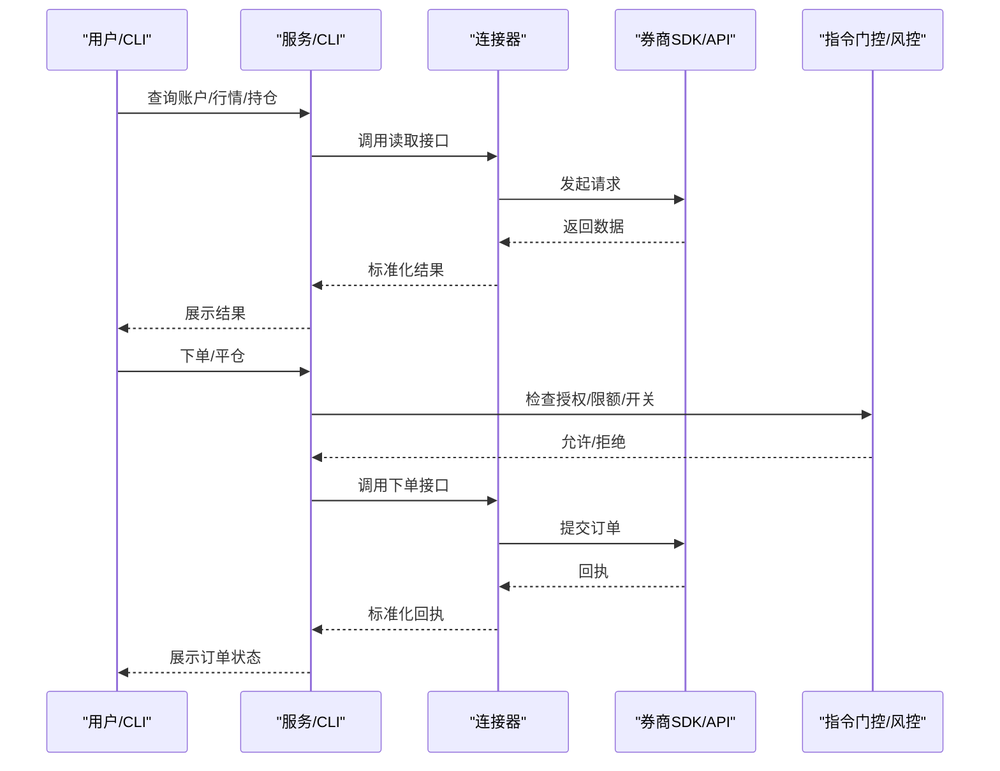
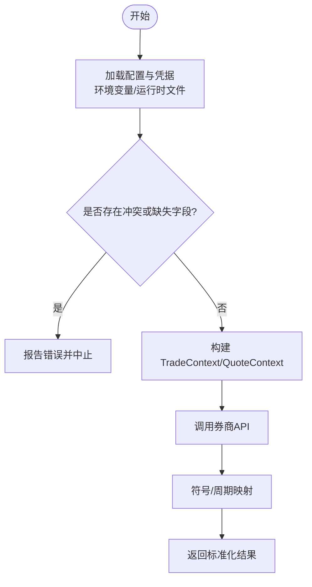
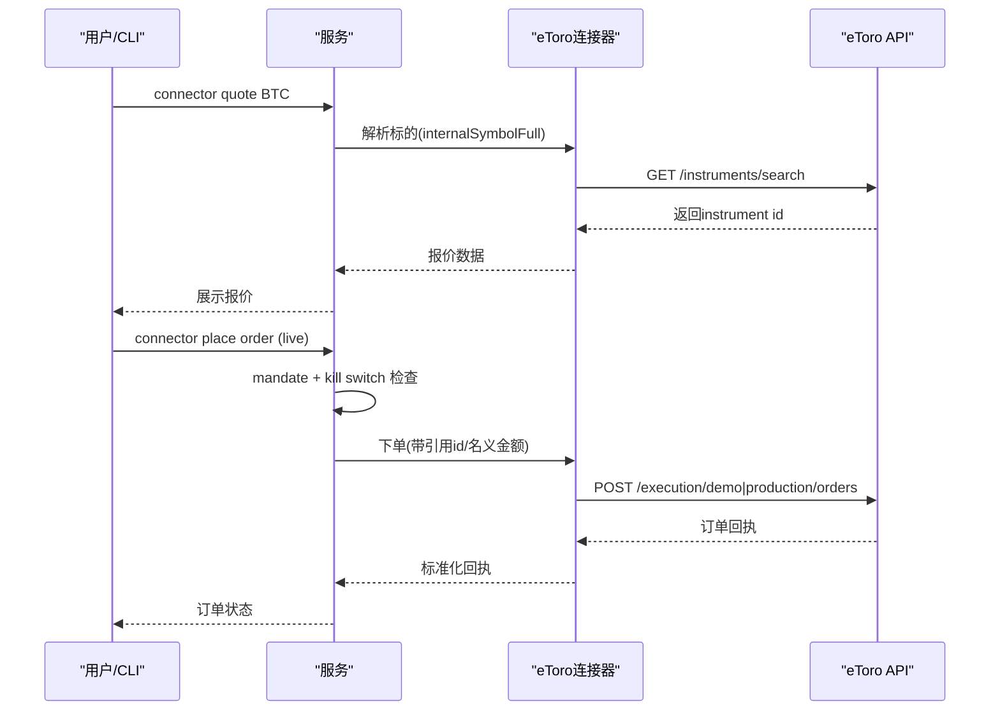
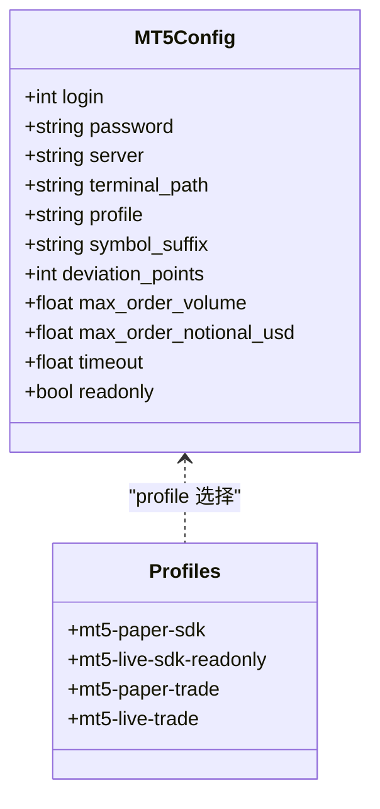
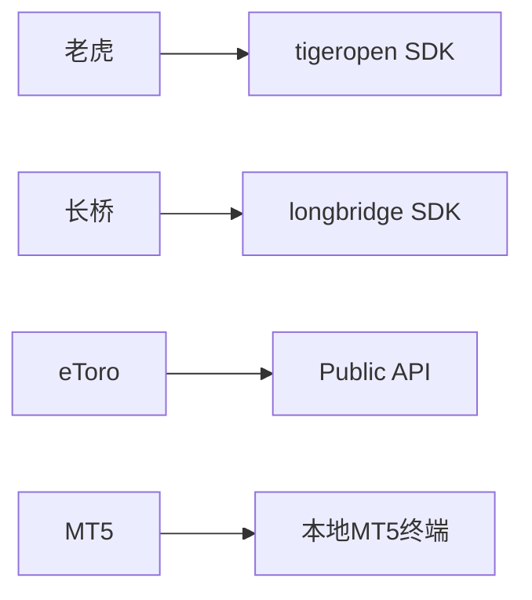

# 其他券商连接器

<cite>
**本文引用的文件**
- [agent/src/trading/connectors/tiger/__init__.py](file://agent/src/trading/connectors/tiger/__init__.py)
- [agent/src/trading/connectors/longbridge/__init__.py](file://agent/src/trading/connectors/longbridge/__init__.py)
- [agent/src/trading/connectors/longbridge/sdk.py](file://agent/src/trading/connectors/longbridge/sdk.py)
- [agent/src/trading/connectors/longbridge/credentials.py](file://agent/src/trading/connectors/longbridge/credentials.py)
- [agent/backtest/loaders/longbridge.py](file://agent/backtest/loaders/longbridge.py)
- [agent/src/trading/connectors/etoro/__init__.py](file://agent/src/trading/connectors/etoro/__init__.py)
- [README_zh.md](file://README_zh.md)
- [agent/src/trading/connectors/mt5/__init__.py](file://agent/src/trading/connectors/mt5/__init__.py)
- [agent/src/trading/connectors/mt5/_client.py](file://agent/src/trading/connectors/mt5/_client.py)
- [agent/src/trading/connectors/mt5/sdk.py](file://agent/src/trading/connectors/mt5/sdk.py)
- [agent/backtest/loaders/mt5_loader.py](file://agent/backtest/loaders/mt5_loader.py)
- [agent/tests/test_mt5_connector.py](file://agent/tests/test_mt5_connector.py)
- [agent/tests/test_longbridge_runtime.py](file://agent/tests/test_longbridge_runtime.py)
- [agent/tests/test_sdk_connectors.py](file://agent/tests/test_sdk_connectors.py)
- [agent/cli/_legacy.py](file://agent/cli/_legacy.py)
</cite>

## 目录
1. [简介](#简介)
2. [项目结构](#项目结构)
3. [核心组件](#核心组件)
4. [架构总览](#架构总览)
5. [详细组件分析](#详细组件分析)
6. [依赖关系分析](#依赖关系分析)
7. [性能与可靠性](#性能与可靠性)
8. [故障排查指南](#故障排查指南)
9. [结论](#结论)
10. [附录：配置清单与最佳实践](#附录：配置清单与最佳实践)

## 简介
本指南面向需要在系统中接入“其他券商”连接器的用户，覆盖老虎证券（Tiger Brokers）、长桥（Longbridge/LongPort）、eToro、MetaTrader 5（MT5）等平台的配置方法、特殊要求与依赖环境。文档同时说明跨境交易的合规要点、账户验证流程、多币种资金管理、多资产类别支持（外汇、差价合约、加密货币），以及移动端与桌面端集成方式，并提供连接测试、交易执行与风险管理的实际示例与限制建议。

## 项目结构
系统通过统一的“连接器”抽象将不同券商的 SDK/API 接入到同一套交易与数据管线中。各平台以独立的模块组织，遵循一致的“broker_sdk”传输模式或本地终端交互模式，并通过配置文件与环境变量管理凭据与运行参数。

图表来源
- [agent/src/trading/connectors/tiger/__init__.py:1-7](file://agent/src/trading/connectors/tiger/__init__.py#L1-L7)
- [agent/src/trading/connectors/longbridge/__init__.py:1-13](file://agent/src/trading/connectors/longbridge/__init__.py#L1-L13)
- [agent/src/trading/connectors/etoro/__init__.py:1-7](file://agent/src/trading/connectors/etoro/__init__.py#L1-L7)
- [agent/src/trading/connectors/mt5/__init__.py:1-14](file://agent/src/trading/connectors/mt5/__init__.py#L1-L14)

章节来源
- [agent/src/trading/connectors/tiger/__init__.py:1-7](file://agent/src/trading/connectors/tiger/__init__.py#L1-L7)
- [agent/src/trading/connectors/longbridge/__init__.py:1-13](file://agent/src/trading/connectors/longbridge/__init__.py#L1-L13)
- [agent/src/trading/connectors/etoro/__init__.py:1-7](file://agent/src/trading/connectors/etoro/__init__.py#L1-L7)
- [agent/src/trading/connectors/mt5/__init__.py:1-14](file://agent/src/trading/connectors/mt5/__init__.py#L1-L14)

## 核心组件
- 老虎证券连接器：基于官方 tigeropen SDK 的 broker_sdk 传输，当前提供只读账户与市场访问，后续阶段叠加模拟与受授权限制的实盘下单能力。
- 长桥连接器：基于 longbridge SDK 的 REST 接口（TradeContext/QuoteContext），提供只读账户与市场访问；纸盘与实盘共享主机与 App Key，仅凭 Access Token 区分，需由操作者声明 profile，并在可验证的运行期判别前对写操作进行门控。
- eToro 连接器：公共 API 连接器，支持 demo 与 real 读写；demo 与 real 共用密钥对，通过 /demo 与生产路径分离；实盘写操作需经 live action gate（mandate 强制）。
- MT5 连接器：通过本地运行的 MetaTrader5 终端（Windows-only）通信；paper/live 区分来自账户 trade_mode 与 login 的自校验；实盘下单需经过 mandate 门控与 kill switch，并叠加连接器自身尺寸限制。

章节来源
- [agent/src/trading/connectors/tiger/__init__.py:1-7](file://agent/src/trading/connectors/tiger/__init__.py#L1-L7)
- [agent/src/trading/connectors/longbridge/__init__.py:1-13](file://agent/src/trading/connectors/longbridge/__init__.py#L1-L13)
- [agent/src/trading/connectors/etoro/__init__.py:1-7](file://agent/src/trading/connectors/etoro/__init__.py#L1-L7)
- [agent/src/trading/connectors/mt5/__init__.py:1-14](file://agent/src/trading/connectors/mt5/__init__.py#L1-L14)

## 架构总览
各连接器统一暴露“读取账户/市场”和“订单执行”两类能力，并通过配置与凭据解析、指令门控与风控策略进行安全隔离。MT5 因依赖本地终端，具备更强的本地化特性与账号类型自校验；其余三者通过各自 SDK/API 完成网络交互。

图表来源
- [agent/src/trading/connectors/longbridge/sdk.py:34-82](file://agent/src/trading/connectors/longbridge/sdk.py#L34-L82)
- [agent/src/trading/connectors/mt5/_client.py:43-87](file://agent/src/trading/connectors/mt5/_client.py#L43-L87)
- [agent/src/trading/connectors/mt5/sdk.py:1-65](file://agent/src/trading/connectors/mt5/sdk.py#L1-L65)

## 详细组件分析

### 老虎证券（Tiger Brokers）
- 传输方式：broker_sdk（直接调用 tigeropen Python SDK，RSA 签名 REST）。
- 能力范围：当前 Layer A 提供只读的账户与市场访问；后续阶段叠加模拟与受 mandate 约束的实盘下单。
- 配置要点：使用 tigeropen SDK 所需的密钥与证书在运行时加载；连接器作为 broker_sdk 类型，不依赖本地 socket 或远程 MCP。
- 典型用法：connector use/check/account/positions/quote/history 等命令用于连通性、账户与行情验证。

章节来源
- [agent/src/trading/connectors/tiger/__init__.py:1-7](file://agent/src/trading/connectors/tiger/__init__.py#L1-L7)

### 长桥（Longbridge/LongPort）
- 传输方式：broker_sdk（通过 longbridge SDK 的 TradeContext/QuoteContext 走 REST）。
- 纸盘/实盘区分：无运行时字段区分，纸盘与实盘共享主机与 App Key，差异仅在 Access Token；因此 profile 由操作者声明，写操作需在可靠的运行期判别前进行门控。
- 区域与主机：global/cn 对应不同显示/诊断主机，SDK 内部选择实际 host。
- 凭据来源：支持环境变量与运行时文件两种方式，冲突时会报告缺失/冲突字段。
- 符号映射：项目符号到 LongPort 格式转换（如 AAPL -> AAPL.US），默认市场为美股；周期映射兼容 1H/4H 等项目风格 token。
- 账户余额渲染：CLI 支持多币种余额表输出（currency/net_assets/total_cash/buy_power/margin 等）。

图表来源
- [agent/src/trading/connectors/longbridge/credentials.py:1-46](file://agent/src/trading/connectors/longbridge/credentials.py#L1-L46)
- [agent/backtest/loaders/longbridge.py:73-112](file://agent/backtest/loaders/longbridge.py#L73-L112)
- [agent/cli/_legacy.py:4114-4148](file://agent/cli/_legacy.py#L4114-L4148)

章节来源
- [agent/src/trading/connectors/longbridge/__init__.py:1-13](file://agent/src/trading/connectors/longbridge/__init__.py#L1-L13)
- [agent/src/trading/connectors/longbridge/sdk.py:34-82](file://agent/src/trading/connectors/longbridge/sdk.py#L34-L82)
- [agent/src/trading/connectors/longbridge/credentials.py:1-46](file://agent/src/trading/connectors/longbridge/credentials.py#L1-L46)
- [agent/backtest/loaders/longbridge.py:73-112](file://agent/backtest/loaders/longbridge.py#L73-L112)
- [agent/cli/_legacy.py:4114-4148](file://agent/cli/_legacy.py#L4114-L4148)
- [agent/tests/test_longbridge_runtime.py:75-102](file://agent/tests/test_longbridge_runtime.py#L75-L102)
- [agent/tests/test_sdk_connectors.py:240-305](file://agent/tests/test_sdk_connectors.py#L240-L305)

### eToro
- 传输方式：Public API（demo 与 real 共用密钥对，通过 /demo 与生产路径分离）。
- 能力范围：demo 只读或模拟下单；real 只读或受 mandate + kill switch 约束的实盘下单。
- 标的查找：使用 internalSymbolFull 搜索（例如 BTC → instrument id），交易前需先解析代码。
- 安全边界：模拟与实盘按路径分离且与密钥绑定；实盘风险增加类操作需要已授权的 mandate、清晰未暂停状态，并以 USD 账户名义金额约束跟单规模；部分撤销/修改止损止盈仅限模拟盘，实盘 fail-closed。
- 常用命令：connector use/check/account/positions/quote/history 等。

图表来源
- [agent/src/trading/connectors/etoro/__init__.py:1-7](file://agent/src/trading/connectors/etoro/__init__.py#L1-L7)
- [README_zh.md:1438-1459](file://README_zh.md#L1438-L1459)

章节来源
- [agent/src/trading/connectors/etoro/__init__.py:1-7](file://agent/src/trading/connectors/etoro/__init__.py#L1-L7)
- [README_zh.md:1438-1459](file://README_zh.md#L1438-L1459)

### MetaTrader 5（MT5）
- 传输方式：broker_sdk，通过本地运行的 MetaTrader5 终端（Windows-only）通信。
- 纸盘/实盘区分：无独立 paper API，“paper”即券商 DEMO 账户；每次会话重读 account_info().trade_mode 与 login 进行自校验，严格拒绝错配（contest 账户全局拒绝，fail-closed）。
- 配置项：login/password/server/terminal_path/profile/symbol_suffix/deviation_points/max_order_volume/max_order_notional_usd/timeout/readonly。
- 订单与风控：实盘下单需通过 mandate 门控与 kill switch，并叠加连接器级别的每笔手数与美元名义上限。
- 回测/数据：loader 与连接器共享 mt5.json 配置，时间周期映射支持 1m/5m/15m/30m/1H/4H/1D/1W/1M。

图表来源
- [agent/src/trading/connectors/mt5/_client.py:43-87](file://agent/src/trading/connectors/mt5/_client.py#L43-L87)
- [agent/src/trading/connectors/mt5/sdk.py:1-65](file://agent/src/trading/connectors/mt5/sdk.py#L1-L65)

章节来源
- [agent/src/trading/connectors/mt5/__init__.py:1-14](file://agent/src/trading/connectors/mt5/__init__.py#L1-L14)
- [agent/src/trading/connectors/mt5/_client.py:43-87](file://agent/src/trading/connectors/mt5/_client.py#L43-L87)
- [agent/src/trading/connectors/mt5/sdk.py:1-65](file://agent/src/trading/connectors/mt5/sdk.py#L1-L65)
- [agent/backtest/loaders/mt5_loader.py:35-67](file://agent/backtest/loaders/mt5_loader.py#L35-L67)
- [agent/tests/test_mt5_connector.py:59-92](file://agent/tests/test_mt5_connector.py#L59-L92)

## 依赖关系分析
- 老虎证券：依赖 tigeropen SDK（RSA 签名 REST）。
- 长桥：依赖 longbridge SDK（REST），支持 global/cn 区域；凭据可从环境变量或运行时文件解析。
- eToro：依赖 Public API（demo/production 路径分离），需配置 API Key 与 User Key。
- MT5：依赖 Windows-only 的 MetaTrader5 包与本地终端；配置保存在 ~/.vibe-trading/mt5.json。

图表来源
- [agent/src/trading/connectors/tiger/__init__.py:1-7](file://agent/src/trading/connectors/tiger/__init__.py#L1-L7)
- [agent/src/trading/connectors/longbridge/sdk.py:34-82](file://agent/src/trading/connectors/longbridge/sdk.py#L34-L82)
- [agent/src/trading/connectors/etoro/__init__.py:1-7](file://agent/src/trading/connectors/etoro/__init__.py#L1-L7)
- [agent/src/trading/connectors/mt5/__init__.py:1-14](file://agent/src/trading/connectors/mt5/__init__.py#L1-L14)

章节来源
- [agent/src/trading/connectors/tiger/__init__.py:1-7](file://agent/src/trading/connectors/tiger/__init__.py#L1-L7)
- [agent/src/trading/connectors/longbridge/sdk.py:34-82](file://agent/src/trading/connectors/longbridge/sdk.py#L34-L82)
- [agent/src/trading/connectors/etoro/__init__.py:1-7](file://agent/src/trading/connectors/etoro/__init__.py#L1-L7)
- [agent/src/trading/connectors/mt5/__init__.py:1-14](file://agent/src/trading/connectors/mt5/__init__.py#L1-L14)

## 性能与可靠性
- 本地终端附加：MT5 初始化可能耗时较长（甚至启动终端），连接器与 loader 均缓存初始化状态以减少重复开销。
- 网络超时与重试：长桥连接器支持 timeout 配置；建议在高频查询场景下合理设置超时与重试策略。
- 符号与周期映射：长桥与 MT5 均提供项目风格的周期映射（如 1H/4H/1D），避免误用导致的数据粒度偏差。
- 资源占用：MT5 依赖 Windows 本地进程，注意并发与资源竞争；长桥/eToro/Tiger 为纯网络调用，注意限流与并发控制。

章节来源
- [agent/backtest/loaders/mt5_loader.py:35-67](file://agent/backtest/loaders/mt5_loader.py#L35-L67)
- [agent/src/trading/connectors/longbridge/sdk.py:34-82](file://agent/src/trading/connectors/longbridge/sdk.py#L34-L82)

## 故障排查指南
- 长桥凭据冲突或缺失：当环境变量与运行时文件同时存在且不一致时，连接器会报告冲突字段；若缺少必要字段（app_key/app_secret/access_token），将提示并中止。
- 长桥连接状态：API 层会返回连接状态（connected/not_configured/error），便于前端或 CLI 展示诊断信息。
- MT5 依赖缺失：未安装 MetaTrader5 包或未运行本地终端时，连接器抛出依赖错误并给出安装指引。
- MT5 账户错配：paper 配置连接到实盘账户或反之会被硬拒绝；contest 账户全局拒绝。
- eToro 标的解析：交易前必须通过工具解析 internalSymbolFull，否则下单可能失败。

章节来源
- [agent/tests/test_sdk_connectors.py:240-305](file://agent/tests/test_sdk_connectors.py#L240-L305)
- [agent/tests/test_longbridge_runtime.py:75-102](file://agent/tests/test_longbridge_runtime.py#L75-L102)
- [agent/src/trading/connectors/mt5/_client.py:183-204](file://agent/src/trading/connectors/mt5/_client.py#L183-L204)
- [agent/src/trading/connectors/mt5/__init__.py:1-14](file://agent/src/trading/connectors/mt5/__init__.py#L1-L14)
- [README_zh.md:1438-1459](file://README_zh.md#L1438-L1459)

## 结论
本项目为多券商连接器提供了统一抽象与安全边界：通过 broker_sdk 传输、配置与凭据解析、指令门控与风控策略，实现对老虎证券、长桥、eToro、MT5 的一致接入。MT5 强调本地终端与账户自校验；长桥强调凭据来源一致性与区域选择；eToro 强调 demo/real 路径分离与 mandate 约束；老虎证券聚焦只读能力并预留后续写操作扩展。结合多资产类别支持与多币种余额展示，可满足外汇、差价合约、加密货币等多场景需求。

## 附录：配置清单与最佳实践

### 通用配置步骤
- 安装对应额外依赖：
  - MT5：pip install "vibe-trading-ai[mt5]"
  - 长桥：pip install "vibe-trading-ai[longbridge]"
- 准备凭据：
  - 老虎证券：tigeropen SDK 所需密钥与证书
  - 长桥：App Key、App Secret、Access Token（环境变量或运行时文件）
  - eToro：x-api-key、x-user-key（demo/real 共用）
  - MT5：登录号、密码、服务器名、可选终端路径
- 选择 profile：
  - 长桥：paper / live-readonly / live
  - MT5：paper / live-readonly / live
  - eToro：etoro-paper-sdk / etoro-live-sdk-readonly / etoro-paper-trade / etoro-live-trade
- 验证连接：
  - 使用 CLI：connector use/check/account/positions/quote/history
  - 查看连接状态：/live/status 或 CLI 输出

章节来源
- [agent/src/trading/connectors/longbridge/sdk.py:34-82](file://agent/src/trading/connectors/longbridge/sdk.py#L34-L82)
- [agent/src/trading/connectors/mt5/_client.py:55-87](file://agent/src/trading/connectors/mt5/_client.py#L55-L87)
- [agent/src/trading/connectors/mt5/sdk.py:1-65](file://agent/src/trading/connectors/mt5/sdk.py#L1-L65)
- [agent/tests/test_longbridge_runtime.py:75-102](file://agent/tests/test_longbridge_runtime.py#L75-L102)

### 各平台特殊要求与依赖环境
- 老虎证券：依赖 tigeropen SDK（RSA 签名 REST），当前以只读为主，后续阶段叠加写操作。
- 长桥：依赖 longbridge SDK（REST），支持 global/cn；纸盘/实盘由 Access Token 区分，需可靠判别后再开放写操作。
- eToro：Public API，demo/real 路径分离；交易前需解析标的 ID；实盘写操作受 mandate + kill switch 约束。
- MT5：Windows-only，需本地终端；paper/live 由账户 trade_mode 与 login 自校验；实盘下单需 mandate + kill switch 与连接器尺寸限制。

章节来源
- [agent/src/trading/connectors/tiger/__init__.py:1-7](file://agent/src/trading/connectors/tiger/__init__.py#L1-L7)
- [agent/src/trading/connectors/longbridge/__init__.py:1-13](file://agent/src/trading/connectors/longbridge/__init__.py#L1-L13)
- [agent/src/trading/connectors/etoro/__init__.py:1-7](file://agent/src/trading/connectors/etoro/__init__.py#L1-L7)
- [agent/src/trading/connectors/mt5/__init__.py:1-14](file://agent/src/trading/connectors/mt5/__init__.py#L1-L14)

### 跨境交易合规与账户验证
- 合规要点：
  - 明确账户所在地与监管辖区（长桥 global/cn；eToro 公共 API 区域；MT5 券商服务器）。
  - 确保资金划转与交易品种符合当地法规（外汇、CFD、加密货币在不同地区受限程度不同）。
  - 实盘写操作需通过 mandate 授权与 kill switch 保护。
- 账户验证流程：
  - 完成 KYC/身份验证（依券商要求）。
  - 配置并验证连接（connector check），确认账户类型与权限。
  - 首次交易前进行小额测试单，确认滑点、手续费与结算正常。

章节来源
- [agent/src/trading/connectors/longbridge/sdk.py:34-82](file://agent/src/trading/connectors/longbridge/sdk.py#L34-L82)
- [agent/src/trading/connectors/mt5/_client.py:55-87](file://agent/src/trading/connectors/mt5/_client.py#L55-L87)
- [README_zh.md:1438-1459](file://README_zh.md#L1438-L1459)

### 多币种账户的资金管理配置
- 长桥：支持多币种余额表（currency/net_assets/total_cash/buy_power/init_margin/maintenance_margin），可在 CLI 中查看。
- eToro：跟单名义金额以账户币种计价，需为每次跟单启动/调整提供 URL-safe 引用 id。
- MT5：按账户币种与保证金机制管理；可通过 max_order_notional_usd 进行美元名义上限防护。
- 老虎证券：以只读为主，关注账户余额与可用资金。

章节来源
- [agent/cli/_legacy.py:4114-4148](file://agent/cli/_legacy.py#L4114-L4148)
- [README_zh.md:1438-1459](file://README_zh.md#L1438-L1459)
- [agent/src/trading/connectors/mt5/_client.py:55-87](file://agent/src/trading/connectors/mt5/_client.py#L55-L87)

### 多资产类别支持（外汇、差价合约、加密货币）
- 外汇与差价合约：MT5 原生支持外汇与 CFD；长桥支持多市场股票与衍生品；eToro 支持多种资产类别。
- 加密货币：eToro 与 MT5（取决于券商）支持加密货币；长桥可通过市场路由获取相关标的。
- 标的解析：eToro 需通过 internalSymbolFull 搜索；长桥需转换为 .US/.HK/.SH/.SZ 等后缀；MT5 需处理 symbol_suffix（如 Exness 的 m 后缀）。

章节来源
- [agent/backtest/loaders/longbridge.py:73-112](file://agent/backtest/loaders/longbridge.py#L73-L112)
- [agent/backtest/loaders/mt5_loader.py:35-67](file://agent/backtest/loaders/mt5_loader.py#L35-L67)
- [README_zh.md:1438-1459](file://README_zh.md#L1438-L1459)

### 移动端与桌面端集成
- 桌面端：MT5 依赖本地终端（Windows），适合桌面端部署；其他连接器通过 SDK/API 与后端服务交互。
- 移动端：通过 CLI/前端与服务端交互，连接状态与账户信息可在 UI 中展示；长桥/eToro/Tiger 均可通过后端服务暴露。
- 集成建议：将连接配置与凭据存储在安全位置（环境变量或加密文件），避免在聊天或日志中泄露。

章节来源
- [agent/src/trading/connectors/mt5/__init__.py:1-14](file://agent/src/trading/connectors/mt5/__init__.py#L1-L14)
- [agent/tests/test_longbridge_runtime.py:75-102](file://agent/tests/test_longbridge_runtime.py#L75-L102)

### 连接测试、交易执行与风险管理示例
- 连接测试：
  - 使用 CLI：connector use <profile>、connector check、connector account、connector positions、connector quote <symbol>
  - 查看连接状态：/live/status
- 交易执行：
  - eToro：先解析标的 ID，再下单；实盘需 mandate + kill switch。
  - MT5：设置最大手数与美元名义上限；实盘需 mandate + kill switch。
  - 长桥：确保 Access Token 正确；写操作需可靠判别后再开放。
- 风险管理：
  - 使用 mandate 与 kill switch 保护实盘写操作。
  - 设置连接器级别尺寸限制（max_order_volume / max_order_notional_usd）。
  - 对高频查询设置超时与重试策略。

章节来源
- [agent/src/trading/connectors/etoro/__init__.py:1-7](file://agent/src/trading/connectors/etoro/__init__.py#L1-L7)
- [agent/src/trading/connectors/mt5/_client.py:55-87](file://agent/src/trading/connectors/mt5/_client.py#L55-L87)
- [agent/src/trading/connectors/longbridge/sdk.py:34-82](file://agent/src/trading/connectors/longbridge/sdk.py#L34-L82)
- [agent/tests/test_longbridge_runtime.py:75-102](file://agent/tests/test_longbridge_runtime.py#L75-L102)

### 各平台限制与最佳实践
- 老虎证券：当前以只读为主，写操作后续阶段开放；注意 RSA 签名与网络稳定性。
- 长桥：纸盘/实盘无法从 API 响应自校验，需依赖 Access Token 与配置；区域选择影响显示与诊断。
- eToro：demo/real 路径分离；实盘写操作受 mandate + kill switch 约束；标的解析必须先于下单。
- MT5：Windows-only；paper/live 由账户 trade_mode 与 login 自校验；实盘下单需 mandate + kill switch 与尺寸限制。

章节来源
- [agent/src/trading/connectors/tiger/__init__.py:1-7](file://agent/src/trading/connectors/tiger/__init__.py#L1-L7)
- [agent/src/trading/connectors/longbridge/__init__.py:1-13](file://agent/src/trading/connectors/longbridge/__init__.py#L1-L13)
- [agent/src/trading/connectors/etoro/__init__.py:1-7](file://agent/src/trading/connectors/etoro/__init__.py#L1-L7)
- [agent/src/trading/connectors/mt5/__init__.py:1-14](file://agent/src/trading/connectors/mt5/__init__.py#L1-L14)