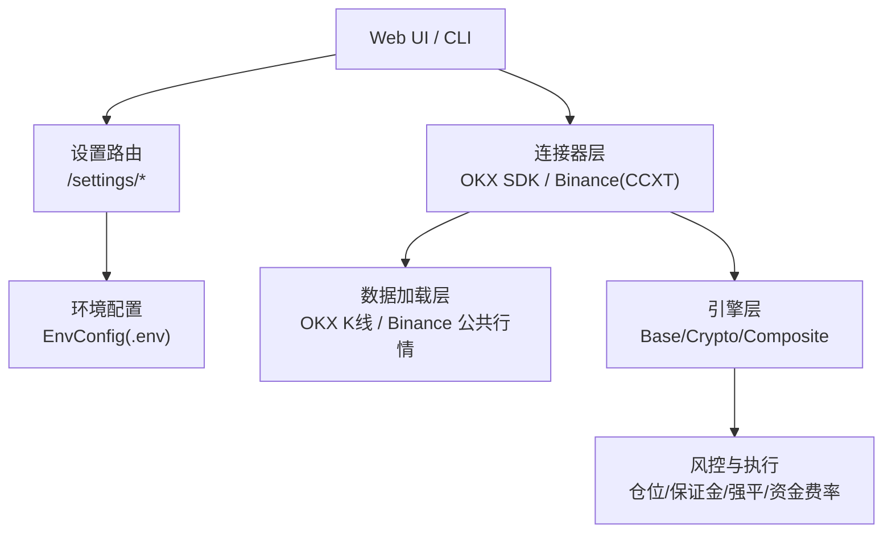
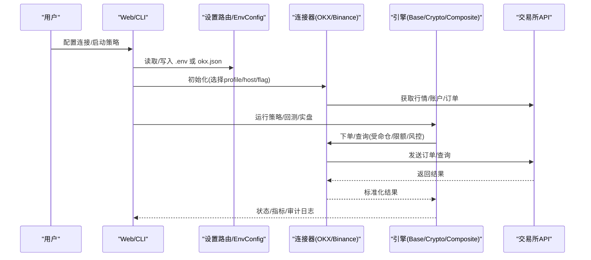
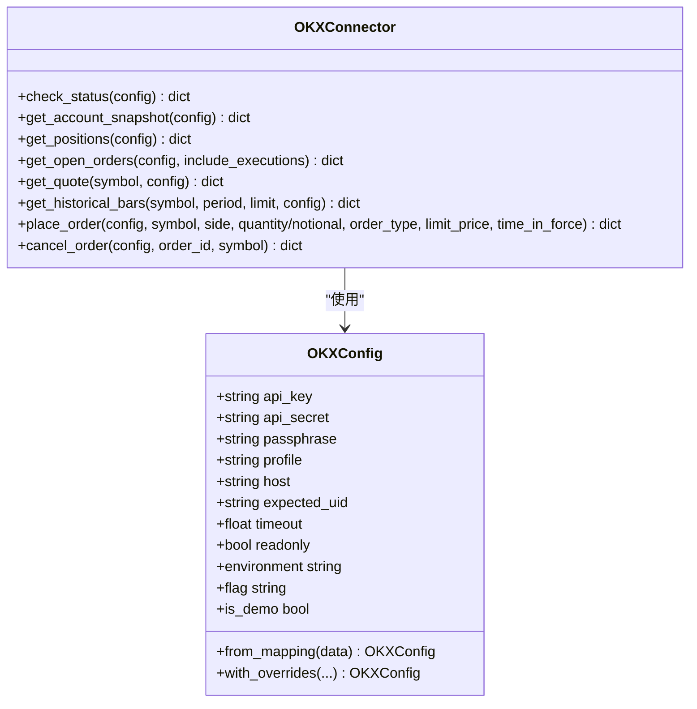
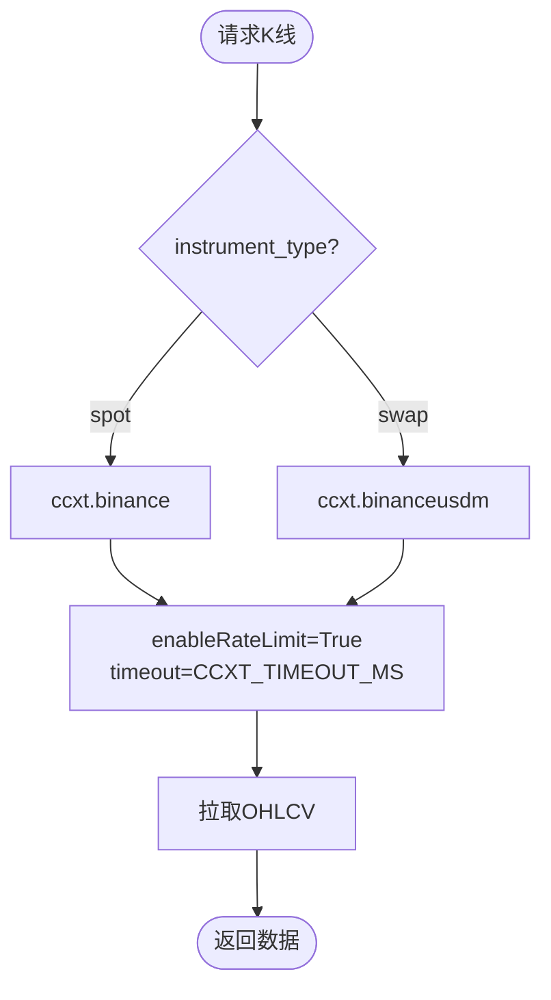
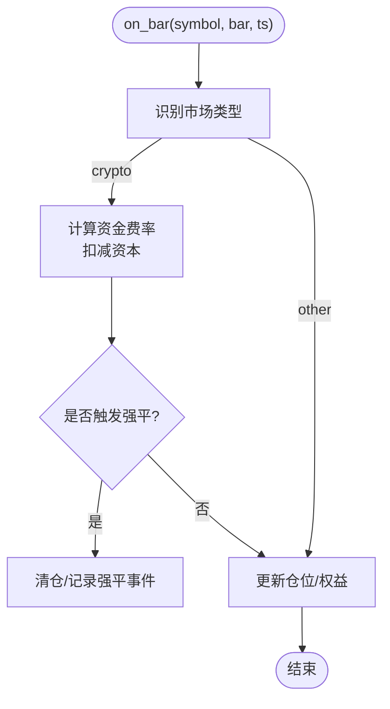
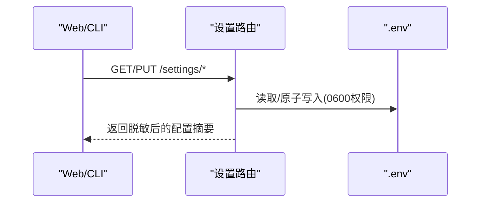
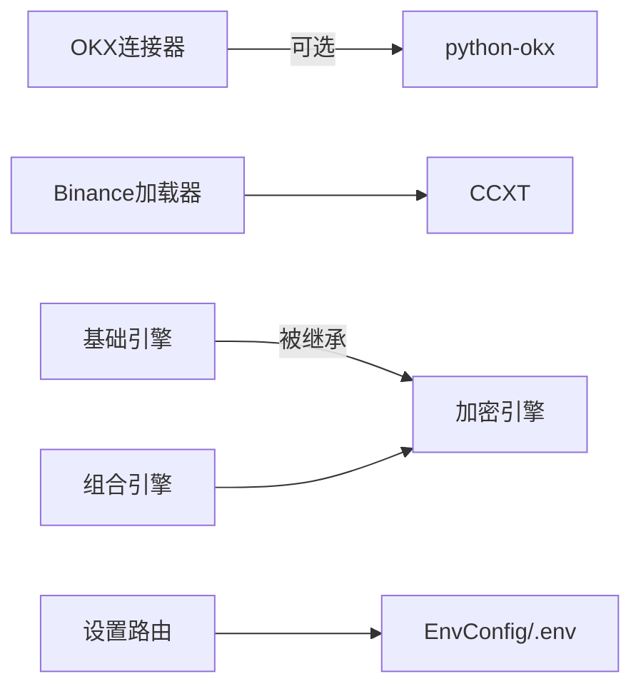

# 加密货币交易所配置

<cite>
**本文引用的文件**
- [README.md](file://README.md)
- [binance_loader.py](file://agent/backtest/loaders/binance_loader.py)
- [okx-sdk.py](file://agent/src/trading/connectors/okx/sdk.py)
- [env_schema.py](file://agent/src/config/env_schema.py)
- [settings_routes.py](file://agent/src/api/settings_routes.py)
- [base.py](file://agent/backtest/engines/base.py)
- [crypto.py](file://agent/backtest/engines/crypto.py)
- [composite.py](file://agent/backtest/engines/composite.py)
- [investment_committee.yaml](file://agent/src/swarm/presets/investment_committee.yaml)
- [SKILL.md](file://agent/src/skills/okx-market/SKILL.md)
</cite>

## 目录
1. [简介](#简介)
2. [项目结构](#项目结构)
3. [核心组件](#核心组件)
4. [架构总览](#架构总览)
5. [详细组件分析](#详细组件分析)
6. [依赖关系分析](#依赖关系分析)
7. [性能与可靠性](#性能与可靠性)
8. [故障排查指南](#故障排查指南)
9. [结论](#结论)
10. [附录：配置清单与示例流程](#附录配置清单与示例流程)

## 简介
本指南面向使用 Vibe-Trading 接入主流加密货币交易所（币安、OKX）的开发者与运营人员，覆盖账户注册与 KYC、API 密钥与安全设置、现货与合约交易配置差异、杠杆与保证金管理、交易对与最小单位、实时监控与自动交易、风险控制策略实现，以及交易所维护期间的处理与恢复机制。文档基于仓库内连接器、数据加载器、引擎与配置模块的实际实现进行说明，确保可操作且与代码一致。

## 项目结构
围绕“交易所连接器 + 数据加载器 + 回测/实盘引擎 + 配置中心”的分层组织：
- 连接器层：OKX SDK 封装（账户、行情、订单）、Binance 现货/永续通过 CCXT 统一访问。
- 数据加载层：OKX 历史 K 线、Binance 公共行情（无需 API Key）。
- 引擎层：通用基础引擎、加密专用引擎（永续严格模式、资金费率、强平逻辑）、组合引擎（跨市场）。
- 配置层：环境变量集中 schema、设置路由（读写 .env）、连接器配置文件（如 okx.json）。

图表来源
- [env_schema.py:166-214](file://agent/src/config/env_schema.py#L166-L214)
- [settings_routes.py:383-482](file://agent/src/api/settings_routes.py#L383-L482)
- [okx-sdk.py:138-174](file://agent/src/trading/connectors/okx/sdk.py#L138-L174)
- [binance_loader.py:23-44](file://agent/backtest/loaders/binance_loader.py#L23-L44)
- [base.py:1298-1452](file://agent/backtest/engines/base.py#L1298-L1452)
- [crypto.py:486-517](file://agent/backtest/engines/crypto.py#L486-L517)
- [composite.py:212-245](file://agent/backtest/engines/composite.py#L212-L245)

章节来源
- [env_schema.py:166-214](file://agent/src/config/env_schema.py#L166-L214)
- [settings_routes.py:383-482](file://agent/src/api/settings_routes.py#L383-L482)
- [okx-sdk.py:138-174](file://agent/src/trading/connectors/okx/sdk.py#L138-L174)
- [binance_loader.py:23-44](file://agent/backtest/loaders/binance_loader.py#L23-L44)
- [base.py:1298-1452](file://agent/backtest/engines/base.py#L1298-L1452)
- [crypto.py:486-517](file://agent/backtest/engines/crypto.py#L486-L517)
- [composite.py:212-245](file://agent/backtest/engines/composite.py#L212-L245)

## 核心组件
- OKX 连接器（只读为主，支持现货下单）：提供账户快照、持仓、挂单、报价、历史 K 线；通过 profile 区分 demo/live，并记录纸面保护标记。
- Binance 数据加载器：基于 CCXT 的公开行情，支持 spot 与 USD-M 永续；无需 API Key。
- 引擎层：基础引擎负责仓位/保证金/滑点/手续费；加密引擎在严格模式下处理资金费率与强平；组合引擎聚合多市场事件。
- 配置中心：集中的环境变量 schema，Settings 路由安全写入 .env；连接器本地配置文件（如 okx.json）持久化。

章节来源
- [okx-sdk.py:1-73](file://agent/src/trading/connectors/okx/sdk.py#L1-L73)
- [binance_loader.py:1-44](file://agent/backtest/loaders/binance_loader.py#L1-L44)
- [base.py:1298-1452](file://agent/backtest/engines/base.py#L1298-L1452)
- [crypto.py:486-517](file://agent/backtest/engines/crypto.py#L486-L517)
- [composite.py:212-245](file://agent/backtest/engines/composite.py#L212-L245)
- [env_schema.py:166-214](file://agent/src/config/env_schema.py#L166-L214)
- [settings_routes.py:383-482](file://agent/src/api/settings_routes.py#L383-L482)

## 架构总览
下图展示从 Web/CLI 到交易所的数据与指令流，强调配置、连接器、引擎与风控的协作。

图表来源
- [settings_routes.py:383-482](file://agent/src/api/settings_routes.py#L383-L482)
- [okx-sdk.py:138-174](file://agent/src/trading/connectors/okx/sdk.py#L138-L174)
- [binance_loader.py:23-44](file://agent/backtest/loaders/binance_loader.py#L23-L44)
- [base.py:1298-1452](file://agent/backtest/engines/base.py#L1298-L1452)
- [crypto.py:486-517](file://agent/backtest/engines/crypto.py#L486-L517)

## 详细组件分析

### OKX 连接器与配置
- 配置文件位置与权限：连接器将配置保存至运行时根目录下的 okx.json，并以仅所有者读写权限持久化。
- Profile 与环境：支持 paper/live-readonly/live，内部映射为 demo/live flag；check_status 会尝试校验 UID 以增强纸面/实盘隔离。
- 能力范围：账户余额、持仓、未成交订单、报价、历史 K 线；现货下单接口已暴露，但需遵循 profile 与风控约束。

图表来源
- [okx-sdk.py:51-128](file://agent/src/trading/connectors/okx/sdk.py#L51-L128)
- [okx-sdk.py:138-174](file://agent/src/trading/connectors/okx/sdk.py#L138-L174)
- [okx-sdk.py:186-245](file://agent/src/trading/connectors/okx/sdk.py#L186-L245)
- [okx-sdk.py:248-349](file://agent/src/trading/connectors/okx/sdk.py#L248-L349)
- [okx-sdk.py:371-479](file://agent/src/trading/connectors/okx/sdk.py#L371-L479)
- [okx-sdk.py:482-526](file://agent/src/trading/connectors/okx/sdk.py#L482-L526)

章节来源
- [okx-sdk.py:138-174](file://agent/src/trading/connectors/okx/sdk.py#L138-L174)
- [okx-sdk.py:186-245](file://agent/src/trading/connectors/okx/sdk.py#L186-L245)
- [okx-sdk.py:248-349](file://agent/src/trading/connectors/okx/sdk.py#L248-L349)
- [okx-sdk.py:371-479](file://agent/src/trading/connectors/okx/sdk.py#L371-L479)
- [okx-sdk.py:482-526](file://agent/src/trading/connectors/okx/sdk.py#L482-L526)

### 币安数据加载器（CCXT）
- 用途：提供币安现货与 USD-M 永续的 OHLCV 数据，无需 API Key。
- 行为：通过 CCXT 统一客户端，启用速率限制与超时；可按 instrument_type 切换 spot 或 swap。

图表来源
- [binance_loader.py:23-44](file://agent/backtest/loaders/binance_loader.py#L23-L44)

章节来源
- [binance_loader.py:23-44](file://agent/backtest/loaders/binance_loader.py#L23-L44)

### 引擎层：保证金、杠杆与强平
- 基础引擎：计算开仓/减仓/加仓的保证金、滑点、手续费；校验重平衡值与资金充足性。
- 加密引擎：在 perpetual_strict 模式下记录资金费率、按标记价评估强平；隔离保证金模式下记录每标的占用保证金。
- 组合引擎：跨市场聚合事件，调用加密子引擎的资金费率与强平检查。

图表来源
- [composite.py:212-245](file://agent/backtest/engines/composite.py#L212-L245)
- [crypto.py:486-517](file://agent/backtest/engines/crypto.py#L486-L517)
- [base.py:1298-1452](file://agent/backtest/engines/base.py#L1298-L1452)

章节来源
- [base.py:1298-1452](file://agent/backtest/engines/base.py#L1298-L1452)
- [crypto.py:486-517](file://agent/backtest/engines/crypto.py#L486-L517)
- [composite.py:212-245](file://agent/backtest/engines/composite.py#L212-L245)

### 配置与设置路由
- 环境变量集中管理：所有关键开关与凭据通过 EnvConfig 统一管理，包括 CCXT 默认交易所、超时、预算等。
- 设置路由：提供 /settings/llm 与 /settings/data-sources 等接口，支持安全写入 .env，并对远程访问强制鉴权。

图表来源
- [env_schema.py:166-214](file://agent/src/config/env_schema.py#L166-L214)
- [settings_routes.py:383-482](file://agent/src/api/settings_routes.py#L383-L482)

章节来源
- [env_schema.py:166-214](file://agent/src/config/env_schema.py#L166-L214)
- [settings_routes.py:383-482](file://agent/src/api/settings_routes.py#L383-L482)

## 依赖关系分析
- 连接器依赖：OKX 连接器依赖可选 python-okx 包；Binance 数据加载器依赖 CCXT。
- 引擎依赖：加密引擎依赖基础引擎的仓位/保证金/滑点/手续费计算；组合引擎聚合多市场并调用加密子引擎。
- 配置依赖：设置路由依赖 EnvConfig 解析环境变量；连接器配置文件由连接器自身持久化。

图表来源
- [okx-sdk.py:589-615](file://agent/src/trading/connectors/okx/sdk.py#L589-L615)
- [binance_loader.py:15-44](file://agent/backtest/loaders/binance_loader.py#L15-L44)
- [base.py:1298-1452](file://agent/backtest/engines/base.py#L1298-L1452)
- [env_schema.py:166-214](file://agent/src/config/env_schema.py#L166-L214)

章节来源
- [okx-sdk.py:589-615](file://agent/src/trading/connectors/okx/sdk.py#L589-L615)
- [binance_loader.py:15-44](file://agent/backtest/loaders/binance_loader.py#L15-L44)
- [base.py:1298-1452](file://agent/backtest/engines/base.py#L1298-L1452)
- [env_schema.py:166-214](file://agent/src/config/env_schema.py#L166-L214)

## 性能与可靠性
- 速率限制与超时：CCXT 加载器启用 enableRateLimit 与超时；OKX 历史 K 线使用 history-candles 接口并具备重试能力（见 README 更新日志）。
- 缓存与离线：支持数据缓存开关，减少重复网络请求与限流影响。
- 稳健性：设置写入采用原子替换与权限控制；连接器健康检查报告清晰错误信息，便于快速定位。

章节来源
- [binance_loader.py:23-44](file://agent/backtest/loaders/binance_loader.py#L23-L44)
- [settings_routes.py:573-576](file://agent/src/api/settings_routes.py#L573-L576)
- [README.md:行内提及 OKX 历史 K 线与缓存](file://README.md)

## 故障排查指南
- 连接器不可用：检查 python-okx 是否安装；查看 check_status 返回的错误字段与缺失字段提示。
- 配置不完整：确认 okx.json 中 api_key、api_secret、passphrase 与 profile 正确；必要时设置 expected_uid 进行 UID 校验。
- 权限问题：确认 .env 与 okx.json 的权限为仅所有者读写；远程访问 Settings 需要 API_AUTH_KEY。
- 网络与限流：调整 CCXT_TIMEOUT_MS、CCXT_FETCH_BUDGET_S；必要时启用代理或关闭代理开关。

章节来源
- [okx-sdk.py:186-245](file://agent/src/trading/connectors/okx/sdk.py#L186-L245)
- [okx-sdk.py:618-640](file://agent/src/trading/connectors/okx/sdk.py#L618-L640)
- [env_schema.py:166-214](file://agent/src/config/env_schema.py#L166-L214)
- [settings_routes.py:383-482](file://agent/src/api/settings_routes.py#L383-L482)

## 结论
本项目提供了完善的加密货币交易所连接器与数据加载能力，结合统一的配置管理与稳健的引擎层，能够支撑现货与合约交易的回测与实盘。通过 OKX 与 Binance 的组合，既能利用公开行情做研究与回测，也能在合规前提下进行纸面与实盘交易。建议在生产环境中严格遵循配置安全、风控与监控最佳实践，并在交易所维护期间启用降级与恢复策略。

## 附录：配置清单与示例流程

### 账户注册与 KYC
- 币安：注册账号并完成 KYC；如需交易权限，按平台要求完成相应验证。
- OKX：注册账号并完成 KYC；创建 API Key 时注意区分 demo 与 live 的键空间，并为每个 Key 设置 passphrase。

章节来源
- [SKILL.md:1-34](file://agent/src/skills/okx-market/SKILL.md#L1-L34)

### API 密钥与安全设置
- 币安：建议使用测试网（testnet）进行纸面交易；生产环境使用主网主机名与独立 Key。
- OKX：通过 okx.json 保存 Key 与 passphrase；使用 profile 选择 demo/live；可设置 expected_uid 强化身份校验。
- 环境变量：通过 EnvConfig 管理 CCXT_EXCHANGE、CCXT_TIMEOUT_MS、CCXT_FETCH_BUDGET_S 等；Settings 路由安全写入 .env。

章节来源
- [env_schema.py:166-214](file://agent/src/config/env_schema.py#L166-L214)
- [okx-sdk.py:138-174](file://agent/src/trading/connectors/okx/sdk.py#L138-L174)
- [settings_routes.py:383-482](file://agent/src/api/settings_routes.py#L383-L482)

### IP 白名单与交易权限限制
- 在交易所后台为 API Key 绑定 IP 白名单，限制仅允许本机或服务器 IP 访问。
- 在连接器层限制 profile（如 live-readonly），避免误操作；订单方法仅在授权路径下暴露。

章节来源
- [okx-sdk.py:51-73](file://agent/src/trading/connectors/okx/sdk.py#L51-L73)
- [okx-sdk.py:371-479](file://agent/src/trading/connectors/okx/sdk.py#L371-L479)

### 现货与合约交易配置差异
- 现货：使用 CCXT 的 binance 或 OKX 现货端；无持仓概念（币安现货以余额体现），订单类型为 cash。
- 合约：使用 CCXT 的 binanceusdm 或 OKX 衍生品端；需关注资金费率、标记价、强平阈值与保证金模式（逐仓/全仓）。

章节来源
- [binance_loader.py:31-44](file://agent/backtest/loaders/binance_loader.py#L31-L44)
- [okx-sdk.py:332-363](file://agent/src/trading/connectors/okx/sdk.py#L332-L363)
- [crypto.py:486-517](file://agent/backtest/engines/crypto.py#L486-L517)

### 杠杆交易的风险控制与保证金管理
- 杠杆与保证金：基础引擎根据目标名义价值与价格计算保证金；不同标的可配置不同杠杆。
- 强平与资金费率：加密引擎在严格模式下按标记价评估强平，并扣除资金费率；隔离保证金模式下记录每标的占用。
- 组合引擎：跨市场事件聚合，调用加密子引擎进行风险检查。

章节来源
- [base.py:1298-1452](file://agent/backtest/engines/base.py#L1298-L1452)
- [crypto.py:486-517](file://agent/backtest/engines/crypto.py#L486-L517)
- [composite.py:212-245](file://agent/backtest/engines/composite.py#L212-L245)

### 交易对选择与最小交易单位
- 交易对：OKX 使用 instId（如 BTC-USDT），大小写规范化后调用；Binance 通过 CCXT 统一符号。
- 最小单位：依据交易所规则与订单精度；限价单必须指定 base 数量，市价单可用 quote 名义金额。

章节来源
- [okx-sdk.py:314-363](file://agent/src/trading/connectors/okx/sdk.py#L314-L363)
- [okx-sdk.py:371-479](file://agent/src/trading/connectors/okx/sdk.py#L371-L479)

### 实时监控、自动交易与风险控制策略
- 实时监控：通过 get_quote/get_historical_bars 获取最新报价与 K 线；结合引擎 on_bar 钩子进行信号触发。
- 自动交易：在策略引擎中生成订单，经连接器发送到交易所；订单前校验（资金、限额、杠杆）与审计日志。
- 风险控制：组合引擎与加密引擎内置资金费率与强平检查；可通过外部风控（如投资委员会预设）进行策略审查。

章节来源
- [okx-sdk.py:248-349](file://agent/src/trading/connectors/okx/sdk.py#L248-L349)
- [composite.py:212-245](file://agent/backtest/engines/composite.py#L212-L245)
- [investment_committee.yaml:123-148](file://agent/src/swarm/presets/investment_committee.yaml#L123-L148)

### 交易所维护期间的处理与故障恢复
- 降级策略：当 OKX 不可用时，自动回退到 Binance 公共数据源（无需 Key）；保持研究/回测连续性。
- 恢复机制：设置路由与连接器健康检查提供明确错误信息；重新配置后自动恢复；必要时重启服务并重新加载 .env。

章节来源
- [binance_loader.py:1-9](file://agent/backtest/loaders/binance_loader.py#L1-L9)
- [okx-sdk.py:186-245](file://agent/src/trading/connectors/okx/sdk.py#L186-L245)
- [settings_routes.py:383-482](file://agent/src/api/settings_routes.py#L383-L482)