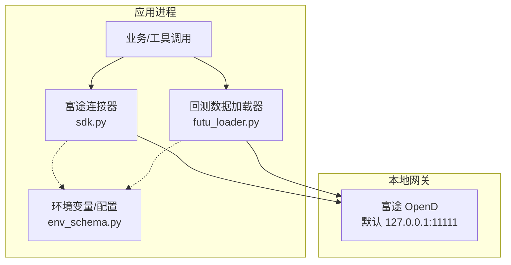
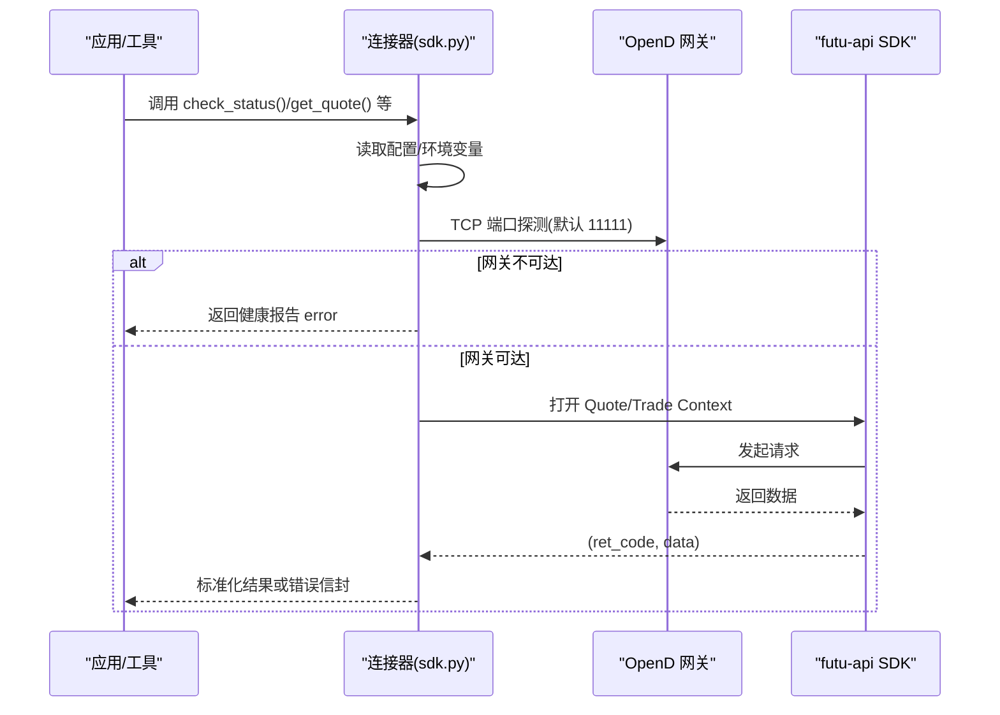
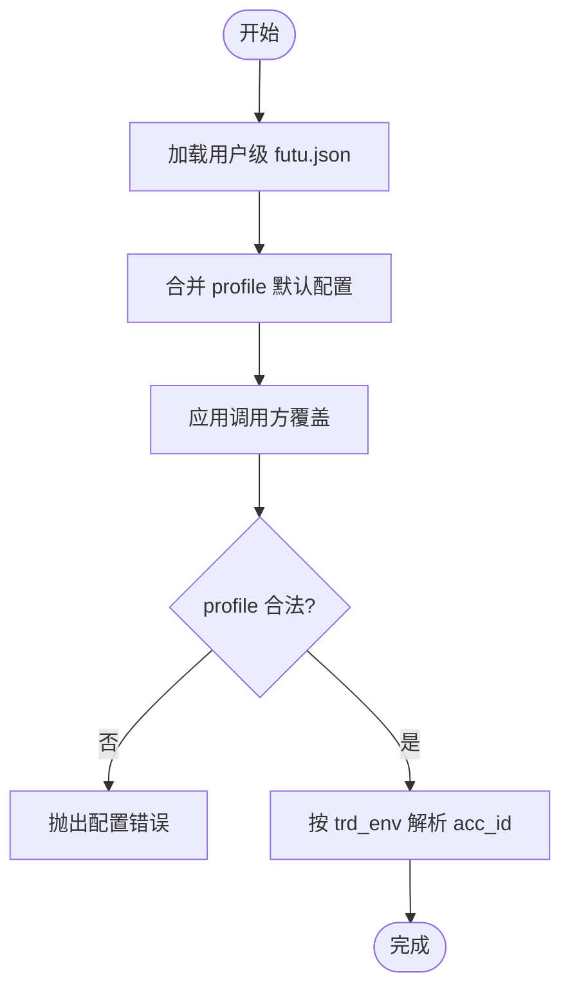
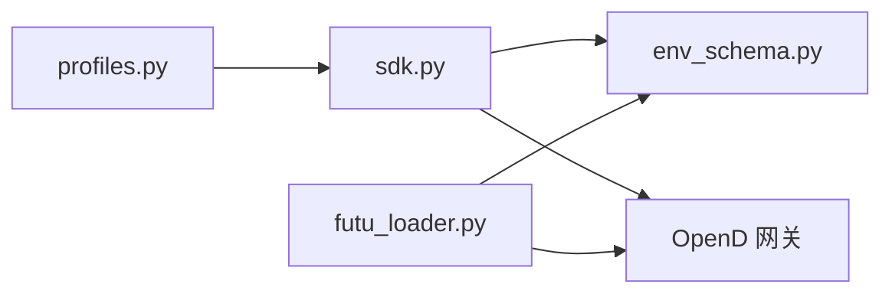

# 富途牛牛配置

<cite>
**本文引用的文件**
- [sdk.py](file://agent/src/trading/connectors/futu/sdk.py)
- [profiles.py](file://agent/src/trading/connectors/futu/profiles.py)
- [futu_loader.py](file://agent/backtest/loaders/futu.py)
- [env_schema.py](file://agent/src/config/env_schema.py)
</cite>

## 目录
1. [简介](#简介)
2. [项目结构](#项目结构)
3. [核心组件](#核心组件)
4. [架构总览](#架构总览)
5. [详细组件分析](#详细组件分析)
6. [依赖关系分析](#依赖关系分析)
7. [性能与可用性](#性能与可用性)
8. [故障诊断与连接监控](#故障诊断与连接监控)
9. [结论](#结论)
10. [附录：配置清单与示例](#附录配置清单与示例)

## 简介
本指南面向在 Vibe-Trading 中接入富途牛牛（Futu）的读者，覆盖客户端安装与登录、A股/港股/美股交易权限说明、模拟与实盘环境配置、API 端口与网络设置、常用接口调用（行情查询、下单、撤单、持仓查询）、风控参数建议以及连接状态监控与错误诊断方法。文档内容严格基于仓库中的连接器实现与配置模型进行整理。

## 项目结构
Vibe-Trading 对富途牛牛的集成由“连接器层 + 数据加载器 + 环境变量/配置文件”三部分构成：
- 连接器层：通过本地 OpenD 网关使用官方 futu-api SDK 提供只读与可下单能力，并内置账户环境隔离（模拟/实盘）。
- 数据加载器：为回测场景提供 HK 与 A 股的 OHLCV 数据拉取。
- 配置与环境：通过用户级 JSON 配置文件与统一的环境变量模型集中管理。

图表来源
- [sdk.py:1-25](file://agent/src/trading/connectors/futu/sdk.py#L1-L25)
- [futu_loader.py:106-138](file://agent/backtest/loaders/futu.py#L106-L138)
- [env_schema.py:166-214](file://agent/src/config/env_schema.py#L166-L214)

章节来源
- [sdk.py:1-25](file://agent/src/trading/connectors/futu/sdk.py#L1-L25)
- [futu_loader.py:106-138](file://agent/backtest/loaders/futu.py#L106-L138)
- [env_schema.py:166-214](file://agent/src/config/env_schema.py#L166-L214)

## 核心组件
- 连接器配置与账户环境
  - 支持 profile：paper、live-readonly、live；自动映射到富途 TrdEnv（SIMULATE/REAL），并通过账户列表校验防止误用。
  - 默认本地网关地址与端口：127.0.0.1:11111。
  - 市场过滤字段 filter_trdmarket 用于限定交易上下文的市场（如 HK）。
- 只读接口
  - 账户快照、持仓、未成交订单、实时报价、历史K线。
- 交易接口（受控）
  - 下单与撤单仅在对应 profile 下可用；实盘下单需解锁交易上下文并提供交易密码 MD5。
- 数据加载器
  - 面向回测的 HK/A 股 OHLCV 拉取，支持多周期映射与分页获取。

章节来源
- [sdk.py:71-157](file://agent/src/trading/connectors/futu/sdk.py#L71-L157)
- [sdk.py:275-393](file://agent/src/trading/connectors/futu/sdk.py#L275-L393)
- [sdk.py:755-962](file://agent/src/trading/connectors/futu/sdk.py#L755-L962)
- [profiles.py:14-80](file://agent/src/trading/connectors/futu/profiles.py#L14-L80)
- [futu_loader.py:106-253](file://agent/backtest/loaders/futu.py#L106-L253)

## 架构总览
富途连接器采用“本地 OpenD 网关 + Python SDK”的架构。应用不直接持有富途账号密码，所有读写均通过本地网关完成。连接器在每个连接前探测端口可达性，缺失网关时降级为清晰错误而非堆栈异常。

图表来源
- [sdk.py:223-272](file://agent/src/trading/connectors/futu/sdk.py#L223-L272)
- [sdk.py:1012-1051](file://agent/src/trading/connectors/futu/sdk.py#L1012-L1051)

## 详细组件分析

### 连接器配置与账户环境
- 配置文件位置与格式
  - 用户级 JSON 配置文件路径由运行时根目录决定，文件名固定。
  - 支持 host、port、profile、security_firm、filter_trdmarket、acc_id、timeout、readonly 等字段。
- 账户环境隔离
  - profile 与富途 TrdEnv 的映射：paper→SIMULATE，live→REAL。
  - 通过 get_acc_list() 的 trd_env 字段匹配账户，若配置的 acc_id 与 profile 不一致则拒绝。
- 构建有效配置
  - 优先级：保存的配置 ← 配置文件中的 profile 默认值 ← CLI/调用方覆盖。

图表来源
- [sdk.py:163-183](file://agent/src/trading/connectors/futu/sdk.py#L163-L183)
- [sdk.py:191-211](file://agent/src/trading/connectors/futu/sdk.py#L191-L211)
- [sdk.py:1060-1101](file://agent/src/trading/connectors/futu/sdk.py#L1060-L1101)

章节来源
- [sdk.py:71-157](file://agent/src/trading/connectors/futu/sdk.py#L71-L157)
- [sdk.py:163-211](file://agent/src/trading/connectors/futu/sdk.py#L163-L211)
- [sdk.py:1060-1101](file://agent/src/trading/connectors/futu/sdk.py#L1060-L1101)

### 模拟交易与实盘交易
- 模拟交易（paper）
  - 使用 profile=paper，TrdEnv=SIMULATE；无需解锁交易上下文，无交易密码要求。
- 实盘只读（live-readonly）
  - 使用 profile=live-readonly，仅暴露只读能力，不开放下单。
- 实盘交易（live）
  - 使用 profile=live，TrdEnv=REAL；下单前需解锁交易上下文，需提供 FUTU_TRADE_PWD_MD5。
- 安全边界
  - 连接器层默认 readonly=True；下单能力在更上层按 profile 与授权策略控制。

章节来源
- [profiles.py:14-80](file://agent/src/trading/connectors/futu/profiles.py#L14-L80)
- [sdk.py:755-962](file://agent/src/trading/connectors/futu/sdk.py#L755-L962)
- [sdk.py:965-991](file://agent/src/trading/connectors/futu/sdk.py#L965-L991)

### 交易权限与市场
- 市场过滤
  - filter_trdmarket 用于限定交易上下文的市场，例如 HK。
- 券商机构
  - security_firm 指定富途券商机构标识，默认 FUTUSECURITIES。
- 代码规范
  - 行情与下单均期望标准富途代码格式（如 HK.00700、US.AAPL），连接器会做大小写规范化。

章节来源
- [sdk.py:71-93](file://agent/src/trading/connectors/futu/sdk.py#L71-L93)
- [sdk.py:377-387](file://agent/src/trading/connectors/futu/sdk.py#L377-L387)
- [sdk.py:755-828](file://agent/src/trading/connectors/futu/sdk.py#L755-L828)

### 数据加载器（回测）
- 支持市场：hk_equity、a_share。
- 周期映射：1m/5m/15m/30m/1h/4h/1d/1w/1M 等。
- 数据源：通过 OpenQuoteContext 拉取历史 K 线，支持分页与缓存。
- 可用性检测：检查 FutuOpenD 是否可达。

章节来源
- [futu_loader.py:106-253](file://agent/backtest/loaders/futu.py#L106-L253)

### 环境变量与网络连接
- 数据源连接
  - FUTU_HOST、FUTU_PORT 用于数据加载器连接 OpenD。
- 实盘下单解锁
  - FUTU_TRADE_PWD_MD5 为富途交易密码的 MD5，仅在 live profile 下单时使用。
- 默认值
  - 默认主机 127.0.0.1，默认端口 11111。

章节来源
- [env_schema.py:166-214](file://agent/src/config/env_schema.py#L166-L214)
- [env_schema.py:326-375](file://agent/src/config/env_schema.py#L326-L375)
- [sdk.py:748-749](file://agent/src/trading/connectors/futu/sdk.py#L748-L749)

## 依赖关系分析
- 连接器依赖
  - 可选依赖：futu-api SDK；未安装时以健康报告形式提示。
  - 本地依赖：OpenD 网关必须运行且端口可达。
- 配置依赖
  - 用户级 JSON 配置文件与统一环境变量模型共同决定最终行为。
- 模块耦合
  - profiles.py 定义预置 profile；sdk.py 实现具体连接与调用；futu_loader.py 复用 OpenD 提供回测数据。

图表来源
- [profiles.py:14-80](file://agent/src/trading/connectors/futu/profiles.py#L14-L80)
- [sdk.py:214-272](file://agent/src/trading/connectors/futu/sdk.py#L214-L272)
- [futu_loader.py:106-138](file://agent/backtest/loaders/futu.py#L106-L138)
- [env_schema.py:166-214](file://agent/src/config/env_schema.py#L166-L214)

章节来源
- [profiles.py:14-80](file://agent/src/trading/connectors/futu/profiles.py#L14-L80)
- [sdk.py:214-272](file://agent/src/trading/connectors/futu/sdk.py#L214-L272)
- [futu_loader.py:106-138](file://agent/backtest/loaders/futu.py#L106-L138)
- [env_schema.py:166-214](file://agent/src/config/env_schema.py#L166-L214)

## 性能与可用性
- 连接探测
  - 每次连接前进行 TCP 端口探测，避免 SDK 异常堆栈，提升可观测性与稳定性。
- 数据分页
  - 历史 K 线支持分页拉取，适合长周期回测。
- 缓存
  - 数据加载器具备缓存机制，减少重复请求与网关压力。
- 资源释放
  - 所有上下文在 finally 块中关闭，降低资源泄漏风险。

章节来源
- [sdk.py:1012-1051](file://agent/src/trading/connectors/futu/sdk.py#L1012-L1051)
- [futu_loader.py:174-253](file://agent/backtest/loaders/futu.py#L174-L253)
- [sdk.py:275-393](file://agent/src/trading/connectors/futu/sdk.py#L275-L393)

## 故障诊断与连接监控
- 健康检查
  - 使用 check_status 获取健康报告，包含 SDK 安装状态、网关可达性、账户环境与 ID。
- 常见错误
  - 网关未启动或端口不通：健康报告标记 error 并给出提示。
  - SDK 未安装：提示安装 futu-api。
  - 账户环境不匹配：当配置的 acc_id 与 profile 的 trd_env 不一致时抛出配置错误。
  - 实盘下单缺少密码：提示需要 FUTU_TRADE_PWD_MD5。
- 诊断步骤
  - 确认 OpenD 已启动并登录。
  - 确认 FUTU_HOST/FUTU_PORT 与连接器配置一致。
  - 检查 futu.json 与 env 配置是否冲突或缺失。
  - 使用 check_status 输出定位问题阶段（SDK/网关/账户）。

章节来源
- [sdk.py:223-272](file://agent/src/trading/connectors/futu/sdk.py#L223-L272)
- [sdk.py:1021-1027](file://agent/src/trading/connectors/futu/sdk.py#L1021-L1027)
- [sdk.py:1060-1101](file://agent/src/trading/connectors/futu/sdk.py#L1060-L1101)
- [sdk.py:965-991](file://agent/src/trading/connectors/futu/sdk.py#L965-L991)

## 结论
Vibe-Trading 的富途连接器通过本地 OpenD 网关与官方 SDK 实现了安全的只读与可控的交易能力。其核心优势在于：
- 明确的账户环境隔离（模拟/实盘）与强校验，避免误操作。
- 健康检查与端口探测，提升可观测性与容错性。
- 统一的配置与环境变量模型，便于部署与维护。
对于生产环境，建议结合 mandate 与风控策略进一步约束下单行为，确保资金与仓位安全。

## 附录：配置清单与示例

### 客户端安装与登录
- 安装富途 OpenD 并在本机登录富途账户。
- 确认 OpenD 监听地址与端口（默认 127.0.0.1:11111）。
- 如需回测数据，确保数据加载器能连通该网关。

章节来源
- [sdk.py:1-25](file://agent/src/trading/connectors/futu/sdk.py#L1-L25)
- [futu_loader.py:106-138](file://agent/backtest/loaders/futu.py#L106-L138)

### 交易权限设置（A股、港股、美股）
- 通过 filter_trdmarket 限定交易上下文市场（如 HK）。
- 使用富途标准代码格式（如 HK.00700、US.AAPL）。
- 券商机构 security_firm 默认为 FUTUSECURITIES。

章节来源
- [sdk.py:71-93](file://agent/src/trading/connectors/futu/sdk.py#L71-L93)
- [sdk.py:377-387](file://agent/src/trading/connectors/futu/sdk.py#L377-L387)
- [sdk.py:755-828](file://agent/src/trading/connectors/futu/sdk.py#L755-L828)

### 模拟交易环境配置
- 选择 profile=paper，TrdEnv=SIMULATE。
- 无需解锁交易上下文，无需交易密码。

章节来源
- [profiles.py:14-30](file://agent/src/trading/connectors/futu/profiles.py#L14-L30)
- [sdk.py:755-828](file://agent/src/trading/connectors/futu/sdk.py#L755-L828)

### 实盘交易环境配置
- 选择 profile=live，TrdEnv=REAL。
- 下单前需解锁交易上下文，设置 FUTU_TRADE_PWD_MD5。

章节来源
- [profiles.py:63-80](file://agent/src/trading/connectors/futu/profiles.py#L63-L80)
- [sdk.py:755-962](file://agent/src/trading/connectors/futu/sdk.py#L755-L962)
- [sdk.py:965-991](file://agent/src/trading/connectors/futu/sdk.py#L965-L991)

### API 端口配置与网络连接
- 数据加载器使用 FUTU_HOST、FUTU_PORT 连接 OpenD。
- 连接器默认 host=127.0.0.1、port=11111。
- 连接前进行 TCP 端口探测，失败时返回清晰错误。

章节来源
- [env_schema.py:166-214](file://agent/src/config/env_schema.py#L166-L214)
- [sdk.py:1012-1051](file://agent/src/trading/connectors/futu/sdk.py#L1012-L1051)

### 交易接口调用示例（概念流程）
- 行情查询
  - 调用 get_quote(symbol)，返回最新价、买卖盘与成交量等。
- 历史K线
  - 调用 get_historical_bars(symbol, period, limit)，返回OHLCV序列。
- 下单
  - 调用 place_order(symbol, side, quantity, order_type, limit_price)，返回订单ID与状态。
- 撤单
  - 调用 cancel_order(order_id)，返回处理结果。
- 持仓查询
  - 调用 get_positions，返回当前持仓明细。

章节来源
- [sdk.py:275-393](file://agent/src/trading/connectors/futu/sdk.py#L275-L393)
- [sdk.py:755-962](file://agent/src/trading/connectors/futu/sdk.py#L755-L962)

### 风控参数配置建议
- 单笔最大金额/数量
  - 建议在更上层策略中对 notional/quantity 进行限制；连接器层对 quantity 与 price 有基本校验。
- 仓位限制
  - 可通过外部 mandate/guard 机制限制总敞口与杠杆；连接器层通过账户环境隔离保障模拟/实盘安全。
- 实盘解锁保护
  - 未配置 FUTU_TRADE_PWD_MD5 时，实盘下单将被拒绝。

章节来源
- [sdk.py:755-962](file://agent/src/trading/connectors/futu/sdk.py#L755-L962)
- [sdk.py:965-991](file://agent/src/trading/connectors/futu/sdk.py#L965-L991)

### 连接状态监控与错误诊断
- 使用 check_status 获取健康报告，包括 SDK 安装、网关可达、账户环境等信息。
- 常见问题定位
  - 网关未启动：检查 OpenD 是否运行与端口是否正确。
  - SDK 未安装：安装 futu-api。
  - 账户环境不匹配：核对 profile 与 acc_id 的 trd_env。
  - 实盘下单失败：确认 FUTU_TRADE_PWD_MD5 已正确设置。

章节来源
- [sdk.py:223-272](file://agent/src/trading/connectors/futu/sdk.py#L223-L272)
- [sdk.py:1021-1027](file://agent/src/trading/connectors/futu/sdk.py#L1021-L1027)
- [sdk.py:1060-1101](file://agent/src/trading/connectors/futu/sdk.py#L1060-L1101)