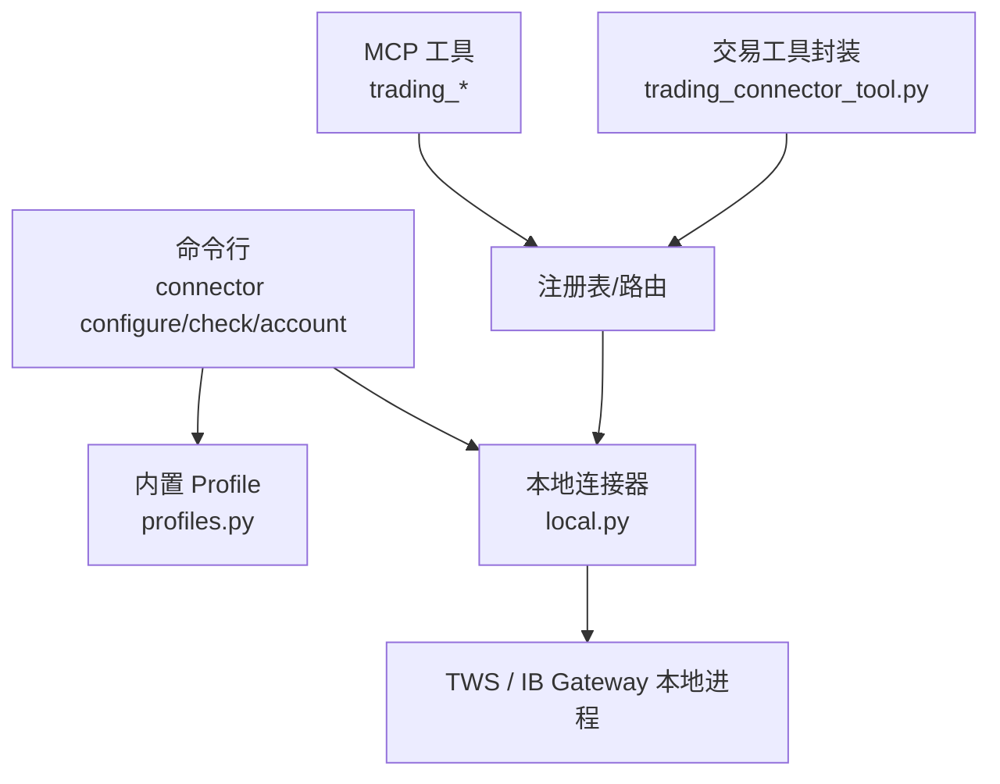
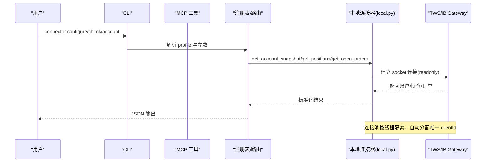
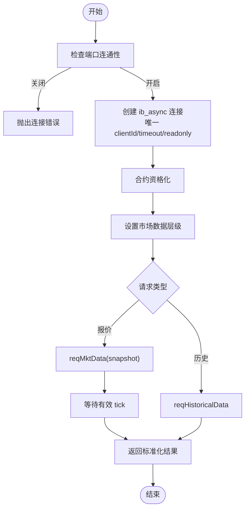
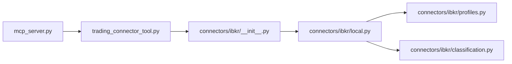

# 盈透证券配置

<cite>
**本文引用的文件**
- [agent/src/trading/connectors/ibkr/local.py](file://agent/src/trading/connectors/ibkr/local.py)
- [agent/src/trading/connectors/ibkr/profiles.py](file://agent/src/trading/connectors/ibkr/profiles.py)
- [agent/src/trading/connectors/ibkr/__init__.py](file://agent/src/trading/connectors/ibkr/__init__.py)
- [agent/src/trading/connectors/ibkr/classification.py](file://agent/src/trading/connectors/ibkr/classification.py)
- [agent/cli/_legacy.py](file://agent/cli/_legacy.py)
- [agent/mcp_server.py](file://agent/mcp_server.py)
- [agent/src/tools/trading_connector_tool.py](file://agent/src/tools/trading_connector_tool.py)
- [README.md](file://README.md)
</cite>

## 目录
1. [简介](#简介)
2. [项目结构](#项目结构)
3. [核心组件](#核心组件)
4. [架构总览](#架构总览)
5. [详细组件分析](#详细组件分析)
6. [依赖关系分析](#依赖关系分析)
7. [性能与稳定性优化](#性能与稳定性优化)
8. [故障排查指南](#故障排查指南)
9. [结论](#结论)
10. [附录：常用命令与配置清单](#附录常用命令与配置清单)

## 简介
本指南面向使用 Vibe-Trading 连接本地 TWS 或 IB Gateway 的读者，提供从安装、配置到多市场交易支持的完整说明。当前仓库中的 IBKR 连接器为“只读”模式，通过本地 socket 读取账户、持仓、订单、行情与历史数据；不暴露下单能力，避免将真实资金暴露在未受控路径中。Paper Trading 与 Live Trading 通过不同端口与配置文件进行隔离，确保误用风险最小化。

## 项目结构
IBKR 连接器位于 agent/src/trading/connectors/ibkr 目录下，包含连接配置、内置 profile、工具分类与本地连接实现。CLI 与 MCP 层提供用户交互入口，统一调用连接器能力。

图表来源
- [agent/src/trading/connectors/ibkr/profiles.py:7-44](file://agent/src/trading/connectors/ibkr/profiles.py#L7-L44)
- [agent/src/trading/connectors/ibkr/local.py:21-33](file://agent/src/trading/connectors/ibkr/local.py#L21-L33)
- [agent/mcp_server.py:1263-1302](file://agent/mcp_server.py#L1263-L1302)
- [agent/src/tools/trading_connector_tool.py:139-160](file://agent/src/tools/trading_connector_tool.py#L139-L160)

章节来源
- [agent/src/trading/connectors/ibkr/profiles.py:7-44](file://agent/src/trading/connectors/ibkr/profiles.py#L7-L44)
- [agent/src/trading/connectors/ibkr/local.py:21-33](file://agent/src/trading/connectors/ibkr/local.py#L21-L33)
- [agent/mcp_server.py:1263-1302](file://agent/mcp_server.py#L1263-L1302)
- [agent/src/tools/trading_connector_tool.py:139-160](file://agent/src/tools/trading_connector_tool.py#L139-L160)

## 核心组件
- 本地连接器（local.py）
  - 负责与本地 TWS/IB Gateway 建立 socket 连接，管理连接池、账户快照、持仓、订单、报价与历史K线。
  - 支持 market data tier 选择，默认延迟行情以避免无订阅时的错误。
- 内置 Profile（profiles.py）
  - 预置 Paper 与 Live 只读两种环境，分别绑定默认端口与客户端 ID。
- 工具分类（classification.py）
  - 对 IBKR MCP 工具进行读写分类，未知名称默认拒绝（fail-closed）。
- CLI 与 MCP
  - CLI 提供 connector configure/check/account 等命令；MCP 暴露 trading_positions/orders/quote/history 等只读工具。
- 交易工具封装（trading_connector_tool.py）
  - 统一参数校验与覆盖（host/port/client_id/account），并对接注册表执行。

章节来源
- [agent/src/trading/connectors/ibkr/local.py:61-86](file://agent/src/trading/connectors/ibkr/local.py#L61-L86)
- [agent/src/trading/connectors/ibkr/profiles.py:7-44](file://agent/src/trading/connectors/ibkr/profiles.py#L7-L44)
- [agent/src/trading/connectors/ibkr/classification.py:14-26](file://agent/src/trading/connectors/ibkr/classification.py#L14-L26)
- [agent/cli/_legacy.py:4342-4369](file://agent/cli/_legacy.py#L4342-L4369)
- [agent/mcp_server.py:1263-1302](file://agent/mcp_server.py#L1263-L1302)
- [agent/src/tools/trading_connector_tool.py:139-196](file://agent/src/tools/trading_connector_tool.py#L139-L196)

## 架构总览
下图展示了从 CLI/MCP 到本地连接器的调用链，以及最终与 TWS/IB Gateway 的通信过程。

图表来源
- [agent/src/trading/connectors/ibkr/local.py:525-599](file://agent/src/trading/connectors/ibkr/local.py#L525-L599)
- [agent/src/trading/connectors/ibkr/local.py:264-330](file://agent/src/trading/connectors/ibkr/local.py#L264-L330)
- [agent/mcp_server.py:1263-1302](file://agent/mcp_server.py#L1263-L1302)

## 详细组件分析

### 本地连接器（local.py）
- 连接与配置
  - 配置文件路径与保存：ibkr-local.json，默认 host=127.0.0.1，paper 端口 7497，live 只读端口 7496。
  - 连接池：线程局部存储 + 引用计数，避免多线程 client-id 冲突。
  - 市场数据层级：默认延迟（type 3），避免无订阅时报错 354。
- 账户与资产
  - 获取账户列表与摘要，校验 profile 是否与实际账户匹配（如 paper 必须 DU 开头）。
- 持仓与订单
  - 获取持仓、未成交订单与最近成交记录（可选）。
- 行情与历史
  - 报价快照：请求 tick 并等待有效字段填充；历史 K 线：支持 duration/bar-size/whatToShow/useRTH。
- 错误处理
  - 连接失败、SDK 缺失、合约资格化失败、profile 不匹配等均有明确异常与提示。

图表来源
- [agent/src/trading/connectors/ibkr/local.py:525-599](file://agent/src/trading/connectors/ibkr/local.py#L525-L599)
- [agent/src/trading/connectors/ibkr/local.py:420-521](file://agent/src/trading/connectors/ibkr/local.py#L420-L521)
- [agent/src/trading/connectors/ibkr/local.py:352-418](file://agent/src/trading/connectors/ibkr/local.py#L352-L418)

章节来源
- [agent/src/trading/connectors/ibkr/local.py:21-33](file://agent/src/trading/connectors/ibkr/local.py#L21-L33)
- [agent/src/trading/connectors/ibkr/local.py:61-86](file://agent/src/trading/connectors/ibkr/local.py#L61-L86)
- [agent/src/trading/connectors/ibkr/local.py:264-330](file://agent/src/trading/connectors/ibkr/local.py#L264-L330)
- [agent/src/trading/connectors/ibkr/local.py:420-521](file://agent/src/trading/connectors/ibkr/local.py#L420-L521)
- [agent/src/trading/connectors/ibkr/local.py:525-599](file://agent/src/trading/connectors/ibkr/local.py#L525-L599)

### 内置 Profile（profiles.py）
- ibkr-paper-local：纸交易，默认端口 7497，只读。
- ibkr-live-local-readonly：实盘只读，默认端口 7496，只读。
- ibkr-live-official-mcp-readonly：官方 MCP OAuth 只读（需审批）。

章节来源
- [agent/src/trading/connectors/ibkr/profiles.py:7-44](file://agent/src/trading/connectors/ibkr/profiles.py#L7-L44)

### 工具分类（classification.py）
- 对 IBKR 写操作进行显式标注（place_order/cancel_order/modify_order 等）。
- 未标注的工具保持 UNKNOWN，在 live 环境下 fail-closed。

章节来源
- [agent/src/trading/connectors/ibkr/classification.py:14-26](file://agent/src/trading/connectors/ibkr/classification.py#L14-L26)

### CLI 与 MCP 集成
- CLI：connector configure/check/account/positions/orders/quote/history 等命令，用于本地连接配置与健康检查。
- MCP：暴露 trading_positions、trading_orders、trading_quote、trading_history 等只读工具，支持 connection/host/port/client_id/account 覆盖。

章节来源
- [agent/cli/_legacy.py:4342-4369](file://agent/cli/_legacy.py#L4342-L4369)
- [agent/mcp_server.py:1263-1302](file://agent/mcp_server.py#L1263-L1302)
- [agent/src/tools/trading_connector_tool.py:139-196](file://agent/src/tools/trading_connector_tool.py#L139-L196)

## 依赖关系分析
- 运行时依赖
  - ib_async：可选依赖，未安装时健康检查会报告缺失。
- 模块耦合
  - local.py 暴露标准接口（get_account_snapshot/get_positions/get_open_orders/get_quote/get_historical_bars/save_config）。
  - profiles.py 定义默认环境与端口映射。
  - classification.py 仅影响 MCP 工具分类策略。
  - CLI/MCP 通过注册表调用连接器，解耦具体实现。

图表来源
- [agent/src/trading/connectors/ibkr/__init__.py:1-26](file://agent/src/trading/connectors/ibkr/__init__.py#L1-L26)
- [agent/src/trading/connectors/ibkr/local.py:264-330](file://agent/src/trading/connectors/ibkr/local.py#L264-L330)
- [agent/mcp_server.py:1263-1302](file://agent/mcp_server.py#L1263-L1302)
- [agent/src/tools/trading_connector_tool.py:139-196](file://agent/src/tools/trading_connector_tool.py#L139-L196)

章节来源
- [agent/src/trading/connectors/ibkr/__init__.py:1-26](file://agent/src/trading/connectors/ibkr/__init__.py#L1-L26)
- [agent/src/trading/connectors/ibkr/local.py:264-330](file://agent/src/trading/connectors/ibkr/local.py#L264-L330)
- [agent/mcp_server.py:1263-1302](file://agent/mcp_server.py#L1263-L1302)
- [agent/src/tools/trading_connector_tool.py:139-196](file://agent/src/tools/trading_connector_tool.py#L139-L196)

## 性能与稳定性优化
- 连接复用
  - 线程局部连接池 + 引用计数，减少重复建连开销，避免 client-id 冲突。
- 超时与重试
  - 连接超时可配置；健康检查先探测端口再尝试连接，快速失败。
- 行情降级
  - 默认延迟行情（type 3），避免无订阅导致的空数据或错误 354。
- 并发安全
  - 每个线程独立 socket，符合 ib_async 单线程模型。
- 资源释放
  - release 时断开连接，防止句柄泄漏。

章节来源
- [agent/src/trading/connectors/ibkr/local.py:525-599](file://agent/src/trading/connectors/ibkr/local.py#L525-L599)
- [agent/src/trading/connectors/ibkr/local.py:352-418](file://agent/src/trading/connectors/ibkr/local.py#L352-L418)
- [agent/src/trading/connectors/ibkr/local.py:188-241](file://agent/src/trading/connectors/ibkr/local.py#L188-L241)

## 故障排查指南
- 无法连接
  - 现象：健康检查报错“端口未监听”。
  - 处理：确认已打开 TWS/IB Gateway 并启用 API Socket Clients；检查 host/port 是否正确。
- SDK 缺失
  - 现象：健康检查提示缺少 ib_async。
  - 处理：安装 ib_async>=2.0。
- 行情为空
  - 现象：报价无 bid/ask/last。
  - 处理：确认市场数据层级已应用；若无订阅，使用延迟或冻结层级；检查 symbol/exchange/currency 组合。
- 账户不匹配
  - 现象：配置为 paper 但检测到 live 账户。
  - 处理：切换至 live 只读 profile 或登录正确的 paper 账户。
- 合约资格化失败
  - 现象：qualifyContracts 报错。
  - 处理：修正 symbol/exchange/currency/secType；必要时使用 SMART 路由。

章节来源
- [agent/src/trading/connectors/ibkr/local.py:188-241](file://agent/src/trading/connectors/ibkr/local.py#L188-L241)
- [agent/src/trading/connectors/ibkr/local.py:420-521](file://agent/src/trading/connectors/ibkr/local.py#L420-L521)
- [agent/src/trading/connectors/ibkr/local.py:626-637](file://agent/src/trading/connectors/ibkr/local.py#L626-L637)
- [agent/src/trading/connectors/ibkr/local.py:654-664](file://agent/src/trading/connectors/ibkr/local.py#L654-L664)

## 结论
Vibe-Trading 的 IBKR 连接器以“本地只读”为核心设计，通过清晰的 profile 与端口隔离，保障 Paper 与 Live 的安全边界。借助连接池、超时控制与行情降级机制，系统在稳定性与可用性方面具备良好表现。对于需要下单的场景，建议结合其他支持下单的 broker SDK 或通过官方 MCP 流程接入，并在 live 环境中严格遵循 mandate 与风控门限。

## 附录：常用命令与配置清单
- 安装与准备
  - 安装 ib_async：pip install ib_async>=2.0
  - 启动 TWS 或 IB Gateway，启用 API Socket Clients
- 常用命令
  - 列出可用连接器：vibe-trading connector list
  - 选择连接器：vibe-trading connector use ibkr-paper-local
  - 配置本地连接：vibe-trading connector configure ibkr-paper-local --yes
  - 检查连接：vibe-trading connector check
  - 查看账户：vibe-trading connector account
  - 查看持仓：vibe-trading connector positions
  - 查看订单：vibe-trading connector orders
  - 查询报价：vibe-trading connector quote AAPL
  - 查询历史：vibe-trading connector history AAPL --duration "30 D" --bar-size "1 day"
- 默认端口
  - TWS Paper：7497；Live 只读：7496
  - IB Gateway Paper：4002；Live 只读：4001
- 代码示例路径（不直接展示代码）
  - 账户信息同步：[agent/src/trading/connectors/ibkr/local.py:264-280](file://agent/src/trading/connectors/ibkr/local.py#L264-L280)
  - 实时数据订阅（快照）：[agent/src/trading/connectors/ibkr/local.py:420-474](file://agent/src/trading/connectors/ibkr/local.py#L420-L474)
  - 历史数据查询：[agent/src/trading/connectors/ibkr/local.py:477-521](file://agent/src/trading/connectors/ibkr/local.py#L477-L521)
  - 持仓查询：[agent/src/trading/connectors/ibkr/local.py:283-311](file://agent/src/trading/connectors/ibkr/local.py#L283-L311)
  - 订单查询：[agent/src/trading/connectors/ibkr/local.py:314-330](file://agent/src/trading/connectors/ibkr/local.py#L314-L330)
  - 连接建立与释放：[agent/src/trading/connectors/ibkr/local.py:525-599](file://agent/src/trading/connectors/ibkr/local.py#L525-L599)
  - CLI 配置与检查：[agent/cli/_legacy.py:4342-4369](file://agent/cli/_legacy.py#L4342-L4369)
  - MCP 工具入口：[agent/mcp_server.py:1263-1302](file://agent/mcp_server.py#L1263-L1302)

章节来源
- [README.md:1819-1844](file://README.md#L1819-L1844)
- [agent/src/trading/connectors/ibkr/local.py:264-521](file://agent/src/trading/connectors/ibkr/local.py#L264-L521)
- [agent/cli/_legacy.py:4342-4369](file://agent/cli/_legacy.py#L4342-L4369)
- [agent/mcp_server.py:1263-1302](file://agent/mcp_server.py#L1263-L1302)