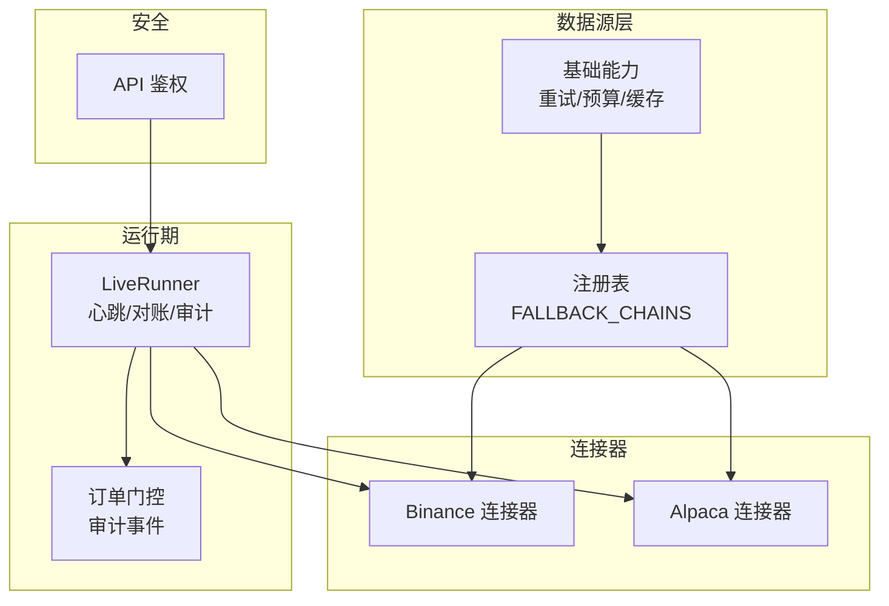
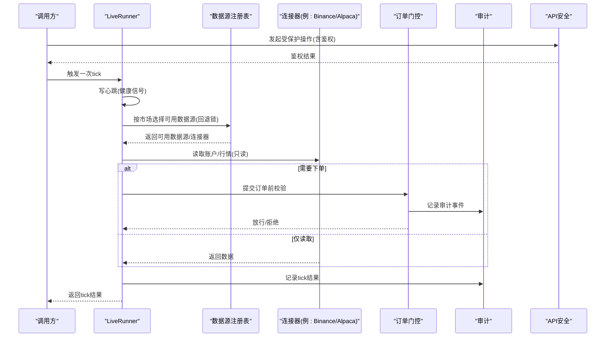
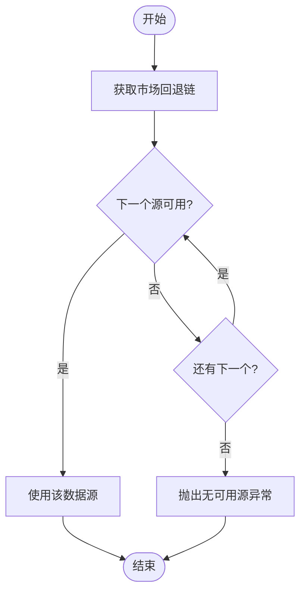
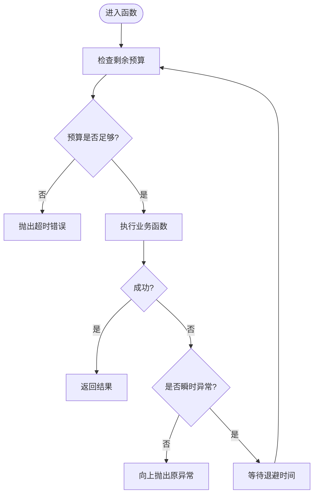
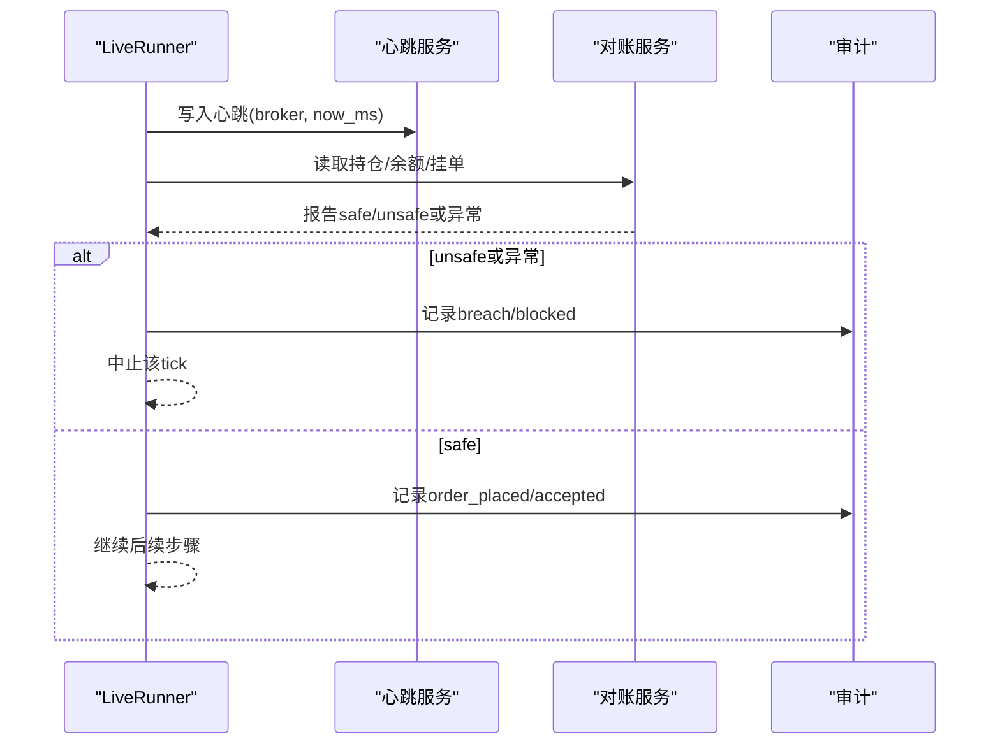
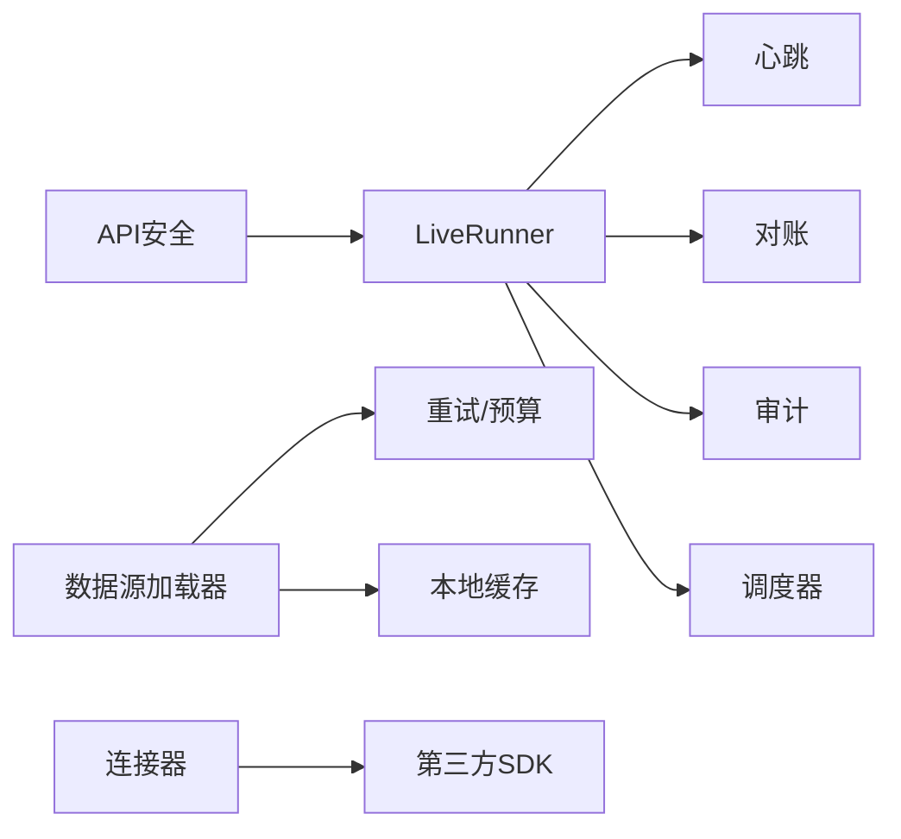

# 连接器管理与监控

<cite>
**本文引用的文件**
- [agent/src/trading/connectors/binance/__init__.py](file://agent/src/trading/connectors/binance/__init__.py)
- [agent/src/trading/connectors/alpaca/__init__.py](file://agent/src/trading/connectors/alpaca/__init__.py)
- [agent/backtest/loaders/base.py](file://agent/backtest/loaders/base.py)
- [agent/backtest/loaders/registry.py](file://agent/backtest/loaders/registry.py)
- [agent/src/live/runtime/runner.py](file://agent/src/live/runtime/runner.py)
- [agent/src/live/sdk_order_gate.py](file://agent/src/live/sdk_order_gate.py)
- [agent/src/api/security.py](file://agent/src/api/security.py)
- [agent/tests/test_longbridge_runtime.py](file://agent/tests/test_longbridge_runtime.py)
</cite>

## 目录
1. [简介](#简介)
2. [项目结构](#项目结构)
3. [核心组件](#核心组件)
4. [架构总览](#架构总览)
5. [详细组件分析](#详细组件分析)
6. [依赖关系分析](#依赖关系分析)
7. [性能考量](#性能考量)
8. [故障排查指南](#故障排查指南)
9. [结论](#结论)
10. [附录](#附录)

## 简介
本指南面向交易系统的“连接器”（Broker/数据源）管理与监控，围绕多连接器架构、动态加载与热插拔、状态监控（连接状态、心跳与健康检查）、负载均衡与故障转移、性能指标（延迟、成功率、吞吐）、配置热更新与版本管理、日志分析与调试工具、安全审计与访问控制等主题展开。内容基于代码库中的注册表、重试/预算、运行器心跳与审计、连接器隔离策略以及API安全机制进行系统化说明，帮助读者在不深入源码的前提下掌握运维要点。

## 项目结构
仓库中与连接器管理和监控密切相关的模块包括：
- 数据源注册表与回退链：负责按市场类型选择可用数据源，实现自动降级与多源容错。
- 运行时运行器：负责每tick的“关停→授权过期→对账→调用→审计”流程，并写入心跳。
- 连接器实现：以券商/交易所为粒度提供只读能力，并通过SDK传输层接入。
- 订单门控与审计：在下单路径上执行授权与合规校验，并记录完整审计事件。
- API安全：对本地关闭等敏感操作进行鉴权与来源限制。

图表来源
- [agent/backtest/loaders/registry.py:131-158](file://agent/backtest/loaders/registry.py#L131-L158)
- [agent/backtest/loaders/base.py:122-236](file://agent/backtest/loaders/base.py#L122-L236)
- [agent/src/live/runtime/runner.py:288-441](file://agent/src/live/runtime/runner.py#L288-L441)
- [agent/src/live/sdk_order_gate.py:637-684](file://agent/src/live/sdk_order_gate.py#L637-L684)
- [agent/src/trading/connectors/binance/__init__.py:1-16](file://agent/src/trading/connectors/binance/__init__.py#L1-L16)
- [agent/src/trading/connectors/alpaca/__init__.py:1-14](file://agent/src/trading/connectors/alpaca/__init__.py#L1-L14)
- [agent/src/api/security.py:432-469](file://agent/src/api/security.py#L432-L469)

章节来源
- [agent/backtest/loaders/registry.py:1-256](file://agent/backtest/loaders/registry.py#L1-L256)
- [agent/backtest/loaders/base.py:1-657](file://agent/backtest/loaders/base.py#L1-L657)
- [agent/src/live/runtime/runner.py:1-798](file://agent/src/live/runtime/runner.py#L1-L798)
- [agent/src/trading/connectors/binance/__init__.py:1-16](file://agent/src/trading/connectors/binance/__init__.py#L1-L16)
- [agent/src/trading/connectors/alpaca/__init__.py:1-14](file://agent/src/trading/connectors/alpaca/__init__.py#L1-L14)
- [agent/src/live/sdk_order_gate.py:637-684](file://agent/src/live/sdk_order_gate.py#L637-L684)
- [agent/src/api/security.py:432-469](file://agent/src/api/security.py#L432-L469)

## 核心组件
- 数据源注册表与回退链
  - 通过全局注册表维护所有已发现的数据源，并按市场类型定义优先级回退链，确保在某个源不可用时自动降级到备选源。
  - 支持“显式指定源”的强约束：如 local/tickerall 等不允许静默降级到网络源，避免掩盖配置问题。
- 重试与预算控制
  - 提供带超时预算的重试封装，仅对声明的瞬时异常重试，并在预算耗尽时快速失败，避免长时间阻塞。
  - 统一的OHLC校验与可选的本地Parquet缓存，减少重复请求与IO压力。
- 运行器与心跳
  - 每tick执行固定顺序：关停检查→授权过期检查→对账→调用→审计；每次tick写入心跳，便于外部健康检查。
  - 对账失败或状态不安全时直接中止该tick，不自动重放，保证幂等与安全。
- 订单门控与审计
  - 在下单路径中注入授权、限额与合规检查，并将请求/响应、决策原因等写入审计事件，便于追踪与回溯。
- 连接器隔离
  - 不同连接器（如 Binance、Alpaca）通过独立SDK与主机/凭据隔离测试网与生产环境，防止误用。
- API安全
  - 对敏感操作（如本地关闭）要求API Key或限定本地来源，统一鉴权主体标识，避免越权。

章节来源
- [agent/backtest/loaders/registry.py:131-256](file://agent/backtest/loaders/registry.py#L131-L256)
- [agent/backtest/loaders/base.py:122-236](file://agent/backtest/loaders/base.py#L122-L236)
- [agent/src/live/runtime/runner.py:288-543](file://agent/src/live/runtime/runner.py#L288-L543)
- [agent/src/live/sdk_order_gate.py:637-684](file://agent/src/live/sdk_order_gate.py#L637-L684)
- [agent/src/trading/connectors/binance/__init__.py:1-16](file://agent/src/trading/connectors/binance/__init__.py#L1-L16)
- [agent/src/trading/connectors/alpaca/__init__.py:1-14](file://agent/src/trading/connectors/alpaca/__init__.py#L1-L14)
- [agent/src/api/security.py:432-469](file://agent/src/api/security.py#L432-L469)

## 架构总览
下图展示了从数据源选择、运行期心跳与审计、到连接器与安全的整体交互。

图表来源
- [agent/backtest/loaders/registry.py:614-649](file://agent/backtest/loaders/registry.py#L614-L649)
- [agent/src/live/runtime/runner.py:407-543](file://agent/src/live/runtime/runner.py#L407-L543)
- [agent/src/live/sdk_order_gate.py:637-684](file://agent/src/live/sdk_order_gate.py#L637-L684)
- [agent/src/api/security.py:432-469](file://agent/src/api/security.py#L432-L469)

## 详细组件分析

### 数据源注册表与回退链（负载均衡与故障转移）
- 设计要点
  - 每个市场类型维护一个有序的回退链，优先选择更稳定、限流友好的源，再逐步降级到键控或第三方源。
  - “显式源”强约束：当用户明确指定 local/tickerall 等源时，若不可用则直接报错，不会静默切换到其他网络源，避免掩盖配置错误。
  - 懒加载注册：首次使用时导入所有已知loader模块，缺失依赖时静默跳过，提升启动鲁棒性。
- 故障转移流程
  - 遍历回退链，尝试构造并检测可用性；首个可用的即为本次选择的源。
  - 若全部不可用，抛出“无可用源”异常，提示检查网络与令牌配置。

图表来源
- [agent/backtest/loaders/registry.py:131-196](file://agent/backtest/loaders/registry.py#L131-L196)

章节来源
- [agent/backtest/loaders/registry.py:1-256](file://agent/backtest/loaders/registry.py#L1-L256)

### 重试与预算控制（可靠性与性能）
- 设计要点
  - 统一的重试封装：针对声明的瞬时异常进行有限次重试，结合单调时钟的截止时间，避免无限等待。
  - 预算耗尽即快速失败，保留原始异常作为cause，便于上层定位。
  - OHLC校验：在数据边界处剔除结构性无效K线，保障下游计算稳定性。
  - 可选本地缓存：将历史数据落盘为Parquet并附带元数据，命中时直接返回，降低重复请求与IO开销。
- 适用场景
  - 任何调用不稳定外部API的加载器/连接器均可复用该模式。

图表来源
- [agent/backtest/loaders/base.py:122-236](file://agent/backtest/loaders/base.py#L122-L236)

章节来源
- [agent/backtest/loaders/base.py:1-657](file://agent/backtest/loaders/base.py#L1-L657)

### 运行器心跳与对账（健康检查与故障恢复）
- 心跳机制
  - 每次tick开始时写入心跳，键为broker标识；外部可通过查询接口判断进程是否存活。
  - 心跳写入失败不影响交易主流程，仅影响健康信号展示。
- 对账与失败关闭
  - 每次tick在对账后若检测到不安全/歧义状态，立即中止该tick，不自动重放，避免重复下单。
  - 对账异常会记录审计并返回错误码，便于观测与告警。
- 授权过期主动关停
  - 每tick检查授权有效期，过期即触发关停并撤销权限，确保死授权不会进入交易路径。

图表来源
- [agent/src/live/runtime/runner.py:407-543](file://agent/src/live/runtime/runner.py#L407-L543)

章节来源
- [agent/src/live/runtime/runner.py:288-674](file://agent/src/live/runtime/runner.py#L288-L674)

### 连接器实现与环境隔离（热插拔与动态加载）
- 动态加载
  - 数据源通过注册表懒加载，按需导入具体loader模块，缺失依赖时静默跳过，实现“热插拔”式的扩展能力。
- 环境隔离
  - 连接器（如 Binance、Alpaca）通过不同的SDK与主机/凭据区分测试网与生产环境，配置文件决定目标环境，且该信息随载荷记录，防止隐式切换。
- 只读优先
  - 当前连接器主要暴露只读能力（账户/行情），写操作由上层门控与授权共同约束。

章节来源
- [agent/backtest/loaders/registry.py:72-117](file://agent/backtest/loaders/registry.py#L72-L117)
- [agent/src/trading/connectors/binance/__init__.py:1-16](file://agent/src/trading/connectors/binance/__init__.py#L1-L16)
- [agent/src/trading/connectors/alpaca/__init__.py:1-14](file://agent/src/trading/connectors/alpaca/__init__.py#L1-L14)

### 订单门控与审计（安全审计与可追溯）
- 审计事件
  - 在下单路径中记录请求、响应、门控决策、意图等信息，形成可审计轨迹。
- 授权绑定
  - 审计事件中携带授权引用与账户引用，便于关联上下文。
- 失败处理
  - 审计写入失败会被记录但不阻断主流程，确保业务连续性。

章节来源
- [agent/src/live/sdk_order_gate.py:637-684](file://agent/src/live/sdk_order_gate.py#L637-L684)

### API安全与访问控制（访问控制机制）
- 鉴权策略
  - 对敏感操作（如本地关闭）要求API Key或通过本地回环信任；未配置Key时非本地访问将被拒绝。
- 主体标识
  - 使用共享Key持有者或本地操作者作为鉴权主体，避免将密钥等同于身份。
- 跨站防护
  - 拒绝来自浏览器的跨站请求，增强安全性。

章节来源
- [agent/src/api/security.py:432-469](file://agent/src/api/security.py#L432-L469)

## 依赖关系分析
- 低耦合高内聚
  - 运行器通过注入的回调与协议与调度器、触发器、对账、心跳解耦，便于替换与测试。
  - 数据源注册表与具体loader解耦，新增数据源只需注册并实现is_available/fetch即可。
- 关键依赖链
  - 运行器依赖心跳、对账、审计、调度器；数据源依赖重试/预算与缓存；连接器依赖各自SDK；API安全贯穿受保护入口。

图表来源
- [agent/src/live/runtime/runner.py:288-441](file://agent/src/live/runtime/runner.py#L288-L441)
- [agent/backtest/loaders/base.py:122-236](file://agent/backtest/loaders/base.py#L122-L236)
- [agent/backtest/loaders/base.py:243-441](file://agent/backtest/loaders/base.py#L243-L441)
- [agent/src/trading/connectors/binance/__init__.py:1-16](file://agent/src/trading/connectors/binance/__init__.py#L1-L16)
- [agent/src/api/security.py:432-469](file://agent/src/api/security.py#L432-L469)

章节来源
- [agent/src/live/runtime/runner.py:1-798](file://agent/src/live/runtime/runner.py#L1-L798)
- [agent/backtest/loaders/base.py:1-657](file://agent/backtest/loaders/base.py#L1-L657)
- [agent/backtest/loaders/registry.py:1-256](file://agent/backtest/loaders/registry.py#L1-L256)
- [agent/src/trading/connectors/binance/__init__.py:1-16](file://agent/src/trading/connectors/binance/__init__.py#L1-L16)
- [agent/src/api/security.py:432-469](file://agent/src/api/security.py#L432-L469)

## 性能考量
- 延迟统计
  - 利用重试/预算控制避免长尾延迟；在调用前后埋点统计端到端耗时，结合审计事件输出。
- 成功率
  - 通过回退链提高首源不可用时的成功率；对瞬时异常重试，对非瞬时异常快速失败。
- 吞吐量
  - 启用本地Parquet缓存减少重复请求；合理设置市场轮询间隔，避免过度拉取。
- 资源占用
  - 心跳写入失败不阻塞主流程；对账失败直接中止tick，避免无效计算。

[本节为通用指导，无需特定文件来源]

## 故障排查指南
- 常见问题定位
  - 无可用数据源：检查市场回退链与各源is_available条件、网络与令牌配置。
  - 心跳不更新：确认运行器tick正常执行；心跳写入失败不影响交易但会影响健康显示。
  - 对账失败：查看审计记录中的错误信息，必要时暂停交易并人工介入。
  - 授权过期：检查授权有效期，过期将触发关停。
- 诊断建议
  - 开启详细日志，关注重试与预算相关日志。
  - 通过API查询运行状态，验证各连接器profile与连接状态。
  - 对关键路径增加埋点，记录请求/响应与耗时。

章节来源
- [agent/backtest/loaders/registry.py:614-649](file://agent/backtest/loaders/registry.py#L614-L649)
- [agent/src/live/runtime/runner.py:407-543](file://agent/src/live/runtime/runner.py#L407-L543)
- [agent/tests/test_longbridge_runtime.py:286-325](file://agent/tests/test_longbridge_runtime.py#L286-L325)

## 结论
本系统通过注册表与回退链实现数据源的动态加载与故障转移，借助重试/预算与本地缓存提升可靠性与性能；运行器每tick写入心跳并对账，确保健康可见与交易安全；订单门控与审计提供完整可追溯的安全闭环；API安全对敏感操作进行严格鉴权。按照本指南实践，可实现连接器的高可用、可观测与可治理。

[本节为总结，无需特定文件来源]

## 附录
- 连接器状态监控
  - 连接状态：通过运行器心跳与API查询接口观察；测试用例展示了状态字段示例。
  - 健康检查：心跳写入+对账结果+审计事件构成综合健康视图。
- 配置热更新与版本管理
  - 数据源注册表支持懒加载，新增loader无需重启即可被识别；缓存版本字段用于兼容旧数据。
- 日志分析与调试
  - 关注重试/预算、对账失败、心跳失败、审计事件等关键日志；结合API查询与测试用例辅助定位。

章节来源
- [agent/backtest/loaders/base.py:243-441](file://agent/backtest/loaders/base.py#L243-L441)
- [agent/tests/test_longbridge_runtime.py:286-325](file://agent/tests/test_longbridge_runtime.py#L286-L325)