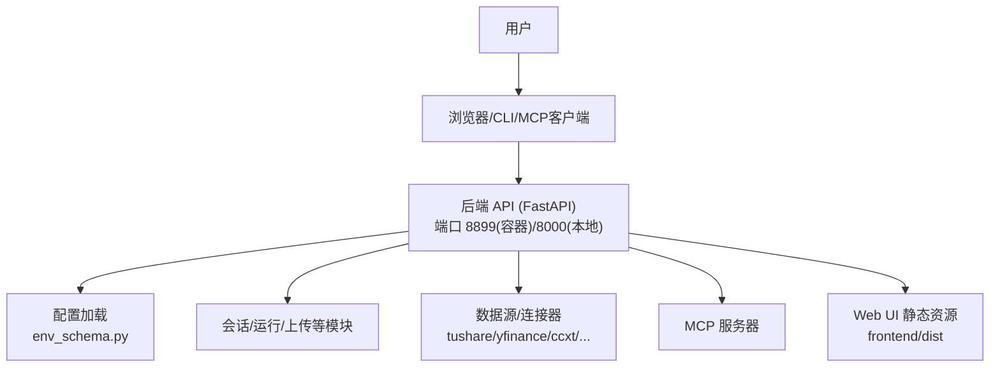
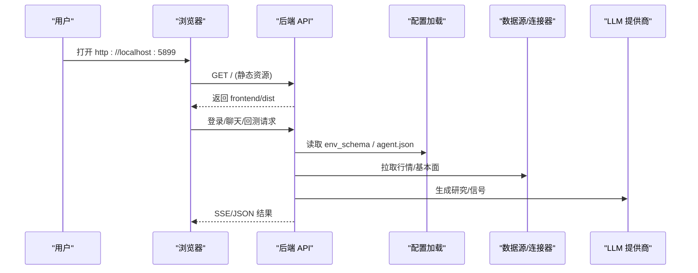
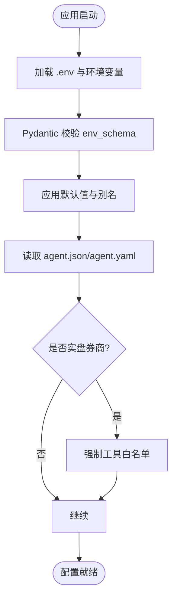
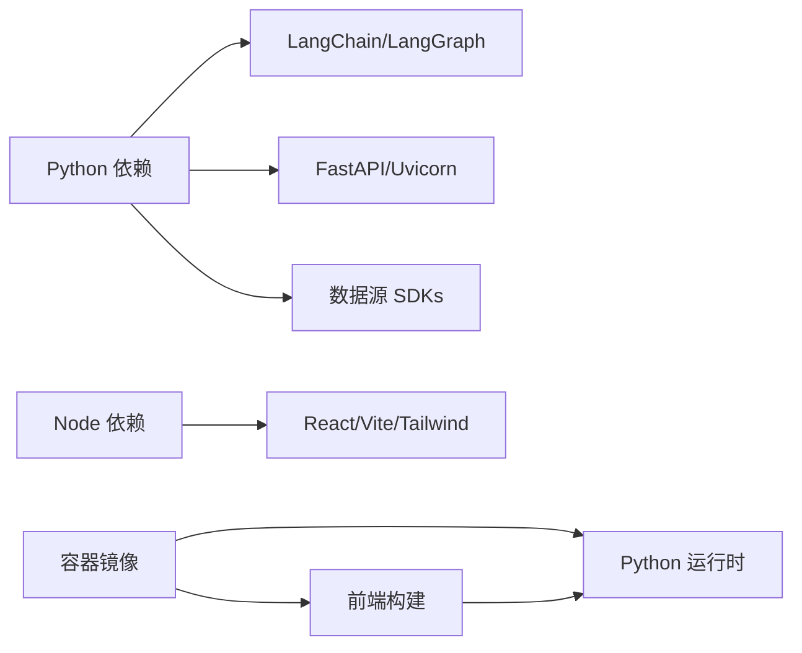

# 安装与配置

<cite>
**本文引用的文件**
- [README.md](file://README.md)
- [pyproject.toml](file://pyproject.toml)
- [Dockerfile](file://Dockerfile)
- [docker-compose.yml](file://docker-compose.yml)
- [agent/requirements.txt](file://agent/requirements.txt)
- [frontend/package.json](file://frontend/package.json)
- [desktop/electron/package.json](file://desktop/electron/package.json)
- [start.bat](file://start.bat)
- [agent/api_server.py](file://agent/api_server.py)
- [agent/src/config/env_schema.py](file://agent/src/config/env_schema.py)
- [agent/src/config/schema.py](file://agent/src/config/schema.py)
- [agent/src/config/paths.py](file://agent/src/config/paths.py)
- [agent/src/providers/llm.py](file://agent/src/providers/llm.py)
- [agent/cli/_legacy.py](file://agent/cli/_legacy.py)
</cite>

## 目录
1. [简介](#简介)
2. [项目结构](#项目结构)
3. [核心组件](#核心组件)
4. [架构总览](#架构总览)
5. [详细组件分析](#详细组件分析)
6. [依赖关系分析](#依赖关系分析)
7. [性能注意事项](#性能注意事项)
8. [故障排除指南](#故障排除指南)
9. [结论](#结论)
10. [附录](#附录)

## 简介
本指南面向首次接触 Vibe-Trading 的用户，提供从零到一的环境准备、依赖安装、配置文件设置、多种部署方式（pip、Docker、源码开发）以及生产与团队协作场景下的差异说明。同时给出常见问题排查方法、配置验证步骤与最佳实践建议，确保初学者可快速上手，高级用户也能按需深度定制。

## 项目结构
Vibe-Trading 由后端 API（Python/FastAPI）、前端 Web UI（React/Vite）、可选的桌面端 Electron 壳层、以及丰富的数据源与交易连接器组成。关键入口与配置如下：
- Python 包与 CLI 入口：通过 pyproject 暴露 vibe-trading 命令
- 后端服务：FastAPI 应用，启动时执行预检并挂载路由
- 前端构建：Node 22+ 构建静态资源，被后端以静态文件形式提供
- Docker：多阶段镜像，前端与 Python 环境分离构建，运行时最小化
- 环境变量：集中式 Pydantic Schema 管理所有开关与密钥

**图表来源**
- [agent/api_server.py:156-185](file://agent/api_server.py#L156-L185)
- [Dockerfile:68-118](file://Dockerfile#L68-L118)
- [docker-compose.yml:1-66](file://docker-compose.yml#L1-L66)

**章节来源**
- [pyproject.toml:77-87](file://pyproject.toml#L77-L87)
- [agent/api_server.py:156-185](file://agent/api_server.py#L156-L185)
- [Dockerfile:1-118](file://Dockerfile#L1-L118)
- [docker-compose.yml:1-66](file://docker-compose.yml#L1-L66)

## 核心组件
- 环境与依赖
  - Python 3.11–3.13（包要求 >=3.11, <3.14）
  - Node.js 22+（前端构建与开发）
  - 可选：Electron 用于桌面端打包
- 后端服务
  - FastAPI + Uvicorn，默认暴露 /live 健康检查
  - 启动时执行预检、迁移、调度器初始化
- 前端
  - React + Vite，构建产物作为静态资源由后端提供
- 配置系统
  - 集中式环境变量 Schema（Pydantic），统一读取 .env 与环境变量
  - 结构化 agent.json/agent.yaml 支持 MCP 与通道配置
- 数据源与连接器
  - 市场数据：tushare、yfinance、akshare、ccxt、futu、mootdx 等
  - 交易连接器：IBKR、Robinhood、Longbridge、OKX、Binance、Futu 等（部分仅纸交易或只读）

**章节来源**
- [pyproject.toml:1-23](file://pyproject.toml#L1-L23)
- [frontend/package.json:1-16](file://frontend/package.json#L1-L16)
- [agent/src/config/env_schema.py:1-18](file://agent/src/config/env_schema.py#L1-L18)
- [agent/src/config/schema.py:1-50](file://agent/src/config/schema.py#L1-L50)

## 架构总览
下图展示典型部署中各组件交互：浏览器访问后端提供的 Web UI；CLI/MCP 直接调用后端 API；后端根据配置加载 LLM 提供商、数据源与连接器；Docker Compose 将前后端与服务卷持久化。

**图表来源**
- [agent/api_server.py:156-185](file://agent/api_server.py#L156-L185)
- [agent/src/config/env_schema.py:685-716](file://agent/src/config/env_schema.py#L685-L716)
- [Dockerfile:93-118](file://Dockerfile#L93-L118)
- [docker-compose.yml:68-83](file://docker-compose.yml#L68-L83)

## 详细组件分析

### 环境要求与依赖安装
- Python 环境
  - 版本：>=3.11,<3.14（推荐 3.11/3.12/3.13）
  - 使用 venv 隔离后安装：
    - pip 安装：pip install -e ".[dev]"（开发模式）
    - 可选扩展：如 ibkr、longbridge、mt5、openbb、stats、ashare、harmonic、channels 等
- Node.js 环境
  - 版本：>=22.22.0（前端构建）
  - 安装依赖：cd frontend && npm ci
  - 开发：npm run dev（默认端口 5899）
- 可选：Electron 桌面端
  - 参考 desktop/electron/package.json 脚本进行构建与打包

**章节来源**
- [pyproject.toml:1-23](file://pyproject.toml#L1-L23)
- [pyproject.toml:105-237](file://pyproject.toml#L105-L237)
- [frontend/package.json:1-16](file://frontend/package.json#L1-L16)
- [desktop/electron/package.json:9-23](file://desktop/electron/package.json#L9-L23)

### 配置文件与环境变量
- 环境变量集中定义于 env_schema.py，涵盖：
  - LLM 提供商与模型：LANGCHAIN_PROVIDER、LANGCHAIN_MODEL_NAME、OPENAI_API_KEY、ANTHROPIC_*、GEMINI_*、DASHSCOPE_* 等
  - 数据源认证：TUSHARE_TOKEN、FINNHUB_API_KEY、ALPHAVANTAGE_API_KEY、TIINGO_API_KEY、FMP_API_KEY、QVERIS_API_KEY、LONGBRIDGE_*、ETORO_* 等
  - API 安全：API_AUTH_KEY、CORS_ORIGINS、VIBE_TRADING_MCP_ALLOWED_HOSTS、VIBE_TRADING_ENABLE_SHELL_TOOLS 等
  - 路径与状态：VIBE_TRADING_HOME（默认 ~/.vibe-trading）
- .env 文件
  - 位置：agent/.env（容器内映射为 /app/agent/.env）
  - 写入权限：通过 Web UI 设置写入时强制 0o600 权限
  - 示例键值：见 cli/_legacy.py 中的 provider 列表与 key_env/base_env 映射
- 结构化配置
  - agent.json/agent.yaml：存放 MCP 服务器、通道等配置
  - 安全校验：禁止对“实盘券商”使用通配 enabledTools=["*"]，需显式白名单

**图表来源**
- [agent/src/config/env_schema.py:81-124](file://agent/src/config/env_schema.py#L81-L124)
- [agent/src/config/env_schema.py:685-716](file://agent/src/config/env_schema.py#L685-L716)
- [agent/src/config/schema.py:508-548](file://agent/src/config/schema.py#L508-L548)

**章节来源**
- [agent/src/config/env_schema.py:132-214](file://agent/src/config/env_schema.py#L132-L214)
- [agent/src/config/env_schema.py:326-375](file://agent/src/config/env_schema.py#L326-L375)
- [agent/src/config/env_schema.py:522-540](file://agent/src/config/env_schema.py#L522-L540)
- [agent/src/config/paths.py:13-34](file://agent/src/config/paths.py#L13-L34)
- [agent/src/providers/llm.py:965-988](file://agent/src/providers/llm.py#L965-L988)
- [agent/cli/_legacy.py:5111-5272](file://agent/cli/_legacy.py#L5111-L5272)

### 多种安装方式

#### 方式一：pip 包管理器安装（推荐）
- 创建虚拟环境并激活
- 安装主包与可选扩展：
  - pip install -e ".[dev]"
  - 按需添加 extras：ibkr、longbridge、mt5、openbb、stats、ashare、harmonic、channels 等
- 安装完成后，可通过 CLI 启动服务：
  - vibe-trading serve --host 0.0.0.0 --port 8899

**章节来源**
- [pyproject.toml:77-87](file://pyproject.toml#L77-L87)
- [pyproject.toml:105-237](file://pyproject.toml#L105-L237)

#### 方式二：Docker 容器化部署
- 构建镜像：docker build -t vibe-trading .
- 运行容器：
  - 端口：8899（/live 健康检查）
  - 环境变量：OLLAMA_BASE_URL（指向宿主 Ollama）
  - 数据卷：runs/sessions/uploads/home(.vibe-trading)
- 使用 docker-compose：
  - 包含后端与可选前端开发服务
  - 自动注入 host-gateway 以便访问宿主机 Ollama

**章节来源**
- [Dockerfile:1-118](file://Dockerfile#L1-L118)
- [docker-compose.yml:1-66](file://docker-compose.yml#L1-L66)
- [docker-compose.yml:68-83](file://docker-compose.yml#L68-L83)

#### 方式三：源码开发环境搭建
- 后端：
  - 安装依赖后，运行 api_server.py 或使用 CLI serve
- 前端：
  - cd frontend && npm ci && npm run dev
- Windows 一键启动：
  - 运行 start.bat，分别启动后端与前端

**章节来源**
- [agent/api_server.py:156-185](file://agent/api_server.py#L156-L185)
- [frontend/package.json:9-16](file://frontend/package.json#L9-L16)
- [start.bat:1-30](file://start.bat#L1-L30)

### 不同部署场景的配置差异
- 本地开发
  - 前端端口 5899，后端 8000/8899
  - 可使用 Ollama 本地模型：OLLAMA_BASE_URL=http://localhost:11434
- 生产环境
  - 启用 API 鉴权：API_AUTH_KEY
  - 限制 CORS 与 MCP 允许主机：CORS_ORIGINS、VIBE_TRADING_MCP_ALLOWED_HOSTS
  - 关闭 shell 工具：VIBE_TRADING_ENABLE_SHELL_TOOLS=false
  - 资源限制：compose 中 mem_limit/cpus/pids_limit
- 团队协作
  - 使用 VIBE_TRADING_HOME 指定共享工作区
  - 通过 agent.json 集中管理 MCP 与通道配置
  - 使用命名卷持久化 runs/sessions/uploads/home

**章节来源**
- [docker-compose.yml:1-66](file://docker-compose.yml#L1-L66)
- [agent/src/config/env_schema.py:326-375](file://agent/src/config/env_schema.py#L326-L375)
- [agent/src/config/paths.py:13-34](file://agent/src/config/paths.py#L13-L34)

### 常见安装问题与故障排除
- 依赖冲突
  - 使用 venv 隔离环境，避免全局包污染
  - 使用 requirements-lock.txt（容器构建）保证可重复安装
- 端口占用
  - 修改 compose 或 serve 参数绑定端口
  - 检查 8899/5899/8000 是否被占用
- 权限问题
  - 容器内以非 root 用户运行，确保 /home/vibe/.vibe-trading 可写
  - Web UI 写入 .env 时强制 0o600 权限
- 网络与代理
  - 设置 HTTP_PROXY/HTTPS_PROXY/ALL_PROXY（CCXT 等数据源会读取）
  - 若禁用代理：VIBE_TRADING_DISABLE_HTTP_PROXY=true
- 数据源认证失败
  - 检查 TUSHARE_TOKEN、FINNHUB_API_KEY、QVERIS_API_KEY 等是否正确
  - 确认 base_url 与 provider 匹配（如 Ollama、OpenAI、Gemini）

**章节来源**
- [Dockerfile:99-108](file://Dockerfile#L99-L108)
- [agent/src/config/env_schema.py:166-214](file://agent/src/config/env_schema.py#L166-L214)
- [agent/src/config/env_schema.py:326-375](file://agent/src/config/env_schema.py#L326-L375)
- [agent/src/providers/llm.py:965-988](file://agent/src/providers/llm.py#L965-L988)

### 配置验证方法与最佳实践
- 验证方法
  - 健康检查：curl http://localhost:8899/live
  - 查看设置：通过 Web UI Settings 页面或 REST 接口获取当前配置摘要
  - 日志输出：关注启动阶段的预检与错误提示
- 最佳实践
  - 使用 .env 管理敏感信息，避免提交到仓库
  - 生产环境启用 API_AUTH_KEY 与严格 CORS
  - 使用 VIBE_TRADING_HOME 集中管理用户态数据
  - 对实盘券商使用显式工具白名单，禁止通配符
  - 定期更新依赖，保持 lock 文件一致

**章节来源**
- [Dockerfile:110-118](file://Dockerfile#L110-L118)
- [agent/src/config/env_schema.py:685-716](file://agent/src/config/env_schema.py#L685-L716)
- [agent/src/config/schema.py:508-548](file://agent/src/config/schema.py#L508-L548)

## 依赖关系分析
- Python 依赖
  - 核心：langchain、langgraph、fastapi、uvicorn、pandas、numpy、ccxt、yfinance、akshare 等
  - 可选：ibkr、longbridge、mt5、openbb、stats、ashare、harmonic、channels
- Node 依赖
  - React、Vite、Tailwind、ECharts、i18next 等
- 容器依赖
  - 前端构建使用 node:22-slim
  - Python 构建与运行时使用 python:3.11-slim
  - weasyprint 所需系统库在运行时镜像中安装

**图表来源**
- [pyproject.toml:24-69](file://pyproject.toml#L24-L69)
- [pyproject.toml:105-237](file://pyproject.toml#L105-L237)
- [frontend/package.json:17-56](file://frontend/package.json#L17-L56)
- [Dockerfile:4-18](file://Dockerfile#L4-L18)
- [Dockerfile:59-86](file://Dockerfile#L59-L86)

**章节来源**
- [pyproject.toml:24-69](file://pyproject.toml#L24-L69)
- [pyproject.toml:105-237](file://pyproject.toml#L105-L237)
- [frontend/package.json:17-56](file://frontend/package.json#L17-L56)
- [Dockerfile:4-18](file://Dockerfile#L4-L18)
- [Dockerfile:59-86](file://Dockerfile#L59-L86)

## 性能注意事项
- 数据缓存
  - 启用 VIBE_TRADING_DATA_CACHE 可缓存历史 K 线，减少网络请求与速率限制
- 并发与超时
  - 调整 CCXT_TIMEOUT_MS、TIMEOUT_SECONDS、MAX_RETRIES 等参数
- 资源限制
  - Docker Compose 中设置 mem_limit/cpus/pids_limit，防止单任务耗尽资源
- PDF/报告渲染
  - weasyprint 需要系统字体与图形库，已在运行时镜像中安装

**章节来源**
- [agent/src/config/env_schema.py:166-214](file://agent/src/config/env_schema.py#L166-L214)
- [docker-compose.yml:40-66](file://docker-compose.yml#L40-L66)
- [Dockerfile:73-86](file://Dockerfile#L73-L86)

## 故障排除指南
- 无法连接数据源
  - 检查对应 API Key 与 Base URL
  - 确认代理设置与网络连通性
- 启动失败
  - 查看 /live 健康检查与日志
  - 确认端口未被占用
- 权限错误
  - 检查 .env 文件权限（应为 0o600）
  - 容器内用户与目录权限
- 实盘券商配置报错
  - 确保未使用 enabledTools=["*"]
  - 按提示配置 OAuth 与工具白名单

**章节来源**
- [agent/src/config/env_schema.py:326-375](file://agent/src/config/env_schema.py#L326-L375)
- [agent/src/config/schema.py:508-548](file://agent/src/config/schema.py#L508-L548)
- [Dockerfile:99-108](file://Dockerfile#L99-L108)

## 结论
通过本指南，您可以完成 Vibe-Trading 的环境准备、依赖安装、配置设置与多种部署方式的落地。建议从 pip 安装开始，逐步引入数据源与连接器；在生产环境中强化安全与资源限制；利用 Docker 实现可重复与可移植的部署。遇到问题时，优先检查环境变量、端口与权限，并结合健康检查与日志定位。

## 附录
- 常用环境变量速查
  - LLM：LANGCHAIN_PROVIDER、LANGCHAIN_MODEL_NAME、OPENAI_API_KEY、ANTHROPIC_*、GEMINI_*、DASHSCOPE_*
  - 数据源：TUSHARE_TOKEN、FINNHUB_API_KEY、ALPHAVANTAGE_API_KEY、TIINGO_API_KEY、FMP_API_KEY、QVERIS_API_KEY、LONGBRIDGE_*、ETORO_*
  - API 安全：API_AUTH_KEY、CORS_ORIGINS、VIBE_TRADING_MCP_ALLOWED_HOSTS、VIBE_TRADING_ENABLE_SHELL_TOOLS
  - 路径：VIBE_TRADING_HOME（默认 ~/.vibe-trading）
- 启动命令
  - 本地：python agent/api_server.py 或 vibe-trading serve
  - 容器：docker-compose up
  - Windows：start.bat

**章节来源**
- [agent/src/config/env_schema.py:132-214](file://agent/src/config/env_schema.py#L132-L214)
- [agent/src/config/env_schema.py:326-375](file://agent/src/config/env_schema.py#L326-L375)
- [agent/src/config/env_schema.py:522-540](file://agent/src/config/env_schema.py#L522-L540)
- [agent/api_server.py:156-185](file://agent/api_server.py#L156-L185)
- [docker-compose.yml:1-66](file://docker-compose.yml#L1-L66)
- [start.bat:1-30](file://start.bat#L1-L30)