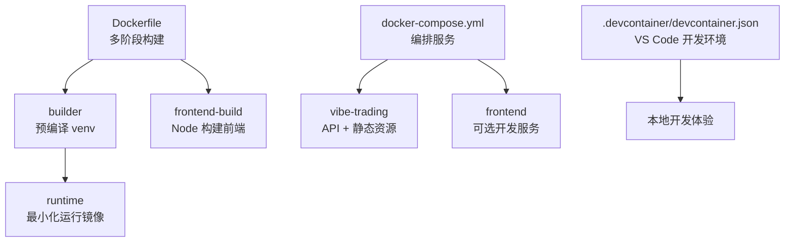
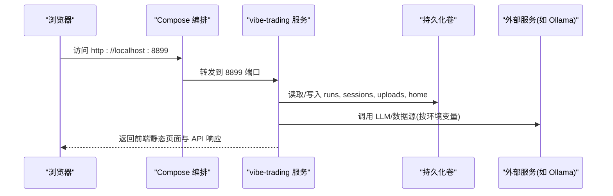
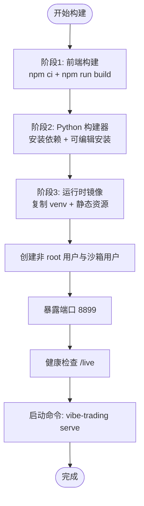
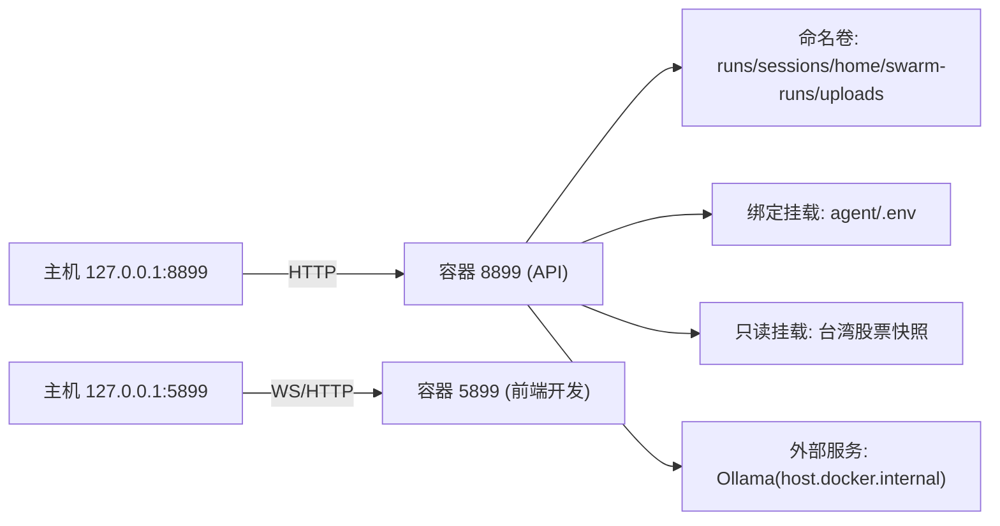
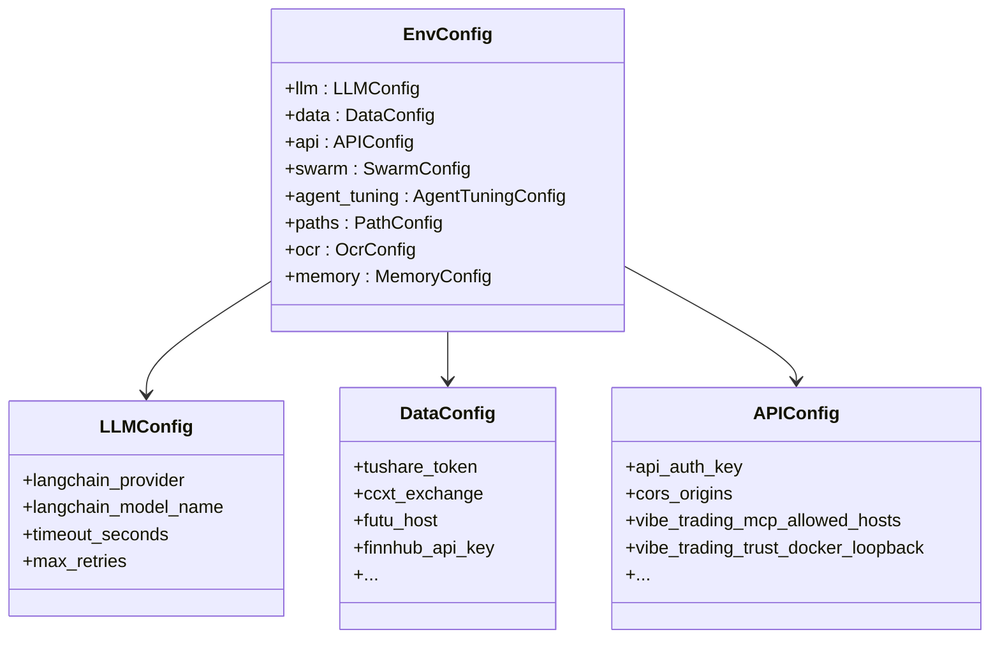
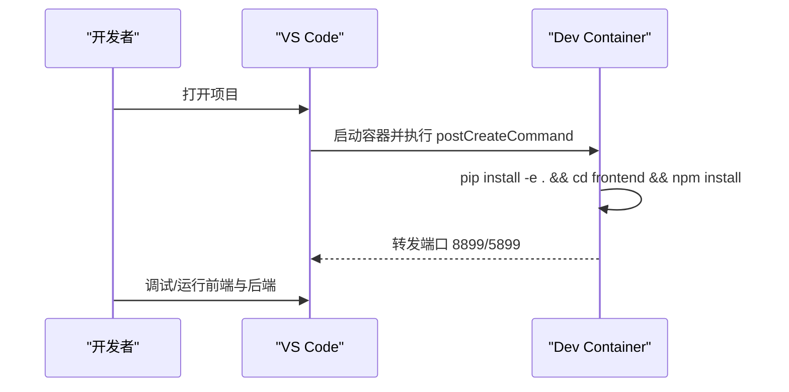
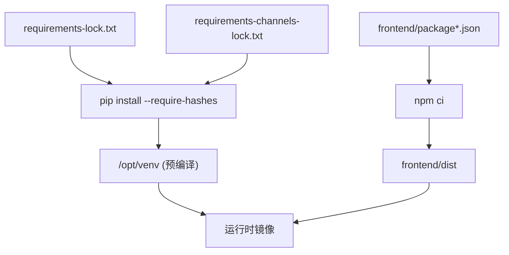

# Docker 容器化部署

<cite>
**本文引用的文件**
- [Dockerfile](file://Dockerfile)
- [docker-compose.yml](file://docker-compose.yml)
- [.devcontainer/devcontainer.json](file://.devcontainer/devcontainer.json)
- [.dockerignore](file://.dockerignore)
- [pyproject.toml](file://pyproject.toml)
- [agent/requirements.txt](file://agent/requirements.txt)
- [agent/src/config/env_schema.py](file://agent/src/config/env_schema.py)
</cite>

## 目录
1. [简介](#简介)
2. [项目结构](#项目结构)
3. [核心组件](#核心组件)
4. [架构总览](#架构总览)
5. [详细组件分析](#详细组件分析)
6. [依赖关系分析](#依赖关系分析)
7. [性能与资源限制](#性能与资源限制)
8. [故障排查指南](#故障排查指南)
9. [结论](#结论)
10. [附录](#附录)

## 简介
本指南面向生产与开发环境，提供 Vibe-Trading 的完整 Docker 容器化部署说明。内容涵盖：
- 使用 docker-compose 一键启动服务（含环境变量、数据持久化、端口映射）
- Dockerfile 多阶段构建原理（前端构建、Python 依赖安装、运行时优化）
- 生产环境最佳实践（资源限制、安全配置、日志收集）
- 基于 devcontainer 的容器化开发（VS Code 集成）
- 常见问题与解决方案（网络、存储卷权限、镜像体积优化等）

## 项目结构
仓库包含后端 Python 应用、前端静态资源构建、以及容器编排与开发环境配置：
- 根目录 Dockerfile：定义三阶段构建（前端构建、Python 依赖预编译、最小化运行时）
- docker-compose.yml：编排 API 服务与可选的前端开发服务，声明端口、环境变量、卷与安全策略
- .devcontainer/devcontainer.json：VS Code Dev Container 配置，自动安装依赖并转发端口
- .dockerignore：排除不必要的文件以减小镜像体积
- pyproject.toml：Python 包元数据与入口脚本
- agent/requirements.txt：Python 依赖清单（由锁文件锁定）
- agent/src/config/env_schema.py：环境变量集中定义与默认值

**图表来源**
- [Dockerfile:1-119](file://Dockerfile#L1-L119)
- [docker-compose.yml:1-90](file://docker-compose.yml#L1-L90)
- [.devcontainer/devcontainer.json:1-40](file://.devcontainer/devcontainer.json#L1-L40)

**章节来源**
- [Dockerfile:1-119](file://Dockerfile#L1-L119)
- [docker-compose.yml:1-90](file://docker-compose.yml#L1-L90)
- [.devcontainer/devcontainer.json:1-40](file://.devcontainer/devcontainer.json#L1-L40)
- [.dockerignore:1-54](file://.dockerignore#L1-L54)
- [pyproject.toml:1-279](file://pyproject.toml#L1-L279)
- [agent/requirements.txt:1-69](file://agent/requirements.txt#L1-L69)
- [agent/src/config/env_schema.py:1-593](file://agent/src/config/env_schema.py#L1-L593)

## 核心组件
- 多阶段 Dockerfile：分离前端构建、Python 依赖安装与运行时镜像，确保最终镜像仅包含必要组件
- docker-compose：编排 API 服务与可选前端开发服务，管理端口、环境变量、卷挂载与安全策略
- 环境变量系统：集中化的 Pydantic 模型定义所有环境变量及其默认值，便于管理与验证
- 数据持久化：通过命名卷与绑定挂载保存会话、运行结果、上传文件与用户配置
- 安全与资源：只读根文件系统、最小权限用户、能力裁剪、内存/CPU/进程数限制

**章节来源**
- [Dockerfile:59-119](file://Dockerfile#L59-L119)
- [docker-compose.yml:1-90](file://docker-compose.yml#L1-L90)
- [agent/src/config/env_schema.py:132-593](file://agent/src/config/env_schema.py#L132-L593)

## 架构总览
Vibe-Trading 在容器中提供 API 服务，同时托管前端静态资源；可选地在前台运行 Node 开发服务器以便热重载。

**图表来源**
- [docker-compose.yml:1-90](file://docker-compose.yml#L1-L90)
- [Dockerfile:110-119](file://Dockerfile#L110-L119)

**章节来源**
- [docker-compose.yml:1-90](file://docker-compose.yml#L1-L90)
- [Dockerfile:110-119](file://Dockerfile#L110-L119)

## 详细组件分析

### 多阶段构建（Dockerfile）
- 阶段一：前端构建
  - 使用 Node 镜像安装依赖并构建前端静态资源
  - 产物输出到 frontend/dist，后续复制到运行时镜像
- 阶段二：Python 构建器
  - 安装编译工具链，创建隔离虚拟环境
  - 从锁文件安装 Python 依赖（主依赖与通道 SDK），并以可编辑模式安装项目
- 阶段三：运行时
  - 仅复制预编译的 venv 与必要的运行时库
  - 将前端静态资源与源码树复制到镜像中
  - 创建非 root 用户与沙箱用户，设置工作目录与暴露端口
  - 健康检查指向 /live，默认命令启动 API 服务

**图表来源**
- [Dockerfile:1-119](file://Dockerfile#L1-L119)

**章节来源**
- [Dockerfile:1-119](file://Dockerfile#L1-L119)

### docker-compose 编排与服务配置
- 服务：vibe-trading（API）、frontend（可选开发服务）
- 端口映射：
  - API：127.0.0.1:8899 -> 8899
  - 前端开发：127.0.0.1:5899 -> 5899
- 环境变量：
  - 通过 env_file 注入 agent/.env
  - 显式设置 VIBE_TRADING_TRUST_DOCKER_LOOPBACK=1 允许容器内回环信任
  - OLLAMA_BASE_URL 默认指向 host.docker.internal:11434，可通过顶层 .env 覆盖
- 数据持久化：
  - 命名卷：runs、sessions、home、swarm-runs、uploads
  - 绑定挂载：agent/.env（读写）、台湾股票快照（只读）
- 安全与资源：
  - 能力裁剪：drop ALL，仅保留 SETUID/SETGID
  - no-new-privileges:true，read_only:true
  - tmpfs 挂载 /tmp、缓存目录
  - 资源限制：mem_limit=4g，cpus=2，pids_limit=512
  - restart=unless-stopped

**图表来源**
- [docker-compose.yml:1-90](file://docker-compose.yml#L1-L90)

**章节来源**
- [docker-compose.yml:1-90](file://docker-compose.yml#L1-L90)

### 环境变量配置（集中式 schema）
- 统一入口：EnvConfig 组合多个子配置（LLM、Data、API、Swarm、AgentTuning、Paths、OCR、Memory）
- 常见类别：
  - LLM：提供商、模型名、温度、超时、重试、代理开关等
  - Data：市场数据源凭据与参数（Tushare、CCXT、Futu、Finnhub、AlphaVantage、Tiingo、FMP、FRED、OpenAlex、Qveris、Longbridge、Etoro 等）
  - API：鉴权密钥、CORS、Host 白名单、MCP 允许主机、Shell 工具开关、文件根目录限制、API URL 等
  - Swarm：工作超时、最大迭代、心跳间隔、流重试延迟等
  - AgentTuning：令牌阈值、心跳间隔、SSE 超时、内容过滤阈值、调度器开关与重试策略等
  - Paths：假设路径、目标数据库路径、剧本目录、主题、策略存储路径等
  - OCR：引擎选择与模型
  - Memory：预设与功能开关（质量、GC、衰减、层次、链接、压缩、FTS 索引）
- 容器相关：
  - VIBE_TRADING_TRUST_DOCKER_LOOPBACK：允许容器内回环信任
  - VIBE_TW_STOCK_DB：台湾股票数据库路径（配合只读挂载）
  - OLLAMA_BASE_URL：LLM 服务地址（默认 host.docker.internal）

**图表来源**
- [agent/src/config/env_schema.py:132-593](file://agent/src/config/env_schema.py#L132-L593)

**章节来源**
- [agent/src/config/env_schema.py:132-593](file://agent/src/config/env_schema.py#L132-L593)

### 数据持久化与卷策略
- 命名卷：
  - vibe-runs：回测运行结果
  - vibe-sessions：会话数据
  - vibe-home：用户级状态（记忆、跨会话搜索索引、技能、影子账户、假设注册表、经纪商连接器配置、agent.json）
  - vibe-swarm-runs：群集运行结果
  - vibe-uploads：上传文件
- 绑定挂载：
  - ./agent/.env：用于 Web UI 编辑的环境变量持久化
  - ${VIBE_TW_STOCK_DATA_DIR:-${HOME}/.vibe-trading/tw-stock}:/data/tw-stock:ro：台湾股票快照只读挂载
- 注意事项：
  - Compose 不展开 ~，需使用绝对路径或环境变量
  - 避免将市场数据放入工作区，保持只读挂载

**章节来源**
- [docker-compose.yml:20-39](file://docker-compose.yml#L20-L39)

### 生产环境最佳实践
- 资源限制：
  - mem_limit=4g、cpus=2、pids_limit=512，可根据宿主调整
- 安全配置：
  - read_only=true，仅挂载必要写目录
  - cap_drop=ALL，仅保留 SETUID/SETGID（用于沙箱降权执行）
  - security_opt=no-new-privileges:true
  - 非 root 用户运行，最小权限原则
- 日志收集：
  - 启用 PYTHONUNBUFFERED=1 与 PYTHONDONTWRITEBYTECODE=1
  - 建议将 stdout/stderr 接入宿主机日志驱动或外部日志系统（如 journald、Fluent Bit）
- 健康检查：
  - HEALTHCHECK 每 30s 探测 /live，失败重试 3 次，启动宽限期 10s

**章节来源**
- [Dockerfile:70-119](file://Dockerfile#L70-L119)
- [docker-compose.yml:40-66](file://docker-compose.yml#L40-L66)

### 使用 devcontainer 进行容器化开发（VS Code 集成）
- 基础镜像：mcr.microsoft.com/devcontainers/python:1-3.11-bookworm
- 特性：安装 Node 20
- 端口转发：8899（API）、5899（前端）
- 后创建命令：升级 pip、安装 Python 包（可编辑模式）、进入 frontend 安装 npm 依赖
- VS Code 扩展：Python、Pylance、ESLint、Prettier
- 设置：指定 Python 解释器路径

**图表来源**
- [.devcontainer/devcontainer.json:1-40](file://.devcontainer/devcontainer.json#L1-L40)

**章节来源**
- [.devcontainer/devcontainer.json:1-40](file://.devcontainer/devcontainer.json#L1-L40)

## 依赖关系分析
- Python 依赖：
  - 主依赖与通道 SDK 分别通过锁文件安装，确保可重复构建与安全性
  - 可编辑安装使运行时能引用源码树（与前端静态资源一起被复制）
- 前端依赖：
  - Node 构建阶段安装依赖并生成静态资源
- 运行时依赖：
  - 仅包含 weasyprint 所需的共享库与字体，保证 PDF 渲染正常

**图表来源**
- [Dockerfile:31-54](file://Dockerfile#L31-L54)
- [Dockerfile:88-98](file://Dockerfile#L88-L98)
- [agent/requirements.txt:1-69](file://agent/requirements.txt#L1-L69)

**章节来源**
- [Dockerfile:31-54](file://Dockerfile#L31-L54)
- [Dockerfile:88-98](file://Dockerfile#L88-L98)
- [agent/requirements.txt:1-69](file://agent/requirements.txt#L1-L69)

## 性能与资源限制
- 镜像体积优化：
  - 多阶段构建，仅复制必要产物到运行时
  - 使用 slim 基础镜像与精确 digest 固定版本
  - 清理 apt 列表与缓存
- 运行时优化：
  - 预编译 venv，减少启动时依赖解析
  - 只读根文件系统，降低意外写入开销
  - tmpfs 临时目录提升 I/O 性能
- 资源限制：
  - CPU、内存、进程数限制防止单任务占用过多资源
  - 根据实际负载调整 compose 中的 mem_limit、cpus、pids_limit

[本节为通用指导，无需特定文件引用]

## 故障排查指南
- 网络问题
  - 无法连接 Ollama：确认 OLLAMA_BASE_URL 指向正确地址；Linux 下需 extra_hosts 映射 host-gateway
  - CORS 限制：配置 CORS_ORIGINS 或 VIBE_TRADING_EXTRA_CORS_ORIGINS 以允许远程控制台访问
  - MCP 主机白名单：设置 VIBE_TRADING_MCP_ALLOWED_HOSTS 控制网络传输的安全范围
- 存储卷权限
  - 非 root 用户运行，确保卷目录归属 vibe:vibe；必要时在宿主机预先创建并设置权限
  - 只读挂载台湾股票快照，避免误写
- 镜像优化
  - 使用 .dockerignore 排除测试、文档、node_modules、dist 等不必要文件
  - 使用锁文件安装依赖，避免动态解析导致镜像不稳定
- 健康检查失败
  - 检查 /live 是否可达；确认服务监听 0.0.0.0:8899
- 日志与调试
  - 查看容器 stdout/stderr；结合宿主日志系统收集
  - 启用调试环境变量（如内容过滤阈值、SSE 超时）定位问题

**章节来源**
- [docker-compose.yml:10-19](file://docker-compose.yml#L10-L19)
- [docker-compose.yml:20-39](file://docker-compose.yml#L20-L39)
- [docker-compose.yml:40-66](file://docker-compose.yml#L40-L66)
- [Dockerfile:70-119](file://Dockerfile#L70-L119)
- [.dockerignore:1-54](file://.dockerignore#L1-L54)
- [agent/src/config/env_schema.py:326-375](file://agent/src/config/env_schema.py#L326-L375)

## 结论
通过多阶段构建与严格的运行时约束，Vibe-Trading 提供了安全、稳定且高效的容器化方案。docker-compose 简化了部署流程，集中化的环境变量管理提升了可维护性。结合 devcontainer，开发者可在一致的环境中高效协作。生产环境应关注资源限制、安全加固与日志采集，以确保服务的可靠性与可观测性。

[本节为总结，无需特定文件引用]

## 附录
- 快速启动步骤
  - 准备 agent/.env（包含所需凭据与环境变量）
  - 运行 docker-compose up -d
  - 访问 http://localhost:8899
- 常用环境变量参考
  - LANGCHAIN_PROVIDER、LANGCHAIN_MODEL_NAME、TIMEOUT_SECONDS、MAX_RETRIES
  - TUSHARE_TOKEN、CCXT_EXCHANGE、FINNHUB_API_KEY、ALPHAVANTAGE_API_KEY、TIINGO_API_KEY、FMP_API_KEY、FRED_API_KEY
  - API_AUTH_KEY、CORS_ORIGINS、VIBE_TRADING_MCP_ALLOWED_HOSTS
  - VIBE_TRADING_TRUST_DOCKER_LOOPBACK、VIBE_TW_STOCK_DB、OLLAMA_BASE_URL
  - VT_MEMORY、VT_MEMORY_QUALITY、VT_MEMORY_GC、VT_MEMORY_DECAY、VT_MEMORY_HIERARCHY、VT_MEMORY_LINKS、VT_MEMORY_COMPRESSION、VT_MEMORY_FTS_INDEX

**章节来源**
- [agent/src/config/env_schema.py:132-593](file://agent/src/config/env_schema.py#L132-L593)