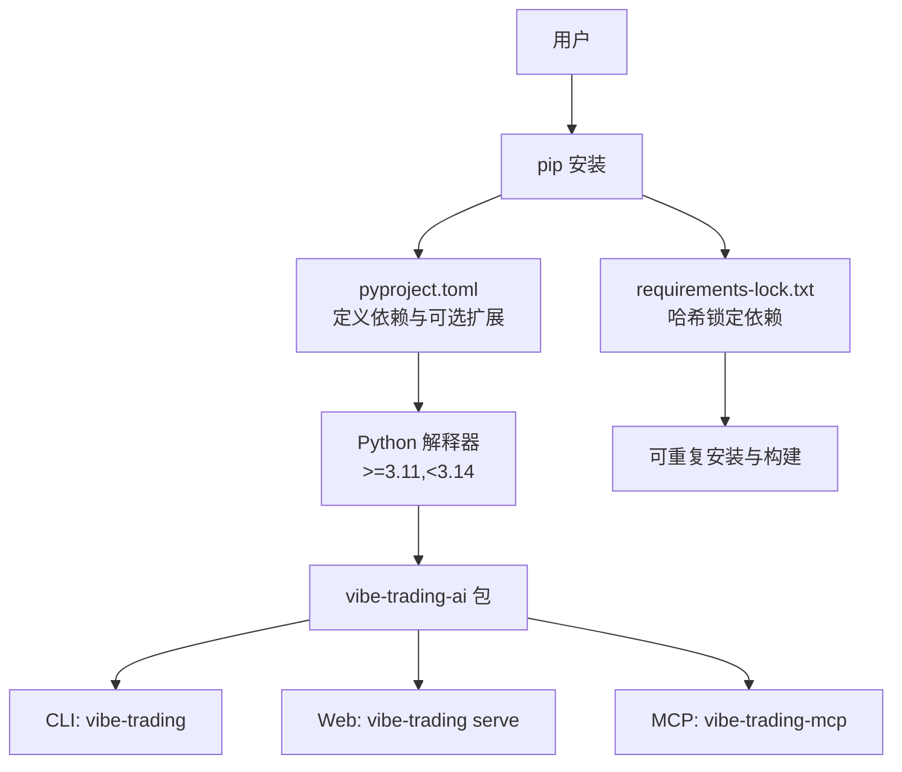
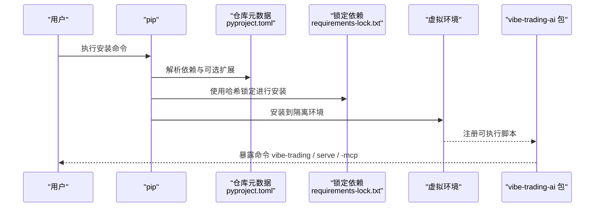
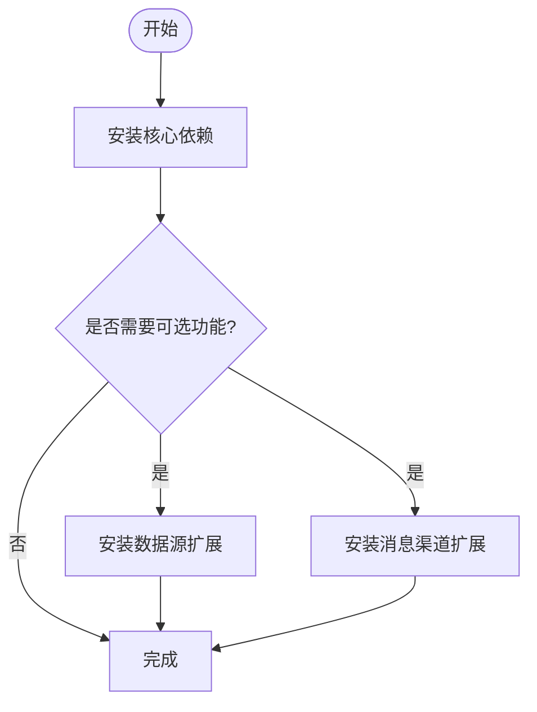

# pip 包管理器安装

<cite>
**本文引用的文件**
- [pyproject.toml](file://pyproject.toml)
- [agent/requirements.txt](file://agent/requirements.txt)
- [requirements-lock.txt](file://requirements-lock.txt)
- [Dockerfile](file://Dockerfile)
- [README.md](file://README.md)
- [.github/workflows/test.yml](file://.github/workflows/test.yml)
- [agent/tests/test_packaging_dependencies.py](file://agent/tests/test_packaging_dependencies.py)
</cite>

## 目录
1. [简介](#简介)
2. [项目结构](#项目结构)
3. [核心组件](#核心组件)
4. [架构总览](#架构总览)
5. [详细组件分析](#详细组件分析)
6. [依赖分析](#依赖分析)
7. [性能考虑](#性能考虑)
8. [故障排除指南](#故障排除指南)
9. [结论](#结论)
10. [附录](#附录)

## 简介
本指南面向通过 pip 安装 Vibe-Trading 的用户，覆盖稳定版与开发版的安装方法、可选依赖（数据源扩展、消息渠道扩展等）、虚拟环境最佳实践、版本管理建议、常见安装问题排查，以及安装成功验证与基本配置检查。Vibe-Trading 的 PyPI 包名为 vibe-trading-ai，提供 CLI、Web 服务与 MCP 服务器三种入口命令。

## 项目结构
- 包元数据与依赖声明位于 pyproject.toml，定义了 Python 版本要求、核心依赖、可选依赖与可执行脚本。
- agent/requirements.txt 是人工维护的核心依赖清单，用于生成锁文件与 CI/Docker 构建。
- requirements-lock.txt 是由 pip-compile 生成的带哈希校验的锁定依赖清单，确保可重复构建。
- Dockerfile 展示了生产镜像中如何分阶段安装依赖并安装可编辑模式的项目包。
- README.md 提供了快速开始、命令说明与升级注意事项。
- .github/workflows/test.yml 在 CI 中验证锁文件的完整性与一致性。
- agent/tests/test_packaging_dependencies.py 包含对可选依赖与核心依赖边界的回归测试。

**图表来源**
- [pyproject.toml:1-80](file://pyproject.toml#L1-L80)
- [requirements-lock.txt:1-6](file://requirements-lock.txt#L1-L6)
- [Dockerfile:32-54](file://Dockerfile#L32-L54)

**章节来源**
- [pyproject.toml:1-80](file://pyproject.toml#L1-L80)
- [agent/requirements.txt:1-69](file://agent/requirements.txt#L1-L69)
- [requirements-lock.txt:1-6](file://requirements-lock.txt#L1-L6)
- [Dockerfile:32-54](file://Dockerfile#L32-L54)
- [README.md:914-926](file://README.md#L914-L926)

## 核心组件
- 包名与命令：PyPI 包名为 vibe-trading-ai；安装后提供三个命令：vibe-trading（CLI/TUI）、vibe-trading serve（Web 服务）、vibe-trading-mcp（MCP 服务器）。
- Python 版本要求：>=3.11,<3.14。
- 核心依赖：包括 LLM 编排（LangChain/LangGraph）、数据处理（pandas/numpy/scipy）、文档读取（openpyxl/python-docx/python-pptx/pypdfium2/Pillow）、机器学习（scikit-learn/joblib）、市场数据（tushare/yfinance/akshare/ccxt/aiohttp）、API 与 SSE（fastapi/uvicorn/websockets/pydantic/sse-starlette）、MCP（fastmcp）、搜索（ddgs）与报告渲染（jinja2/matplotlib/weasyprint）。
- 可选依赖（extras）：按功能分组，如 ibkr、longbridge、mt5、deepseek、copilot、anthropic、openbb、krx、stats、ashare、harmonic、channels 及各个消息渠道（dingtalk、discord、feishu、matrix、mochat、msteams、napcat、qq、slack、telegram、wecom、weixin、whatsapp），以及 dev 开发工具集。

**章节来源**
- [pyproject.toml:1-80](file://pyproject.toml#L1-L80)
- [pyproject.toml:105-237](file://pyproject.toml#L105-L237)
- [agent/requirements.txt:1-69](file://agent/requirements.txt#L1-L69)
- [README.md:914-926](file://README.md#L914-L926)

## 架构总览
下图展示从 pip 安装到可用命令的完整流程，以及可选依赖如何按需启用。

**图表来源**
- [pyproject.toml:84-86](file://pyproject.toml#L84-L86)
- [requirements-lock.txt:1-6](file://requirements-lock.txt#L1-L6)
- [Dockerfile:32-54](file://Dockerfile#L32-L54)

## 详细组件分析

### 安装方式与版本管理
- 安装稳定版：通过 pip 安装 PyPI 上的最新稳定版。
- 安装开发版：从源码克隆仓库并以可编辑模式安装，便于开发与调试。
- 版本管理建议：
  - 使用虚拟环境隔离不同项目或不同版本的依赖。
  - 升级时若遇到导入失败（例如 LangChain 大版本迁移），优先重建 venv 或强制重装。
  - 使用锁定依赖保证可重复安装（CI 与 Docker 均基于哈希锁）。

**章节来源**
- [README.md:914-926](file://README.md#L914-L926)
- [README.md:924-935](file://README.md#L924-L935)
- [Dockerfile:32-54](file://Dockerfile#L32-L54)
- [.github/workflows/test.yml:26-33](file://.github/workflows/test.yml#L26-L33)

### 可选依赖：数据源扩展
- 股票与指数：
  - ashare：A 股数据源（baostock），绕过 HTTP CDN IP 限制。
  - krx：韩国 KRX 日线 OHLCV（pykrx）。
  - stats：计量经济学工具（statsmodels/arch），lazy-import 并在缺失时给出明确提示。
  - harmonic：谐波形态检测（pyharmonics），默认不随基础安装引入。
- 加密货币与外汇：
  - mt5：MetaTrader 5 终端桥接（Windows only），作为外汇/贵金属数据与经纪商连接器。
- 其他数据通道：
  - openbb：OpenBB Workspace 自定义代理桥接（openbb-ai）。

**章节来源**
- [pyproject.toml:105-161](file://pyproject.toml#L105-L161)
- [agent/requirements.txt:35-49](file://agent/requirements.txt#L35-L49)
- [agent/tests/test_packaging_dependencies.py:19-46](file://agent/tests/test_packaging_dependencies.py#L19-L46)

### 可选依赖：消息渠道扩展
- channels：一次性安装所有内置消息渠道 SDK。
- 单渠道 extras：dingtalk、discord、feishu、matrix、mochat、msteams、napcat、qq、slack、telegram、wecom、weixin、whatsapp。
- 这些渠道支持 IM 运行时，可通过 CLI、REST API 与 Web UI 管理状态、启动/停止、配对等。

**章节来源**
- [pyproject.toml:198-266](file://pyproject.toml#L198-L266)
- [agent/tests/test_packaging_dependencies.py:90-111](file://agent/tests/test_packaging_dependencies.py#L90-L111)

### 安装命令示例
- 基础安装（稳定版）：
  - 在虚拟环境中执行安装命令，随后运行初始化向导与 CLI。
- 安装特定可选依赖：
  - 数据源：例如 A 股、KRX、统计工具、谐波检测、MT5、OpenBB。
  - 消息渠道：例如 channels 或单个渠道 extras。
- 开发安装：
  - 从源码克隆后以可编辑模式安装，便于修改与调试。

注意：具体命令请参考仓库中的示例与说明，避免直接粘贴代码片段。

**章节来源**
- [README.md:914-926](file://README.md#L914-L926)
- [README.md:924-935](file://README.md#L924-L935)
- [pyproject.toml:105-237](file://pyproject.toml#L105-L237)

### 虚拟环境最佳实践
- 推荐使用 venv 或 conda 创建隔离环境，避免系统级污染。
- 每个项目或每个 Python 版本建议使用独立环境。
- 升级大版本依赖（如 LangChain 1.x）时，若出现导入错误，优先重建 venv 或强制重装。

**章节来源**
- [README.md:924-935](file://README.md#L924-L935)
- [agent/.gitignore:1-9](file://agent/.gitignore#L1-L9)

### 验证安装与基本配置检查
- 验证命令可用性：
  - 检查 vibe-trading、vibe-trading serve、vibe-trading-mcp 是否可执行。
- 初始化配置：
  - 运行交互式初始化向导，设置模型提供商与密钥。
- 基本健康检查：
  - 启动 Web 服务并通过浏览器访问本地端口，确认页面加载正常。
  - 启动 MCP 服务器并与外部工具集成（如 Claude Desktop、Cursor 等）。

**章节来源**
- [README.md:914-926](file://README.md#L914-L926)
- [agent/cli/onboard.py:393-427](file://agent/cli/onboard.py#L393-L427)

## 依赖分析
- 核心依赖边界：
  - 基础安装不包含谐波检测等重型可选依赖，保持轻量。
  - 某些依赖通过 lazy-import 与明确的 ImportError 提示，引导用户按需安装对应 extra。
- 锁定依赖：
  - 使用 requirements-lock.txt 进行哈希锁定，确保构建可重复性与安全性。
  - CI 会分别校验主锁与渠道锁的完整性。
- 可选依赖分组：
  - 数据源与渠道按功能拆分，便于最小化安装与按需启用。

**图表来源**
- [agent/tests/test_packaging_dependencies.py:19-46](file://agent/tests/test_packaging_dependencies.py#L19-L46)
- [pyproject.toml:105-237](file://pyproject.toml#L105-L237)
- [.github/workflows/test.yml:26-33](file://.github/workflows/test.yml#L26-L33)

**章节来源**
- [agent/tests/test_packaging_dependencies.py:19-46](file://agent/tests/test_packaging_dependencies.py#L19-L46)
- [agent/tests/test_packaging_dependencies.py:90-111](file://agent/tests/test_packaging_dependencies.py#L90-L111)
- [requirements-lock.txt:1-6](file://requirements-lock.txt#L1-L6)
- [.github/workflows/test.yml:26-33](file://.github/workflows/test.yml#L26-L33)

## 性能考虑
- 基础安装保持轻量，避免不必要的重型依赖。
- 可选依赖按需启用，减少安装体积与启动开销。
- 锁定依赖提升构建稳定性与可重复性，降低依赖冲突风险。

[本节为通用指导，无需引用具体文件]

## 故障排除指南
- 依赖冲突：
  - 现象：安装时报错 ResolutionImpossible 或导入失败。
  - 处理：重建虚拟环境；必要时强制重装；检查是否有旧版本残留。
- 网络问题：
  - 现象：下载超时或无法访问 PyPI。
  - 处理：配置国内镜像源；检查代理设置；重试安装。
- 权限问题：
  - 现象：写入系统目录失败。
  - 处理：使用虚拟环境；避免 sudo 安装；检查文件系统权限。
- 平台相关：
  - MT5 仅支持 Windows；其他平台将优雅降级。
  - weasyprint 需要系统库（PDF 渲染），否则退化为 HTML。
- 升级兼容：
  - 从旧版本升级到 LangChain 1.x 后若导入失败，重建 venv 或强制重装。

**章节来源**
- [pyproject.toml:120-125](file://pyproject.toml#L120-L125)
- [Dockerfile:73-84](file://Dockerfile#L73-L84)
- [README.md:924-935](file://README.md#L924-L935)

## 结论
通过 pip 安装 Vibe-Trading 时，建议始终使用虚拟环境隔离依赖，并根据需求选择安装可选扩展。锁定依赖确保构建一致性与安全性。安装完成后，通过初始化向导完成基本配置，并使用 CLI、Web 服务与 MCP 服务器进行验证。遇到问题时，优先检查依赖冲突、网络与权限问题，并按平台特性进行适配。

[本节为总结性内容，无需引用具体文件]

## 附录
- 常用命令参考：
  - 初始化配置、启动 CLI、启动 Web 服务、启动 MCP 服务器。
- 可选依赖速查：
  - 数据源：ashare、krx、stats、harmonic、mt5、openbb。
  - 消息渠道：channels 或各单渠道 extras。
- 版本管理：
  - 升级时如遇兼容性问题，重建 venv 或强制重装。

**章节来源**
- [README.md:914-926](file://README.md#L914-L926)
- [pyproject.toml:105-237](file://pyproject.toml#L105-L237)