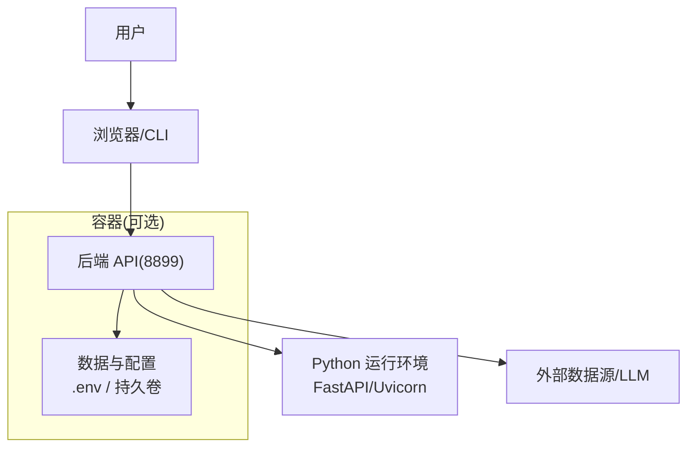
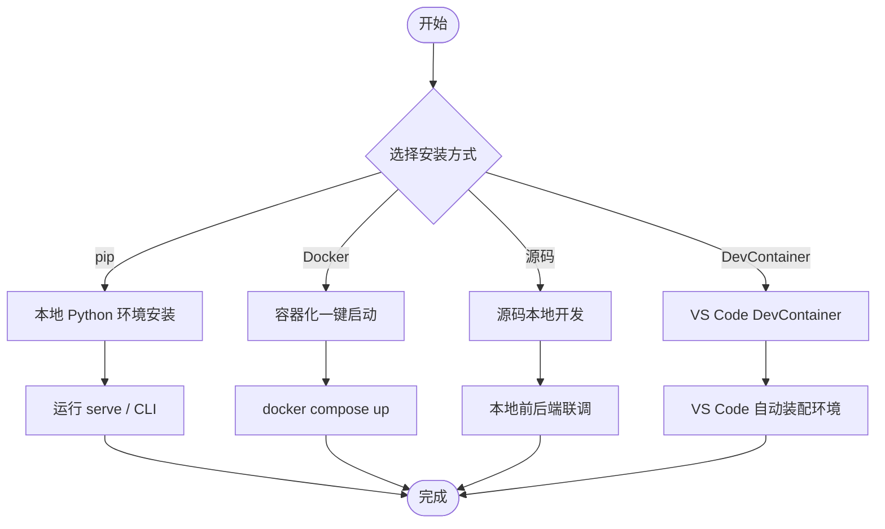
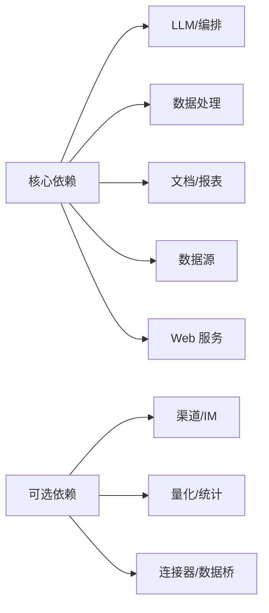

# 安装方式

<cite>
**本文引用的文件**
- [README.md](file://README.md)
- [pyproject.toml](file://pyproject.toml)
- [agent/requirements.txt](file://agent/requirements.txt)
- [Dockerfile](file://Dockerfile)
- [docker-compose.yml](file://docker-compose.yml)
- [.devcontainer/devcontainer.json](file://.devcontainer/devcontainer.json)
- [start.bat](file://start.bat)
</cite>

## 目录
1. [简介](#简介)
2. [项目结构](#项目结构)
3. [核心组件](#核心组件)
4. [架构总览](#架构总览)
5. [详细组件分析](#详细组件分析)
6. [依赖关系分析](#依赖关系分析)
7. [性能与资源建议](#性能与资源建议)
8. [故障排除指南](#故障排除指南)
9. [结论](#结论)
10. [附录](#附录)

## 简介
本指南面向不同使用场景，提供多种安装与部署方式：通过 pip 包管理器安装（含可选依赖）、基于 Docker 的容器化一键启动、源码本地开发环境搭建，以及 DevContainer 容器化开发环境。每种方式均说明适用场景、优缺点对比与常见问题排查方法，帮助你快速选择并落地合适的方案。

## 项目结构
本项目采用前后端分离与多语言工程组织：
- Python 后端与 CLI 入口位于 agent 目录，通过 pyproject 暴露命令行工具
- 前端为 React + Vite，构建产物由后端静态服务托管
- Docker 多阶段构建将前端构建与 Python 运行时解耦，便于安全与体积优化
- Compose 编排后端与可选的前端开发服务，并提供数据持久化卷

图表来源
- [Dockerfile:59-118](file://Dockerfile#L59-L118)
- [docker-compose.yml:1-66](file://docker-compose.yml#L1-L66)

章节来源
- [pyproject.toml:77-87](file://pyproject.toml#L77-L87)
- [Dockerfile:1-118](file://Dockerfile#L1-L118)
- [docker-compose.yml:1-90](file://docker-compose.yml#L1-L90)

## 核心组件
- 包管理与入口
  - 包名：vibe-trading-ai；版本：0.1.13
  - 命令入口：vibe-trading、vibe-trading-mcp
- 后端服务
  - FastAPI + Uvicorn，默认端口 8899，健康检查 /live
- 前端服务
  - Node 22 构建，开发模式端口 5899（Compose profile）
- 数据与配置
  - .env 环境变量注入；持久化卷保存会话、运行结果、上传等
- 可选扩展
  - 通过 extras 安装渠道、数据源、量化统计等可选依赖

章节来源
- [pyproject.toml:1-10](file://pyproject.toml#L1-L10)
- [pyproject.toml:77-87](file://pyproject.toml#L77-L87)
- [Dockerfile:110-118](file://Dockerfile#L110-L118)
- [docker-compose.yml:1-39](file://docker-compose.yml#L1-L39)

## 架构总览
下图展示三种安装方式的总体流程与关键路径：

图表来源
- [pyproject.toml:77-87](file://pyproject.toml#L77-L87)
- [docker-compose.yml:1-90](file://docker-compose.yml#L1-L90)
- [.devcontainer/devcontainer.json:1-39](file://.devcontainer/devcontainer.json#L1-L39)

## 详细组件分析

### 方式一：pip 包管理器安装
适用场景
- 个人研究、策略回测、本地 CLI 交互
- 需要灵活控制 Python 环境与依赖版本

优点
- 轻量、直接，适合开发者与研究者
- 可通过 extras 按需启用功能（如 channels、stats、ashare 等）

缺点
- 需自行管理 Python 版本与系统库（如 weasyprint PDF 渲染所需系统库）
- 跨平台差异较大，Windows 下部分原生依赖可能需额外处理

安装步骤
- 基础安装
  - 使用 pip 安装稳定版或开发版（参考仓库发布页或 PyPI）
  - 安装后可直接使用 vibe-trading 命令
- 可选依赖
  - 根据需求安装 extras，例如：
    - 消息通道：channels
    - 统计分析：stats
    - A 股数据：ashare
    - 其他数据源与连接器：ibkr、longbridge、mt5、deepseek、anthropic、openbb、krx 等
- 运行
  - 启动 Web 服务：vibe-trading serve --host 0.0.0.0 --port 8899
  - 或通过 CLI 执行研究、回测、数据查询等任务

注意事项
- Python 版本要求：>=3.11,<3.14
- 若使用 PDF 报告能力，需确保系统级字体与 weasyprint 依赖可用
- 首次运行会创建用户态数据目录（~/.vibe-trading），用于会话、记忆、技能等

章节来源
- [pyproject.toml:1-10](file://pyproject.toml#L1-L10)
- [pyproject.toml:105-237](file://pyproject.toml#L105-L237)
- [agent/requirements.txt:1-69](file://agent/requirements.txt#L1-L69)
- [Dockerfile:73-86](file://Dockerfile#L73-L86)

### 方式二：Docker 容器化部署
适用场景
- 快速部署、隔离运行、生产或半生产环境
- 希望数据持久化且避免污染宿主机环境

优点
- 一键启动，环境一致性强
- 内置安全加固（只读根文件系统、最小权限、资源限制）
- 数据通过命名卷持久化，更新镜像不丢失

缺点
- 初次拉取镜像耗时
- 调试不如本地直观，需借助日志与端口映射

一键启动
- 在仓库根目录执行：docker compose up -d
- 访问后端：http://127.0.0.1:8899
- 可选前端开发服务：docker compose --profile frontend up -d（端口 5899）

环境变量与 Ollama
- 默认通过 env_file 加载 agent/.env
- 默认 OLLAMA_BASE_URL 指向 host.docker.internal:11434，可在顶层 .env 覆盖
- 如需从本机浏览器登录 OAuth（如 OpenAI Codex），请使用 docker compose exec 进入容器执行认证命令

数据持久化
- 命名卷包括：runs、sessions、home、swarm-runs、uploads
- agent/.env 通过绑定挂载可被 Web UI 编辑并持久化
- 台湾股票快照数据以只读卷挂载到 /data/tw-stock

安全与资源
- 容器以非 root 用户运行，仅保留必要能力（SETUID/SETGID）
- 限制内存、CPU、进程数，提升稳定性

章节来源
- [docker-compose.yml:1-90](file://docker-compose.yml#L1-L90)
- [Dockerfile:59-118](file://Dockerfile#L59-L118)
- [README.md:776-793](file://README.md#L776-L793)

### 方式三：源码开发环境搭建
适用场景
- 二次开发、贡献代码、深度定制
- 需要前后端联调与热重载

前置条件
- Python 3.11+
- Node.js 22（前端开发）
- 推荐安装 Git

步骤
- 克隆仓库并进入目录
- 安装 Python 依赖（开发模式）
  - 使用 pip 安装 editable 模式与 dev extras
- 安装前端依赖并启动开发服务器
  - 进入 frontend 目录，安装依赖后运行开发脚本
- 启动后端服务
  - 使用 vibe-trading serve 或 python api_server.py（Windows 可使用 start.bat）
- 访问前端：http://localhost:5899（默认）

IDE 调试
- 配置 Python 解释器指向当前虚拟环境
- 设置断点调试后端 API 与 CLI
- 前端可使用浏览器开发者工具进行调试

注意
- Windows 用户使用 start.bat 可一键启动前后端两个窗口
- 确保端口未被占用（后端 8899，前端 5899）

章节来源
- [CONTRIBUTING.md:9-11](file://CONTRIBUTING.md#L9-L11)
- [CONTRIBUTING.md:140-155](file://CONTRIBUTING.md#L140-L155)
- [start.bat:1-30](file://start.bat#L1-L30)

### 方式四：DevContainer 容器化开发环境
适用场景
- 团队统一开发环境，减少“在我机器上能跑”的问题
- 使用 VS Code Remote-Containers 工作流

特点
- 基于官方 Python 3.11 开发镜像
- 预装 Node 20（前端构建/开发）
- 自动转发 8899（后端）与 5899（前端）端口
- 首次打开自动安装 Python 与前端依赖

使用步骤
- 在 VS Code 中打开仓库
- 使用“重新打开在容器中”或“Remote-Containers: Rebuild Container”
- 等待 postCreateCommand 完成（安装 Python 包与前端依赖）
- 启动后端与前端服务，按提示访问端口

章节来源
- [.devcontainer/devcontainer.json:1-39](file://.devcontainer/devcontainer.json#L1-L39)

## 依赖关系分析
- 核心依赖
  - LLM 与编排：langchain、langgraph、fastmcp
  - 数据处理：pandas、numpy、scipy、duckdb
  - 文档与报表：openpyxl、python-docx、matplotlib、weasyprint
  - 数据源：tushare、yfinance、akshare、ccxt 等
  - Web 服务：fastapi、uvicorn、websockets、sse-starlette
- 可选依赖（extras）
  - 渠道与 IM：dingtalk、discord、feishu、matrix、mochat、msteams、napcat、qq、slack、telegram、wecom、weixin、whatsapp、channels
  - 数据与量化：ibkr、longbridge、mt5、deepseek、anthropic、openbb、krx、stats、ashare、harmonic
- 锁定与可重复构建
  - Docker 构建使用 requirements-lock.txt 与 requirements-channels-lock.txt 进行哈希校验，保证可重现性

图表来源
- [agent/requirements.txt:1-69](file://agent/requirements.txt#L1-L69)
- [pyproject.toml:105-237](file://pyproject.toml#L105-L237)
- [Dockerfile:31-54](file://Dockerfile#L31-L54)

章节来源
- [agent/requirements.txt:1-69](file://agent/requirements.txt#L1-L69)
- [pyproject.toml:105-237](file://pyproject.toml#L105-L237)
- [Dockerfile:31-54](file://Dockerfile#L31-L54)

## 性能与资源建议
- 本地开发
  - 建议使用虚拟环境隔离依赖
  - 前端开发时关闭不必要的插件以提升响应速度
- Docker 运行
  - 默认限制内存 4g、CPU 2、进程数 512，可根据宿主资源调整
  - 使用命名卷持久化数据，避免重建导致的数据丢失
- 数据缓存
  - 开启数据缓存可减少网络请求与速率限制影响（具体开关见项目配置）

[本节为通用建议，无需特定文件引用]

## 故障排除指南
- pip 安装失败
  - 检查 Python 版本是否满足 >=3.11,<3.14
  - 若 PDF 渲染报错，确认系统已安装 weasyprint 所需的共享库与字体
- Docker 无法访问 Ollama
  - 确认 OLLAMA_BASE_URL 指向宿主机地址（默认 host.docker.internal:11434）
  - Linux 需 Docker Engine ≥ 20.10 并使用 host-gateway
- OAuth 登录问题（Docker）
  - 使用 docker compose exec 进入容器执行 provider login，以便粘贴回调 URL
- 端口冲突
  - 后端默认 8899，前端开发默认 5899，修改端口或释放占用
- 数据未持久化
  - 确认使用了命名卷或正确挂载了 agent/.env 与数据目录
- 权限问题
  - Docker 容器以非 root 运行，确保卷目录权限允许写入

章节来源
- [README.md:776-793](file://README.md#L776-L793)
- [docker-compose.yml:1-66](file://docker-compose.yml#L1-L66)
- [Dockerfile:99-108](file://Dockerfile#L99-L108)

## 结论
- 如果你追求快速体验与一致性，优先选择 Docker 方式
- 如果需要灵活定制与本地调试，选择源码开发或 DevContainer
- 如果仅需 CLI 与回测，pip 安装最简洁
- 无论哪种方式，都建议合理配置环境变量与持久化存储，确保数据安全与可复现

[本节为总结性内容，无需特定文件引用]

## 附录
- 常用命令速查
  - pip 安装：参考 PyPI 与仓库发布说明
  - Docker 启动：docker compose up -d
  - 前端开发：docker compose --profile frontend up -d
  - 本地启动：start.bat（Windows）或分别启动前后端
- 配置文件位置
  - 环境变量：agent/.env（Compose 绑定挂载）
  - 用户数据：~/.vibe-trading（容器内 /home/vibe/.vibe-trading）

[本节为补充信息，无需特定文件引用]